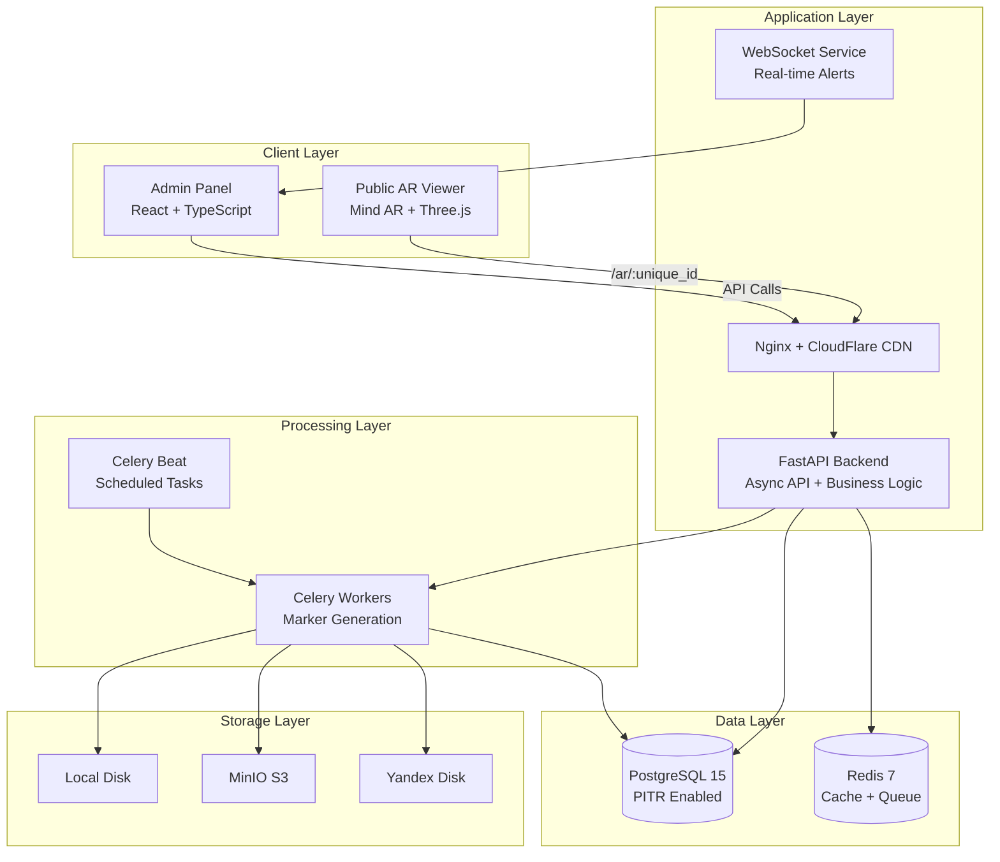
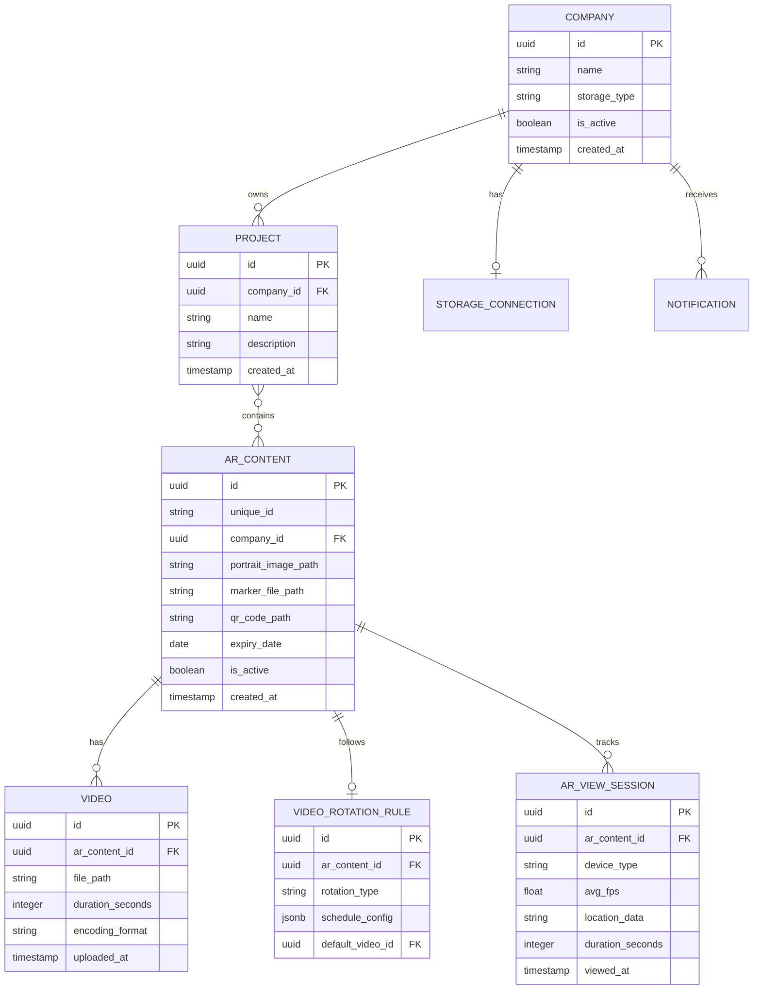
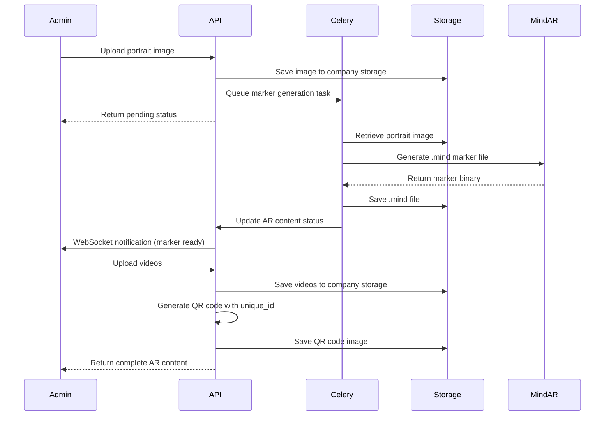
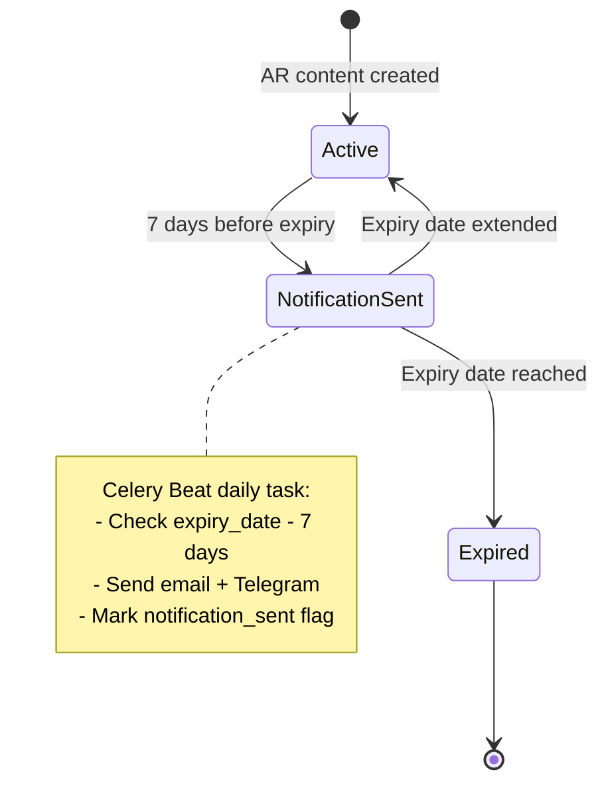

# Vertex AR B2B Platform - Project Documentation

## 1. System Introduction and Purpose

### 1.1 Business Model

Vertex AR is a B2B SaaS platform for creating AR content based on image recognition (NFT markers). Clients (advertising agencies) upload images and videos, the system generates AR markers and QR codes for printing.

**Workflow:**
```
Client → Image + Video → Vertex AR → QR Code + AR Viewer Link → Print → End User Scans → AR Experience
```

### 1.2 Target Audience

- Advertising agencies
- Marketing departments
- POS materials producers
- Exhibition stand creators
- Event agencies

### 1.3 Key Capabilities

- Multi-tenancy (client isolation)
- Mind AR NFT markers (browser-based, no ARCore/ARKit required)
- Video rotation scheduling (daily/date-based/random)
- Automatic notifications (email + Telegram)
- Comprehensive AR viewing analytics
- Multiple storage backends (local/MinIO/Yandex Disk)
- Point-in-time recovery backups
- Production monitoring and alerting

## 2. Technology Stack

| Layer | Technologies |
|-------|-------------|
| Frontend | React 18, TypeScript, Material-UI 5, TailwindCSS, Vite |
| Backend | FastAPI 0.109, SQLAlchemy 2.0 (async), PostgreSQL 15 |
| Queue System | Celery 5.3, Redis 7 |
| AR Engine | Mind AR 1.2.5, Three.js 0.158 |
| Storage | Local Disk, MinIO, Yandex Disk (OAuth) |
| Monitoring | Prometheus, Grafana, Sentry |
| Backups | PITR PostgreSQL, S3 Lifecycle |
| Deployment | Docker Compose, GitHub Actions CI/CD |

## 3. System Architecture

### 3.1 High-Level Architecture



### 3.2 Component Responsibilities

| Component | Responsibility |
|-----------|---------------|
| **Public AR Viewer** | Renders AR content for end users using Mind AR image tracking |
| **Admin Panel** | Management interface for companies, projects, and AR content |
| **FastAPI Backend** | REST API, business logic, authentication, multi-tenant isolation |
| **Celery Workers** | Asynchronous NFT marker generation, video processing, notifications |
| **PostgreSQL** | Primary data store with ACID compliance and PITR backups |
| **Redis** | Caching layer, Celery message broker, real-time data |
| **Storage Backends** | Multi-tenant file storage with pluggable adapters |
| **Nginx** | Reverse proxy, static file serving, SSL termination |

## 4. Data Model

### 4.1 Core Entities



### 4.2 Entity Descriptions

**Company** - Multi-tenant isolation boundary
- Each company has isolated storage
- Storage type: local (Vertex AR only), minio, yandex_disk
- Soft deletion support (is_active flag)

**Project** - Organizational folder within a company
- Groups related AR content
- Many-to-many relationship with AR_CONTENT

**AR_Content** - Core AR experience unit
- Unique public identifier for viewer access
- Portrait image for NFT marker generation
- Generated .mind marker file (Mind AR format)
- Auto-generated QR code for printing
- Expiry date triggers automatic deactivation

**Video** - Media assets for AR playback
- Multiple videos per AR content
- Metadata includes duration and encoding format
- Stored in company-specific storage backend

**Video_Rotation_Rule** - Scheduling logic
- rotation_type: daily_cycle, date_specific, random_daily
- schedule_config: JSON structure for rotation parameters
- default_video_id: fallback when no rule matches

**AR_View_Session** - Analytics tracking
- Device detection (mobile/desktop/tablet)
- Performance metrics (FPS tracking)
- Geographic data (if permitted)
- Session duration

**Storage_Connection** - Multi-tenant storage configuration
- MinIO: endpoint, access_key, secret_key, bucket_name
- Yandex Disk: OAuth tokens, refresh mechanism

**Notification** - Alert management
- Expiry warnings (7 days before)
- System alerts (marker generation failures)
- Delivery channels: email, telegram

## 5. Business Logic and Workflows

### 5.1 AR Content Creation Flow



### 5.2 Video Rotation Resolution Algorithm

**Priority Order:**
1. Date-specific rules (highest priority)
2. Daily cycle rules
3. Default video (fallback)

**Algorithm:**
```
FUNCTION resolve_active_video(ar_content_id, current_datetime):
    rotation_rule = get_rotation_rule(ar_content_id)
    
    IF rotation_rule.type == "date_specific":
        FOR each schedule IN rotation_rule.schedule_config:
            IF current_datetime BETWEEN schedule.start_date AND schedule.end_date:
                RETURN schedule.video_id
    
    IF rotation_rule.type == "daily_cycle":
        day_index = (current_datetime.date - rotation_rule.created_date).days
        videos_count = LENGTH(rotation_rule.schedule_config.video_sequence)
        active_index = day_index MOD videos_count
        RETURN rotation_rule.schedule_config.video_sequence[active_index]
    
    IF rotation_rule.type == "random_daily":
        seed = HASH(ar_content_id + current_datetime.date_string)
        video_id = RANDOM_CHOICE(rotation_rule.schedule_config.video_pool, seed)
        RETURN video_id
    
    RETURN rotation_rule.default_video_id
```

### 5.3 Multi-Tenant Storage Isolation

**Storage Path Strategy:**
```
/storage/
├── content/
│   └── {company_id}/
│       ├── portraits/
│       │   └── {ar_content_id}.jpg
│       ├── markers/
│       │   └── {ar_content_id}.mind
│       ├── videos/
│       │   └── {video_id}.mp4
│       └── qr_codes/
│           └── {ar_content_id}.png
```

**Access Control:**
- All file operations validate company_id ownership
- Storage adapter abstracts backend (local/MinIO/Yandex Disk)
- Signed URLs for temporary public access (AR Viewer)

### 5.4 Expiry and Notification System



## 6. Implementation Roadmap

### Phase 1: Core Infrastructure (Week 1)

**Deliverables:**
- Docker Compose configuration with PostgreSQL 15, Redis 7, Nginx
- FastAPI application skeleton with async support
- Alembic migration system setup
- Local storage implementation for Vertex AR (default company)
- Health check endpoints
- Structured logging with structlog

**Acceptance Criteria:**
- All services start successfully via docker-compose up
- Database migrations run without errors
- Health endpoint returns 200 OK
- Logs output in JSON format

### Phase 2: Authentication & Multi-Tenancy (Week 2)

**Deliverables:**
- JWT-based admin authentication
- Company CRUD endpoints with storage type selection
- Storage connection management (MinIO, Yandex Disk)
- Yandex Disk OAuth flow implementation
- Multi-tenant database queries with company_id filtering

**Acceptance Criteria:**
- Admin can login and receive JWT token
- Company creation automatically provisions storage
- Yandex Disk authorization redirects work correctly
- All queries enforce company_id isolation

### Phase 3: Projects & AR Content (Weeks 3-4)

**Deliverables:**
- Project management endpoints
- AR content upload with portrait image validation
- Mind AR marker generation via Celery workers
- QR code generation with unique_id embedding
- Basic AR Viewer page (HTML + Mind AR.js)
- WebSocket notifications for async task completion

**Acceptance Criteria:**
- Portrait image uploads save to correct company storage
- Celery worker generates valid .mind marker files
- QR codes scan to /ar/{unique_id} URL
- AR Viewer loads marker and displays placeholder video

### Phase 4: Video Management & Scheduling (Week 5)

**Deliverables:**
- Video upload with metadata extraction
- Video rotation rule configuration endpoints
- Active video resolution service
- AR Viewer integration with dynamic video loading
- Video player controls (play/pause/loop)

**Acceptance Criteria:**
- Multiple videos upload to AR content
- Daily cycle rotation advances correctly
- Date-specific rules override daily cycle
- AR Viewer plays correct video based on current date/time

### Phase 5: Analytics & Monitoring (Week 6)

**Deliverables:**
- AR view session tracking endpoint
- Analytics dashboard API (total views, avg FPS, device breakdown)
- Prometheus metrics exporter
- Grafana dashboards for system health
- Sentry integration for error tracking

**Acceptance Criteria:**
- Each AR view creates session record
- Dashboard shows real-time metrics
- Prometheus scrapes FastAPI metrics
- Grafana displays request rate, latency, error rate
- Sentry captures exceptions with context

### Phase 6: Notifications & Backups (Week 7)

**Deliverables:**
- Email notification service (SMTP)
- Telegram bot for alerts
- Celery Beat scheduled task for expiry checks
- PostgreSQL PITR backup configuration
- Automated backup verification script
- S3 offsite backup sync

**Acceptance Criteria:**
- Expiry notifications send 7 days before date
- Telegram bot receives system alerts
- Daily PostgreSQL backups succeed
- Backup restore test completes in <5 minutes

### Phase 7: Production Hardening (Week 8)

**Deliverables:**
- Rate limiting middleware (per company/IP)
- Input validation with Pydantic v2
- React Error Boundaries for all routes
- GitHub Actions CI/CD pipeline
- Security headers (CORS, CSP, HSTS)
- API documentation (OpenAPI/Swagger)

**Acceptance Criteria:**
- Rate limiting blocks excessive requests
- Invalid inputs return 422 with clear errors
- Frontend errors show user-friendly messages
- CI/CD deploys to staging on develop branch merge
- Security scan passes (OWASP checks)

## 7. Development Standards

### 7.1 Backend Code Standards

**Project Structure:**
```
app/
├── __init__.py
├── main.py                 # FastAPI application and lifespan events
├── core/
│   ├── config.py          # Pydantic settings management
│   ├── database.py        # Async SQLAlchemy session factory
│   └── security.py        # JWT encoding/decoding, password hashing
├── models/
│   ├── __init__.py
│   ├── company.py         # Company, StorageConnection models
│   ├── project.py         # Project, ProjectARContent association
│   ├── ar_content.py      # ARContent, Video, VideoRotationRule
│   └── analytics.py       # ARViewSession, Notification
├── schemas/
│   ├── company.py         # Pydantic schemas for Company
│   ├── project.py
│   ├── ar_content.py
│   └── analytics.py
├── api/
│   ├── dependencies.py    # Reusable dependencies (get_db, get_current_user)
│   └── routes/
│       ├── auth.py
│       ├── companies.py
│       ├── projects.py
│       ├── ar_content.py
│       └── analytics.py
├── services/
│   ├── storage/
│   │   ├── base.py        # Abstract storage interface
│   │   ├── local.py       # Local filesystem implementation
│   │   ├── minio.py       # MinIO S3 implementation
│   │   └── yandex_disk.py # Yandex Disk OAuth implementation
│   ├── marker_generator.py
│   ├── video_scheduler.py
│   └── notification.py
├── tasks/
│   ├── celery_app.py      # Celery configuration
│   ├── marker_tasks.py    # Async marker generation
│   └── notification_tasks.py
└── utils/
    ├── qr_code.py
    └── validators.py
```

**Coding Conventions:**
- PEP 8 compliance with Black formatting (line length 100)
- Type hints required for all function signatures
- Async/await for database and I/O operations
- Dependency injection via FastAPI Depends
- Repository pattern for database access
- Structured logging with contextual information

**Example Endpoint:**
```
Endpoint implementation should follow this pattern:
- Router decorator with explicit response model
- Dependency injection for database session and authentication
- Input validation via Pydantic schemas
- Business logic delegated to service layer
- Error handling with appropriate HTTP status codes
- Structured logging of operation start and result
```

### 7.2 Frontend Code Standards

**Project Structure:**
```
src/
├── components/
│   ├── common/            # Reusable UI components
│   ├── layout/            # Layout wrappers (Sidebar, Header)
│   └── ar/                # AR Viewer specific components
├── pages/
│   ├── Dashboard.tsx
│   ├── Companies.tsx
│   ├── Projects.tsx
│   ├── ARContent.tsx
│   └── Analytics.tsx
├── hooks/
│   ├── useAuth.ts
│   ├── useCompanies.ts
│   └── useARContent.ts
├── services/
│   ├── api.ts             # Axios instance configuration
│   ├── authService.ts
│   └── arContentService.ts
├── types/
│   ├── company.ts
│   ├── project.ts
│   └── arContent.ts
├── utils/
│   ├── formatters.ts
│   └── validators.ts
├── store/
│   ├── authStore.ts       # Zustand authentication state
│   └── uiStore.ts
└── App.tsx
```

**Coding Conventions:**
- TypeScript strict mode enabled
- React Hook Form with Zod validation
- Error Boundaries for error handling
- Suspense with lazy loading for code splitting
- Material-UI components with TailwindCSS utilities
- ESLint + Prettier enforcement

**Component Pattern:**
```
Components should follow these guidelines:
- Functional components with TypeScript interfaces
- Custom hooks for data fetching and state management
- Proper error and loading states
- Accessibility attributes (ARIA labels)
- Responsive design with MUI breakpoints
- Memoization for expensive computations
```

### 7.3 Git Workflow

**Branching Strategy:**
```
main               # Production-ready code
└── develop        # Integration branch
    ├── feature/auth-system
    ├── feature/marker-generation
    ├── feature/video-rotation
    ├── bugfix/qr-code-encoding
    └── hotfix/critical-security-patch
```

**Commit Convention (Conventional Commits):**
```
feat: add company storage connection API
fix: resolve marker generation timeout issue
docs: update API reference documentation
style: format code with Black
refactor: extract video scheduler to service layer
test: add unit tests for rotation algorithm
chore: upgrade FastAPI to 0.109.0
perf: optimize database queries with selectinload
ci: add GitHub Actions workflow
```

### 7.4 Cross-Platform Compatibility (Windows ↔ Linux)

**Critical Rules:**
- Use pathlib.Path for all file operations (never string concatenation)
- Configure .gitattributes for LF line endings
- Docker as single source of truth for runtime environment
- WSL2 recommended for Windows development
- User permissions in Docker: uid:gid = 1000:1000
- Database URLs use Docker service names (not localhost)
- All shell scripts must have LF endings and executable permissions

**Path Handling:**
```
Always use pathlib.Path for cross-platform compatibility:
- Path operations use forward slashes internally
- Automatic conversion for OS-specific separators
- Environment variables store absolute paths from project root
- Docker volume mounts use consistent internal paths
```

## 8. API Design

### 8.1 Key Endpoints

| Method | Endpoint | Purpose |
|--------|----------|---------|
| POST | /api/auth/login | Admin authentication, returns JWT |
| GET | /api/auth/me | Get current user profile |
| POST | /api/companies | Create client company with storage config |
| GET | /api/companies | List all companies (paginated) |
| PUT | /api/companies/{id} | Update company settings |
| POST | /api/projects | Create project within company |
| GET | /api/projects | List projects (filtered by company) |
| POST | /api/ar-content | Create AR content with portrait upload |
| POST | /api/ar-content/{id}/generate-marker | Trigger NFT marker generation |
| POST | /api/ar-content/{id}/videos | Upload video to AR content |
| PUT | /api/ar-content/{id}/rotation-rule | Configure video scheduling |
| GET | /api/ar/{unique_id}/active-video | Resolve current active video |
| POST | /api/ar/{unique_id}/track-session | Record AR view session |
| GET | /api/analytics/overview | Dashboard metrics summary |
| GET | /api/analytics/sessions | Detailed session analytics |
| GET | /ar/{unique_id} | Public AR Viewer page |

### 8.2 API Response Format

**Success Response:**
```
Standard successful response structure:
- HTTP status code in 2xx range
- JSON body with data payload
- Pagination metadata when applicable (total, page, per_page)
- Timestamp of response generation
```

**Error Response:**
```
Standard error response structure:
- HTTP status code in 4xx or 5xx range
- JSON body with error details
- Error code for client-side handling
- Human-readable error message
- Validation errors with field-specific details
```

### 8.3 Authentication Flow

**JWT Token Structure:**
```
Token payload contains:
- User ID (sub claim)
- Email address
- Role (admin/superadmin)
- Expiration timestamp (exp claim)
- Issued at timestamp (iat claim)

Access token validity: 24 hours
Refresh token validity: 30 days
```

**Authorization Middleware:**
```
All protected endpoints:
- Extract JWT from Authorization header (Bearer scheme)
- Validate token signature and expiration
- Load user from database
- Inject current_user into endpoint dependencies
- Return 401 Unauthorized if validation fails
```

## 9. Deployment Architecture

### 9.1 Docker Compose Services

**Service Configuration:**
```
postgres:
  - Image: postgres:15-alpine
  - Volume: postgres_data for persistence
  - PITR enabled with WAL archiving
  - Health check: pg_isready

redis:
  - Image: redis:7-alpine
  - Volume: redis_data for persistence
  - Max memory policy: allkeys-lru
  - Health check: redis-cli ping

app:
  - Build: FastAPI application
  - Workers: Uvicorn with 4 worker processes
  - Depends on: postgres, redis
  - Environment: production settings
  - Health check: /api/health/status

celery-worker:
  - Build: Same image as app
  - Workers: 2 concurrent workers
  - Queues: markers, notifications, default
  - Depends on: postgres, redis

celery-beat:
  - Build: Same image as app
  - Scheduler: periodic task execution
  - Depends on: redis

nginx:
  - Image: nginx:alpine
  - Configuration: reverse proxy to app
  - Static files: frontend build, QR codes
  - SSL termination: Let's Encrypt certificates
  - Rate limiting: 100 requests/minute per IP

postgres-backup:
  - Image: postgres:15-alpine
  - Schedule: Daily PITR backups via cron
  - Destination: S3-compatible storage
  - Retention: 30 days rolling window
```

### 9.2 Environment Variables

**Production Configuration:**
```
Database:
- DATABASE_URL: PostgreSQL async connection string
- DB_POOL_SIZE: Connection pool size (default: 20)
- DB_MAX_OVERFLOW: Additional connections (default: 10)

Redis:
- REDIS_URL: Redis connection string
- REDIS_MAX_CONNECTIONS: Pool size (default: 50)

Storage:
- STORAGE_TYPE: local, minio, or yandex_disk
- MINIO_ENDPOINT: MinIO server URL
- MINIO_ACCESS_KEY: MinIO access credentials
- MINIO_SECRET_KEY: MinIO secret credentials
- YANDEX_OAUTH_CLIENT_ID: Yandex OAuth app ID
- YANDEX_OAUTH_CLIENT_SECRET: Yandex OAuth secret

Authentication:
- SECRET_KEY: JWT signing key (generate securely)
- ACCESS_TOKEN_EXPIRE_MINUTES: Token validity (default: 1440)

Notifications:
- SMTP_HOST: Email server hostname
- SMTP_PORT: Email server port
- SMTP_USERNAME: SMTP authentication username
- SMTP_PASSWORD: SMTP authentication password
- TELEGRAM_BOT_TOKEN: Telegram bot API token
- ADMIN_EMAIL: System administrator email

Monitoring:
- SENTRY_DSN: Sentry error tracking URL
- PROMETHEUS_MULTIPROC_DIR: Metrics storage directory
```

### 9.3 CI/CD Pipeline

**GitHub Actions Workflow:**

**Test Stage:**
- Trigger: Push to any branch, pull requests
- Steps:
  - Checkout code
  - Start PostgreSQL and Redis test containers
  - Run backend tests with pytest and coverage reporting
  - Run frontend tests with Jest
  - Upload coverage reports to Codecov
  - Fail if coverage below 80%

**Build Stage:**
- Trigger: Test stage passes
- Steps:
  - Build Docker images with version tags
  - Run security scans (Trivy for vulnerabilities)
  - Push images to container registry
  - Tag with commit SHA and branch name

**Deploy to Staging:**
- Trigger: Merge to develop branch
- Steps:
  - SSH to staging server
  - Pull latest develop branch
  - Run database migrations with Alembic
  - Stop existing containers gracefully
  - Start updated containers with new images
  - Run smoke tests against staging endpoints
  - Send Slack notification on success/failure

**Deploy to Production:**
- Trigger: Merge to main branch
- Steps:
  - SSH to production server
  - Create backup of current database
  - Pull latest main branch
  - Run database migrations with Alembic
  - Blue-green deployment: start new containers
  - Health check validation
  - Switch traffic to new containers
  - Keep old containers for 15 minutes (rollback window)
  - Run automated backup verification
  - Send alert notifications to admin team

## 10. Monitoring and Observability

### 10.1 Metrics Collection

**Prometheus Metrics:**
```
Application Metrics:
- http_requests_total: Total HTTP requests by endpoint and status
- http_request_duration_seconds: Request latency histogram
- celery_task_duration_seconds: Task execution time
- active_ar_sessions: Current AR viewing sessions
- marker_generation_queue_length: Pending marker generation tasks

System Metrics:
- process_cpu_usage: CPU utilization percentage
- process_memory_bytes: Memory consumption
- database_connection_pool_size: Active database connections
- redis_connected_clients: Redis client connections

Business Metrics:
- companies_total: Total registered companies
- ar_content_total: Total AR content items
- ar_views_total: Total AR viewing sessions
- video_uploads_total: Total uploaded videos
```

### 10.2 Grafana Dashboards

**System Health Dashboard:**
- Request rate per endpoint (requests/second)
- Error rate percentage
- P50, P95, P99 latency percentiles
- CPU and memory usage trends
- Database connection pool utilization
- Celery worker status and queue depth

**Business Analytics Dashboard:**
- Daily active AR content views
- Top performing AR content by views
- Average session duration
- Device type distribution (mobile/desktop/tablet)
- Geographic distribution map
- Video rotation rule effectiveness

### 10.3 Alerting Rules

**Critical Alerts (immediate notification):**
- API error rate exceeds 5% for 5 minutes
- Database connection pool exhausted
- Celery workers offline for 2 minutes
- Disk space below 10% on any volume
- SSL certificate expires within 7 days

**Warning Alerts (notification during business hours):**
- API P95 latency exceeds 2 seconds for 10 minutes
- Celery queue depth exceeds 100 tasks
- Failed backup job
- AR content expiring within 7 days (sent to company admins)

**Notification Channels:**
- Email: admin team distribution list
- Telegram: dedicated alerts channel
- Slack: #vertex-ar-alerts channel (optional)

## 11. Backup and Recovery

### 11.1 PostgreSQL PITR Strategy

**Continuous Archiving:**
- WAL (Write-Ahead Log) archiving enabled
- Archive destination: S3-compatible storage
- Archive frequency: Every WAL segment (16MB) or 5 minutes
- Retention policy: 30 days of continuous archive

**Base Backup Schedule:**
- Full backup: Daily at 02:00 UTC
- Backup method: pg_basebackup with compression
- Backup storage: S3 with versioning enabled
- Retention: 7 daily backups, 4 weekly backups, 12 monthly backups

**Recovery Procedure:**
```
Point-in-time recovery process:
1. Stop application services
2. Restore latest base backup from S3
3. Configure recovery.conf with target timestamp
4. Apply WAL archives up to target point
5. Verify data integrity with checksums
6. Restart PostgreSQL in recovery mode
7. Promote to primary after validation
8. Restart application services
9. Validate API health checks

Expected RTO (Recovery Time Objective): 30 minutes
Expected RPO (Recovery Point Objective): 5 minutes
```

### 11.2 Storage Backup

**Multi-Tenant Storage:**
- Each company's storage backed up independently
- Backup frequency: Daily incremental, weekly full
- MinIO/Yandex Disk: Native versioning enabled
- Local storage: rsync to offsite S3 bucket

**Backup Verification:**
- Automated restore test: Weekly random sample
- Checksum validation: Every backup completion
- Integrity report: Sent to admin team

## 12. Security Considerations

### 12.1 Authentication and Authorization

**JWT Security:**
- Algorithm: RS256 (asymmetric encryption)
- Token rotation: Access token refresh before expiration
- Token revocation: Maintain blacklist in Redis
- Secure storage: HttpOnly cookies for web clients

**Multi-Tenant Isolation:**
- Database queries enforce company_id filtering
- Storage paths validate company ownership
- API endpoints verify user company membership
- Cross-company data access prohibited

### 12.2 Data Protection

**Sensitive Data Handling:**
- OAuth tokens encrypted at rest (AES-256)
- Database encryption: PostgreSQL TDE (Transparent Data Encryption)
- File upload validation: MIME type verification, size limits
- Input sanitization: Pydantic validation, SQL injection prevention

**Network Security:**
- HTTPS enforcement: Redirect HTTP to HTTPS
- CORS configuration: Whitelist allowed origins
- CSP headers: Prevent XSS attacks
- Rate limiting: Per-IP and per-company quotas

## 13. Performance Optimization

### 13.1 Database Optimization

**Query Optimization:**
- Indexing strategy: Compound indexes on frequently queried columns
- Query patterns: SQLAlchemy selectinload for eager loading
- Connection pooling: AsyncPG with pool size 20
- Read replicas: Future consideration for analytics queries

**Caching Strategy:**
```
Cache Layers:
1. Redis cache for active video resolution (TTL: 1 hour)
2. CDN cache for static AR Viewer assets (TTL: 7 days)
3. Application-level cache for company settings (TTL: 5 minutes)

Cache invalidation triggers:
- Video rotation rule updates
- AR content deactivation
- Company storage configuration changes
```

### 13.2 Frontend Optimization

**Asset Delivery:**
- Code splitting: Lazy load routes with React.lazy
- Image optimization: WebP format with fallback
- Bundle size: Target <500KB initial load
- CDN distribution: CloudFlare for static assets

**AR Viewer Performance:**
- Mind AR model size: Optimize to <2MB per marker
- Video streaming: Adaptive bitrate (HLS/DASH)
- Texture compression: GPU-compatible formats
- FPS monitoring: Track and report performance metrics

## 14. Scalability Considerations

### 14.1 Horizontal Scaling Strategy

**Application Layer:**
- Stateless FastAPI workers: Scale behind load balancer
- Celery workers: Add workers based on queue depth
- Nginx instances: Load balancing with HAProxy

**Database Layer:**
- PostgreSQL read replicas for analytics queries
- Connection pooling with PgBouncer
- Partitioning strategy for AR view sessions (monthly partitions)

### 14.2 Capacity Planning

**Current Design Limits:**
- Target capacity: 10,000 AR content items
- Concurrent AR viewers: 1,000 simultaneous sessions
- Monthly views: 1,000,000 tracked sessions
- Storage per company: 100GB average

**Scaling Triggers:**
```
Scale application when:
- CPU utilization exceeds 70% for 10 minutes
- Request queue depth exceeds 50

Scale Celery workers when:
- Marker generation queue exceeds 20 tasks
- Average task wait time exceeds 5 minutes

Scale database when:
- Connection pool utilization exceeds 80%
- Query latency P95 exceeds 500ms
```

## 15. Testing Strategy

### 15.1 Backend Testing

**Unit Tests:**
- Coverage target: 80% minimum
- Framework: pytest with pytest-asyncio
- Mocking: Database fixtures, storage adapters
- Test isolation: Rollback transactions after each test

**Integration Tests:**
- Database integration: Real PostgreSQL container
- API endpoint tests: TestClient with authenticated requests
- Celery task tests: Eager mode execution
- Storage tests: Mock S3 backend (moto library)

**Test Organization:**
```
tests/
├── unit/
│   ├── test_services/
│   ├── test_models/
│   └── test_utils/
├── integration/
│   ├── test_api/
│   ├── test_tasks/
│   └── test_storage/
└── e2e/
    ├── test_ar_content_workflow.py
    └── test_video_rotation.py
```

### 15.2 Frontend Testing

**Component Tests:**
- Framework: Jest with React Testing Library
- Coverage target: 70% minimum
- Snapshot testing: Critical UI components
- User interaction: Simulate clicks, form submissions

**End-to-End Tests:**
- Framework: Playwright
- Scenarios: Complete user workflows (login, upload, configure)
- Browser coverage: Chrome, Firefox, Safari
- Mobile testing: Responsive design validation

## 16. Documentation Structure

### 16.1 Technical Documentation

**Documentation Repository:**
```
docs/
├── README.md                    # Quick start guide
├── CHANGELOG.md                 # Release notes and version history
├── 01-architecture.md           # System architecture overview
├── 02-api-reference.md          # OpenAPI/Swagger specification
├── 03-deployment.md             # Docker and CI/CD setup
├── 04-monitoring.md             # Prometheus and Grafana configuration
├── 05-backup-recovery.md        # PITR procedures and restore guides
├── 06-onboarding.md             # Developer onboarding checklist
├── 07-runbook.md                # Operational procedures and troubleshooting
└── diagrams/                    # Mermaid and architecture diagrams
```

### 16.2 API Documentation

**OpenAPI Specification:**
- Auto-generated from FastAPI route definitions
- Interactive documentation: Swagger UI at /docs
- Alternative documentation: ReDoc at /redoc
- Schema validation: Request/response examples
- Authentication: JWT bearer token instructions

**Endpoint Documentation Requirements:**
- Description: Clear purpose statement
- Parameters: Type, required/optional, validation rules
- Request body: JSON schema with examples
- Response codes: Success and error scenarios
- Error messages: Common failure cases and resolutions

## 17. Future Enhancements

### 17.1 Planned Features

**Phase 2 Roadmap (Months 3-6):**
- Advanced analytics: Heatmaps of AR interaction zones
- Multi-language support: i18n for Admin Panel and AR Viewer
- White-label branding: Custom logos and colors per company
- API webhooks: Event notifications for integrations
- Mobile SDK: Native AR experience for iOS/Android

**Phase 3 Roadmap (Months 6-12):**
- AI-powered marker optimization: Automatic image enhancement
- Video transcoding pipeline: Adaptive bitrate generation
- Collaborative editing: Multi-user project management
- Advanced scheduling: Geofencing and audience targeting
- Enterprise SSO: SAML and OAuth2 integration

### 17.2 Technical Debt Tracking

**Known Limitations:**
- Video upload limited to 500MB (requires chunked upload)
- Marker generation timeout at 5 minutes (needs optimization)
- Single-region deployment (no multi-region support)
- Manual Yandex Disk token refresh (requires automation)

**Refactoring Opportunities:**
- Extract storage layer to separate microservice
- Implement event-driven architecture with message queue
- Migrate to Kubernetes for orchestration
- Add GraphQL API alongside REST

## Confidence Assessment

**Confidence Level: High**

**Confidence Basis:**
- Clear business requirements with well-defined workflows
- Proven technology stack (FastAPI, React, PostgreSQL)
- Established AR framework (Mind AR) with documented capabilities
- Standard B2B SaaS patterns (multi-tenancy, storage abstraction)
- Comprehensive roadmap with realistic timelines
- Production-ready monitoring and backup strategies

**Key Success Factors:**
- Modular architecture allows incremental implementation
- Docker-based deployment ensures environment parity
- Multi-tenant isolation prevents cross-contamination
- PITR backups provide robust data protection
- Scalability considerations built into initial design

**Risk Mitigation:**
- Mind AR marker generation timeout addressed with Celery async processing
- Storage backend abstraction allows migration between providers
- Comprehensive testing strategy ensures reliability
- Monitoring and alerting enable proactive issue detection- Comprehensive testing strategy ensures reliability
