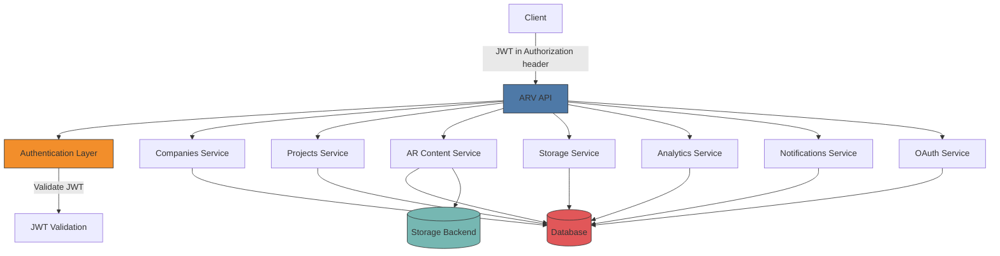

# API Reference

<cite>
**Referenced Files in This Document**   
- [main.py](file://app/main.py)
- [companies.py](file://app/api/routes/companies.py)
- [projects.py](file://app/api/routes/projects.py)
- [ar_content.py](file://app/api/routes/ar_content.py)
- [storage.py](file://app/api/routes/storage.py)
- [analytics.py](file://app/api/routes/analytics.py)
- [notifications.py](file://app/api/routes/notifications.py)
- [rotation.py](file://app/api/routes/rotation.py)
- [oauth.py](file://app/api/routes/oauth.py)
- [public.py](file://app/api/routes/public.py)
- [config.py](file://app/core/config.py)
- [database.py](file://app/core/database.py)
- [nginx.conf](file://nginx/nginx.conf)
</cite>

## Table of Contents
1. [Introduction](#introduction)
2. [API Structure and Authentication](#api-structure-and-authentication)
3. [Companies API](#companies-api)
4. [Projects API](#projects-api)
5. [AR Content API](#ar-content-api)
6. [Storage API](#storage-api)
7. [Analytics API](#analytics-api)
8. [Notifications API](#notifications-api)
9. [Video Rotation API](#video-rotation-api)
10. [OAuth API](#oauth-api)
11. [Public API](#public-api)
12. [Client Implementation Guidelines](#client-implementation-guidelines)
13. [Security Considerations](#security-considerations)
14. [Rate Limiting](#rate-limiting)
15. [Error Handling](#error-handling)
16. [Versioning](#versioning)

## Introduction
The ARV platform provides a comprehensive RESTful API for managing augmented reality content, companies, projects, and associated resources. This API documentation details all available endpoints, their request/response schemas, authentication mechanisms, and usage patterns. The platform enables B2B customers to create AR experiences based on image recognition (NFT markers) with robust storage, analytics, and notification capabilities.

The API follows REST principles with JSON payloads and is built using FastAPI, providing automatic OpenAPI documentation at `/docs` and `/redoc` endpoints. All endpoints are designed for programmatic access by client applications, administrative interfaces, and integration with third-party systems.

## API Structure and Authentication



**Diagram sources**
- [main.py](file://app/main.py#L84-L285)
- [config.py](file://app/core/config.py#L49-L53)

The ARV platform API uses JWT (JSON Web Token) for authentication and authorization. All protected endpoints require a valid JWT token in the Authorization header using the Bearer scheme.

### Authentication Mechanism
- **Token Type**: JWT (JSON Web Token)
- **Algorithm**: HS256
- **Token Expiration**: 1440 minutes (24 hours)
- **Header Format**: `Authorization: Bearer <token>`

The JWT secret key is configured in the application settings and should be a secure random string of at least 32 characters. The token payload typically contains user identity information and permissions that are validated on each request.

### Base URL
All API endpoints are prefixed with `/api` as defined in the application configuration. The complete base URL structure is:
```
https://your-domain.com/api/<endpoint>
```

### Content Type
All requests and responses use JSON format with the appropriate Content-Type header:
```
Content-Type: application/json
```

For file uploads, the content type will be `multipart/form-data`.

**Section sources**
- [main.py](file://app/main.py#L84-L285)
- [config.py](file://app/core/config.py#L49-L53)

## Companies API

The Companies API manages organizational entities within the ARV platform. Each company represents a client organization with its own projects, AR content, and storage configuration.

### Endpoint Summary
| Method | Endpoint | Description |
|--------|---------|-------------|
| POST | `/api/companies` | Create a new company |
| GET | `/api/companies` | List all companies |
| GET | `/api/companies/{company_id}` | Get company details |
| PUT | `/api/companies/{company_id}` | Update company |
| DELETE | `/api/companies/{company_id}` | Delete company |
| GET | `/api/companies/{company_id}/analytics` | Get company analytics |

### Create Company
Creates a new company with associated storage configuration.

**Endpoint**: `POST /api/companies`

**Request Body**:
```json
{
  "name": "string",
  "contact_email": "string",
  "contact_phone": "string",
  "telegram_chat_id": "string",
  "storage_connection_id": "integer",
  "storage_path": "string",
  "subscription_tier": "string",
  "subscription_expires_at": "string",
  "storage_quota_gb": "integer",
  "projects_limit": "integer",
  "notes": "string"
}
```

**Response**:
```json
{
  "id": "integer",
  "name": "string",
  "slug": "string",
  "contact_email": "string",
  "contact_phone": "string",
  "telegram_chat_id": "string",
  "storage_connection_id": "integer",
  "storage_path": "string",
  "subscription_tier": "string",
  "subscription_expires_at": "string",
  "storage_quota_gb": "integer",
  "projects_limit": "integer",
  "notes": "string",
  "is_default": "boolean",
  "created_at": "string",
  "updated_at": "string"
}
```

**Error Responses**:
- `400 Bad Request`: Invalid input data or attempting to use default storage
- `404 Not Found`: Storage connection not found
- `422 Unprocessable Entity`: Validation errors

**Example Request**:
```bash
curl -X POST https://api.arvplatform.com/api/companies \
  -H "Authorization: Bearer <token>" \
  -H "Content-Type: application/json" \
  -d '{
    "name": "Acme Corporation",
    "contact_email": "contact@acme.com",
    "storage_connection_id": 2,
    "subscription_tier": "premium"
  }'
```

### List Companies
Retrieves a list of all companies, with optional inclusion of the default company.

**Endpoint**: `GET /api/companies?include_default=false`

**Query Parameters**:
- `include_default` (boolean): Whether to include the default Vertex AR company

**Response**:
Array of company objects with the same structure as the create response.

### Get Company
Retrieves detailed information about a specific company.

**Endpoint**: `GET /api/companies/{company_id}`

**Path Parameters**:
- `company_id` (integer): The ID of the company to retrieve

**Response**: Single company object.

### Update Company
Updates company information with partial data.

**Endpoint**: `PUT /api/companies/{company_id}`

**Request Body**: JSON object with fields to update.

**Response**:
```json
{
  "status": "updated"
}
```

### Delete Company
Removes a company from the system.

**Endpoint**: `DELETE /api/companies/{company_id}`

**Response**:
```json
{
  "status": "deleted"
}
```

### Company Analytics
Retrieves analytics data for a specific company.

**Endpoint**: `GET /api/companies/{company_id}/analytics`

**Response**:
```json
{
  "company_id": "integer",
  "total_views": "integer",
  "unique_sessions": "integer",
  "active_projects": "integer",
  "active_content": "integer"
}
```

**Section sources**
- [companies.py](file://app/api/routes/companies.py#L13-L137)

## Projects API

The Projects API manages AR projects within companies. Each project contains AR content and has its own lifecycle, subscription, and configuration.

### Endpoint Summary
| Method | Endpoint | Description |
|--------|---------|-------------|
| POST | `/api/projects` | Create a new project |
| POST | `/api/companies/{company_id}/projects` | Create project for company |
| PUT | `/api/projects/{project_id}` | Update project |
| DELETE | `/api/projects/{project_id}` | Delete project |
| POST | `/api/projects/{project_id}/extend` | Extend project duration |

### Create Project
Creates a new project within the platform.

**Endpoint**: `POST /api/projects`

**Request Body**:
```json
{
  "company_id": "integer",
  "name": "string",
  "slug": "string",
  "folder_path": "string",
  "description": "string",
  "project_type": "string",
  "subscription_type": "string",
  "starts_at": "string",
  "expires_at": "string",
  "auto_renew": "boolean",
  "status": "string",
  "notify_before_expiry_days": "integer",
  "tags": "string",
  "metadata": "object"
}
```

**Response**:
```json
{
  "id": "integer",
  "slug": "string"
}
```

### Create Project for Company
Convenience endpoint to create a project within a specific company.

**Endpoint**: `POST /api/companies/{company_id}/projects`

This endpoint automatically sets the company_id field and delegates to the main create project endpoint.

### Update Project
Updates project information with partial data.

**Endpoint**: `PUT /api/projects/{project_id}`

**Request Body**: JSON object with fields to update.

**Response**:
```json
{
  "status": "updated"
}
```

### Delete Project
Removes a project from the system.

**Endpoint**: `DELETE /api/projects/{project_id}`

**Response**:
```json
{
  "status": "deleted"
}
```

### Extend Project
Extends the expiration date of a project by a specified number of days.

**Endpoint**: `POST /api/projects/{project_id}/extend`

**Request Body**:
```json
{
  "days": "integer"
}
```

**Response**:
```json
{
  "expires_at": "string"
}
```

**Section sources**
- [projects.py](file://app/api/routes/projects.py#L11-L145)

## AR Content API

The AR Content API manages augmented reality content, including image uploads, video associations, and marker generation.

### Endpoint Summary
| Method | Endpoint | Description |
|--------|---------|-------------|
| POST | `/api/ar-content` | Create AR content |
| GET | `/api/projects/{project_id}/ar-content` | List AR content for project |
| POST | `/api/ar-content/{content_id}/videos` | Upload video for AR content |
| POST | `/api/ar-content/{content_id}/generate-marker` | Generate AR marker |
| GET | `/api/ar/{unique_id}/active-video` | Get active video by unique ID |

### Create AR Content
Creates a new AR content entry with an uploaded image.

**Endpoint**: `POST /api/ar-content`

**Request (multipart/form-data)**:
- `company_id` (integer): Company ID
- `project_id` (integer): Project ID
- `title` (string): Content title
- `description` (string, optional): Content description
- `image` (file): Image file to upload

**Response**:
```json
{
  "id": "integer",
  "unique_id": "string",
  "image_url": "string",
  "marker_status": "string",
  "task_id": "string"
}
```

The marker generation is processed asynchronously, and the task_id can be used to track progress.

### List AR Content for Project
Retrieves all AR content associated with a specific project.

**Endpoint**: `GET /api/projects/{project_id}/ar-content`

**Response**:
```json
{
  "items": [
    {
      "id": "integer",
      "unique_id": "string",
      "title": "string",
      "marker_status": "string",
      "image_url": "string"
    }
  ]
}
```

### Upload Video
Uploads a video file to be associated with AR content.

**Endpoint**: `POST /api/ar-content/{content_id}/videos`

**Request (multipart/form-data)**:
- `file` (file): Video file to upload
- `title` (string, optional): Video title
- `is_active` (boolean): Whether this video should be the active one

**Response**:
```json
{
  "id": "integer",
  "video_url": "string",
  "is_active": "boolean"
}
```

### Generate Marker
Triggers the generation of an AR marker for content.

**Endpoint**: `POST /api/ar-content/{content_id}/generate-marker`

**Response**:
```json
{
  "task_id": "string",
  "status": "string"
}
```

### Get Active Video
Retrieves the URL of the active video for AR content by unique ID.

**Endpoint**: `GET /api/ar/{unique_id}/active-video`

**Response**:
```json
{
  "video_url": "string"
}
```

**Section sources**
- [ar_content.py](file://app/api/routes/ar_content.py#L15-L184)

## Storage API

The Storage API manages storage connections and configurations for companies and content.

### Endpoint Summary
| Method | Endpoint | Description |
|--------|---------|-------------|
| POST | `/api/storage/connections` | Create storage connection |
| POST | `/api/storage/connections/{connection_id}/test` | Test storage connection |
| PUT | `/api/companies/{company_id}/storage` | Set company storage settings |

### Create Storage Connection
Creates a new storage connection to external storage providers.

**Endpoint**: `POST /api/storage/connections`

**Request Body**:
```json
{
  "name": "string",
  "provider": "string",
  "credentials": "object",
  "metadata": "object",
  "base_path": "string",
  "is_default": "boolean"
}
```

**Response**: Storage connection object with the same structure.

### Test Storage Connection
Tests the connectivity and authentication of a storage connection.

**Endpoint**: `POST /api/storage/connections/{connection_id}/test`

**Response**:
```json
{
  "status": "string",
  "error": "string"
}
```

### Set Company Storage
Configures the storage settings for a company.

**Endpoint**: `PUT /api/companies/{company_id}/storage`

**Request Body**:
```json
{
  "storage_connection_id": "integer",
  "storage_path": "string"
}
```

**Response**:
```json
{
  "status": "updated"
}
```

**Section sources**
- [storage.py](file://app/api/routes/storage.py#L12-L63)

## Analytics API

The Analytics API provides view tracking and engagement metrics for AR content.

### Endpoint Summary
| Method | Endpoint | Description |
|--------|---------|-------------|
| GET | `/api/analytics/overview` | Get platform analytics overview |
| GET | `/api/analytics/companies/{company_id}` | Get company analytics |
| GET | `/api/analytics/projects/{project_id}` | Get project analytics |
| GET | `/api/analytics/ar-content/{content_id}` | Get AR content analytics |
| POST | `/api/analytics/ar-session` | Track AR session |

### Analytics Overview
Retrieves platform-wide analytics metrics.

**Endpoint**: `GET /api/analytics/overview`

**Response**:
```json
{
  "total_views": "integer",
  "unique_sessions": "integer",
  "active_content": "integer",
  "storage_used_gb": "number"
}
```

### Company Analytics
Retrieves analytics for a specific company.

**Endpoint**: `GET /api/analytics/companies/{company_id}`

**Response**:
```json
{
  "company_id": "integer",
  "views_30_days": "integer"
}
```

### Project Analytics
Retrieves analytics for a specific project.

**Endpoint**: `GET /api/analytics/projects/{project_id}`

**Response**:
```json
{
  "project_id": "integer",
  "views_30_days": "integer"
}
```

### AR Content Analytics
Retrieves analytics for specific AR content.

**Endpoint**: `GET /api/analytics/ar-content/{content_id}`

**Response**:
```json
{
  "ar_content_id": "integer",
  "views_30_days": "integer"
}
```

### Track AR Session
Records an AR viewing session for analytics purposes.

**Endpoint**: `POST /api/analytics/ar-session`

**Request Body**:
```json
{
  "portrait_id": "string",
  "ar_content_unique_id": "string",
  "ar_content_id": "integer",
  "session_id": "string",
  "user_agent": "string",
  "device_type": "string",
  "browser": "string",
  "os": "string",
  "tracking_quality": "string",
  "video_played": "boolean"
}
```

**Response**:
```json
{
  "status": "tracked"
}
```

**Section sources**
- [analytics.py](file://app/api/routes/analytics.py#L13-L93)

## Notifications API

The Notifications API manages notification sending and tracking.

### Endpoint Summary
| Method | Endpoint | Description |
|--------|---------|-------------|
| GET | `/api/notifications` | List notifications |
| POST | `/api/notifications/test` | Send test notifications |

### List Notifications
Retrieves a list of sent notifications.

**Endpoint**: `GET /api/notifications?limit=50`

**Query Parameters**:
- `limit` (integer): Maximum number of notifications to return

**Response**:
Array of notification objects with details including type, status, and timestamps.

### Test Notification
Sends test notifications via email and Telegram.

**Endpoint**: `POST /api/notifications/test`

**Query Parameters**:
- `email` (string): Email address for test
- `chat_id` (string): Telegram chat ID for test

**Response**:
```json
{
  "status": "sent"
}
```

**Section sources**
- [notifications.py](file://app/api/routes/notifications.py#L10-L40)

## Video Rotation API

The Video Rotation API manages scheduled video rotation for AR content.

### Endpoint Summary
| Method | Endpoint | Description |
|--------|---------|-------------|
| POST | `/api/ar-content/{content_id}/rotation` | Set rotation schedule |
| PUT | `/api/rotation/{schedule_id}` | Update rotation schedule |
| DELETE | `/api/rotation/{schedule_id}` | Delete rotation schedule |

### Set Rotation
Creates a rotation schedule for videos in AR content.

**Endpoint**: `POST /api/ar-content/{content_id}/rotation`

**Request Body**:
```json
{
  "rotation_type": "string",
  "time_of_day": "string",
  "day_of_week": "string",
  "day_of_month": "string",
  "cron_expression": "string",
  "video_sequence": "array",
  "current_index": "integer",
  "is_active": "integer"
}
```

**Response**:
```json
{
  "id": "integer"
}
```

### Update Rotation
Updates an existing rotation schedule.

**Endpoint**: `PUT /api/rotation/{schedule_id}`

**Request Body**: Fields to update.

**Response**:
```json
{
  "status": "updated"
}
```

### Delete Rotation
Removes a rotation schedule.

**Endpoint**: `DELETE /api/rotation/{schedule_id}`

**Response**:
```json
{
  "status": "deleted"
}
```

**Section sources**
- [rotation.py](file://app/api/routes/rotation.py#L9-L52)

## OAuth API

The OAuth API handles OAuth integration with external services, specifically Yandex Disk.

### Endpoint Summary
| Method | Endpoint | Description |
|--------|---------|-------------|
| GET | `/api/oauth/yandex/authorize` | Initiate Yandex OAuth |
| GET | `/api/oauth/yandex/callback` | OAuth callback |
| GET | `/api/oauth/yandex/{connection_id}/folders` | List Yandex folders |
| POST | `/api/oauth/yandex/{connection_id}/create-folder` | Create Yandex folder |

### Initiate Yandex OAuth
Starts the OAuth authorization flow with Yandex Disk.

**Endpoint**: `GET /api/oauth/yandex/authorize`

**Query Parameters**:
- `connection_name` (string): Name for the storage connection

**Response**: Redirect to Yandex authorization page.

### OAuth Callback
Handles the callback from Yandex after user authorization.

**Endpoint**: `GET /api/oauth/yandex/callback`

**Query Parameters**:
- `code` (string): Authorization code
- `state` (string): State parameter for CSRF protection

**Response**: Redirect to admin frontend with success parameter.

### List Yandex Folders
Retrieves a list of folders in a Yandex Disk connection.

**Endpoint**: `GET /api/oauth/yandex/{connection_id}/folders`

**Query Parameters**:
- `path` (string): Path in Yandex Disk (default: "/")

**Response**:
```json
{
  "current_path": "string",
  "folders": [
    {
      "name": "string",
      "path": "string",
      "type": "string",
      "created": "string",
      "modified": "string"
    }
  ],
  "parent_path": "string"
}
```

### Create Yandex Folder
Creates a new folder in Yandex Disk.

**Endpoint**: `POST /api/oauth/yandex/{connection_id}/create-folder`

**Query Parameters**:
- `folder_path` (string): Path for the new folder

**Response**:
```json
{
  "status": "success",
  "message": "string",
  "path": "string"
}
```

**Section sources**
- [oauth.py](file://app/api/routes/oauth.py#L13-L184)

## Public API

The Public API provides endpoints for public AR content access without authentication.

### Endpoint Summary
| Method | Endpoint | Description |
|--------|---------|-------------|
| GET | `/api/ar/{unique_id}/content` | Get public AR content |

### Get Public AR Content
Retrieves AR content information for public viewing.

**Endpoint**: `GET /api/ar/{unique_id}/content`

**Response**:
```json
{
  "id": "integer",
  "unique_id": "string",
  "title": "string",
  "image_url": "string",
  "marker_url": "string",
  "marker_status": "string",
  "active_video_url": "string"
}
```

**Section sources**
- [public.py](file://app/api/routes/public.py#L9-L33)

## Client Implementation Guidelines

### Authentication Flow
1. Obtain JWT token through authentication endpoint (not shown in current code)
2. Include token in Authorization header for all subsequent requests
3. Handle token expiration (24 hours) with refresh mechanism
4. Store tokens securely on the client side

### File Uploads
When uploading files (images, videos), use multipart/form-data encoding:
```python
import requests

files = {
    'image': ('image.jpg', open('image.jpg', 'rb'), 'image/jpeg'),
    'company_id': (None, '1'),
    'project_id': (None, '5'),
    'title': (None, 'My AR Content')
}

response = requests.post(
    'https://api.arvplatform.com/api/ar-content',
    files=files,
    headers={'Authorization': 'Bearer <token>'}
)
```

### Error Handling
Implement robust error handling for API responses:
- Check HTTP status codes
- Parse error details from response body
- Handle validation errors (422) by displaying field-specific messages
- Implement retry logic for transient errors (5xx)

### Rate Limiting
Respect rate limits to avoid being blocked:
- API endpoints: 100 requests per minute
- Upload endpoints: 10 requests per minute
- Implement exponential backoff for retries
- Monitor rate limit headers in responses

### Caching
Leverage caching where appropriate:
- Cache company and project lists
- Cache static AR content metadata
- Use ETag headers when available
- Implement client-side caching with appropriate TTL

## Security Considerations

### JWT Security
- Use HTTPS for all API communications
- Store JWT tokens securely (httpOnly cookies or secure storage)
- Implement token refresh mechanism
- Validate token signatures on every request
- Set appropriate token expiration (24 hours as configured)

### Input Validation
All endpoints perform input validation:
- Required fields are enforced
- Data types are validated
- String lengths are constrained
- Business rules are enforced (e.g., storage connection validation)

### CORS Configuration
The API is configured with CORS to allow specific origins:
- Configured origins: localhost:3000, localhost:8000
- Credentials are allowed
- All methods and headers are permitted

```nginx
# nginx.conf configuration
location /api/ {
    limit_req zone=api_limit burst=20 nodelay;
    
    proxy_pass http://fastapi_backend;
    proxy_set_header Host $host;
    proxy_set_header X-Real-IP $remote_addr;
    proxy_set_header X-Forwarded-For $proxy_add_x_forwarded_for;
    proxy_set_header X-Forwarded-Proto $scheme;
}
```

**Section sources**
- [main.py](file://app/main.py#L98-L104)
- [nginx.conf](file://nginx/nginx.conf#L54-L68)

### Data Protection
- Sensitive data is not exposed in API responses
- Authentication credentials are stored securely
- Database connections use connection pooling
- Input sanitization prevents injection attacks

## Rate Limiting

The API implements rate limiting at the nginx level to prevent abuse and ensure fair usage.

### Rate Limit Configuration
```nginx
# Rate limiting zones
limit_req_zone $binary_remote_addr zone=api_limit:10m rate=100r/m;
limit_req_zone $binary_remote_addr zone=upload_limit:10m rate=10r/m;
```

### Limits by Endpoint Type
| Endpoint Type | Rate Limit | Burst | Action |
|---------------|-----------|-------|--------|
| API Endpoints | 100 requests per minute | 20 | Delay excess requests |
| Upload Endpoints | 10 requests per minute | 5 | Delay excess requests |

### Implementation Details
- Based on client IP address ($binary_remote_addr)
- Uses 10MB shared memory zone for tracking
- Applies nodelay parameter to avoid queuing delays
- Burst capacity allows short bursts of traffic

Clients should implement retry logic with exponential backoff when encountering rate limit errors (HTTP 429).

**Section sources**
- [nginx.conf](file://nginx/nginx.conf#L34-L36)

## Error Handling

The API provides consistent error responses across all endpoints.

### Error Response Format
```json
{
  "error": {
    "code": "integer",
    "message": "string",
    "details": "object or array",
    "timestamp": "string"
  }
}
```

### Common Error Codes
| Code | Status | Description |
|------|--------|-------------|
| 400 | Bad Request | Invalid request parameters |
| 401 | Unauthorized | Missing or invalid authentication |
| 403 | Forbidden | Insufficient permissions |
| 404 | Not Found | Resource not found |
| 422 | Unprocessable Entity | Validation errors |
| 500 | Internal Server Error | Unexpected server error |

### Validation Errors
For 422 responses, the details field contains validation error information:
```json
{
  "error": {
    "code": 422,
    "message": "Validation error",
    "details": [
      {
        "loc": ["body", "name"],
        "msg": "Field required",
        "type": "missing"
      }
    ],
    "timestamp": "2023-12-01T10:00:00Z"
  }
}
```

The API uses FastAPI's built-in validation to provide detailed error information for debugging.

**Section sources**
- [main.py](file://app/main.py#L142-L183)

## Versioning

The API implements versioning through URL prefixes and configuration.

### Current Version
- **Version**: 0.1.0
- **Prefix**: `/api` (configurable via API_V1_PREFIX setting)
- **Documentation**: Available at `/docs` and `/redoc`

### Version Management
The API version is configured in the application settings:
```python
# config.py
VERSION: str = "0.1.0"
API_V1_PREFIX: str = "/api"
```

Future versions will follow semantic versioning principles:
- Major version changes for breaking changes
- Minor version changes for new functionality
- Patch version changes for bug fixes

Clients should specify the API version in their requests and handle version deprecation according to the platform's communication.

**Section sources**
- [main.py](file://app/main.py#L87)
- [config.py](file://app/core/config.py#L24)