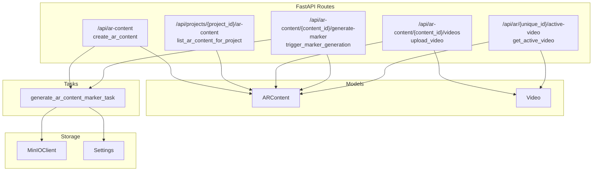
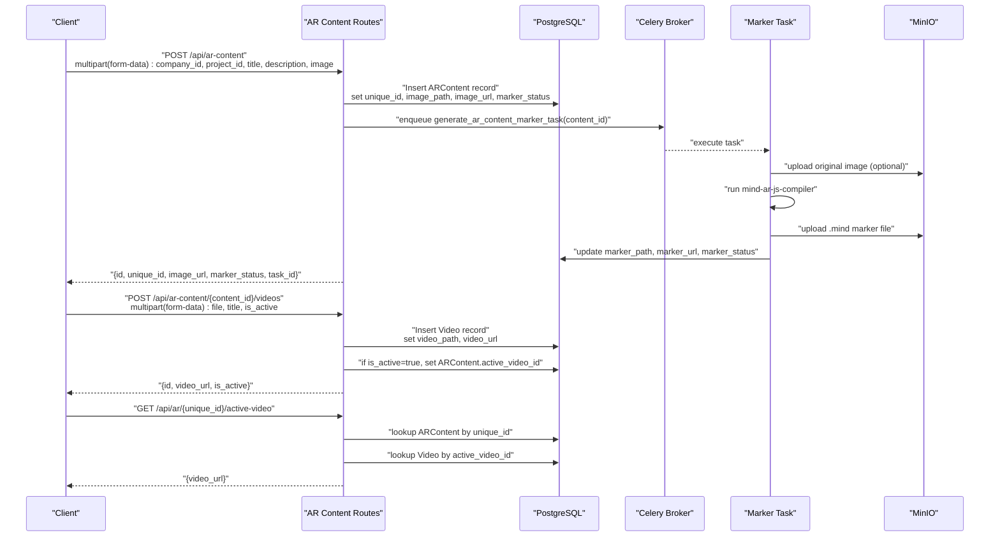
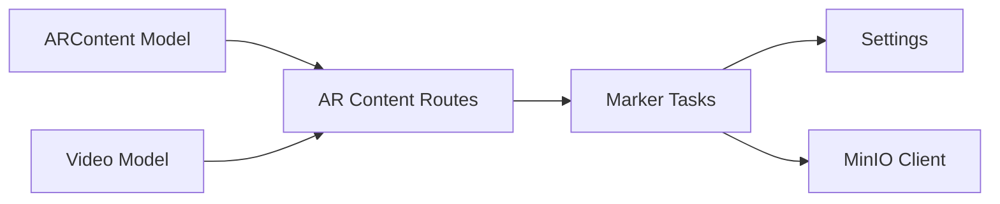

# AR Content Management API

<cite>
**Referenced Files in This Document**
- [README.md](file://README.md)
- [app/main.py](file://app/main.py)
- [app/api/routes/ar_content.py](file://app/api/routes/ar_content.py)
- [app/models/ar_content.py](file://app/models/ar_content.py)
- [app/models/video.py](file://app/models/video.py)
- [app/tasks/marker_tasks.py](file://app/tasks/marker_tasks.py)
- [app/services/marker_service.py](file://app/services/marker_service.py)
- [app/core/storage.py](file://app/core/storage.py)
- [app/core/config.py](file://app/core/config.py)
</cite>

## Table of Contents
1. [Introduction](#introduction)
2. [Project Structure](#project-structure)
3. [Core Components](#core-components)
4. [Architecture Overview](#architecture-overview)
5. [Detailed Component Analysis](#detailed-component-analysis)
6. [Dependency Analysis](#dependency-analysis)
7. [Performance Considerations](#performance-considerations)
8. [Troubleshooting Guide](#troubleshooting-guide)
9. [Conclusion](#conclusion)
10. [Appendices](#appendices)

## Introduction
This document describes the AR Content Management API endpoints in the ARV platform. It covers:
- Creating AR content with image uploads and UUID-based unique identifiers
- Associating videos with AR content and managing active video selection
- Marker generation workflows using Celery tasks
- Public URL generation for stored assets
- Retrieving the active video URL by unique ID for viewer integration

It also provides multipart form data requirements, storage path construction, asynchronous marker generation behavior, and error handling for missing content or videos.

## Project Structure
The AR Content Management API resides under the FastAPI routing module and interacts with SQLAlchemy models, Celery tasks, and storage providers. Key files include:
- Route handlers for AR content and video operations
- SQLAlchemy models for AR content and videos
- Celery tasks for asynchronous marker generation
- Storage utilities for MinIO and URL construction
- Configuration for storage and compiler settings

**Diagram sources**
- [app/api/routes/ar_content.py](file://app/api/routes/ar_content.py#L24-L184)
- [app/models/ar_content.py](file://app/models/ar_content.py#L1-L46)
- [app/models/video.py](file://app/models/video.py#L1-L31)
- [app/tasks/marker_tasks.py](file://app/tasks/marker_tasks.py#L92-L173)
- [app/core/storage.py](file://app/core/storage.py#L1-L71)
- [app/core/config.py](file://app/core/config.py#L58-L100)

**Section sources**
- [README.md](file://README.md#L38-L77)
- [app/main.py](file://app/main.py#L1-L200)

## Core Components
- ARContent model: Stores AR content metadata, UUID-based unique identifier, image and marker URLs, active video linkage, and marker status.
- Video model: Stores video metadata associated with AR content, including URL and activation flag.
- AR Content routes: Provide endpoints to create AR content, list AR content by project, upload videos, trigger marker generation, and retrieve active video URL by unique ID.
- Marker tasks: Asynchronously generate Mind AR marker files and update AR content records.
- Storage utilities: Provide MinIO client and public URL construction helpers.

**Section sources**
- [app/models/ar_content.py](file://app/models/ar_content.py#L1-L46)
- [app/models/video.py](file://app/models/video.py#L1-L31)
- [app/api/routes/ar_content.py](file://app/api/routes/ar_content.py#L24-L184)
- [app/tasks/marker_tasks.py](file://app/tasks/marker_tasks.py#L92-L173)
- [app/core/storage.py](file://app/core/storage.py#L1-L71)

## Architecture Overview
The AR Content Management API follows a layered architecture:
- API layer: FastAPI route handlers accept multipart/form-data requests, manage uploads, and orchestrate database updates and task scheduling.
- Domain layer: SQLAlchemy models define AR content and video entities and their relationships.
- Task layer: Celery tasks perform asynchronous marker generation, invoking external compiler and storage providers.
- Storage layer: MinIO client handles uploads and public URL generation; local storage is also configurable.

**Diagram sources**
- [app/api/routes/ar_content.py](file://app/api/routes/ar_content.py#L24-L184)
- [app/tasks/marker_tasks.py](file://app/tasks/marker_tasks.py#L92-L173)
- [app/core/storage.py](file://app/core/storage.py#L44-L67)

## Detailed Component Analysis

### Endpoint: Create AR Content
- Method and path: POST /api/ar-content
- Purpose: Create a new AR content record with an uploaded image and schedule marker generation.
- Request body: multipart/form-data
  - Fields:
    - company_id: integer
    - project_id: integer
    - title: string
    - description: optional string
    - image: file (image/jpeg, image/png)
- Response: JSON object containing identifiers, URLs, and task metadata.
- Behavior:
  - Generates a UUID-based unique identifier for the AR content.
  - Creates a storage directory under the configured base path and saves the image.
  - Builds a public URL for the image.
  - Inserts ARContent with marker_status set to pending.
  - Enqueues a Celery task to generate the marker asynchronously.

Multipart form data requirements:
- Field names: company_id, project_id, title, description, image
- File handling: image is streamed and written to disk in chunks.

UUID-based unique identifier:
- A UUID is generated and used to construct the AR content directory and later to retrieve active video.

Public URL generation:
- For local storage, a public URL is constructed by computing a relative path from the configured base path and prefixing with /storage/.
- For MinIO, the MinIO client returns a public URL based on endpoint and bucket/object name.

Asynchronous marker generation:
- A Celery task is enqueued immediately after AR content creation.
- The task updates marker_status to processing, generates the marker using an external compiler, uploads the marker file to storage, and sets marker_url and marker_status to ready.

**Section sources**
- [app/api/routes/ar_content.py](file://app/api/routes/ar_content.py#L24-L71)
- [app/models/ar_content.py](file://app/models/ar_content.py#L1-L46)
- [app/tasks/marker_tasks.py](file://app/tasks/marker_tasks.py#L92-L173)
- [app/core/storage.py](file://app/core/storage.py#L44-L67)
- [app/core/config.py](file://app/core/config.py#L58-L72)

### Endpoint: List AR Content by Project
- Method and path: GET /api/projects/{project_id}/ar-content
- Purpose: Retrieve a list of AR content items associated with a project.
- Response: JSON object with an items array containing AR content summaries.

**Section sources**
- [app/api/routes/ar_content.py](file://app/api/routes/ar_content.py#L72-L86)

### Endpoint: Upload Video for AR Content
- Method and path: POST /api/ar-content/{content_id}/videos
- Purpose: Upload a video file and associate it with an AR content record.
- Request body: multipart/form-data
  - Fields:
    - file: file (video/mp4, etc.)
    - title: optional string
    - is_active: boolean (default false)
- Behavior:
  - Validates AR content existence.
  - Creates a videos subdirectory under the AR content’s unique-id path.
  - Streams and writes the video file.
  - Builds a public URL for the video.
  - Inserts Video record; if is_active is true, sets ARContent.active_video_id.

**Section sources**
- [app/api/routes/ar_content.py](file://app/api/routes/ar_content.py#L91-L133)
- [app/models/video.py](file://app/models/video.py#L1-L31)
- [app/models/ar_content.py](file://app/models/ar_content.py#L1-L46)

### Endpoint: Trigger Marker Generation
- Method and path: POST /api/ar-content/{content_id}/generate-marker
- Purpose: Manually trigger or re-trigger marker generation for an AR content record.
- Behavior:
  - Validates AR content existence.
  - Prevents duplicate processing if marker_status is already processing.
  - Updates marker_status to processing and enqueues the Celery task.
  - Returns a task identifier and status.

**Section sources**
- [app/api/routes/ar_content.py](file://app/api/routes/ar_content.py#L135-L146)
- [app/tasks/marker_tasks.py](file://app/tasks/marker_tasks.py#L92-L173)

### Endpoint: Get Active Video by Unique ID
- Method and path: GET /api/ar/{unique_id}/active-video
- Purpose: Provide the active video URL for viewer integration.
- Behavior:
  - Validates AR content existence by unique_id.
  - Ensures an active video is set and exists.
  - Returns the active video URL.

Error handling:
- 404 Not Found if AR content does not exist or if no active video is set or missing.

**Section sources**
- [app/api/routes/ar_content.py](file://app/api/routes/ar_content.py#L159-L171)

### Marker Generation Workflow (Celery Task)
- Task name: generate_ar_content_marker_task
- Inputs: content_id (integer)
- Steps:
  - Load AR content and related company and storage connection.
  - Ensure required storage folders exist (portraits, markers, videos, qr-codes, thumbnails).
  - Optionally upload the original image to remote storage.
  - Run the Mind AR compiler to produce a .mind marker file.
  - Upload the .mind file to storage and compute marker_url.
  - Update AR content with marker_path, marker_url, marker_status, and marker_generated_at.

Retry and error handling:
- The task updates marker_status to processing before starting.
- On failure, the task raises an exception; Celery retries with exponential backoff according to task configuration.

**Section sources**
- [app/tasks/marker_tasks.py](file://app/tasks/marker_tasks.py#L92-L173)
- [app/core/config.py](file://app/core/config.py#L95-L100)

### Storage and Public URL Construction
- Local storage:
  - Base path is configured; public URL is built by computing a relative path from the base path and prefixing with /storage/.
- MinIO storage:
  - MinIO client ensures buckets exist and sets public read policy.
  - upload_file returns a public URL using endpoint, bucket, and object name.

**Section sources**
- [app/api/routes/ar_content.py](file://app/api/routes/ar_content.py#L18-L22)
- [app/core/storage.py](file://app/core/storage.py#L1-L71)
- [app/core/config.py](file://app/core/config.py#L58-L72)

## Dependency Analysis
Key dependencies and relationships:
- AR content routes depend on ARContent and Video models, Celery tasks, and storage configuration.
- Marker tasks depend on Celery broker configuration, storage provider, and external compiler.
- Storage utilities provide MinIO client and public URL generation.

**Diagram sources**
- [app/api/routes/ar_content.py](file://app/api/routes/ar_content.py#L24-L184)
- [app/models/ar_content.py](file://app/models/ar_content.py#L1-L46)
- [app/models/video.py](file://app/models/video.py#L1-L31)
- [app/tasks/marker_tasks.py](file://app/tasks/marker_tasks.py#L92-L173)
- [app/core/storage.py](file://app/core/storage.py#L1-L71)
- [app/core/config.py](file://app/core/config.py#L58-L100)

**Section sources**
- [app/api/routes/ar_content.py](file://app/api/routes/ar_content.py#L24-L184)
- [app/tasks/marker_tasks.py](file://app/tasks/marker_tasks.py#L92-L173)
- [app/core/storage.py](file://app/core/storage.py#L1-L71)
- [app/core/config.py](file://app/core/config.py#L58-L100)

## Performance Considerations
- Streaming uploads: Image and video files are streamed in chunks to reduce memory usage during uploads.
- Asynchronous processing: Marker generation runs in Celery tasks to avoid blocking API responses.
- Compiler invocation: The Mind AR compiler is executed as a subprocess; ensure adequate system resources and appropriate max-features configuration.
- Storage provider overhead: Remote uploads incur network latency; consider optimizing upload sizes and retry policies.

[No sources needed since this section provides general guidance]

## Troubleshooting Guide
Common issues and resolutions:
- Missing AR content:
  - Symptom: 404 Not Found when retrieving active video or triggering marker generation.
  - Resolution: Verify the unique_id or content_id is correct and AR content exists.
- No active video:
  - Symptom: 404 Not Found when requesting active video URL.
  - Resolution: Ensure a video is uploaded with is_active set to true for the target AR content.
- Marker generation stuck:
  - Symptom: marker_status remains processing.
  - Resolution: Check Celery worker logs, confirm compiler availability, and review task retry behavior.
- Storage upload failures:
  - Symptom: Marker or asset upload errors.
  - Resolution: Verify MinIO endpoint, credentials, and bucket policies; ensure required folders exist.

**Section sources**
- [app/api/routes/ar_content.py](file://app/api/routes/ar_content.py#L135-L171)
- [app/tasks/marker_tasks.py](file://app/tasks/marker_tasks.py#L92-L173)

## Conclusion
The AR Content Management API provides a robust foundation for creating AR content, uploading images and videos, and generating Mind AR markers asynchronously. It uses UUID-based identifiers, configurable storage backends, and Celery for scalable background processing. Clients integrate by uploading assets via multipart/form-data, triggering marker generation when needed, and retrieving the active video URL for viewer consumption.

[No sources needed since this section summarizes without analyzing specific files]

## Appendices

### Complete AR Content Setup Workflow
- Step 1: Create AR content
  - POST /api/ar-content with multipart/form-data including company_id, project_id, title, description, and image.
  - Response includes unique_id, image_url, marker_status, and task_id.
- Step 2: Upload video
  - POST /api/ar-content/{content_id}/videos with multipart/form-data including file, title, and is_active.
  - Response includes video_url and is_active.
- Step 3: Trigger marker generation (optional)
  - POST /api/ar-content/{content_id}/generate-marker to re-trigger if needed.
- Step 4: Viewer integration
  - GET /api/ar/{unique_id}/active-video to obtain the active video URL for embedding.

**Section sources**
- [app/api/routes/ar_content.py](file://app/api/routes/ar_content.py#L24-L171)

### Multipart Form Data Requirements
- Create AR content:
  - Fields: company_id, project_id, title, description, image
  - File: image
- Upload video:
  - Fields: file, title, is_active
  - File: file

**Section sources**
- [app/api/routes/ar_content.py](file://app/api/routes/ar_content.py#L24-L133)

### UUID-Based Identifier and Storage Paths
- Unique identifier:
  - Generated as a UUID v4 and stored in ARContent.unique_id.
- Storage path construction:
  - Local: STORAGE_BASE_PATH/ar_content/{unique_id}/...
  - MinIO: bucket/folder structure managed by storage provider; public URL derived from endpoint and object name.
- Public URL generation:
  - Local: /storage/{relative_path}
  - MinIO: http://{MINIO_ENDPOINT}/{bucket}/{object_name}

**Section sources**
- [app/api/routes/ar_content.py](file://app/api/routes/ar_content.py#L18-L22)
- [app/core/config.py](file://app/core/config.py#L58-L72)
- [app/core/storage.py](file://app/core/storage.py#L44-L67)

### Asynchronous Marker Generation Details
- Task scheduling:
  - Enqueued immediately upon AR content creation and on manual trigger.
- Processing state:
  - marker_status transitions to processing before task execution.
- Completion:
  - On success, marker_path, marker_url, marker_status, and marker_generated_at are updated.
- Retries:
  - Celery task uses exponential backoff on failure.

**Section sources**
- [app/api/routes/ar_content.py](file://app/api/routes/ar_content.py#L62-L71)
- [app/tasks/marker_tasks.py](file://app/tasks/marker_tasks.py#L92-L173)