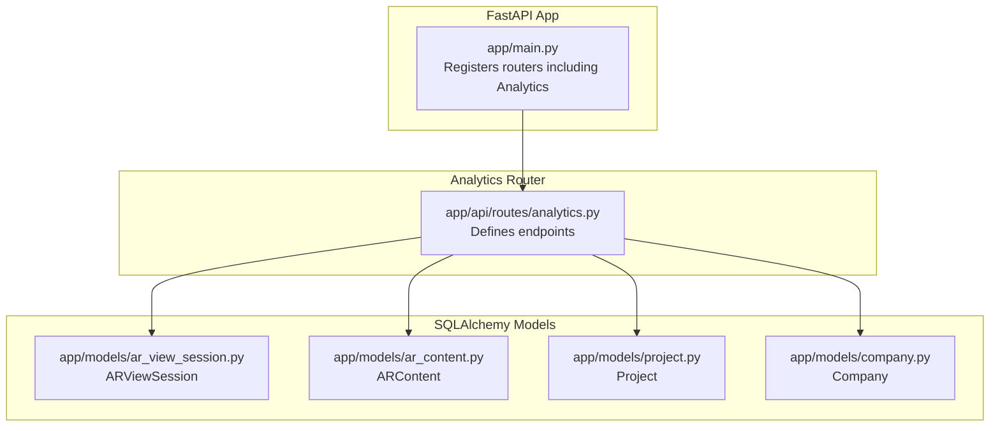
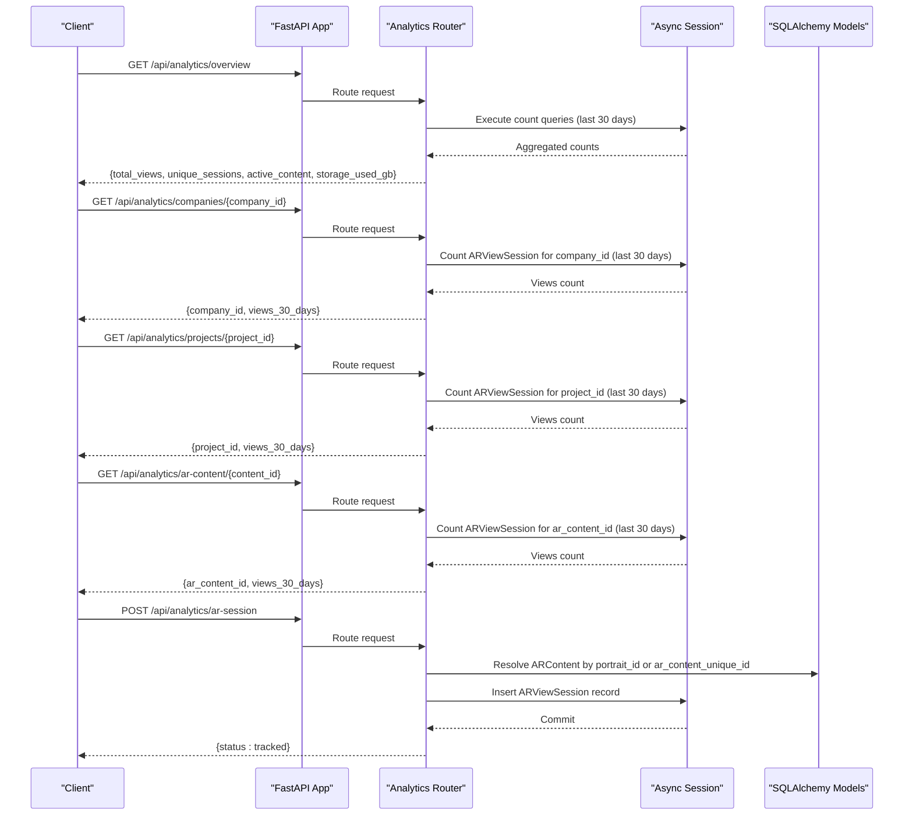
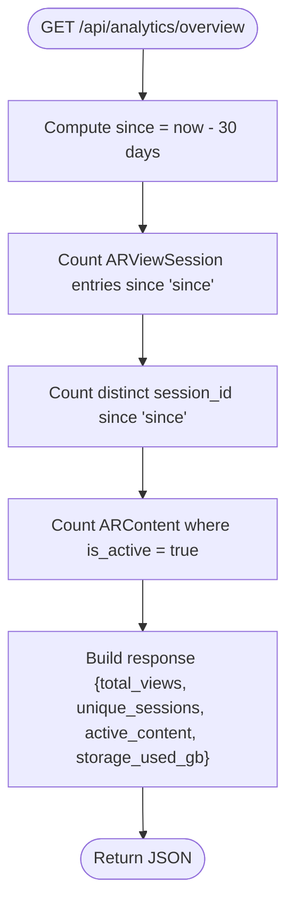
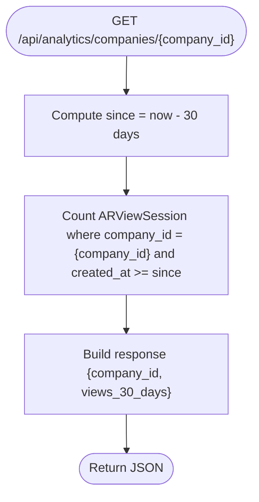
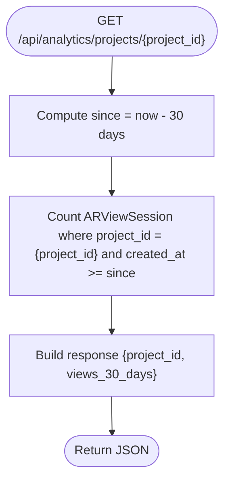
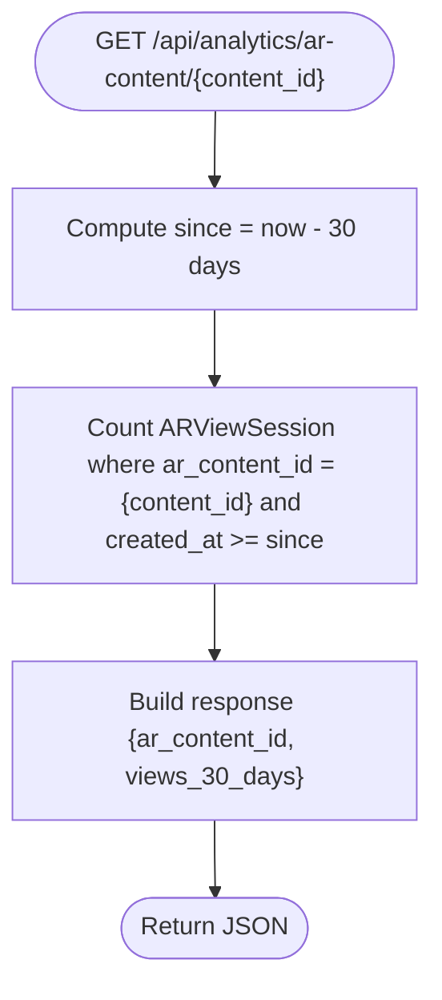
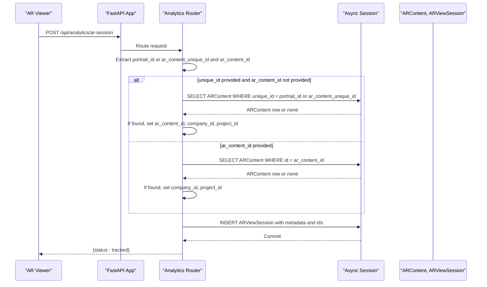
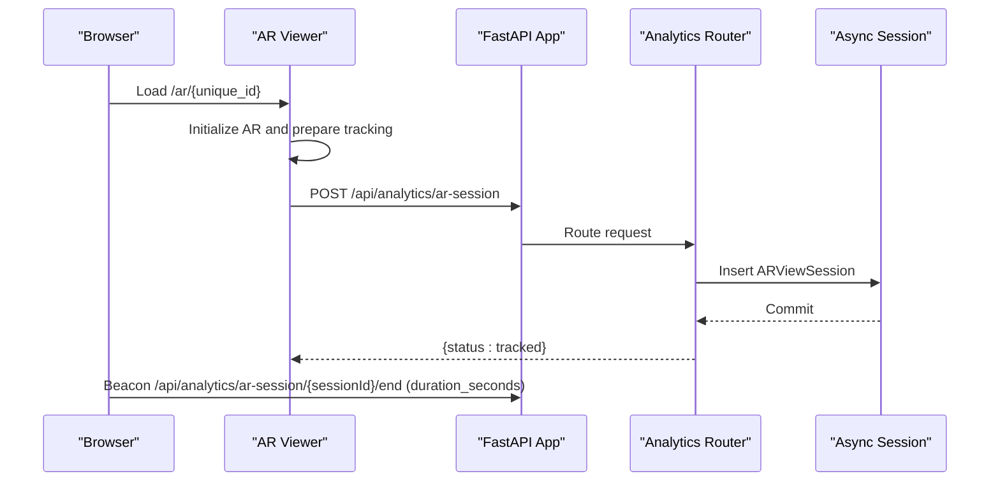
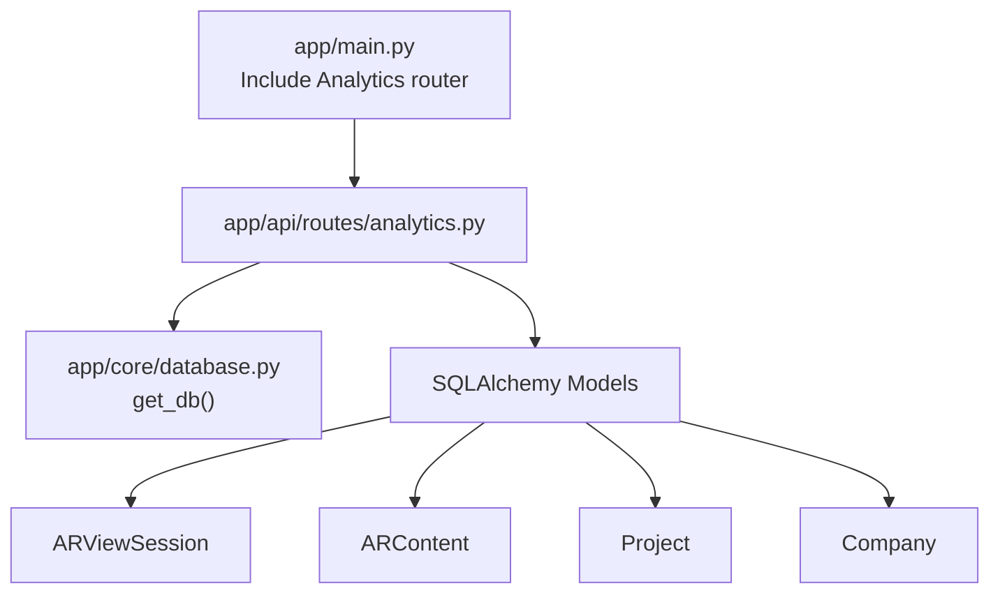
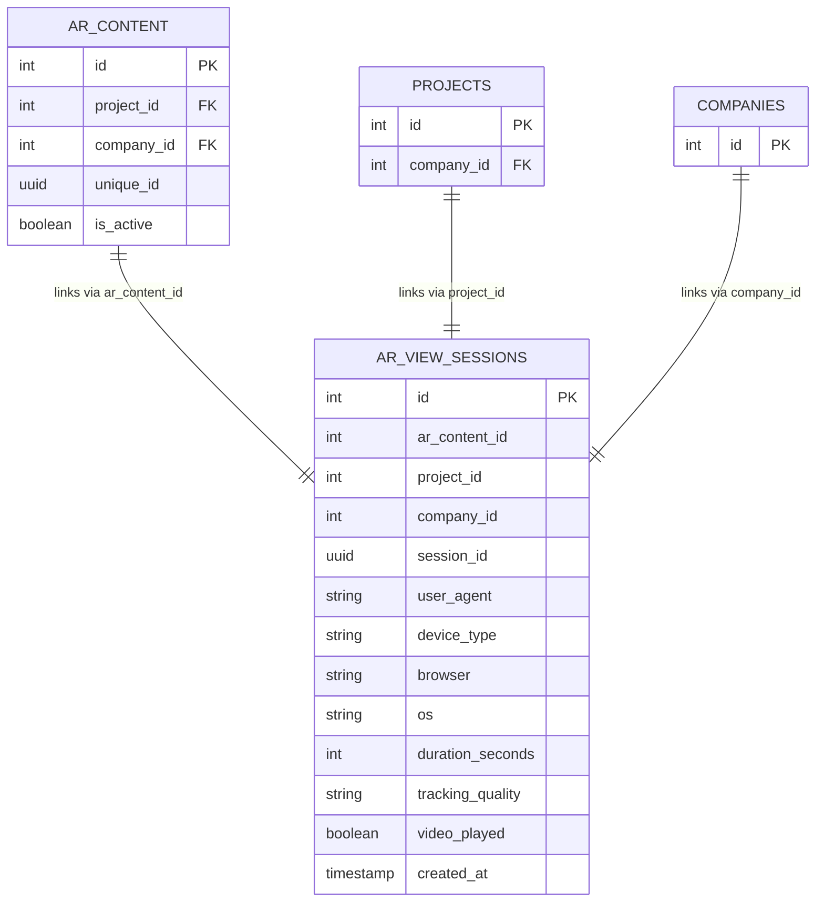

# Analytics API

<cite>
**Referenced Files in This Document**
- [analytics.py](file://app/api/routes/analytics.py)
- [ar_view_session.py](file://app/models/ar_view_session.py)
- [ar_content.py](file://app/models/ar_content.py)
- [project.py](file://app/models/project.py)
- [company.py](file://app/models/company.py)
- [main.py](file://app/main.py)
- [database.py](file://app/core/database.py)
- [ar_viewer.html](file://templates/ar_viewer.html)
</cite>

## Table of Contents
1. [Introduction](#introduction)
2. [Project Structure](#project-structure)
3. [Core Components](#core-components)
4. [Architecture Overview](#architecture-overview)
5. [Detailed Component Analysis](#detailed-component-analysis)
6. [Dependency Analysis](#dependency-analysis)
7. [Performance Considerations](#performance-considerations)
8. [Troubleshooting Guide](#troubleshooting-guide)
9. [Conclusion](#conclusion)
10. [Appendices](#appendices)

## Introduction
This document provides API documentation for the Analytics endpoints in the ARV platform. It covers:
- Overview metrics endpoint returning aggregated analytics for the last 30 days
- Entity-specific analytics for companies, projects, and AR content
- The AR session tracking endpoint for recording AR view interactions, including session identification, device information, and tracking quality metrics
- How AR content is resolved by either portrait_id or ar_content_unique_id and how company and project context are automatically populated
- Response formats for view counts and unique sessions, and the placeholder nature of storage usage data
- Practical examples of integrating the tracking endpoint into AR viewers and retrieving analytics for performance monitoring

## Project Structure
The Analytics API is implemented as a FastAPI router and backed by SQLAlchemy models. The application registers the Analytics router under the /api prefix and exposes endpoints for overview metrics, entity-scoped analytics, and AR session tracking.

**Diagram sources**
- [main.py](file://app/main.py#L230-L261)
- [analytics.py](file://app/api/routes/analytics.py#L1-L93)
- [ar_view_session.py](file://app/models/ar_view_session.py#L1-L31)
- [ar_content.py](file://app/models/ar_content.py#L1-L46)
- [project.py](file://app/models/project.py#L1-L35)
- [company.py](file://app/models/company.py#L1-L41)

**Section sources**
- [main.py](file://app/main.py#L230-L261)
- [analytics.py](file://app/api/routes/analytics.py#L1-L93)

## Core Components
- Analytics Router: Defines endpoints for overview metrics, company analytics, project analytics, AR content analytics, and AR session tracking.
- ARViewSession Model: Stores AR view session records with identifiers, device/browser/os metadata, tracking quality, and timestamps.
- ARContent Model: Represents AR content with company and project linkage and unique identifiers used for resolution.
- Project and Company Models: Provide context for analytics scoping.

Key responsibilities:
- Overview endpoint aggregates total views, unique sessions, and active content counts for the last 30 days.
- Entity endpoints return view counts scoped to company_id, project_id, or ar_content_id for the last 30 days.
- AR session tracking endpoint accepts portrait_id or ar_content_unique_id to resolve AR content and populate company and project context, then persists session metadata.

**Section sources**
- [analytics.py](file://app/api/routes/analytics.py#L16-L93)
- [ar_view_session.py](file://app/models/ar_view_session.py#L1-L31)
- [ar_content.py](file://app/models/ar_content.py#L1-L46)
- [project.py](file://app/models/project.py#L1-L35)
- [company.py](file://app/models/company.py#L1-L41)

## Architecture Overview
The Analytics endpoints operate within the FastAPI application lifecycle, using dependency injection to obtain an async database session. The Analytics router is included under the /api prefix, enabling clients to query overview metrics and entity-scoped analytics, and to post AR session events.

**Diagram sources**
- [main.py](file://app/main.py#L230-L261)
- [analytics.py](file://app/api/routes/analytics.py#L16-L93)
- [ar_view_session.py](file://app/models/ar_view_session.py#L1-L31)
- [ar_content.py](file://app/models/ar_content.py#L1-L46)

## Detailed Component Analysis

### Overview Metrics Endpoint
- Path: GET /api/analytics/overview
- Behavior:
  - Computes total views and unique sessions within the last 30 days
  - Counts active AR content instances
  - Returns a placeholder for storage_used_gb
- Response format:
  - total_views: integer
  - unique_sessions: integer
  - active_content: integer
  - storage_used_gb: null (placeholder)

**Diagram sources**
- [analytics.py](file://app/api/routes/analytics.py#L16-L31)

**Section sources**
- [analytics.py](file://app/api/routes/analytics.py#L16-L31)

### Company Analytics Endpoint
- Path: GET /api/analytics/companies/{company_id}
- Behavior:
  - Returns the number of AR view sessions associated with the given company_id within the last 30 days
- Response format:
  - company_id: integer
  - views_30_days: integer

**Diagram sources**
- [analytics.py](file://app/api/routes/analytics.py#L34-L39)

**Section sources**
- [analytics.py](file://app/api/routes/analytics.py#L34-L39)

### Project Analytics Endpoint
- Path: GET /api/analytics/projects/{project_id}
- Behavior:
  - Returns the number of AR view sessions associated with the given project_id within the last 30 days
- Response format:
  - project_id: integer
  - views_30_days: integer

**Diagram sources**
- [analytics.py](file://app/api/routes/analytics.py#L41-L46)

**Section sources**
- [analytics.py](file://app/api/routes/analytics.py#L41-L46)

### AR Content Analytics Endpoint
- Path: GET /api/analytics/ar-content/{content_id}
- Behavior:
  - Returns the number of AR view sessions associated with the given ar_content_id within the last 30 days
- Response format:
  - ar_content_id: integer
  - views_30_days: integer

**Diagram sources**
- [analytics.py](file://app/api/routes/analytics.py#L48-L53)

**Section sources**
- [analytics.py](file://app/api/routes/analytics.py#L48-L53)

### Track AR Session Endpoint
- Path: POST /api/analytics/ar-session
- Purpose:
  - Record AR view interactions and capture session metadata
  - Resolve AR content by portrait_id or ar_content_unique_id and populate company and project context
- Request payload fields:
  - portrait_id: string (alternative to ar_content_unique_id)
  - ar_content_unique_id: string (alternative to portrait_id)
  - ar_content_id: integer (optional; if provided, used directly)
  - session_id: UUID string
  - user_agent: string
  - device_type: string (e.g., mobile, tablet, desktop)
  - browser: string (optional)
  - os: string (optional)
  - tracking_quality: string (optional)
  - video_played: boolean (optional)
- Resolution logic:
  - If portrait_id or ar_content_unique_id is provided and ar_content_id is not provided:
    - Query ARContent by unique_id equal to portrait_id or ar_content_unique_id
    - If found, set ar_content_id, company_id, and project_id from ARContent
  - Else if ar_content_id is provided:
    - Load ARContent by id and set company_id and project_id
- Persistence:
  - Create ARViewSession with:
    - ar_content_id, project_id, company_id (fallback to 0 if not resolved)
    - session_id, user_agent, device_type, browser, os
    - duration_seconds: null initially
    - tracking_quality, video_played
    - created_at: current UTC timestamp
  - Commit transaction and return {"status": "tracked"}

**Diagram sources**
- [analytics.py](file://app/api/routes/analytics.py#L55-L93)
- [ar_content.py](file://app/models/ar_content.py#L1-L46)
- [ar_view_session.py](file://app/models/ar_view_session.py#L1-L31)

**Section sources**
- [analytics.py](file://app/api/routes/analytics.py#L55-L93)
- [ar_content.py](file://app/models/ar_content.py#L1-L46)
- [ar_view_session.py](file://app/models/ar_view_session.py#L1-L31)

### AR Viewer Integration Example
The public AR viewer integrates analytics tracking by:
- Generating a session_id on the client
- Posting a session start event to /api/analytics/ar-session with portrait_id, session_id, user_agent, and device_type
- Optionally sending a session end beacon with duration_seconds on page unload

**Diagram sources**
- [ar_viewer.html](file://templates/ar_viewer.html#L166-L200)
- [analytics.py](file://app/api/routes/analytics.py#L55-L93)

**Section sources**
- [ar_viewer.html](file://templates/ar_viewer.html#L166-L200)

## Dependency Analysis
- Router inclusion: The Analytics router is included under /api with tags ["Analytics"].
- Database dependency: Endpoints depend on get_db for async sessions.
- Model relationships:
  - ARViewSession holds foreign keys to ARContent, Project, and Company implicitly through analytics aggregation
  - ARContent links to Project and Company via foreign keys
- External integrations:
  - Nginx proxies /api/ and /ar/ to the backend

**Diagram sources**
- [main.py](file://app/main.py#L230-L261)
- [analytics.py](file://app/api/routes/analytics.py#L1-L93)
- [database.py](file://app/core/database.py#L30-L46)
- [ar_view_session.py](file://app/models/ar_view_session.py#L1-L31)
- [ar_content.py](file://app/models/ar_content.py#L1-L46)
- [project.py](file://app/models/project.py#L1-L35)
- [company.py](file://app/models/company.py#L1-L41)

**Section sources**
- [main.py](file://app/main.py#L230-L261)
- [database.py](file://app/core/database.py#L30-L46)

## Performance Considerations
- Query window: All analytics endpoints compute counts over a 30-day window. Ensure appropriate indexing on created_at and foreign keys for efficient filtering.
- Unique sessions: The unique_sessions metric relies on distinct session_id values; ensure session_id is consistently generated and stored.
- Placeholder storage_used_gb: The overview endpoint returns a placeholder for storage usage. Implement per-company computation if needed.
- Concurrency: The database dependency commits per request; keep payloads minimal to reduce contention.

[No sources needed since this section provides general guidance]

## Troubleshooting Guide
- Missing AR content context:
  - If neither portrait_id nor ar_content_unique_id resolves to an ARContent record, ar_content_id, company_id, and project_id will fall back to 0. Verify that unique_id values match ARContent.unique_id.
- Session not recorded:
  - Confirm that POST /api/analytics/ar-session receives required fields: session_id, user_agent, device_type, and either portrait_id or ar_content_unique_id.
- Duration not captured:
  - The current implementation does not expose an explicit end endpoint. The AR viewer sends a beacon to a non-existent route. Implement a dedicated end endpoint if needed for robustness.
- CORS/proxy issues:
  - Ensure Nginx forwards /api/ and /ar/ routes to the backend and that CORS allows the viewer origin.

**Section sources**
- [analytics.py](file://app/api/routes/analytics.py#L55-L93)
- [ar_viewer.html](file://templates/ar_viewer.html#L166-L200)
- [main.py](file://app/main.py#L230-L261)

## Conclusion
The Analytics API provides essential insights into AR engagement over a 30-day period, with overview metrics and entity-scoped analytics. The AR session tracking endpoint captures session metadata and resolves AR content context using either portrait_id or ar_content_unique_id. While the storage_used_gb field is currently a placeholder, the foundation is in place for future enhancements. Integrating the tracking endpoint into AR viewers enables performance monitoring and usage analytics.

[No sources needed since this section summarizes without analyzing specific files]

## Appendices

### API Definitions

- GET /api/analytics/overview
  - Description: Returns overview metrics for the last 30 days
  - Response: {total_views: integer, unique_sessions: integer, active_content: integer, storage_used_gb: null}
  - Section sources
    - [analytics.py](file://app/api/routes/analytics.py#L16-L31)

- GET /api/analytics/companies/{company_id}
  - Description: Returns AR view count for a company in the last 30 days
  - Response: {company_id: integer, views_30_days: integer}
  - Section sources
    - [analytics.py](file://app/api/routes/analytics.py#L34-L39)

- GET /api/analytics/projects/{project_id}
  - Description: Returns AR view count for a project in the last 30 days
  - Response: {project_id: integer, views_30_days: integer}
  - Section sources
    - [analytics.py](file://app/api/routes/analytics.py#L41-L46)

- GET /api/analytics/ar-content/{content_id}
  - Description: Returns AR view count for AR content in the last 30 days
  - Response: {ar_content_id: integer, views_30_days: integer}
  - Section sources
    - [analytics.py](file://app/api/routes/analytics.py#L48-L53)

- POST /api/analytics/ar-session
  - Description: Records an AR view session and resolves AR content context
  - Request fields: portrait_id, ar_content_unique_id, ar_content_id, session_id, user_agent, device_type, browser, os, tracking_quality, video_played
  - Response: {status: "tracked"}
  - Section sources
    - [analytics.py](file://app/api/routes/analytics.py#L55-L93)
    - [ar_content.py](file://app/models/ar_content.py#L1-L46)
    - [ar_view_session.py](file://app/models/ar_view_session.py#L1-L31)

### Data Models Overview

**Diagram sources**
- [ar_view_session.py](file://app/models/ar_view_session.py#L1-L31)
- [ar_content.py](file://app/models/ar_content.py#L1-L46)
- [project.py](file://app/models/project.py#L1-L35)
- [company.py](file://app/models/company.py#L1-L41)