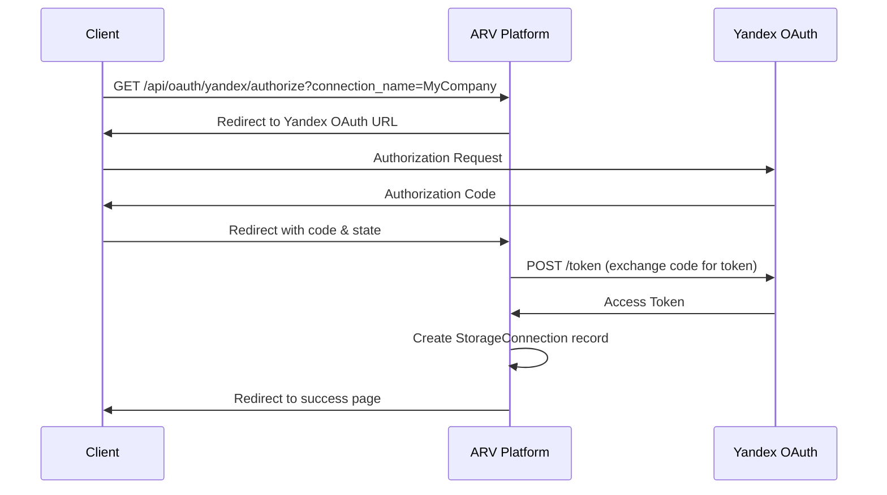
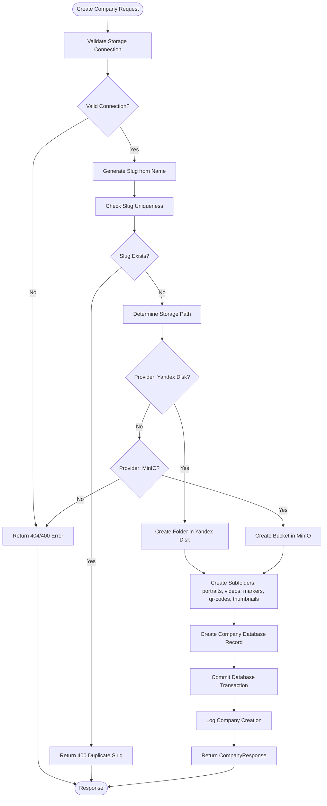
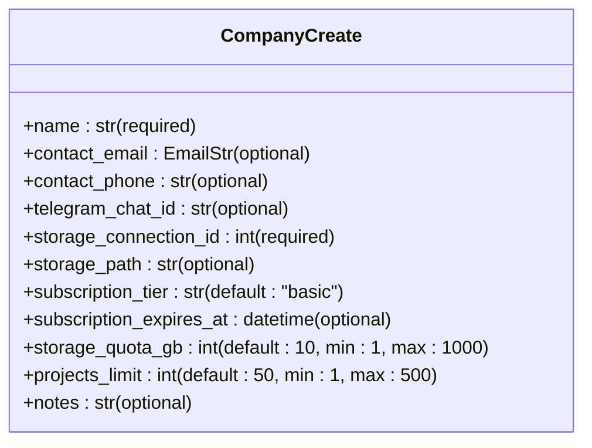
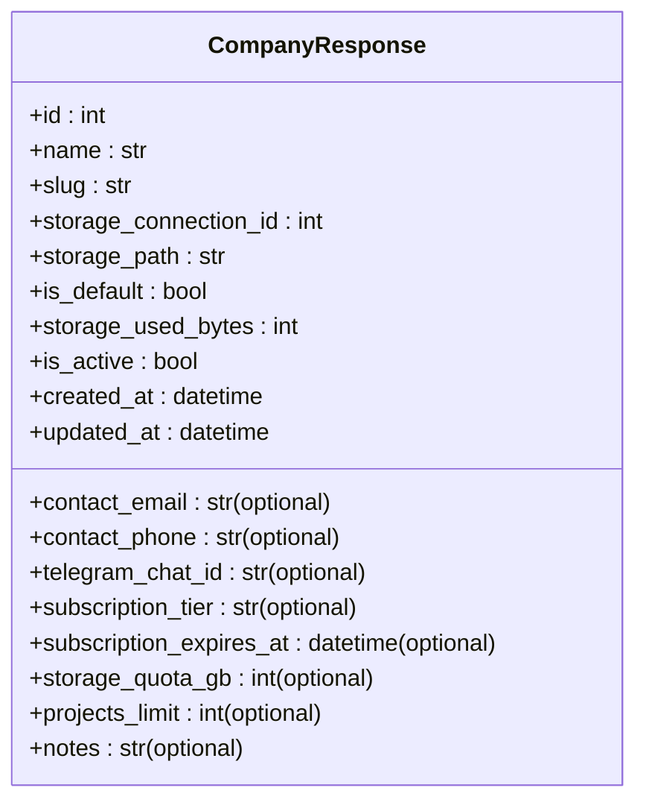
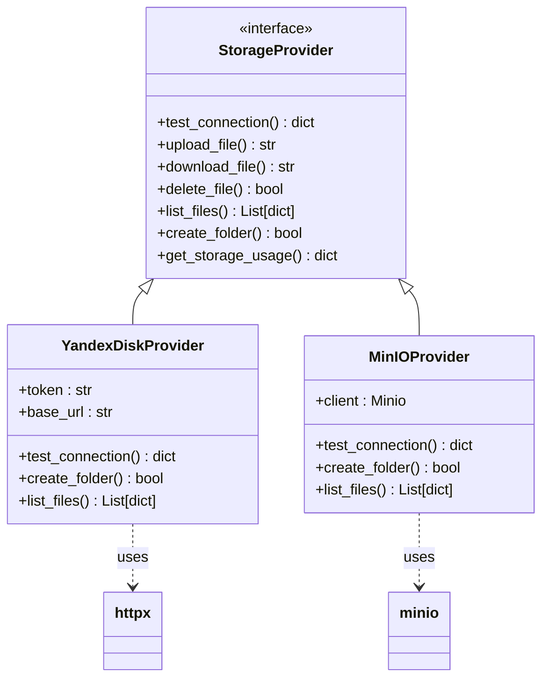

# Company Management API

<cite>
**Referenced Files in This Document**   
- [companies.py](file://app/api/routes/companies.py)
- [company.py](file://app/models/company.py)
- [company.py](file://app/schemas/company.py)
- [storage.py](file://app/api/routes/storage.py)
- [factory.py](file://app/services/storage/factory.py)
- [yandex_disk_provider.py](file://app/services/storage/providers/yandex_disk_provider.py)
- [minio_provider.py](file://app/services/storage/providers/minio_provider.py)
- [analytics.py](file://app/api/routes/analytics.py)
- [oauth.py](file://app/api/routes/oauth.py)
</cite>

## Table of Contents
1. [Introduction](#introduction)
2. [Authentication and Security](#authentication-and-security)
3. [Company Endpoints](#company-endpoints)
   - [Create Company (POST)](#create-company-post)
   - [List Companies (GET)](#list-companies-get)
   - [Get Company (GET)](#get-company-get)
   - [Update Company (PUT)](#update-company-put)
   - [Delete Company (DELETE)](#delete-company-delete)
4. [Request/Response Schemas](#requestresponse-schemas)
5. [Storage Integration](#storage-integration)
6. [Analytics Endpoint](#analytics-endpoint)
7. [Error Handling](#error-handling)
8. [Practical Examples](#practical-examples)
9. [Rate Limiting](#rate-limiting)

## Introduction
The Company Management API in the ARV platform provides comprehensive functionality for managing client companies within the B2B SaaS ecosystem. This API enables creation, retrieval, updating, and deletion of company records with integrated storage configuration for AR content management. The system supports multiple storage backends including Yandex Disk and MinIO, with automated folder structure creation and validation.

The API follows RESTful principles with JWT-based authentication and provides detailed analytics capabilities for company-level metrics. Each company is associated with a specific storage connection that determines where their AR content (portraits, videos, markers) is stored and managed.

**Section sources**
- [companies.py](file://app/api/routes/companies.py#L1-L137)

## Authentication and Security
All Company Management endpoints require JWT authentication. Users must obtain a valid JWT token through the OAuth2 flow before accessing any company-related functionality. The platform implements structured logging for all API requests, capturing method, path, client information, and duration for security auditing.

The system includes specific security measures for storage integration:
- Yandex Disk connections require OAuth2 token authentication
- MinIO connections use access/secret key pairs with configurable security (HTTP/HTTPS)
- Storage credentials are stored encrypted in the database
- All storage operations are logged with structured logging

For Yandex Disk integration, the platform provides a complete OAuth2 flow with CSRF protection using state parameters. The authentication process involves redirecting users to Yandex's authorization endpoint and handling the callback to exchange authorization codes for access tokens.



**Diagram sources**
- [oauth.py](file://app/api/routes/oauth.py#L1-L184)

**Section sources**
- [oauth.py](file://app/api/routes/oauth.py#L1-L184)
- [main.py](file://app/main.py#L108-L141)

## Company Endpoints

### Create Company (POST)
Creates a new company with associated storage configuration. This endpoint requires a valid storage connection ID and performs several critical operations:

1. Validates the storage connection exists and is not the default Vertex AR storage
2. Generates a URL-friendly slug from the company name
3. Checks for slug uniqueness
4. Creates the necessary folder structure in the specified storage backend
5. Creates subfolders for different content types



**Diagram sources**
- [companies.py](file://app/api/routes/companies.py#L15-L88)
- [factory.py](file://app/services/storage/factory.py#L8-L31)

**Section sources**
- [companies.py](file://app/api/routes/companies.py#L15-L88)

### List Companies (GET)
Retrieves a list of all companies with optional filtering to exclude default companies. The results are ordered by creation date in descending order (newest first).

**Parameters:**
- `include_default` (boolean, optional): Whether to include the default Vertex AR company. Default: false

The endpoint returns an array of CompanyResponse objects. When `include_default=false` (default), only client companies are returned, excluding the system's default company used for internal operations.

**Section sources**
- [companies.py](file://app/api/routes/companies.py#L90-L97)

### Get Company (GET)
Retrieves detailed information about a specific company by ID. Returns a CompanyResponse object containing all company details including storage configuration, subscription information, and metadata.

If the company ID does not exist, returns a 404 Not Found error.

**Section sources**
- [companies.py](file://app/api/routes/companies.py#L99-L104)

### Update Company (PUT)
Updates company information with partial updates. This endpoint accepts a JSON payload with any subset of company fields and updates only the provided fields.

The update operation:
- Retrieves the company by ID
- Validates the company exists
- Iterates through the provided payload fields
- Updates only fields that exist on the company model
- Commits changes to the database

This implementation allows flexible updates without requiring all fields to be present in the request.

**Section sources**
- [companies.py](file://app/api/routes/companies.py#L106-L115)

### Delete Company (DELETE)
Deletes a company by ID. This operation removes the company record from the database but does not automatically delete content from the storage backend (Yandex Disk or MinIO).

The endpoint:
- Retrieves the company by ID
- Validates the company exists
- Deletes the company record
- Commits the transaction

**Section sources**
- [companies.py](file://app/api/routes/companies.py#L117-L124)

## Request/Response Schemas

### CompanyCreate Schema
The request schema for creating a new company.



**Diagram sources**
- [company.py](file://app/schemas/company.py#L5-L38)

### CompanyResponse Schema
The response schema containing complete company information.



**Diagram sources**
- [company.py](file://app/schemas/company.py#L40-L68)

**Section sources**
- [company.py](file://app/schemas/company.py#L5-L68)

## Storage Integration
The Company Management API integrates with external storage systems through a provider-based architecture. When creating a company, the system validates and configures storage connections for either Yandex Disk or MinIO.

### Storage Connection Validation
Before creating a company, the API validates:
- The storage connection exists in the database
- The connection is not the default Vertex AR storage (client companies must use their own storage)
- The storage provider is supported (yandex_disk or minio)

### Folder Structure Creation
The API automatically creates the necessary folder structure based on the storage provider:

**For Yandex Disk:**
- Creates a root folder (e.g., `/Companies/{slug}`)
- Creates subfolders: `portraits`, `videos`, `markers`, `qr-codes`, `thumbnails`

**For MinIO:**
- Uses the company slug as the bucket name
- Creates "folders" as prefix objects: `{slug}/portraits/`, `{slug}/videos/`, etc.

The storage provider factory determines the appropriate provider implementation based on the connection type and handles all storage operations.



**Diagram sources**
- [factory.py](file://app/services/storage/factory.py#L8-L31)
- [yandex_disk_provider.py](file://app/services/storage/providers/yandex_disk_provider.py#L7-L110)
- [minio_provider.py](file://app/services/storage/providers/minio_provider.py#L11-L104)

**Section sources**
- [factory.py](file://app/services/storage/factory.py#L8-L31)
- [yandex_disk_provider.py](file://app/services/storage/providers/yandex_disk_provider.py#L7-L110)
- [minio_provider.py](file://app/services/storage/providers/minio_provider.py#L11-L104)

## Analytics Endpoint
The platform provides an analytics endpoint for retrieving company-level metrics. Currently implemented as a placeholder, this endpoint will return key performance indicators for the specified company.

**Endpoint:** `GET /api/companies/{company_id}/analytics`

**Response:**
```json
{
  "company_id": 123,
  "total_views": 0,
  "unique_sessions": 0,
  "active_projects": 0,
  "active_content": 0
}
```

Future implementations will integrate with the AR view session data to provide actual metrics on content engagement, user sessions, and project activity.

**Section sources**
- [companies.py](file://app/api/routes/companies.py#L127-L136)
- [analytics.py](file://app/api/routes/analytics.py#L1-L93)

## Error Handling
The API implements comprehensive error handling with descriptive error messages and appropriate HTTP status codes.

### Common Error Responses

**400 Bad Request:**
- Duplicate slug: "Company with slug '{slug}' already exists"
- Invalid storage connection: "Cannot use default Vertex AR storage for client companies"
- Unsupported provider: "Unsupported provider for client companies"

**404 Not Found:**
- Company not found: "Company not found"
- Storage connection not found: "Storage connection not found"

**500 Internal Server Error:**
- Storage creation failure: "Failed to create folder in Yandex Disk: {path}" or "Failed to create MinIO bucket: {bucket}"

The system uses structured logging to capture error details for debugging and monitoring purposes.

**Section sources**
- [companies.py](file://app/api/routes/companies.py#L23-L31)
- [companies.py](file://app/api/routes/companies.py#L39-L41)
- [companies.py](file://app/api/routes/companies.py#L49-L50)
- [companies.py](file://app/api/routes/companies.py#L59-L60)

## Practical Examples

### Creating a Company with Yandex Disk Storage
```http
POST /api/companies
Content-Type: application/json
Authorization: Bearer <jwt_token>

{
  "name": "Acme Corporation",
  "contact_email": "contact@acme.com",
  "contact_phone": "+1234567890",
  "storage_connection_id": 5,
  "storage_path": "/Companies/AcmeCorp",
  "subscription_tier": "premium",
  "storage_quota_gb": 50,
  "projects_limit": 100
}
```

This request:
1. Validates storage connection ID 5 exists and is a Yandex Disk connection
2. Generates slug "acme-corporation"
3. Creates folder "/Companies/AcmeCorp" in Yandex Disk
4. Creates subfolders for content types
5. Creates the company record with the specified parameters

### Listing Companies (Excluding Default)
```http
GET /api/companies?include_default=false
Authorization: Bearer <jwt_token>
```

Returns all client companies, excluding the default Vertex AR company.

### Creating a Company with MinIO Storage
```http
POST /api/companies
Content-Type: application/json
Authorization: Bearer <jwt_token>

{
  "name": "Tech Solutions Inc",
  "contact_email": "info@techsolutions.com",
  "storage_connection_id": 8,
  "subscription_tier": "basic",
  "storage_quota_gb": 10
}
```

With MinIO, the storage_path is auto-generated as the bucket name (company slug), so it can be omitted from the request.

**Section sources**
- [companies.py](file://app/api/routes/companies.py#L15-L88)
- [companies.py](file://app/api/routes/companies.py#L90-L97)

## Rate Limiting
The ARV platform implements rate limiting at the application level to prevent abuse and ensure service availability. While specific rate limits are configured in the deployment environment, the system includes:

- Request duration monitoring via Prometheus metrics
- Structured logging of all API requests for analysis
- Potential integration with Redis for distributed rate limiting in future versions

The current implementation focuses on comprehensive logging and monitoring, with rate limiting rules applied at the infrastructure level (e.g., NGINX).

**Section sources**
- [main.py](file://app/main.py#L108-L141)
- [nginx.conf](file://nginx/nginx.conf)