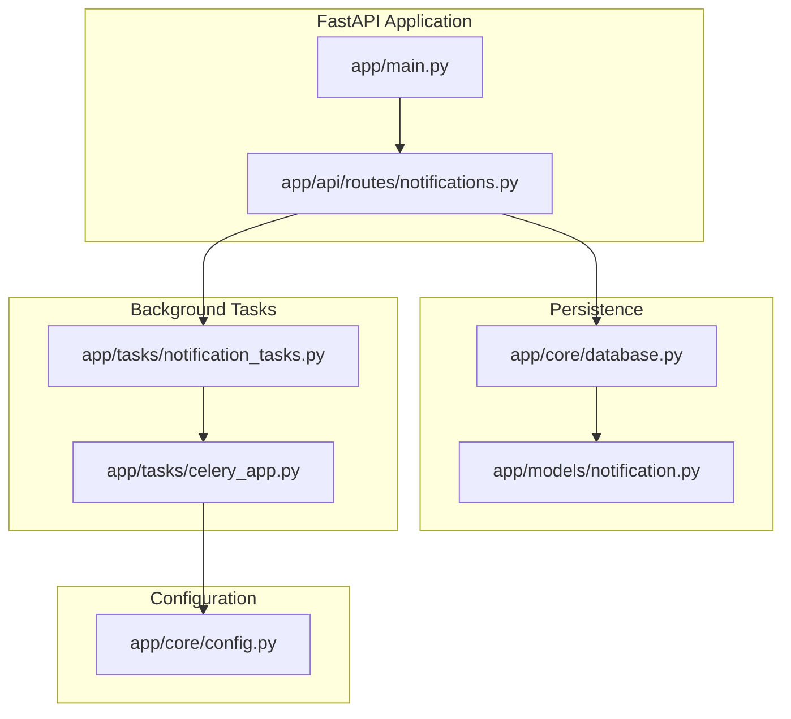
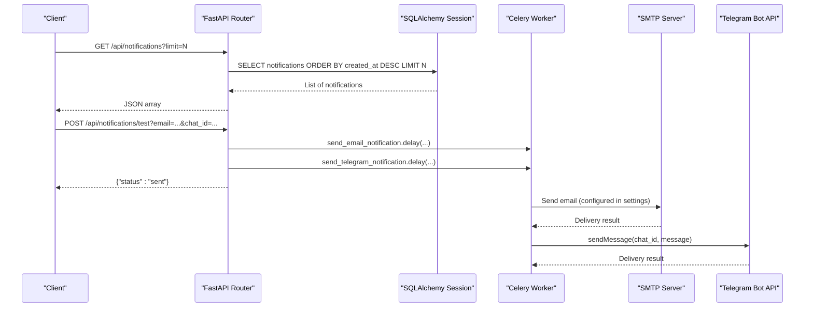
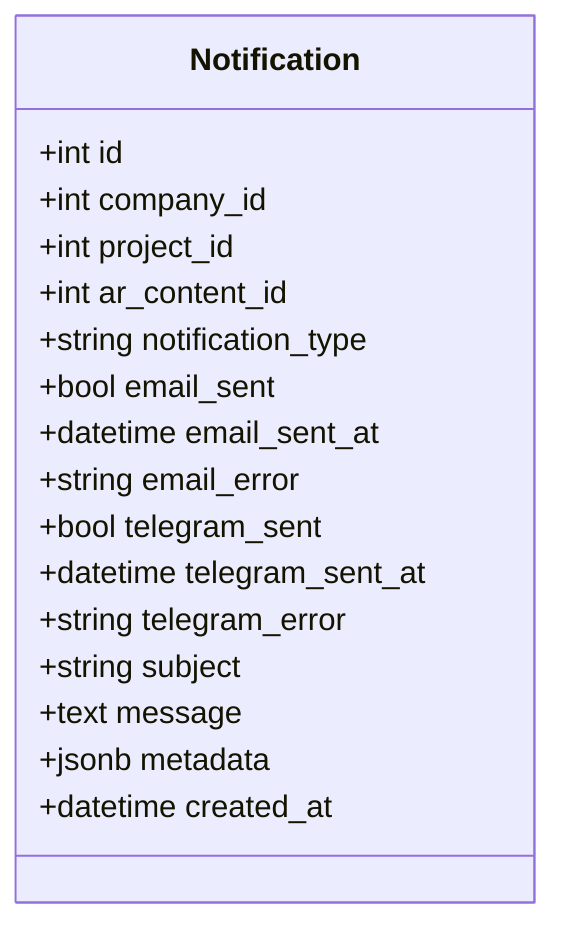
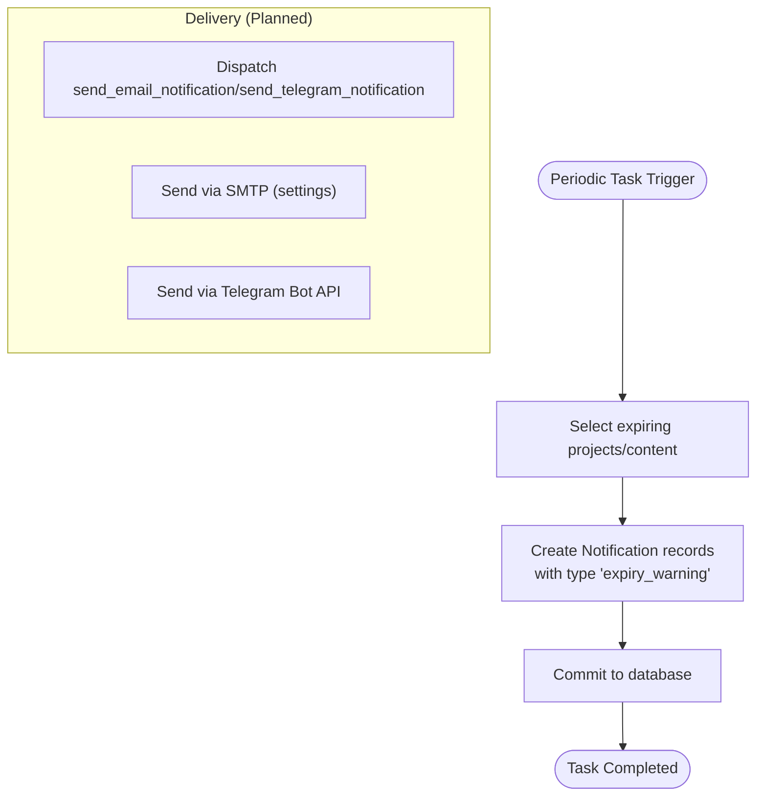
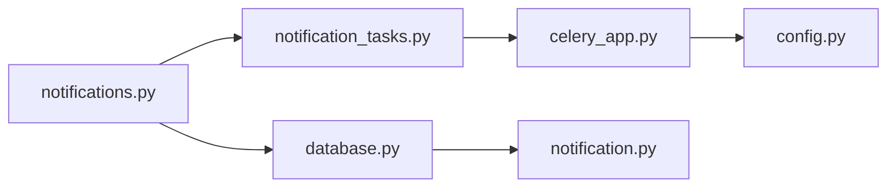

# Notifications API

<cite>
**Referenced Files in This Document**
- [notifications.py](file://app/api/routes/notifications.py)
- [notification.py](file://app/models/notification.py)
- [notification_tasks.py](file://app/tasks/notification_tasks.py)
- [celery_app.py](file://app/tasks/celery_app.py)
- [config.py](file://app/core/config.py)
- [database.py](file://app/core/database.py)
- [main.py](file://app/main.py)
- [project.py](file://app/models/project.py)
</cite>

## Table of Contents
1. [Introduction](#introduction)
2. [Project Structure](#project-structure)
3. [Core Components](#core-components)
4. [Architecture Overview](#architecture-overview)
5. [Detailed Component Analysis](#detailed-component-analysis)
6. [Dependency Analysis](#dependency-analysis)
7. [Performance Considerations](#performance-considerations)
8. [Troubleshooting Guide](#troubleshooting-guide)
9. [Conclusion](#conclusion)
10. [Appendices](#appendices)

## Introduction
This document describes the Notifications API endpoints in the ARV platform, focusing on:
- Retrieving notification history with filtering and sorting by creation time
- Verifying email and Telegram delivery capabilities via a test endpoint
- The notification structure returned by the API
- How notifications are generated for events such as project expiration
- How external systems can test their integration and debug notification status

## Project Structure
The Notifications API is implemented as a FastAPI router module and integrates with Celery tasks for asynchronous delivery. The notification persistence model and Celery configuration are defined in dedicated modules.

**Diagram sources**
- [main.py](file://app/main.py#L230-L261)
- [notifications.py](file://app/api/routes/notifications.py#L1-L39)
- [notification.py](file://app/models/notification.py#L1-L32)
- [notification_tasks.py](file://app/tasks/notification_tasks.py#L1-L118)
- [celery_app.py](file://app/tasks/celery_app.py#L1-L59)
- [config.py](file://app/core/config.py#L1-L134)
- [database.py](file://app/core/database.py#L1-L103)

**Section sources**
- [main.py](file://app/main.py#L230-L261)
- [notifications.py](file://app/api/routes/notifications.py#L1-L39)
- [notification.py](file://app/models/notification.py#L1-L32)
- [notification_tasks.py](file://app/tasks/notification_tasks.py#L1-L118)
- [celery_app.py](file://app/tasks/celery_app.py#L1-L59)
- [config.py](file://app/core/config.py#L1-L134)
- [database.py](file://app/core/database.py#L1-L103)

## Core Components
- Notifications API router: Defines GET and POST endpoints for listing and testing notifications.
- Notification model: Represents persisted notification records with delivery flags and timestamps.
- Celery tasks: Asynchronous workers for generating and sending notifications.
- Configuration: Email and Telegram settings used by background tasks.
- Database integration: Async SQLAlchemy session and base model.

Key responsibilities:
- list_notifications: Returns recent notifications ordered by creation time with a configurable limit.
- test_notification: Dispatches asynchronous Celery tasks to simulate email and Telegram delivery.
- Background generation: Periodic tasks create notifications for expiring projects and content.

**Section sources**
- [notifications.py](file://app/api/routes/notifications.py#L13-L39)
- [notification.py](file://app/models/notification.py#L1-L32)
- [notification_tasks.py](file://app/tasks/notification_tasks.py#L14-L118)
- [config.py](file://app/core/config.py#L78-L89)
- [database.py](file://app/core/database.py#L1-L47)

## Architecture Overview
The Notifications API follows a layered architecture:
- API layer: FastAPI routes handle HTTP requests and return JSON responses.
- Persistence layer: SQLAlchemy ORM models define the notification schema.
- Task layer: Celery tasks encapsulate asynchronous operations for sending and generating notifications.
- Configuration layer: Environment-driven settings control SMTP and Telegram integrations.

**Diagram sources**
- [notifications.py](file://app/api/routes/notifications.py#L13-L39)
- [notification_tasks.py](file://app/tasks/notification_tasks.py#L81-L118)
- [config.py](file://app/core/config.py#L78-L89)
- [database.py](file://app/core/database.py#L1-L47)

## Detailed Component Analysis

### Endpoint: list_notifications
- Method: GET
- Path: /api/notifications
- Query parameters:
  - limit: integer, default 50
- Behavior:
  - Retrieves notifications from the database ordered by created_at descending.
  - Applies a slice limit to constrain response size.
  - Returns a JSON array of notification objects.

Response shape (fields):
- id: integer
- company_id: integer
- project_id: integer
- ar_content_id: integer
- type: string
- email_sent: boolean
- telegram_sent: boolean
- subject: string
- message: text
- created_at: ISO 8601 timestamp string or null

Sorting and filtering:
- Sorting: Descending by created_at.
- Filtering: No explicit filters; pagination via limit.

Notes:
- The endpoint returns only the fields exposed by the route; internal fields like email_error and telegram_error are not included in the response.

**Section sources**
- [notifications.py](file://app/api/routes/notifications.py#L13-L33)
- [notification.py](file://app/models/notification.py#L10-L31)

### Endpoint: test_notification
- Method: POST
- Path: /api/notifications/test
- Query parameters:
  - email: string (recipient email)
  - chat_id: string (Telegram chat identifier)
- Behavior:
  - Dispatches two Celery tasks asynchronously:
    - send_email_notification.delay(email, subject, html_body)
    - send_telegram_notification.delay(chat_id, message)
  - Returns immediately with {"status":"sent"}.

Asynchronous task dispatch:
- Uses Celery app configured in app/tasks/celery_app.py.
- Tasks are enqueued into queues defined in Celery configuration.

Delivery status:
- The test endpoint does not return delivery status; it only confirms that tasks were dispatched.
- Actual delivery outcomes are logged by Celery tasks and can be observed in logs.

**Section sources**
- [notifications.py](file://app/api/routes/notifications.py#L35-L39)
- [notification_tasks.py](file://app/tasks/notification_tasks.py#L81-L118)
- [celery_app.py](file://app/tasks/celery_app.py#L1-L59)

### Notification Model
Fields and semantics:
- Identifiers: id, company_id, project_id, ar_content_id
- Type: notification_type (e.g., "expiry_warning")
- Email fields: email_sent (boolean), email_sent_at (timestamp), email_error (text)
- Telegram fields: telegram_sent (boolean), telegram_sent_at (timestamp), telegram_error (text)
- Content: subject (string), message (text)
- Metadata: JSONB payload for extensibility
- Timestamp: created_at (default UTC)

Constraints and defaults:
- email_sent and telegram_sent default to false.
- created_at defaults to current UTC time.

**Diagram sources**
- [notification.py](file://app/models/notification.py#L7-L31)

**Section sources**
- [notification.py](file://app/models/notification.py#L7-L31)

### Background Generation and Delivery
- Expiration checks:
  - Periodic Celery task generates notifications for expiring projects and AR content.
  - Notifications are persisted to the database with type "expiry_warning".
- Email and Telegram delivery:
  - Separate Celery tasks are defined for sending email and Telegram messages.
  - Current implementation logs placeholders indicating future implementation in Phase 6.

**Diagram sources**
- [notification_tasks.py](file://app/tasks/notification_tasks.py#L14-L78)
- [config.py](file://app/core/config.py#L78-L89)

**Section sources**
- [notification_tasks.py](file://app/tasks/notification_tasks.py#L14-L78)
- [config.py](file://app/core/config.py#L78-L89)

### API Definition Summary
- GET /api/notifications
  - Query: limit (integer)
  - Response: Array of notification objects sorted by created_at desc
- POST /api/notifications/test
  - Query: email (string), chat_id (string)
  - Response: {"status":"sent"}

Example usage:
- Retrieve latest 20 notifications: GET /api/notifications?limit=20
- Trigger test emails and Telegram messages: POST /api/notifications/test?email=...&chat_id=...

**Section sources**
- [notifications.py](file://app/api/routes/notifications.py#L13-L39)

## Dependency Analysis
- Router depends on:
  - Database session via get_db
  - Notification model for query construction
  - Celery tasks for asynchronous dispatch
- Celery app depends on:
  - Broker and result backend URLs from settings
  - Task queues configuration
- Configuration affects:
  - SMTP host/port/credentials and sender
  - Telegram bot token and admin chat ID

**Diagram sources**
- [notifications.py](file://app/api/routes/notifications.py#L1-L39)
- [database.py](file://app/core/database.py#L1-L47)
- [notification_tasks.py](file://app/tasks/notification_tasks.py#L1-L118)
- [celery_app.py](file://app/tasks/celery_app.py#L1-L59)
- [config.py](file://app/core/config.py#L78-L89)
- [notification.py](file://app/models/notification.py#L7-L31)

**Section sources**
- [notifications.py](file://app/api/routes/notifications.py#L1-L39)
- [notification_tasks.py](file://app/tasks/notification_tasks.py#L1-L118)
- [celery_app.py](file://app/tasks/celery_app.py#L1-L59)
- [config.py](file://app/core/config.py#L78-L89)
- [database.py](file://app/core/database.py#L1-L47)
- [notification.py](file://app/models/notification.py#L7-L31)

## Performance Considerations
- Limit parameter: Use limit to constrain response size for list_notifications.
- Sorting: created_at desc ensures most recent notifications appear first.
- Asynchronous delivery: Test endpoint dispatches tasks without blocking the HTTP response.
- Database pooling: Async SQLAlchemy settings configured for efficient concurrent access.

[No sources needed since this section provides general guidance]

## Troubleshooting Guide
Common issues and checks:
- Test endpoint returns immediately:
  - Expected behavior; tasks are dispatched asynchronously. Verify Celery worker logs for delivery outcomes.
- Missing delivery status in responses:
  - list_notifications does not expose email_error or telegram_error; inspect Celery logs for failures.
- Email delivery:
  - Ensure SMTP settings are configured in environment variables.
- Telegram delivery:
  - Ensure TELEGRAM_BOT_TOKEN is set; verify chat_id correctness.
- Database connectivity:
  - Confirm DATABASE_URL and pool settings; verify migrations are applied.

Operational tips:
- Inspect Celery logs for task execution and errors.
- Use GET /api/notifications?limit=50 to review recent notifications.
- For debugging, trigger POST /api/notifications/test with your email and Telegram chat_id.

**Section sources**
- [config.py](file://app/core/config.py#L78-L89)
- [notification_tasks.py](file://app/tasks/notification_tasks.py#L81-L118)
- [notifications.py](file://app/api/routes/notifications.py#L13-L39)

## Conclusion
The Notifications API provides:
- A simple endpoint to list recent notifications with sorting and pagination
- A test endpoint to verify email and Telegram delivery via asynchronous Celery tasks
- A persistent notification model with delivery flags and metadata
- Background tasks for generating notifications for expiring projects and content

External systems can use the test endpoint to validate integrations and monitor delivery outcomes through logs and the notification history.

[No sources needed since this section summarizes without analyzing specific files]

## Appendices

### Notification Structure Reference
- Fields returned by list_notifications:
  - id, company_id, project_id, ar_content_id, type, email_sent, telegram_sent, subject, message, created_at

- Internal fields (not returned by API):
  - email_sent_at, email_error, telegram_sent_at, telegram_error, metadata

**Section sources**
- [notifications.py](file://app/api/routes/notifications.py#L13-L33)
- [notification.py](file://app/models/notification.py#L10-L31)

### Example Workflows
- Checking notification status:
  - GET /api/notifications?limit=20
  - Inspect email_sent and telegram_sent flags
- Triggering test messages:
  - POST /api/notifications/test?email=your-email@example.com&chat_id=your-telegram-chat-id
  - Observe Celery logs for delivery results

**Section sources**
- [notifications.py](file://app/api/routes/notifications.py#L13-L39)
- [notification_tasks.py](file://app/tasks/notification_tasks.py#L81-L118)