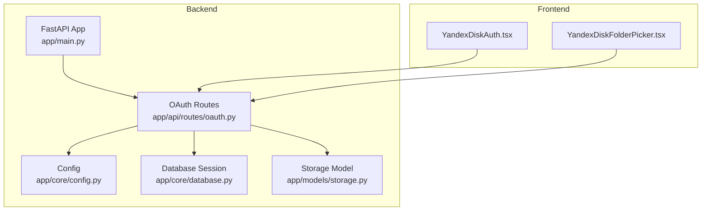
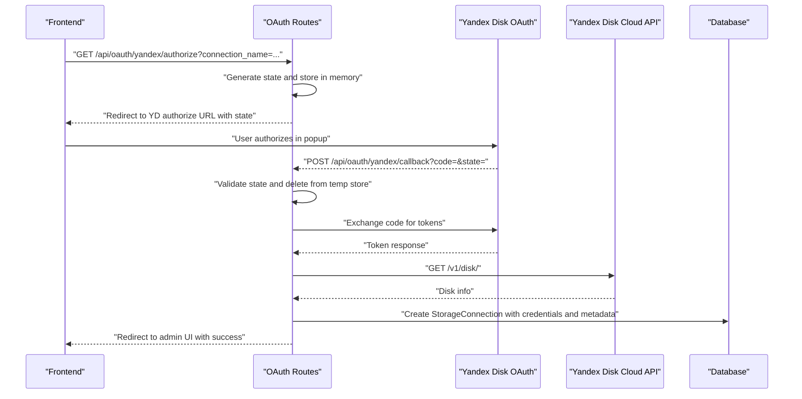
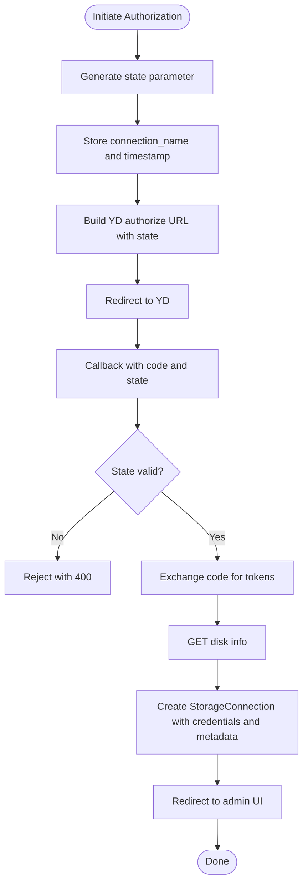
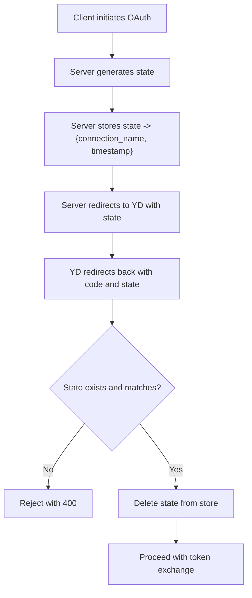
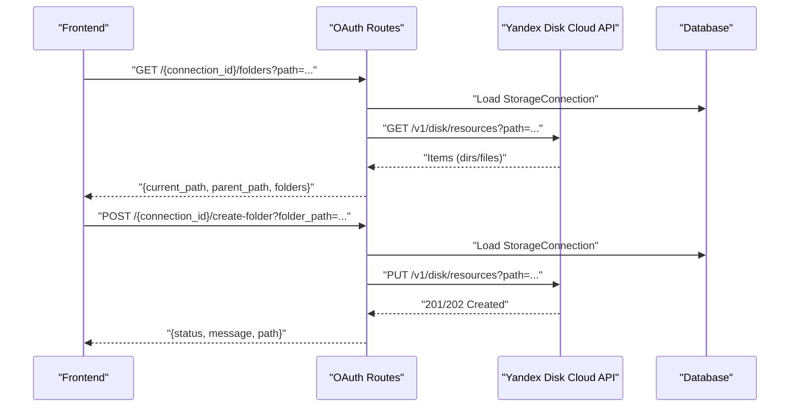
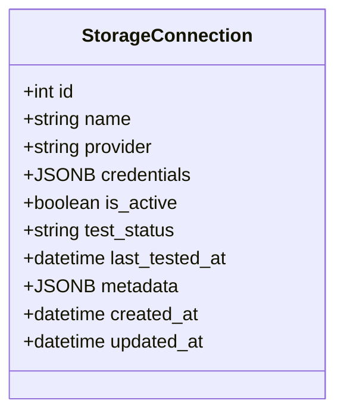
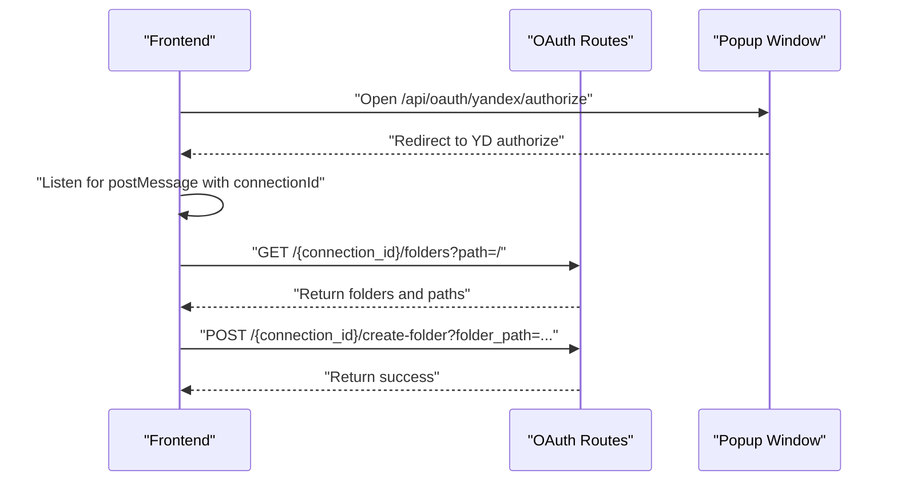
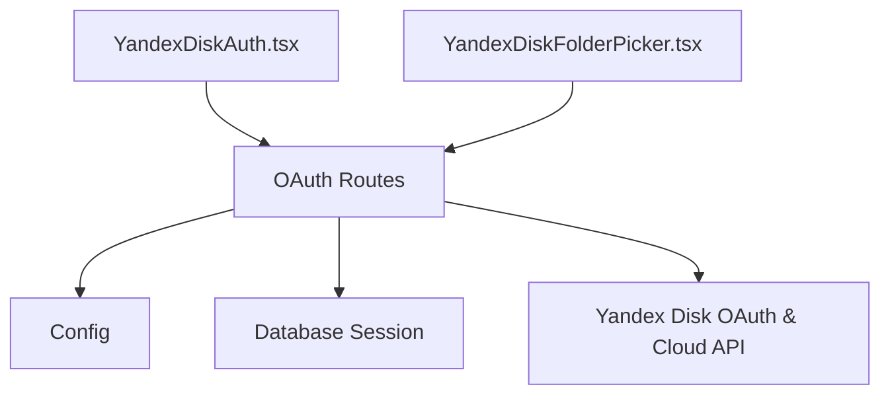

# OAuth Integration API

<cite>
**Referenced Files in This Document**
- [oauth.py](file://app/api/routes/oauth.py)
- [storage.py](file://app/models/storage.py)
- [storage_schemas.py](file://app/schemas/storage.py)
- [config.py](file://app/core/config.py)
- [database.py](file://app/core/database.py)
- [main.py](file://app/main.py)
- [YandexDiskAuth.tsx](file://frontend/components/YandexDiskAuth.tsx)
- [YandexDiskFolderPicker.tsx](file://frontend/components/YandexDiskFolderPicker.tsx)
- [.env.example](file://.env.example)
</cite>

## Table of Contents
1. [Introduction](#introduction)
2. [Project Structure](#project-structure)
3. [Core Components](#core-components)
4. [Architecture Overview](#architecture-overview)
5. [Detailed Component Analysis](#detailed-component-analysis)
6. [Dependency Analysis](#dependency-analysis)
7. [Performance Considerations](#performance-considerations)
8. [Troubleshooting Guide](#troubleshooting-guide)
9. [Conclusion](#conclusion)
10. [Appendices](#appendices)

## Introduction
This document describes the OAuth Integration API for connecting Yandex Disk to the ARV platform. It covers the three-step OAuth flow (initiation, callback, and connection creation), the state parameter mechanism for CSRF protection, and the folder browsing endpoints for navigating and creating directories within a connected Yandex Disk account. It also documents the credential storage model and metadata captured during connection setup, along with practical guidance for implementing the OAuth popup flow and handling redirect URLs in frontend applications.

## Project Structure
The OAuth integration spans backend API routes, configuration, database models, and frontend components:
- Backend API routes define the OAuth endpoints and folder operations.
- Configuration holds OAuth client credentials and redirect URI.
- Database models represent storage connections and associated metadata.
- Frontend components implement the OAuth popup and folder picker UI.

**Diagram sources**
- [main.py](file://app/main.py#L230-L262)
- [oauth.py](file://app/api/routes/oauth.py#L1-L184)
- [config.py](file://app/core/config.py#L62-L102)
- [database.py](file://app/core/database.py#L1-L103)
- [storage.py](file://app/models/storage.py#L1-L81)
- [YandexDiskAuth.tsx](file://frontend/components/YandexDiskAuth.tsx#L1-L77)
- [YandexDiskFolderPicker.tsx](file://frontend/components/YandexDiskFolderPicker.tsx#L1-L242)

**Section sources**
- [main.py](file://app/main.py#L230-L262)
- [oauth.py](file://app/api/routes/oauth.py#L1-L184)
- [config.py](file://app/core/config.py#L62-L102)
- [database.py](file://app/core/database.py#L1-L103)
- [storage.py](file://app/models/storage.py#L1-L81)
- [YandexDiskAuth.tsx](file://frontend/components/YandexDiskAuth.tsx#L1-L77)
- [YandexDiskFolderPicker.tsx](file://frontend/components/YandexDiskFolderPicker.tsx#L1-L242)

## Core Components
- OAuth Routes: Define the initiation, callback, and folder operations for Yandex Disk.
- Configuration: Provides OAuth client credentials and redirect URI.
- Storage Model: Defines the persisted storage connection record with credentials and metadata.
- Frontend Components: Implement the OAuth popup and folder picker UI.

Key responsibilities:
- Initiate OAuth authorization with a generated state parameter.
- Exchange authorization code for tokens and persist connection details.
- Provide folder listing and creation endpoints for navigation.
- Store credentials and metadata for future API calls.

**Section sources**
- [oauth.py](file://app/api/routes/oauth.py#L1-L184)
- [config.py](file://app/core/config.py#L62-L102)
- [storage.py](file://app/models/storage.py#L1-L81)
- [YandexDiskAuth.tsx](file://frontend/components/YandexDiskAuth.tsx#L1-L77)
- [YandexDiskFolderPicker.tsx](file://frontend/components/YandexDiskFolderPicker.tsx#L1-L242)

## Architecture Overview
The OAuth integration follows a standard three-step flow:
1. Initiate OAuth authorization with a state parameter.
2. Receive the callback with authorization code and state, exchange code for tokens, and create a storage connection.
3. Use the stored credentials to browse and manage folders.

**Diagram sources**
- [oauth.py](file://app/api/routes/oauth.py#L19-L106)
- [config.py](file://app/core/config.py#L73-L93)
- [storage.py](file://app/models/storage.py#L1-L39)

## Detailed Component Analysis

### OAuth Routes: Three-Step Flow
Endpoints:
- Initiate Authorization: GET /api/oauth/yandex/authorize
- Callback: GET /api/oauth/yandex/callback
- Folder Listing: GET /api/oauth/yandex/{connection_id}/folders
- Create Folder: POST /api/oauth/yandex/{connection_id}/create-folder

Processing logic:
- Initiate Authorization:
  - Generates a random state parameter.
  - Stores connection_name and timestamp in an in-memory dictionary keyed by state.
  - Builds the authorization URL with client_id, redirect_uri, and state.
  - Returns a redirect response to Yandex Disk.

- Callback:
  - Validates state against the in-memory store; rejects invalid or expired state.
  - Exchanges authorization code for OAuth tokens using client_id and client_secret.
  - Retrieves disk information to capture user and quota metadata.
  - Creates a StorageConnection record with credentials and metadata.
  - Redirects to the admin UI with success.

- Folder Listing:
  - Loads the connection by ID and validates provider type.
  - Uses stored OAuth token to call Yandex Disk resources API.
  - Filters items to directories and returns current path, parent path, and folder list.

- Create Folder:
  - Validates connection and provider type.
  - Uses stored OAuth token to create a new resource (directory).
  - Returns success message and path.

**Diagram sources**
- [oauth.py](file://app/api/routes/oauth.py#L19-L106)

**Section sources**
- [oauth.py](file://app/api/routes/oauth.py#L19-L184)

### State Parameter Mechanism and CSRF Protection
- A cryptographically random state parameter is generated for each authorization request.
- The state is temporarily stored in memory with connection_name and timestamp.
- On callback, the state is validated against the in-memory store and immediately deleted.
- If state is missing or invalid, the request is rejected with a 400 error.
- The in-memory store is suitable for development; in production, replace with Redis or another durable store.

**Diagram sources**
- [oauth.py](file://app/api/routes/oauth.py#L19-L53)

**Section sources**
- [oauth.py](file://app/api/routes/oauth.py#L16-L53)

### Folder Browsing Endpoints
- List Folders:
  - Endpoint: GET /api/oauth/yandex/{connection_id}/folders
  - Query: path (default "/")
  - Behavior: Validates connection and provider, retrieves OAuth token, calls Yandex Disk resources API, filters directories, computes parent path, and returns current path, parent path, and folder list.

- Create Folder:
  - Endpoint: POST /api/oauth/yandex/{connection_id}/create-folder
  - Query: folder_path
  - Behavior: Validates connection and provider, retrieves OAuth token, calls Yandex Disk resources API to create a directory, and returns success status.

**Diagram sources**
- [oauth.py](file://app/api/routes/oauth.py#L108-L184)

**Section sources**
- [oauth.py](file://app/api/routes/oauth.py#L108-L184)

### Credential Storage Model and Metadata
- StorageConnection model persists:
  - name: Human-readable connection name.
  - provider: Identifier for the provider (e.g., yandex_disk).
  - credentials: JSONB containing OAuth tokens and token metadata.
  - is_active: Whether the connection is active.
  - test_status and last_tested_at: Connection health and timestamp.
  - metadata: Provider-specific details (e.g., user display name, total/used space).

- Credentials captured during connection setup include:
  - oauth_token
  - refresh_token
  - expires_in
  - token_type

- Additional metadata captured:
  - user_display_name
  - total_space
  - used_space

**Diagram sources**
- [storage.py](file://app/models/storage.py#L1-L39)

**Section sources**
- [storage.py](file://app/models/storage.py#L1-L39)
- [oauth.py](file://app/api/routes/oauth.py#L81-L106)
- [storage_schemas.py](file://app/schemas/storage.py#L19-L23)

### Frontend Implementation Notes
- OAuth Popup:
  - Opens a centered popup to the authorization endpoint with connection_name.
  - Monitors popup closure and listens for a postMessage event to receive the connectionId.
  - Disables button while loading and shows a dialog prompting the user to authorize.

- Folder Picker:
  - Loads folders for the selected connectionId and current path.
  - Supports navigation up and home, creating new folders, and selecting a path.
  - Uses Axios to call the backend endpoints for listing and creating folders.

**Diagram sources**
- [YandexDiskAuth.tsx](file://frontend/components/YandexDiskAuth.tsx#L1-L77)
- [YandexDiskFolderPicker.tsx](file://frontend/components/YandexDiskFolderPicker.tsx#L1-L242)
- [oauth.py](file://app/api/routes/oauth.py#L108-L184)

**Section sources**
- [YandexDiskAuth.tsx](file://frontend/components/YandexDiskAuth.tsx#L1-L77)
- [YandexDiskFolderPicker.tsx](file://frontend/components/YandexDiskFolderPicker.tsx#L1-L242)

## Dependency Analysis
- API routes depend on:
  - Configuration for OAuth client credentials and redirect URI.
  - Database session for creating StorageConnection records.
  - Yandex Disk APIs for token exchange and resource operations.
- Frontend components depend on:
  - Backend endpoints for OAuth initiation, callback handling, and folder operations.

**Diagram sources**
- [oauth.py](file://app/api/routes/oauth.py#L1-L184)
- [config.py](file://app/core/config.py#L62-L102)
- [database.py](file://app/core/database.py#L1-L103)
- [YandexDiskAuth.tsx](file://frontend/components/YandexDiskAuth.tsx#L1-L77)
- [YandexDiskFolderPicker.tsx](file://frontend/components/YandexDiskFolderPicker.tsx#L1-L242)

**Section sources**
- [oauth.py](file://app/api/routes/oauth.py#L1-L184)
- [config.py](file://app/core/config.py#L62-L102)
- [database.py](file://app/core/database.py#L1-L103)
- [YandexDiskAuth.tsx](file://frontend/components/YandexDiskAuth.tsx#L1-L77)
- [YandexDiskFolderPicker.tsx](file://frontend/components/YandexDiskFolderPicker.tsx#L1-L242)

## Performance Considerations
- Token exchange and disk info retrieval are performed synchronously during callback; consider caching disk metadata to reduce repeated API calls.
- Folder listing uses a fixed page size; pagination could be added if large directories are expected.
- The in-memory state store is acceptable for development; for production, use a distributed cache to support horizontal scaling.
- Network latency to Yandex Disk APIs can impact UX; implement timeouts and retry logic where appropriate.

[No sources needed since this section provides general guidance]

## Troubleshooting Guide
Common issues and resolutions:
- Invalid state parameter:
  - Cause: Missing or mismatched state in callback.
  - Resolution: Ensure popup completes the full OAuth flow and that the state is preserved and sent back.

- Missing OAuth token in credentials:
  - Cause: Connection not created or credentials not saved.
  - Resolution: Verify callback succeeded and StorageConnection was created with credentials.

- Non-Yandex Disk provider:
  - Cause: Calling folder endpoints for a non-yandex_disk connection.
  - Resolution: Ensure connection provider is yandex_disk before calling folder endpoints.

- Disk API errors:
  - Cause: Unauthorized or rate-limited responses from Yandex Disk.
  - Resolution: Check token validity and network connectivity; retry with backoff.

- Redirect URI mismatch:
  - Cause: Redirect URI configured does not match the one used in authorization.
  - Resolution: Confirm YANDEX_OAUTH_REDIRECT_URI in configuration matches the frontend popup URL.

**Section sources**
- [oauth.py](file://app/api/routes/oauth.py#L41-L106)
- [oauth.py](file://app/api/routes/oauth.py#L108-L184)
- [config.py](file://app/core/config.py#L73-L93)

## Conclusion
The OAuth Integration API provides a secure, state-protected flow to connect Yandex Disk accounts, persist credentials and metadata, and enable folder navigation and creation. The frontend components demonstrate a practical popup-based authorization and folder picker experience. For production deployments, consider replacing the in-memory state store with a durable cache and adding robust error handling and retries for external API calls.

[No sources needed since this section summarizes without analyzing specific files]

## Appendices

### API Reference

- Initiate Authorization
  - Method: GET
  - Path: /api/oauth/yandex/authorize
  - Query Parameters:
    - connection_name: string (required)
  - Response: Redirect to Yandex Disk authorization URL with state parameter.

- Callback
  - Method: GET
  - Path: /api/oauth/yandex/callback
  - Query Parameters:
    - code: string (required)
    - state: string (required)
  - Response: Redirect to admin UI with success.

- List Folders
  - Method: GET
  - Path: /api/oauth/yandex/{connection_id}/folders
  - Query Parameters:
    - path: string (default "/")
  - Response: JSON with current_path, parent_path, and folders array.

- Create Folder
  - Method: POST
  - Path: /api/oauth/yandex/{connection_id}/create-folder
  - Query Parameters:
    - folder_path: string (required)
  - Response: JSON with status, message, and path.

**Section sources**
- [oauth.py](file://app/api/routes/oauth.py#L19-L184)

### Configuration Keys
- YANDEX_OAUTH_CLIENT_ID: OAuth client identifier.
- YANDEX_OAUTH_CLIENT_SECRET: OAuth client secret.
- YANDEX_OAUTH_REDIRECT_URI: Callback URL used by Yandex Disk.
- ADMIN_FRONTEND_URL: Admin UI URL for redirect after successful connection.

Environment file example keys:
- YANDEX_OAUTH_CLIENT_ID
- YANDEX_OAUTH_CLIENT_SECRET
- YANDEX_OAUTH_REDIRECT_URI

**Section sources**
- [config.py](file://app/core/config.py#L73-L93)
- [.env.example](file://.env.example#L30-L34)