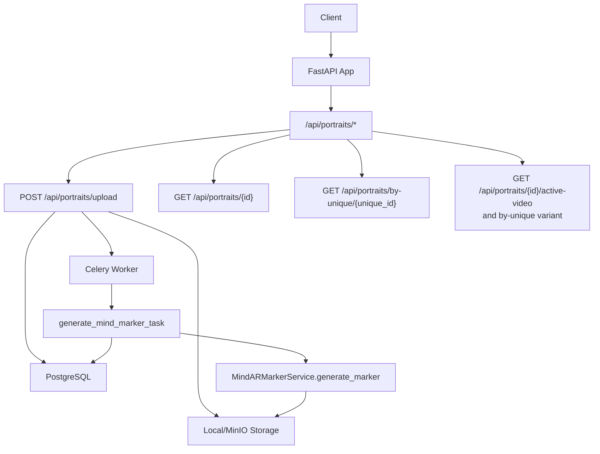
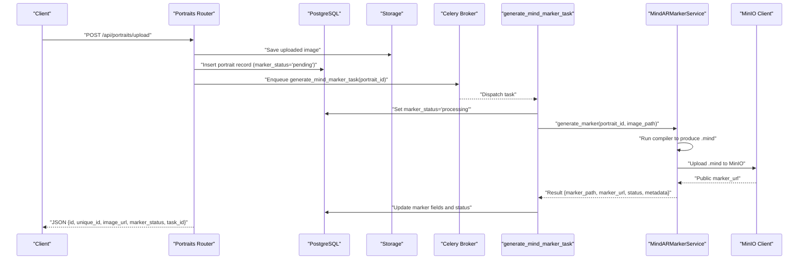
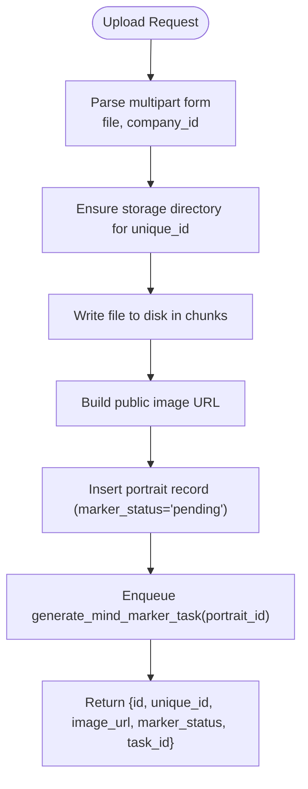
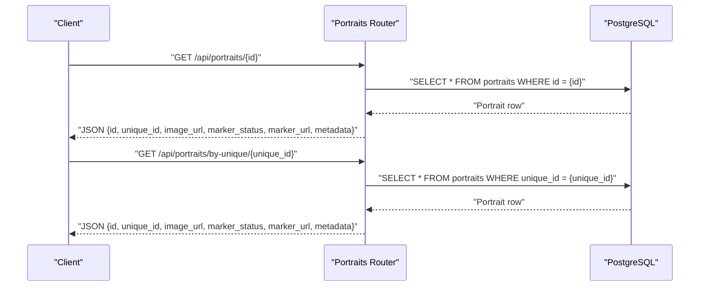
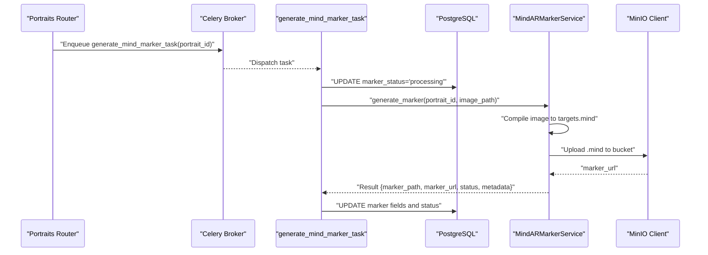
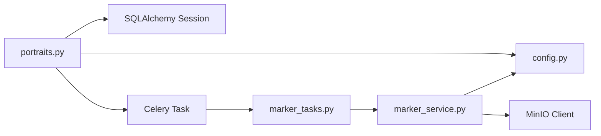

# Portrait Management API

<cite>
**Referenced Files in This Document**
- [app/main.py](file://app/main.py)
- [app/api/routes/portraits.py](file://app/api/routes/portraits.py)
- [app/models/portrait.py](file://app/models/portrait.py)
- [app/tasks/marker_tasks.py](file://app/tasks/marker_tasks.py)
- [app/services/marker_service.py](file://app/services/marker_service.py)
- [app/core/config.py](file://app/core/config.py)
- [app/core/storage.py](file://app/core/storage.py)
</cite>

## Table of Contents
1. [Introduction](#introduction)
2. [Project Structure](#project-structure)
3. [Core Components](#core-components)
4. [Architecture Overview](#architecture-overview)
5. [Detailed Component Analysis](#detailed-component-analysis)
6. [Dependency Analysis](#dependency-analysis)
7. [Performance Considerations](#performance-considerations)
8. [Troubleshooting Guide](#troubleshooting-guide)
9. [Conclusion](#conclusion)

## Introduction
This document describes the Portrait Management API endpoints for the ARV platform. It covers:
- Creating portrait records with image uploads and initiating automatic marker generation
- UUID-based unique identifiers and public URL generation for uploaded images
- Retrieving portrait metadata by database ID or unique_id, including marker status and URLs
- Placeholder nature of active-video endpoints (not implemented)
- Practical examples for uploading portraits and checking marker generation status

## Project Structure
The Portrait Management API is implemented as part of the FastAPI application. Routes are registered under the /api prefix and include:
- Upload endpoint for creating portrait records and triggering marker generation
- Retrieval endpoints for portrait metadata by numeric ID and by unique_id
- Placeholder endpoints for active-video (not implemented)

**Diagram sources**
- [app/main.py](file://app/main.py#L230-L262)
- [app/api/routes/portraits.py](file://app/api/routes/portraits.py#L22-L116)
- [app/tasks/marker_tasks.py](file://app/tasks/marker_tasks.py#L39-L90)
- [app/services/marker_service.py](file://app/services/marker_service.py#L13-L134)
- [app/core/storage.py](file://app/core/storage.py#L8-L71)

**Section sources**
- [app/main.py](file://app/main.py#L230-L262)

## Core Components
- Route module: Defines endpoints for portrait upload, retrieval, and placeholders.
- Model: Defines the portrait entity with UUID-based unique_id, file paths, marker fields, and timestamps.
- Task: Asynchronous Celery task that generates Mind AR markers and updates the database.
- Service: Encapsulates Mind AR marker generation, including compiler invocation and MinIO upload.
- Configuration: Provides storage and compiler settings used during upload and marker generation.
- Storage client: Provides MinIO upload and public URL generation.

Key responsibilities:
- Upload endpoint persists the image, builds a public URL, creates a portrait record, and enqueues marker generation.
- Retrieval endpoints return portrait metadata including marker status and URLs.
- Placeholder endpoints return 404 to indicate unimplemented functionality.

**Section sources**
- [app/api/routes/portraits.py](file://app/api/routes/portraits.py#L22-L116)
- [app/models/portrait.py](file://app/models/portrait.py#L1-L28)
- [app/tasks/marker_tasks.py](file://app/tasks/marker_tasks.py#L39-L90)
- [app/services/marker_service.py](file://app/services/marker_service.py#L13-L134)
- [app/core/config.py](file://app/core/config.py#L27-L30)
- [app/core/storage.py](file://app/core/storage.py#L8-L71)

## Architecture Overview
The upload flow integrates file storage, database persistence, and asynchronous task processing. The retrieval flow reads from the database and returns computed or stored metadata.

**Diagram sources**
- [app/api/routes/portraits.py](file://app/api/routes/portraits.py#L22-L68)
- [app/tasks/marker_tasks.py](file://app/tasks/marker_tasks.py#L39-L90)
- [app/services/marker_service.py](file://app/services/marker_service.py#L13-L134)
- [app/core/storage.py](file://app/core/storage.py#L44-L67)

## Detailed Component Analysis

### Upload Endpoint: POST /api/portraits/upload
Purpose:
- Accepts multipart form data with an image file and company_id
- Saves the image to storage under a unique directory
- Builds a public URL mapped to the storage path
- Creates a portrait record with marker_status set to pending
- Enqueues a Celery task to generate a Mind AR marker asynchronously
- Returns the new record’s id, unique_id, image_url, marker_status, and the Celery task_id

Processing logic highlights:
- Unique identifier: A UUID is generated and used to create a dedicated directory for the portrait’s assets.
- Image saving: Reads the file in chunks and writes to disk.
- URL mapping: Converts the local storage path to a public URL using a base path mapping.
- Database insertion: Adds a new portrait row with initial metadata and pending marker status.
- Task enqueue: Calls the Celery task with the newly created portrait’s database id.

**Diagram sources**
- [app/api/routes/portraits.py](file://app/api/routes/portraits.py#L22-L68)

**Section sources**
- [app/api/routes/portraits.py](file://app/api/routes/portraits.py#L22-L68)

### Retrieval Endpoints
- GET /api/portraits/{id}: Returns portrait metadata by numeric database ID. Includes id, unique_id, image_url, marker_status, marker_url, and metadata.
- GET /api/portraits/by-unique/{unique_id}: Returns portrait metadata by unique_id. Includes the same fields as above.

Behavior:
- Both endpoints return a 404 if the portrait does not exist.
- marker_url and metadata are populated when marker generation completes successfully.

**Diagram sources**
- [app/api/routes/portraits.py](file://app/api/routes/portraits.py#L71-L102)

**Section sources**
- [app/api/routes/portraits.py](file://app/api/routes/portraits.py#L71-L102)
- [app/models/portrait.py](file://app/models/portrait.py#L1-L28)

### Placeholder Endpoints: Active Video
- GET /api/portraits/{id}/active-video
- GET /api/portraits/by-unique/{unique_id}/active-video

Both endpoints are placeholders and return 404 to indicate that active video assignment is not implemented yet.

**Section sources**
- [app/api/routes/portraits.py](file://app/api/routes/portraits.py#L105-L116)

### UUID-Based Unique Identifier System
- unique_id is a UUID column in the portrait table, indexed for efficient lookups.
- During upload, a UUID is generated and used to organize storage and later retrieve portraits by unique_id.
- The unique_id is returned in API responses and can be used for public access to the AR viewer.

**Section sources**
- [app/models/portrait.py](file://app/models/portrait.py#L10-L12)
- [app/api/routes/portraits.py](file://app/api/routes/portraits.py#L22-L68)

### Public URL Generation for Uploaded Images
- build_image_url maps the configured storage base path to a public URL under /storage.
- For local storage, the URL is constructed so that Nginx can serve files from the mounted storage directory.
- For MinIO, the MinIO client returns a public URL pointing to the MinIO endpoint.

**Section sources**
- [app/api/routes/portraits.py](file://app/api/routes/portraits.py#L15-L20)
- [app/core/config.py](file://app/core/config.py#L59-L61)
- [app/core/storage.py](file://app/core/storage.py#L44-L67)

### Automatic Marker Generation Workflow
- The upload endpoint enqueues generate_mind_marker_task with the portrait id.
- The task sets marker_status to processing, runs the Mind AR compiler, uploads the resulting .mind file to storage, and updates the database with marker_path, marker_url, marker_status, and metadata.
- If generation fails, the task retries with exponential backoff and sets marker_status to failed.

**Diagram sources**
- [app/api/routes/portraits.py](file://app/api/routes/portraits.py#L59-L68)
- [app/tasks/marker_tasks.py](file://app/tasks/marker_tasks.py#L39-L90)
- [app/services/marker_service.py](file://app/services/marker_service.py#L13-L134)
- [app/core/storage.py](file://app/core/storage.py#L44-L67)

**Section sources**
- [app/tasks/marker_tasks.py](file://app/tasks/marker_tasks.py#L39-L90)
- [app/services/marker_service.py](file://app/services/marker_service.py#L13-L134)

## Dependency Analysis
- The portraits router depends on:
  - SQLAlchemy async session for database operations
  - Settings for storage base path and compiler configuration
  - Celery task for asynchronous marker generation
  - MinIO client for public URL generation (when applicable)
- The marker task depends on:
  - MindARMarkerService for compiler invocation and metadata extraction
  - Database session for updating portrait records
- The MindARMarkerService depends on:
  - Settings for compiler path and max features
  - MinIO client for uploading marker artifacts

**Diagram sources**
- [app/api/routes/portraits.py](file://app/api/routes/portraits.py#L22-L68)
- [app/tasks/marker_tasks.py](file://app/tasks/marker_tasks.py#L39-L90)
- [app/services/marker_service.py](file://app/services/marker_service.py#L13-L134)
- [app/core/config.py](file://app/core/config.py#L27-L30)
- [app/core/storage.py](file://app/core/storage.py#L8-L71)

**Section sources**
- [app/api/routes/portraits.py](file://app/api/routes/portraits.py#L22-L68)
- [app/tasks/marker_tasks.py](file://app/tasks/marker_tasks.py#L39-L90)
- [app/services/marker_service.py](file://app/services/marker_service.py#L13-L134)
- [app/core/config.py](file://app/core/config.py#L27-L30)
- [app/core/storage.py](file://app/core/storage.py#L8-L71)

## Performance Considerations
- Upload throughput: The upload endpoint streams file chunks to disk. For large images, consider limiting upload sizes and enabling streaming compression if needed.
- Database I/O: Each upload performs a single insert and a flush/commit. Ensure database connection pooling is tuned appropriately.
- Asynchronous processing: Marker generation runs in Celery workers. Tune worker concurrency and queue backpressure to handle bursts.
- Compiler overhead: Mind AR compilation cost scales with image size and max_features. Adjust settings to balance quality and speed.
- Storage latency: MinIO uploads introduce network latency. Consider caching or CDN for marker URLs if serving widely.

[No sources needed since this section provides general guidance]

## Troubleshooting Guide
Common issues and resolutions:
- 404 Not Found on retrieval:
  - Occurs when portrait id or unique_id does not exist. Verify the identifier and ensure the upload succeeded.
- Marker generation failures:
  - The task retries with exponential backoff. Check logs for compiler errors and ensure the compiler is installed and executable.
- Storage upload failures:
  - MinIO upload errors indicate misconfiguration or network issues. Verify endpoint, credentials, and bucket policies.
- Placeholder active-video endpoints:
  - These endpoints intentionally return 404. Implement video assignment before enabling these endpoints.

Operational checks:
- Confirm that the storage base path is correctly configured and accessible by the application.
- Ensure Celery broker and backend are reachable and workers are running.
- Validate that the Mind AR compiler command is available in the environment.

**Section sources**
- [app/api/routes/portraits.py](file://app/api/routes/portraits.py#L71-L116)
- [app/tasks/marker_tasks.py](file://app/tasks/marker_tasks.py#L76-L82)
- [app/services/marker_service.py](file://app/services/marker_service.py#L62-L72)
- [app/core/storage.py](file://app/core/storage.py#L44-L67)

## Conclusion
The Portrait Management API provides a robust mechanism for uploading portrait images, generating Mind AR markers asynchronously, and retrieving portrait metadata. The UUID-based unique identifier enables flexible access patterns, while public URL generation ensures assets are accessible. Placeholder endpoints for active video are documented for future implementation. By tuning storage and Celery configurations, the system can scale to support production workloads.