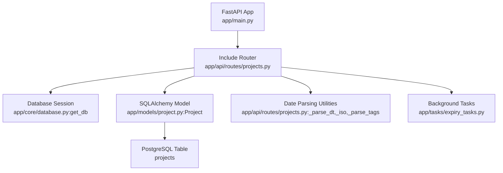
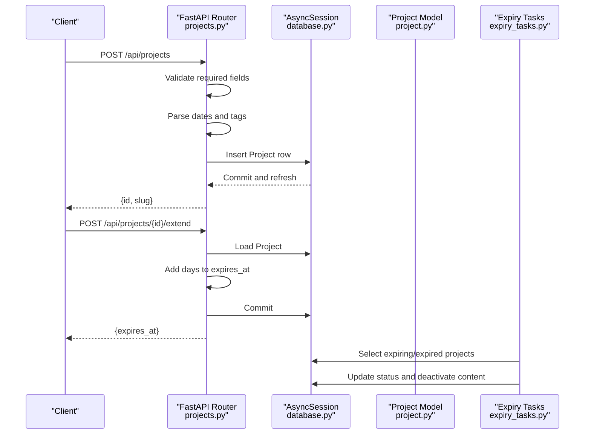
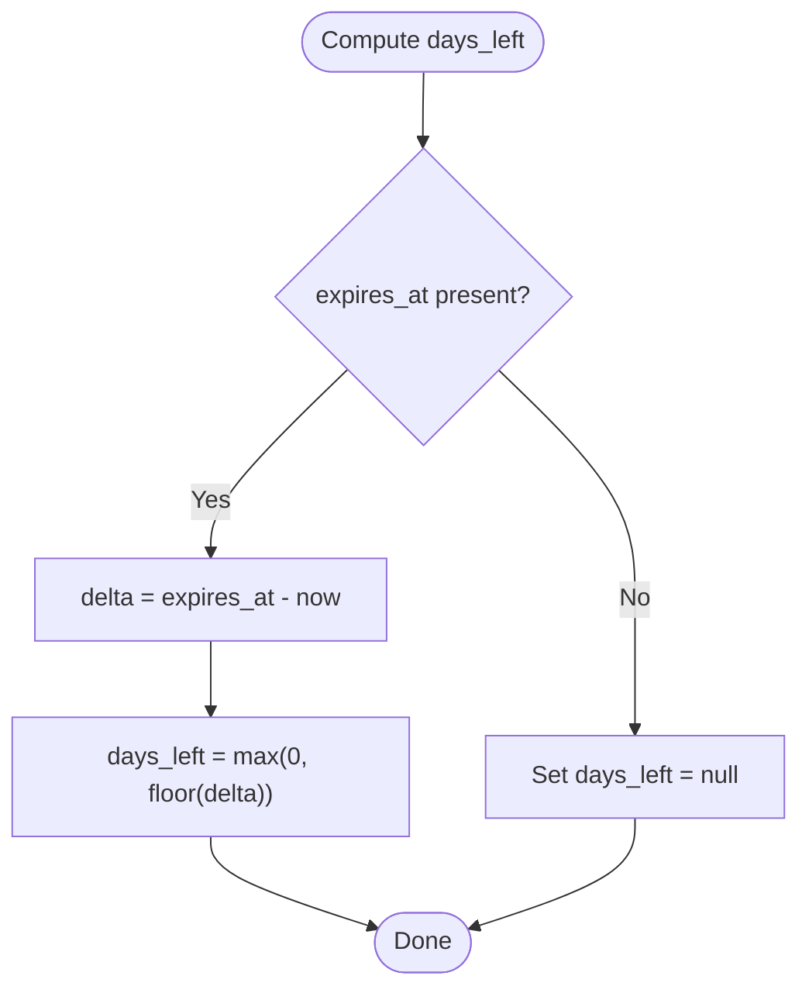
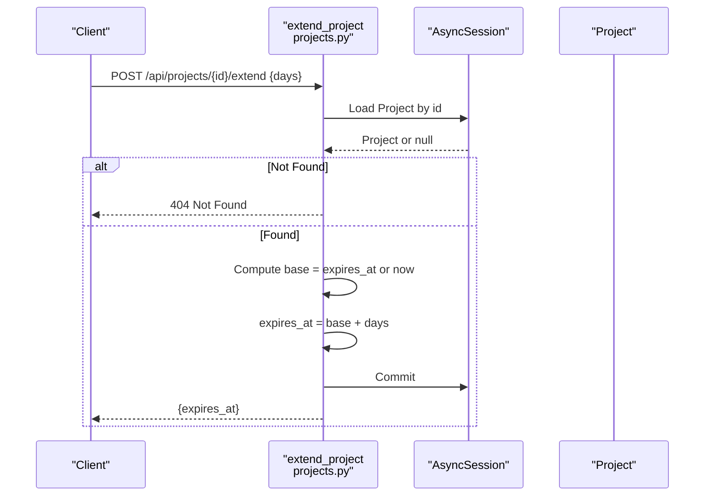
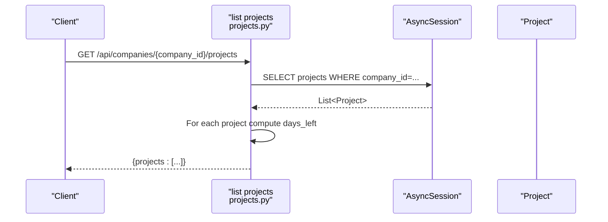
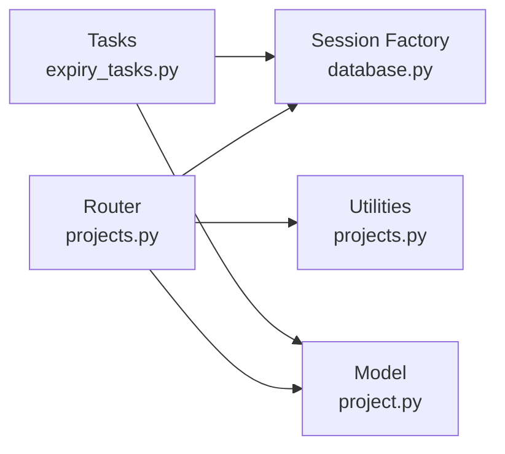

# Project Management API

<cite>
**Referenced Files in This Document**
- [projects.py](file://app/api/routes/projects.py)
- [project.py](file://app/models/project.py)
- [main.py](file://app/main.py)
- [database.py](file://app/core/database.py)
- [config.py](file://app/core/config.py)
- [expiry_tasks.py](file://app/tasks/expiry_tasks.py)
- [20251205_perf_idx.py](file://alembic/versions/20251205_perf_idx.py)
</cite>

## Table of Contents
1. [Introduction](#introduction)
2. [Project Structure](#project-structure)
3. [Core Components](#core-components)
4. [Architecture Overview](#architecture-overview)
5. [Detailed Component Analysis](#detailed-component-analysis)
6. [Dependency Analysis](#dependency-analysis)
7. [Performance Considerations](#performance-considerations)
8. [Troubleshooting Guide](#troubleshooting-guide)
9. [Conclusion](#conclusion)

## Introduction
This document describes the Project Management API endpoints in the ARV platform. It covers project creation (standalone and company-scoped), updates, deletions, and subscription validity extensions. It also explains the request payload structure, required and optional fields, date parsing utilities, and how project status and remaining validity days are computed. Finally, it documents error handling and response formats for listing projects with lifecycle information.

## Project Structure
The Project Management API is implemented as a FastAPI router module and backed by SQLAlchemy ORM models. The API router exposes endpoints under the /api prefix and integrates with the application’s global exception handling and logging middleware.

**Diagram sources**
- [main.py](file://app/main.py#L230-L261)
- [projects.py](file://app/api/routes/projects.py#L1-L145)
- [database.py](file://app/core/database.py#L30-L46)
- [project.py](file://app/models/project.py#L1-L35)
- [expiry_tasks.py](file://app/tasks/expiry_tasks.py#L55-L122)

**Section sources**
- [main.py](file://app/main.py#L230-L261)
- [projects.py](file://app/api/routes/projects.py#L1-L145)
- [database.py](file://app/core/database.py#L1-L46)

## Core Components
- API Router: Defines endpoints for creating, listing, updating, deleting, and extending projects.
- Database Session: Provides async SQLAlchemy sessions via dependency injection.
- Project Model: Represents the projects table with fields for company association, lifecycle dates, subscription settings, status, tags, and metadata.
- Date Parsing Utilities: Converts ISO date strings to datetime objects and serializes datetimes to ISO strings; parses tag lists from comma-separated strings.
- Background Tasks: Periodically checks expiring projects and deactivates expired content.

Key responsibilities:
- Validate required fields during creation.
- Parse ISO-formatted dates and tags.
- Compute days left for listing.
- Extend validity by adding days to expires_at.
- Manage status transitions for expired content.

**Section sources**
- [projects.py](file://app/api/routes/projects.py#L14-L145)
- [project.py](file://app/models/project.py#L1-L35)
- [expiry_tasks.py](file://app/tasks/expiry_tasks.py#L55-L122)

## Architecture Overview
The Project Management API follows a layered architecture:
- HTTP Layer: FastAPI routes handle requests and responses.
- Domain Layer: Business logic for validation, parsing, and calculations.
- Persistence Layer: SQLAlchemy ORM models mapped to PostgreSQL tables.
- Background Layer: Celery tasks manage expiry warnings and deactivation.

**Diagram sources**
- [projects.py](file://app/api/routes/projects.py#L14-L145)
- [database.py](file://app/core/database.py#L30-L46)
- [project.py](file://app/models/project.py#L1-L35)
- [expiry_tasks.py](file://app/tasks/expiry_tasks.py#L55-L122)

## Detailed Component Analysis

### Endpoint Catalog
- POST /api/projects
  - Purpose: Create a standalone project.
  - Required fields: company_id, name, slug.
  - Optional fields: folder_path, description, project_type, subscription_type, starts_at, expires_at, auto_renew, status, notify_before_expiry_days, tags, metadata.
  - Response: {id, slug}.
- POST /api/companies/{company_id}/projects
  - Purpose: Create a project scoped to a company.
  - Behavior: Injects company_id into payload and delegates to POST /api/projects.
  - Response: {id, slug}.
- GET /api/companies/{company_id}/projects
  - Purpose: List projects for a company with computed days_left.
  - Response: {projects: [item...]}, where each item includes period.starts_at, period.expires_at, and period.days_left.
- PUT /api/projects/{project_id}
  - Purpose: Update project attributes.
  - Response: {"status": "updated"}.
- DELETE /api/projects/{project_id}
  - Purpose: Delete a project.
  - Response: {"status": "deleted"}.
- POST /api/projects/{project_id}/extend
  - Purpose: Extend the project’s validity period.
  - Payload: days (default 30).
  - Response: {expires_at}.

Notes:
- The listing endpoint computes days_left as max(0, floor(expires_at - now)) when expires_at is present.
- The extend endpoint uses expires_at if present; otherwise, it uses the current UTC time as the base.

**Section sources**
- [projects.py](file://app/api/routes/projects.py#L14-L145)

### Request Payload Structure
- Required
  - company_id: integer
  - name: string
  - slug: string
- Optional
  - folder_path: string
  - description: text
  - project_type: string
  - subscription_type: string, default "monthly"
  - starts_at: ISO date-time string
  - expires_at: ISO date-time string
  - auto_renew: boolean-like (truthy/falsy)
  - status: string, default "active"
  - notify_before_expiry_days: integer, default 7
  - tags: comma-separated string
  - metadata: JSON object

Parsing behavior:
- starts_at/expires_at: parsed via ISO date parsing; invalid values are ignored (stored as null).
- tags: split by comma and stripped; empty entries discarded.
- auto_renew: truthy values stored as 1, falsy as 0.

**Section sources**
- [projects.py](file://app/api/routes/projects.py#L14-L41)
- [projects.py](file://app/api/routes/projects.py#L128-L145)

### Response Formats
- Creation responses:
  - POST /api/projects: {id, slug}
  - POST /api/companies/{company_id}/projects: {id, slug}
- Listing response (GET /api/companies/{company_id}/projects):
  - {projects: [{id, name, slug, status, period: {starts_at, expires_at, days_left}, folder_path, project_type}, ...]}
  - days_left is null when expires_at is null; otherwise, it is a non-negative integer number of days.
- Update/Delete responses:
  - PUT /api/projects/{project_id}: {"status": "updated"}
  - DELETE /api/projects/{project_id}: {"status": "deleted"}
- Extend response:
  - POST /api/projects/{project_id}/extend: {expires_at}

**Section sources**
- [projects.py](file://app/api/routes/projects.py#L14-L145)

### Date Parsing Utilities
- _parse_dt(value)
  - Input: ISO date-time string or null.
  - Output: datetime or null.
  - Behavior: Uses ISO parsing; on failure, returns null.
- _iso(datetime)
  - Input: datetime or null.
  - Output: ISO date-time string or null.
- _parse_tags(value)
  - Input: comma-separated string or null.
  - Output: list of strings or null.
  - Behavior: Splits by comma, strips whitespace, discards empty tokens.

These utilities ensure robust handling of optional date and tag fields.

**Section sources**
- [projects.py](file://app/api/routes/projects.py#L128-L145)

### Status and Remaining Days Calculation
- Status
  - Default is "active".
  - Background tasks change status to "expired" for projects whose expires_at is in the past and status is "active".
- Remaining Days
  - Computed as max(0, floor(expires_at - now)).
  - Returned in listing responses as days_left.

**Diagram sources**
- [projects.py](file://app/api/routes/projects.py#L47-L70)

**Section sources**
- [projects.py](file://app/api/routes/projects.py#L47-L70)
- [expiry_tasks.py](file://app/tasks/expiry_tasks.py#L94-L122)

### Extending Validity Period
- Endpoint: POST /api/projects/{project_id}/extend
- Behavior:
  - Reads days from payload (default 30).
  - Loads project by id.
  - If project not found, returns 404.
  - Base date is expires_at if present; otherwise, current UTC time.
  - Adds days to base and persists the new expires_at.
  - Returns the new expires_at in ISO format.

**Diagram sources**
- [projects.py](file://app/api/routes/projects.py#L95-L105)

**Section sources**
- [projects.py](file://app/api/routes/projects.py#L95-L105)

### Retrieving Project Details with Lifecycle Information
- Endpoint: GET /api/companies/{company_id}/projects
- Behavior:
  - Fetches all projects for the given company.
  - Computes days_left for each project based on expires_at.
  - Returns a structured list with lifecycle fields.

**Diagram sources**
- [projects.py](file://app/api/routes/projects.py#L47-L70)

**Section sources**
- [projects.py](file://app/api/routes/projects.py#L47-L70)

### Error Handling
- Missing required fields on creation:
  - 400 Bad Request with a message indicating the missing field.
- Non-existent project:
  - 404 Not Found for update, delete, and extend operations.
- Validation errors:
  - Global handler returns a standardized error body with code, message, details, and timestamp.
- General exceptions:
  - Global handler returns a standardized error body with code, message, and timestamp.

Standardized error response shape:
- {error: {code, message, timestamp}} for HTTP exceptions.
- {error: {code, message, details, timestamp}} for validation errors.

**Section sources**
- [projects.py](file://app/api/routes/projects.py#L16-L20)
- [projects.py](file://app/api/routes/projects.py#L75-L92)
- [projects.py](file://app/api/routes/projects.py#L98-L105)
- [main.py](file://app/main.py#L144-L209)

## Dependency Analysis
- Router depends on:
  - Database session factory for async sessions.
  - Project model for persistence.
  - Date parsing utilities for payload normalization.
- Model depends on:
  - SQLAlchemy Base and PostgreSQL-specific types.
- Background tasks depend on:
  - Async session factory and Project model to query and update records.

**Diagram sources**
- [projects.py](file://app/api/routes/projects.py#L1-L145)
- [database.py](file://app/core/database.py#L1-L46)
- [project.py](file://app/models/project.py#L1-L35)
- [expiry_tasks.py](file://app/tasks/expiry_tasks.py#L55-L122)

**Section sources**
- [projects.py](file://app/api/routes/projects.py#L1-L145)
- [database.py](file://app/core/database.py#L1-L46)
- [project.py](file://app/models/project.py#L1-L35)
- [expiry_tasks.py](file://app/tasks/expiry_tasks.py#L55-L122)

## Performance Considerations
- Indexing:
  - A composite index on projects(company_id, status) improves listing performance for company-scoped queries.
- Asynchronous I/O:
  - Async database sessions reduce blocking and improve throughput.
- Background tasks:
  - Expiry checks and deactivation are offloaded to Celery workers to keep the API responsive.
- Date parsing:
  - ISO parsing is efficient; invalid values are safely ignored to prevent crashes.

**Section sources**
- [20251205_perf_idx.py](file://alembic/versions/20251205_perf_idx.py#L41-L47)
- [database.py](file://app/core/database.py#L1-L46)
- [expiry_tasks.py](file://app/tasks/expiry_tasks.py#L55-L122)

## Troubleshooting Guide
- 400 Bad Request on creation:
  - Ensure company_id, name, and slug are provided.
  - Verify starts_at and expires_at are valid ISO date-time strings if included.
- 404 Not Found:
  - Confirm the project_id exists.
  - For company-scoped endpoints, confirm the company_id exists and owns the project.
- Unexpected null days_left:
  - days_left is null when expires_at is null; set expires_at to enable countdown.
- Status remains active despite expiration:
  - Background tasks periodically update status to expired; ensure tasks are running and scheduled.

**Section sources**
- [projects.py](file://app/api/routes/projects.py#L16-L20)
- [projects.py](file://app/api/routes/projects.py#L75-L92)
- [projects.py](file://app/api/routes/projects.py#L98-L105)
- [expiry_tasks.py](file://app/tasks/expiry_tasks.py#L94-L122)

## Conclusion
The Project Management API provides a clear set of endpoints for creating, listing, updating, deleting, and extending project validity. It enforces required fields, normalizes optional fields via utilities, and computes lifecycle metrics for reporting. Robust error handling and background tasks support operational reliability.