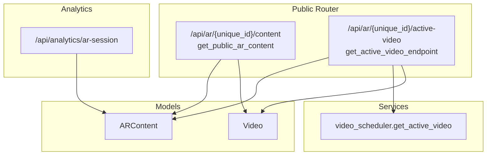
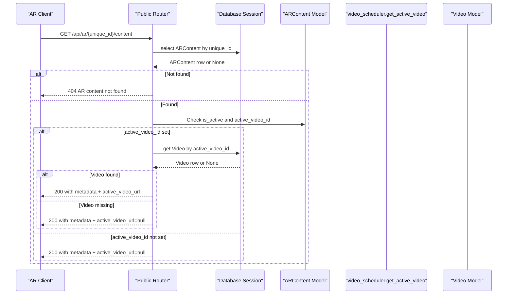
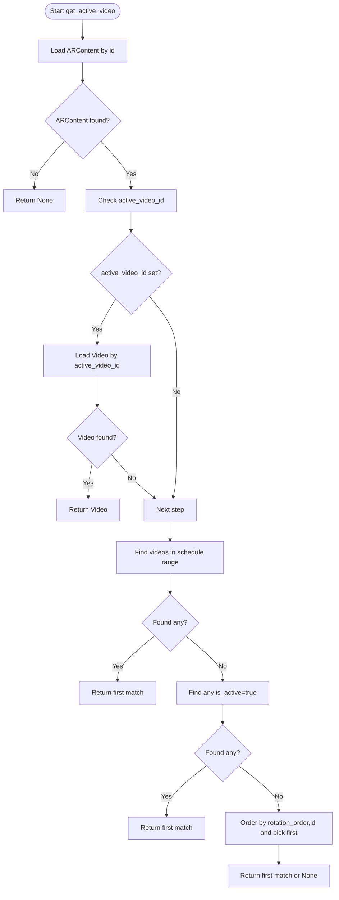
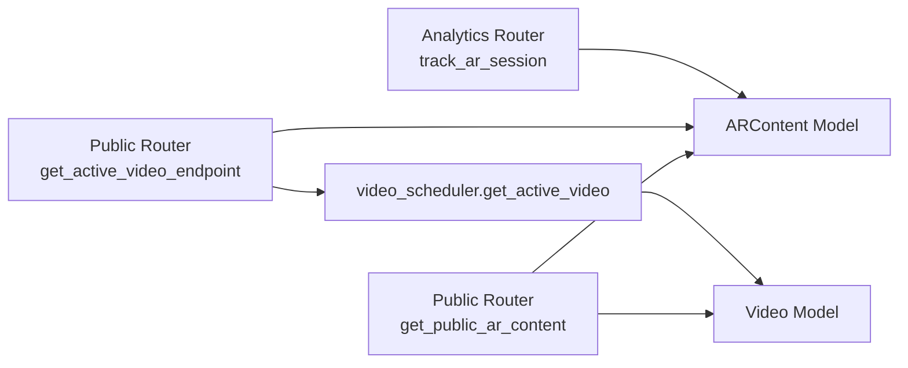

# Public Viewer API

<cite>
**Referenced Files in This Document**
- [public.py](file://app/api/routes/public.py)
- [ar_content.py](file://app/models/ar_content.py)
- [video.py](file://app/models/video.py)
- [video_scheduler.py](file://app/services/video_scheduler.py)
- [analytics.py](file://app/api/routes/analytics.py)
- [ar_viewer.html](file://templates/ar_viewer.html)
- [main.py](file://app/main.py)
</cite>

## Table of Contents
1. [Introduction](#introduction)
2. [Project Structure](#project-structure)
3. [Core Components](#core-components)
4. [Architecture Overview](#architecture-overview)
5. [Detailed Component Analysis](#detailed-component-analysis)
6. [Dependency Analysis](#dependency-analysis)
7. [Performance Considerations](#performance-considerations)
8. [Troubleshooting Guide](#troubleshooting-guide)
9. [Conclusion](#conclusion)
10. [Appendices](#appendices)

## Introduction
This document describes the Public Viewer API for the ARV platform, focusing on the get_public_ar_content endpoint that serves as the primary integration point for AR viewers. The endpoint is accessible by unique_id without authentication and returns AR content metadata, image URL, marker status, and the currently active video URL when assigned. It powers use cases where NFT markers or physical images trigger content retrieval in AR applications.

## Project Structure
The Public Viewer API is implemented as part of the public router and integrates with AR content and video models, plus a video scheduling service to resolve the active video.

**Diagram sources**
- [public.py](file://app/api/routes/public.py#L1-L53)
- [ar_content.py](file://app/models/ar_content.py#L1-L46)
- [video.py](file://app/models/video.py#L1-L31)
- [video_scheduler.py](file://app/services/video_scheduler.py#L1-L59)
- [analytics.py](file://app/api/routes/analytics.py#L55-L92)

**Section sources**
- [public.py](file://app/api/routes/public.py#L1-L53)
- [main.py](file://app/main.py#L251-L267)

## Core Components
- Public AR Content Endpoint: Returns AR content metadata and the active video URL when assigned.
- Active Video Resolution: Uses a prioritized selection algorithm to determine the active video for a given AR content.
- AR Viewer Template: Demonstrates client-side usage of the Public Viewer API in a real AR application.

Key responsibilities:
- Resolve AR content by unique_id.
- Verify content availability and activity.
- Retrieve the active video URL if present.
- Provide fallbacks and error handling for missing or inactive content.

**Section sources**
- [public.py](file://app/api/routes/public.py#L32-L53)
- [video_scheduler.py](file://app/services/video_scheduler.py#L11-L59)
- [ar_content.py](file://app/models/ar_content.py#L1-L46)
- [video.py](file://app/models/video.py#L1-L31)

## Architecture Overview
The Public Viewer API orchestrates data retrieval across models and services to serve AR clients. The flow below maps the actual code paths.

**Diagram sources**
- [public.py](file://app/api/routes/public.py#L32-L53)
- [ar_content.py](file://app/models/ar_content.py#L1-L46)
- [video.py](file://app/models/video.py#L1-L31)

## Detailed Component Analysis

### Public AR Content Endpoint
Purpose:
- Serve AR content metadata and the currently active video URL for a given unique_id.
- Return 404 when content is not found.

Behavior:
- Query ARContent by unique_id.
- If not found, return 404.
- If found, compute active_video_url:
  - If ARContent.active_video_id is set, fetch the associated Video and return its video_url.
  - Otherwise, return null for active_video_url.
- Response includes id, unique_id, title, image_url, marker_url, marker_status, active_video_url.

Error handling:
- 404 when AR content does not exist.

Response shape:
- id: integer
- unique_id: string (UUID as string)
- title: string
- image_url: string
- marker_url: string
- marker_status: string
- active_video_url: string|null

**Section sources**
- [public.py](file://app/api/routes/public.py#L32-L53)
- [ar_content.py](file://app/models/ar_content.py#L1-L46)
- [video.py](file://app/models/video.py#L1-L31)

### Active Video Resolution Service
Purpose:
- Determine the currently active video for AR content using a prioritized selection algorithm.

Algorithm:
1) Prefer ARContent.active_video_id if set and video exists.
2) Else, select any video whose schedule_start and schedule_end encompass the current UTC time and is_active is true.
3) Else, select any video marked is_active=true.
4) Else, pick the first available video ordered by rotation_order ascending, then by id ascending.

Returns:
- Video object or None if no suitable video is found.

**Diagram sources**
- [video_scheduler.py](file://app/services/video_scheduler.py#L11-L59)

**Section sources**
- [video_scheduler.py](file://app/services/video_scheduler.py#L11-L59)

### Public Active Video Endpoint
Purpose:
- Return the currently active video for a given unique_id.
- Enforces AR content activity by checking is_active.

Behavior:
- Query ARContent by unique_id.
- If not found or not active, return 404.
- Resolve active video via video_scheduler.get_active_video.
- If no active video, return 404.
- Return video metadata (id, title, video_url, thumbnail_url, duration).

Error handling:
- 404 when AR content not found or inactive.
- 404 when no active video is available.

Response shape:
- id: integer
- title: string
- video_url: string
- thumbnail_url: string
- duration: float

**Section sources**
- [public.py](file://app/api/routes/public.py#L11-L31)
- [video_scheduler.py](file://app/services/video_scheduler.py#L11-L59)
- [video.py](file://app/models/video.py#L1-L31)

### AR Viewer Template Integration
The AR viewer template demonstrates client-side usage of the Public Viewer API:
- Fetches AR content metadata and checks marker_status.
- Fetches the active video URL.
- Initializes the AR engine with the marker URL and plays the video when the marker is detected.

This illustrates the typical client-side flow for NFT markers or physical images triggering AR content retrieval.

**Section sources**
- [ar_viewer.html](file://templates/ar_viewer.html#L80-L175)

### Analytics Integration
The analytics endpoint tracks AR sessions and can resolve AR content by unique_id, enabling session analytics for Public Viewer usage.

**Section sources**
- [analytics.py](file://app/api/routes/analytics.py#L55-L92)

## Dependency Analysis
The Public Viewer API depends on:
- ARContent model for content metadata and active_video_id.
- Video model for video metadata and URLs.
- video_scheduler service for active video resolution.
- Database session for ORM operations.

**Diagram sources**
- [public.py](file://app/api/routes/public.py#L1-L53)
- [ar_content.py](file://app/models/ar_content.py#L1-L46)
- [video.py](file://app/models/video.py#L1-L31)
- [video_scheduler.py](file://app/services/video_scheduler.py#L11-L59)
- [analytics.py](file://app/api/routes/analytics.py#L55-L92)

**Section sources**
- [public.py](file://app/api/routes/public.py#L1-L53)
- [ar_content.py](file://app/models/ar_content.py#L1-L46)
- [video.py](file://app/models/video.py#L1-L31)
- [video_scheduler.py](file://app/services/video_scheduler.py#L11-L59)
- [analytics.py](file://app/api/routes/analytics.py#L55-L92)

## Performance Considerations
- Single query per endpoint: Both endpoints perform a single select/get operation against ARContent and Video, minimizing overhead.
- Minimal branching: The active video resolution uses straightforward conditional checks and ordered queries.
- Caching: Consider caching AR content metadata for frequently accessed unique_ids to reduce database load.
- CDN delivery: Serve image_url and video_url via a CDN to improve latency for AR clients.

## Troubleshooting Guide
Common issues and resolutions:
- 404 Not Found for AR content:
  - Cause: unique_id does not exist.
  - Resolution: Verify the unique_id and ensure the AR content is created.
- 404 Not Found for active video:
  - Cause: AR content exists but has no active video assigned or scheduled.
  - Resolution: Assign an active video or configure a schedule window.
- Marker not ready:
  - Cause: marker_status is not "ready".
  - Resolution: Wait for marker generation or regenerate the marker.
- Video playback errors:
  - Cause: network issues or invalid video_url.
  - Resolution: Validate video_url and ensure the asset is accessible.

Client-side error handling examples:
- Check marker_status before initializing AR.
- Handle 404 responses gracefully and show user-friendly messages.
- Retry fetching active video after a delay if the system is still processing.

**Section sources**
- [public.py](file://app/api/routes/public.py#L11-L31)
- [public.py](file://app/api/routes/public.py#L32-L53)
- [ar_viewer.html](file://templates/ar_viewer.html#L80-L175)

## Conclusion
The Public Viewer API provides a streamlined integration point for AR viewers. It resolves AR content by unique_id, validates activity, and returns the active video URL when available. The active video resolution service ensures robust fallbacks, while the AR viewer template demonstrates practical client-side usage. Together, these components enable reliable AR experiences triggered by NFT markers or physical images.

## Appendices

### API Definitions

- GET /api/ar/{unique_id}/content
  - Path parameters:
    - unique_id: string (UUID)
  - Responses:
    - 200 OK: Returns AR content metadata and active_video_url.
    - 404 Not Found: AR content not found.
  - Response fields:
    - id: integer
    - unique_id: string
    - title: string
    - image_url: string
    - marker_url: string
    - marker_status: string
    - active_video_url: string|null

- GET /api/ar/{unique_id}/active-video
  - Path parameters:
    - unique_id: string (UUID)
  - Responses:
    - 200 OK: Returns active video metadata.
    - 404 Not Found: AR content not found or inactive, or no active video available.
  - Response fields:
    - id: integer
    - title: string
    - video_url: string
    - thumbnail_url: string
    - duration: float

### Client-Side Implementation Notes
- Fetch AR content metadata and verify marker_status equals "ready".
- Fetch the active video URL and initialize the AR engine with the marker URL.
- Handle errors and provide user feedback for missing or inactive content.

**Section sources**
- [public.py](file://app/api/routes/public.py#L11-L31)
- [public.py](file://app/api/routes/public.py#L32-L53)
- [ar_viewer.html](file://templates/ar_viewer.html#L80-L175)