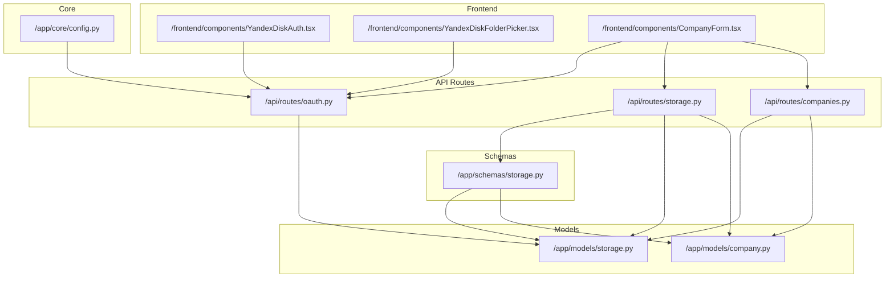
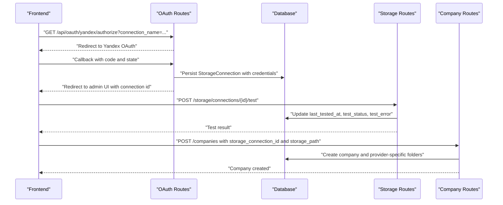
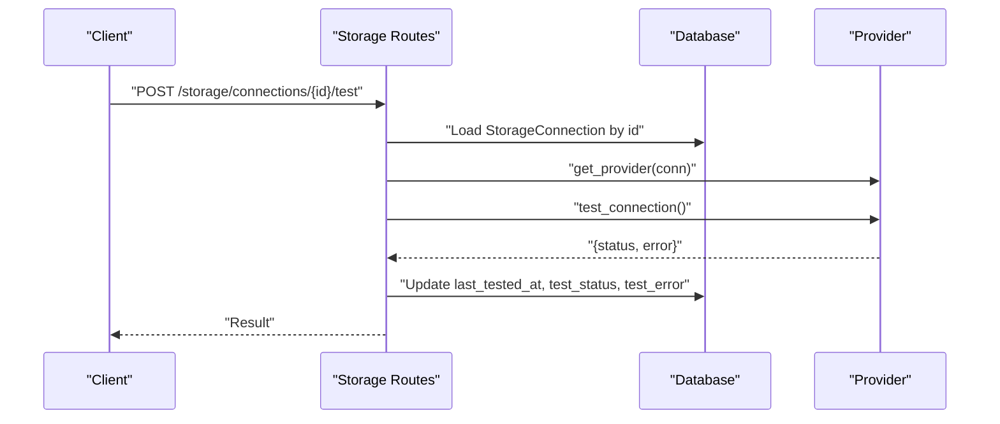
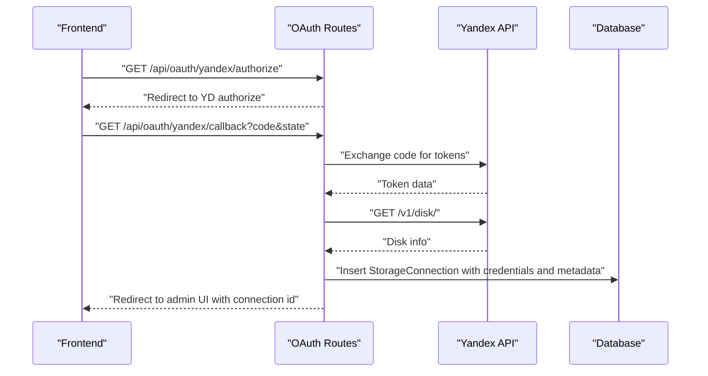
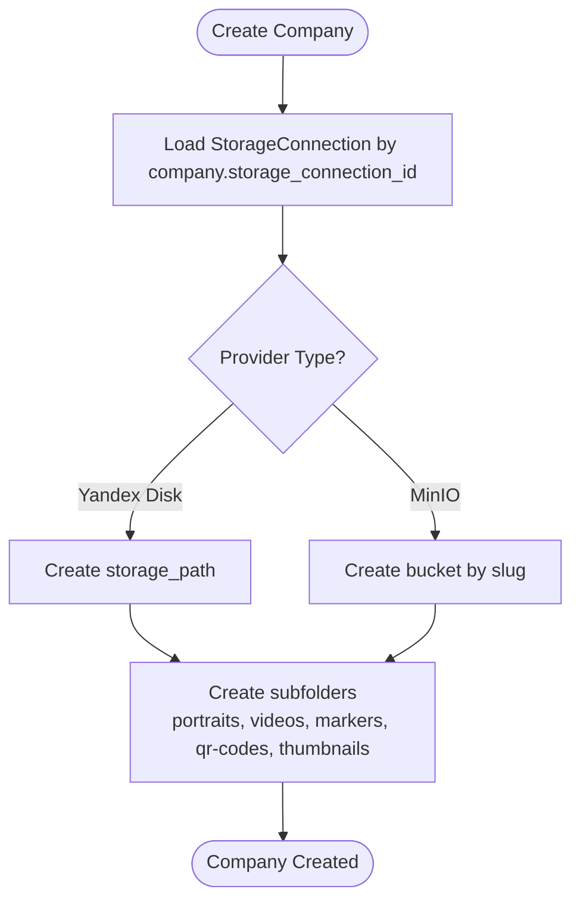
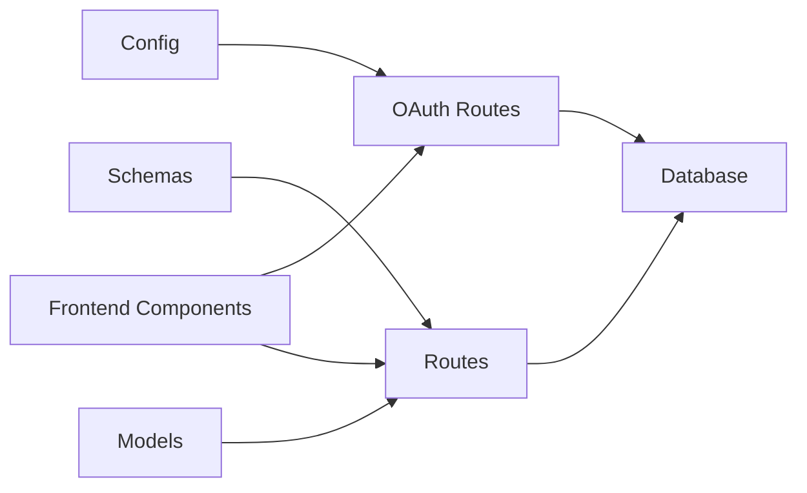
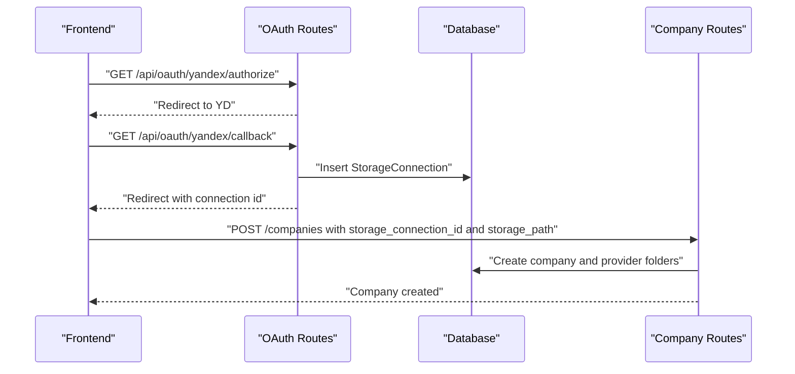

# Storage Management API

<cite>
**Referenced Files in This Document**
- [storage.py](file://app/api/routes/storage.py)
- [oauth.py](file://app/api/routes/oauth.py)
- [storage_schemas.py](file://app/schemas/storage.py)
- [storage_models.py](file://app/models/storage.py)
- [company_models.py](file://app/models/company.py)
- [config.py](file://app/core/config.py)
- [companies_routes.py](file://app/api/routes/companies.py)
- [YandexDiskAuth.tsx](file://frontend/components/YandexDiskAuth.tsx)
- [YandexDiskFolderPicker.tsx](file://frontend/components/YandexDiskFolderPicker.tsx)
- [CompanyForm.tsx](file://frontend/components/CompanyForm.tsx)
</cite>

## Table of Contents
1. [Introduction](#introduction)
2. [Project Structure](#project-structure)
3. [Core Components](#core-components)
4. [Architecture Overview](#architecture-overview)
5. [Detailed Component Analysis](#detailed-component-analysis)
6. [Dependency Analysis](#dependency-analysis)
7. [Performance Considerations](#performance-considerations)
8. [Troubleshooting Guide](#troubleshooting-guide)
9. [Conclusion](#conclusion)
10. [Appendices](#appendices)

## Introduction
This document provides API documentation for the Storage Management endpoints in the ARV platform. It covers:
- Creating storage connections for providers (MinIO, Yandex Disk)
- Testing connectivity for a given connection
- Configuring company-specific storage settings
- Request models for storage connections and company storage settings
- Behavior of the test_connection endpoint, including status updates and error reporting
- How storage connections are linked to companies and used for automated folder creation
- Example workflows for setting up a Yandex Disk connection via OAuth and assigning it to a company with a custom storage path
- Security considerations for handling OAuth tokens and credentials

## Project Structure
The storage management functionality spans API routes, Pydantic models for request/response validation, SQLAlchemy ORM models for persistence, and frontend components that assist with OAuth and folder selection.

**Diagram sources**
- [storage.py](file://app/api/routes/storage.py#L1-L62)
- [oauth.py](file://app/api/routes/oauth.py#L1-L184)
- [storage_schemas.py](file://app/schemas/storage.py#L1-L101)
- [storage_models.py](file://app/models/storage.py#L1-L81)
- [company_models.py](file://app/models/company.py#L1-L41)
- [config.py](file://app/core/config.py#L1-L134)
- [companies_routes.py](file://app/api/routes/companies.py#L35-L93)
- [YandexDiskAuth.tsx](file://frontend/components/YandexDiskAuth.tsx#L1-L77)
- [YandexDiskFolderPicker.tsx](file://frontend/components/YandexDiskFolderPicker.tsx#L1-L242)
- [CompanyForm.tsx](file://frontend/components/CompanyForm.tsx#L1-L124)

**Section sources**
- [storage.py](file://app/api/routes/storage.py#L1-L62)
- [oauth.py](file://app/api/routes/oauth.py#L1-L184)
- [storage_schemas.py](file://app/schemas/storage.py#L1-L101)
- [storage_models.py](file://app/models/storage.py#L1-L81)
- [company_models.py](file://app/models/company.py#L1-L41)
- [config.py](file://app/core/config.py#L1-L134)
- [companies_routes.py](file://app/api/routes/companies.py#L35-L93)
- [YandexDiskAuth.tsx](file://frontend/components/YandexDiskAuth.tsx#L1-L77)
- [YandexDiskFolderPicker.tsx](file://frontend/components/YandexDiskFolderPicker.tsx#L1-L242)
- [CompanyForm.tsx](file://frontend/components/CompanyForm.tsx#L1-L124)

## Core Components
- StorageConnectionCreate: Defines the request model for creating a storage connection, including provider, credentials, base_path, and is_default.
- CompanyStorageSettings: Defines the request model for assigning a storage connection and storage path to a company.
- StorageConnectionResponse: Response model for storage connections, including status fields and timestamps.
- StorageConnection model: ORM model persisted in the database with provider-specific credentials, base_path, and status fields.
- Company model: ORM model with storage_connection_id and storage_path fields linking to a storage connection.
- OAuth endpoints for Yandex Disk: Authorization initiation, callback exchange, and folder listing/create helpers used by the frontend.

Key behaviors:
- Creation of storage connections persists provider-specific credentials and metadata.
- test_connection updates last_tested_at, test_status, and test_error based on provider’s result.
- Setting company storage assigns storage_connection_id and storage_path to a company.
- Automated folder creation occurs during company creation for supported providers.

**Section sources**
- [storage_schemas.py](file://app/schemas/storage.py#L1-L101)
- [storage_models.py](file://app/models/storage.py#L1-L81)
- [company_models.py](file://app/models/company.py#L1-L41)
- [storage.py](file://app/api/routes/storage.py#L1-L62)
- [oauth.py](file://app/api/routes/oauth.py#L1-L184)

## Architecture Overview
The Storage Management API orchestrates:
- Frontend components initiating OAuth with Yandex Disk and selecting a folder path
- Backend OAuth routes exchanging authorization code for tokens and persisting a storage connection
- Backend storage routes for creating connections, testing connectivity, and assigning company storage
- Backend company routes using provider-specific logic to create company storage folders

**Diagram sources**
- [oauth.py](file://app/api/routes/oauth.py#L1-L184)
- [storage.py](file://app/api/routes/storage.py#L1-L62)
- [companies_routes.py](file://app/api/routes/companies.py#L35-L93)

## Detailed Component Analysis

### StorageConnectionCreate and CompanyStorageSettings Models
- StorageConnectionCreate
  - Fields: name, provider ("local_disk", "minio", "yandex_disk"), credentials, base_path, is_default, metadata
  - Validation ensures provider-specific credentials are present and validates base_path for local_disk
- CompanyStorageSettings
  - Fields: storage_connection_id, storage_path, storage_quota_gb (optional)
- StorageConnectionResponse
  - Includes id, is_active, base_path, is_default, last_tested_at, test_status, test_error, created_at, updated_at

Provider-specific configuration options:
- MinIO: endpoint, access_key, secret_key, secure, region
- Yandex Disk: oauth_token, refresh_token, expires_at
- Local Disk: credentials optional; base_path required either in credentials or via base_path field

**Section sources**
- [storage_schemas.py](file://app/schemas/storage.py#L1-L101)

### StorageConnection Model
- Columns: id, name, provider, credentials (JSONB), base_path, is_default, is_active, last_tested_at, test_status, test_error, metadata, created_at, updated_at
- Relationships: back-populates companies; used by Company model

**Section sources**
- [storage_models.py](file://app/models/storage.py#L1-L39)

### Company Model
- Columns: id, name, slug, storage_connection_id, storage_path, storage_quota_gb, storage_used_bytes, is_active, is_default, subscription_tier, subscription_expires_at, notes, metadata, created_at, updated_at
- Relationships: back-populates storage_connection; has storage_folders

**Section sources**
- [company_models.py](file://app/models/company.py#L1-L41)

### API Endpoints

#### POST /storage/connections
- Purpose: Create a new storage connection
- Request body: StorageConnectionCreate
- Response: StorageConnectionResponse
- Behavior: Persists connection with provider, credentials, base_path, is_default, and initializes status fields

**Section sources**
- [storage.py](file://app/api/routes/storage.py#L15-L32)
- [storage_schemas.py](file://app/schemas/storage.py#L1-L101)

#### POST /storage/connections/{connection_id}/test
- Purpose: Test connectivity for a given storage connection
- Path parameter: connection_id
- Behavior:
  - Loads connection by id
  - Uses provider factory to obtain a provider instance
  - Calls provider.test_connection()
  - Updates last_tested_at, test_status, test_error
  - Returns provider result

**Diagram sources**
- [storage.py](file://app/api/routes/storage.py#L35-L49)

**Section sources**
- [storage.py](file://app/api/routes/storage.py#L35-L49)

#### PUT /companies/{company_id}/storage
- Purpose: Assign a storage connection and storage path to a company
- Path parameter: company_id
- Request body: CompanyStorageSettings
- Behavior: Updates company.storage_connection_id and company.storage_path

**Section sources**
- [storage.py](file://app/api/routes/storage.py#L52-L62)

### OAuth Workflow for Yandex Disk
- Initiate OAuth:
  - Frontend opens popup to GET /api/oauth/yandex/authorize?connection_name=...
  - Backend generates state, stores it temporarily, and redirects to Yandex OAuth
- Callback:
  - Frontend receives code and state
  - Backend exchanges code for tokens, retrieves disk info, persists StorageConnection with credentials and metadata
  - Redirects to admin UI with success flag and connection id
- Frontend folder picker:
  - GET /api/oauth/yandex/{connection_id}/folders?path=...
  - POST /api/oauth/yandex/{connection_id}/create-folder?folder_path=...

**Diagram sources**
- [oauth.py](file://app/api/routes/oauth.py#L1-L107)
- [YandexDiskAuth.tsx](file://frontend/components/YandexDiskAuth.tsx#L1-L77)
- [YandexDiskFolderPicker.tsx](file://frontend/components/YandexDiskFolderPicker.tsx#L1-L242)

**Section sources**
- [oauth.py](file://app/api/routes/oauth.py#L1-L184)
- [YandexDiskAuth.tsx](file://frontend/components/YandexDiskAuth.tsx#L1-L77)
- [YandexDiskFolderPicker.tsx](file://frontend/components/YandexDiskFolderPicker.tsx#L1-L242)

### Automated Folder Creation During Company Setup
- When creating a company with a storage connection:
  - For Yandex Disk: Creates the company’s storage_path and subfolders (portraits, videos, markers, qr-codes, thumbnails)
  - For MinIO: Creates a bucket named after the company slug and creates subfolders as prefixes
- Errors are raised if folder creation fails

**Diagram sources**
- [companies_routes.py](file://app/api/routes/companies.py#L35-L61)

**Section sources**
- [companies_routes.py](file://app/api/routes/companies.py#L35-L61)

## Dependency Analysis
- API routes depend on:
  - Schemas for request/response validation
  - Models for persistence and relationships
  - Provider factory (referenced) to obtain provider instances for testing and operations
- OAuth routes depend on:
  - Config settings for OAuth client id/secret and redirect URI
  - Database to persist StorageConnection
- Frontend components depend on:
  - OAuth routes for authorization and folder operations
  - Storage routes for testing and assignment

**Diagram sources**
- [storage_schemas.py](file://app/schemas/storage.py#L1-L101)
- [storage.py](file://app/api/routes/storage.py#L1-L62)
- [oauth.py](file://app/api/routes/oauth.py#L1-L184)
- [config.py](file://app/core/config.py#L1-L134)

**Section sources**
- [storage_schemas.py](file://app/schemas/storage.py#L1-L101)
- [storage.py](file://app/api/routes/storage.py#L1-L62)
- [oauth.py](file://app/api/routes/oauth.py#L1-L184)
- [config.py](file://app/core/config.py#L1-L134)

## Performance Considerations
- MinIO operations:
  - Uploads and presigned URL generation are performed via MinIO client; ensure appropriate bucket policies and network latency considerations
- OAuth calls:
  - Token exchange and resource listing are external HTTP requests; consider timeouts and retry strategies
- Database operations:
  - Ensure indexes on frequently queried fields (e.g., company slug) and batch operations where possible

[No sources needed since this section provides general guidance]

## Troubleshooting Guide
Common issues and resolutions:
- Connection not found when testing:
  - Ensure the connection_id exists; verify the record in the storage_connections table
- Missing OAuth token in credentials:
  - Confirm the OAuth callback persisted credentials; re-run authorization if missing
- Folder creation failures:
  - Verify provider-specific permissions and paths; check provider logs for errors
- Invalid state parameter:
  - Ensure CSRF protection is maintained; state must match and be cleared after use

**Section sources**
- [storage.py](file://app/api/routes/storage.py#L35-L49)
- [oauth.py](file://app/api/routes/oauth.py#L50-L57)
- [oauth.py](file://app/api/routes/oauth.py#L108-L153)
- [oauth.py](file://app/api/routes/oauth.py#L154-L184)

## Conclusion
The Storage Management API provides a robust foundation for integrating multiple storage providers, validating configurations, testing connectivity, and automating company storage setup. The Yandex Disk OAuth flow integrates tightly with frontend components to enable secure, user-driven setup. Proper use of request/response schemas and ORM models ensures data integrity and extensibility.

[No sources needed since this section summarizes without analyzing specific files]

## Appendices

### API Definitions

- POST /storage/connections
  - Request: StorageConnectionCreate
  - Response: StorageConnectionResponse
  - Description: Create a new storage connection with provider-specific credentials

- POST /storage/connections/{connection_id}/test
  - Path parameters: connection_id
  - Response: Provider test result with status and error fields
  - Description: Test connectivity and update status fields

- PUT /companies/{company_id}/storage
  - Path parameters: company_id
  - Request: CompanyStorageSettings
  - Response: {"status": "updated"}
  - Description: Assign a storage connection and storage path to a company

- GET /api/oauth/yandex/authorize
  - Query: connection_name
  - Response: Redirect to Yandex OAuth
  - Description: Initiate OAuth authorization flow

- GET /api/oauth/yandex/callback
  - Query: code, state
  - Response: Redirect to admin UI with success flag and connection id
  - Description: Exchange authorization code for tokens and persist connection

- GET /api/oauth/yandex/{connection_id}/folders
  - Path: connection_id
  - Query: path
  - Response: {"current_path": "...", "folders": [...]}
  - Description: List folders for the selected path

- POST /api/oauth/yandex/{connection_id}/create-folder
  - Path: connection_id
  - Query: folder_path
  - Response: {"status": "success", "message": "...", "path": "..."}
  - Description: Create a new folder at the specified path

**Section sources**
- [storage.py](file://app/api/routes/storage.py#L15-L62)
- [oauth.py](file://app/api/routes/oauth.py#L1-L184)

### Example Workflows

- Setting up a Yandex Disk connection via OAuth and assigning to a company:
  1. Frontend opens OAuth popup to initiate authorization
  2. Backend exchanges code for tokens and persists StorageConnection
  3. Frontend lists and selects a folder path
  4. Frontend sends company creation request with storage_connection_id and storage_path
  5. Backend creates company and provider-specific folders

**Diagram sources**
- [oauth.py](file://app/api/routes/oauth.py#L1-L107)
- [companies_routes.py](file://app/api/routes/companies.py#L35-L61)
- [CompanyForm.tsx](file://frontend/components/CompanyForm.tsx#L1-L124)
- [YandexDiskFolderPicker.tsx](file://frontend/components/YandexDiskFolderPicker.tsx#L1-L242)

### Security Considerations
- OAuth tokens:
  - Persist tokens securely; consider encryption at rest and rotation policies
  - Validate state parameter to prevent CSRF attacks
- Credentials:
  - Avoid logging sensitive fields; sanitize responses
- Provider-specific policies:
  - Ensure MinIO bucket policies permit required operations
  - Limit Yandex Disk permissions to the minimal scope necessary

**Section sources**
- [oauth.py](file://app/api/routes/oauth.py#L16-L39)
- [oauth.py](file://app/api/routes/oauth.py#L50-L69)
- [config.py](file://app/core/config.py#L62-L72)