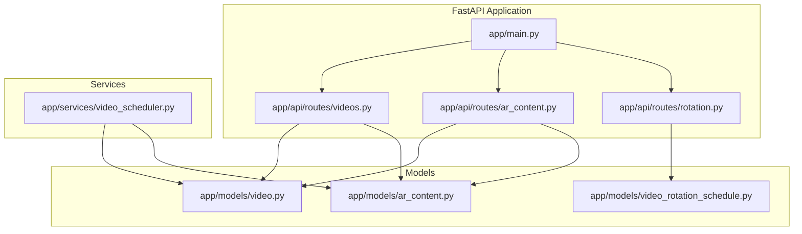
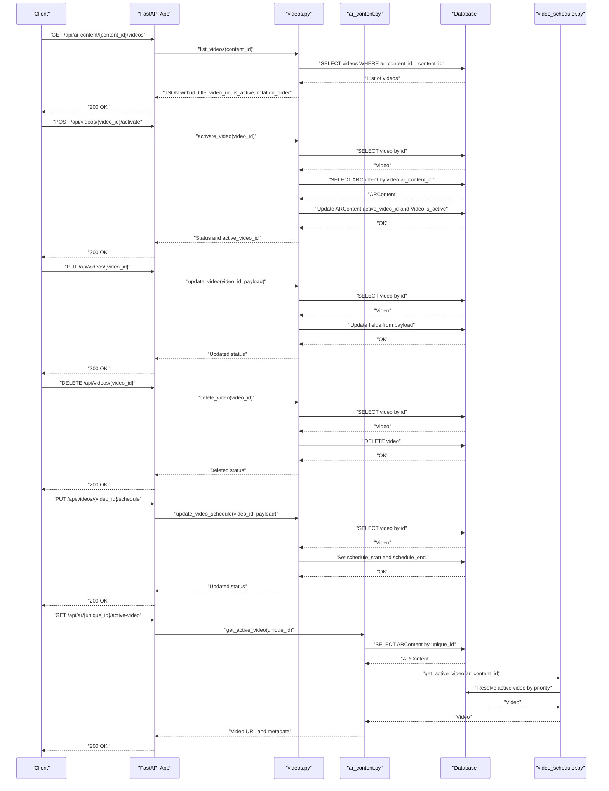
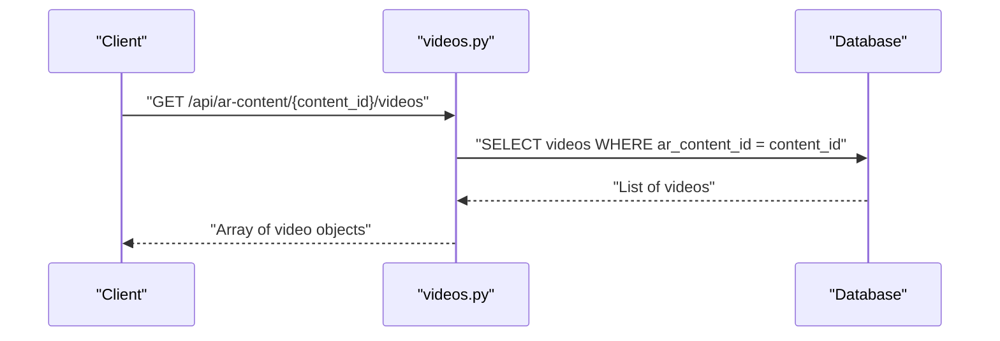
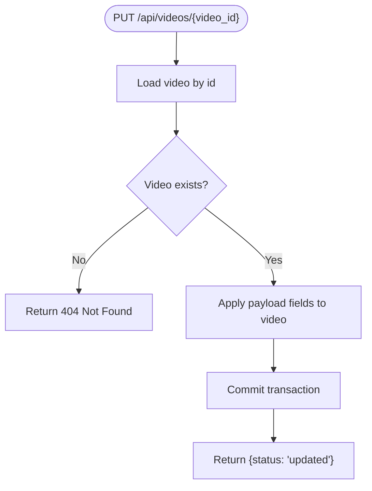
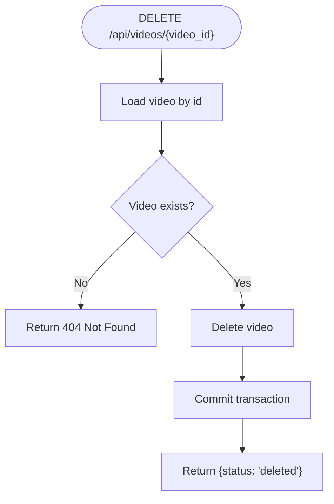
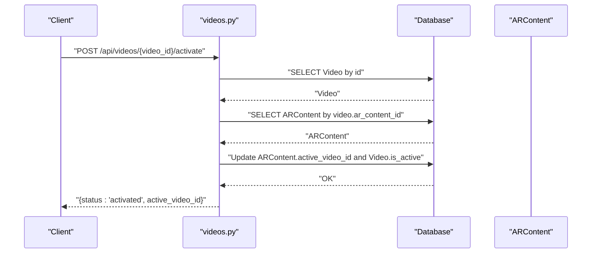
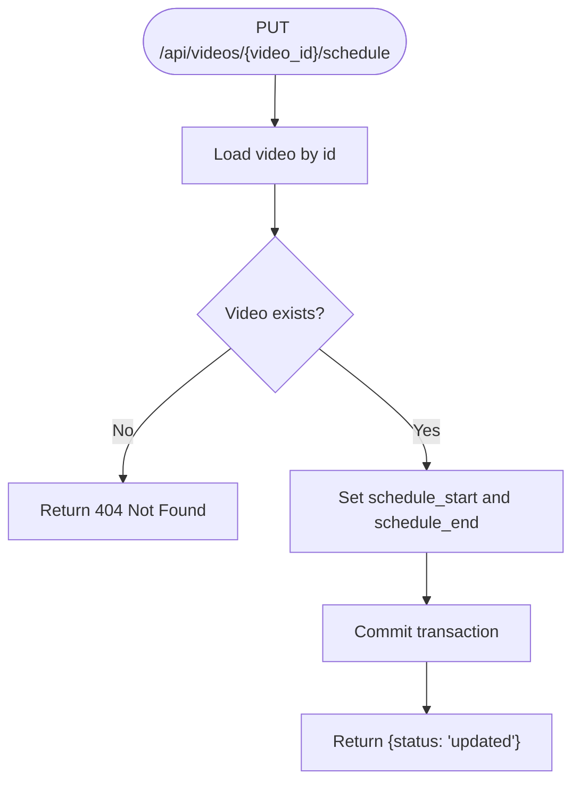
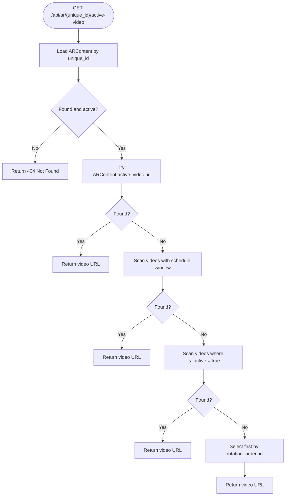
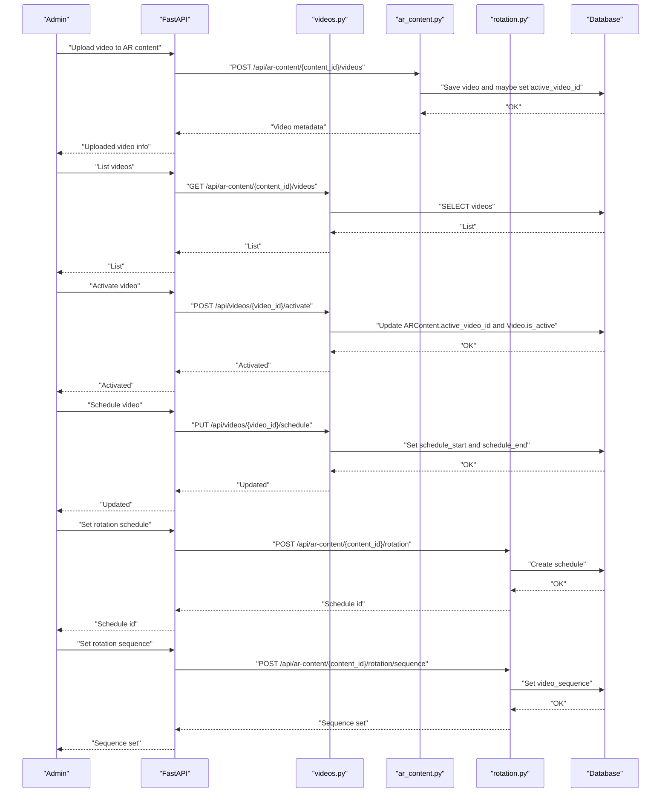
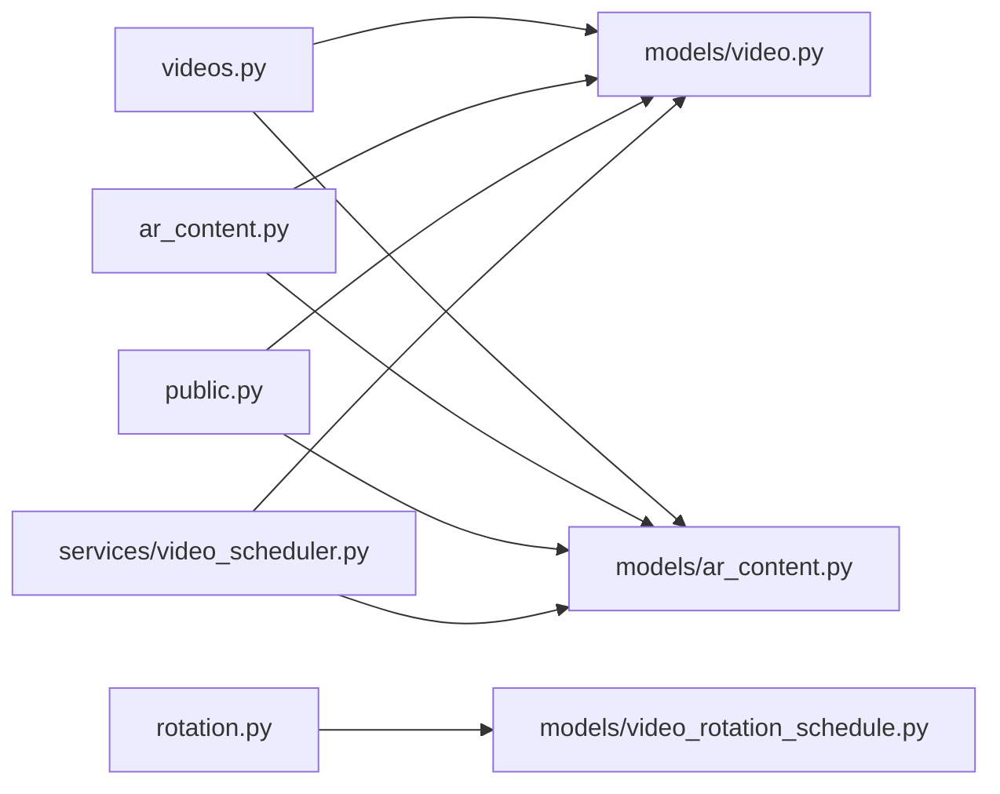

# Video Management API

<cite>
**Referenced Files in This Document**
- [videos.py](file://app/api/routes/videos.py)
- [ar_content.py](file://app/api/routes/ar_content.py)
- [video.py](file://app/models/video.py)
- [ar_content_model.py](file://app/models/ar_content.py)
- [video_scheduler.py](file://app/services/video_scheduler.py)
- [rotation.py](file://app/api/routes/rotation.py)
- [video_rotation_schedule.py](file://app/models/video_rotation_schedule.py)
- [main.py](file://app/main.py)
- [database.py](file://app/core/database.py)
</cite>

## Table of Contents
1. [Introduction](#introduction)
2. [Project Structure](#project-structure)
3. [Core Components](#core-components)
4. [Architecture Overview](#architecture-overview)
5. [Detailed Component Analysis](#detailed-component-analysis)
6. [Dependency Analysis](#dependency-analysis)
7. [Performance Considerations](#performance-considerations)
8. [Troubleshooting Guide](#troubleshooting-guide)
9. [Conclusion](#conclusion)
10. [Appendices](#appendices)

## Introduction
This document describes the Video Management API for the ARV platform. It focuses on endpoints that manage videos associated with AR content, including listing videos, updating video metadata, deleting videos, activating a specific video, and scheduling video availability windows. It also explains how the active video selection works across manual activation and scheduled rotation, and provides practical examples for building dynamic AR experiences.

## Project Structure
The Video Management API is implemented as part of the FastAPI application. The routes are grouped under the videos router and integrated into the main application. The AR content and video models define the persistence layer. Rotation scheduling is handled separately but interacts with video activation.

**Diagram sources**
- [main.py](file://app/main.py#L230-L262)
- [videos.py](file://app/api/routes/videos.py#L1-L76)
- [ar_content.py](file://app/api/routes/ar_content.py#L1-L184)
- [rotation.py](file://app/api/routes/rotation.py#L1-L95)
- [video.py](file://app/models/video.py#L1-L31)
- [ar_content_model.py](file://app/models/ar_content.py#L1-L46)
- [video_rotation_schedule.py](file://app/models/video_rotation_schedule.py#L1-L25)
- [video_scheduler.py](file://app/services/video_scheduler.py#L1-L59)

**Section sources**
- [main.py](file://app/main.py#L230-L262)
- [videos.py](file://app/api/routes/videos.py#L1-L76)
- [ar_content.py](file://app/api/routes/ar_content.py#L1-L184)
- [rotation.py](file://app/api/routes/rotation.py#L1-L95)
- [video.py](file://app/models/video.py#L1-L31)
- [ar_content_model.py](file://app/models/ar_content.py#L1-L46)
- [video_rotation_schedule.py](file://app/models/video_rotation_schedule.py#L1-L25)
- [video_scheduler.py](file://app/services/video_scheduler.py#L1-L59)

## Core Components
- Videos router: Provides endpoints to list, update, delete, activate, and schedule videos.
- AR Content router: Manages AR content creation and uploads videos into AR content.
- Models: Define the persisted attributes for videos and AR content, including active video linkage and scheduling fields.
- Scheduler service: Implements logic to resolve the active video based on manual activation, schedule windows, or fallback ordering.
- Rotation scheduler: Manages scheduled rotation of videos for AR content.

Key responsibilities:
- Listing videos for an AR content ID with active status and rotation order.
- Activating a video to become the active one for AR content and updating its own status.
- Updating/deleting videos with appropriate error handling for missing resources.
- Scheduling video availability windows and integrating with rotation scheduling.

**Section sources**
- [videos.py](file://app/api/routes/videos.py#L1-L76)
- [ar_content.py](file://app/api/routes/ar_content.py#L91-L133)
- [video.py](file://app/models/video.py#L1-L31)
- [ar_content_model.py](file://app/models/ar_content.py#L1-L46)
- [video_scheduler.py](file://app/services/video_scheduler.py#L1-L59)
- [rotation.py](file://app/api/routes/rotation.py#L1-L95)
- [video_rotation_schedule.py](file://app/models/video_rotation_schedule.py#L1-L25)

## Architecture Overview
The Video Management API integrates with AR content management and rotation scheduling. The active video resolution follows a priority order that respects manual activation, scheduled windows, and fallback ordering.

**Diagram sources**
- [videos.py](file://app/api/routes/videos.py#L13-L76)
- [ar_content.py](file://app/api/routes/ar_content.py#L159-L171)
- [video_scheduler.py](file://app/services/video_scheduler.py#L11-L59)
- [main.py](file://app/main.py#L230-L262)

## Detailed Component Analysis

### Endpoint: GET /api/ar-content/{content_id}/videos
- Purpose: Retrieve all videos for a given AR content ID, including their active status and rotation order.
- Behavior:
  - Queries the videos table filtered by ar_content_id.
  - Returns a list of objects containing id, title, video_url, is_active, rotation_order.
- Response format:
  - Array of video objects with the fields listed above.
- Notes:
  - Does not enforce AR content existence; callers should ensure content_id is valid.

**Diagram sources**
- [videos.py](file://app/api/routes/videos.py#L13-L27)

**Section sources**
- [videos.py](file://app/api/routes/videos.py#L13-L27)
- [video.py](file://app/models/video.py#L1-L31)

### Endpoint: PUT /api/videos/{video_id}
- Purpose: Update a video’s attributes.
- Behavior:
  - Loads the video by ID.
  - For each provided field in the payload, sets the corresponding attribute if it exists on the model.
  - Commits changes.
- Error handling:
  - Returns 404 Not Found if the video does not exist.
- Response:
  - JSON with status "updated".

**Diagram sources**
- [videos.py](file://app/api/routes/videos.py#L30-L39)

**Section sources**
- [videos.py](file://app/api/routes/videos.py#L30-L39)

### Endpoint: DELETE /api/videos/{video_id}
- Purpose: Delete a video.
- Behavior:
  - Loads the video by ID.
  - Deletes the record if found.
  - Commits changes.
- Error handling:
  - Returns 404 Not Found if the video does not exist.
- Response:
  - JSON with status "deleted".

**Diagram sources**
- [videos.py](file://app/api/routes/videos.py#L42-L49)

**Section sources**
- [videos.py](file://app/api/routes/videos.py#L42-L49)

### Endpoint: POST /api/videos/{video_id}/activate
- Purpose: Activate a specific video for AR content and mark it as active.
- Behavior:
  - Loads the video by ID.
  - Loads the AR content by video.ar_content_id.
  - Sets ARContent.active_video_id to the video’s id.
  - Sets Video.is_active to true.
  - Commits changes.
- Error handling:
  - Returns 404 Not Found if the video or AR content does not exist.
- Response:
  - JSON with status "activated" and active_video_id.

**Diagram sources**
- [videos.py](file://app/api/routes/videos.py#L52-L63)
- [ar_content_model.py](file://app/models/ar_content.py#L27-L27)

**Section sources**
- [videos.py](file://app/api/routes/videos.py#L52-L63)
- [ar_content_model.py](file://app/models/ar_content.py#L27-L27)

### Endpoint: PUT /api/videos/{video_id}/schedule
- Purpose: Set or update a video’s schedule window.
- Behavior:
  - Loads the video by ID.
  - Sets schedule_start and schedule_end from the payload (accepts ISO8601 strings or nulls).
  - Commits changes.
- Error handling:
  - Returns 404 Not Found if the video does not exist.
- Response:
  - JSON with status "updated".

**Diagram sources**
- [videos.py](file://app/api/routes/videos.py#L66-L75)

**Section sources**
- [videos.py](file://app/api/routes/videos.py#L66-L75)

### Active Video Resolution (Public Access)
- Endpoint: GET /api/ar/{unique_id}/active-video
- Behavior:
  - Resolves the active video for a given AR content unique_id using priority logic:
    1) ARContent.active_video_id
    2) Any video whose schedule_start/schedule_end includes now and is_active
    3) Any currently active video
    4) First available video ordered by rotation_order then id
- Error handling:
  - Returns 404 Not Found if AR content not found or inactive, or if no active video is available.

**Diagram sources**
- [ar_content.py](file://app/api/routes/ar_content.py#L159-L171)
- [video_scheduler.py](file://app/services/video_scheduler.py#L11-L59)

**Section sources**
- [ar_content.py](file://app/api/routes/ar_content.py#L159-L171)
- [video_scheduler.py](file://app/services/video_scheduler.py#L11-L59)

### Managing Video Libraries and Switching Active Content
- Upload a new video into AR content:
  - Use POST /api/ar-content/{content_id}/videos to upload a file and optionally set is_active.
  - If is_active is true, ARContent.active_video_id is updated automatically during upload.
- List all videos for an AR content to review active status and rotation order:
  - Use GET /api/ar-content/{content_id}/videos to retrieve the list.
- Activate a specific video:
  - Use POST /api/videos/{video_id}/activate to set ARContent.active_video_id and Video.is_active.
- Deactivate or remove a video:
  - Use DELETE /api/videos/{video_id} to remove a video.
- Schedule a video for a time window:
  - Use PUT /api/videos/{video_id}/schedule to set schedule_start and schedule_end.
- Dynamic rotation:
  - Configure rotation schedule for AR content via POST /api/ar-content/{content_id}/rotation and set the video sequence via POST /api/ar-content/{content_id}/rotation/sequence.
  - The rotation scheduler updates active_video_id and Video.is_active according to schedule rules.

**Diagram sources**
- [ar_content.py](file://app/api/routes/ar_content.py#L91-L133)
- [videos.py](file://app/api/routes/videos.py#L13-L76)
- [rotation.py](file://app/api/routes/rotation.py#L12-L69)

**Section sources**
- [ar_content.py](file://app/api/routes/ar_content.py#L91-L133)
- [videos.py](file://app/api/routes/videos.py#L13-L76)
- [rotation.py](file://app/api/routes/rotation.py#L12-L69)

## Dependency Analysis
- Router registration:
  - The videos router is included in the main application with prefix "/api".
- Model relationships:
  - Video.ar_content_id links videos to AR content.
  - ARContent.active_video_id points to the currently active video.
  - Video schedule_start and schedule_end enable time-windowed activation.
  - VideoRotationSchedule stores rotation configuration for AR content.
- Service integration:
  - Public endpoint resolves active video using video_scheduler.get_active_video, which considers manual activation, schedule windows, and fallback ordering.

**Diagram sources**
- [videos.py](file://app/api/routes/videos.py#L1-L76)
- [ar_content.py](file://app/api/routes/ar_content.py#L1-L184)
- [video.py](file://app/models/video.py#L1-L31)
- [ar_content_model.py](file://app/models/ar_content.py#L1-L46)
- [video_scheduler.py](file://app/services/video_scheduler.py#L1-L59)
- [rotation.py](file://app/api/routes/rotation.py#L1-L95)
- [video_rotation_schedule.py](file://app/models/video_rotation_schedule.py#L1-L25)

**Section sources**
- [main.py](file://app/main.py#L230-L262)
- [videos.py](file://app/api/routes/videos.py#L1-L76)
- [ar_content.py](file://app/api/routes/ar_content.py#L1-L184)
- [video.py](file://app/models/video.py#L1-L31)
- [ar_content_model.py](file://app/models/ar_content.py#L1-L46)
- [video_scheduler.py](file://app/services/video_scheduler.py#L1-L59)
- [rotation.py](file://app/api/routes/rotation.py#L1-L95)
- [video_rotation_schedule.py](file://app/models/video_rotation_schedule.py#L1-L25)

## Performance Considerations
- Database queries:
  - Listing videos performs a simple filtered SELECT; ensure indexes exist on ar_content_id for optimal performance.
  - Activation updates two records (ARContent and Video); batching updates is already implicit in a single commit.
- Asynchronous sessions:
  - The application uses async SQLAlchemy sessions; keep request handlers short to minimize session lifetime.
- Rotation scheduling:
  - The rotation scheduler runs periodically and updates multiple rows; ensure database indexing on rotation schedule fields and consider background task cadence.

[No sources needed since this section provides general guidance]

## Troubleshooting Guide
Common issues and resolutions:
- 404 Not Found when updating/deleting/activating a video:
  - Cause: The video_id does not exist.
  - Action: Verify the video exists before calling the endpoint.
- 404 Not Found when activating a video:
  - Cause: The video exists but AR content not found for video.ar_content_id.
  - Action: Ensure AR content still exists and video.ar_content_id is valid.
- 404 Not Found when retrieving active video:
  - Cause: AR content not found, inactive, or no active video available.
  - Action: Confirm AR content exists and is active; ensure at least one video is active or falls back to rotation order.

**Section sources**
- [videos.py](file://app/api/routes/videos.py#L30-L63)
- [ar_content.py](file://app/api/routes/ar_content.py#L159-L171)

## Conclusion
The Video Management API provides a robust foundation for managing AR content videos. It supports listing, updating, deleting, activating, and scheduling videos, with clear error handling and integration with AR content and rotation scheduling. By combining manual activation with scheduled windows and rotation sequences, developers can build dynamic AR experiences that adapt content over time.

[No sources needed since this section summarizes without analyzing specific files]

## Appendices

### API Reference Summary
- GET /api/ar-content/{content_id}/videos
  - Returns: Array of video objects with id, title, video_url, is_active, rotation_order.
- PUT /api/videos/{video_id}
  - Payload: Arbitrary fields to update on Video.
  - Returns: {status: "updated"}.
- DELETE /api/videos/{video_id}
  - Returns: {status: "deleted"}.
- POST /api/videos/{video_id}/activate
  - Returns: {status: "activated", active_video_id}.
- PUT /api/videos/{video_id}/schedule
  - Payload: {schedule_start: ISO8601 or null, schedule_end: ISO8601 or null}.
  - Returns: {status: "updated"}.
- GET /api/ar/{unique_id}/active-video
  - Returns: Video metadata for the active video based on priority logic.

**Section sources**
- [videos.py](file://app/api/routes/videos.py#L13-L76)
- [ar_content.py](file://app/api/routes/ar_content.py#L159-L171)