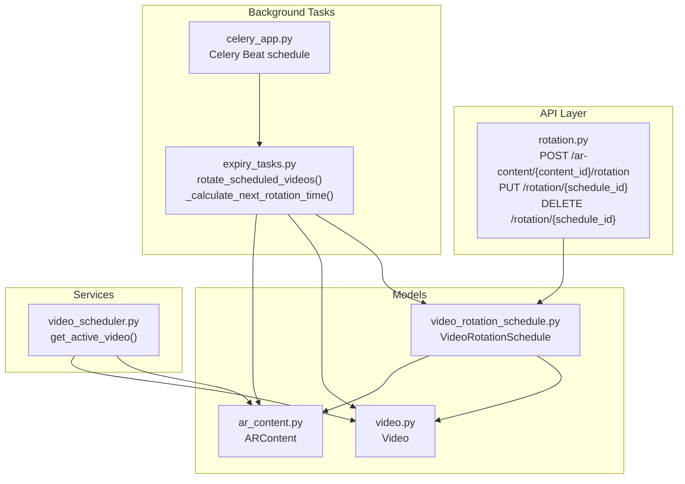
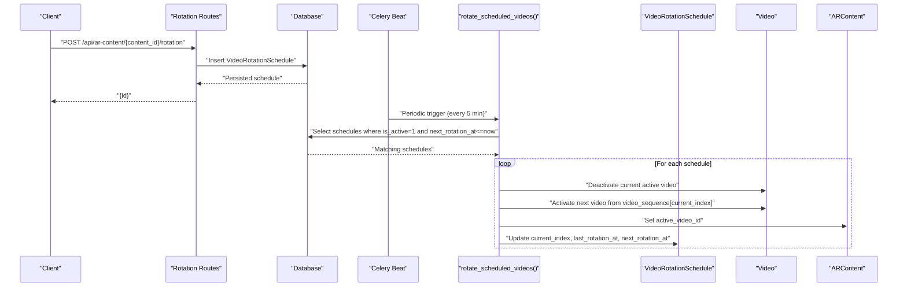
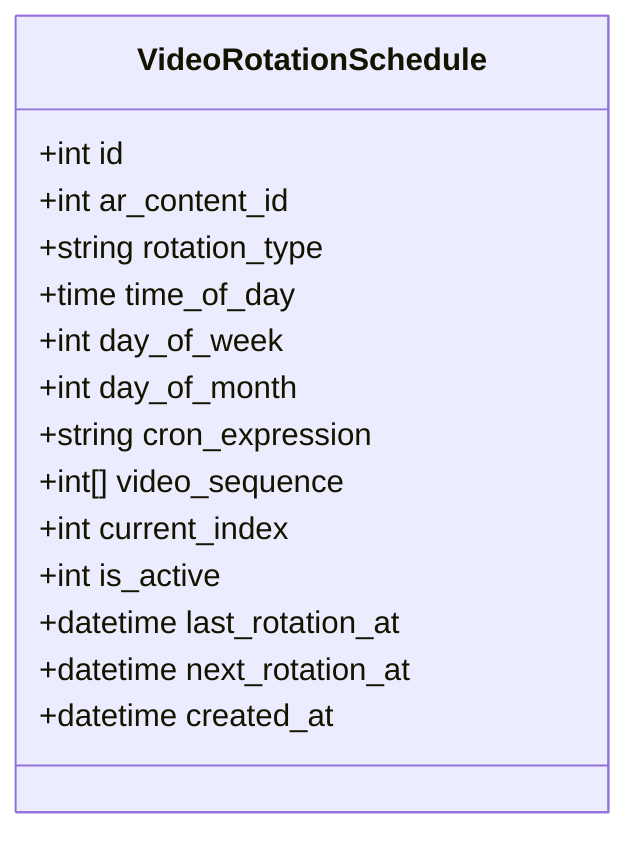
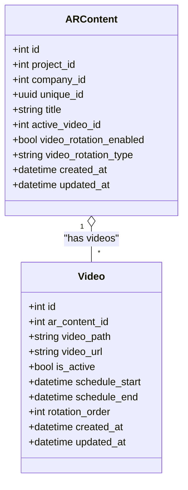
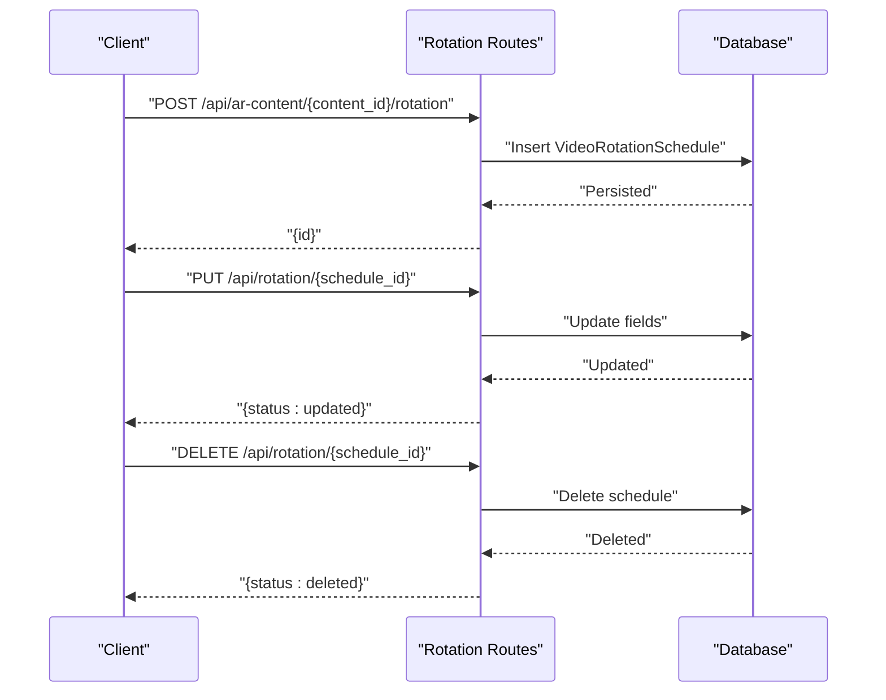
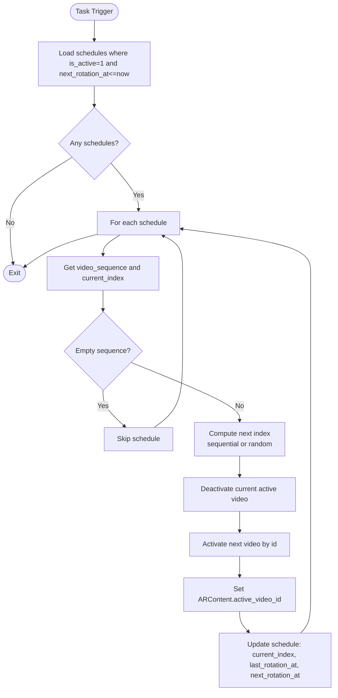
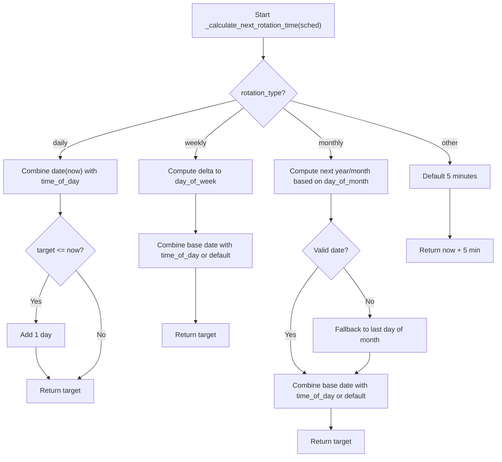
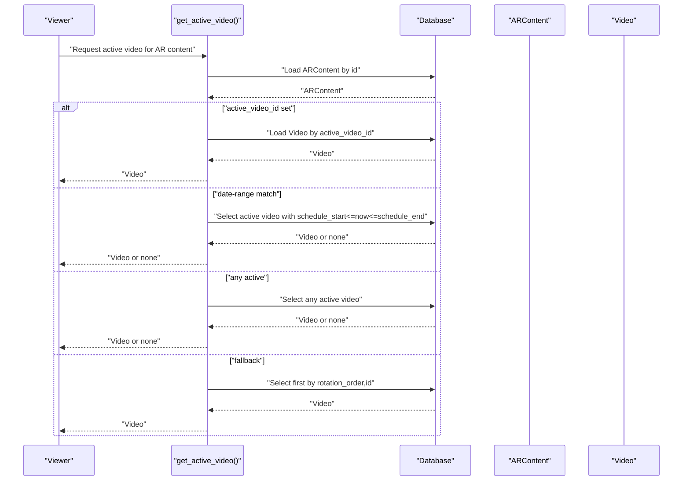
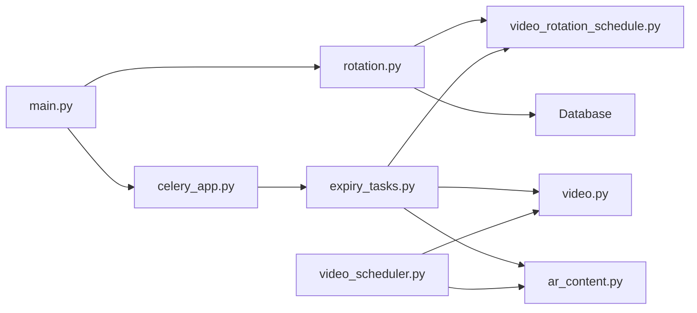

# Video Rotation API

<cite>
**Referenced Files in This Document**
- [rotation.py](file://app/api/routes/rotation.py)
- [video_rotation_schedule.py](file://app/models/video_rotation_schedule.py)
- [ar_content.py](file://app/models/ar_content.py)
- [video.py](file://app/models/video.py)
- [video_scheduler.py](file://app/services/video_scheduler.py)
- [expiry_tasks.py](file://app/tasks/expiry_tasks.py)
- [celery_app.py](file://app/tasks/celery_app.py)
- [main.py](file://app/main.py)
</cite>

## Table of Contents
1. [Introduction](#introduction)
2. [Project Structure](#project-structure)
3. [Core Components](#core-components)
4. [Architecture Overview](#architecture-overview)
5. [Detailed Component Analysis](#detailed-component-analysis)
6. [Dependency Analysis](#dependency-analysis)
7. [Performance Considerations](#performance-considerations)
8. [Troubleshooting Guide](#troubleshooting-guide)
9. [Conclusion](#conclusion)
10. [Appendices](#appendices)

## Introduction
This document describes the Video Rotation API for the ARV platform. It explains how to configure video rotation schedules for AR content, including creating, updating, and deleting rotation rules. It details the VideoRotationSchedule model fields (rotation_type, timing parameters, cron expressions, and video sequence ordering), how current_index is managed for sequential playback, and how schedules link to AR content. It also covers how the background task system processes schedules to activate videos according to defined rules, including examples for daily rotations and dynamic updates.

## Project Structure
The Video Rotation feature spans API routes, database models, scheduling logic, and background tasks:

- API routes define endpoints for managing rotation schedules.
- Models represent the schedule, AR content, and video entities.
- Services provide runtime selection of the active video.
- Background tasks handle periodic rotation based on schedule rules.

**Diagram sources**
- [rotation.py](file://app/api/routes/rotation.py#L1-L52)
- [video_rotation_schedule.py](file://app/models/video_rotation_schedule.py#L1-L26)
- [ar_content.py](file://app/models/ar_content.py#L1-L46)
- [video.py](file://app/models/video.py#L1-L31)
- [video_scheduler.py](file://app/services/video_scheduler.py#L1-L59)
- [celery_app.py](file://app/tasks/celery_app.py#L1-L59)
- [expiry_tasks.py](file://app/tasks/expiry_tasks.py#L22-L183)

**Section sources**
- [rotation.py](file://app/api/routes/rotation.py#L1-L52)
- [video_rotation_schedule.py](file://app/models/video_rotation_schedule.py#L1-L26)
- [ar_content.py](file://app/models/ar_content.py#L1-L46)
- [video.py](file://app/models/video.py#L1-L31)
- [video_scheduler.py](file://app/services/video_scheduler.py#L1-L59)
- [celery_app.py](file://app/tasks/celery_app.py#L1-L59)
- [expiry_tasks.py](file://app/tasks/expiry_tasks.py#L22-L183)
- [main.py](file://app/main.py#L230-L261)

## Core Components
- VideoRotationSchedule: Stores rotation configuration and state for AR content.
- ARContent: Links AR content to the active video and rotation settings.
- Video: Represents individual videos associated with AR content and their activation state.
- Rotation API: CRUD endpoints for rotation schedules.
- Background Task: Periodically rotates videos based on schedule rules.
- Runtime Selection: Service to pick the active video considering rotation and date ranges.

**Section sources**
- [video_rotation_schedule.py](file://app/models/video_rotation_schedule.py#L1-L26)
- [ar_content.py](file://app/models/ar_content.py#L1-L46)
- [video.py](file://app/models/video.py#L1-L31)
- [rotation.py](file://app/api/routes/rotation.py#L1-L52)
- [expiry_tasks.py](file://app/tasks/expiry_tasks.py#L22-L183)
- [video_scheduler.py](file://app/services/video_scheduler.py#L1-L59)

## Architecture Overview
The system combines synchronous API operations with asynchronous background processing:

- API routes create/update/delete schedules and persist them to the database.
- The Celery Beat scheduler triggers a periodic task every five minutes.
- The background task selects eligible schedules (active and next_rotation_at <= now), rotates to the next video in the sequence, updates activation flags, and recalculates next_rotation_at.

**Diagram sources**
- [rotation.py](file://app/api/routes/rotation.py#L12-L29)
- [celery_app.py](file://app/tasks/celery_app.py#L31-L44)
- [expiry_tasks.py](file://app/tasks/expiry_tasks.py#L132-L183)
- [video_rotation_schedule.py](file://app/models/video_rotation_schedule.py#L1-L26)
- [video.py](file://app/models/video.py#L1-L31)
- [ar_content.py](file://app/models/ar_content.py#L1-L46)

## Detailed Component Analysis

### VideoRotationSchedule Model
The schedule model defines rotation behavior and state for a given AR content.

Key fields:
- id: Primary key.
- ar_content_id: Foreign key linking to AR content.
- rotation_type: Daily, weekly, monthly, or random.
- time_of_day: Time-of-day for daily/weekly/monthly schedules.
- day_of_week: Day-of-week (1..7) for weekly.
- day_of_month: Day-of-month for monthly.
- cron_expression: Placeholder for cron-based scheduling (not used in rotation calculation).
- video_sequence: Ordered list of video ids to rotate through.
- current_index: Current position in the sequence for sequential rotation.
- is_active: Whether the schedule is active.
- last_rotation_at: Timestamp of last rotation.
- next_rotation_at: Next scheduled rotation time.
- created_at: Schedule creation timestamp.

**Diagram sources**
- [video_rotation_schedule.py](file://app/models/video_rotation_schedule.py#L1-L26)

**Section sources**
- [video_rotation_schedule.py](file://app/models/video_rotation_schedule.py#L1-L26)

### AR Content and Video Linkage
AR content tracks the currently active video and rotation preferences. Videos are associated with AR content and can be activated/deactivated independently.

- ARContent.active_video_id: Overrides runtime selection for the active video.
- Video.ar_content_id: Links videos to AR content.
- Video.is_active: Indicates whether a video is currently active.
- Video.schedule_start/schedule_end: Date-range activation window.
- Video.rotation_order: Fallback ordering when no schedule applies.

**Diagram sources**
- [ar_content.py](file://app/models/ar_content.py#L1-L46)
- [video.py](file://app/models/video.py#L1-L31)

**Section sources**
- [ar_content.py](file://app/models/ar_content.py#L1-L46)
- [video.py](file://app/models/video.py#L1-L31)

### Rotation API Endpoints
The API exposes CRUD operations for rotation schedules:

- POST /api/ar-content/{content_id}/rotation
  - Creates a new rotation schedule for the specified AR content.
  - Payload fields include rotation_type, time_of_day, day_of_week, day_of_month, cron_expression, video_sequence, current_index, and is_active.
  - Returns the created schedule id.

- PUT /api/rotation/{schedule_id}
  - Updates an existing schedule with provided fields.
  - Returns a status message.

- DELETE /api/rotation/{schedule_id}
  - Deletes a schedule by id.
  - Returns a status message.

**Diagram sources**
- [rotation.py](file://app/api/routes/rotation.py#L12-L51)

**Section sources**
- [rotation.py](file://app/api/routes/rotation.py#L12-L51)

### Background Task: rotate_scheduled_videos
The background task periodically evaluates active schedules and rotates videos:

- Select schedules where is_active=1 and next_rotation_at <= now.
- For each schedule:
  - Determine next index based on rotation_type ("random" vs sequential).
  - Deactivate the currently active video for the AR content.
  - Activate the next video from video_sequence[current_index].
  - Update ARContent.active_video_id to the newly activated video.
  - Update schedule.current_index, last_rotation_at, and next_rotation_at.

**Diagram sources**
- [expiry_tasks.py](file://app/tasks/expiry_tasks.py#L132-L183)
- [video_rotation_schedule.py](file://app/models/video_rotation_schedule.py#L1-L26)
- [video.py](file://app/models/video.py#L1-L31)
- [ar_content.py](file://app/models/ar_content.py#L1-L46)

**Section sources**
- [expiry_tasks.py](file://app/tasks/expiry_tasks.py#L132-L183)
- [celery_app.py](file://app/tasks/celery_app.py#L31-L44)

### Timing and Next Rotation Calculation
The next rotation time is calculated based on rotation_type and configured parameters:

- Daily: Uses time_of_day; if the target time has passed today, target moves to tomorrow.
- Weekly: Uses day_of_week and time_of_day; computes next occurrence respecting ISO weekday numbering.
- Monthly: Uses day_of_month; increments month with leap-year handling; falls back to last day of month if invalid.
- Unknown/custom: Defaults to adding 5 minutes.

**Diagram sources**
- [expiry_tasks.py](file://app/tasks/expiry_tasks.py#L22-L53)

**Section sources**
- [expiry_tasks.py](file://app/tasks/expiry_tasks.py#L22-L53)

### Runtime Active Video Resolution
While the background task rotates videos, the runtime selection logic ensures correct active video display:

- If ARContent.active_video_id is set, return that video.
- Else, if any video has schedule_start <= now <= schedule_end and is_active, return it.
- Else, if any video is currently active, return it.
- Else, return the first available video ordered by rotation_order and id.

**Diagram sources**
- [video_scheduler.py](file://app/services/video_scheduler.py#L1-L59)
- [ar_content.py](file://app/models/ar_content.py#L1-L46)
- [video.py](file://app/models/video.py#L1-L31)

**Section sources**
- [video_scheduler.py](file://app/services/video_scheduler.py#L1-L59)

## Dependency Analysis
The rotation feature depends on the following relationships:

- API routes depend on VideoRotationSchedule model.
- Background task depends on VideoRotationSchedule, Video, and ARContent models.
- Celery Beat schedule triggers the rotation task.
- Runtime selection depends on ARContent and Video models.

**Diagram sources**
- [rotation.py](file://app/api/routes/rotation.py#L1-L52)
- [video_rotation_schedule.py](file://app/models/video_rotation_schedule.py#L1-L26)
- [video.py](file://app/models/video.py#L1-L31)
- [ar_content.py](file://app/models/ar_content.py#L1-L46)
- [video_scheduler.py](file://app/services/video_scheduler.py#L1-L59)
- [expiry_tasks.py](file://app/tasks/expiry_tasks.py#L132-L183)
- [celery_app.py](file://app/tasks/celery_app.py#L31-L44)
- [main.py](file://app/main.py#L230-L261)

**Section sources**
- [rotation.py](file://app/api/routes/rotation.py#L1-L52)
- [video_rotation_schedule.py](file://app/models/video_rotation_schedule.py#L1-L26)
- [video.py](file://app/models/video.py#L1-L31)
- [ar_content.py](file://app/models/ar_content.py#L1-L46)
- [video_scheduler.py](file://app/services/video_scheduler.py#L1-L59)
- [expiry_tasks.py](file://app/tasks/expiry_tasks.py#L132-L183)
- [celery_app.py](file://app/tasks/celery_app.py#L31-L44)
- [main.py](file://app/main.py#L230-L261)

## Performance Considerations
- Background task frequency: The task runs every five minutes. Adjust Celery Beat schedule if more frequent rotation is required.
- Sequence traversal: Sequential rotation is O(1) per schedule; random rotation selects among candidates in O(n) where n is sequence length.
- Database load: The task performs a single select for eligible schedules and minimal writes per schedule. Ensure indexes exist on is_active, next_rotation_at, and ar_content_id for optimal performance.
- Concurrency: The task uses an async session per invocation; ensure Celery workers are configured appropriately for throughput.

[No sources needed since this section provides general guidance]

## Troubleshooting Guide
Common issues and resolutions:

- Rotation does not occur:
  - Verify Celery Beat is running and the rotate_scheduled_videos task is scheduled.
  - Confirm schedules have is_active=1 and next_rotation_at <= now.
  - Check that video_sequence is not empty and contains valid video ids.

- Wrong video becomes active:
  - Ensure ARContent.active_video_id is not overriding rotation.
  - Verify date-range conditions (schedule_start/schedule_end) are not selecting another video.
  - Confirm current_index is advancing as expected.

- Updating a schedule does not take effect immediately:
  - The background task rotates based on next_rotation_at. Update next_rotation_at accordingly or wait for the next scheduled run.

- API returns not found:
  - Ensure schedule_id exists for update/delete operations.

**Section sources**
- [celery_app.py](file://app/tasks/celery_app.py#L31-L44)
- [expiry_tasks.py](file://app/tasks/expiry_tasks.py#L132-L183)
- [rotation.py](file://app/api/routes/rotation.py#L32-L51)
- [video_scheduler.py](file://app/services/video_scheduler.py#L1-L59)

## Conclusion
The Video Rotation API enables flexible scheduling of AR video content through daily, weekly, monthly, and random rotation modes. The system persists schedule configurations, manages current_index for sequential playback, and uses a background task to activate the next video in the sequence. The runtime selection logic ensures robust fallbacks and respects explicit overrides. With proper configuration of timing parameters and sequences, operators can automate engaging AR experiences.

[No sources needed since this section summarizes without analyzing specific files]

## Appendices

### API Endpoints Summary
- POST /api/ar-content/{content_id}/rotation
  - Purpose: Create a rotation schedule for AR content.
  - Body fields: rotation_type, time_of_day, day_of_week, day_of_month, cron_expression, video_sequence, current_index, is_active.
  - Response: {id}

- PUT /api/rotation/{schedule_id}
  - Purpose: Update an existing rotation schedule.
  - Body fields: Any writable field of VideoRotationSchedule.
  - Response: {status: updated}

- DELETE /api/rotation/{schedule_id}
  - Purpose: Delete a rotation schedule.
  - Response: {status: deleted}

**Section sources**
- [rotation.py](file://app/api/routes/rotation.py#L12-L51)

### Example Scenarios

- Daily rotation setup:
  - Create a schedule with rotation_type "daily" and time_of_day set to a specific time.
  - Provide video_sequence with ordered video ids.
  - Leave current_index at 0 initially.
  - The system will compute next_rotation_at and rotate videos every day at the specified time.

- Dynamic schedule update:
  - Use PUT to modify rotation_type, time_of_day, day_of_week, day_of_month, or video_sequence.
  - Optionally adjust next_rotation_at to apply changes immediately.
  - The background task will respect the updated schedule on the next run.

- Random rotation:
  - Set rotation_type to "random".
  - The background task will select a different video from the sequence each rotation while avoiding the current video.

**Section sources**
- [rotation.py](file://app/api/routes/rotation.py#L12-L29)
- [expiry_tasks.py](file://app/tasks/expiry_tasks.py#L149-L153)