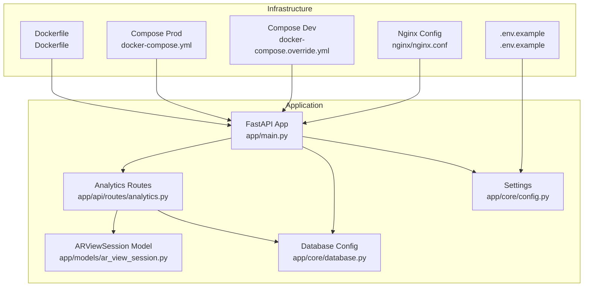
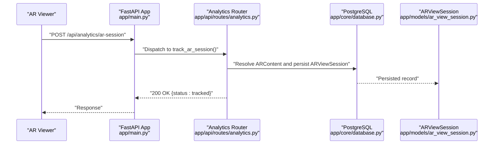
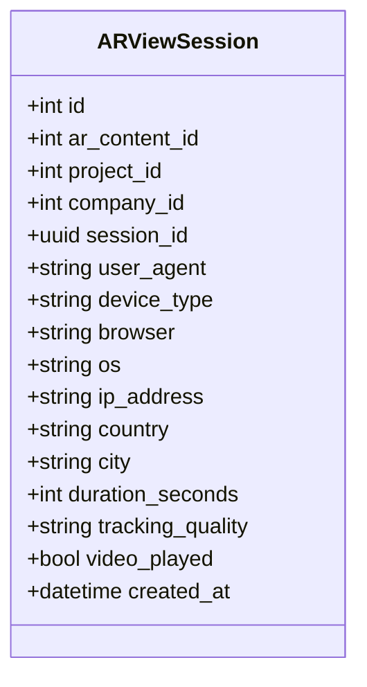
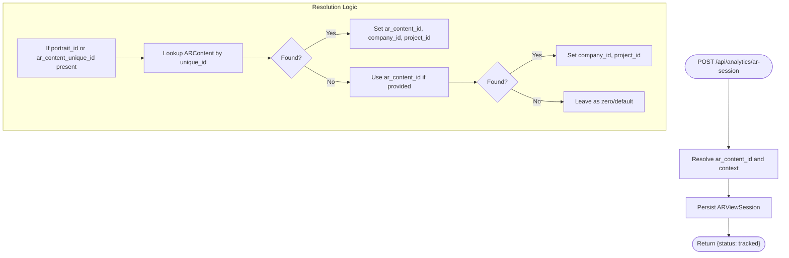
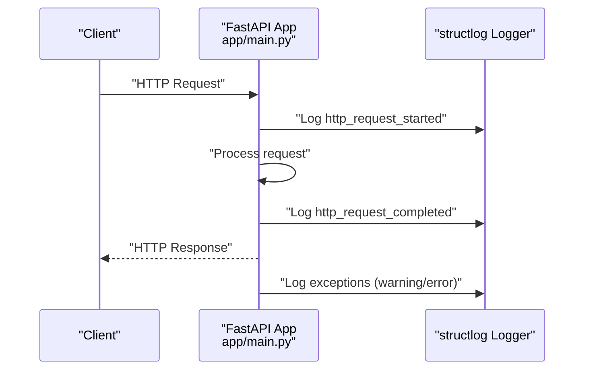
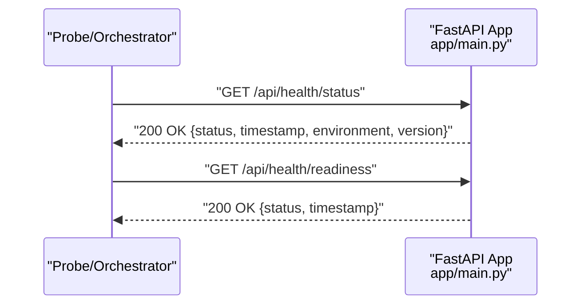
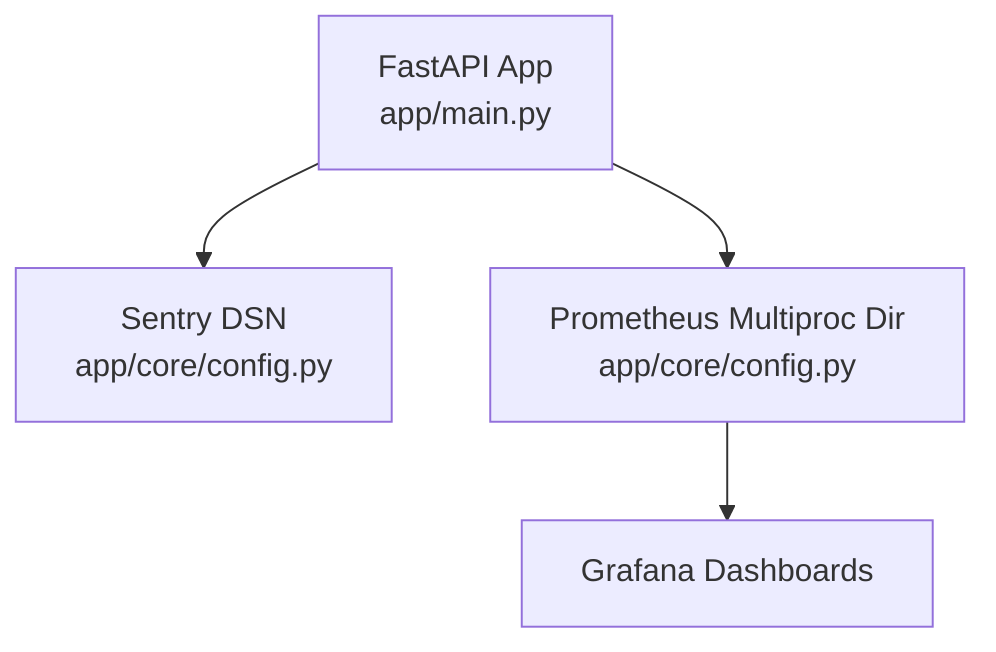
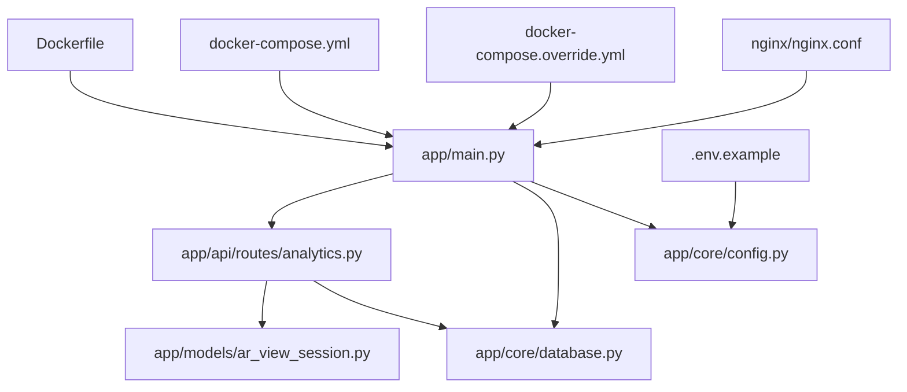

# Analytics & Monitoring

<cite>
**Referenced Files in This Document**
- [app/main.py](file://app/main.py)
- [app/api/routes/analytics.py](file://app/api/routes/analytics.py)
- [app/models/ar_view_session.py](file://app/models/ar_view_session.py)
- [app/core/database.py](file://app/core/database.py)
- [app/core/config.py](file://app/core/config.py)
- [alembic/versions/20251205_perf_idx.py](file://alembic/versions/20251205_perf_idx.py)
- [Dockerfile](file://Dockerfile)
- [docker-compose.yml](file://docker-compose.yml)
- [docker-compose.override.yml](file://docker-compose.override.yml)
- [.env.example](file://.env.example)
- [nginx/nginx.conf](file://nginx/nginx.conf)
- [requirements.txt](file://requirements.txt)
- [README.md](file://README.md)
</cite>

## Table of Contents
1. [Introduction](#introduction)
2. [Project Structure](#project-structure)
3. [Core Components](#core-components)
4. [Architecture Overview](#architecture-overview)
5. [Detailed Component Analysis](#detailed-component-analysis)
6. [Dependency Analysis](#dependency-analysis)
7. [Performance Considerations](#performance-considerations)
8. [Troubleshooting Guide](#troubleshooting-guide)
9. [Conclusion](#conclusion)
10. [Appendices](#appendices)

## Introduction
This section documents the ARV platform’s analytics and monitoring capabilities. It covers the built-in analytics system that tracks AR view sessions, including data collection, storage, and reporting. It also explains the integration points for external monitoring tools (Prometheus, Grafana, Sentry), the structured logging implementation using structlog with JSON output, health check endpoints, and practical examples for analytics queries and dashboard configurations. Finally, it addresses performance monitoring, alerting strategies, log analysis techniques, and the data model for analytics with retention considerations.

## Project Structure
The analytics and monitoring features are implemented across several modules:
- Health checks and structured logging live in the main application entrypoint.
- Analytics endpoints and AR view session model reside under the API routes and models.
- Database configuration and indexes support analytics performance.
- Container orchestration and environment variables define monitoring integration points.

**Diagram sources**
- [app/main.py](file://app/main.py#L1-L285)
- [app/api/routes/analytics.py](file://app/api/routes/analytics.py#L1-L93)
- [app/models/ar_view_session.py](file://app/models/ar_view_session.py#L1-L31)
- [app/core/database.py](file://app/core/database.py#L1-L103)
- [app/core/config.py](file://app/core/config.py#L1-L134)
- [Dockerfile](file://Dockerfile#L1-L53)
- [docker-compose.yml](file://docker-compose.yml#L1-L163)
- [docker-compose.override.yml](file://docker-compose.override.yml#L1-L32)
- [nginx/nginx.conf](file://nginx/nginx.conf#L54-L117)
- [.env.example](file://.env.example#L1-L70)

**Section sources**
- [app/main.py](file://app/main.py#L1-L285)
- [app/api/routes/analytics.py](file://app/api/routes/analytics.py#L1-L93)
- [app/models/ar_view_session.py](file://app/models/ar_view_session.py#L1-L31)
- [app/core/database.py](file://app/core/database.py#L1-L103)
- [app/core/config.py](file://app/core/config.py#L1-L134)
- [Dockerfile](file://Dockerfile#L1-L53)
- [docker-compose.yml](file://docker-compose.yml#L1-L163)
- [docker-compose.override.yml](file://docker-compose.override.yml#L1-L32)
- [nginx/nginx.conf](file://nginx/nginx.conf#L54-L117)
- [.env.example](file://.env.example#L1-L70)

## Core Components
- AR View Session Tracking: The analytics route accepts AR view session events and persists them to the database. It resolves company and project context from AR content identifiers.
- Analytics Reporting: The analytics endpoints expose aggregated counts for overview, company, project, and content scopes over a rolling 30-day window.
- Structured Logging: The application uses structlog to emit structured logs in JSON format in production and console format in development.
- Health Checks: Dedicated endpoints provide status and readiness checks for system monitoring.
- External Monitoring Integration Points: Configuration exposes SENTRY_DSN and PROMETHEUS_MULTIPROC_DIR for Sentry and Prometheus integration.

**Section sources**
- [app/api/routes/analytics.py](file://app/api/routes/analytics.py#L1-L93)
- [app/models/ar_view_session.py](file://app/models/ar_view_session.py#L1-L31)
- [app/main.py](file://app/main.py#L1-L285)
- [app/core/config.py](file://app/core/config.py#L1-L134)

## Architecture Overview
The analytics pipeline collects AR view session events, stores them in PostgreSQL, and exposes reporting endpoints. Structured logs are emitted for observability. Health checks integrate with container orchestrators. External tools (Prometheus, Grafana, Sentry) are configured via environment variables.

**Diagram sources**
- [app/main.py](file://app/main.py#L1-L285)
- [app/api/routes/analytics.py](file://app/api/routes/analytics.py#L1-L93)
- [app/models/ar_view_session.py](file://app/models/ar_view_session.py#L1-L31)
- [app/core/database.py](file://app/core/database.py#L1-L103)

## Detailed Component Analysis

### AR View Session Data Model
The AR view session model captures device and geographic metadata, session identity, and engagement signals. It includes timestamps and flags for video playback and tracking quality.

**Diagram sources**
- [app/models/ar_view_session.py](file://app/models/ar_view_session.py#L1-L31)

**Section sources**
- [app/models/ar_view_session.py](file://app/models/ar_view_session.py#L1-L31)

### Analytics Endpoints and Data Collection
- Overview endpoint aggregates total views and unique sessions over the last 30 days and counts active AR content.
- Per-company, per-project, and per-content endpoints return view counts for the same period.
- Session tracking endpoint accepts a payload with either an AR content identifier or a viewer-provided unique identifier, resolves company/project context, and persists the session.

**Diagram sources**
- [app/api/routes/analytics.py](file://app/api/routes/analytics.py#L1-L93)

**Section sources**
- [app/api/routes/analytics.py](file://app/api/routes/analytics.py#L1-L93)

### Structured Logging with structlog
The application configures structlog to emit JSON-formatted logs in production and console logs in development. HTTP request lifecycle is instrumented with structured log entries, and exceptions are logged with contextual information.

**Diagram sources**
- [app/main.py](file://app/main.py#L1-L285)

**Section sources**
- [app/main.py](file://app/main.py#L1-L285)
- [requirements.txt](file://requirements.txt#L1-L31)

### Health Check Endpoints
- Status endpoint returns health status, timestamp, environment, and application version.
- Readiness endpoint currently returns readiness without a database connectivity check.

**Diagram sources**
- [app/main.py](file://app/main.py#L209-L238)

**Section sources**
- [app/main.py](file://app/main.py#L209-L238)

### External Monitoring Integration
- Sentry: The settings include a Sentry DSN field for error tracking. The application emits structured logs for exceptions; integrating Sentry would require adding the SDK and configuring it with the DSN.
- Prometheus: The settings include a multiprocess directory for Prometheus metrics. The application does not currently expose Prometheus metrics endpoints; adding a Prometheus metrics endpoint would enable scraping.
- Grafana: Dashboards can be created from Prometheus metrics scraped from the application.

**Diagram sources**
- [app/main.py](file://app/main.py#L1-L285)
- [app/core/config.py](file://app/core/config.py#L1-L134)

**Section sources**
- [app/core/config.py](file://app/core/config.py#L1-L134)
- [.env.example](file://.env.example#L1-L70)

### Practical Analytics Queries and Dashboard Configurations
- Overview: Aggregate total views and unique sessions over the last 30 days, plus active AR content count.
- Company/Project/Content: Count views for a given scope over the last 30 days.
- Example queries:
  - Total views in the last 30 days: COUNT(*) on AR view sessions where created_at >= now - 30 days.
  - Unique sessions in the last 30 days: COUNT(DISTINCT session_id) on AR view sessions where created_at >= now - 30 days.
  - Views for a company/project/content: COUNT(*) filtered by company_id/project_id/ar_content_id and created_at >= now - 30 days.
- Dashboard suggestions:
  - Line chart: Views over time (daily/weekly).
  - Bar chart: Top companies/projects/content by views.
  - Pie chart: Device type/browsers/os distribution.
  - Heatmap: Country/city breakdown of sessions.

[No sources needed since this section provides conceptual guidance]

### Data Model for Analytics and Retention Policies
- AR view sessions are stored in a dedicated table with indexed columns for efficient analytics queries.
- Indexes:
  - Composite index on company_id and created_at for company-scoped analytics.
  - Index on ar_content_id for content-scoped analytics.
- Retention:
  - The code uses a 30-day rolling window for analytics endpoints.
  - No explicit database-level retention policy is defined in the repository; implement retention at the database level (e.g., scheduled cleanup jobs) if long-term storage is not required.

**Section sources**
- [app/models/ar_view_session.py](file://app/models/ar_view_session.py#L1-L31)
- [alembic/versions/20251205_perf_idx.py](file://alembic/versions/20251205_perf_idx.py#L1-L58)
- [app/api/routes/analytics.py](file://app/api/routes/analytics.py#L1-L93)

## Dependency Analysis
The analytics module depends on the database session factory and the AR view session model. The main application wires routing and logging. Docker and compose define runtime and health checks. Nginx proxies traffic to the backend.

**Diagram sources**
- [app/main.py](file://app/main.py#L1-L285)
- [app/api/routes/analytics.py](file://app/api/routes/analytics.py#L1-L93)
- [app/models/ar_view_session.py](file://app/models/ar_view_session.py#L1-L31)
- [app/core/database.py](file://app/core/database.py#L1-L103)
- [app/core/config.py](file://app/core/config.py#L1-L134)
- [Dockerfile](file://Dockerfile#L1-L53)
- [docker-compose.yml](file://docker-compose.yml#L1-L163)
- [docker-compose.override.yml](file://docker-compose.override.yml#L1-L32)
- [nginx/nginx.conf](file://nginx/nginx.conf#L54-L117)
- [.env.example](file://.env.example#L1-L70)

**Section sources**
- [app/main.py](file://app/main.py#L1-L285)
- [app/api/routes/analytics.py](file://app/api/routes/analytics.py#L1-L93)
- [app/models/ar_view_session.py](file://app/models/ar_view_session.py#L1-L31)
- [app/core/database.py](file://app/core/database.py#L1-L103)
- [app/core/config.py](file://app/core/config.py#L1-L134)
- [Dockerfile](file://Dockerfile#L1-L53)
- [docker-compose.yml](file://docker-compose.yml#L1-L163)
- [docker-compose.override.yml](file://docker-compose.override.yml#L1-L32)
- [nginx/nginx.conf](file://nginx/nginx.conf#L54-L117)
- [.env.example](file://.env.example#L1-L70)

## Performance Considerations
- Database pooling and pre-ping are configured to improve reliability and performance.
- Analytics-specific indexes reduce query cost for company-scoped and content-scoped analytics.
- Health checks and readiness probes help container orchestrators manage scaling and failover.
- Nginx rate limiting and timeouts protect the backend under load.

**Section sources**
- [app/core/database.py](file://app/core/database.py#L1-L103)
- [alembic/versions/20251205_perf_idx.py](file://alembic/versions/20251205_perf_idx.py#L1-L58)
- [Dockerfile](file://Dockerfile#L1-L53)
- [docker-compose.yml](file://docker-compose.yml#L1-L163)
- [nginx/nginx.conf](file://nginx/nginx.conf#L54-L117)

## Troubleshooting Guide
- Health checks:
  - Use the status endpoint to confirm application health and environment/version details.
  - Use the readiness endpoint to verify the app is ready to serve requests.
- Logs:
  - In development, logs are human-readable; in production, logs are JSON for machine parsing.
  - Inspect structured log entries for request lifecycle and exception details.
- Database:
  - Verify database connectivity and pool configuration.
  - Confirm indexes exist for analytics queries.
- External tools:
  - Ensure Sentry DSN and Prometheus multiproc directory are configured.
  - Validate that health checks are reachable from the container runtime.

**Section sources**
- [app/main.py](file://app/main.py#L1-L285)
- [app/core/config.py](file://app/core/config.py#L1-L134)
- [Dockerfile](file://Dockerfile#L1-L53)
- [docker-compose.yml](file://docker-compose.yml#L1-L163)

## Conclusion
The ARV platform provides a solid foundation for AR view session analytics with built-in endpoints, a well-defined data model, and performance indexes. Structured logging and health checks support operational visibility. External monitoring integrations (Sentry, Prometheus, Grafana) are configured via settings and environment variables, enabling comprehensive observability. For long-term analytics, consider implementing database-level retention policies and adding Prometheus metrics endpoints.

[No sources needed since this section summarizes without analyzing specific files]

## Appendices

### Appendix A: Endpoint Reference
- GET /api/health/status
- GET /api/health/readiness
- GET /api/analytics/overview
- GET /api/analytics/companies/{company_id}
- GET /api/analytics/projects/{project_id}
- GET /api/analytics/ar-content/{content_id}
- POST /api/analytics/ar-session

**Section sources**
- [app/main.py](file://app/main.py#L209-L238)
- [app/api/routes/analytics.py](file://app/api/routes/analytics.py#L1-L93)

### Appendix B: Environment Variables for Monitoring
- SENTRY_DSN
- PROMETHEUS_MULTIPROC_DIR

**Section sources**
- [app/core/config.py](file://app/core/config.py#L1-L134)
- [.env.example](file://.env.example#L1-L70)

### Appendix C: Container Health Checks
- Docker HEALTHCHECK probes the status endpoint.

**Section sources**
- [Dockerfile](file://Dockerfile#L1-L53)

### Appendix D: Documentation References
- Monitoring documentation is referenced in the project README.

**Section sources**
- [README.md](file://README.md#L60-L70)