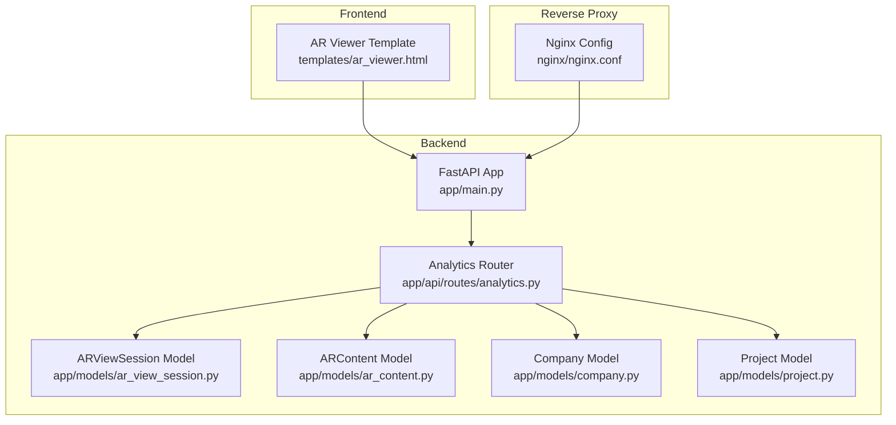
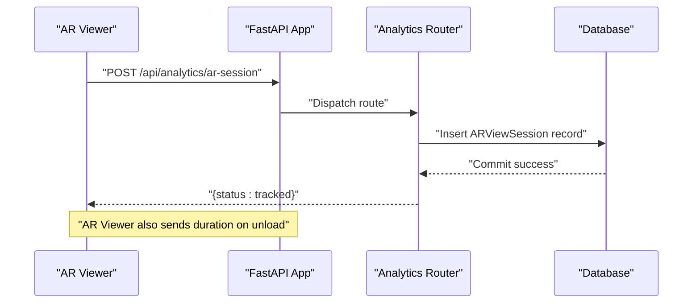
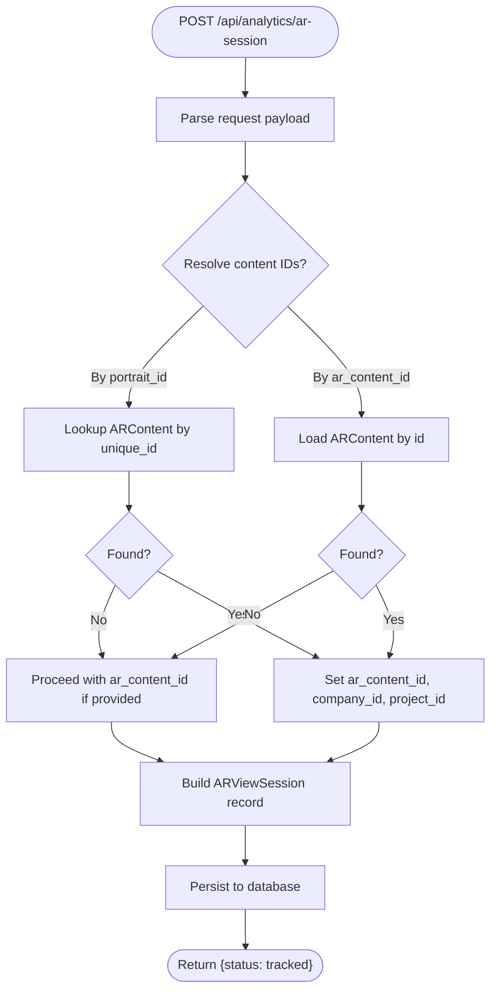
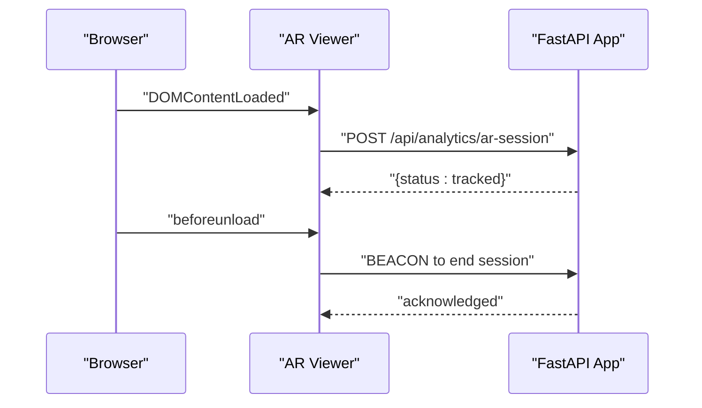
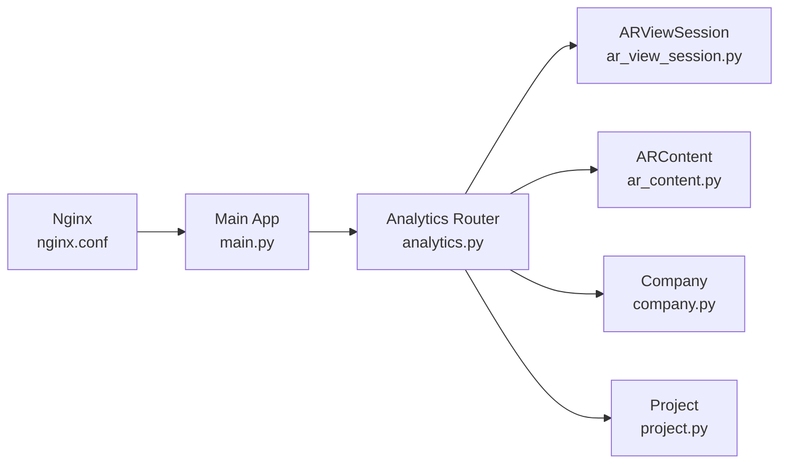

# Analytics API Endpoints

<cite>
**Referenced Files in This Document**
- [analytics.py](file://app/api/routes/analytics.py)
- [ar_view_session.py](file://app/models/ar_view_session.py)
- [ar_content.py](file://app/models/ar_content.py)
- [company.py](file://app/models/company.py)
- [project.py](file://app/models/project.py)
- [main.py](file://app/main.py)
- [ar_viewer.html](file://templates/ar_viewer.html)
- [nginx.conf](file://nginx/nginx.conf)
</cite>

## Table of Contents
1. [Introduction](#introduction)
2. [Project Structure](#project-structure)
3. [Core Components](#core-components)
4. [Architecture Overview](#architecture-overview)
5. [Detailed Component Analysis](#detailed-component-analysis)
6. [Dependency Analysis](#dependency-analysis)
7. [Performance Considerations](#performance-considerations)
8. [Troubleshooting Guide](#troubleshooting-guide)
9. [Conclusion](#conclusion)

## Introduction
This document provides comprehensive API documentation for the analytics endpoints in the ARV platform. It covers:
- GET /api/analytics/overview
- GET /api/analytics/companies/{company_id}
- GET /api/analytics/projects/{project_id}
- GET /api/analytics/ar-content/{content_id}
- POST /api/analytics/ar-session

It also explains the analytics_overview function, the company, project, and content-specific analytics endpoints, and the track_ar_session endpoint that ingests AR interaction data. The document includes request/response schemas, authentication requirements, error handling, usage examples, rate limiting considerations, and integration patterns with the AR viewer frontend.

## Project Structure
The analytics endpoints are implemented as FastAPI routes under the analytics router and are included into the main application. The AR viewer frontend integrates with these endpoints to track AR sessions.

**Diagram sources**
- [main.py](file://app/main.py#L230-L261)
- [analytics.py](file://app/api/routes/analytics.py#L1-L92)
- [ar_view_session.py](file://app/models/ar_view_session.py#L1-L31)
- [ar_content.py](file://app/models/ar_content.py#L1-L46)
- [company.py](file://app/models/company.py#L1-L41)
- [project.py](file://app/models/project.py#L1-L35)
- [ar_viewer.html](file://templates/ar_viewer.html#L160-L200)
- [nginx.conf](file://nginx/nginx.conf#L33-L68)

**Section sources**
- [main.py](file://app/main.py#L230-L261)
- [analytics.py](file://app/api/routes/analytics.py#L1-L92)
- [ar_view_session.py](file://app/models/ar_view_session.py#L1-L31)
- [ar_content.py](file://app/models/ar_content.py#L1-L46)
- [company.py](file://app/models/company.py#L1-L41)
- [project.py](file://app/models/project.py#L1-L35)
- [ar_viewer.html](file://templates/ar_viewer.html#L160-L200)
- [nginx.conf](file://nginx/nginx.conf#L33-L68)

## Core Components
- Analytics Router: Defines analytics endpoints and delegates to SQLAlchemy for data retrieval and persistence.
- ARViewSession Model: Stores AR interaction records with fields for session_id, device/browser/os, tracking quality, and video playback flag.
- ARContent Model: Links AR content to company and project, used to resolve content IDs for analytics.
- Company and Project Models: Provide hierarchical context for analytics aggregations.
- Frontend Integration: The AR viewer template initiates analytics tracking during AR sessions.

**Section sources**
- [analytics.py](file://app/api/routes/analytics.py#L1-L92)
- [ar_view_session.py](file://app/models/ar_view_session.py#L1-L31)
- [ar_content.py](file://app/models/ar_content.py#L1-L46)
- [company.py](file://app/models/company.py#L1-L41)
- [project.py](file://app/models/project.py#L1-L35)
- [ar_viewer.html](file://templates/ar_viewer.html#L160-L200)

## Architecture Overview
The analytics endpoints are mounted under /api/analytics and use dependency injection to obtain an asynchronous database session. The track_ar_session endpoint persists AR interaction data and resolves content and organizational context from ARContent.

**Diagram sources**
- [analytics.py](file://app/api/routes/analytics.py#L55-L92)
- [ar_view_session.py](file://app/models/ar_view_session.py#L1-L31)
- [ar_viewer.html](file://templates/ar_viewer.html#L178-L200)

## Detailed Component Analysis

### GET /api/analytics/overview
- Method: GET
- URL Pattern: /api/analytics/overview
- Purpose: Returns aggregated analytics for the last 30 days including total views, unique sessions, and active content count.
- Authentication: Not specified in the route; depends on application-wide middleware.
- Response Schema:
  - total_views: integer
  - unique_sessions: integer
  - active_content: integer
  - storage_used_gb: null or number (placeholder)
- Implementation Details:
  - Computes total views by counting ARViewSession entries within the last 30 days.
  - Counts unique sessions by counting distinct session_id values within the same period.
  - Counts active content by counting ARContent entries where is_active is true.
- Error Handling:
  - Uses application exception handlers for HTTP exceptions, validation errors, and general exceptions.

**Section sources**
- [analytics.py](file://app/api/routes/analytics.py#L16-L31)
- [ar_view_session.py](file://app/models/ar_view_session.py#L1-L31)
- [ar_content.py](file://app/models/ar_content.py#L1-L46)
- [main.py](file://app/main.py#L145-L209)

### GET /api/analytics/companies/{company_id}
- Method: GET
- URL Pattern: /api/analytics/companies/{company_id}
- Purpose: Returns view count for a specific company over the last 30 days.
- Authentication: Not specified in the route; depends on application-wide middleware.
- Path Parameters:
  - company_id: integer
- Response Schema:
  - company_id: integer
  - views_30_days: integer
- Implementation Details:
  - Filters ARViewSession by company_id and created_at within the last 30 days.
- Error Handling:
  - Uses application exception handlers.

**Section sources**
- [analytics.py](file://app/api/routes/analytics.py#L34-L39)
- [ar_view_session.py](file://app/models/ar_view_session.py#L1-L31)
- [main.py](file://app/main.py#L145-L209)

### GET /api/analytics/projects/{project_id}
- Method: GET
- URL Pattern: /api/analytics/projects/{project_id}
- Purpose: Returns view count for a specific project over the last 30 days.
- Authentication: Not specified in the route; depends on application-wide middleware.
- Path Parameters:
  - project_id: integer
- Response Schema:
  - project_id: integer
  - views_30_days: integer
- Implementation Details:
  - Filters ARViewSession by project_id and created_at within the last 30 days.
- Error Handling:
  - Uses application exception handlers.

**Section sources**
- [analytics.py](file://app/api/routes/analytics.py#L41-L46)
- [ar_view_session.py](file://app/models/ar_view_session.py#L1-L31)
- [main.py](file://app/main.py#L145-L209)

### GET /api/analytics/ar-content/{content_id}
- Method: GET
- URL Pattern: /api/analytics/ar-content/{content_id}
- Purpose: Returns view count for a specific AR content over the last 30 days.
- Authentication: Not specified in the route; depends on application-wide middleware.
- Path Parameters:
  - content_id: integer
- Response Schema:
  - ar_content_id: integer
  - views_30_days: integer
- Implementation Details:
  - Filters ARViewSession by ar_content_id and created_at within the last 30 days.
- Error Handling:
  - Uses application exception handlers.

**Section sources**
- [analytics.py](file://app/api/routes/analytics.py#L48-L53)
- [ar_view_session.py](file://app/models/ar_view_session.py#L1-L31)
- [main.py](file://app/main.py#L145-L209)

### POST /api/analytics/ar-session
- Method: POST
- URL Pattern: /api/analytics/ar-session
- Purpose: Ingests AR interaction data to track a session.
- Authentication: Not specified in the route; depends on application-wide middleware.
- Request Body Fields:
  - portrait_id: string (alternative to ar_content_unique_id)
  - ar_content_unique_id: string (alternative to portrait_id)
  - ar_content_id: integer (alternative to portrait_id)
  - session_id: string (UUID)
  - user_agent: string
  - device_type: string (e.g., mobile, tablet, desktop)
  - browser: string
  - os: string
  - tracking_quality: string
  - video_played: boolean
- Response Schema:
  - status: string ("tracked")
- Processing Logic:
  - Resolves ar_content_id and associated company_id/project_id either from portrait_id/ar_content_unique_id (via ARContent lookup) or from ar_content_id.
  - Creates an ARViewSession record with the provided fields and persists it to the database.
- Error Handling:
  - Uses application exception handlers.

**Diagram sources**
- [analytics.py](file://app/api/routes/analytics.py#L55-L92)
- [ar_view_session.py](file://app/models/ar_view_session.py#L1-L31)
- [ar_content.py](file://app/models/ar_content.py#L1-L46)

**Section sources**
- [analytics.py](file://app/api/routes/analytics.py#L55-L92)
- [ar_view_session.py](file://app/models/ar_view_session.py#L1-L31)
- [ar_content.py](file://app/models/ar_content.py#L1-L46)
- [main.py](file://app/main.py#L145-L209)

### Frontend Integration with AR Viewer
- The AR viewer template initializes AR and triggers analytics tracking:
  - Generates a session UUID and captures user agent and device type.
  - Sends a POST request to /api/analytics/ar-session with the session metadata.
  - On page unload, computes duration and sends a beacon to end the session.
- Integration Pattern:
  - The frontend uses window.fetch for the initial POST and navigator.sendBeacon for the duration update.
  - The API base URL is derived from window.location.origin.

**Diagram sources**
- [ar_viewer.html](file://templates/ar_viewer.html#L178-L200)
- [analytics.py](file://app/api/routes/analytics.py#L55-L92)

**Section sources**
- [ar_viewer.html](file://templates/ar_viewer.html#L160-L200)
- [analytics.py](file://app/api/routes/analytics.py#L55-L92)

## Dependency Analysis
- Router-to-Model Dependencies:
  - analytics_overview depends on ARViewSession and ARContent.
  - analytics_company/analytics_project/analytics_content depend on ARViewSession.
  - track_ar_session depends on ARViewSession and ARContent.
- Application Inclusion:
  - The analytics router is included into the main application under /api with tags ["Analytics"].
- Reverse Proxy Rate Limiting:
  - Nginx applies rate limiting zones for API endpoints.

**Diagram sources**
- [analytics.py](file://app/api/routes/analytics.py#L1-L92)
- [ar_view_session.py](file://app/models/ar_view_session.py#L1-L31)
- [ar_content.py](file://app/models/ar_content.py#L1-L46)
- [company.py](file://app/models/company.py#L1-L41)
- [project.py](file://app/models/project.py#L1-L35)
- [main.py](file://app/main.py#L230-L261)
- [nginx.conf](file://nginx/nginx.conf#L33-L68)

**Section sources**
- [analytics.py](file://app/api/routes/analytics.py#L1-L92)
- [main.py](file://app/main.py#L230-L261)
- [nginx.conf](file://nginx/nginx.conf#L33-L68)

## Performance Considerations
- Database Queries:
  - Each analytics endpoint performs COUNT queries filtered by created_at within the last 30 days. These queries are efficient but should be indexed appropriately on created_at and foreign keys for optimal performance.
- Rate Limiting:
  - Nginx applies a rate limit zone for /api/ endpoints with a burst allowance. This helps protect the backend from excessive traffic.
- Asynchronous Operations:
  - The application uses async database operations, which can improve throughput under concurrent load.

**Section sources**
- [analytics.py](file://app/api/routes/analytics.py#L16-L53)
- [nginx.conf](file://nginx/nginx.conf#L33-L68)
- [main.py](file://app/main.py#L108-L141)

## Troubleshooting Guide
- HTTP Exceptions:
  - The application handles HTTP exceptions globally and returns a standardized error response containing code, message, and timestamp.
- Validation Errors:
  - Validation errors are captured and returned with details and a 422 status.
- General Exceptions:
  - Unhandled exceptions are logged and responded with a 500 status and a generic message (or the exception details in debug mode).
- Session Duration:
  - The frontend sends a duration update on page unload using navigator.sendBeacon. If this fails, the session may remain open without duration recorded.

**Section sources**
- [main.py](file://app/main.py#L145-L209)
- [ar_viewer.html](file://templates/ar_viewer.html#L193-L200)

## Conclusion
The ARV analytics endpoints provide essential insights into AR content engagement and device usage. The overview endpoint aggregates key metrics, while company, project, and content-specific endpoints enable granular reporting. The track_ar_session endpoint captures session metadata and content context, enabling robust analytics. The AR viewer frontend integrates seamlessly with these endpoints to track sessions and durations. Rate limiting at the reverse proxy layer protects the backend, and global exception handlers ensure consistent error responses.