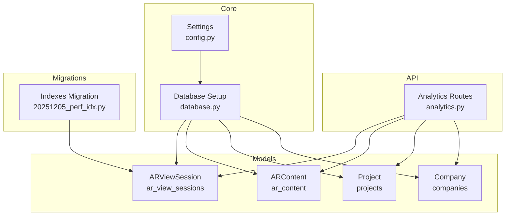
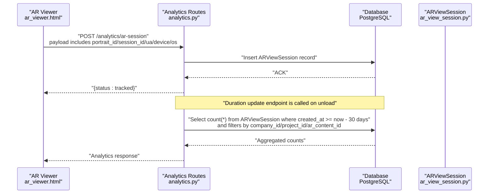
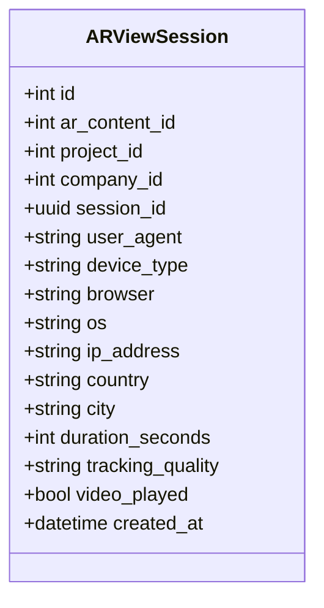
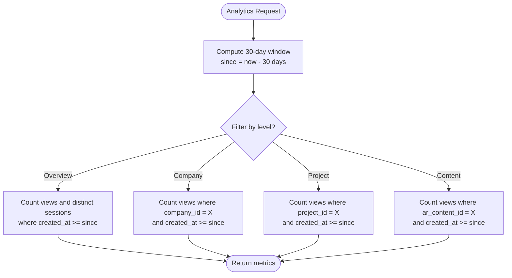
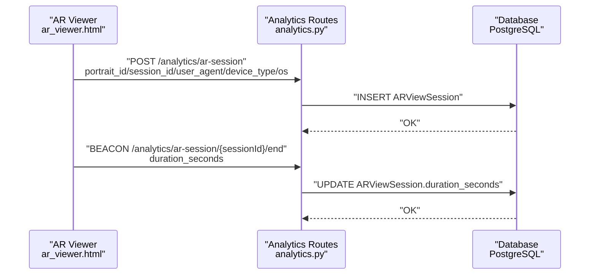
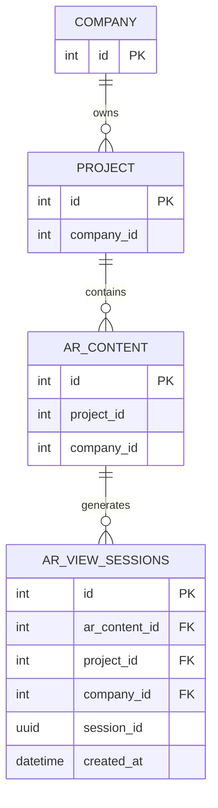
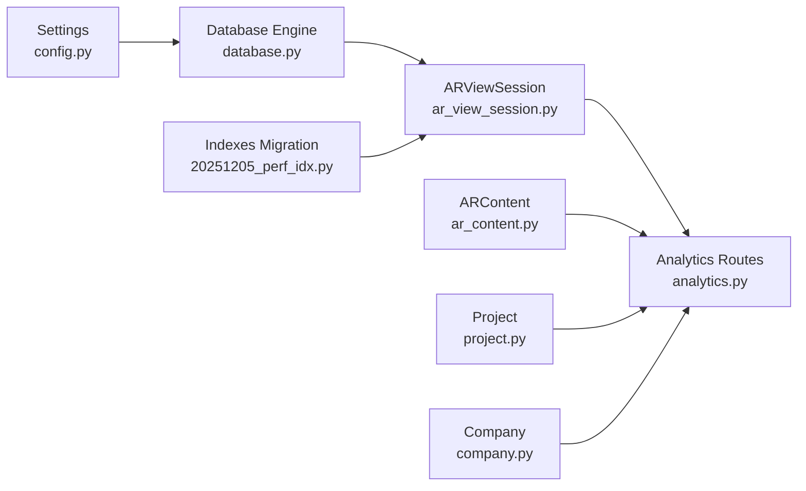

# Analytics Data Model

<cite>
**Referenced Files in This Document**
- [ar_view_session.py](file://app/models/ar_view_session.py)
- [analytics.py](file://app/api/routes/analytics.py)
- [ar_content.py](file://app/models/ar_content.py)
- [project.py](file://app/models/project.py)
- [company.py](file://app/models/company.py)
- [database.py](file://app/core/database.py)
- [config.py](file://app/core/config.py)
- [20251205_perf_idx.py](file://alembic/versions/20251205_perf_idx.py)
- [ar_viewer.html](file://templates/ar_viewer.html)
</cite>

## Table of Contents
1. [Introduction](#introduction)
2. [Project Structure](#project-structure)
3. [Core Components](#core-components)
4. [Architecture Overview](#architecture-overview)
5. [Detailed Component Analysis](#detailed-component-analysis)
6. [Dependency Analysis](#dependency-analysis)
7. [Performance Considerations](#performance-considerations)
8. [Troubleshooting Guide](#troubleshooting-guide)
9. [Conclusion](#conclusion)
10. [Appendices](#appendices)

## Introduction
This document provides comprehensive data model documentation for the ARViewSession model, which is the foundation for analytics in the ARV platform. It covers entity relationships, field definitions, data types, constraints, validation rules, and business logic such as the 30-day analytics window. It also explains how AR interaction data is captured and how analytics endpoints support insights at overview, company, project, and content levels. Finally, it outlines database schema considerations, indexing strategies, and performance implications for analytics queries.

## Project Structure
The analytics data model centers around the ARViewSession SQLAlchemy model and its integration with analytics endpoints. Supporting models include ARContent, Project, and Company, which define the hierarchical relationships used in analytics aggregations. Database configuration and asynchronous ORM setup are provided by the core modules, while Alembic migrations define indexes that optimize analytics queries.

**Diagram sources**
- [ar_view_session.py](file://app/models/ar_view_session.py#L1-L31)
- [analytics.py](file://app/api/routes/analytics.py#L1-L93)
- [ar_content.py](file://app/models/ar_content.py#L1-L46)
- [project.py](file://app/models/project.py#L1-L35)
- [company.py](file://app/models/company.py#L1-L41)
- [database.py](file://app/core/database.py#L1-L103)
- [config.py](file://app/core/config.py#L1-L134)
- [20251205_perf_idx.py](file://alembic/versions/20251205_perf_idx.py#L1-L58)

**Section sources**
- [ar_view_session.py](file://app/models/ar_view_session.py#L1-L31)
- [analytics.py](file://app/api/routes/analytics.py#L1-L93)
- [database.py](file://app/core/database.py#L1-L103)
- [config.py](file://app/core/config.py#L1-L134)
- [20251205_perf_idx.py](file://alembic/versions/20251205_perf_idx.py#L1-L58)

## Core Components
This section defines the ARViewSession data model and its role in capturing AR interaction events.

- Entity name: ar_view_sessions
- Primary key: id (Integer, autoincrement via SQLAlchemy, primary_key=True)
- Fields and types:
  - id: Integer (primary key)
  - ar_content_id: Integer (non-null)
  - project_id: Integer (non-null)
  - company_id: Integer (non-null)
  - session_id: UUID (nullable)
  - user_agent: String (nullable)
  - device_type: String(50) (nullable)
  - browser: String(100) (nullable)
  - os: String(100) (nullable)
  - ip_address: String(64) (nullable)
  - country: String(100) (nullable)
  - city: String(100) (nullable)
  - duration_seconds: Integer (nullable)
  - tracking_quality: String(50) (nullable)
  - video_played: Boolean (default False)
  - created_at: DateTime (default UTC now)

Constraints and defaults:
- Primary key constraint on id
- Non-null constraints on ar_content_id, project_id, company_id
- Default values for created_at and video_played
- session_id is nullable; duration_seconds is nullable

Business logic:
- Analytics endpoints enforce a 30-day rolling window by filtering records where created_at >= now - 30 days
- Unique sessions are counted using distinct session_id within the 30-day window

**Section sources**
- [ar_view_session.py](file://app/models/ar_view_session.py#L1-L31)
- [analytics.py](file://app/api/routes/analytics.py#L16-L53)

## Architecture Overview
The analytics pipeline captures AR sessions and exposes aggregated metrics. The AR viewer frontend triggers session tracking, and the backend persists ARViewSession records. Analytics endpoints compute counts over the 30-day window using company_id, project_id, and ar_content_id filters.

**Diagram sources**
- [ar_viewer.html](file://templates/ar_viewer.html#L178-L200)
- [analytics.py](file://app/api/routes/analytics.py#L16-L93)
- [ar_view_session.py](file://app/models/ar_view_session.py#L1-L31)

## Detailed Component Analysis

### ARViewSession Model
The ARViewSession model encapsulates AR interaction events. It includes identifiers for content, project, and company, along with device and geographic metadata, quality indicators, and timestamps.

**Diagram sources**
- [ar_view_session.py](file://app/models/ar_view_session.py#L1-L31)

**Section sources**
- [ar_view_session.py](file://app/models/ar_view_session.py#L1-L31)

### Analytics Endpoints and Business Logic
The analytics module defines endpoints that compute counts over a 30-day window. It uses company_id, project_id, and ar_content_id to segment views and session uniqueness via distinct session_id.

Key behaviors:
- Overview endpoint aggregates total views and unique sessions within the 30-day window
- Company endpoint returns views_30_days for a given company_id within the 30-day window
- Project endpoint returns views_30_days for a given project_id within the 30-day window
- Content endpoint returns views_30_days for a given ar_content_id within the 30-day window
- Session tracking endpoint accepts either portrait_id or ar_content_unique_id to resolve content identifiers and persists ARViewSession

**Diagram sources**
- [analytics.py](file://app/api/routes/analytics.py#L16-L53)

**Section sources**
- [analytics.py](file://app/api/routes/analytics.py#L16-L53)

### Data Capture Workflow (Frontend to Backend)
The AR viewer frontend initiates AR sessions and sends tracking requests. It generates a session_id and computes duration on unload, sending a separate endpoint to update duration_seconds.

**Diagram sources**
- [ar_viewer.html](file://templates/ar_viewer.html#L178-L200)
- [analytics.py](file://app/api/routes/analytics.py#L55-L93)

**Section sources**
- [ar_viewer.html](file://templates/ar_viewer.html#L178-L200)
- [analytics.py](file://app/api/routes/analytics.py#L55-L93)

### Relationship Mapping
ARViewSession relates to higher-level entities through foreign keys embedded in the model:

- ARViewSession.ar_content_id links to ARContent.id
- ARViewSession.project_id links to Project.id
- ARViewSession.company_id links to Company.id

These relationships enable analytics segmentation by company, project, and content.

**Diagram sources**
- [ar_view_session.py](file://app/models/ar_view_session.py#L1-L31)
- [ar_content.py](file://app/models/ar_content.py#L1-L46)
- [project.py](file://app/models/project.py#L1-L35)
- [company.py](file://app/models/company.py#L1-L41)

**Section sources**
- [ar_view_session.py](file://app/models/ar_view_session.py#L1-L31)
- [ar_content.py](file://app/models/ar_content.py#L1-L46)
- [project.py](file://app/models/project.py#L1-L35)
- [company.py](file://app/models/company.py#L1-L41)

## Dependency Analysis
The analytics endpoints depend on ARViewSession and related models to compute counts. Database configuration and Alembic migrations define the underlying schema and indexes.

**Diagram sources**
- [config.py](file://app/core/config.py#L1-L134)
- [database.py](file://app/core/database.py#L1-L103)
- [ar_view_session.py](file://app/models/ar_view_session.py#L1-L31)
- [analytics.py](file://app/api/routes/analytics.py#L1-L93)
- [ar_content.py](file://app/models/ar_content.py#L1-L46)
- [project.py](file://app/models/project.py#L1-L35)
- [company.py](file://app/models/company.py#L1-L41)
- [20251205_perf_idx.py](file://alembic/versions/20251205_perf_idx.py#L1-L58)

**Section sources**
- [analytics.py](file://app/api/routes/analytics.py#L1-L93)
- [database.py](file://app/core/database.py#L1-L103)
- [20251205_perf_idx.py](file://alembic/versions/20251205_perf_idx.py#L1-L58)

## Performance Considerations
Indexing strategy:
- A composite index on (company_id, created_at) optimizes company-level analytics queries
- An index on ar_content_id accelerates content-level analytics queries
- Additional indexes exist for companies and projects to improve related lookups

Query patterns:
- Overview: Count all views and distinct sessions within the 30-day window
- Company: Count views filtered by company_id and created_at >= since
- Project: Count views filtered by project_id and created_at >= since
- Content: Count views filtered by ar_content_id and created_at >= since

Performance implications:
- The composite index on (company_id, created_at) allows efficient filtering and sorting by time for company-level analytics
- The ar_content_id index supports fast lookups for content-level analytics
- Distinct counting on session_id adds overhead; ensure appropriate indexing and consider materialized summaries for very high volumes

Retention policy:
- The repository does not define explicit data retention for ARViewSession; analytics endpoints use a 30-day window for reporting. Implementing a retention policy (e.g., purge older rows) is recommended to control table growth.

**Section sources**
- [20251205_perf_idx.py](file://alembic/versions/20251205_perf_idx.py#L1-L58)
- [analytics.py](file://app/api/routes/analytics.py#L16-L53)

## Troubleshooting Guide
Common issues and resolutions:
- Missing indexes: Without the (company_id, created_at) and ar_content_id indexes, analytics queries may degrade significantly. Apply the migration to add these indexes.
- Null values: session_id and duration_seconds are nullable; ensure frontend updates duration_seconds appropriately to avoid null gaps in analytics.
- Time window mismatch: Verify that created_at is stored in UTC and that the 30-day window calculation aligns with application timezone expectations.
- Data volume: If analytics queries become slow, consider partitioning by time or introducing materialized summaries.

**Section sources**
- [20251205_perf_idx.py](file://alembic/versions/20251205_perf_idx.py#L1-L58)
- [analytics.py](file://app/api/routes/analytics.py#L16-L53)
- [ar_view_session.py](file://app/models/ar_view_session.py#L1-L31)

## Conclusion
The ARViewSession model provides a robust foundation for AR analytics by capturing interaction metadata and identifiers for hierarchical segmentation. Analytics endpoints enforce a 30-day window and leverage targeted indexes to deliver efficient aggregations at overview, company, project, and content levels. Proper indexing, data capture hygiene, and potential retention policies will ensure scalable and reliable analytics performance.

## Appendices

### Appendix A: Field Definitions and Validation Rules
- id: Integer, primary key
- ar_content_id: Integer, non-null
- project_id: Integer, non-null
- company_id: Integer, non-null
- session_id: UUID, nullable
- user_agent: String, nullable
- device_type: String(50), nullable
- browser: String(100), nullable
- os: String(100), nullable
- ip_address: String(64), nullable
- country: String(100), nullable
- city: String(100), nullable
- duration_seconds: Integer, nullable
- tracking_quality: String(50), nullable
- video_played: Boolean, default False
- created_at: DateTime, default UTC now

Validation rules observed in code:
- Non-null constraints enforced at model level for ar_content_id, project_id, company_id
- Default values for created_at and video_played
- String length constraints defined in model fields

**Section sources**
- [ar_view_session.py](file://app/models/ar_view_session.py#L1-L31)

### Appendix B: Common Analytics Queries and Performance Notes
- Overview: Count total views and unique sessions within the 30-day window
- Company: Count views for a given company_id within the 30-day window
- Project: Count views for a given project_id within the 30-day window
- Content: Count views for a given ar_content_id within the 30-day window

Performance notes:
- Use the (company_id, created_at) index for company-level queries
- Use the ar_content_id index for content-level queries
- Distinct counting on session_id may be expensive; consider indexing and caching strategies for high-volume scenarios

**Section sources**
- [analytics.py](file://app/api/routes/analytics.py#L16-L53)
- [20251205_perf_idx.py](file://alembic/versions/20251205_perf_idx.py#L1-L58)