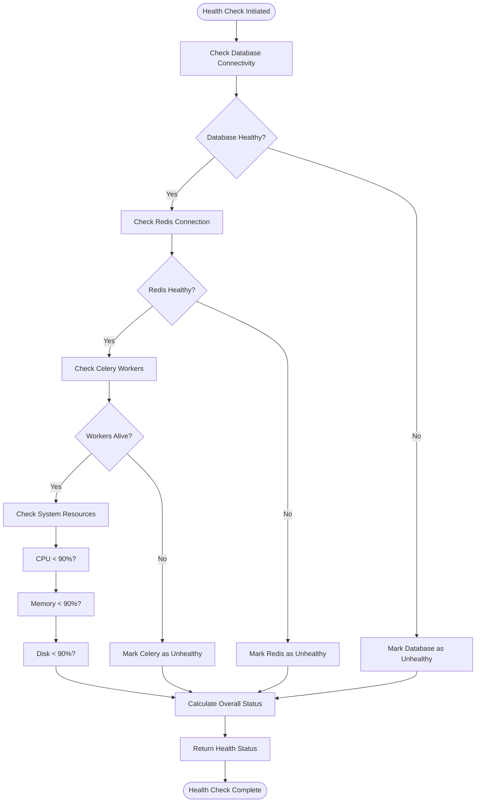
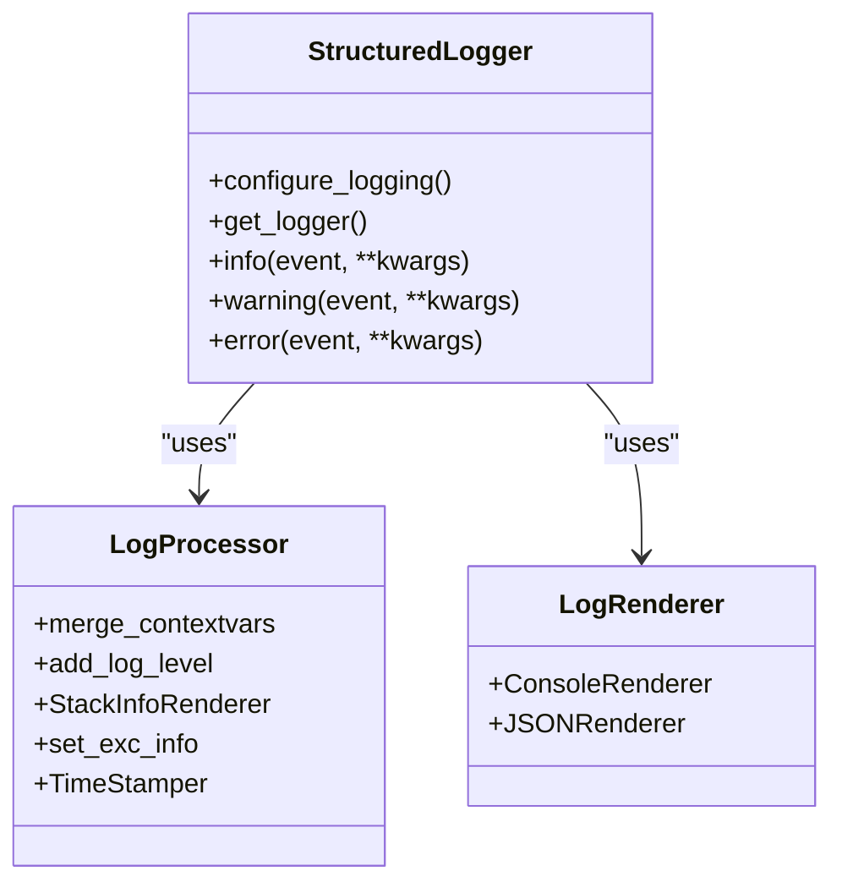
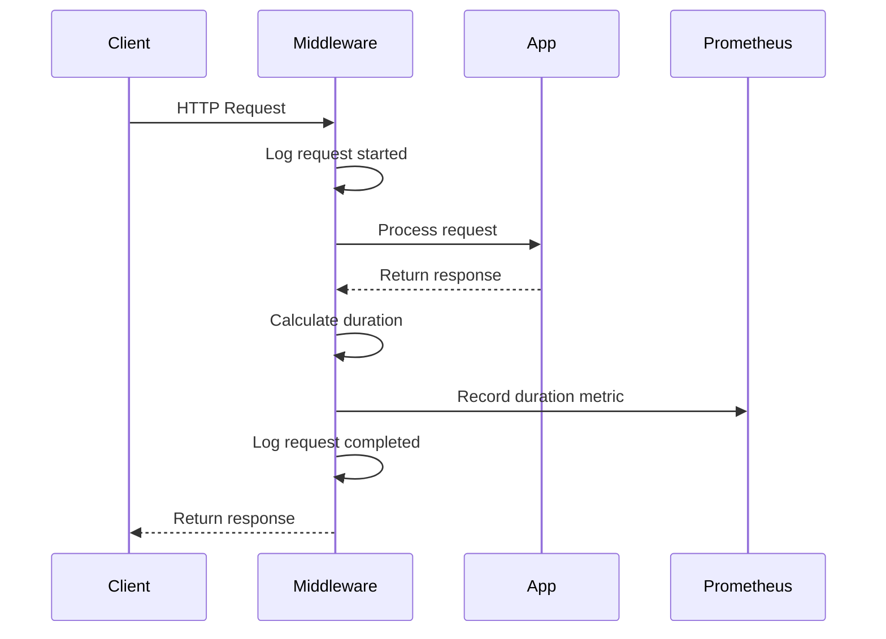
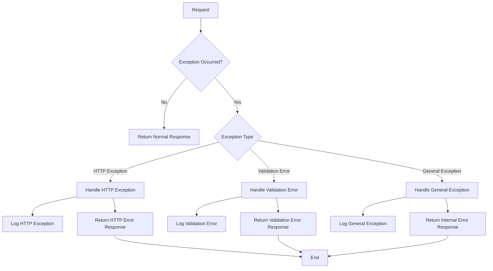
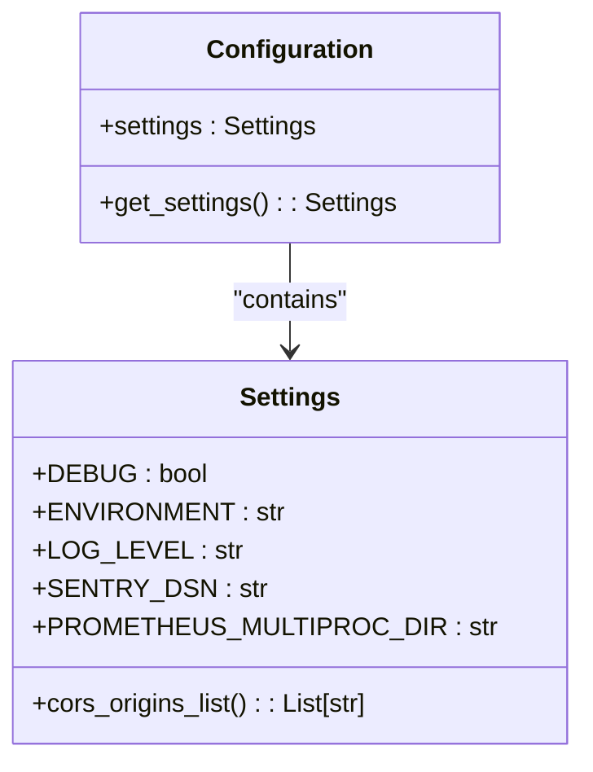
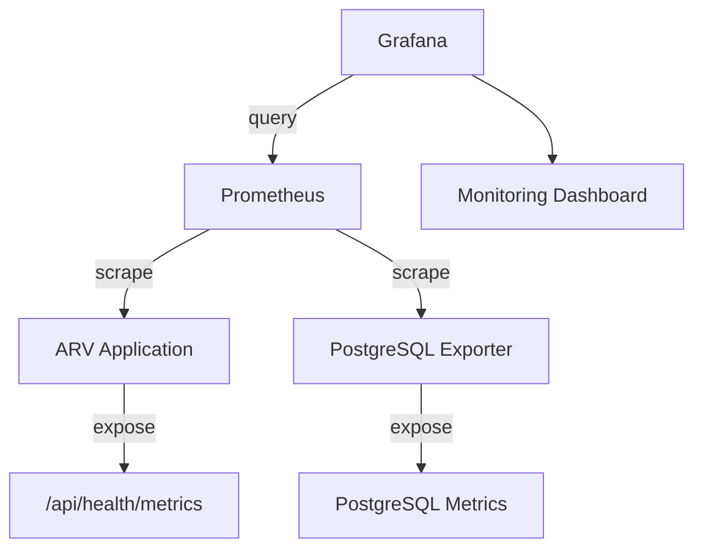
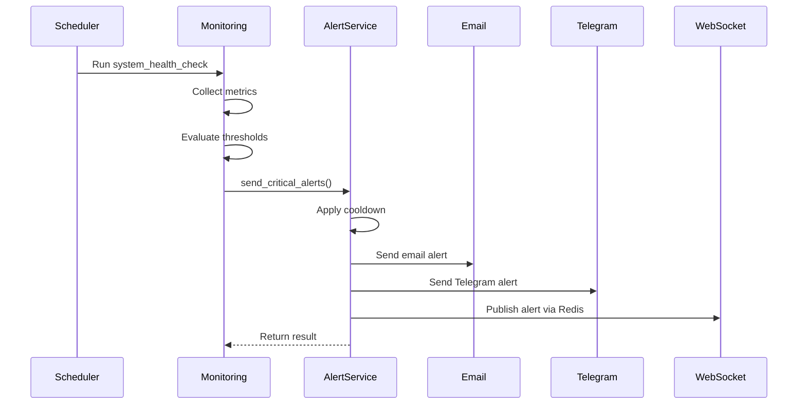

# System Monitoring Implementation

<cite>
**Referenced Files in This Document**   
- [main.py](file://app/main.py)
- [config.py](file://app/core/config.py)
- [health.py](file://app/api/routes/health.py)
- [Dockerfile](file://Dockerfile)
- [celery_app.py](file://app/tasks/celery_app.py)
- [monitoring.py](file://app/tasks/monitoring.py)
- [alert_service.py](file://app/services/alert_service.py)
- [alerts_ws.py](file://app/api/routes/alerts_ws.py)
- [prometheus.yml](file://prometheus/prometheus.yml)
- [docker-compose.yml](file://docker-compose.yml)
</cite>

## Table of Contents
1. [Introduction](#introduction)
2. [Health Check Endpoints](#health-check-endpoints)
3. [Structured Logging Implementation](#structured-logging-implementation)
4. [Request Logging Middleware](#request-logging-middleware)
5. [Exception Handling Strategy](#exception-handling-strategy)
6. [Monitoring Configuration](#monitoring-configuration)
7. [Integration with External Monitoring Systems](#integration-with-external-monitoring-systems)
8. [Alerting and Notification System](#alerting-and-notification-system)
9. [Best Practices for Log Analysis and Troubleshooting](#best-practices-for-log-analysis-and-troubleshooting)
10. [Conclusion](#conclusion)

## Introduction
The ARV platform implements a comprehensive monitoring system designed to ensure high availability, performance, and reliability. This documentation details the monitoring implementation, covering health checks, structured logging, request monitoring, exception handling, and integration with external monitoring tools. The system is designed to work seamlessly with container orchestration platforms and load balancers, providing real-time insights into application health and performance.

## Health Check Endpoints

The ARV platform provides health check endpoints that serve as critical integration points for container orchestration and load balancing systems. The primary health check endpoint is implemented at `/api/health/status`, which provides a comprehensive assessment of the system's health.

The health check endpoint performs multiple system validations, including database connectivity, Redis availability, Celery worker status, and system resource monitoring (CPU, memory, disk usage). Based on these checks, the endpoint returns an overall health status that can be one of three states: "healthy", "degraded", or "critical". This status is determined by the number of unhealthy components detected during the check.

**Diagram sources**
- [health.py](file://app/api/routes/health.py#L36-L119)

**Section sources**
- [health.py](file://app/api/routes/health.py#L36-L119)
- [Dockerfile](file://Dockerfile#L47-L49)

## Structured Logging Implementation

The ARV platform implements structured logging using structlog, which provides consistent, machine-readable log output that can be easily parsed and analyzed by monitoring systems. The logging configuration adapts based on the environment, using different output formats for development and production.

In development environments (when DEBUG is enabled), the system uses a human-readable console renderer that provides colorful, formatted output suitable for local debugging. In production environments, the system switches to JSON output format, which is optimized for log aggregation and analysis tools.

The logging configuration includes several key processors:
- Context variable merging to include request-scoped data
- Log level addition for filtering and alerting
- Stack trace information for error debugging
- Exception information capture
- ISO-formatted timestamping in UTC

**Diagram sources**
- [main.py](file://app/main.py#L19-L37)
- [config.py](file://app/core/config.py#L18-L20)

**Section sources**
- [main.py](file://app/main.py#L19-L37)
- [config.py](file://app/core/config.py#L18-L20)

## Request Logging Middleware

The ARV platform implements a comprehensive request logging middleware that captures detailed information about each HTTP request and response. This middleware is registered in the FastAPI application and executes for every incoming request.

The middleware captures key request attributes including HTTP method, path, client host, status code, and request duration. It also integrates with Prometheus to collect request duration metrics, which are exposed through the metrics endpoint for monitoring and alerting.

The request logging follows a two-phase approach:
1. At the beginning of the request, it logs the incoming request details
2. After the response is generated, it logs the completion details including status code and duration

This approach provides complete visibility into request processing and enables detailed performance analysis.

**Diagram sources**
- [main.py](file://app/main.py#L108-L141)

**Section sources**
- [main.py](file://app/main.py#L108-L141)

## Exception Handling Strategy

The ARV platform implements a comprehensive exception handling strategy that ensures consistent error responses and proper logging for all types of exceptions. The system uses FastAPI's exception handler mechanism to intercept and process different categories of exceptions.

Three main exception handlers are implemented:
1. HTTP exceptions (StarletteHTTPException): For standard HTTP error responses
2. Request validation errors (RequestValidationError): For input validation failures
3. General exceptions: For unhandled errors and unexpected conditions

Each exception handler follows a consistent pattern:
- Log the exception with structured data appropriate to the error type
- Return a standardized JSON error response
- Include relevant context information in both logs and responses

The general exception handler includes special handling for debug mode, where detailed error information is included in the response to aid development, while production responses provide only generic error messages to prevent information disclosure.

**Diagram sources**
- [main.py](file://app/main.py#L144-L209)

**Section sources**
- [main.py](file://app/main.py#L144-L209)

## Monitoring Configuration

The monitoring system is configured through environment variables and configuration files that control various aspects of the monitoring behavior. The primary configuration is managed through the Settings class in config.py, which provides typed configuration with validation.

Key monitoring configuration options include:
- LOG_LEVEL: Controls the verbosity of log output (INFO, WARNING, ERROR, DEBUG)
- DEBUG: Enables debug mode, which affects logging format and error response details
- SENTRY_DSN: Configures integration with Sentry for error tracking
- PROMETHEUS_MULTIPROC_DIR: Specifies the directory for Prometheus multiprocess metrics collection

The configuration system uses Pydantic settings with environment variable support, allowing for flexible configuration across different deployment environments. The settings are cached using lru_cache to improve performance.

**Diagram sources**
- [config.py](file://app/core/config.py#L7-L134)

**Section sources**
- [config.py](file://app/core/config.py#L7-L134)

## Integration with External Monitoring Systems

The ARV platform is designed to integrate seamlessly with external monitoring systems including Prometheus, Grafana, and Sentry. These integrations provide comprehensive monitoring, visualization, and error tracking capabilities.

### Prometheus Integration
The platform exposes metrics through the `/api/health/metrics` endpoint, which is configured to work with Prometheus. The metrics collection is configured in the docker-compose.yml file, which defines a Prometheus service that scrapes metrics from both the application and PostgreSQL exporter.

The application metrics include request duration histograms, which are automatically collected by the request logging middleware. The system also supports multiprocess metrics collection through the PROMETHEUS_MULTIPROC_DIR configuration.

**Diagram sources**
- [docker-compose.yml](file://docker-compose.yml#L171-L195)
- [prometheus.yml](file://prometheus/prometheus.yml#L1-L14)
- [health.py](file://app/api/routes/health.py#L122-L138)

### Sentry Integration
The platform supports integration with Sentry for error tracking and performance monitoring. When SENTRY_DSN is configured in the environment, the application automatically reports unhandled exceptions and performance issues to Sentry.

The integration captures detailed context information including:
- Exception type and message
- Stack trace with source code context
- Request information (method, path, headers)
- User information (when available)
- Custom tags and breadcrumbs

This comprehensive error reporting enables rapid diagnosis and resolution of production issues.

**Section sources**
- [config.py](file://app/core/config.py#L102)
- [main.py](file://app/main.py#L190-L209)

## Alerting and Notification System

The ARV platform implements an automated alerting system that monitors key system metrics and sends notifications when critical thresholds are exceeded. The alerting system is implemented as Celery tasks that run on a schedule and evaluate system health.

The primary monitoring task, system_health_check, runs every 5 minutes and evaluates:
- API overall health status
- CPU usage (alert if ≥ 90%)
- Memory usage (alert if ≥ 90%)
- Celery queue length (alert if > 100 tasks)

When critical conditions are detected, the system generates alerts that are processed by the send_critical_alerts function. This function implements a cooldown mechanism to prevent alert flooding, with different cooldown periods for different severity levels:
- Critical alerts: 5 minutes cooldown
- Warning alerts: 15 minutes cooldown
- Informational alerts: 1 hour cooldown

Alerts are delivered through multiple channels:
- Email to administrators
- Telegram messages
- WebSocket broadcasts to connected clients
- Redis pub/sub for real-time alert distribution

**Diagram sources**
- [celery_app.py](file://app/tasks/celery_app.py#L50-L57)
- [monitoring.py](file://app/tasks/monitoring.py#L13-L91)
- [alert_service.py](file://app/services/alert_service.py#L46-L71)

**Section sources**
- [celery_app.py](file://app/tasks/celery_app.py#L50-L57)
- [monitoring.py](file://app/tasks/monitoring.py#L13-L91)
- [alert_service.py](file://app/services/alert_service.py#L1-L80)
- [alerts_ws.py](file://app/api/routes/alerts_ws.py#L1-L42)

## Best Practices for Log Analysis and Troubleshooting

### Log Analysis Guidelines
When analyzing logs from the ARV platform, follow these best practices:

1. **Use structured log queries**: Leverage the JSON format to filter logs by specific fields such as:
   - event: The log event name (e.g., "http_request_started")
   - level: The log level (info, warning, error)
   - method: HTTP method for request logs
   - path: Request path for filtering by endpoint
   - status_code: HTTP status code for error analysis

2. **Correlate related log entries**: Use timestamps and request context to trace the complete lifecycle of a request from start to finish.

3. **Monitor error patterns**: Look for recurring error messages or exceptions that may indicate systemic issues.

### Alerting Thresholds
The following alerting thresholds are recommended for production monitoring:

| Metric | Warning Threshold | Critical Threshold | Recovery Threshold |
|--------|------------------|-------------------|-------------------|
| CPU Usage | 75% | 90% | 70% |
| Memory Usage | 75% | 90% | 70% |
| Disk Usage | 80% | 90% | 75% |
| HTTP Error Rate | 1% of requests | 5% of requests | 0.5% of requests |
| Request Duration (p95) | 1s | 3s | 800ms |
| Celery Queue Length | 50 tasks | 100 tasks | 30 tasks |

### Troubleshooting Common Issues
When troubleshooting issues with the ARV platform, follow this systematic approach:

1. **Check health endpoint**: First, verify the overall system health by calling `/api/health/status` to identify any failing components.

2. **Review recent logs**: Examine logs from the past 15-30 minutes, focusing on error and warning messages.

3. **Analyze request patterns**: Look for unusual request patterns, such as spikes in traffic or increased error rates.

4. **Check external dependencies**: Verify the status of database, Redis, and other external services.

5. **Monitor resource usage**: Check CPU, memory, and disk usage to identify resource constraints.

6. **Trace specific requests**: For specific user issues, use request IDs or client information to trace the complete request flow.

**Section sources**
- [health.py](file://app/api/routes/health.py#L36-L119)
- [main.py](file://app/main.py#L108-L141)
- [monitoring.py](file://app/tasks/monitoring.py#L13-L91)

## Conclusion
The ARV platform's monitoring implementation provides comprehensive visibility into system health, performance, and errors. The combination of health checks, structured logging, request monitoring, and automated alerting creates a robust monitoring ecosystem that supports reliable operation in production environments.

Key strengths of the monitoring system include:
- Environment-adaptive logging that provides optimal output for both development and production
- Comprehensive health checks that integrate with container orchestration systems
- Detailed request monitoring with Prometheus integration
- Multi-channel alerting with cooldown to prevent notification fatigue
- Seamless integration with industry-standard monitoring tools

By following the best practices outlined in this documentation, operations teams can effectively monitor the ARV platform, quickly identify and resolve issues, and maintain high service availability.