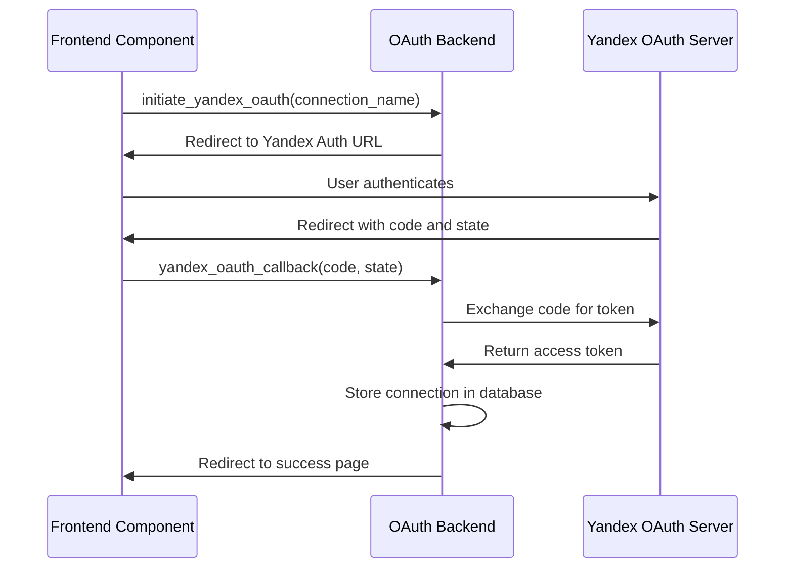
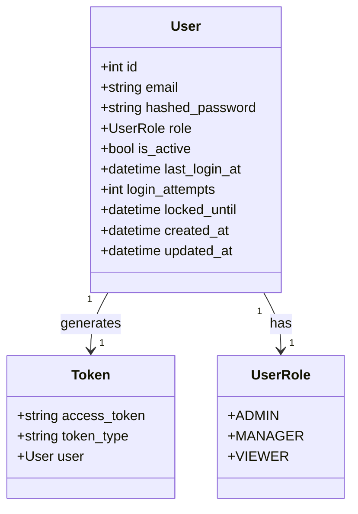
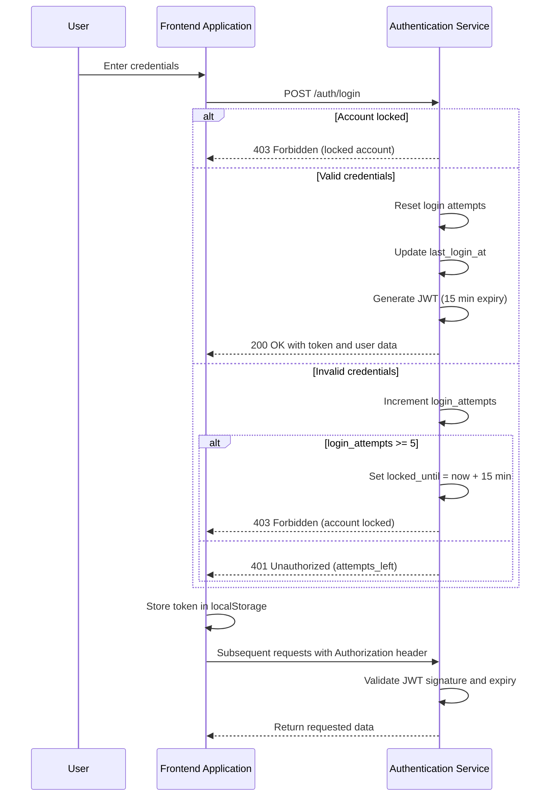
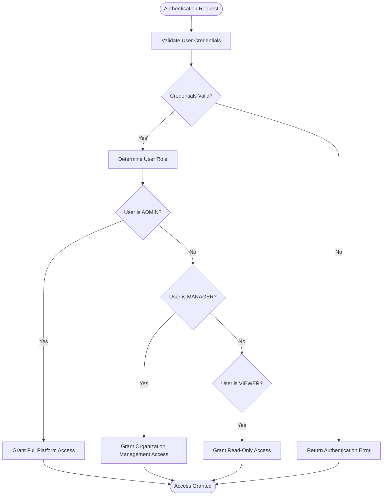
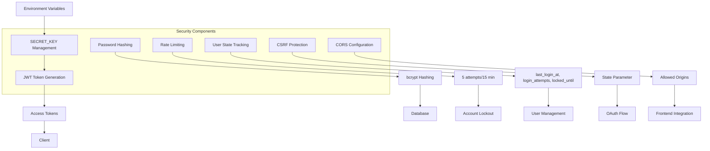
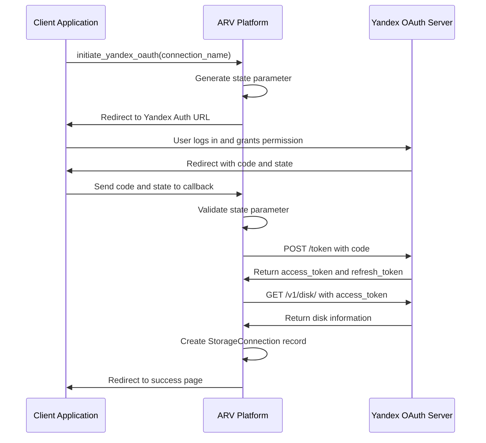
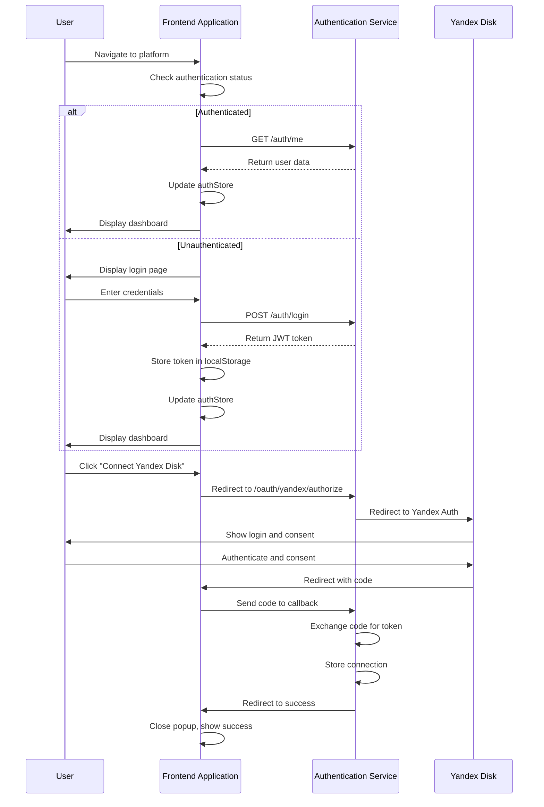

# Authentication & Authorization

<cite>
**Referenced Files in This Document**   
- [auth.py](file://app/api/routes/auth.py)
- [user.py](file://app/models/user.py)
- [security.py](file://app/core/security.py)
- [config.py](file://app/core/config.py)
- [authStore.ts](file://frontend/src/store/authStore.ts)
- [oauth.py](file://app/api/routes/oauth.py)
- [config.py](file://app/core/config.py)
- [storage.py](file://app/models/storage.py)
- [company.py](file://app/models/company.py)
- [main.py](file://app/main.py)
- [YandexDiskAuth.tsx](file://frontend/components/YandexDiskAuth.tsx)
- [YandexDiskFolderPicker.tsx](file://frontend/components/YandexDiskFolderPicker.tsx)
- [.env.example](file://.env.example)
- [PHASE1_SUMMARY.md](file://PHASE1_SUMMARY.md)
- [AUTH_SYSTEM_DOCUMENTATION.md](file://AUTH_SYSTEM_DOCUMENTATION.md)
</cite>

## Update Summary
**Changes Made**   
- Updated "Planned JWT Authentication System" section to reflect actual implementation details
- Added detailed information about rate limiting, session management, and user state tracking
- Updated security implementation details to reflect current token expiration and password hashing
- Added new section on JWT-based Authentication Flow
- Updated role-based access control section with actual roles (ADMIN, MANAGER, VIEWER)
- Added new diagram for JWT authentication flow
- Updated section sources and diagram sources throughout

## Table of Contents
1. [Introduction](#introduction)
2. [Current OAuth Implementation](#current-oauth-implementation)
3. [JWT-Based Authentication System](#jwt-based-authentication-system)
4. [Role-Based Access Control](#role-based-access-control)
5. [Security Implementation](#security-implementation)
6. [OAuth Flow for Yandex Disk Integration](#oauth-flow-for-yandex-disk-integration)
7. [Frontend Integration](#frontend-integration)
8. [System Evolution Plan](#system-evolution-plan)
9. [Conclusion](#conclusion)

## Introduction
The ARV platform has completed implementation of a comprehensive JWT-based authentication system for user management, replacing the previously planned system. This document details the current authentication architecture, security implementation, and role-based access control system.

The current implementation includes a fully functional JWT-based authentication system with login, logout, and user information endpoints, comprehensive rate limiting (5 attempts per 15-minute lockout period), user session management with 15-minute token expiration, password hashing with bcrypt, and user state tracking including last login time and failed attempt tracking. The system also implements role-based access control with ADMIN, MANAGER, and VIEWER roles.

**Section sources**
- [PHASE1_SUMMARY.md](file://PHASE1_SUMMARY.md#L136-L141)
- [AUTH_SYSTEM_DOCUMENTATION.md](file://AUTH_SYSTEM_DOCUMENTATION.md#L1-L613)

## Current OAuth Implementation

The ARV platform currently implements OAuth 2.0 integration with Yandex Disk for storage access. This implementation allows users to connect their Yandex Disk accounts to the platform, enabling the platform to access and manage files on their behalf.

The OAuth implementation is centered around the `oauth.py` module in the API routes, which handles the complete OAuth flow for Yandex Disk integration. The system uses a state parameter to protect against CSRF attacks during the authorization process. The state is generated using cryptographically secure random tokens and stored temporarily in memory.

**Diagram sources**
- [oauth.py](file://app/api/routes/oauth.py#L19-L106)

**Section sources**
- [oauth.py](file://app/api/routes/oauth.py#L1-L184)
- [config.py](file://app/core/config.py#L73-L76)

## JWT-Based Authentication System

The ARV platform has implemented a comprehensive JWT-based authentication system for user management. The system includes login, logout, and user information endpoints with comprehensive rate limiting (5 attempts per 15-minute lockout period).

The authentication system utilizes JWT (JSON Web Tokens) for stateless authentication, with tokens containing user information and permissions. The system is configured with a 15-minute expiration period for access tokens, as defined in the configuration settings. The JWT implementation uses the HS256 algorithm for token signing, with the secret key managed through environment variables.

The system implements rate limiting with a maximum of 5 login attempts within a 15-minute window. After 5 failed attempts, the account is locked for 15 minutes. The user model includes fields for tracking login attempts and lockout status. Passwords are hashed using bcrypt before storage in the database.

**Diagram sources**
- [user.py](file://app/models/user.py#L10-L27)
- [auth.py](file://app/api/routes/auth.py#L55-L164)
- [security.py](file://app/core/security.py#L19-L29)

**Section sources**
- [auth.py](file://app/api/routes/auth.py#L55-L164)
- [user.py](file://app/models/user.py#L10-L27)
- [security.py](file://app/core/security.py#L19-L29)
- [config.py](file://app/core/config.py#L50-L52)

### JWT-Based Authentication Flow

The JWT-based authentication flow in the ARV platform follows a standard pattern with additional security features for rate limiting and user state tracking.

**Diagram sources**
- [auth.py](file://app/api/routes/auth.py#L55-L164)
- [security.py](file://app/core/security.py#L19-L29)
- [authStore.ts](file://frontend/src/store/authStore.ts#L3-L9)

**Section sources**
- [auth.py](file://app/api/routes/auth.py#L55-L164)
- [security.py](file://app/core/security.py#L19-L29)
- [authStore.ts](file://frontend/src/store/authStore.ts#L3-L9)

## Role-Based Access Control

The ARV platform implements a role-based access control system with three distinct roles: ADMIN, MANAGER, and VIEWER. The system enforces access control at both the API route level and the data access layer.

The ADMIN role has full access to all platform features and can manage users, companies, and system settings. The MANAGER role has access to manage resources within their organization but cannot modify system-wide settings. The VIEWER role has read-only access to view resources but cannot make modifications.

The access control is implemented through dependency functions in the authentication system that verify user roles before granting access to protected endpoints. The user model includes a role field that determines the user's permissions within the system.

**Diagram sources**
- [user.py](file://app/models/user.py#L5-L9)
- [auth.py](file://app/api/routes/auth.py#L20-L47)

**Section sources**
- [user.py](file://app/models/user.py#L5-L9)
- [auth.py](file://app/api/routes/auth.py#L20-L47)

## Security Implementation

The ARV platform implements several security measures to protect user data and system integrity. The security implementation includes secret key management, token generation, session handling, rate limiting, and password hashing, with configurations designed to meet industry standards.

The system uses a SECRET_KEY environment variable for JWT token signing, with a recommendation to use a secure random key of at least 32 characters. This key should be changed from the default value in production environments. The JWT tokens are configured to expire after 15 minutes, enhancing security by limiting the window of opportunity for token misuse.

For password security, the system uses bcrypt hashing with the passlib library. Passwords are never stored in plain text and are hashed before being stored in the database. The authentication system includes comprehensive rate limiting with a maximum of 5 login attempts within a 15-minute window, after which the account is locked for 15 minutes.

The system tracks user state with fields for last login time, login attempts, and lockout status. Successful logins update the last_login_at field, while failed attempts increment the login_attempts counter. The locked_until field prevents authentication attempts during the lockout period.

**Diagram sources**
- [security.py](file://app/core/security.py#L1-L38)
- [auth.py](file://app/api/routes/auth.py#L16-L18)
- [user.py](file://app/models/user.py#L24-L27)
- [config.py](file://app/core/config.py#L50-L57)

**Section sources**
- [security.py](file://app/core/security.py#L1-L38)
- [auth.py](file://app/api/routes/auth.py#L16-L18)
- [user.py](file://app/models/user.py#L24-L27)
- [config.py](file://app/core/config.py#L50-L57)

## OAuth Flow for Yandex Disk Integration

The ARV platform implements a complete OAuth 2.0 flow for integrating with Yandex Disk, allowing users to connect their Yandex Disk accounts for storage purposes. The flow consists of two main endpoints: authorization initiation and callback handling.

The OAuth flow begins with the `initiate_yandex_oauth` endpoint, which generates a state parameter for CSRF protection and redirects the user to Yandex's authorization URL. The state parameter is stored in memory with the connection name and timestamp. After the user authenticates with Yandex, they are redirected back to the platform's callback endpoint with an authorization code and the state parameter.

The callback endpoint (`yandex_oauth_callback`) validates the state parameter, exchanges the authorization code for an access token and refresh token, retrieves information about the user's disk, and creates a storage connection record in the database. The connection record includes the OAuth tokens, refresh tokens, and metadata about the user's disk.

The system also provides additional endpoints for interacting with the connected Yandex Disk account, including listing folders and creating new folders. These endpoints validate the connection and use the stored OAuth token to make API calls to Yandex Disk.

**Diagram sources**
- [oauth.py](file://app/api/routes/oauth.py#L19-L106)

**Section sources**
- [oauth.py](file://app/api/routes/oauth.py#L19-L106)
- [config.py](file://app/core/config.py#L73-L76)

## Frontend Integration

The ARV platform includes frontend components that integrate with the authentication system, providing a seamless user experience for authentication and storage management. The frontend implementation uses React components to handle the authentication flow and user management.

The authentication system is integrated with the frontend through the `authStore.ts` store, which manages authentication state using Zustand with localStorage persistence. The store handles login, logout, and user information retrieval, maintaining the authentication state across page refreshes.

The login page provides a complete user interface for authentication with features including password visibility toggle, loading states, error handling with toast notifications, and a countdown timer for locked accounts. The sidebar displays the user's email and includes a logout button that clears the authentication state and redirects to the login page.

Protected routes use the `ProtectedRoute` component to check authentication status and redirect unauthenticated users to the login page. API requests include the JWT token in the Authorization header through an interceptor in the API service.

**Diagram sources**
- [authStore.ts](file://frontend/src/store/authStore.ts#L3-L9)
- [auth.py](file://app/api/routes/auth.py#L55-L164)
- [oauth.py](file://app/api/routes/oauth.py#L19-L106)

**Section sources**
- [authStore.ts](file://frontend/src/store/authStore.ts#L3-L9)
- [auth.py](file://app/api/routes/auth.py#L55-L164)
- [oauth.py](file://app/api/routes/oauth.py#L19-L106)

## System Evolution Plan

The ARV platform has completed the evolution of its authentication and authorization system, moving from a planned JWT implementation to a fully functional system with complete JWT-based authentication including login, logout, and user information endpoints with comprehensive rate limiting (5 attempts per 15-minute lockout period). The system now includes user session management with 15-minute token expiration, password hashing with bcrypt, and user state tracking including last login time and failed attempt tracking.

The implementation of role-based access control with ADMIN, MANAGER, and VIEWER roles has been completed, providing a robust permission model for different user types. The system maintains backward compatibility with the existing Yandex Disk integration while providing a comprehensive user management system.

Future enhancements may include:
1. Implementation of refresh tokens for longer user sessions
2. Addition of multi-factor authentication (MFA) support
3. Implementation of password reset functionality
4. Enhanced audit logging for security events
5. Integration with external identity providers
6. Session management interface for users to view and terminate active sessions

**Section sources**
- [PHASE1_SUMMARY.md](file://PHASE1_SUMMARY.md#L136-L140)
- [AUTH_SYSTEM_DOCUMENTATION.md](file://AUTH_SYSTEM_DOCUMENTATION.md#L1-L613)

## Conclusion
The ARV platform has successfully implemented a comprehensive JWT-based authentication system that provides secure user management with robust security features. The system includes rate limiting (5 attempts per 15-minute lockout period), user session management with 15-minute token expiration, password hashing with bcrypt, and user state tracking including last login time and failed attempt tracking.

The role-based access control system with ADMIN, MANAGER, and VIEWER roles enables fine-grained permission management for different user types. The security implementation includes proper secret key management, short-lived JWT tokens, bcrypt password hashing, and protection against brute force attacks through rate limiting.

The frontend components provide a seamless user experience for authentication and storage management, with a well-designed integration between the frontend and backend components. The system's architecture demonstrates a thoughtful approach to security and usability, with configurations that can be easily modified for different deployment environments.