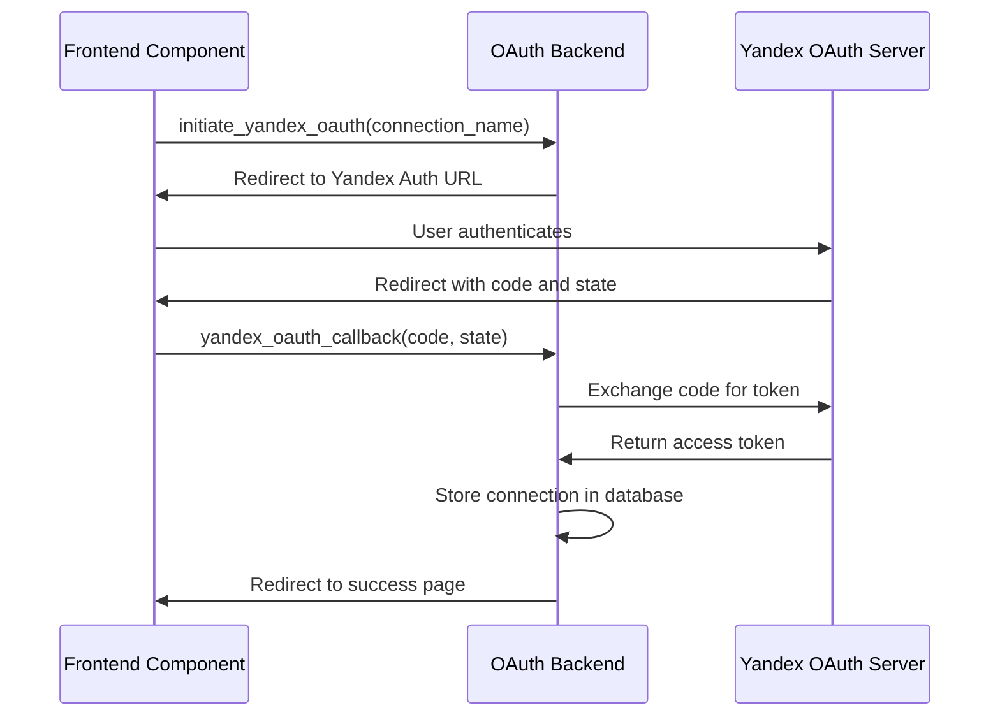
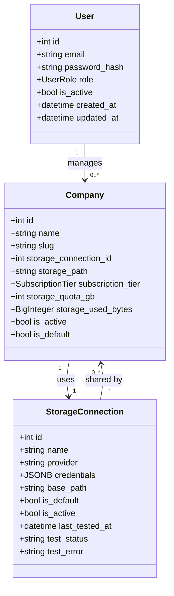
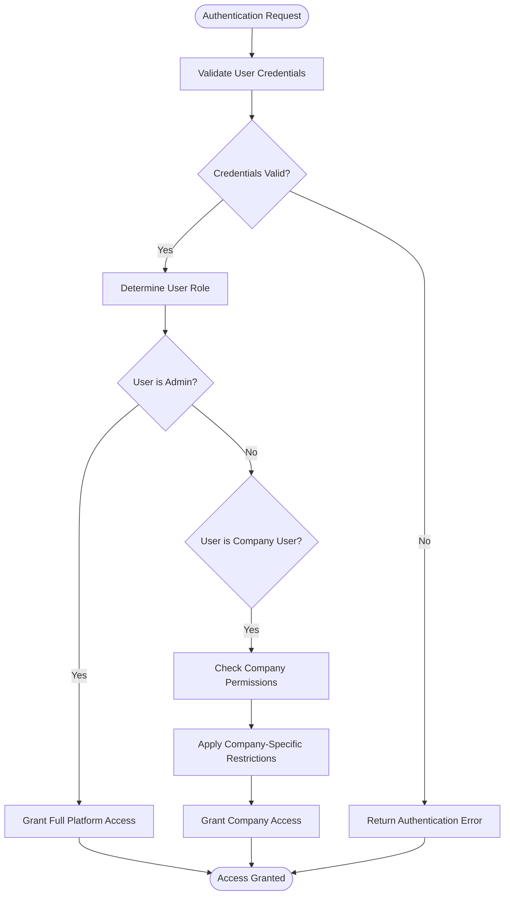
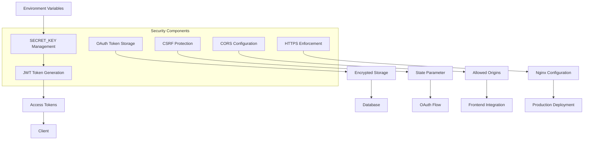
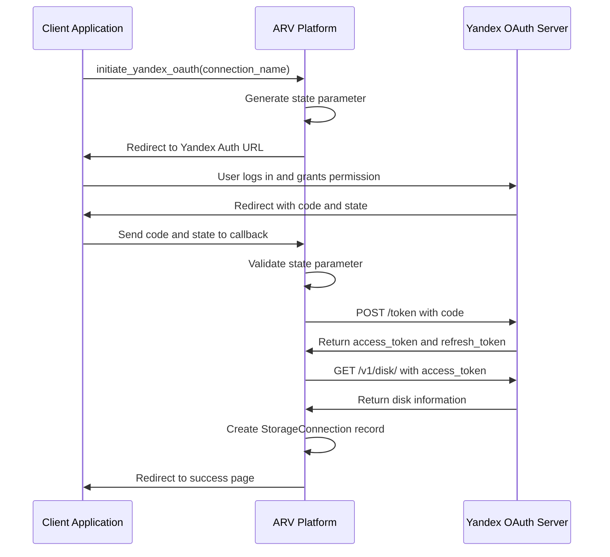
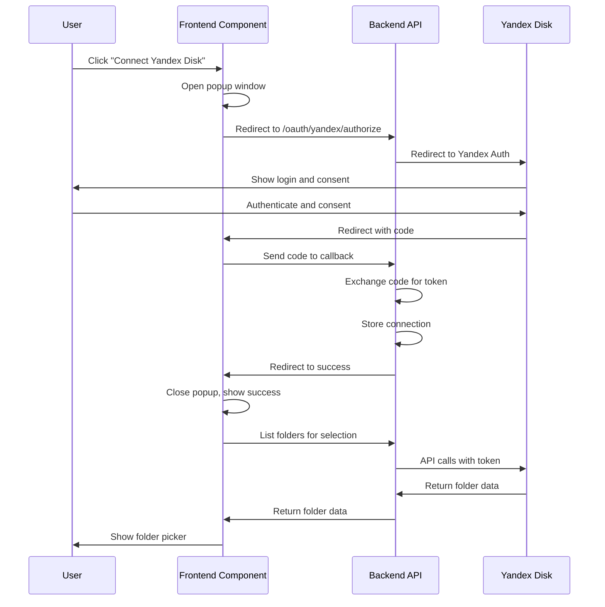

# Authentication & Authorization

<cite>
**Referenced Files in This Document**   
- [oauth.py](file://app/api/routes/oauth.py)
- [config.py](file://app/core/config.py)
- [storage.py](file://app/models/storage.py)
- [company.py](file://app/models/company.py)
- [main.py](file://app/main.py)
- [YandexDiskAuth.tsx](file://frontend/components/YandexDiskAuth.tsx)
- [YandexDiskFolderPicker.tsx](file://frontend/components/YandexDiskFolderPicker.tsx)
- [.env.example](file://.env.example)
- [PHASE1_SUMMARY.md](file://PHASE1_SUMMARY.md)
</cite>

## Table of Contents
1. [Introduction](#introduction)
2. [Current OAuth Implementation](#current-oauth-implementation)
3. [Planned JWT Authentication System](#planned-jwt-authentication-system)
4. [Role-Based Access Control](#role-based-access-control)
5. [Security Implementation](#security-implementation)
6. [OAuth Flow for Yandex Disk Integration](#oauth-flow-for-yandex-disk-integration)
7. [Frontend Integration](#frontend-integration)
8. [System Evolution Plan](#system-evolution-plan)
9. [Conclusion](#conclusion)

## Introduction
The ARV platform currently implements OAuth integration with Yandex Disk for storage access while planning a comprehensive JWT-based authentication system for user management. This document details the current authentication architecture, security implementation, and the planned evolution to a full user authentication system with role-based access control.

The current implementation focuses on OAuth 2.0 integration with Yandex Disk, allowing users to connect their Yandex Disk accounts for storage purposes. The system is designed with a clear roadmap for implementing JWT-based authentication that will support different user types (admin, company user) with appropriate permission levels.

**Section sources**
- [PHASE1_SUMMARY.md](file://PHASE1_SUMMARY.md#L136-L141)

## Current OAuth Implementation

The ARV platform currently implements OAuth 2.0 integration with Yandex Disk for storage access. This implementation allows users to connect their Yandex Disk accounts to the platform, enabling the platform to access and manage files on their behalf.

The OAuth implementation is centered around the `oauth.py` module in the API routes, which handles the complete OAuth flow for Yandex Disk integration. The system uses a state parameter to protect against CSRF attacks during the authorization process. The state is generated using cryptographically secure random tokens and stored temporarily in memory.

**Diagram sources**
- [oauth.py](file://app/api/routes/oauth.py#L19-L106)

**Section sources**
- [oauth.py](file://app/api/routes/oauth.py#L1-L184)
- [config.py](file://app/core/config.py#L73-L76)

## Planned JWT Authentication System

The ARV platform has a clear roadmap for implementing a comprehensive JWT-based authentication system for user management. According to the project documentation, Phase 2 of development will focus on JWT authentication implementation, user models, and company CRUD endpoints.

The planned authentication system will utilize JWT (JSON Web Tokens) for stateless authentication, with tokens containing user information and permissions. The system will be configured with a 24-hour expiration period for access tokens, as defined in the configuration settings. The JWT implementation will use the HS256 algorithm for token signing, with the secret key managed through environment variables.

**Diagram sources**
- [config.py](file://app/core/config.py#L50-L52)
- [company.py](file://app/models/company.py#L7-L41)
- [storage.py](file://app/models/storage.py#L8-L38)

**Section sources**
- [config.py](file://app/core/config.py#L50-L52)
- [PHASE1_SUMMARY.md](file://PHASE1_SUMMARY.md#L137-L138)

## Role-Based Access Control

The ARV platform is designed with a role-based access control system that will support different user types, specifically admin and company users. Although the full implementation is planned for Phase 2, the foundation for this system is evident in the existing codebase.

The system will implement a hierarchical permission model where admin users have full access to all platform features, while company users have access limited to their organization's resources and specific functionality. The access control will be enforced at both the API route level and the data access layer.

The company model already includes fields that will support the RBAC system, such as subscription tiers and storage quotas, which will determine the capabilities and limitations of each company. The planned user model will include a role field to distinguish between different user types and their associated permissions.

**Diagram sources**
- [company.py](file://app/models/company.py#L7-L41)
- [config.py](file://app/core/config.py#L91-L93)

**Section sources**
- [company.py](file://app/models/company.py#L7-L41)
- [PHASE1_SUMMARY.md](file://PHASE1_SUMMARY.md#L139-L140)

## Security Implementation

The ARV platform implements several security measures to protect user data and system integrity. The security implementation includes secret key management, token generation, and session handling, with configurations designed to meet industry standards.

The system uses a SECRET_KEY environment variable for JWT token signing, with a recommendation to use a secure random key of at least 32 characters. This key should be changed from the default value in production environments. The JWT tokens are configured to expire after 1440 minutes (24 hours), balancing security and user convenience.

For the OAuth implementation with Yandex Disk, the system stores OAuth tokens and refresh tokens in the database within the storage connection records. The credentials are stored as JSONB fields in the database, with the current implementation noting that encryption or use of a secret vault could be implemented for enhanced security.

The platform also implements CSRF protection for the OAuth flow using state parameters, and includes CORS configuration to control which origins can access the API. The system is designed with security headers and rate limiting through the Nginx reverse proxy configuration.

**Diagram sources**
- [config.py](file://app/core/config.py#L50-L57)
- [oauth.py](file://app/api/routes/oauth.py#L16-L17)
- [.env.example](file://.env.example#L11-L13)

**Section sources**
- [config.py](file://app/core/config.py#L50-L57)
- [oauth.py](file://app/api/routes/oauth.py#L16-L17)
- [.env.example](file://.env.example#L11-L13)

## OAuth Flow for Yandex Disk Integration

The ARV platform implements a complete OAuth 2.0 flow for integrating with Yandex Disk, allowing users to connect their Yandex Disk accounts for storage purposes. The flow consists of two main endpoints: authorization initiation and callback handling.

The OAuth flow begins with the `initiate_yandex_oauth` endpoint, which generates a state parameter for CSRF protection and redirects the user to Yandex's authorization URL. The state parameter is stored in memory with the connection name and timestamp. After the user authenticates with Yandex, they are redirected back to the platform's callback endpoint with an authorization code and the state parameter.

The callback endpoint (`yandex_oauth_callback`) validates the state parameter, exchanges the authorization code for an access token and refresh token, retrieves information about the user's disk, and creates a storage connection record in the database. The connection record includes the OAuth tokens, refresh tokens, and metadata about the user's disk.

The system also provides additional endpoints for interacting with the connected Yandex Disk account, including listing folders and creating new folders. These endpoints validate the connection and use the stored OAuth token to make API calls to Yandex Disk.

**Diagram sources**
- [oauth.py](file://app/api/routes/oauth.py#L19-L106)

**Section sources**
- [oauth.py](file://app/api/routes/oauth.py#L19-L106)
- [config.py](file://app/core/config.py#L73-L76)

## Frontend Integration

The ARV platform includes frontend components that integrate with the OAuth authentication system, providing a seamless user experience for connecting Yandex Disk accounts. The frontend implementation uses React components to handle the OAuth flow and storage management.

The `YandexDiskAuth` component provides a button that opens a popup window for the OAuth authorization process. It listens for messages from the popup window to detect when the authentication is complete and communicates the success back to the parent component. The component handles loading states and provides appropriate user feedback during the authentication process.

The `YandexDiskFolderPicker` component allows users to browse and select folders within their connected Yandex Disk account. It uses the storage connection ID to make API calls to list folders and create new folders. The component provides a user-friendly interface with breadcrumbs, folder listing, search functionality, and the ability to create new folders directly from the interface.

These frontend components work in conjunction with the backend OAuth implementation to provide a complete solution for connecting and managing Yandex Disk storage from within the ARV platform.

**Diagram sources**
- [YandexDiskAuth.tsx](file://frontend/components/YandexDiskAuth.tsx#L1-L77)
- [YandexDiskFolderPicker.tsx](file://frontend/components/YandexDiskFolderPicker.tsx#L1-L242)
- [oauth.py](file://app/api/routes/oauth.py#L108-L184)

**Section sources**
- [YandexDiskAuth.tsx](file://frontend/components/YandexDiskAuth.tsx#L1-L77)
- [YandexDiskFolderPicker.tsx](file://frontend/components/YandexDiskFolderPicker.tsx#L1-L242)

## System Evolution Plan

The ARV platform has a well-defined evolution plan for its authentication and authorization system, moving from the current OAuth implementation for Yandex Disk integration to a comprehensive user authentication system with JWT and role-based access control.

According to the project documentation, Phase 2 of development will focus on implementing JWT authentication, creating user models and schemas, and developing company CRUD endpoints. This evolution will transform the platform from a system that only handles storage integration to a full multi-tenant B2B SaaS platform with proper user management.

The transition will involve several key steps:
1. Implementing JWT-based authentication with token generation and validation
2. Creating user models with role-based permissions
3. Developing authentication endpoints for login, registration, and token refresh
4. Implementing middleware to protect API routes based on user roles
5. Migrating existing functionality to use the new authentication system
6. Adding user interface elements for authentication and user management

The system is designed to maintain backward compatibility during this transition, allowing the existing Yandex Disk integration to continue functioning while the new authentication system is implemented.

**Section sources**
- [PHASE1_SUMMARY.md](file://PHASE1_SUMMARY.md#L136-L140)

## Conclusion
The ARV platform currently implements a robust OAuth 2.0 integration with Yandex Disk for storage access, with a clear roadmap for evolving to a comprehensive JWT-based authentication system. The current implementation provides secure access to Yandex Disk accounts with proper CSRF protection and token management.

The planned evolution to JWT-based authentication will enable the platform to support multiple user types with role-based access control, transforming it into a full-featured B2B SaaS platform. The security implementation includes proper secret key management, token expiration, and protection against common vulnerabilities.

The frontend components provide a seamless user experience for connecting and managing Yandex Disk storage, with a well-designed integration between the frontend and backend components. As the platform evolves, these components will be enhanced to support the full user authentication workflow.

The system's architecture demonstrates a thoughtful approach to security and scalability, with configurations that can be easily modified for different deployment environments. The use of environment variables for sensitive configuration values and the planned implementation of proper secret management will ensure the platform remains secure in production environments.