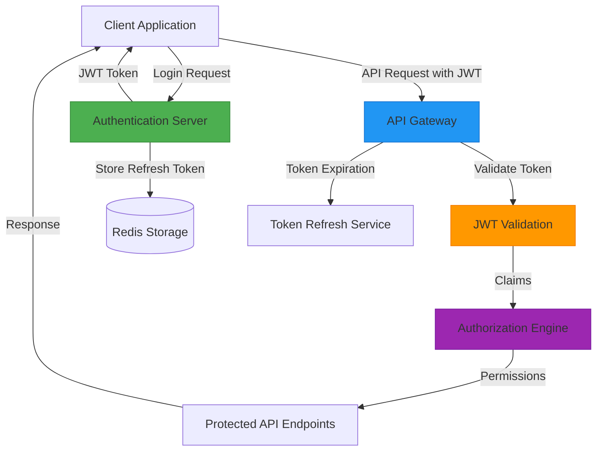
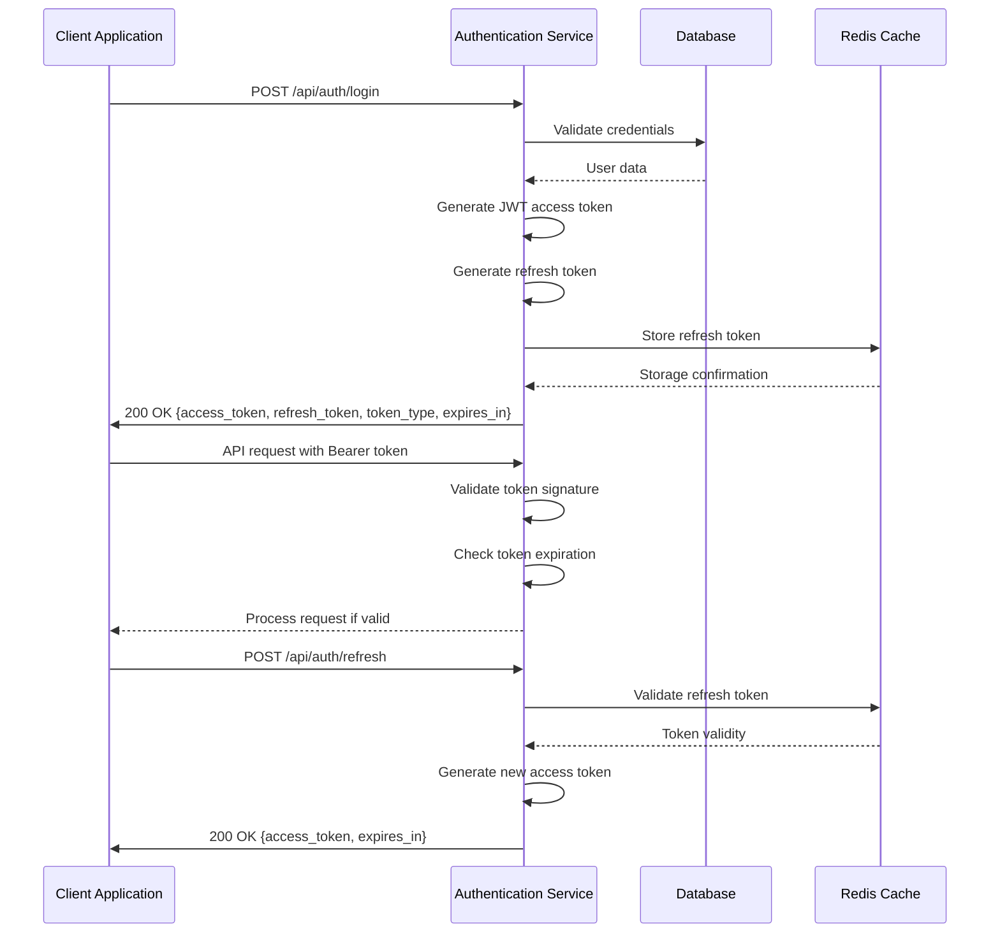
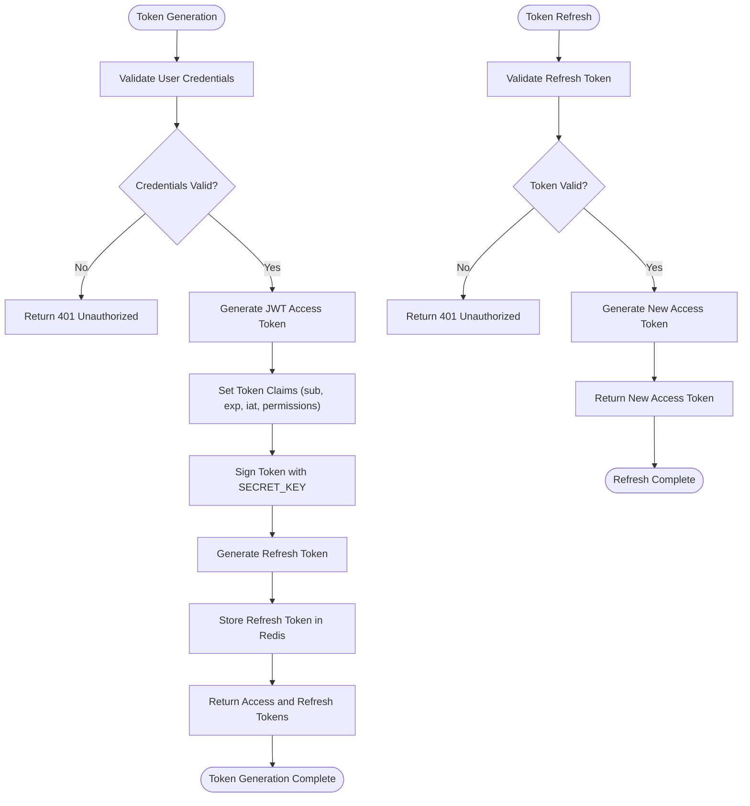
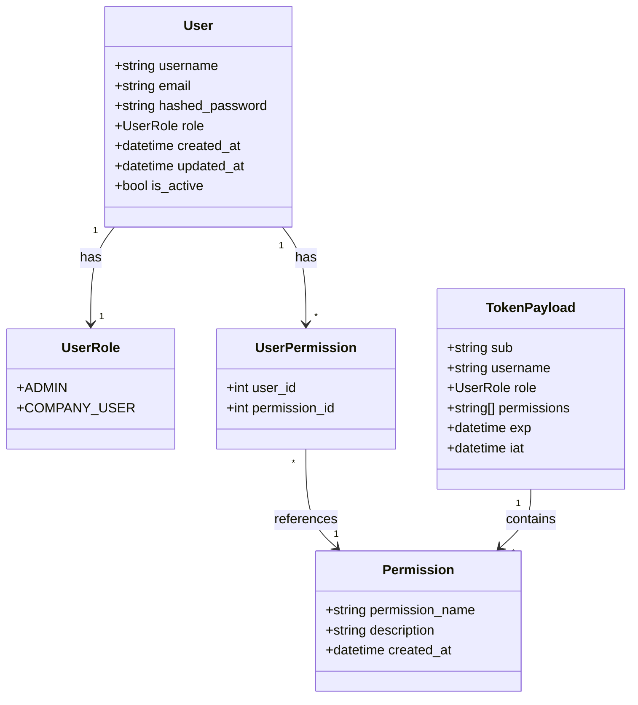
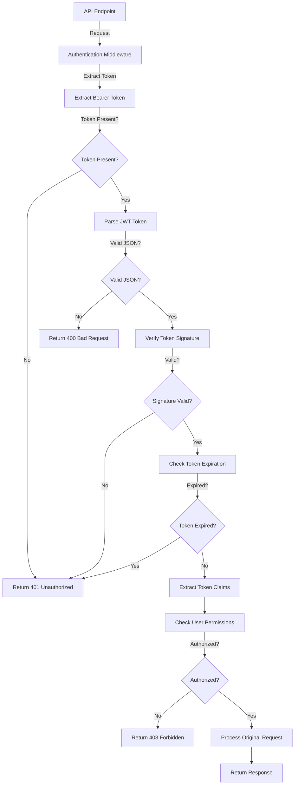
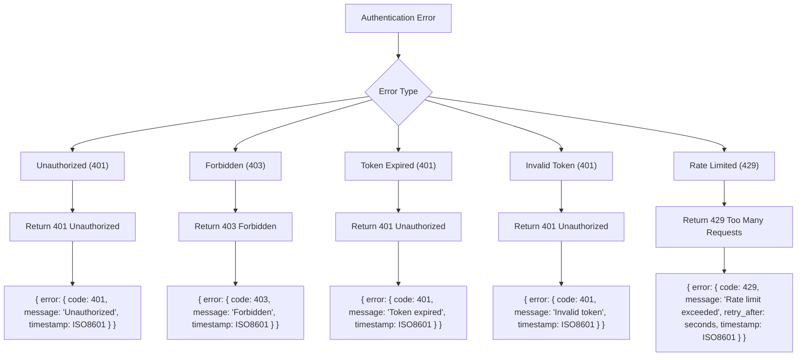

# JWT-Based User Authentication

<cite>
**Referenced Files in This Document**   
- [config.py](file://app/core/config.py)
- [oauth.py](file://app/api/routes/oauth.py)
- [company.py](file://app/models/company.py)
- [storage.py](file://app/models/storage.py)
</cite>

## Table of Contents
1. [Introduction](#introduction)
2. [Authentication Architecture](#authentication-architecture)
3. [JWT Configuration Parameters](#jwt-configuration-parameters)
4. [Authentication Flow](#authentication-flow)
5. [Token Management](#token-management)
6. [Role-Based Access Control](#role-based-access-control)
7. [Security Considerations](#security-considerations)
8. [API Endpoint Protection](#api-endpoint-protection)
9. [Error Handling](#error-handling)
10. [Implementation Guidelines](#implementation-guidelines)

## Introduction
The Vertex AR platform is designed to implement a JWT-based authentication system to secure API endpoints and manage user sessions. Although the authentication system has not yet been fully implemented in the codebase, the configuration parameters and existing infrastructure indicate a clear architectural direction. This document outlines the planned JWT-based authentication system, focusing on token generation, validation, refresh mechanisms, and role-based access control. The system will support different permission levels for admin and company users, with comprehensive security measures to protect against common vulnerabilities.

## Authentication Architecture

**Diagram sources**
- [config.py](file://app/core/config.py#L49-L53)
- [oauth.py](file://app/api/routes/oauth.py#L13-L184)

## JWT Configuration Parameters

The JWT authentication system will be configured through the Settings class in the core configuration module. The following parameters define the security characteristics of the JWT implementation:

| Parameter | Value | Description |
|---------|-------|-----------|
| SECRET_KEY | "change-this-to-a-secure-random-key-min-32-chars" | Cryptographic key used to sign JWT tokens (must be at least 32 characters) |
| ALGORITHM | "HS256" | Hashing algorithm used for token signing (HMAC with SHA-256) |
| ACCESS_TOKEN_EXPIRE_MINUTES | 1440 | Token expiration time in minutes (24 hours) |

**Section sources**
- [config.py](file://app/core/config.py#L49-L53)

## Authentication Flow

**Diagram sources**
- [config.py](file://app/core/config.py#L49-L53)
- [oauth.py](file://app/api/routes/oauth.py#L13-L184)

## Token Management

The JWT token management system will implement a comprehensive approach to token generation, validation, and refreshment. Access tokens will be short-lived (24 hours) to minimize security risks, while refresh tokens will enable seamless user experience without requiring frequent re-authentication.

**Diagram sources**
- [config.py](file://app/core/config.py#L49-L53)
- [oauth.py](file://app/api/routes/oauth.py#L13-L184)

## Role-Based Access Control

The authentication system will implement role-based access control (RBAC) with distinct permission levels for different user types. The system will support at least two primary roles: admin and company users, with different levels of access to platform features and data.

**Diagram sources**
- [config.py](file://app/core/config.py#L49-L53)
- [company.py](file://app/models/company.py#L1-L41)
- [storage.py](file://app/models/storage.py#L1-L81)

## Security Considerations

The JWT authentication system incorporates multiple security measures to protect against common vulnerabilities and ensure the integrity of user authentication.

```mermaid
flowchart TD
Security[Security Measures] --> SecretManagement["Secure Secret Key Management"]
Security --> TokenExpiration["Token Expiration Policies"]
Security --> HTTPS["HTTPS Enforcement"]
Security --> CSRF["CSRF Protection"]
Security --> RateLimiting["Rate Limiting"]
Security --> TokenRevocation["Token Revocation Mechanism"]
Security --> AuditLogging["Audit Logging"]
SecretManagement --> RotateKeys["Regular Secret Key Rotation"]
SecretManagement --> Environment["Store in Environment Variables"]
SecretManagement --> Vault["Consider Secret Management Vault"]
TokenExpiration --> ShortLived["Short Access Token Duration"]
TokenExpiration --> RefreshTokens["Refresh Token Mechanism"]
TokenExpiration --> ExpirationValidation["Validate exp Claim"]
HTTPS --> TLS["Enforce TLS 1.2+"]
HTTPS --> HSTS["Implement HSTS Headers"]
CSRF --> StateParameter["Use State Parameter in OAuth"]
CSRF --> SameSite["Set SameSite Cookie Attribute"]
RateLimiting --> API["Limit API Authentication Requests"]
RateLimiting --> BruteForce["Prevent Brute Force Attacks"]
TokenRevocation --> Blacklist["Token Blacklist/Whitelist"]
TokenRevocation --> RedisStorage["Store Token Status in Redis"]
AuditLogging --> LoginAttempts["Log Successful/Failed Logins"]
AuditLogging --> TokenUsage["Log Token Generation/Refresh"]
```

**Diagram sources**
- [config.py](file://app/core/config.py#L49-L53)
- [oauth.py](file://app/api/routes/oauth.py#L13-L184)

## API Endpoint Protection

The JWT authentication system will protect API endpoints by requiring valid tokens for access. Different endpoints will have varying permission requirements based on the user's role and assigned permissions.

**Diagram sources**
- [config.py](file://app/core/config.py#L49-L53)
- [oauth.py](file://app/api/routes/oauth.py#L13-L184)

## Error Handling

The authentication system will implement standardized error responses for unauthorized access and other authentication-related issues.

**Section sources**
- [config.py](file://app/core/config.py#L49-L53)
- [oauth.py](file://app/api/routes/oauth.py#L13-L184)

## Implementation Guidelines

When implementing authentication dependencies in FastAPI routes, follow these guidelines to ensure consistent and secure authentication across the platform:

1. **Dependency Injection**: Use FastAPI's Depends() function to inject authentication dependencies
2. **Token Validation**: Implement a reusable token validation function that can be applied across multiple routes
3. **Role-Based Decorators**: Create decorators for different permission levels (e.g., @admin_required, @company_user_required)
4. **Error Consistency**: Use standardized error responses for authentication failures
5. **Security Headers**: Ensure proper security headers are set for authentication endpoints
6. **Rate Limiting**: Apply rate limiting to authentication endpoints to prevent brute force attacks
7. **Logging**: Implement comprehensive logging for authentication events (success and failure)

The implementation should leverage the existing configuration parameters in the Settings class, particularly SECRET_KEY, ALGORITHM, and ACCESS_TOKEN_EXPIRE_MINUTES, to maintain consistency across the application.

**Section sources**
- [config.py](file://app/core/config.py#L49-L53)
- [oauth.py](file://app/api/routes/oauth.py#L13-L184)