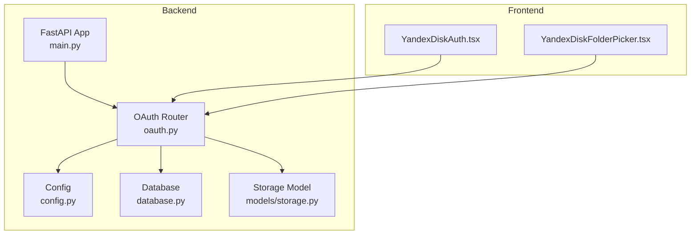
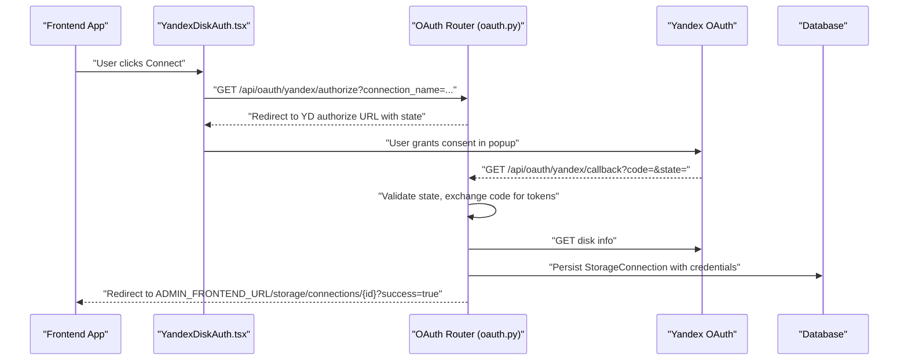
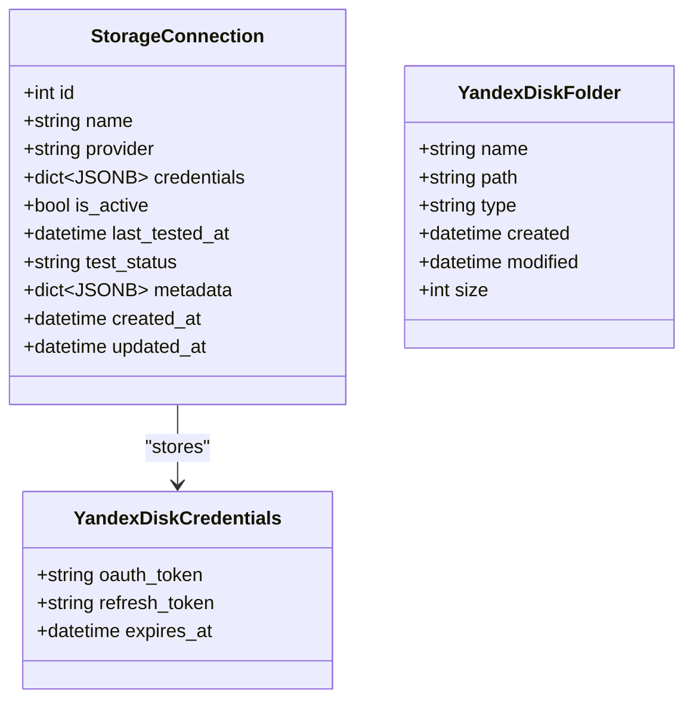
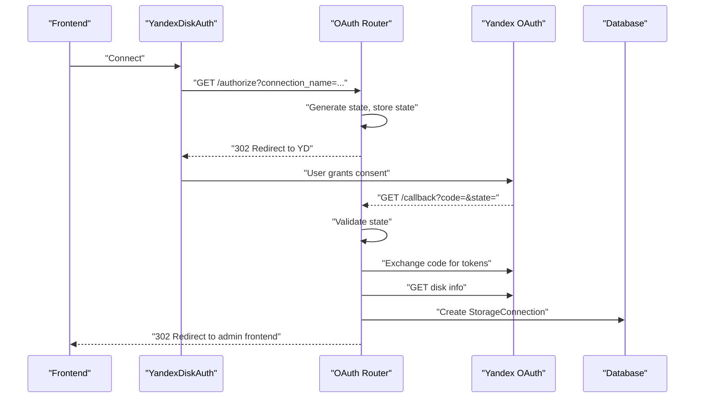
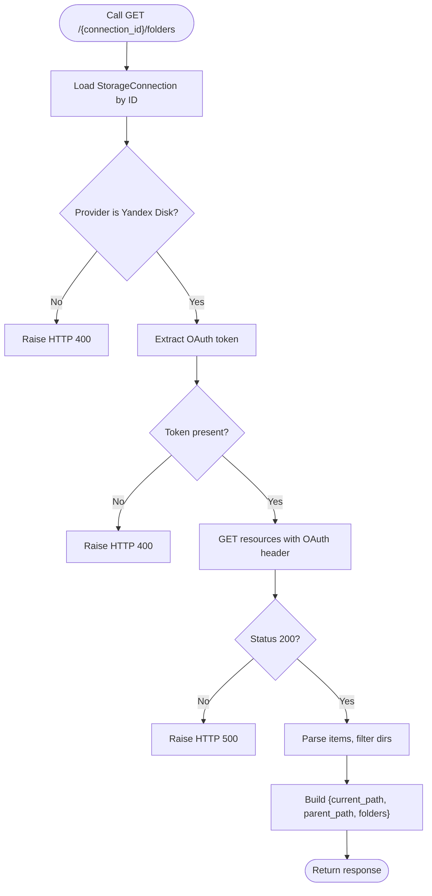
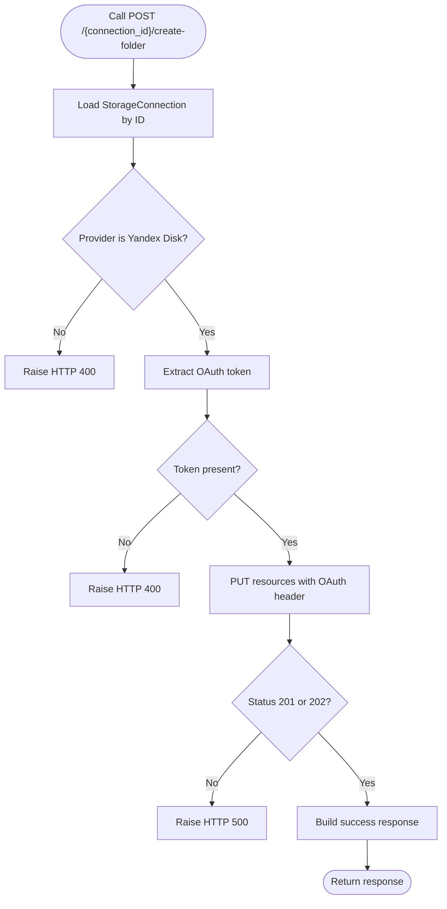
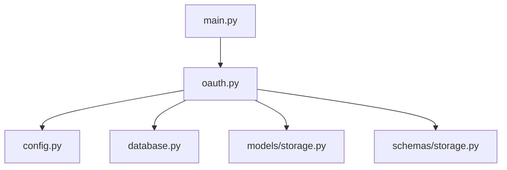

# OAuth Integration with Yandex Disk

<cite>
**Referenced Files in This Document**
- [oauth.py](file://app/api/routes/oauth.py)
- [YandexDiskAuth.tsx](file://frontend/components/YandexDiskAuth.tsx)
- [YandexDiskFolderPicker.tsx](file://frontend/components/YandexDiskFolderPicker.tsx)
- [storage.py](file://app/models/storage.py)
- [storage.py (schema)](file://app/schemas/storage.py)
- [config.py](file://app/core/config.py)
- [database.py](file://app/core/database.py)
- [.env.example](file://.env.example)
- [main.py](file://app/main.py)
</cite>

## Table of Contents
1. [Introduction](#introduction)
2. [Project Structure](#project-structure)
3. [Core Components](#core-components)
4. [Architecture Overview](#architecture-overview)
5. [Detailed Component Analysis](#detailed-component-analysis)
6. [Dependency Analysis](#dependency-analysis)
7. [Performance Considerations](#performance-considerations)
8. [Troubleshooting Guide](#troubleshooting-guide)
9. [Conclusion](#conclusion)
10. [Appendices](#appendices)

## Introduction
This document provides comprehensive API documentation for the OAuth integration with Yandex Disk. It covers the complete authentication flow, including initiating OAuth via a dedicated endpoint, exchanging the authorization code for tokens, storing connection details, and enabling folder listing and creation through the Yandex Disk API. It also documents security measures (CSRF protection via state tokens), frontend integration patterns using popup-based authentication and secure message passing, and operational considerations such as error handling, rate limiting, and token refresh.

## Project Structure
The OAuth integration spans backend API routes, frontend components, configuration, and persistence models. The backend exposes endpoints under a dedicated router, while the frontend provides reusable components for authentication and folder selection.

**Diagram sources**
- [main.py](file://app/main.py#L230-L260)
- [oauth.py](file://app/api/routes/oauth.py#L1-L40)
- [config.py](file://app/core/config.py#L62-L102)
- [database.py](file://app/core/database.py#L1-L46)
- [storage.py](file://app/models/storage.py#L8-L34)
- [YandexDiskAuth.tsx](file://frontend/components/YandexDiskAuth.tsx#L1-L77)
- [YandexDiskFolderPicker.tsx](file://frontend/components/YandexDiskFolderPicker.tsx#L1-L242)

**Section sources**
- [main.py](file://app/main.py#L230-L260)
- [oauth.py](file://app/api/routes/oauth.py#L1-L40)
- [config.py](file://app/core/config.py#L62-L102)
- [database.py](file://app/core/database.py#L1-L46)
- [storage.py](file://app/models/storage.py#L8-L34)
- [YandexDiskAuth.tsx](file://frontend/components/YandexDiskAuth.tsx#L1-L77)
- [YandexDiskFolderPicker.tsx](file://frontend/components/YandexDiskFolderPicker.tsx#L1-L242)

## Core Components
- Backend OAuth Router: Implements the authorization initiation, callback handling, and resource operations against Yandex Disk.
- Frontend Components: Provide a popup-based OAuth flow and a folder picker UI.
- Configuration: Holds OAuth client credentials, redirect URI, and admin frontend URL.
- Persistence: Stores Yandex Disk connection credentials and metadata.

Key responsibilities:
- Authorization initiation with state parameter and redirect to Yandex.
- Callback exchange of authorization code for tokens and disk metadata retrieval.
- Storage connection creation with credentials and metadata.
- Listing and creating folders via Yandex Disk API using stored OAuth tokens.

**Section sources**
- [oauth.py](file://app/api/routes/oauth.py#L1-L184)
- [YandexDiskAuth.tsx](file://frontend/components/YandexDiskAuth.tsx#L1-L77)
- [YandexDiskFolderPicker.tsx](file://frontend/components/YandexDiskFolderPicker.tsx#L1-L242)
- [config.py](file://app/core/config.py#L62-L102)
- [storage.py](file://app/models/storage.py#L8-L34)

## Architecture Overview
The OAuth flow is a browser-based popup flow. The frontend opens a popup to the backend’s authorization endpoint, which redirects to Yandex with a state parameter. On successful consent, Yandex redirects back to the backend callback endpoint, which exchanges the code for tokens, persists the connection, and redirects back to the admin frontend.

**Diagram sources**
- [oauth.py](file://app/api/routes/oauth.py#L19-L106)
- [YandexDiskAuth.tsx](file://frontend/components/YandexDiskAuth.tsx#L1-L77)
- [config.py](file://app/core/config.py#L62-L102)

## Detailed Component Analysis

### Backend OAuth Router
Implements:
- Authorization initiation: Generates a state token, stores it temporarily, and redirects to Yandex with client credentials and redirect URI.
- Callback handling: Validates state, exchanges authorization code for tokens, retrieves disk metadata, persists connection, and redirects back to the admin frontend.
- Folder listing: Retrieves folders from Yandex Disk resources API using stored OAuth tokens.
- Folder creation: Creates a new folder via Yandex Disk resources API.

Security:
- CSRF protection via state parameter stored in memory (note: production should use Redis).

Operational notes:
- Uses asynchronous HTTP client for external API calls.
- Persists connection with credentials and metadata.
- Redirects to admin frontend with success indicator.

**Section sources**
- [oauth.py](file://app/api/routes/oauth.py#L19-L184)

#### Authorization Initiation Endpoint
- Method: GET
- Path: /api/oauth/yandex/authorize
- Query parameters:
  - connection_name: string (required)
- Behavior:
  - Generates a random state token.
  - Stores state with connection_name and timestamp.
  - Builds Yandex authorization URL with client_id, redirect_uri, and state.
  - Returns a redirect response to Yandex.

Request/response schema:
- Request: Query parameters only.
- Response: 302 Redirect to Yandex authorization URL.

Security:
- State parameter prevents CSRF attacks by binding the user session to the authorization request.

**Section sources**
- [oauth.py](file://app/api/routes/oauth.py#L19-L40)
- [config.py](file://app/core/config.py#L62-L102)

#### Callback Endpoint
- Method: GET
- Path: /api/oauth/yandex/callback
- Query parameters:
  - code: string (required)
  - state: string (required)
- Behavior:
  - Validates state against stored state.
  - Exchanges authorization code for access and refresh tokens.
  - Retrieves disk metadata.
  - Creates a StorageConnection record with credentials and metadata.
  - Redirects to ADMIN_FRONTEND_URL with success flag.

Request/response schema:
- Request: Query parameters only.
- Response: 302 Redirect to admin frontend.

Error handling:
- Invalid state raises HTTP 400.
- Token exchange failures raise HTTP 500.
- Disk info retrieval failures raise HTTP 500.

**Section sources**
- [oauth.py](file://app/api/routes/oauth.py#L41-L106)
- [config.py](file://app/core/config.py#L90-L102)
- [storage.py](file://app/models/storage.py#L8-L34)

#### Folder Listing Endpoint
- Method: GET
- Path: /api/oauth/yandex/{connection_id}/folders
- Path parameters:
  - connection_id: integer (required)
- Query parameters:
  - path: string (default "/")
- Behavior:
  - Loads connection by ID.
  - Validates provider is Yandex Disk.
  - Uses stored OAuth token to call Yandex Disk resources API.
  - Filters items to directories and returns current path, parent path, and folders.

Request/response schema:
- Request: path parameter.
- Response: JSON object with current_path, parent_path, and folders array.

Error handling:
- Not found or wrong provider raises HTTP 404/400.
- Missing token raises HTTP 400.
- External API failures raise HTTP 500.

**Section sources**
- [oauth.py](file://app/api/routes/oauth.py#L108-L153)

#### Folder Creation Endpoint
- Method: POST
- Path: /api/oauth/yandex/{connection_id}/create-folder
- Path parameters:
  - connection_id: integer (required)
- Query parameters:
  - folder_path: string (required)
- Behavior:
  - Loads connection by ID.
  - Validates provider is Yandex Disk.
  - Uses stored OAuth token to call Yandex Disk resources API to create a folder.
  - Returns success status and path.

Request/response schema:
- Request: folder_path query parameter.
- Response: JSON object with status, message, and path.

Error handling:
- Not found or wrong provider raises HTTP 404/400.
- Missing token raises HTTP 400.
- External API failures raise HTTP 500.

**Section sources**
- [oauth.py](file://app/api/routes/oauth.py#L154-L184)

### Frontend Components

#### YandexDiskAuth
- Purpose: Initiates OAuth in a popup window and listens for a postMessage event containing the success payload.
- Behavior:
  - Opens a popup to the backend authorization endpoint with connection_name.
  - Polls popup state and closes it upon completion.
  - Listens for message of type "YANDEX_OAUTH_SUCCESS" with connectionId.
  - Invokes onSuccess with the connectionId.

Integration notes:
- Uses window.postMessage to communicate between popup and opener.
- Requires admin frontend to listen for the message and handle redirection.

**Section sources**
- [YandexDiskAuth.tsx](file://frontend/components/YandexDiskAuth.tsx#L1-L77)

#### YandexDiskFolderPicker
- Purpose: Lists folders from Yandex Disk and allows creating new folders.
- Behavior:
  - Loads folders via GET /api/oauth/yandex/{connection_id}/folders.
  - Supports navigation up/down the folder tree and home.
  - Creates folders via POST /api/oauth/yandex/{connection_id}/create-folder.
  - Provides search and breadcrumb navigation.

UI/UX considerations:
- Loading indicators during network requests.
- Disabled actions when invalid inputs are present.
- Clear feedback on errors.

**Section sources**
- [YandexDiskFolderPicker.tsx](file://frontend/components/YandexDiskFolderPicker.tsx#L1-L242)

### Data Models and Schemas
- StorageConnection model:
  - Fields include name, provider, credentials (JSONB), is_active, test_status, metadata, timestamps.
  - Used to persist OAuth credentials and metadata for Yandex Disk.

- Pydantic schemas:
  - YandexDiskCredentials defines the shape of OAuth credentials stored in credentials.
  - YandexDiskFolder defines the shape of folder items returned by the listing endpoint.

**Section sources**
- [storage.py](file://app/models/storage.py#L8-L34)
- [storage.py (schema)](file://app/schemas/storage.py#L1-L101)

## Architecture Overview

**Diagram sources**
- [storage.py](file://app/models/storage.py#L8-L34)
- [storage.py (schema)](file://app/schemas/storage.py#L1-L101)

## Detailed Component Analysis

### Authentication Flow Sequence

**Diagram sources**
- [oauth.py](file://app/api/routes/oauth.py#L19-L106)
- [YandexDiskAuth.tsx](file://frontend/components/YandexDiskAuth.tsx#L1-L77)
- [config.py](file://app/core/config.py#L62-L102)

### Folder Listing Flow

**Diagram sources**
- [oauth.py](file://app/api/routes/oauth.py#L108-L153)

### Folder Creation Flow

**Diagram sources**
- [oauth.py](file://app/api/routes/oauth.py#L154-L184)

## Dependency Analysis
- Router registration: The OAuth router is included in the main application and mounted under /api/oauth/yandex.
- Configuration: OAuth client credentials and redirect URI are loaded from settings.
- Database: The router depends on an async database session factory for persistence.
- Models/Schemas: StorageConnection model and YandexDiskCredentials schema define persisted data shapes.

**Diagram sources**
- [main.py](file://app/main.py#L230-L260)
- [oauth.py](file://app/api/routes/oauth.py#L1-L40)
- [config.py](file://app/core/config.py#L62-L102)
- [database.py](file://app/core/database.py#L1-L46)
- [storage.py](file://app/models/storage.py#L8-L34)
- [storage.py (schema)](file://app/schemas/storage.py#L1-L101)

**Section sources**
- [main.py](file://app/main.py#L230-L260)
- [oauth.py](file://app/api/routes/oauth.py#L1-L40)
- [config.py](file://app/core/config.py#L62-L102)
- [database.py](file://app/core/database.py#L1-L46)
- [storage.py](file://app/models/storage.py#L8-L34)
- [storage.py (schema)](file://app/schemas/storage.py#L1-L101)

## Performance Considerations
- External API latency: Calls to Yandex OAuth and Cloud API introduce network latency. Consider adding timeouts and retries where appropriate.
- Concurrency: The router uses an async HTTP client; ensure proper timeout configuration to avoid long-running requests.
- Rate limiting: Yandex APIs may enforce rate limits. Implement client-side backoff and retry logic in the future if needed.
- Database throughput: Persisting connections is lightweight; ensure database connection pooling is configured appropriately.

[No sources needed since this section provides general guidance]

## Troubleshooting Guide
Common issues and resolutions:
- Invalid state parameter:
  - Cause: State mismatch or expired state.
  - Resolution: Re-initiate authorization; ensure popup completes successfully.
- Token exchange failure:
  - Cause: Invalid code or misconfigured client credentials.
  - Resolution: Verify client_id, client_secret, and redirect_uri; re-authenticate.
- Disk info retrieval failure:
  - Cause: Temporary service outage or invalid token.
  - Resolution: Retry after a short delay; check token validity.
- Missing OAuth token in credentials:
  - Cause: Connection created without tokens.
  - Resolution: Re-authenticate to update credentials.
- Provider mismatch:
  - Cause: Calling folder endpoints for non-Yandex providers.
  - Resolution: Ensure connection provider is "yandex_disk".
- Admin frontend redirect:
  - Cause: Redirect URL configured incorrectly.
  - Resolution: Verify ADMIN_FRONTEND_URL in settings.

**Section sources**
- [oauth.py](file://app/api/routes/oauth.py#L41-L106)
- [oauth.py](file://app/api/routes/oauth.py#L108-L184)
- [config.py](file://app/core/config.py#L90-L102)

## Conclusion
The OAuth integration with Yandex Disk provides a secure, popup-based authentication flow with robust CSRF protection via state tokens. The backend handles token exchange, persists connection details, and exposes endpoints for listing and creating folders. The frontend components offer a seamless user experience with message-based communication and intuitive folder navigation. Production deployments should replace in-memory state storage with Redis and implement token refresh mechanisms and rate limiting strategies.

[No sources needed since this section summarizes without analyzing specific files]

## Appendices

### API Reference

- Authorize
  - Method: GET
  - Path: /api/oauth/yandex/authorize
  - Query parameters:
    - connection_name: string (required)
  - Response: 302 Redirect to Yandex authorization URL

- Callback
  - Method: GET
  - Path: /api/oauth/yandex/callback
  - Query parameters:
    - code: string (required)
    - state: string (required)
  - Response: 302 Redirect to ADMIN_FRONTEND_URL with success flag

- List Folders
  - Method: GET
  - Path: /api/oauth/yandex/{connection_id}/folders
  - Path parameters:
    - connection_id: integer (required)
  - Query parameters:
    - path: string (default "/")
  - Response: JSON object with current_path, parent_path, folders

- Create Folder
  - Method: POST
  - Path: /api/oauth/yandex/{connection_id}/create-folder
  - Path parameters:
    - connection_id: integer (required)
  - Query parameters:
    - folder_path: string (required)
  - Response: JSON object with status, message, path

**Section sources**
- [oauth.py](file://app/api/routes/oauth.py#L19-L184)
- [config.py](file://app/core/config.py#L62-L102)

### Configuration Options
- YANDEX_OAUTH_CLIENT_ID
- YANDEX_OAUTH_CLIENT_SECRET
- YANDEX_OAUTH_REDIRECT_URI
- ADMIN_FRONTEND_URL

Environment file reference:
- Example values are provided in the environment example file.

**Section sources**
- [config.py](file://app/core/config.py#L62-L102)
- [.env.example](file://.env.example#L30-L34)

### Frontend Integration Notes
- Popup-based authentication flow with secure message passing.
- Folder picker supports navigation, search, and creation.
- Ensure CORS and allowed origins are configured to allow the admin frontend origin.

**Section sources**
- [YandexDiskAuth.tsx](file://frontend/components/YandexDiskAuth.tsx#L1-L77)
- [YandexDiskFolderPicker.tsx](file://frontend/components/YandexDiskFolderPicker.tsx#L1-L242)
- [main.py](file://app/main.py#L98-L105)