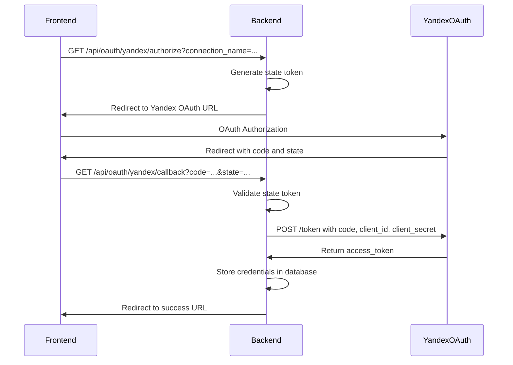
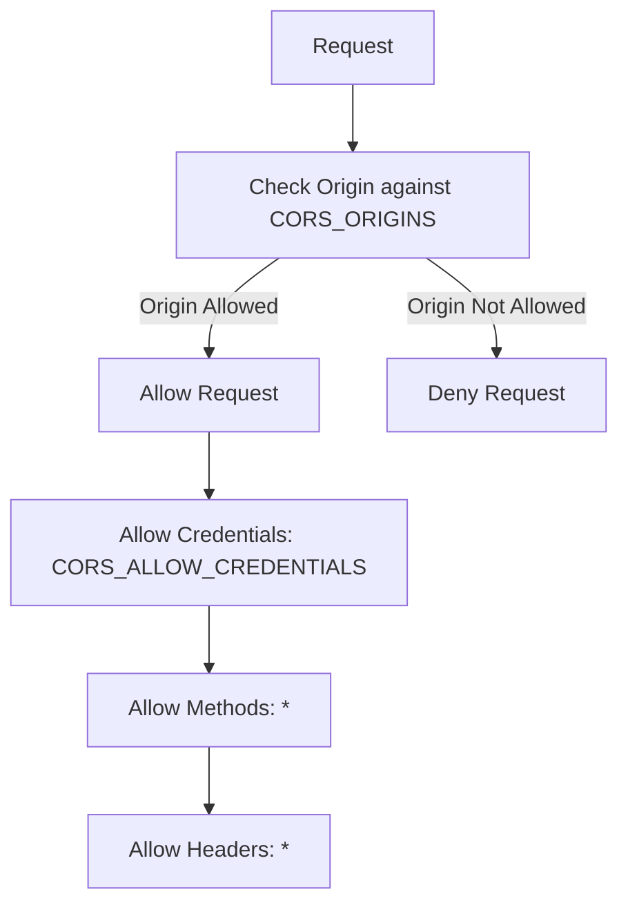
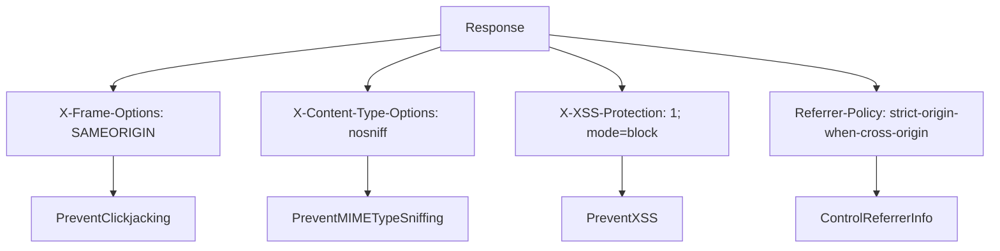
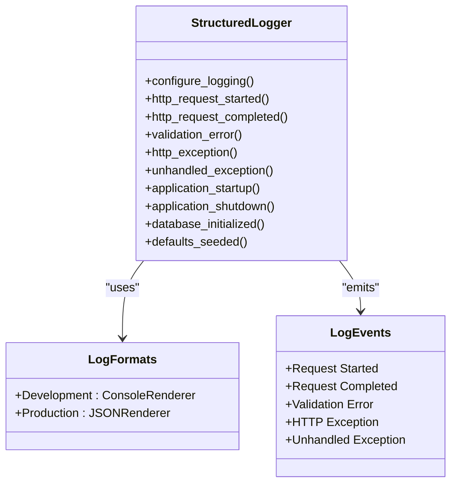
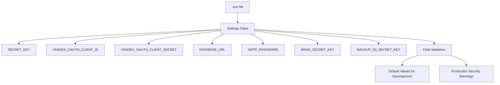
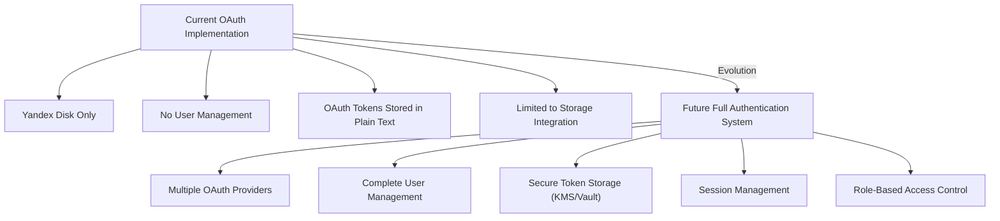
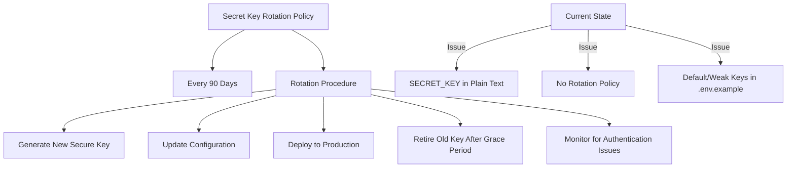
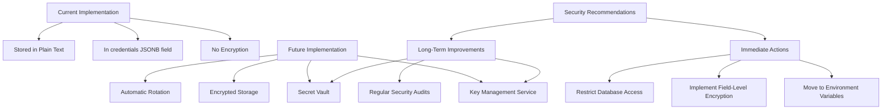
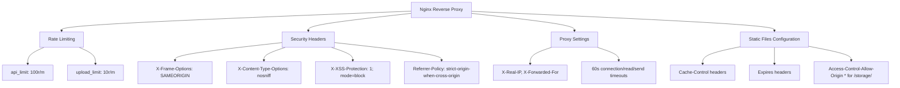
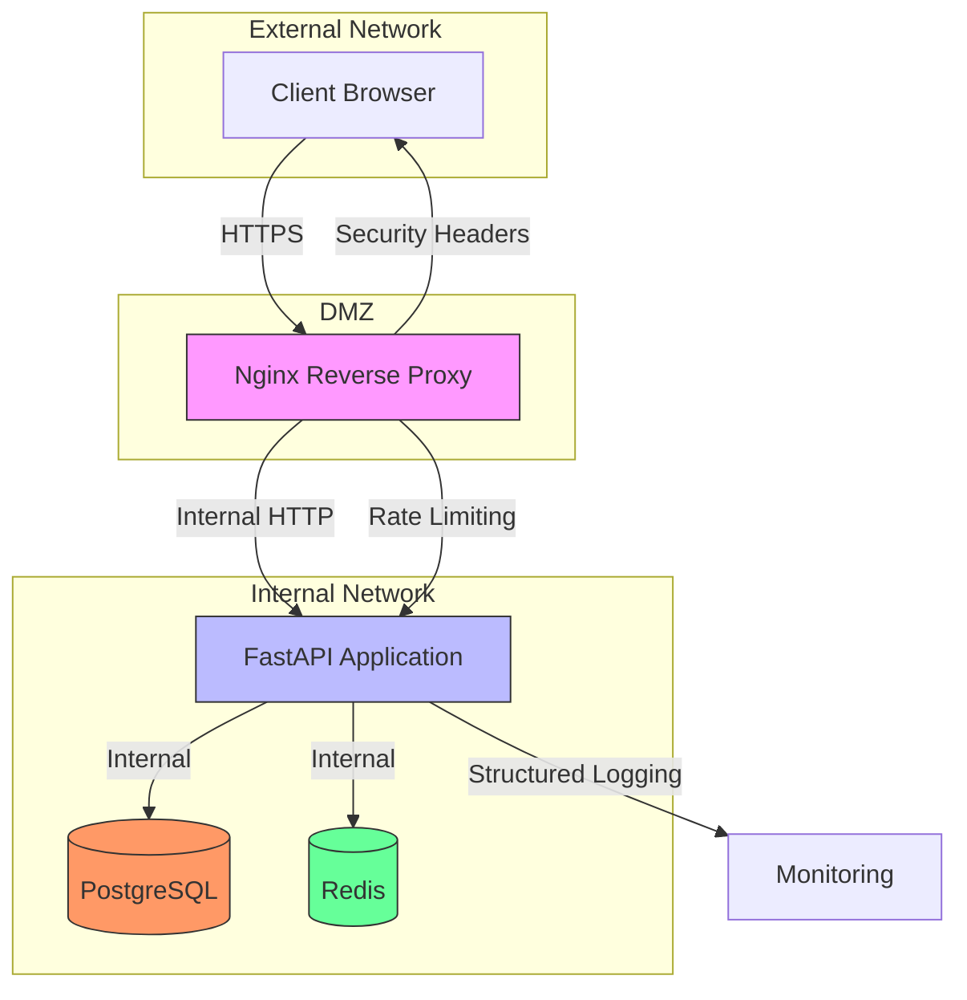

# Security Implementation

<cite>
**Referenced Files in This Document**   
- [main.py](file://app/main.py)
- [config.py](file://app/core/config.py)
- [oauth.py](file://app/api/routes/oauth.py)
- [storage.py](file://app/models/storage.py)
- [nginx.conf](file://nginx/nginx.conf)
- [.env.example](file://.env.example)
- [database.py](file://app/core/database.py)
</cite>

## Table of Contents
1. [Introduction](#introduction)
2. [Authentication and Authorization System](#authentication-and-authorization-system)
3. [Security Configuration](#security-configuration)
4. [Structured Logging Implementation](#structured-logging-implementation)
5. [Environment Variable Management](#environment-variable-management)
6. [Planned Evolution of Authentication System](#planned-evolution-of-authentication-system)
7. [Security Best Practices for Production](#security-best-practices-for-production)
8. [Nginx Reverse Proxy Security](#nginx-reverse-proxy-security)
9. [Network-Level Security](#network-level-security)
10. [Conclusion](#conclusion)

## Introduction
This document provides comprehensive security documentation for the ARV project, focusing on the authentication and authorization system, security configurations, logging implementation, and environment management. The analysis covers current security measures and outlines future improvements for a robust security posture.

## Authentication and Authorization System
The current authentication system is based on OAuth 2.0 for Yandex Disk integration, allowing users to connect their Yandex Disk accounts for storage purposes. The system uses a state parameter to protect against CSRF attacks during the OAuth flow.

**Diagram sources**
- [oauth.py](file://app/api/routes/oauth.py#L19-L106)

**Section sources**
- [oauth.py](file://app/api/routes/oauth.py#L1-L184)
- [storage.py](file://app/models/storage.py#L8-L35)

## Security Configuration
The application implements several security configurations including CORS, HTTP security headers, and secure credential transmission.

### CORS Configuration
The application uses CORS middleware to control cross-origin requests. The allowed origins are configured through the `CORS_ORIGINS` setting, which is parsed into a list of allowed origins.

**Diagram sources**
- [main.py](file://app/main.py#L98-L105)
- [config.py](file://app/core/config.py#L54-L57)

**Section sources**
- [main.py](file://app/main.py#L98-L105)
- [config.py](file://app/core/config.py#L54-L125)

### HTTP Security Headers
The Nginx reverse proxy configures several security headers to enhance the application's security posture.

**Diagram sources**
- [nginx.conf](file://nginx/nginx.conf#L111-L115)

**Section sources**
- [nginx.conf](file://nginx/nginx.conf#L111-L115)

## Structured Logging Implementation
The application uses structlog for structured logging, providing detailed logs of authentication events and security-relevant information.

### Logging Configuration
The logging system is configured in the main application file with different output formats based on the environment.

**Diagram sources**
- [main.py](file://app/main.py#L19-L37)
- [main.py](file://app/main.py#L111-L140)

**Section sources**
- [main.py](file://app/main.py#L19-L140)

## Environment Variable Management
The application uses Pydantic Settings to manage environment variables, including sensitive credentials.

### Sensitive Credentials Management
The system stores sensitive credentials in environment variables, which are loaded from the .env file.

**Diagram sources**
- [config.py](file://app/core/config.py#L7-L134)
- [.env.example](file://.env.example#L1-L71)

**Section sources**
- [config.py](file://app/core/config.py#L7-L134)
- [.env.example](file://.env.example#L1-L71)

## Planned Evolution of Authentication System
The current OAuth-only implementation is planned to evolve into a full authentication system with user management.

### Current OAuth Implementation
The current system only supports OAuth for Yandex Disk integration, with no user management capabilities.

**Diagram sources**
- [oauth.py](file://app/api/routes/oauth.py#L17)
- [storage.py](file://app/models/storage.py#L16)

**Section sources**
- [oauth.py](file://app/api/routes/oauth.py#L1-L184)
- [storage.py](file://app/models/storage.py#L8-L35)

## Security Best Practices for Production
This section outlines security best practices for production deployment, including secret key rotation, secure storage of OAuth tokens, and protection against CSRF and XSS attacks.

### Secret Key Rotation
The application should implement regular secret key rotation in production environments.

**Diagram sources**
- [config.py](file://app/core/config.py#L50)
- [.env.example](file://.env.example#L11)

**Section sources**
- [config.py](file://app/core/config.py#L50-L53)
- [.env.example](file://.env.example#L11)

### OAuth Token Storage
Currently, OAuth tokens are stored in plain text in the database, with plans to implement secure storage using KMS or secret vaults.

**Diagram sources**
- [oauth.py](file://app/api/routes/oauth.py#L82-L87)
- [storage.py](file://app/models/storage.py#L16)

**Section sources**
- [oauth.py](file://app/api/routes/oauth.py#L82-L87)
- [storage.py](file://app/models/storage.py#L16)

## Nginx Reverse Proxy Security
The Nginx configuration provides several security features for the application.

### Nginx Security Configuration
The reverse proxy implements rate limiting, security headers, and proper request handling.

**Diagram sources**
- [nginx.conf](file://nginx/nginx.conf#L34-L115)

**Section sources**
- [nginx.conf](file://nginx/nginx.conf#L34-L115)

## Network-Level Security
The application architecture includes several network-level security considerations.

### Network Security Architecture
The system is designed with network security in mind, using containerization and proper network segmentation.

**Diagram sources**
- [nginx.conf](file://nginx/nginx.conf#L38-L40)
- [docker-compose.yml](file://docker-compose.yml)

**Section sources**
- [nginx.conf](file://nginx/nginx.conf#L38-L40)

## Conclusion
The ARV project has implemented several security measures including OAuth integration, CORS configuration, HTTP security headers, and structured logging. However, there are significant security improvements needed for production deployment, particularly in the areas of credential management and authentication system evolution. The current implementation stores sensitive OAuth tokens in plain text and uses default secret keys, which must be addressed before production deployment. The planned evolution to a full authentication system with user management and secure credential storage will significantly improve the overall security posture. Immediate actions should include implementing proper secret key management, encrypting sensitive data, and enhancing the Nginx configuration for production use.