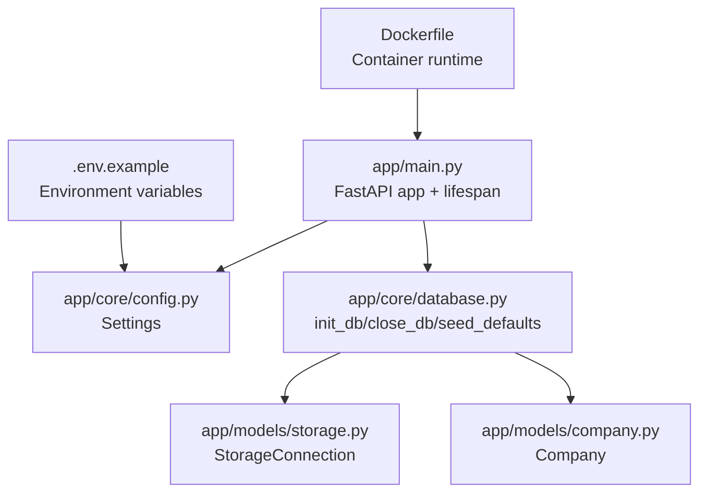
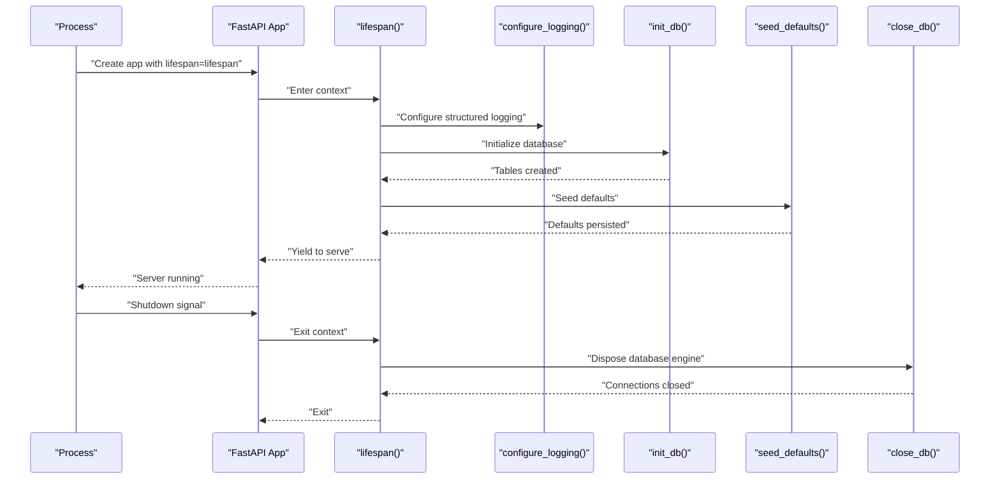
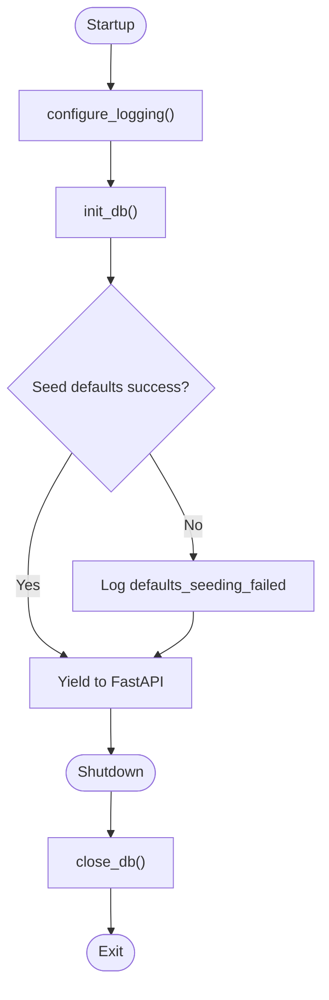
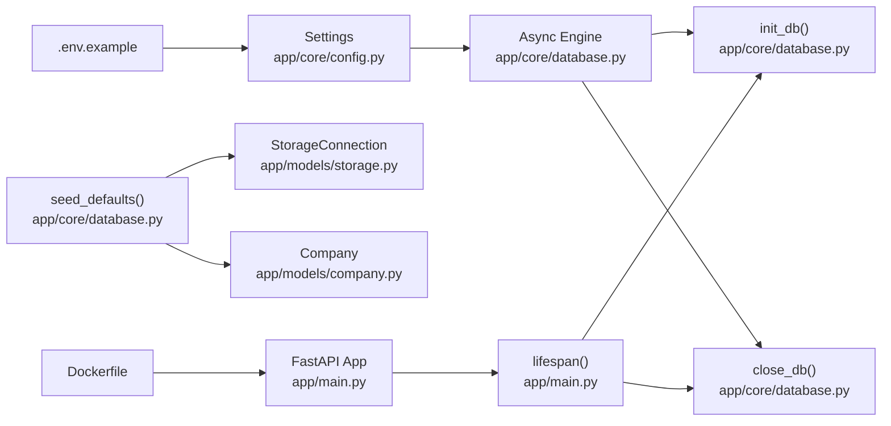

# Application Lifecycle Management

<cite>
**Referenced Files in This Document**
- [app/main.py](file://app/main.py)
- [app/core/config.py](file://app/core/config.py)
- [app/core/database.py](file://app/core/database.py)
- [app/models/storage.py](file://app/models/storage.py)
- [app/models/company.py](file://app/models/company.py)
- [README.md](file://README.md)
- [.env.example](file://.env.example)
- [Dockerfile](file://Dockerfile)
</cite>

## Table of Contents
1. [Introduction](#introduction)
2. [Project Structure](#project-structure)
3. [Core Components](#core-components)
4. [Architecture Overview](#architecture-overview)
5. [Detailed Component Analysis](#detailed-component-analysis)
6. [Dependency Analysis](#dependency-analysis)
7. [Performance Considerations](#performance-considerations)
8. [Troubleshooting Guide](#troubleshooting-guide)
9. [Conclusion](#conclusion)

## Introduction
This document describes the ARV application lifecycle management system with a focus on the async context manager pattern used for application lifespan. It explains the startup sequence (structured logging configuration, database initialization via init_db(), and default data seeding via seed_defaults()), the shutdown sequence (database connection cleanup via close_db()), and the error handling strategy during startup that logs failures and exits the process. It also covers the integration with FastAPI’s lifespan parameter and how it ensures proper resource management, along with practical examples from the code and guidance for common issues such as database connectivity failures and configuration errors.

## Project Structure
The lifecycle management is centered around the main application entry point and core modules:
- Application entry and lifespan: app/main.py
- Configuration: app/core/config.py
- Database engine, sessions, and lifecycle helpers: app/core/database.py
- Domain models used by seeding: app/models/storage.py, app/models/company.py
- Environment variables and deployment context: .env.example, Dockerfile
- Project overview and developer guidance: README.md

**Diagram sources**
- [app/main.py](file://app/main.py#L40-L93)
- [app/core/config.py](file://app/core/config.py#L1-L134)
- [app/core/database.py](file://app/core/database.py#L1-L103)
- [app/models/storage.py](file://app/models/storage.py#L1-L81)
- [app/models/company.py](file://app/models/company.py#L1-L41)
- [.env.example](file://.env.example#L1-L71)
- [Dockerfile](file://Dockerfile#L1-L53)

**Section sources**
- [app/main.py](file://app/main.py#L40-L93)
- [app/core/config.py](file://app/core/config.py#L1-L134)
- [app/core/database.py](file://app/core/database.py#L1-L103)
- [README.md](file://README.md#L1-L149)
- [.env.example](file://.env.example#L1-L71)
- [Dockerfile](file://Dockerfile#L1-L53)

## Core Components
- Async lifespan context manager: Implements startup and shutdown hooks using FastAPI’s lifespan parameter.
- Structured logging configuration: Uses structlog with processors and renderer selection based on settings.
- Database lifecycle helpers: init_db() creates tables, seed_defaults() seeds default records, close_db() disposes the engine.
- Settings-driven configuration: Centralized via Settings class with environment variable binding and parsing.

Key responsibilities:
- app/main.py: Defines the lifespan, configures logging, constructs the FastAPI app with lifespan, and registers middleware and exception handlers.
- app/core/database.py: Creates the async engine, session factory, and provides init_db(), seed_defaults(), close_db().
- app/core/config.py: Loads environment variables into Settings and exposes get_settings().

**Section sources**
- [app/main.py](file://app/main.py#L19-L93)
- [app/core/database.py](file://app/core/database.py#L1-L103)
- [app/core/config.py](file://app/core/config.py#L1-L134)

## Architecture Overview
The lifecycle architecture follows a strict startup-before-serving pattern and a clean shutdown sequence. FastAPI invokes the lifespan context manager around application lifetime, ensuring resources are initialized before the server starts and released after shutdown.

**Diagram sources**
- [app/main.py](file://app/main.py#L19-L93)
- [app/core/database.py](file://app/core/database.py#L48-L103)

## Detailed Component Analysis

### Async Lifespan Pattern and FastAPI Integration
- The lifespan is defined as an async context manager and passed to FastAPI via the lifespan parameter.
- Startup logs environment and logging level, initializes the database, and seeds defaults.
- Shutdown logs the event and closes database connections.

**Diagram sources**
- [app/main.py](file://app/main.py#L19-L93)
- [app/core/database.py](file://app/core/database.py#L48-L103)

**Section sources**
- [app/main.py](file://app/main.py#L40-L93)

### Structured Logging Configuration
- Logging is configured early, before the app is created, using structlog with processors and a renderer selected based on settings.DEBUG and settings.LOG_LEVEL.
- The wrapper logger is bound to the configured log level.

Example references:
- Logger configuration function and settings usage: [app/main.py](file://app/main.py#L19-L38)
- Settings definition for LOG_LEVEL and DEBUG: [app/core/config.py](file://app/core/config.py#L17-L21)

**Section sources**
- [app/main.py](file://app/main.py#L19-L38)
- [app/core/config.py](file://app/core/config.py#L17-L21)

### Database Initialization and Default Seeding
- init_db(): Creates tables using the async engine and metadata.
- seed_defaults(): Ensures default storage connection and company exist, and creates base directories for local storage if configured.

Example references:
- Database engine creation and settings binding: [app/core/database.py](file://app/core/database.py#L1-L16)
- Session factory and dependency: [app/core/database.py](file://app/core/database.py#L17-L46)
- init_db(): [app/core/database.py](file://app/core/database.py#L48-L53)
- seed_defaults(): [app/core/database.py](file://app/core/database.py#L54-L99)
- StorageConnection model: [app/models/storage.py](file://app/models/storage.py#L1-L39)
- Company model: [app/models/company.py](file://app/models/company.py#L1-L41)

**Section sources**
- [app/core/database.py](file://app/core/database.py#L1-L103)
- [app/models/storage.py](file://app/models/storage.py#L1-L81)
- [app/models/company.py](file://app/models/company.py#L1-L41)

### Shutdown Sequence and Resource Cleanup
- close_db(): Disposes the async engine to release connections.
- The lifespan ensures this runs after the server stops.

Example references:
- Shutdown handler and close_db(): [app/main.py](file://app/main.py#L75-L79)
- close_db(): [app/core/database.py](file://app/core/database.py#L100-L103)

**Section sources**
- [app/main.py](file://app/main.py#L75-L79)
- [app/core/database.py](file://app/core/database.py#L100-L103)

### Error Handling Strategy During Startup
- Database initialization failure logs an error and exits the process with a non-zero code.
- Defaults seeding failure logs an error but does not prevent serving.

Example references:
- Startup error handling and sys.exit(1): [app/main.py](file://app/main.py#L58-L72)

**Section sources**
- [app/main.py](file://app/main.py#L58-L72)

### Integration with FastAPI’s lifespan Parameter
- The FastAPI app is constructed with lifespan=lifespan, ensuring the async context manager controls application lifecycle.
- This guarantees that startup and shutdown hooks run reliably around the server lifetime.

Example references:
- FastAPI app construction with lifespan: [app/main.py](file://app/main.py#L84-L93)

**Section sources**
- [app/main.py](file://app/main.py#L84-L93)

## Dependency Analysis
The lifecycle depends on configuration and database modules, which in turn depend on environment variables and models.

**Diagram sources**
- [app/core/config.py](file://app/core/config.py#L1-L134)
- [app/core/database.py](file://app/core/database.py#L1-L103)
- [app/models/storage.py](file://app/models/storage.py#L1-L81)
- [app/models/company.py](file://app/models/company.py#L1-L41)
- [.env.example](file://.env.example#L1-L71)
- [Dockerfile](file://Dockerfile#L1-L53)
- [app/main.py](file://app/main.py#L40-L93)

**Section sources**
- [app/core/config.py](file://app/core/config.py#L1-L134)
- [app/core/database.py](file://app/core/database.py#L1-L103)
- [app/models/storage.py](file://app/models/storage.py#L1-L81)
- [app/models/company.py](file://app/models/company.py#L1-L41)
- [.env.example](file://.env.example#L1-L71)
- [Dockerfile](file://Dockerfile#L1-L53)
- [app/main.py](file://app/main.py#L40-L93)

## Performance Considerations
- Connection pooling: The async engine uses pool_size and max_overflow settings from configuration to manage concurrent connections efficiently.
- Echo and pre-ping: DB_ECHO can be enabled for debugging; pool_pre_ping reduces stale connections.
- Session management: get_db() ensures commit/rollback and closure per request; lifespan manages global engine lifecycle.

Practical tips:
- Tune DB_POOL_SIZE and DB_MAX_OVERFLOW according to workload.
- Enable DB_ECHO only in development to diagnose connection issues.
- Monitor engine disposal during shutdown to avoid lingering connections.

**Section sources**
- [app/core/database.py](file://app/core/database.py#L1-L25)
- [app/core/config.py](file://app/core/config.py#L37-L44)

## Troubleshooting Guide

Common issues and resolutions:
- Database connectivity failures
  - Symptoms: Startup logs indicate database initialization failed and the process exits.
  - Causes: Incorrect DATABASE_URL, network issues, PostgreSQL not ready, missing permissions.
  - Resolution: Verify DATABASE_URL and credentials in environment variables; ensure the database service is reachable; confirm migrations have been applied.
  - References: [app/main.py](file://app/main.py#L58-L72), [.env.example](file://.env.example#L1-L10), [README.md](file://README.md#L111-L132)

- Defaults seeding failures
  - Symptoms: Warning logs about defaults seeding failure; application continues serving.
  - Causes: Conflicting records, permission issues, or storage path problems.
  - Resolution: Inspect logs for the specific error; verify storage path permissions and existence; retry seeding after fixing conflicts.
  - References: [app/main.py](file://app/main.py#L63-L69), [app/core/database.py](file://app/core/database.py#L54-L99)

- Configuration errors
  - Symptoms: Unexpected log level or renderer behavior.
  - Causes: LOG_LEVEL or DEBUG misconfiguration.
  - Resolution: Confirm LOG_LEVEL and DEBUG values in environment variables; restart the service to reapply settings.
  - References: [app/main.py](file://app/main.py#L19-L38), [app/core/config.py](file://app/core/config.py#L17-L21), [.env.example](file://.env.example#L15-L18)

- Container/runtime issues
  - Symptoms: Health checks failing or startup timeouts.
  - Causes: Port exposure, missing dependencies, or incorrect CMD.
  - Resolution: Validate EXPOSE and CMD in Dockerfile; ensure health checks target the correct path; rebuild images if necessary.
  - References: [Dockerfile](file://Dockerfile#L1-L53), [README.md](file://README.md#L1-L149)

## Conclusion
The ARV application employs a robust async context manager pattern integrated with FastAPI’s lifespan to manage application lifecycle. Startup initializes structured logging, sets up the database, and seeds defaults, while shutdown cleanly disposes database connections. The system’s error handling during startup ensures failures are logged and the process exits appropriately, preventing partially initialized services from serving traffic. Configuration is centralized via Settings loaded from environment variables, enabling flexible deployments across environments. By following the troubleshooting steps and leveraging the documented references, operators can reliably deploy and maintain the ARV platform.