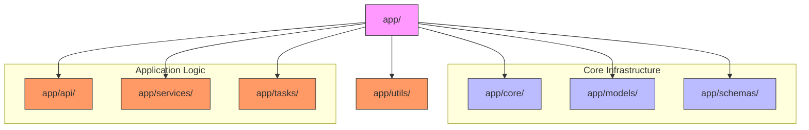
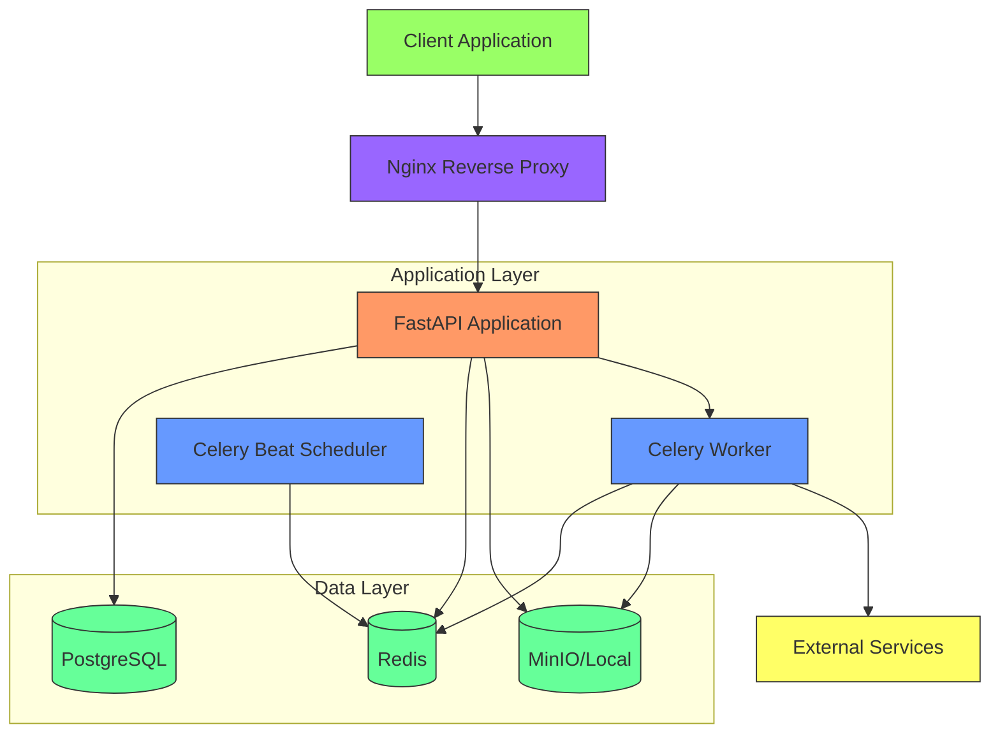
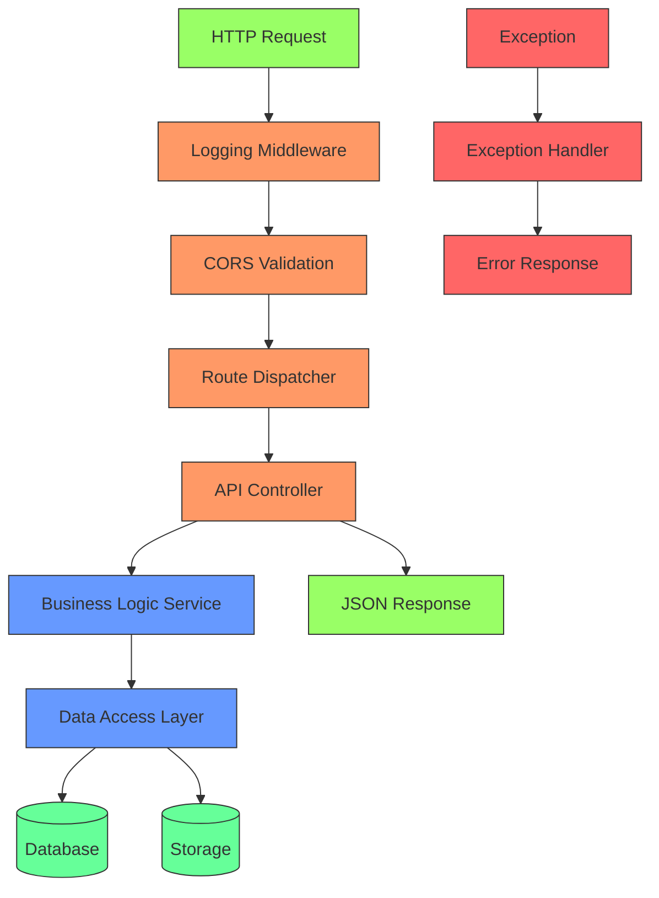
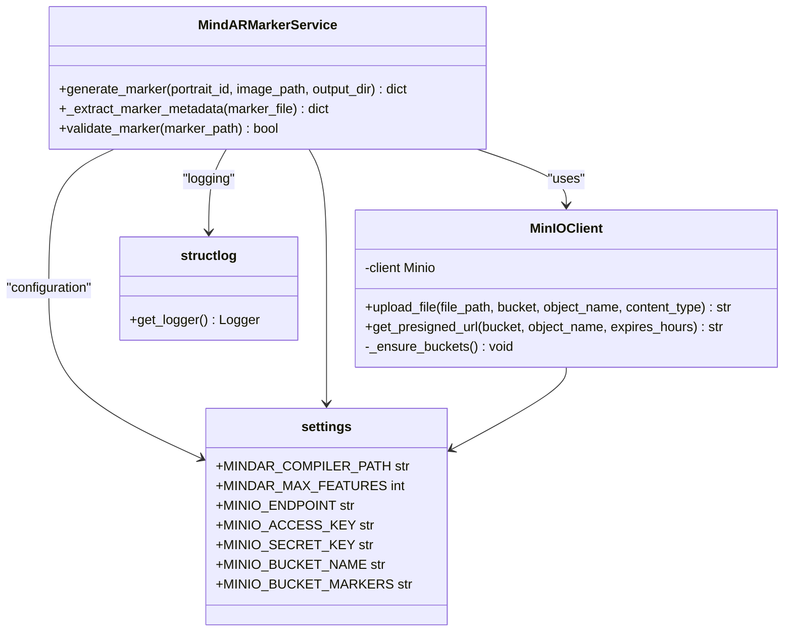
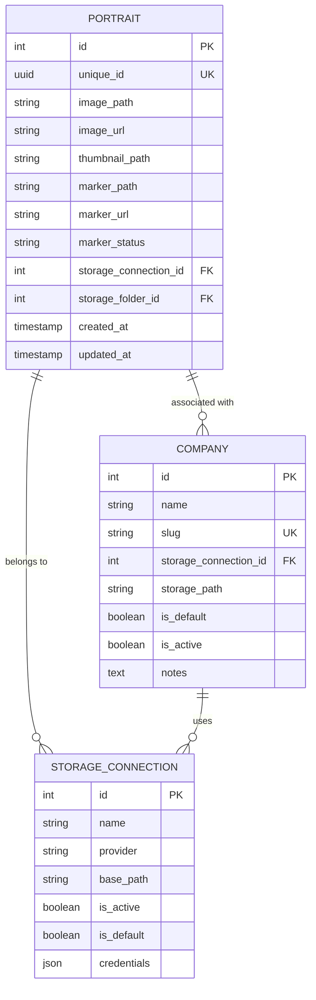
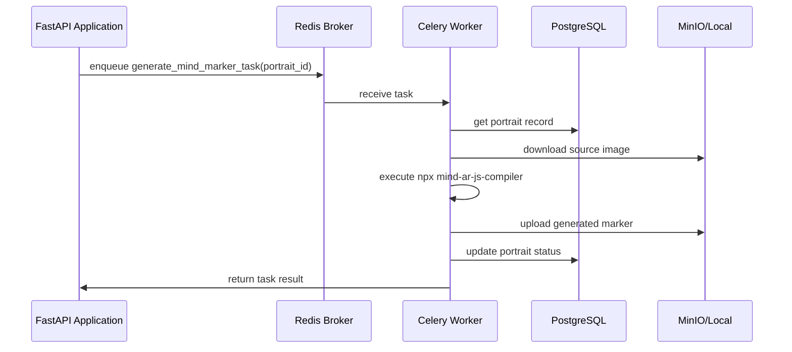
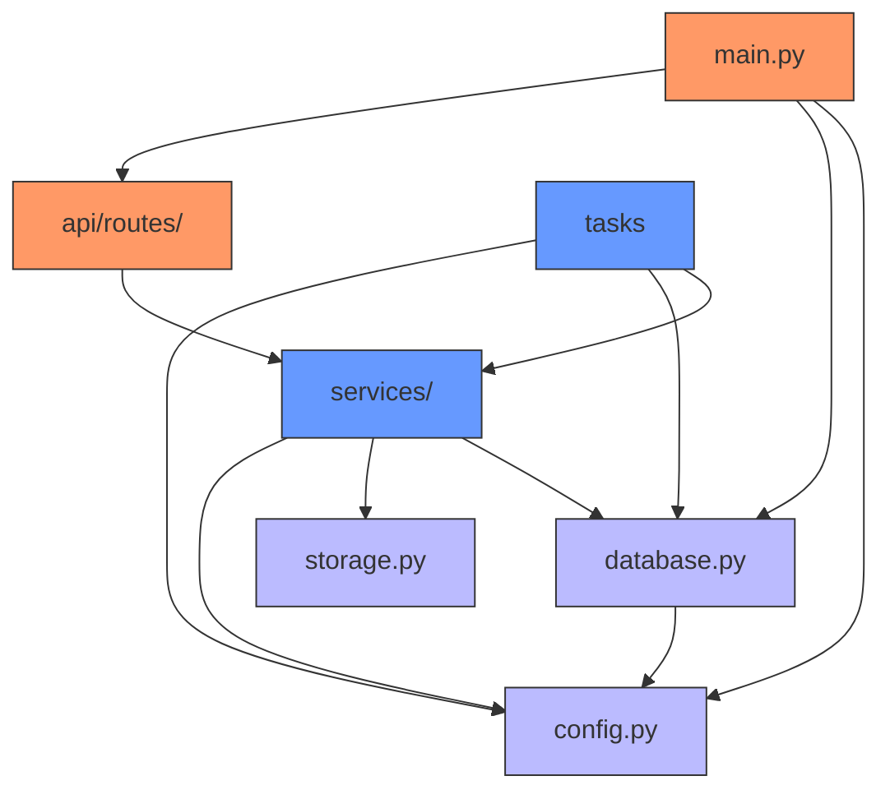

# Backend Architecture

<cite>
**Referenced Files in This Document**   
- [main.py](file://app/main.py)
- [config.py](file://app/core/config.py)
- [database.py](file://app/core/database.py)
- [storage.py](file://app/core/storage.py)
- [portraits.py](file://app/api/routes/portraits.py)
- [marker_service.py](file://app/services/marker_service.py)
- [celery_app.py](file://app/tasks/celery_app.py)
- [portrait.py](file://app/models/portrait.py)
- [Dockerfile](file://Dockerfile)
- [docker-compose.yml](file://docker-compose.yml)
- [requirements.txt](file://requirements.txt)
- [README.md](file://README.md)
</cite>

## Table of Contents
1. [Introduction](#introduction)
2. [Project Structure](#project-structure)
3. [Core Components](#core-components)
4. [Architecture Overview](#architecture-overview)
5. [Detailed Component Analysis](#detailed-component-analysis)
6. [Dependency Analysis](#dependency-analysis)
7. [Performance Considerations](#performance-considerations)
8. [Troubleshooting Guide](#troubleshooting-guide)
9. [Conclusion](#conclusion)

## Introduction
The ARV backend system is a FastAPI-based B2B SaaS platform designed for creating augmented reality (AR) content using image recognition technology. The system follows a modular architectural approach with clear separation of concerns across core functionality, models, API routes, services, and background tasks. This documentation provides a comprehensive overview of the system's architecture, design patterns, component interactions, and deployment topology.

The platform enables users to upload images (portraits) that serve as AR markers, generates corresponding Mind AR target files, and manages associated AR content delivery. The architecture emphasizes scalability, maintainability, and operational observability through structured logging, health checks, and asynchronous processing.

**Section sources**
- [main.py](file://app/main.py#L84-L92)
- [README.md](file://README.md#L1-L10)

## Project Structure

The ARV backend follows a well-organized directory structure that separates concerns and promotes maintainability. The modular design groups related functionality into distinct packages:

**Diagram sources**
- [app/main.py](file://app/main.py)
- [README.md](file://README.md#L38-L57)

**Section sources**
- [README.md](file://README.md#L38-L57)

## Core Components

The ARV backend system consists of several core components that work together to provide AR content management functionality. The architecture follows established patterns including Dependency Injection for database sessions, Repository Pattern for data access, Configuration as Code using Pydantic Settings, and Lifespan Management for application lifecycle events.

Key architectural elements include:
- FastAPI application with modular route organization
- Async SQLAlchemy with PostgreSQL for data persistence
- Celery with Redis for asynchronous task processing
- Structured logging with structlog for observability
- Configuration management using Pydantic Settings
- Multiple storage backends (local, MinIO, Yandex Disk)

The system implements a clean separation between API routes, business logic services, and data models, enabling independent development and testing of each component.

**Section sources**
- [main.py](file://app/main.py#L84-L285)
- [config.py](file://app/core/config.py#L7-L134)
- [database.py](file://app/core/database.py#L1-L103)

## Architecture Overview

The ARV backend system follows a layered architecture with clear separation between presentation, business logic, and data access layers. The system is designed for scalability and maintainability, with asynchronous processing for computationally intensive tasks.

**Diagram sources**
- [docker-compose.yml](file://docker-compose.yml#L3-L144)
- [main.py](file://app/main.py#L84-L92)
- [celery_app.py](file://app/tasks/celery_app.py#L1-L50)

**Section sources**
- [docker-compose.yml](file://docker-compose.yml#L3-L144)
- [main.py](file://app/main.py#L84-L92)

## Detailed Component Analysis

### API Routes and Controllers
The API routes are organized in a modular structure under the `app/api/routes/` directory, with each file handling a specific domain (portraits, storage, projects, etc.). The routes follow RESTful conventions and use FastAPI's dependency injection system to manage database sessions.

The system implements comprehensive request/response logging, exception handling, and CORS configuration. Health check endpoints provide monitoring capabilities for both liveness and readiness probes.

**Diagram sources**
- [main.py](file://app/main.py#L108-L138)
- [portraits.py](file://app/api/routes/portraits.py#L1-L116)

**Section sources**
- [main.py](file://app/main.py#L108-L138)
- [portraits.py](file://app/api/routes/portraits.py#L1-L116)

### Services and Business Logic
The services layer contains the core business logic of the application, implementing the Repository Pattern for data access abstraction. Services are responsible for coordinating operations between multiple models and external systems.

The `MindARMarkerService` demonstrates the pattern of encapsulating complex business logic in dedicated service classes, with proper error handling and logging. The service handles the generation of AR markers using the Mind AR compiler and manages storage operations.

**Diagram sources**
- [marker_service.py](file://app/services/marker_service.py#L13-L134)
- [storage.py](file://app/core/storage.py#L8-L71)
- [config.py](file://app/core/config.py#L7-L134)

**Section sources**
- [marker_service.py](file://app/services/marker_service.py#L13-L134)
- [storage.py](file://app/core/storage.py#L8-L71)

### Data Models and Persistence
The data model layer uses SQLAlchemy ORM with async support to define database entities. The models follow a clean structure with proper indexing, constraints, and relationships. The system implements the Repository Pattern through direct use of SQLAlchemy sessions injected via FastAPI dependencies.

The `Portrait` model represents the core entity for AR markers, storing metadata about uploaded images and their corresponding AR target files. The model includes fields for tracking processing status and storage locations.

**Diagram sources**
- [portrait.py](file://app/models/portrait.py#L7-L28)
- [database.py](file://app/core/database.py#L1-L103)

**Section sources**
- [portrait.py](file://app/models/portrait.py#L7-L28)
- [database.py](file://app/core/database.py#L1-L103)

### Background Tasks and Celery
The system uses Celery for asynchronous task processing, with Redis as the message broker and result backend. Background tasks handle computationally intensive operations such as AR marker generation, content expiration, and notifications.

The Celery configuration includes multiple queues for different task types (markers, notifications, default) and periodic tasks scheduled via Celery Beat for routine maintenance operations.

**Diagram sources**
- [celery_app.py](file://app/tasks/celery_app.py#L1-L50)
- [marker_tasks.py](file://app/tasks/marker_tasks.py)
- [portraits.py](file://app/api/routes/portraits.py#L60)

**Section sources**
- [celery_app.py](file://app/tasks/celery_app.py#L1-L50)
- [portraits.py](file://app/api/routes/portraits.py#L60)

## Dependency Analysis

The ARV backend system has a well-defined dependency structure with clear boundaries between components. The architecture minimizes circular dependencies and promotes loose coupling through dependency injection and interface-based design.

**Diagram sources**
- [main.py](file://app/main.py)
- [config.py](file://app/core/config.py)
- [database.py](file://app/core/database.py)
- [services/marker_service.py](file://app/services/marker_service.py)
- [tasks/celery_app.py](file://app/tasks/celery_app.py)

**Section sources**
- [main.py](file://app/main.py)
- [config.py](file://app/core/config.py)
- [database.py](file://app/core/database.py)

## Performance Considerations

The ARV backend is designed with performance and scalability in mind. The system leverages asynchronous processing for I/O-bound operations and computationally intensive tasks. Key performance considerations include:

- **Uvicorn Workers**: The application runs with multiple Uvicorn workers (configured as 4 in docker-compose.yml) to handle concurrent requests efficiently.
- **Database Connection Pooling**: SQLAlchemy async engine is configured with connection pooling (pool_size=20, max_overflow=10) to optimize database resource usage.
- **Redis Caching**: Redis is used as both a message broker for Celery and a potential caching layer for frequently accessed data.
- **Async Operations**: The entire stack uses async/await pattern from FastAPI through SQLAlchemy to database operations, maximizing throughput.
- **Background Processing**: Computationally intensive tasks like AR marker generation are offloaded to Celery workers, preventing blocking of API requests.

The deployment topology supports horizontal scaling of both API and worker components based on load requirements.

**Section sources**
- [docker-compose.yml](file://docker-compose.yml#L50)
- [database.py](file://app/core/database.py#L8-L15)
- [config.py](file://app/core/config.py#L41-L44)

## Troubleshooting Guide

The system includes several built-in mechanisms for monitoring and troubleshooting:

- **Health Check Endpoints**: `/api/health/status` and `/api/health/readiness` provide liveness and readiness probes for container orchestration.
- **Structured Logging**: Comprehensive structured logging with structlog captures application events, HTTP requests, and errors in a consistent format.
- **Exception Handling**: Global exception handlers provide consistent error responses and log details for debugging.
- **Request Logging**: Middleware logs all HTTP requests and responses with timing information for performance analysis.

Common issues and their resolution:
- **Database Connection Issues**: Verify PostgreSQL service availability and connection parameters in environment variables.
- **Celery Worker Failures**: Check Redis connectivity and ensure required dependencies (Node.js, npx) are available in worker containers.
- **Storage Access Problems**: Validate MinIO/Local storage paths and permissions, especially in containerized environments.
- **AR Marker Generation Failures**: Ensure Node.js and mind-ar-js-compiler are properly installed and accessible in the PATH.

**Section sources**
- [main.py](file://app/main.py#L210-L237)
- [main.py](file://app/main.py#L108-L138)
- [main.py](file://app/main.py#L142-L207)

## Conclusion

The ARV backend system demonstrates a well-architected FastAPI application with clear separation of concerns, robust error handling, and scalable design. The modular structure organizes functionality into logical components, making the system maintainable and extensible.

Key architectural strengths include:
- Use of modern Python async patterns throughout the stack
- Proper separation of API routes, business logic, and data access
- Asynchronous processing of intensive tasks via Celery
- Comprehensive observability through structured logging and health checks
- Flexible configuration management using Pydantic Settings
- Production-ready deployment topology with Docker Compose

The system is well-positioned to handle growth in users and content volume, with clear pathways for adding new features and scaling individual components as needed.