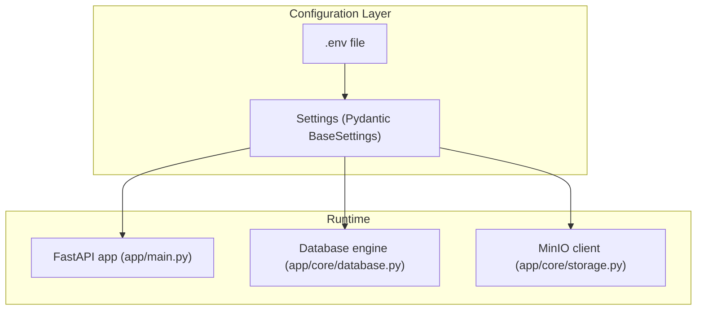
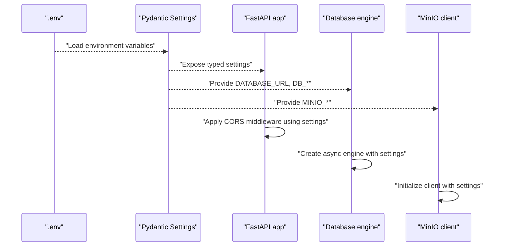
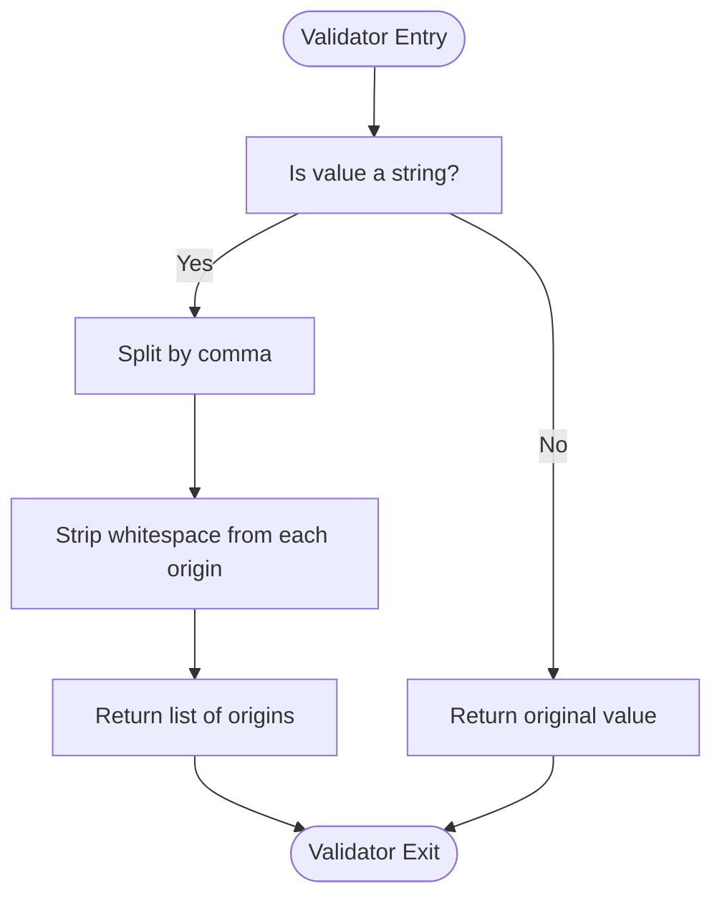
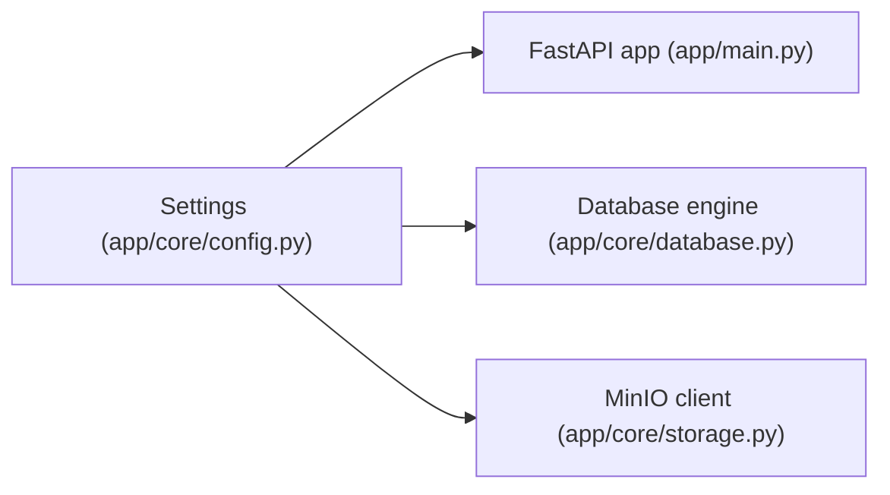

# Configuration Management

<cite>
**Referenced Files in This Document**
- [app/core/config.py](file://app/core/config.py)
- [app/main.py](file://app/main.py)
- [app/core/database.py](file://app/core/database.py)
- [app/core/storage.py](file://app/core/storage.py)
- [.env.example](file://.env.example)
- [docker-compose.yml](file://docker-compose.yml)
- [docker-compose.override.yml](file://docker-compose.override.yml)
- [requirements.txt](file://requirements.txt)
</cite>

## Table of Contents
1. [Introduction](#introduction)
2. [Project Structure](#project-structure)
3. [Core Components](#core-components)
4. [Architecture Overview](#architecture-overview)
5. [Detailed Component Analysis](#detailed-component-analysis)
6. [Dependency Analysis](#dependency-analysis)
7. [Performance Considerations](#performance-considerations)
8. [Troubleshooting Guide](#troubleshooting-guide)
9. [Conclusion](#conclusion)
10. [Appendices](#appendices)

## Introduction
This document describes the ARV configuration management system built on Pydantic Settings. It explains how environment variables are loaded from .env files, how case-insensitive parsing works, and how configuration categories are organized across application settings, database parameters, storage configurations, security credentials, and third-party service integrations (MinIO, Yandex Disk, SMTP, Telegram). It also details the field validation process for CORS origins, the use of lru_cache for settings instantiation optimization, and security considerations for sensitive data. Finally, it provides configuration best practices for different environments and the role of .env.example as a template.

## Project Structure
The configuration system centers around a single Pydantic Settings class that loads values from a .env file and exposes typed configuration across the application. Supporting files define how settings are consumed by the web server, database engine, and storage clients.

**Diagram sources**
- [app/core/config.py](file://app/core/config.py#L1-L134)
- [app/main.py](file://app/main.py#L1-L120)
- [app/core/database.py](file://app/core/database.py#L1-L50)
- [app/core/storage.py](file://app/core/storage.py#L1-L40)

**Section sources**
- [app/core/config.py](file://app/core/config.py#L1-L134)
- [app/main.py](file://app/main.py#L1-L120)
- [app/core/database.py](file://app/core/database.py#L1-L50)
- [app/core/storage.py](file://app/core/storage.py#L1-L40)

## Core Components
- Settings class: Defines all configuration fields, environment file binding, case-insensitive parsing, and CORS origins validator.
- Environment loading: Uses pydantic-settings to load .env with UTF-8 encoding and case-insensitive keys.
- CORS origins parsing: Validates and converts a comma-separated string into a list of origins.
- Settings caching: Provides a cached accessor to avoid repeated instantiation.
- Application usage: FastAPI reads CORS and logging settings; database and storage clients consume their respective settings.

Key implementation references:
- Settings class and environment configuration: [app/core/config.py](file://app/core/config.py#L1-L40)
- CORS origins validator and property: [app/core/config.py](file://app/core/config.py#L112-L126)
- Settings caching: [app/core/config.py](file://app/core/config.py#L128-L134)
- FastAPI CORS middleware: [app/main.py](file://app/main.py#L98-L105)
- Database engine configuration: [app/core/database.py](file://app/core/database.py#L8-L15)
- MinIO client configuration: [app/core/storage.py](file://app/core/storage.py#L8-L17)

**Section sources**
- [app/core/config.py](file://app/core/config.py#L1-L134)
- [app/main.py](file://app/main.py#L98-L105)
- [app/core/database.py](file://app/core/database.py#L8-L15)
- [app/core/storage.py](file://app/core/storage.py#L8-L17)

## Architecture Overview
The configuration architecture is a layered design:
- Data source: .env file loaded by Pydantic Settings.
- Model: Typed Settings class with validators and computed properties.
- Consumers: FastAPI app, database engine, and storage clients.

**Diagram sources**
- [app/core/config.py](file://app/core/config.py#L1-L134)
- [app/main.py](file://app/main.py#L98-L105)
- [app/core/database.py](file://app/core/database.py#L8-L15)
- [app/core/storage.py](file://app/core/storage.py#L8-L17)

## Detailed Component Analysis

### Settings Class and Environment Loading
- Environment file binding: The Settings class configures the environment file path and encoding, enabling loading from .env.
- Case-insensitive parsing: Keys are case-insensitive, simplifying environment variable naming flexibility.
- Extra handling: Unknown keys are ignored, preventing failures when additional environment variables are present.
- Field defaults: Comprehensive defaults are provided for all categories, ensuring the app runs out-of-the-box while allowing overrides via .env.

Implementation references:
- Environment configuration and defaults: [app/core/config.py](file://app/core/config.py#L10-L44)
- Security defaults: [app/core/config.py](file://app/core/config.py#L49-L53)
- Storage defaults: [app/core/config.py](file://app/core/config.py#L58-L61)
- MinIO defaults: [app/core/config.py](file://app/core/config.py#L62-L72)
- SMTP defaults: [app/core/config.py](file://app/core/config.py#L78-L85)
- Telegram defaults: [app/core/config.py](file://app/core/config.py#L86-L90)
- Celery defaults: [app/core/config.py](file://app/core/config.py#L95-L100)
- Monitoring defaults: [app/core/config.py](file://app/core/config.py#L101-L104)
- Backup defaults: [app/core/config.py](file://app/core/config.py#L105-L111)

**Section sources**
- [app/core/config.py](file://app/core/config.py#L10-L111)

### CORS Origins Parsing
- Validator: A field validator parses the CORS_ORIGINS string into a list of origins, stripping whitespace.
- Property: An additional property provides a consistent list representation regardless of input type.
- Middleware: FastAPI applies the parsed origins to the CORS middleware.

Implementation references:
- Validator: [app/core/config.py](file://app/core/config.py#L112-L119)
- Property: [app/core/config.py](file://app/core/config.py#L120-L126)
- Middleware usage: [app/main.py](file://app/main.py#L98-L105)

**Diagram sources**
- [app/core/config.py](file://app/core/config.py#L112-L126)

**Section sources**
- [app/core/config.py](file://app/core/config.py#L112-L126)
- [app/main.py](file://app/main.py#L98-L105)

### Settings Caching with lru_cache
- Purpose: The get_settings function caches a Settings instance to avoid repeated instantiation overhead.
- Behavior: The cached function returns the same Settings object on subsequent calls.

Implementation references:
- Cached accessor: [app/core/config.py](file://app/core/config.py#L128-L134)

Best practice note:
- Prefer using the global settings instance for most consumers to benefit from caching and consistent state.

**Section sources**
- [app/core/config.py](file://app/core/config.py#L128-L134)

### Application Settings
- Debugging and logging: DEBUG, LOG_LEVEL, and ENVIRONMENT influence runtime behavior and logging configuration.
- Project metadata: PROJECT_NAME, VERSION, and API_V1_PREFIX define API identity and routing.
- Mind AR integration: Compiler path and feature limits for AR processing.

Implementation references:
- Application fields: [app/core/config.py](file://app/core/config.py#L17-L26)
- Logging configuration: [app/main.py](file://app/main.py#L19-L38)

**Section sources**
- [app/core/config.py](file://app/core/config.py#L17-L26)
- [app/main.py](file://app/main.py#L19-L38)

### Database Parameters
- Connection URL and pooling: DATABASE_URL, DB_POOL_SIZE, DB_MAX_OVERFLOW, DB_ECHO.
- Engine creation: The database engine is configured using settings and pre-ping enabled for reliability.

Implementation references:
- Database fields: [app/core/config.py](file://app/core/config.py#L37-L44)
- Engine configuration: [app/core/database.py](file://app/core/database.py#L8-L15)

**Section sources**
- [app/core/config.py](file://app/core/config.py#L37-L44)
- [app/core/database.py](file://app/core/database.py#L8-L15)

### Storage Configurations
- Provider selection: STORAGE_TYPE controls whether local disk, MinIO, or Yandex Disk is used.
- Local storage: STORAGE_BASE_PATH defines the base directory for local content.
- MinIO: Endpoint, credentials, bucket names, and TLS flag.
- Yandex Disk: OAuth client credentials and redirect URI.

Implementation references:
- Storage fields: [app/core/config.py](file://app/core/config.py#L58-L72)
- MinIO client: [app/core/storage.py](file://app/core/storage.py#L8-L17)

**Section sources**
- [app/core/config.py](file://app/core/config.py#L58-L72)
- [app/core/storage.py](file://app/core/storage.py#L8-L17)

### Security Credentials
- JWT: SECRET_KEY, ALGORITHM, and ACCESS_TOKEN_EXPIRE_MINUTES govern token signing and expiration.
- Best practice: Replace the default SECRET_KEY with a strong, random value in production.

Implementation references:
- Security fields: [app/core/config.py](file://app/core/config.py#L49-L53)

Security considerations:
- Never commit SECRET_KEY or other secrets to version control.
- Use environment-specific .env files and CI/CD secret management.
- Rotate keys periodically and invalidate sessions when keys change.

**Section sources**
- [app/core/config.py](file://app/core/config.py#L49-L53)

### Third-Party Service Integrations
- MinIO: Endpoint, access key, secret key, bucket names, and secure flag.
- Yandex Disk: OAuth client ID, secret, and redirect URI.
- SMTP: Host, port, username, password, sender address, and display name.
- Telegram: Bot token and admin chat ID.

Implementation references:
- MinIO fields: [app/core/config.py](file://app/core/config.py#L62-L72)
- Yandex Disk fields: [app/core/config.py](file://app/core/config.py#L73-L77)
- SMTP fields: [app/core/config.py](file://app/core/config.py#L78-L85)
- Telegram fields: [app/core/config.py](file://app/core/config.py#L86-L90)

**Section sources**
- [app/core/config.py](file://app/core/config.py#L62-L90)

### Environment Variable Mapping Example
The Settings class maps environment variables to typed fields. For example:
- DATABASE_URL maps to the database connection string.
- REDIS_URL maps to the Redis connection string.
- SECRET_KEY maps to the JWT signing key.
- CORS_ORIGINS maps to the allowed origins list.

Implementation references:
- Field definitions: [app/core/config.py](file://app/core/config.py#L37-L111)

**Section sources**
- [app/core/config.py](file://app/core/config.py#L37-L111)

## Dependency Analysis
The configuration system exhibits low coupling and high cohesion:
- Settings encapsulates all configuration concerns.
- FastAPI, database, and storage clients depend on Settings for their configuration.
- No circular dependencies are evident among these modules.

**Diagram sources**
- [app/core/config.py](file://app/core/config.py#L1-L134)
- [app/main.py](file://app/main.py#L98-L105)
- [app/core/database.py](file://app/core/database.py#L8-L15)
- [app/core/storage.py](file://app/core/storage.py#L8-L17)

**Section sources**
- [app/core/config.py](file://app/core/config.py#L1-L134)
- [app/main.py](file://app/main.py#L98-L105)
- [app/core/database.py](file://app/core/database.py#L8-L15)
- [app/core/storage.py](file://app/core/storage.py#L8-L17)

## Performance Considerations
- Settings caching: Using the cached get_settings reduces repeated instantiation overhead.
- Environment loading: UTF-8 encoding and case-insensitive parsing add negligible overhead compared to the benefits of flexible configuration.
- CORS parsing: The validator performs a simple split-and-strip operation, which is efficient for typical origin counts.

Recommendations:
- Keep CORS_ORIGINS minimal and specific to reduce middleware overhead.
- Avoid excessive environment variables to minimize parsing time.

**Section sources**
- [app/core/config.py](file://app/core/config.py#L128-L134)

## Troubleshooting Guide
Common configuration issues and resolutions:
- CORS mismatch: Ensure CORS_ORIGINS contains the exact frontend URLs used by the client. The validator strips whitespace, so trailing spaces are handled automatically.
- Database connectivity: Verify DATABASE_URL, DB_POOL_SIZE, and DB_MAX_OVERFLOW match the target database capabilities.
- MinIO connectivity: Confirm MINIO_ENDPOINT, MINIO_ACCESS_KEY, MINIO_SECRET_KEY, and bucket names are correct. The client ensures buckets exist and sets a public read policy when needed.
- SMTP delivery: Validate SMTP_HOST, SMTP_PORT, SMTP_USERNAME, and SMTP_PASSWORD. Some providers require app-specific passwords.
- Telegram notifications: Ensure TELEGRAM_BOT_TOKEN and TELEGRAM_ADMIN_CHAT_ID are set and the bot has permission to send messages to the specified chat.

Environment-specific guidance:
- Development: Enable DEBUG and LOG_LEVEL=DEBUG via docker-compose.override.yml to increase verbosity.
- Staging/Production: Set ENVIRONMENT to production and ensure SECRET_KEY is strong and unique.

Implementation references:
- CORS validator and property: [app/core/config.py](file://app/core/config.py#L112-L126)
- Database engine: [app/core/database.py](file://app/core/database.py#L8-L15)
- MinIO client: [app/core/storage.py](file://app/core/storage.py#L8-L17)
- Development overrides: [docker-compose.override.yml](file://docker-compose.override.yml#L9-L14)

**Section sources**
- [app/core/config.py](file://app/core/config.py#L112-L126)
- [app/core/database.py](file://app/core/database.py#L8-L15)
- [app/core/storage.py](file://app/core/storage.py#L8-L17)
- [docker-compose.override.yml](file://docker-compose.override.yml#L9-L14)

## Conclusion
The ARV configuration management system leverages Pydantic Settings to provide a robust, typed, and flexible configuration layer. Environment variables are loaded from .env with case-insensitive parsing, and the Settings class centralizes all configuration categories. CORS origins are validated and normalized, and settings instantiation is optimized with lru_cache. Security-sensitive fields like SECRET_KEY are defaulted to weak values in templates, emphasizing the importance of environment-specific overrides. The system integrates cleanly with FastAPI, the database engine, and storage clients, enabling straightforward deployment across development, staging, and production environments.

## Appendices

### Environment Variables and Categories
- Application: DEBUG, ENVIRONMENT, LOG_LEVEL, PROJECT_NAME, VERSION, API_V1_PREFIX, MINDAR_COMPILER_PATH, MINDAR_MAX_FEATURES, ALLOWED_ORIGINS.
- Database: DATABASE_URL, DB_POOL_SIZE, DB_MAX_OVERFLOW, DB_ECHO.
- Redis: REDIS_URL, REDIS_MAX_CONNECTIONS.
- Security: SECRET_KEY, ALGORITHM, ACCESS_TOKEN_EXPIRE_MINUTES.
- CORS: CORS_ORIGINS, CORS_ALLOW_CREDENTIALS.
- Storage: STORAGE_TYPE, STORAGE_BASE_PATH.
- MinIO: MINIO_ENDPOINT, MINIO_ACCESS_KEY, MINIO_SECRET_KEY, MINIO_BUCKET_NAME, MINIO_BUCKET_VIDEOS, MINIO_BUCKET_MARKERS, MINIO_BUCKET_THUMBNAILS, MINIO_SECURE.
- Yandex Disk: YANDEX_OAUTH_CLIENT_ID, YANDEX_OAUTH_CLIENT_SECRET, YANDEX_OAUTH_REDIRECT_URI.
- SMTP: SMTP_HOST, SMTP_PORT, SMTP_USERNAME, SMTP_PASSWORD, SMTP_FROM_EMAIL, SMTP_FROM_NAME.
- Telegram: TELEGRAM_BOT_TOKEN, TELEGRAM_ADMIN_CHAT_ID.
- Admin: ADMIN_EMAIL, ADMIN_DEFAULT_PASSWORD, ADMIN_FRONTEND_URL.
- Celery: CELERY_BROKER_URL, CELERY_RESULT_BACKEND, CELERY_TASK_TRACK_STARTED, CELERY_TASK_TIME_LIMIT.
- Monitoring: SENTRY_DSN, PROMETHEUS_MULTIPROC_DIR.
- Backup: BACKUP_S3_ENDPOINT, BACKUP_S3_ACCESS_KEY, BACKUP_S3_SECRET_KEY, BACKUP_S3_BUCKET, BACKUP_RETENTION_DAYS.

Implementation references:
- Field definitions: [app/core/config.py](file://app/core/config.py#L17-L111)

**Section sources**
- [app/core/config.py](file://app/core/config.py#L17-L111)

### Environment Best Practices
- Template usage: Copy .env.example to .env and customize values per environment.
- Secrets management: Store secrets in environment variables or secret managers; never commit to version control.
- Environment separation: Use docker-compose.override.yml for development overrides (e.g., DEBUG, LOG_LEVEL, ENVIRONMENT).
- Production hardening: Set strong SECRET_KEY, restrict CORS_ORIGINS, and enable monitoring and backups.

Implementation references:
- Template: [.env.example](file://.env.example#L1-L71)
- Overrides: [docker-compose.override.yml](file://docker-compose.override.yml#L9-L14)

**Section sources**
- [.env.example](file://.env.example#L1-L71)
- [docker-compose.override.yml](file://docker-compose.override.yml#L9-L14)

### Dependencies Overview
- Pydantic and pydantic-settings: Provide typed configuration and environment loading.
- FastAPI: Consumes settings for CORS and logging.
- SQLAlchemy: Consumes DATABASE_URL and pool settings.
- MinIO: Consumes MinIO settings for client initialization.

Implementation references:
- Dependencies: [requirements.txt](file://requirements.txt#L1-L33)
- FastAPI usage: [app/main.py](file://app/main.py#L98-L105)
- Database usage: [app/core/database.py](file://app/core/database.py#L8-L15)
- MinIO usage: [app/core/storage.py](file://app/core/storage.py#L8-L17)

**Section sources**
- [requirements.txt](file://requirements.txt#L1-L33)
- [app/main.py](file://app/main.py#L98-L105)
- [app/core/database.py](file://app/core/database.py#L8-L15)
- [app/core/storage.py](file://app/core/storage.py#L8-L17)