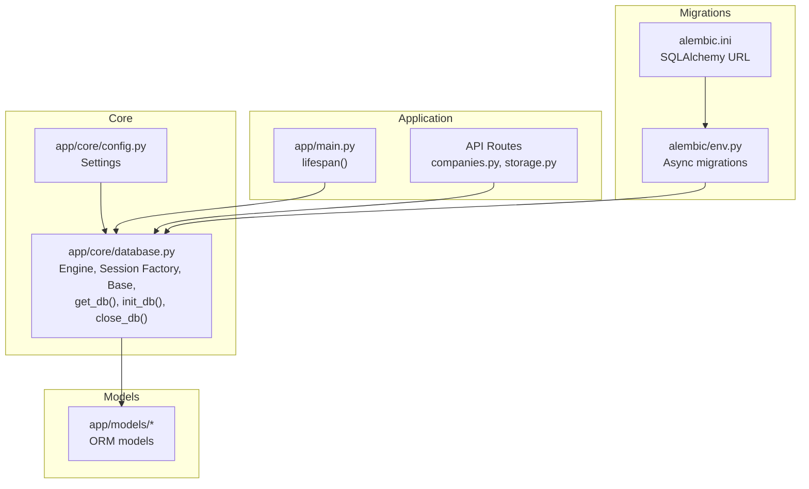
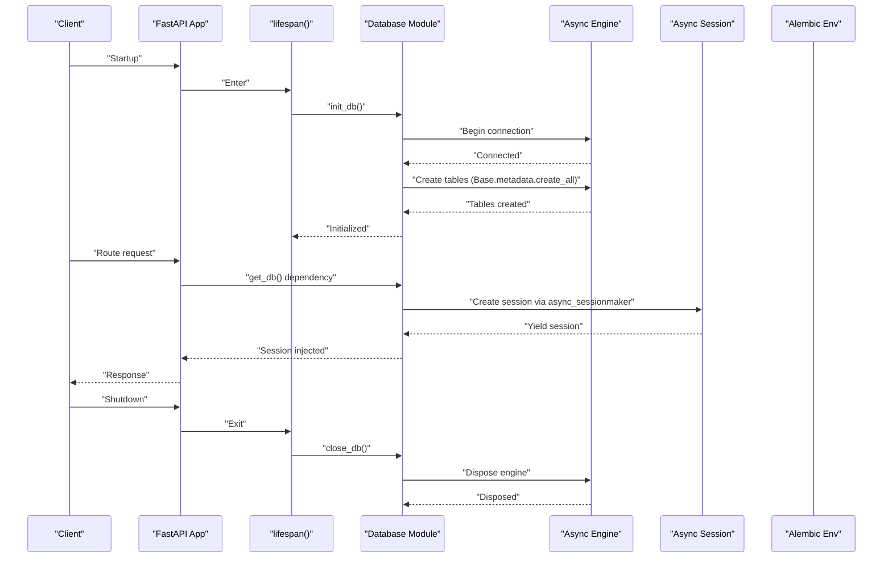
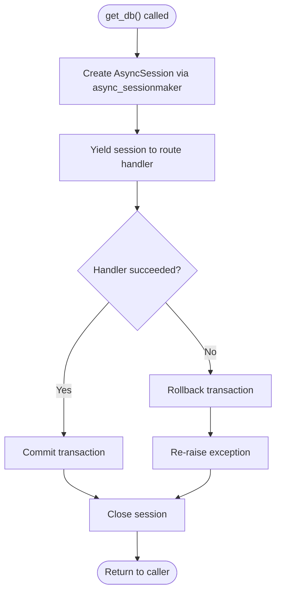
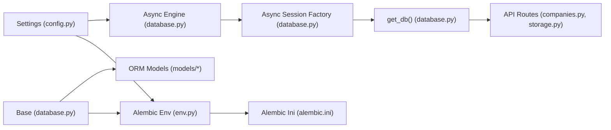

# Database Connection Management

<cite>
**Referenced Files in This Document**
- [app/core/database.py](file://app/core/database.py)
- [app/core/config.py](file://app/core/config.py)
- [alembic/env.py](file://alembic/env.py)
- [alembic.ini](file://alembic.ini)
- [app/main.py](file://app/main.py)
- [app/api/routes/companies.py](file://app/api/routes/companies.py)
- [app/api/routes/storage.py](file://app/api/routes/storage.py)
- [app/models/storage.py](file://app/models/storage.py)
- [app/models/company.py](file://app/models/company.py)
- [requirements.txt](file://requirements.txt)
</cite>

## Table of Contents
1. [Introduction](#introduction)
2. [Project Structure](#project-structure)
3. [Core Components](#core-components)
4. [Architecture Overview](#architecture-overview)
5. [Detailed Component Analysis](#detailed-component-analysis)
6. [Dependency Analysis](#dependency-analysis)
7. [Performance Considerations](#performance-considerations)
8. [Troubleshooting Guide](#troubleshooting-guide)
9. [Conclusion](#conclusion)

## Introduction
This document describes the ARV database connection management system built on async SQLAlchemy. It covers the async engine configuration with connection pooling parameters, echo settings, and connection lifecycle controls. It documents the async session factory and the dependency generator that supplies sessions to FastAPI routes, including automatic commit, rollback, and cleanup. It also details the declarative Base class used by ORM models, the database initialization routine, and graceful connection disposal. Finally, it provides practical examples from the codebase and discusses performance and error-handling considerations.

## Project Structure
The database subsystem is centered in the core module and integrates with FastAPI application lifecycle and Alembic migrations.

**Diagram sources**
- [app/core/database.py](file://app/core/database.py#L1-L103)
- [app/core/config.py](file://app/core/config.py#L1-L134)
- [app/main.py](file://app/main.py#L41-L80)
- [app/api/routes/companies.py](file://app/api/routes/companies.py#L1-L137)
- [app/api/routes/storage.py](file://app/api/routes/storage.py#L1-L63)
- [alembic/env.py](file://alembic/env.py#L1-L89)
- [alembic.ini](file://alembic.ini#L1-L113)

**Section sources**
- [app/core/database.py](file://app/core/database.py#L1-L103)
- [app/core/config.py](file://app/core/config.py#L1-L134)
- [app/main.py](file://app/main.py#L41-L80)
- [alembic/env.py](file://alembic/env.py#L1-L89)
- [alembic.ini](file://alembic.ini#L1-L113)

## Core Components
- Async engine configured with connection pooling, pre-ping, recycle, and echo settings.
- Async session factory with explicit session behavior flags.
- Dependency generator that yields sessions and ensures commit/rollback/cleanup.
- Declarative Base for ORM models.
- Initialization routine to create tables and a graceful disposal routine.

Key implementation references:
- Engine and session factory: [app/core/database.py](file://app/core/database.py#L1-L28)
- Dependency generator: [app/core/database.py](file://app/core/database.py#L30-L46)
- Initialization and disposal: [app/core/database.py](file://app/core/database.py#L48-L51), [app/core/database.py](file://app/core/database.py#L100-L103)
- Settings for engine parameters: [app/core/config.py](file://app/core/config.py#L37-L43)

**Section sources**
- [app/core/database.py](file://app/core/database.py#L1-L103)
- [app/core/config.py](file://app/core/config.py#L37-L43)

## Architecture Overview
The system uses an async SQLAlchemy engine and async sessions managed by a dependency generator. FastAPI’s lifespan manages initialization and teardown. Alembic handles migrations using an async engine.

**Diagram sources**
- [app/main.py](file://app/main.py#L41-L80)
- [app/core/database.py](file://app/core/database.py#L1-L103)
- [alembic/env.py](file://alembic/env.py#L66-L88)

## Detailed Component Analysis

### Async Engine Configuration
- Connection URL sourced from settings.
- Echo setting controlled by settings.
- Pool size and overflow controlled by settings.
- Pre-ping enabled to validate connections before use.
- Recycle set to a fixed interval to prevent stale connections.
- Additional driver-specific parameters are not set in the engine constructor.

Practical example references:
- Engine creation: [app/core/database.py](file://app/core/database.py#L8-L15)
- Settings for engine parameters: [app/core/config.py](file://app/core/config.py#L37-L43)

**Section sources**
- [app/core/database.py](file://app/core/database.py#L8-L15)
- [app/core/config.py](file://app/core/config.py#L37-L43)

### Async Session Factory and Session Behavior
- Session factory created with explicit class, expiration policy, autocommit, and autoflush flags.
- Sessions are created per request via the dependency generator.
- Expired objects are not expired on commit to reduce overhead.
- Autocommit is disabled to allow manual transaction control.
- Autoflush is disabled to defer flush until explicit commit.

Practical example references:
- Session factory: [app/core/database.py](file://app/core/database.py#L18-L24)

**Section sources**
- [app/core/database.py](file://app/core/database.py#L18-L24)

### Dependency Generator: get_db()
- Provides an AsyncSession to route handlers.
- Uses a context manager to ensure cleanup.
- Commits on success, rolls back on exceptions, and closes the session in all cases.
- Ensures that each request gets a fresh session and that resources are released.

Practical example references:
- Dependency generator: [app/core/database.py](file://app/core/database.py#L30-L46)

**Diagram sources**
- [app/core/database.py](file://app/core/database.py#L30-L46)

**Section sources**
- [app/core/database.py](file://app/core/database.py#L30-L46)

### Declarative Base for ORM Models
- Base class created for ORM models.
- Used by all models to register with metadata.
- Alembic targets this Base.metadata for migrations.

Practical example references:
- Base class: [app/core/database.py](file://app/core/database.py#L27-L27)
- Model usage: [app/models/storage.py](file://app/models/storage.py#L1-L81), [app/models/company.py](file://app/models/company.py#L1-L41)

**Section sources**
- [app/core/database.py](file://app/core/database.py#L27-L27)
- [app/models/storage.py](file://app/models/storage.py#L1-L81)
- [app/models/company.py](file://app/models/company.py#L1-L41)

### Database Initialization and Disposal
- Initialization creates tables using the Base metadata.
- Disposal gracefully closes all connections by disposing the engine.

Practical example references:
- Initialization: [app/core/database.py](file://app/core/database.py#L48-L51)
- Disposal: [app/core/database.py](file://app/core/database.py#L100-L103)
- Application lifecycle integration: [app/main.py](file://app/main.py#L41-L80)

**Section sources**
- [app/core/database.py](file://app/core/database.py#L48-L51)
- [app/core/database.py](file://app/core/database.py#L100-L103)
- [app/main.py](file://app/main.py#L41-L80)

### Alembic Integration for Async Migrations
- Alembic env configures the async engine from settings and sets target metadata to Base.metadata.
- Online migrations run with an async engine and NullPool to avoid pooling conflicts.
- Offline migrations use a configured URL.

Practical example references:
- Target metadata and URL override: [alembic/env.py](file://alembic/env.py#L10-L26)
- Async migrations runner: [alembic/env.py](file://alembic/env.py#L66-L88)
- Alembic URL default: [alembic.ini](file://alembic.ini#L59-L59)

**Section sources**
- [alembic/env.py](file://alembic/env.py#L10-L26)
- [alembic/env.py](file://alembic/env.py#L66-L88)
- [alembic.ini](file://alembic.ini#L59-L59)

### Example Usage in FastAPI Routes
- Routes inject AsyncSession via the get_db dependency.
- Typical patterns include fetching, adding, committing, and refreshing objects.
- Examples show explicit commit and refresh after write operations.

Practical example references:
- Companies route using get_db: [app/api/routes/companies.py](file://app/api/routes/companies.py#L16-L88)
- Storage route using get_db: [app/api/routes/storage.py](file://app/api/routes/storage.py#L15-L32)

**Section sources**
- [app/api/routes/companies.py](file://app/api/routes/companies.py#L16-L88)
- [app/api/routes/storage.py](file://app/api/routes/storage.py#L15-L32)

## Dependency Analysis
The database module depends on settings for configuration and on models for metadata. FastAPI routes depend on the dependency generator. Alembic depends on the Base metadata and settings.

**Diagram sources**
- [app/core/config.py](file://app/core/config.py#L37-L43)
- [app/core/database.py](file://app/core/database.py#L1-L103)
- [app/api/routes/companies.py](file://app/api/routes/companies.py#L1-L137)
- [app/api/routes/storage.py](file://app/api/routes/storage.py#L1-L63)
- [alembic/env.py](file://alembic/env.py#L1-L89)
- [alembic.ini](file://alembic.ini#L1-L113)

**Section sources**
- [app/core/database.py](file://app/core/database.py#L1-L103)
- [app/core/config.py](file://app/core/config.py#L1-L134)
- [alembic/env.py](file://alembic/env.py#L1-L89)
- [alembic.ini](file://alembic.ini#L1-L113)

## Performance Considerations
- Connection pooling
  - Pool size and max overflow are configurable and influence concurrency and memory usage.
  - Pre-ping reduces failures on stale connections.
  - Recycle prevents long-lived connections from accumulating issues.
  - Practical references: [app/core/database.py](file://app/core/database.py#L8-L15), [app/core/config.py](file://app/core/config.py#L37-L43)
- Echo
  - Echo can help diagnose SQL activity but should be disabled in production to avoid overhead.
  - Controlled by settings.
  - Practical reference: [app/core/config.py](file://app/core/config.py#L43-L43)
- Session behavior
  - Disabled autocommit and autoflush enable explicit control and reduce unnecessary flushes.
  - Expire-on-commit disabled to avoid extra expiring work.
  - Practical reference: [app/core/database.py](file://app/core/database.py#L18-L24)
- Transaction boundaries
  - Explicit commit/rollback in the dependency generator ensures correctness and resource cleanup.
  - Practical reference: [app/core/database.py](file://app/core/database.py#L30-L46)
- Driver and runtime
  - Async SQLAlchemy and asyncpg are used for async PostgreSQL connectivity.
  - Practical reference: [requirements.txt](file://requirements.txt#L1-L33)

[No sources needed since this section provides general guidance]

## Troubleshooting Guide
- Connection failures
  - Enable echo temporarily to inspect SQL and connection attempts.
  - Verify DATABASE_URL and credentials.
  - References: [app/core/config.py](file://app/core/config.py#L37-L43), [alembic.ini](file://alembic.ini#L59-L59)
- Stale connections
  - Ensure pool_pre_ping is enabled and pool_recycle is set appropriately.
  - References: [app/core/database.py](file://app/core/database.py#L12-L15)
- Migration issues
  - Confirm Alembic env targets Base.metadata and uses async engine.
  - References: [alembic/env.py](file://alembic/env.py#L10-L26), [alembic/env.py](file://alembic/env.py#L66-L88)
- Session leaks
  - The dependency generator guarantees close() is called in all cases.
  - References: [app/core/database.py](file://app/core/database.py#L30-L46)
- Graceful shutdown
  - Dispose the engine on shutdown to release connections.
  - References: [app/core/database.py](file://app/core/database.py#L100-L103), [app/main.py](file://app/main.py#L75-L79)

**Section sources**
- [app/core/config.py](file://app/core/config.py#L37-L43)
- [app/core/database.py](file://app/core/database.py#L10-L15)
- [alembic/env.py](file://alembic/env.py#L10-L26)
- [alembic/env.py](file://alembic/env.py#L66-L88)
- [alembic.ini](file://alembic.ini#L59-L59)
- [app/core/database.py](file://app/core/database.py#L30-L46)
- [app/core/database.py](file://app/core/database.py#L100-L103)
- [app/main.py](file://app/main.py#L75-L79)

## Conclusion
The ARV database connection management system uses async SQLAlchemy with a carefully tuned engine configuration and a robust dependency generator. The design ensures predictable transaction boundaries, efficient connection reuse, and safe lifecycle management. Alembic integration supports asynchronous migrations targeting the shared Base metadata. Together, these components provide a solid foundation for scalable and maintainable database operations.