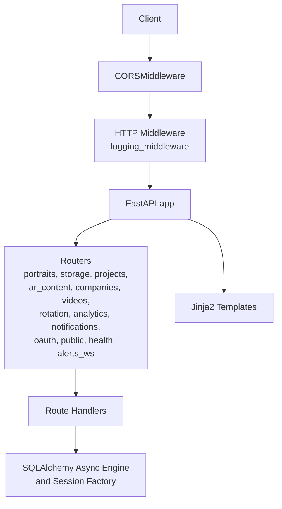
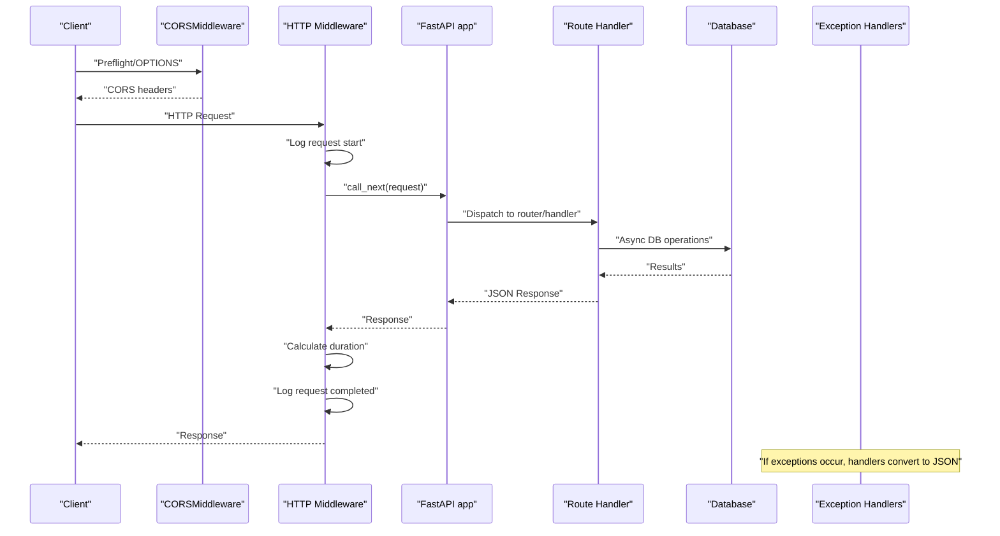
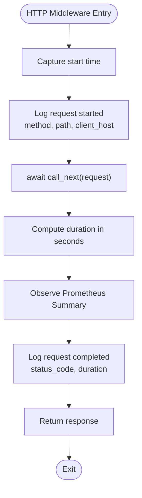
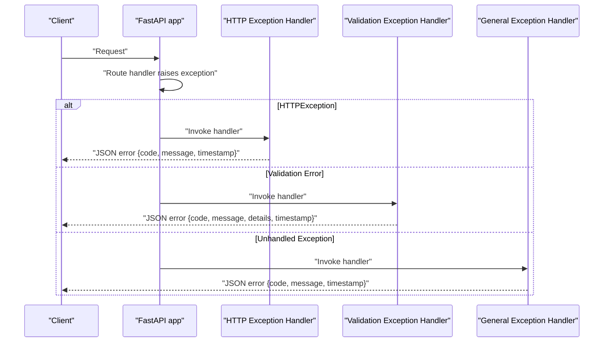
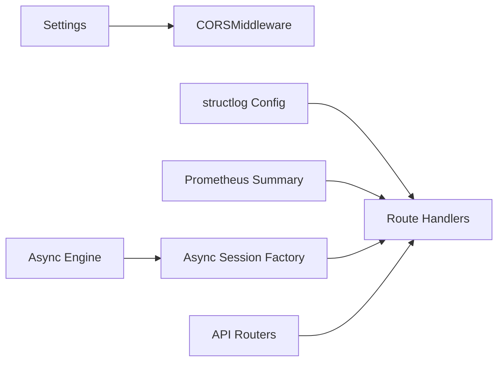

# Request Processing Pipeline

<cite>
**Referenced Files in This Document**
- [app/main.py](file://app/main.py)
- [app/core/config.py](file://app/core/config.py)
- [app/core/database.py](file://app/core/database.py)
- [app/api/routes/portraits.py](file://app/api/routes/portraits.py)
- [app/api/routes/health.py](file://app/api/routes/health.py)
- [requirements.txt](file://requirements.txt)
</cite>

## Table of Contents
1. [Introduction](#introduction)
2. [Project Structure](#project-structure)
3. [Core Components](#core-components)
4. [Architecture Overview](#architecture-overview)
5. [Detailed Component Analysis](#detailed-component-analysis)
6. [Dependency Analysis](#dependency-analysis)
7. [Performance Considerations](#performance-considerations)
8. [Security Considerations](#security-considerations)
9. [Troubleshooting Guide](#troubleshooting-guide)
10. [Conclusion](#conclusion)

## Introduction
This document describes the ARV request processing pipeline built on FastAPI. It covers the middleware chain (CORS, structured request logging with duration tracking), exception handling for HTTP exceptions, validation errors, and unhandled exceptions, and the end-to-end request flow from entry through middleware to route handlers and back through response processing. It also explains how logging captures request metadata and response timing using structlog, and details the consistent JSON error responses returned by the exception handlers.

## Project Structure
The ARV application centers around a FastAPI application instance that registers:
- CORS middleware
- A custom HTTP middleware for request logging and timing
- Exception handlers for HTTP exceptions, validation errors, and general exceptions
- Multiple API routers grouped under the /api prefix

**Diagram sources**
- [app/main.py](file://app/main.py#L84-L106)
- [app/main.py](file://app/main.py#L108-L142)
- [app/main.py](file://app/main.py#L230-L261)
- [app/core/database.py](file://app/core/database.py#L1-L28)

**Section sources**
- [app/main.py](file://app/main.py#L84-L106)
- [app/main.py](file://app/main.py#L108-L142)
- [app/main.py](file://app/main.py#L230-L261)
- [app/core/database.py](file://app/core/database.py#L1-L28)

## Core Components
- CORS middleware configured with origins parsed from settings.
- Structured logging configured globally with structlog, switching between console and JSON renderers based on settings.
- HTTP middleware that logs request start and completion, measures duration, and records metrics.
- Exception handlers for Starlette HTTP exceptions, Pydantic validation errors, and general exceptions, returning consistent JSON error payloads.
- Database engine and session factory for async ORM operations.
- API routers registered under /api with multiple route groups.

**Section sources**
- [app/main.py](file://app/main.py#L19-L37)
- [app/main.py](file://app/main.py#L84-L106)
- [app/main.py](file://app/main.py#L108-L142)
- [app/main.py](file://app/main.py#L144-L209)
- [app/core/database.py](file://app/core/database.py#L1-L28)
- [app/core/config.py](file://app/core/config.py#L112-L126)

## Architecture Overview
The request processing pipeline follows a strict order:
1. CORS middleware validates cross-origin requests against settings-defined origins.
2. HTTP middleware logs the request start, invokes downstream handlers, calculates duration, and logs completion.
3. Route handlers execute business logic and return responses.
4. Exception handlers convert exceptions into standardized JSON responses.
5. Response flows back through the middleware chain to the client.

**Diagram sources**
- [app/main.py](file://app/main.py#L84-L106)
- [app/main.py](file://app/main.py#L108-L142)
- [app/main.py](file://app/main.py#L144-L209)
- [app/core/database.py](file://app/core/database.py#L30-L46)

## Detailed Component Analysis

### CORS Middleware
- Registered using FastAPI’s CORSMiddleware.
- Origins are sourced from settings.cors_origins_list, which is derived from the CORS_ORIGINS environment variable and parsed into a list.
- Credentials, methods, and headers are allowed broadly for development and testing.

**Section sources**
- [app/main.py](file://app/main.py#L84-L106)
- [app/core/config.py](file://app/core/config.py#L112-L126)

### Structured Logging Configuration
- structlog is configured with processors for context merging, level, stack info, exception injection, ISO timestamp, and either console or JSON renderer depending on settings.DEBUG.
- Wrapper class and logger factory are set for filtering and performance.
- Logging level is controlled by settings.LOG_LEVEL.

**Section sources**
- [app/main.py](file://app/main.py#L19-L37)
- [app/core/config.py](file://app/core/config.py#L18-L20)

### HTTP Middleware: Request Logging and Duration Tracking
- An HTTP middleware wraps all requests.
- Logs include method, path, and client host on request start.
- Calculates duration in seconds and records a Prometheus Summary metric labeled by method and path.
- Logs completion with status code and duration.
- Uses structlog for structured output.

**Diagram sources**
- [app/main.py](file://app/main.py#L108-L142)

**Section sources**
- [app/main.py](file://app/main.py#L108-L142)

### Exception Handling Strategy
The application defines three exception handlers:
- StarletteHTTPException: Returns a JSON error object with code, message, and timestamp. Logs at warning level.
- RequestValidationError: Returns a JSON error object with code 422, message “Validation error”, details from validation errors, and timestamp. Logs at warning level.
- General Exception: Returns a JSON error object with code 500 and message “Internal server error”. In debug mode, the raw exception message is included; otherwise, a generic message is returned. Logs at error level with exception info.

**Diagram sources**
- [app/main.py](file://app/main.py#L144-L209)

**Section sources**
- [app/main.py](file://app/main.py#L144-L209)

### Route Handlers and Data Access
- Route handlers are defined in individual routers under app/api/routes. They depend on the async database session factory to perform ORM operations.
- Example handlers include upload and retrieval of portraits, health checks, and company management endpoints.

**Section sources**
- [app/api/routes/portraits.py](file://app/api/routes/portraits.py#L22-L69)
- [app/api/routes/portraits.py](file://app/api/routes/portraits.py#L71-L116)
- [app/api/routes/health.py](file://app/api/routes/health.py#L36-L119)
- [app/core/database.py](file://app/core/database.py#L30-L46)

### Metrics Exposure
- A Prometheus Summary metric named api_request_duration_seconds is created and used inside the HTTP middleware to observe request durations.
- A dedicated /api/health/metrics endpoint exposes Prometheus metrics using the prometheus-client library.

**Section sources**
- [app/main.py](file://app/main.py#L108-L142)
- [app/api/routes/health.py](file://app/api/routes/health.py#L122-L139)
- [requirements.txt](file://requirements.txt#L30-L33)

## Dependency Analysis
- The application depends on FastAPI for routing and ASGI server integration, structlog for structured logging, prometheus-client for metrics, and SQLAlchemy 2.x async for ORM.
- CORS origins parsing is centralized in settings and consumed by the CORS middleware.
- Database engine and session factory are created from settings and used by route handlers.

**Diagram sources**
- [app/core/config.py](file://app/core/config.py#L112-L126)
- [app/main.py](file://app/main.py#L19-L37)
- [app/main.py](file://app/main.py#L108-L142)
- [app/core/database.py](file://app/core/database.py#L1-L28)

**Section sources**
- [app/core/config.py](file://app/core/config.py#L112-L126)
- [app/main.py](file://app/main.py#L19-L37)
- [app/main.py](file://app/main.py#L108-L142)
- [app/core/database.py](file://app/core/database.py#L1-L28)
- [requirements.txt](file://requirements.txt#L1-L33)

## Performance Considerations
- Logging overhead:
  - Structured logging uses processors that add minimal overhead; in production, JSONRenderer is used for efficient machine-readable logs.
  - The HTTP middleware performs timestamp capture and a single Prometheus observation per request; overhead is negligible compared to handler workloads.
- Database pooling:
  - Async engine is configured with pool_size and max_overflow to manage concurrent connections efficiently.
- Metrics:
  - Prometheus Summary metric labels by method and path; ensure cardinality remains bounded to avoid excessive memory growth.

[No sources needed since this section provides general guidance]

## Security Considerations
- CORS origins:
  - Origins are parsed from settings and enforced by CORSMiddleware. Ensure CORS_ORIGINS is restricted in production environments.
- Error exposure:
  - In non-debug mode, general exceptions return a generic “Internal server error” message. In debug mode, the raw exception message may be included. Prefer non-debug mode for production to avoid leaking sensitive information.
- Validation errors:
  - Validation errors include details from the underlying validator; consider sanitizing or limiting detail depth in production if needed.

**Section sources**
- [app/core/config.py](file://app/core/config.py#L112-L126)
- [app/main.py](file://app/main.py#L144-L209)

## Troubleshooting Guide
- CORS preflight failures:
  - Verify CORS_ORIGINS in environment variables and ensure settings.cors_origins_list contains the requesting origin.
- Missing or malformed logs:
  - Confirm structlog configuration is executed before app creation and that LOG_LEVEL is set appropriately.
- Unexpected 500 errors:
  - Inspect the general exception handler logs for error_type and path; enable DEBUG temporarily to reveal raw exception details during development.
- Validation errors:
  - Review validation exception handler logs for details; ensure request payloads conform to expected schemas.
- Metrics not appearing:
  - Ensure Prometheus client is installed and the /api/health/metrics endpoint is reachable.

**Section sources**
- [app/main.py](file://app/main.py#L19-L37)
- [app/main.py](file://app/main.py#L144-L209)
- [app/api/routes/health.py](file://app/api/routes/health.py#L122-L139)
- [requirements.txt](file://requirements.txt#L30-L33)

## Conclusion
The ARV request processing pipeline is a robust, structured FastAPI application with explicit CORS enforcement, comprehensive request logging and timing, and consistent JSON error responses. The middleware chain ensures predictable behavior across all routes, while exception handlers provide clear feedback to clients. Structured logging and Prometheus metrics support operational visibility, and database pooling enables scalable async operations.