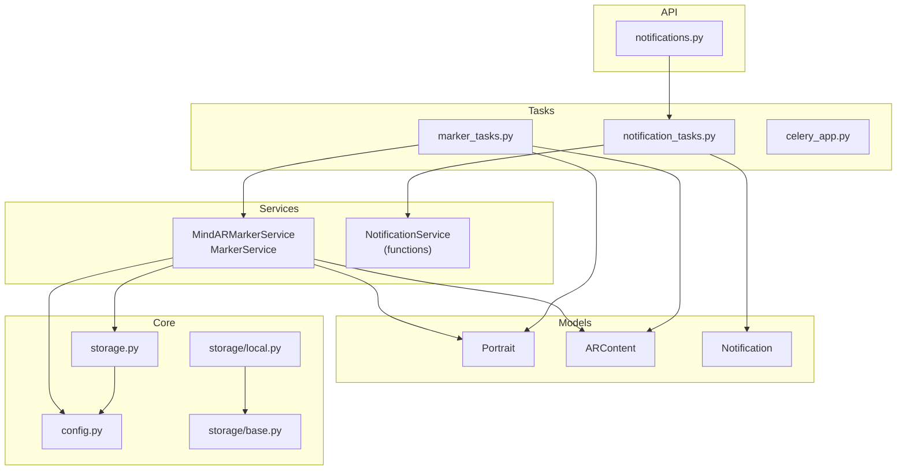
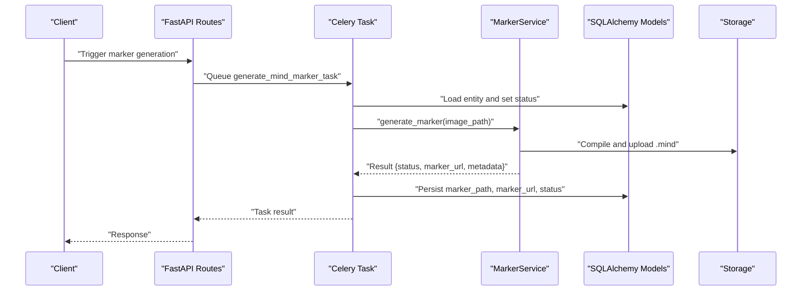
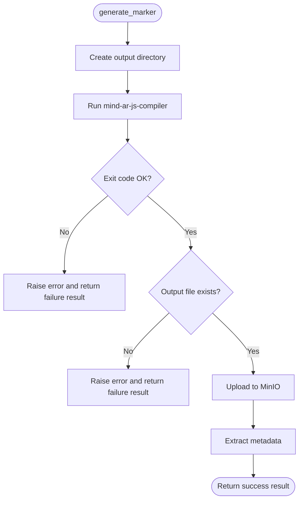
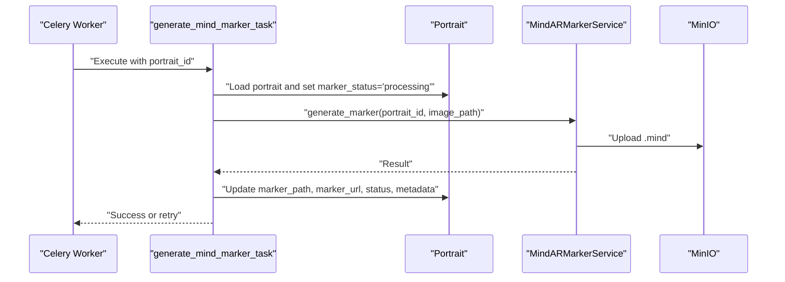
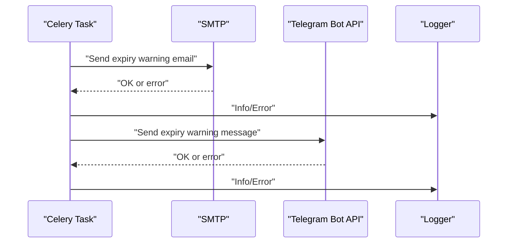
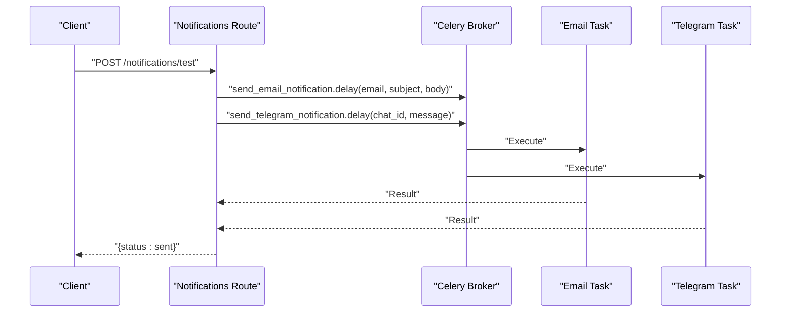
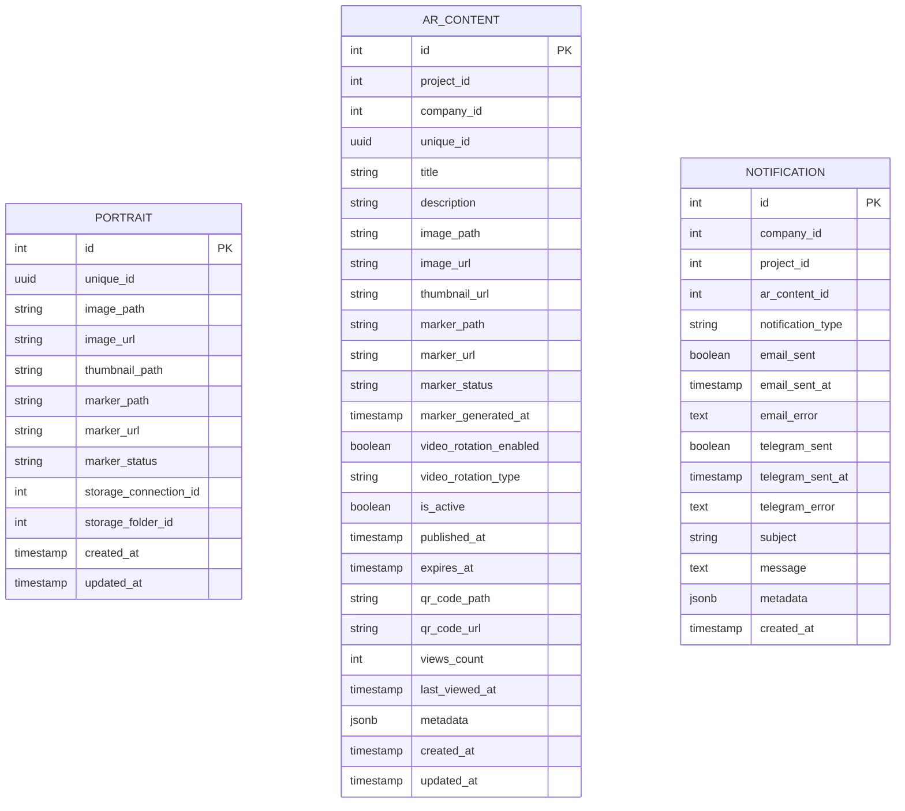
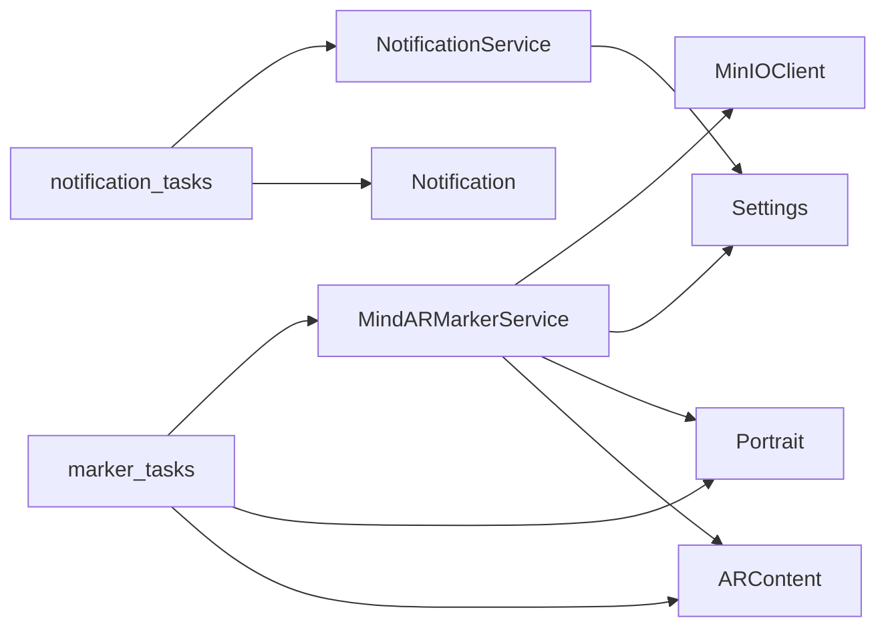

# Business Logic & Services

<cite>
**Referenced Files in This Document**
- [marker_service.py](file://app/services/marker_service.py)
- [notification_service.py](file://app/services/notification_service.py)
- [marker_tasks.py](file://app/tasks/marker_tasks.py)
- [notification_tasks.py](file://app/tasks/notification_tasks.py)
- [celery_app.py](file://app/tasks/celery_app.py)
- [notifications.py](file://app/api/routes/notifications.py)
- [notification.py](file://app/models/notification.py)
- [portrait.py](file://app/models/portrait.py)
- [ar_content.py](file://app/models/ar_content.py)
- [config.py](file://app/core/config.py)
- [storage.py](file://app/core/storage.py)
- [base.py](file://app/services/storage/base.py)
- [local.py](file://app/services/storage/local.py)
</cite>

## Table of Contents
1. [Introduction](#introduction)
2. [Project Structure](#project-structure)
3. [Core Components](#core-components)
4. [Architecture Overview](#architecture-overview)
5. [Detailed Component Analysis](#detailed-component-analysis)
6. [Dependency Analysis](#dependency-analysis)
7. [Performance Considerations](#performance-considerations)
8. [Troubleshooting Guide](#troubleshooting-guide)
9. [Conclusion](#conclusion)

## Introduction
This document focuses on the ARV platform’s business logic services with emphasis on MarkerService and NotificationService. It explains how these services encapsulate business rules for:
- Marker generation and validation
- Notification processing via email and Telegram
- Content management and persistence

It also documents the service interfaces, parameters, return values, invocation relationships, and integration points with API routes, database models, and background tasks. Practical examples are referenced from the actual codebase, and guidance is provided for performance optimization and error handling.

## Project Structure
The business logic services reside under app/services and integrate with:
- Background tasks under app/tasks
- API routes under app/api/routes
- Domain models under app/models
- Configuration under app/core/config.py
- Storage utilities under app/core/storage.py and app/services/storage/*

**Diagram sources**
- [marker_service.py](file://app/services/marker_service.py#L1-L134)
- [notification_service.py](file://app/services/notification_service.py#L1-L81)
- [marker_tasks.py](file://app/tasks/marker_tasks.py#L1-L173)
- [notification_tasks.py](file://app/tasks/notification_tasks.py#L1-L61)
- [celery_app.py](file://app/tasks/celery_app.py#L1-L50)
- [notifications.py](file://app/api/routes/notifications.py#L1-L40)
- [notification.py](file://app/models/notification.py#L1-L32)
- [portrait.py](file://app/models/portrait.py#L1-L28)
- [ar_content.py](file://app/models/ar_content.py#L1-L46)
- [config.py](file://app/core/config.py#L1-L134)
- [storage.py](file://app/core/storage.py#L1-L71)
- [base.py](file://app/services/storage/base.py#L1-L78)
- [local.py](file://app/services/storage/local.py#L1-L170)

**Section sources**
- [marker_service.py](file://app/services/marker_service.py#L1-L134)
- [notification_service.py](file://app/services/notification_service.py#L1-L81)
- [marker_tasks.py](file://app/tasks/marker_tasks.py#L1-L173)
- [notification_tasks.py](file://app/tasks/notification_tasks.py#L1-L61)
- [celery_app.py](file://app/tasks/celery_app.py#L1-L50)
- [notifications.py](file://app/api/routes/notifications.py#L1-L40)
- [notification.py](file://app/models/notification.py#L1-L32)
- [portrait.py](file://app/models/portrait.py#L1-L28)
- [ar_content.py](file://app/models/ar_content.py#L1-L46)
- [config.py](file://app/core/config.py#L1-L134)
- [storage.py](file://app/core/storage.py#L1-L71)
- [base.py](file://app/services/storage/base.py#L1-L78)
- [local.py](file://app/services/storage/local.py#L1-L170)

## Core Components
- MindARMarkerService: Encapsulates marker generation using the Mind AR compiler, metadata extraction, and validation. It persists results to storage and updates domain models.
- NotificationService: Provides functions to send expiry warnings via email and Telegram, with robust error handling and logging.

Key responsibilities:
- MarkerService
  - Generate .mind marker files from images
  - Extract metadata from generated files
  - Validate marker file sizes
  - Upload artifacts to storage and update entity records
- NotificationService
  - Build and send expiry warning emails
  - Send Telegram messages asynchronously
  - Log outcomes and failures

**Section sources**
- [marker_service.py](file://app/services/marker_service.py#L1-L134)
- [notification_service.py](file://app/services/notification_service.py#L1-L81)

## Architecture Overview
The business logic integrates with FastAPI routes, Celery tasks, and SQLAlchemy models. Background tasks orchestrate long-running operations, while services encapsulate domain-specific logic.

**Diagram sources**
- [marker_tasks.py](file://app/tasks/marker_tasks.py#L39-L90)
- [marker_service.py](file://app/services/marker_service.py#L16-L104)
- [portrait.py](file://app/models/portrait.py#L1-L28)
- [storage.py](file://app/core/storage.py#L44-L67)

## Detailed Component Analysis

### MindARMarkerService
MindARMarkerService encapsulates the business logic for generating Mind AR marker files, validating them, and extracting metadata. It interacts with:
- Compiler via subprocess
- Storage via MinIO client
- Domain models for persistence

Interfaces and parameters:
- generate_marker(portrait_id, image_path, output_dir="storage/markers") -> dict
  - Returns a structured result with status, marker path, marker URL, and metadata
  - On failure, returns a structured error result
- _extract_marker_metadata(marker_file) -> dict
  - Reads file size and returns metadata
- validate_marker(marker_path) -> bool
  - Validates existence and approximate size bounds

Processing logic:
- Creates output directory and targets.mind
- Invokes mind-ar-js-compiler with configured max features
- Verifies exit code and file presence
- Uploads to MinIO bucket (markers)
- Extracts metadata and logs metrics

**Diagram sources**
- [marker_service.py](file://app/services/marker_service.py#L16-L104)

**Section sources**
- [marker_service.py](file://app/services/marker_service.py#L1-L134)
- [storage.py](file://app/core/storage.py#L44-L67)
- [config.py](file://app/core/config.py#L27-L30)

### Marker Tasks Orchestration
Background tasks coordinate marker generation:
- generate_mind_marker_task(portrait_id): Loads a portrait, sets processing status, invokes service, persists results, and handles retries with exponential backoff
- generate_ar_content_marker_task(content_id): Similar flow for ARContent, using storage provider abstraction and remote storage paths

**Diagram sources**
- [marker_tasks.py](file://app/tasks/marker_tasks.py#L39-L90)
- [marker_service.py](file://app/services/marker_service.py#L16-L104)
- [portrait.py](file://app/models/portrait.py#L1-L28)

**Section sources**
- [marker_tasks.py](file://app/tasks/marker_tasks.py#L1-L173)
- [marker_service.py](file://app/services/marker_service.py#L1-L134)
- [portrait.py](file://app/models/portrait.py#L1-L28)

### NotificationService
NotificationService provides two functions:
- send_expiry_warning_email(project_name, company_email, expires_at_str, ar_items_count) -> bool
  - Builds and sends an expiry warning email via SMTP
  - Returns success/failure with logging
- send_expiry_warning_telegram(company_chat_id, project_name, expires_at_str, ar_items_count) -> bool
  - Sends a Telegram message via Bot API asynchronously
  - Returns success/failure with logging

**Diagram sources**
- [notification_service.py](file://app/services/notification_service.py#L13-L81)
- [notification_tasks.py](file://app/tasks/notification_tasks.py#L1-L61)

**Section sources**
- [notification_service.py](file://app/services/notification_service.py#L1-L81)
- [notification_tasks.py](file://app/tasks/notification_tasks.py#L1-L61)

### API Integration
- Notifications route lists stored notifications and triggers test notifications by queuing Celery tasks
- Test endpoint sends email and Telegram notifications via background tasks

**Diagram sources**
- [notifications.py](file://app/api/routes/notifications.py#L13-L40)
- [notification_tasks.py](file://app/tasks/notification_tasks.py#L24-L61)

**Section sources**
- [notifications.py](file://app/api/routes/notifications.py#L1-L40)
- [notification_tasks.py](file://app/tasks/notification_tasks.py#L1-L61)

### Domain Models and Persistence
- Portrait: Stores image and marker metadata, plus marker status and timestamps
- ARContent: Stores AR content metadata, marker fields, and lifecycle fields
- Notification: Stores notification attempts and metadata for email/Telegram delivery

**Diagram sources**
- [portrait.py](file://app/models/portrait.py#L1-L28)
- [ar_content.py](file://app/models/ar_content.py#L1-L46)
- [notification.py](file://app/models/notification.py#L1-L32)

**Section sources**
- [portrait.py](file://app/models/portrait.py#L1-L28)
- [ar_content.py](file://app/models/ar_content.py#L1-L46)
- [notification.py](file://app/models/notification.py#L1-L32)

## Dependency Analysis
- MarkerService depends on:
  - MinIO client for uploads
  - Settings for compiler path and limits
  - Domain models for persistence
- MarkerTasks depend on:
  - Async database sessions
  - MarkerService for generation
  - Celery for task orchestration
- NotificationService depends on:
  - SMTP settings for email
  - Telegram Bot token for messaging
  - Structured logging for observability

**Diagram sources**
- [marker_service.py](file://app/services/marker_service.py#L1-L134)
- [marker_tasks.py](file://app/tasks/marker_tasks.py#L1-L173)
- [notification_service.py](file://app/services/notification_service.py#L1-L81)
- [notification_tasks.py](file://app/tasks/notification_tasks.py#L1-L61)
- [storage.py](file://app/core/storage.py#L1-L71)
- [config.py](file://app/core/config.py#L1-L134)
- [notification.py](file://app/models/notification.py#L1-L32)

**Section sources**
- [marker_service.py](file://app/services/marker_service.py#L1-L134)
- [marker_tasks.py](file://app/tasks/marker_tasks.py#L1-L173)
- [notification_service.py](file://app/services/notification_service.py#L1-L81)
- [notification_tasks.py](file://app/tasks/notification_tasks.py#L1-L61)
- [storage.py](file://app/core/storage.py#L1-L71)
- [config.py](file://app/core/config.py#L1-L134)
- [notification.py](file://app/models/notification.py#L1-L32)

## Performance Considerations
- Asynchronous subprocess execution: The compiler is invoked asynchronously to avoid blocking the event loop during marker generation.
- Exponential backoff: Marker tasks retry with increasing delays to handle transient failures.
- Size validation: Pre-validate marker file size to detect corrupted outputs early.
- Storage upload batching: Prefer remote storage providers for scalable artifact hosting.
- Logging and metrics: Use structured logging to track durations and outcomes for optimization.

[No sources needed since this section provides general guidance]

## Troubleshooting Guide
Common issues and resolutions:
- Compiler failures
  - Symptoms: Non-zero exit code or missing output file
  - Resolution: Inspect stderr logs, verify image path, confirm compiler availability, and adjust max features setting
  - Section sources
    - [marker_service.py](file://app/services/marker_service.py#L43-L72)
    - [config.py](file://app/core/config.py#L27-L30)
- Storage upload errors
  - Symptoms: MinIO upload exceptions
  - Resolution: Verify endpoint, credentials, bucket policies, and network connectivity
  - Section sources
    - [storage.py](file://app/core/storage.py#L44-L67)
- Email delivery failures
  - Symptoms: SMTP exceptions or authentication errors
  - Resolution: Confirm SMTP host/port/credentials and TLS settings
  - Section sources
    - [notification_service.py](file://app/services/notification_service.py#L37-L47)
    - [config.py](file://app/core/config.py#L78-L85)
- Telegram messaging failures
  - Symptoms: Non-200 responses or exceptions
  - Resolution: Validate bot token and chat ID, inspect response status
  - Section sources
    - [notification_service.py](file://app/services/notification_service.py#L63-L80)
    - [config.py](file://app/core/config.py#L86-L89)
- Task retries and dead letters
  - Symptoms: Repeated failures despite retries
  - Resolution: Inspect Celery queue configuration, task time limits, and worker logs
  - Section sources
    - [celery_app.py](file://app/tasks/celery_app.py#L14-L30)
    - [marker_tasks.py](file://app/tasks/marker_tasks.py#L76-L82)

## Conclusion
MarkerService and NotificationService encapsulate core business logic for AR marker generation and notification delivery. They integrate cleanly with Celery tasks, FastAPI routes, and SQLAlchemy models, leveraging structured logging and robust error handling. By following the patterns documented here—size validation, asynchronous processing, and resilient retries—you can extend and maintain these services effectively across phases of development.