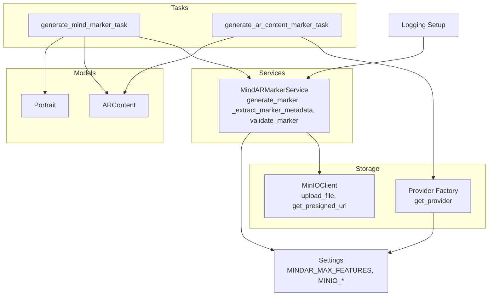
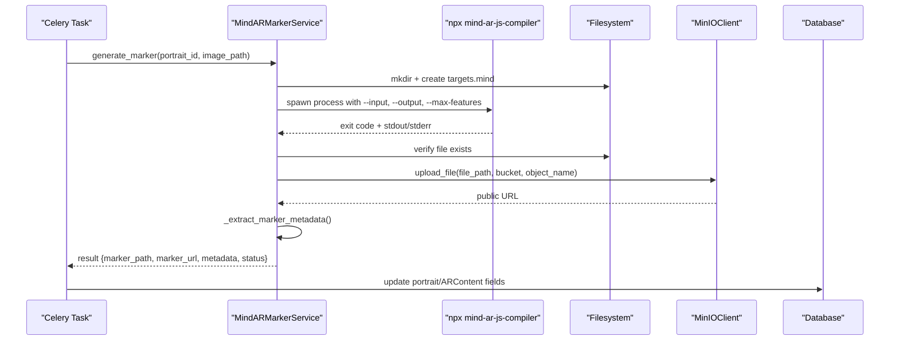
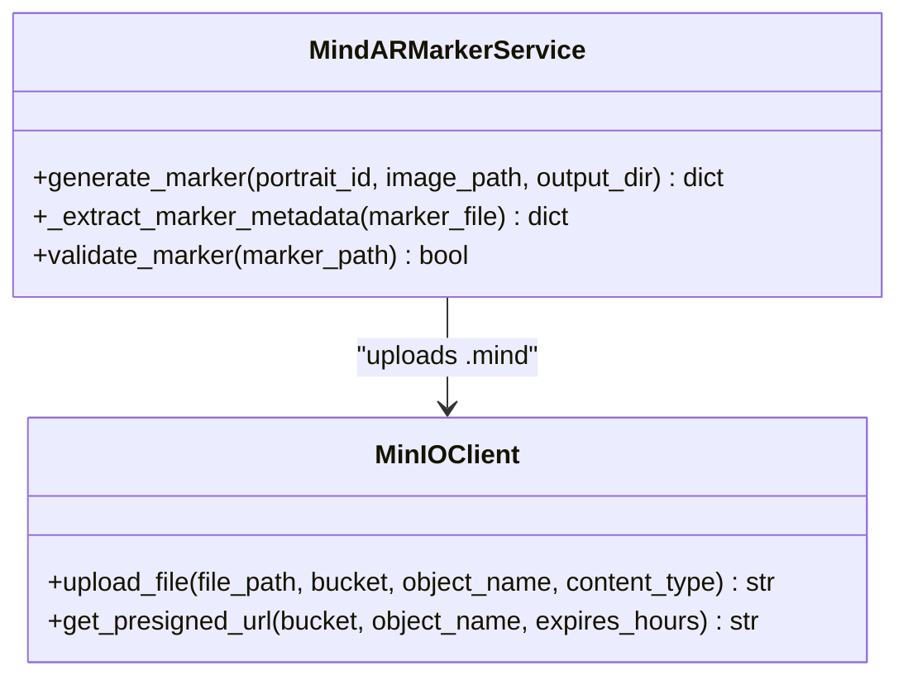
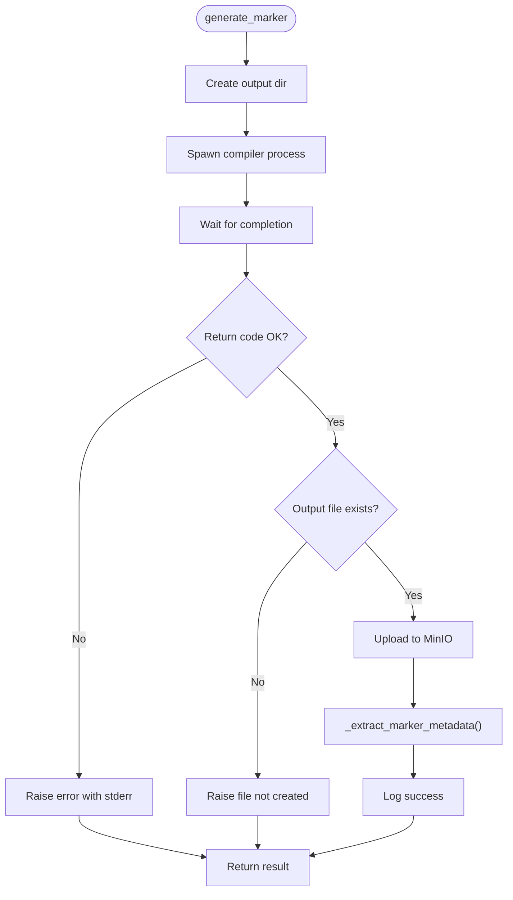
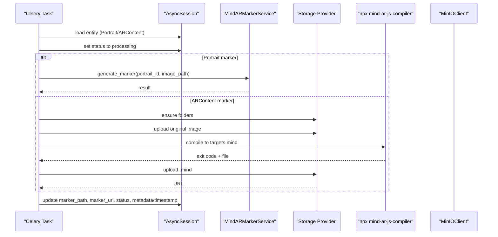
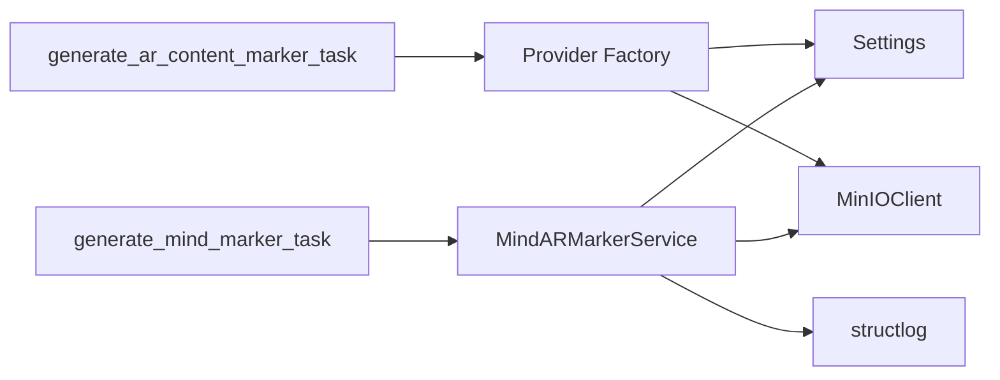

# Marker Service

<cite>
**Referenced Files in This Document**
- [marker_service.py](file://app/services/marker_service.py)
- [marker_tasks.py](file://app/tasks/marker_tasks.py)
- [config.py](file://app/core/config.py)
- [storage.py](file://app/core/storage.py)
- [ar_content.py](file://app/models/ar_content.py)
- [portrait.py](file://app/models/portrait.py)
- [factory.py](file://app/services/storage/factory.py)
- [main.py](file://app/main.py)
- [.env.example](file://.env.example)
</cite>

## Table of Contents
1. [Introduction](#introduction)
2. [Project Structure](#project-structure)
3. [Core Components](#core-components)
4. [Architecture Overview](#architecture-overview)
5. [Detailed Component Analysis](#detailed-component-analysis)
6. [Dependency Analysis](#dependency-analysis)
7. [Performance Considerations](#performance-considerations)
8. [Troubleshooting Guide](#troubleshooting-guide)
9. [Conclusion](#conclusion)
10. [Appendices](#appendices)

## Introduction
This document explains the MarkerService component of the ARV platform with a focus on the MindARMarkerService class. It covers how AR markers are generated from portrait images, how metadata is extracted, how validation ensures file integrity, and how the system integrates with external tools and cloud storage. It also details error handling, performance considerations, and configuration parameters that influence marker quality and reliability.

## Project Structure
The marker generation pipeline spans several modules:
- Services: MindARMarkerService orchestrates marker generation, metadata extraction, and validation.
- Tasks: Celery tasks coordinate asynchronous generation and persist results to the database.
- Storage: MinIO client and provider factory handle uploads and bucket policies.
- Models: ARContent and Portrait track marker status, URLs, and metadata.
- Config: Centralized settings define compiler invocation and storage endpoints.

**Diagram sources**
- [marker_service.py](file://app/services/marker_service.py#L1-L134)
- [marker_tasks.py](file://app/tasks/marker_tasks.py#L1-L173)
- [storage.py](file://app/core/storage.py#L1-L71)
- [factory.py](file://app/services/storage/factory.py#L1-L31)
- [ar_content.py](file://app/models/ar_content.py#L1-L45)
- [portrait.py](file://app/models/portrait.py#L1-L28)
- [config.py](file://app/core/config.py#L1-L134)
- [main.py](file://app/main.py#L1-L141)

**Section sources**
- [marker_service.py](file://app/services/marker_service.py#L1-L134)
- [marker_tasks.py](file://app/tasks/marker_tasks.py#L1-L173)
- [config.py](file://app/core/config.py#L1-L134)
- [storage.py](file://app/core/storage.py#L1-L71)
- [factory.py](file://app/services/storage/factory.py#L1-L31)
- [ar_content.py](file://app/models/ar_content.py#L1-L45)
- [portrait.py](file://app/models/portrait.py#L1-L28)
- [main.py](file://app/main.py#L1-L141)

## Core Components
- MindARMarkerService: Asynchronous service responsible for invoking the Mind AR compiler, uploading artifacts to MinIO, extracting metadata, and validating marker files.
- Celery tasks: Orchestrate marker generation for both portrait-based and AR content-based flows, updating database records and handling retries.
- MinIOClient: Provides upload and policy management for MinIO buckets.
- Provider factory: Selects appropriate storage provider (MinIO, local disk, Yandex Disk) based on configuration.
- Models: Track marker paths, URLs, statuses, and metadata for both Portrait and ARContent entities.

Key responsibilities:
- Generate .mind files from portrait images using npx mind-ar-js-compiler.
- Manage file I/O asynchronously with pathlib and asyncio subprocesses.
- Upload marker files to MinIO with configurable bucket selection and object naming.
- Extract metadata from .mind files and validate file integrity.
- Integrate with Celery tasks for reliable asynchronous processing.

**Section sources**
- [marker_service.py](file://app/services/marker_service.py#L1-L134)
- [marker_tasks.py](file://app/tasks/marker_tasks.py#L1-L173)
- [storage.py](file://app/core/storage.py#L1-L71)
- [factory.py](file://app/services/storage/factory.py#L1-L31)
- [ar_content.py](file://app/models/ar_content.py#L1-L45)
- [portrait.py](file://app/models/portrait.py#L1-L28)

## Architecture Overview
The marker generation flow integrates asynchronous Python services with external tooling and cloud storage:

**Diagram sources**
- [marker_service.py](file://app/services/marker_service.py#L16-L104)
- [marker_tasks.py](file://app/tasks/marker_tasks.py#L39-L90)
- [storage.py](file://app/core/storage.py#L44-L67)
- [config.py](file://app/core/config.py#L27-L30)

## Detailed Component Analysis

### MindARMarkerService
MindARMarkerService encapsulates the end-to-end marker generation workflow:
- generate_marker: Orchestrates compilation, upload, metadata extraction, and logging.
- _extract_marker_metadata: Reads file size and returns basic metadata.
- validate_marker: Validates file existence and size bounds.

Implementation highlights:
- Uses asyncio subprocess to invoke npx mind-ar-js-compiler with configured max features.
- Creates output directory per portrait_id and writes targets.mind.
- Uploads to MinIO using a dedicated bucket for markers or a fallback bucket.
- Logs structured events with structlog and returns normalized results.

**Diagram sources**
- [marker_service.py](file://app/services/marker_service.py#L13-L134)
- [storage.py](file://app/core/storage.py#L44-L67)

**Section sources**
- [marker_service.py](file://app/services/marker_service.py#L16-L134)

#### generate_marker
- Input: portrait_id, image_path, output_dir.
- Process:
  - Create output directory under output_dir/portrait_id.
  - Invoke compiler with --input, --output, --max-features.
  - Wait for completion and check return code.
  - Verify file creation.
  - Upload to MinIO with bucket selection and object naming convention.
  - Extract metadata and log success.
- Output: Normalized dictionary with marker_path, marker_url, metadata, and status.

**Diagram sources**
- [marker_service.py](file://app/services/marker_service.py#L33-L104)

**Section sources**
- [marker_service.py](file://app/services/marker_service.py#L33-L104)

#### _extract_marker_metadata
- Reads file size and returns format and version metadata.
- Handles exceptions and returns empty dict on failure.

**Section sources**
- [marker_service.py](file://app/services/marker_service.py#L105-L120)

#### validate_marker
- Checks file existence and enforces size bounds suitable for .mind files.

**Section sources**
- [marker_service.py](file://app/services/marker_service.py#L121-L130)

### Celery Tasks
Two Celery tasks coordinate marker generation:
- generate_mind_marker_task: Generates a marker for a Portrait entity, updates DB fields, and handles retries.
- generate_ar_content_marker_task: Generates a marker for ARContent, creates remote folders, uploads original image, compiles, uploads .mind, and updates DB.

Asynchronous execution:
- Uses asyncio.new_event_loop and runs_until_complete to execute async functions inside Celery tasks.
- Applies exponential backoff on retry.

**Diagram sources**
- [marker_tasks.py](file://app/tasks/marker_tasks.py#L39-L90)
- [marker_tasks.py](file://app/tasks/marker_tasks.py#L92-L173)

**Section sources**
- [marker_tasks.py](file://app/tasks/marker_tasks.py#L39-L90)
- [marker_tasks.py](file://app/tasks/marker_tasks.py#L92-L173)

### MinIO Integration
MinIOClient manages:
- Ensuring buckets exist and applying public read policy.
- Uploading files and returning public URLs.
- Presigned URLs for temporary access.

Bucket configuration:
- MINIO_BUCKET_MARKERS is used for markers; falls back to MINIO_BUCKET_NAME if not set.
- MINIO_ENDPOINT, MINIO_ACCESS_KEY, MINIO_SECRET_KEY, MINIO_SECURE are loaded from settings.

Object naming conventions:
- For MindARMarkerService: portrait_id/targets.mind.
- For ARContent flow: markers/mindar_targets/<unique_id>.mind.

**Section sources**
- [storage.py](file://app/core/storage.py#L18-L67)
- [config.py](file://app/core/config.py#L62-L71)
- [marker_service.py](file://app/services/marker_service.py#L73-L80)
- [marker_tasks.py](file://app/tasks/marker_tasks.py#L150-L156)

### Storage Provider Factory
The provider factory selects the appropriate storage backend based on the StorageConnection provider:
- local_disk: merges credentials with base_path from the connection.
- minio: constructs MinIOProvider with endpoint, access_key, secret_key, secure.
- yandex_disk: requires oauth_token.

**Section sources**
- [factory.py](file://app/services/storage/factory.py#L8-L31)

### Models and Data Fields
- Portrait: tracks image_path, marker_path, marker_url, marker_status, and metadata.
- ARContent: tracks image_path, marker_path, marker_url, marker_status, marker_generated_at, and metadata.

These fields are updated by Celery tasks after successful marker generation.

**Section sources**
- [portrait.py](file://app/models/portrait.py#L1-L28)
- [ar_content.py](file://app/models/ar_content.py#L1-L45)
- [marker_tasks.py](file://app/tasks/marker_tasks.py#L56-L67)
- [marker_tasks.py](file://app/tasks/marker_tasks.py#L158-L163)

## Dependency Analysis
- MindARMarkerService depends on:
  - Settings for MINDAR_MAX_FEATURES and MINIO configuration.
  - MinIOClient for uploads.
  - Structlog for logging.
- Celery tasks depend on:
  - Async database sessions.
  - MindARMarkerService for portrait markers.
  - Provider factory for AR content markers.
- Storage layer depends on:
  - MinIO SDK and settings for endpoint and credentials.
  - Provider factory for runtime selection.

**Diagram sources**
- [marker_service.py](file://app/services/marker_service.py#L13-L134)
- [marker_tasks.py](file://app/tasks/marker_tasks.py#L39-L173)
- [storage.py](file://app/core/storage.py#L1-L71)
- [factory.py](file://app/services/storage/factory.py#L1-L31)
- [config.py](file://app/core/config.py#L1-L134)

**Section sources**
- [marker_service.py](file://app/services/marker_service.py#L13-L134)
- [marker_tasks.py](file://app/tasks/marker_tasks.py#L39-L173)
- [storage.py](file://app/core/storage.py#L1-L71)
- [factory.py](file://app/services/storage/factory.py#L1-L31)
- [config.py](file://app/core/config.py#L1-L134)

## Performance Considerations
- Subprocess timeouts: The current implementation does not set explicit timeouts for the compiler subprocess. Consider adding a timeout parameter to communicate() to prevent long-running or stuck processes.
- Binary file size constraints: validate_marker enforces a practical size range for .mind files. Adjust thresholds if marker sizes vary significantly in production.
- Logging overhead: Structured logging is enabled globally. Ensure log levels and renderers are tuned for production throughput.
- Concurrency: Celery tasks isolate workloads. For high concurrency, consider rate limiting or queue prioritization to avoid resource contention.
- Compiler tuning: MINDAR_MAX_FEATURES controls detector quality and file size. Larger values increase detection robustness but may increase file size and compilation time.

[No sources needed since this section provides general guidance]

## Troubleshooting Guide
Common issues and resolutions:
- Compilation failures:
  - Symptom: Non-zero return code from the compiler.
  - Action: Inspect stderr logs and ensure the input image_path is valid and accessible.
  - Related code: [marker_service.py](file://app/services/marker_service.py#L62-L68), [marker_tasks.py](file://app/tasks/marker_tasks.py#L146-L148)
- File system errors:
  - Symptom: Output file not created or permission denied.
  - Action: Verify output_dir permissions and free disk space; ensure the process has write access.
  - Related code: [marker_service.py](file://app/services/marker_service.py#L70-L71)
- Network/upload errors:
  - Symptom: MinIO upload failures or bucket policy issues.
  - Action: Confirm MINIO_ENDPOINT, credentials, and bucket existence; review bucket policy setup.
  - Related code: [storage.py](file://app/core/storage.py#L18-L43), [storage.py](file://app/core/storage.py#L52-L63)
- Validation failures:
  - Symptom: Marker rejected due to invalid size.
  - Action: Re-run generation with appropriate MINDAR_MAX_FEATURES and verify output file integrity.
  - Related code: [marker_service.py](file://app/services/marker_service.py#L121-L130)
- Logging and observability:
  - Use structlog-bound fields (e.g., portrait_id, image_path) to trace failures quickly.
  - Related code: [marker_service.py](file://app/services/marker_service.py#L33-L34), [main.py](file://app/main.py#L19-L37)

**Section sources**
- [marker_service.py](file://app/services/marker_service.py#L33-L34)
- [marker_service.py](file://app/services/marker_service.py#L62-L71)
- [marker_service.py](file://app/services/marker_service.py#L121-L130)
- [storage.py](file://app/core/storage.py#L18-L43)
- [storage.py](file://app/core/storage.py#L52-L63)
- [marker_tasks.py](file://app/tasks/marker_tasks.py#L146-L148)
- [main.py](file://app/main.py#L19-L37)

## Conclusion
The MindARMarkerService provides a robust, asynchronous pipeline for generating AR markers from portrait images. It integrates seamlessly with the Mind AR compiler, manages file I/O efficiently, and uploads artifacts to MinIO with clear bucket and naming conventions. The Celery tasks ensure reliable orchestration and persistence of marker metadata. Proper configuration of MINDAR_MAX_FEATURES and logging enables high-quality markers and effective troubleshooting.

[No sources needed since this section summarizes without analyzing specific files]

## Appendices

### Configuration Parameters
- MINDAR_MAX_FEATURES: Controls the number of features extracted by the compiler, influencing marker quality and file size.
- MINIO_ENDPOINT, MINIO_ACCESS_KEY, MINIO_SECRET_KEY, MINIO_SECURE: MinIO client configuration.
- MINIO_BUCKET_MARKERS: Bucket used for marker uploads; falls back to MINIO_BUCKET_NAME if unset.
- LOG_LEVEL: Global logging level affecting structured logs.

**Section sources**
- [config.py](file://app/core/config.py#L27-L30)
- [config.py](file://app/core/config.py#L62-L71)
- [.env.example](file://.env.example#L1-L70)

### Example Usage Scenarios
- Portrait-based marker generation:
  - Call generate_marker with portrait_id and image_path; the service writes targets.mind and returns marker_url.
  - Related code: [marker_service.py](file://app/services/marker_service.py#L16-L104)
- AR content-based marker generation:
  - Celery task generates markers for ARContent, uploads original images, compiles, and persists results.
  - Related code: [marker_tasks.py](file://app/tasks/marker_tasks.py#L92-L173)

**Section sources**
- [marker_service.py](file://app/services/marker_service.py#L16-L104)
- [marker_tasks.py](file://app/tasks/marker_tasks.py#L92-L173)