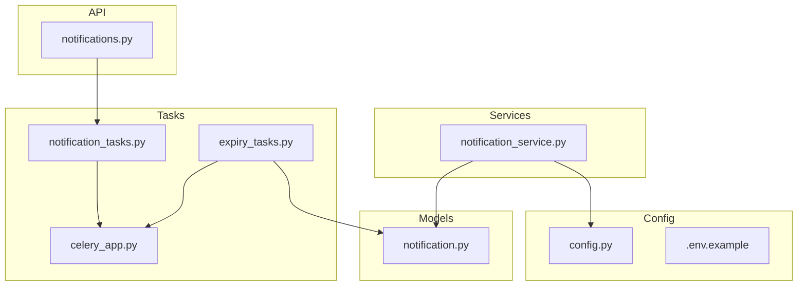
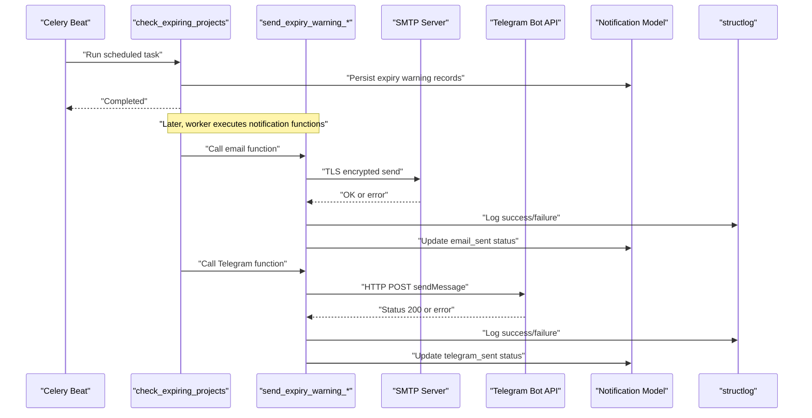
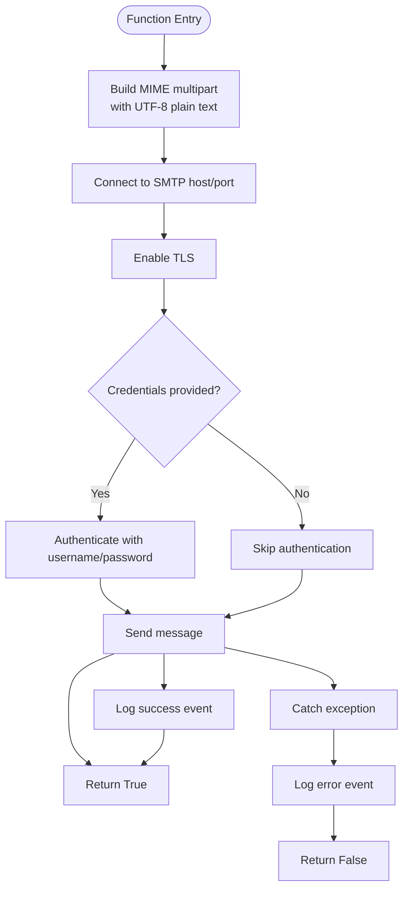
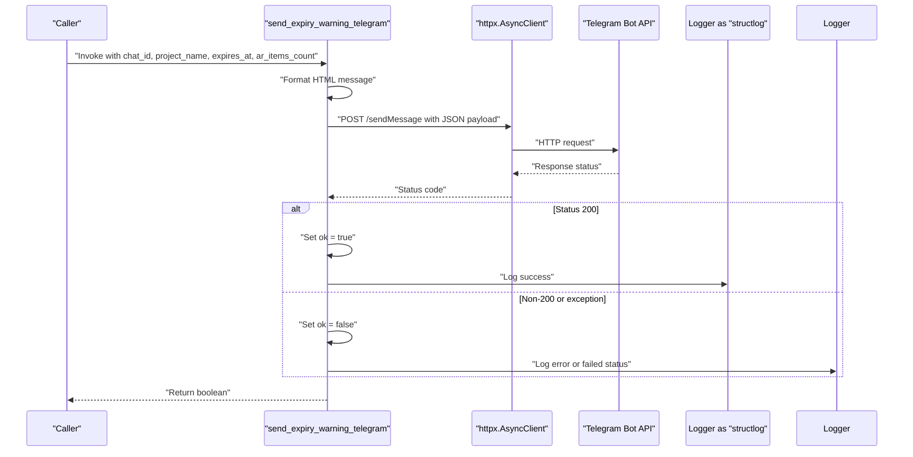
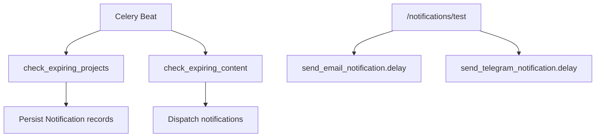
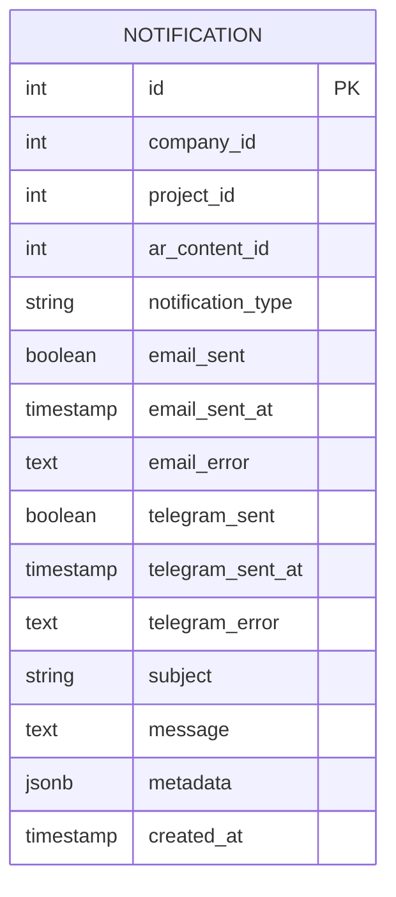
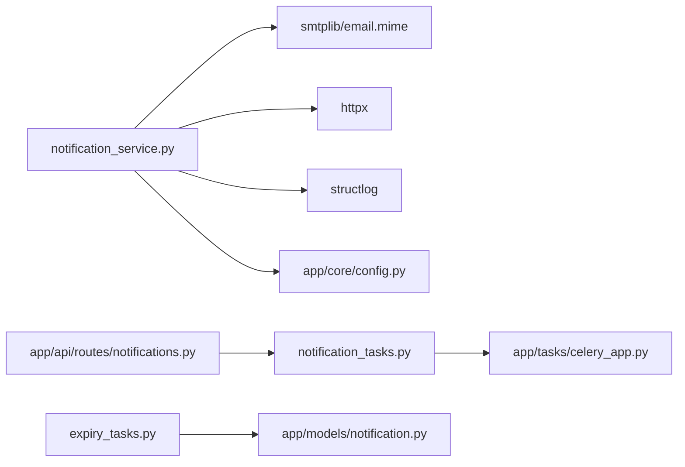

# Notification Service

<cite>
**Referenced Files in This Document**
- [notification_service.py](file://app/services/notification_service.py)
- [config.py](file://app/core/config.py)
- [.env.example](file://.env.example)
- [notification_tasks.py](file://app/tasks/notification_tasks.py)
- [celery_app.py](file://app/tasks/celery_app.py)
- [expiry_tasks.py](file://app/taks/expiry_tasks.py)
- [notification.py](file://app/models/notification.py)
- [notifications.py](file://app/api/routes/notifications.py)
</cite>

## Table of Contents
1. [Introduction](#introduction)
2. [Project Structure](#project-structure)
3. [Core Components](#core-components)
4. [Architecture Overview](#architecture-overview)
5. [Detailed Component Analysis](#detailed-component-analysis)
6. [Dependency Analysis](#dependency-analysis)
7. [Performance Considerations](#performance-considerations)
8. [Troubleshooting Guide](#troubleshooting-guide)
9. [Conclusion](#conclusion)
10. [Appendices](#appendices)

## Introduction
This document explains the NotificationService component of the ARV platform, focusing on two primary notification functions:
- send_expiry_warning_email: sends expiration warnings via SMTP with TLS encryption and UTF-8 MIME formatting.
- send_expiry_warning_telegram: sends expiration warnings via the Telegram Bot API using asynchronous HTTP requests with HTML parse mode.

It also covers how these functions integrate with structlog for structured logging, how they fit into the broader Celery-based task scheduling system, and how the Notification model persists notification outcomes. Guidance is included for configuration, troubleshooting, performance, and best practices for secure credential management and API integration.

## Project Structure
The notification-related code spans several modules:
- Services: implementation of email and Telegram notification functions.
- Tasks: Celery tasks orchestrating periodic checks and dispatching notifications.
- Models: persistence of notification records and outcomes.
- API: endpoints for listing notifications and triggering test notifications.
- Configuration: environment-driven settings for SMTP and Telegram.

**Diagram sources**
- [notification_service.py](file://app/services/notification_service.py#L1-L81)
- [notification_tasks.py](file://app/tasks/notification_tasks.py#L1-L61)
- [celery_app.py](file://app/tasks/celery_app.py#L1-L59)
- [expiry_tasks.py](file://app/tasks/expiry_tasks.py#L1-L178)
- [notification.py](file://app/models/notification.py#L1-L32)
- [notifications.py](file://app/api/routes/notifications.py#L1-L40)
- [config.py](file://app/core/config.py#L78-L90)
- [.env.example](file://.env.example#L35-L46)

**Section sources**
- [notification_service.py](file://app/services/notification_service.py#L1-L81)
- [notification_tasks.py](file://app/tasks/notification_tasks.py#L1-L61)
- [celery_app.py](file://app/tasks/celery_app.py#L1-L59)
- [expiry_tasks.py](file://app/tasks/expiry_tasks.py#L1-L178)
- [notification.py](file://app/models/notification.py#L1-L32)
- [notifications.py](file://app/api/routes/notifications.py#L1-L40)
- [config.py](file://app/core/config.py#L78-L90)
- [.env.example](file://.env.example#L35-L46)

## Core Components
- Email notification function:
  - Uses smtplib with TLS encryption and MIME formatting for UTF-8 plain text.
  - Reads SMTP host, port, credentials, and sender from settings.
  - Logs success/failure via structlog.
- Telegram notification function:
  - Uses httpx.AsyncClient to call the Telegram Bot API sendMessage endpoint.
  - Formats message with HTML parse mode and logs success/failure.
- Task orchestration:
  - Celery tasks schedule periodic checks and dispatch notifications.
  - Test endpoints trigger email and Telegram notifications for verification.
- Persistence:
  - Notification model stores sent status, timestamps, and metadata for audit.

**Section sources**
- [notification_service.py](file://app/services/notification_service.py#L13-L48)
- [notification_service.py](file://app/services/notification_service.py#L50-L81)
- [notification_tasks.py](file://app/tasks/notification_tasks.py#L7-L22)
- [notification_tasks.py](file://app/tasks/notification_tasks.py#L24-L42)
- [notification_tasks.py](file://app/tasks/notification_tasks.py#L44-L61)
- [notification.py](file://app/models/notification.py#L1-L32)
- [notifications.py](file://app/api/routes/notifications.py#L13-L40)

## Architecture Overview
The notification pipeline integrates services, tasks, and persistence:

**Diagram sources**
- [celery_app.py](file://app/tasks/celery_app.py#L31-L58)
- [expiry_tasks.py](file://app/tasks/expiry_tasks.py#L55-L92)
- [notification_service.py](file://app/services/notification_service.py#L13-L48)
- [notification_service.py](file://app/services/notification_service.py#L50-L81)
- [notification.py](file://app/models/notification.py#L1-L32)

## Detailed Component Analysis

### Email Notification: send_expiry_warning_email
- Purpose: Construct and send an expiration warning email using SMTP with TLS.
- Message construction:
  - Subject and body include project name, expiration date, and AR content count.
  - MIME multipart with plain text and UTF-8 encoding.
- Delivery:
  - Connects to SMTP host/port, enables TLS, authenticates if credentials are present, and sends the message.
- Logging:
  - Emits a success log event on completion and an error log on exceptions.

**Diagram sources**
- [notification_service.py](file://app/services/notification_service.py#L13-L48)

**Section sources**
- [notification_service.py](file://app/services/notification_service.py#L13-L48)
- [config.py](file://app/core/config.py#L78-L85)

### Telegram Notification: send_expiry_warning_telegram
- Purpose: Send an expiration warning via Telegram Bot API using asynchronous HTTP requests.
- Message formatting:
  - Uses HTML parse mode for bold tags and structured presentation.
- Delivery:
  - Posts to the sendMessage endpoint with chat_id and text payload.
  - Treats HTTP 200 as success; logs status code otherwise.
- Logging:
  - Emits success or error logs depending on response and exception handling.

**Diagram sources**
- [notification_service.py](file://app/services/notification_service.py#L50-L81)

**Section sources**
- [notification_service.py](file://app/services/notification_service.py#L50-L81)
- [config.py](file://app/core/config.py#L86-L89)

### Structured Logging Integration
- Both functions use structlog to emit structured log events:
  - Email: success and failure events with contextual fields (e.g., project).
  - Telegram: success and failure events with status codes or error messages.
- This enables centralized logging, filtering, and alerting.

**Section sources**
- [notification_service.py](file://app/services/notification_service.py#L43-L47)
- [notification_service.py](file://app/services/notification_service.py#L73-L80)

### Task Orchestration and Scheduling
- Celery beat schedules periodic tasks:
  - check_expiring_projects: identifies projects expiring soon and persists notifications.
  - check_expiring_content: placeholder for future expiry checks.
- Test endpoints:
  - Trigger email and Telegram notifications for manual verification.

**Diagram sources**
- [celery_app.py](file://app/tasks/celery_app.py#L31-L58)
- [expiry_tasks.py](file://app/tasks/expiry_tasks.py#L55-L92)
- [notification_tasks.py](file://app/tasks/notification_tasks.py#L7-L22)
- [notification_tasks.py](file://app/tasks/notification_tasks.py#L24-L42)
- [notification_tasks.py](file://app/tasks/notification_tasks.py#L44-L61)
- [notifications.py](file://app/api/routes/notifications.py#L35-L40)

**Section sources**
- [celery_app.py](file://app/tasks/celery_app.py#L1-L59)
- [expiry_tasks.py](file://app/tasks/expiry_tasks.py#L55-L92)
- [notification_tasks.py](file://app/tasks/notification_tasks.py#L7-L22)
- [notification_tasks.py](file://app/tasks/notification_tasks.py#L24-L42)
- [notification_tasks.py](file://app/tasks/notification_tasks.py#L44-L61)
- [notifications.py](file://app/api/routes/notifications.py#L35-L40)

### Notification Persistence Model
- The Notification model captures:
  - Identifiers (company_id, project_id, ar_content_id).
  - Type and subject/message.
  - Sent flags and timestamps for email and Telegram.
  - Error fields for diagnostics.
  - Metadata for storing additional context (e.g., expiration timestamps).

**Diagram sources**
- [notification.py](file://app/models/notification.py#L1-L32)

**Section sources**
- [notification.py](file://app/models/notification.py#L1-L32)

## Dependency Analysis
- External libraries:
  - smtplib and email.mime for SMTP and MIME formatting.
  - httpx for asynchronous HTTP requests.
  - structlog for structured logging.
- Internal dependencies:
  - Settings loaded from app.core.config for SMTP and Telegram tokens.
  - Celery app configured in app.tasks.celery_app for task routing and scheduling.
  - SQLAlchemy model app.models.notification for persistence.

**Diagram sources**
- [notification_service.py](file://app/services/notification_service.py#L1-L81)
- [config.py](file://app/core/config.py#L78-L90)
- [notification_tasks.py](file://app/tasks/notification_tasks.py#L1-L61)
- [celery_app.py](file://app/tasks/celery_app.py#L1-L59)
- [expiry_tasks.py](file://app/tasks/expiry_tasks.py#L1-L178)
- [notification.py](file://app/models/notification.py#L1-L32)
- [notifications.py](file://app/api/routes/notifications.py#L1-L40)

**Section sources**
- [notification_service.py](file://app/services/notification_service.py#L1-L81)
- [config.py](file://app/core/config.py#L78-L90)
- [notification_tasks.py](file://app/tasks/notification_tasks.py#L1-L61)
- [celery_app.py](file://app/tasks/celery_app.py#L1-L59)
- [expiry_tasks.py](file://app/tasks/expiry_tasks.py#L1-L178)
- [notification.py](file://app/models/notification.py#L1-L32)
- [notifications.py](file://app/api/routes/notifications.py#L1-L40)

## Performance Considerations
- Asynchronous execution:
  - The Telegram function uses httpx.AsyncClient, enabling concurrent API calls and improved throughput compared to synchronous requests.
- Retry strategies:
  - Implement retries with exponential backoff for transient network failures and rate-limited responses from Telegram.
- Rate limiting:
  - Telegram’s Bot API may throttle frequent messages. Consider batching and respecting suggested limits.
- Connection pooling:
  - Reuse a single httpx.AsyncClient instance across invocations to reduce overhead.
- Task concurrency:
  - Tune Celery worker concurrency and queues to handle bursts of notifications without blocking.
- Logging overhead:
  - Structured logging is efficient; ensure log levels and sinks are configured appropriately in production.

[No sources needed since this section provides general guidance]

## Troubleshooting Guide
Common issues and resolutions:
- SMTP connection timeouts:
  - Verify SMTP_HOST and SMTP_PORT are reachable from the runtime environment.
  - Ensure firewall rules allow outbound connections on the configured port.
- Invalid Telegram chat IDs:
  - Confirm the chat_id is correct and the bot has been started by the user.
  - Validate that the TELEGRAM_BOT_TOKEN is set and the bot is active.
- Bot token misconfigurations:
  - Ensure TELEGRAM_BOT_TOKEN is present in environment settings and matches the deployed token.
- Network failures:
  - Add retry logic with backoff for Telegram requests.
  - Monitor HTTP status codes; treat non-200 responses as failures and log details.
- Authentication failures:
  - For SMTP, confirm SMTP_USERNAME and SMTP_PASSWORD are set and valid.
  - Some providers require app-specific passwords.
- Logging visibility:
  - Check structlog configuration and ensure logs are emitted to the configured sink.

**Section sources**
- [notification_service.py](file://app/services/notification_service.py#L38-L47)
- [notification_service.py](file://app/services/notification_service.py#L72-L80)
- [config.py](file://app/core/config.py#L78-L90)
- [.env.example](file://.env.example#L35-L46)

## Conclusion
The NotificationService provides robust, structured, and asynchronous notification capabilities for ARV. It securely integrates SMTP and Telegram APIs, persists outcomes for auditing, and is orchestrated by Celery for reliable scheduling. By following the configuration and troubleshooting guidance, teams can deploy reliable expiration warnings with clear observability and minimal operational overhead.

[No sources needed since this section summarizes without analyzing specific files]

## Appendices

### Configuration Reference
- SMTP settings:
  - SMTP_HOST, SMTP_PORT, SMTP_USERNAME, SMTP_PASSWORD, SMTP_FROM_EMAIL, SMTP_FROM_NAME
- Telegram settings:
  - TELEGRAM_BOT_TOKEN, TELEGRAM_ADMIN_CHAT_ID
- Environment file:
  - Example values are provided in .env.example for quick setup.

**Section sources**
- [config.py](file://app/core/config.py#L78-L90)
- [.env.example](file://.env.example#L35-L46)

### API Endpoints
- GET /notifications: List recent notifications with sent flags and timestamps.
- POST /notifications/test: Trigger test email and Telegram notifications for verification.

**Section sources**
- [notifications.py](file://app/api/routes/notifications.py#L13-L40)