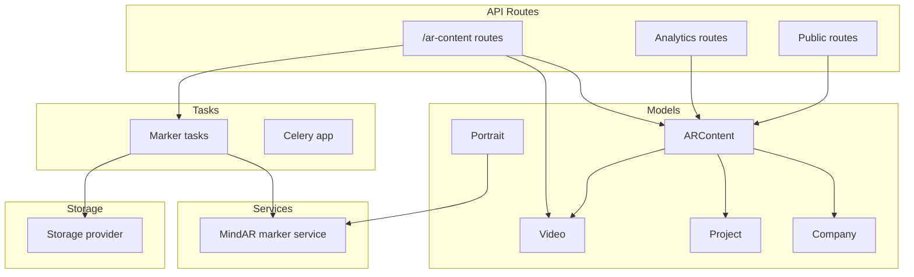
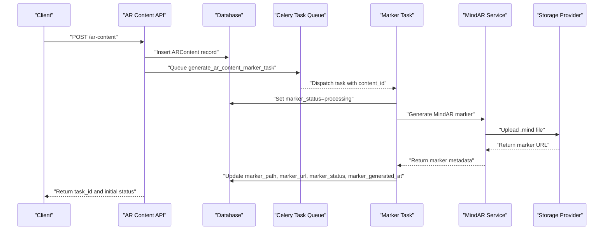
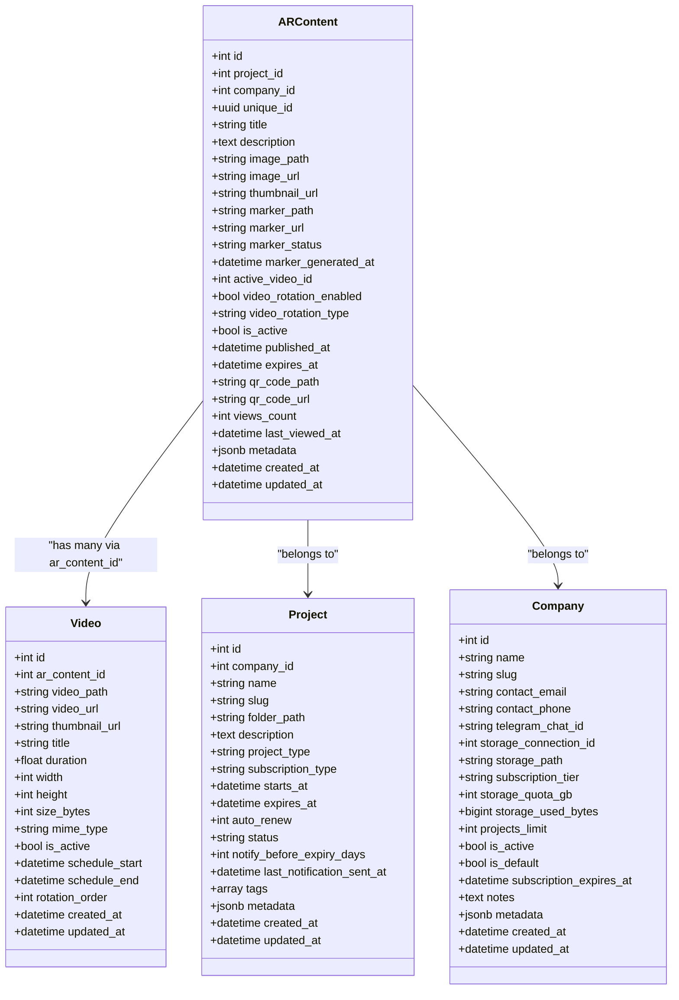
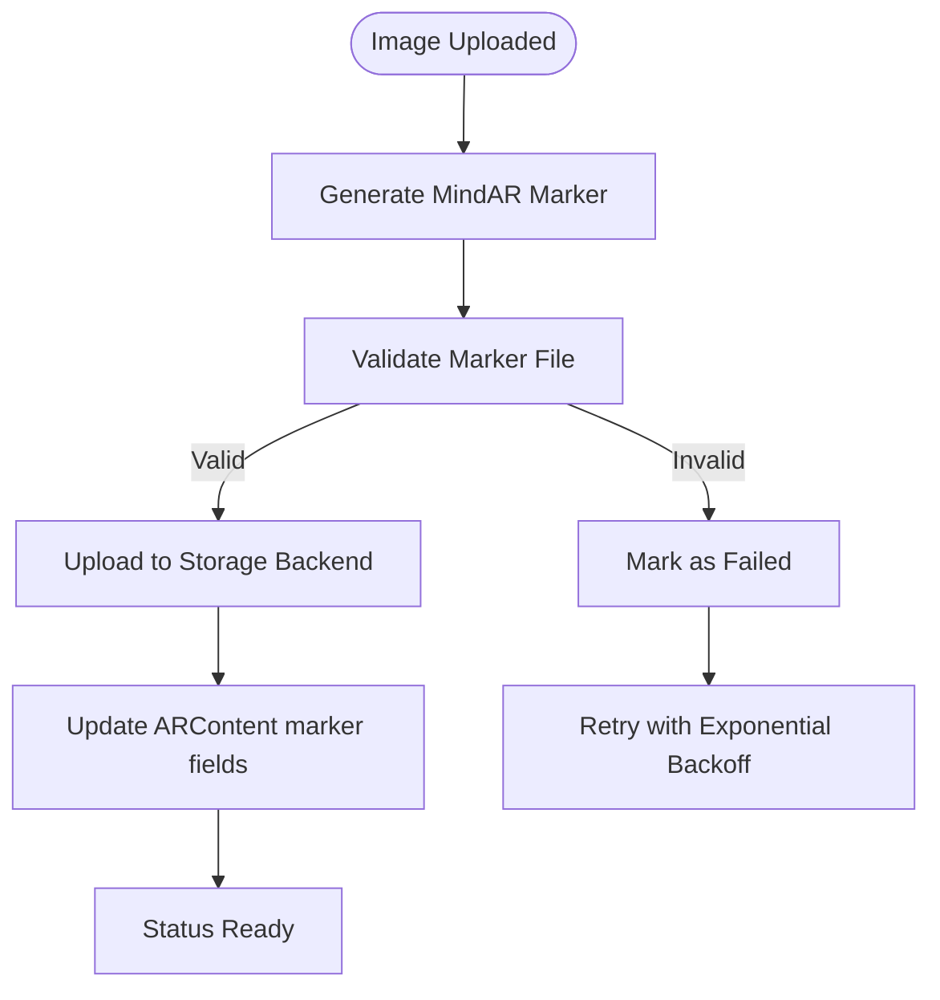
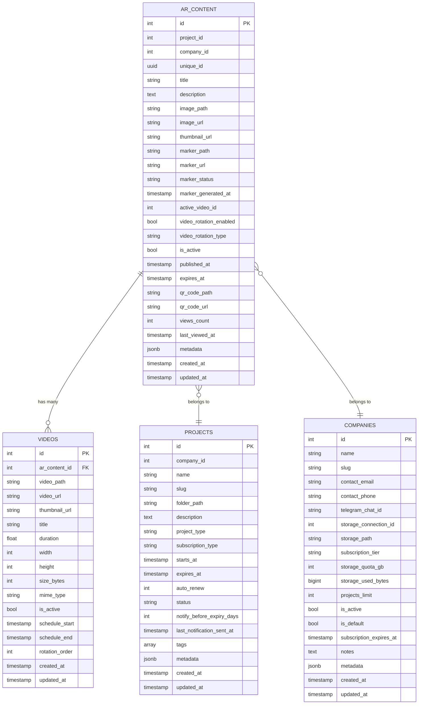
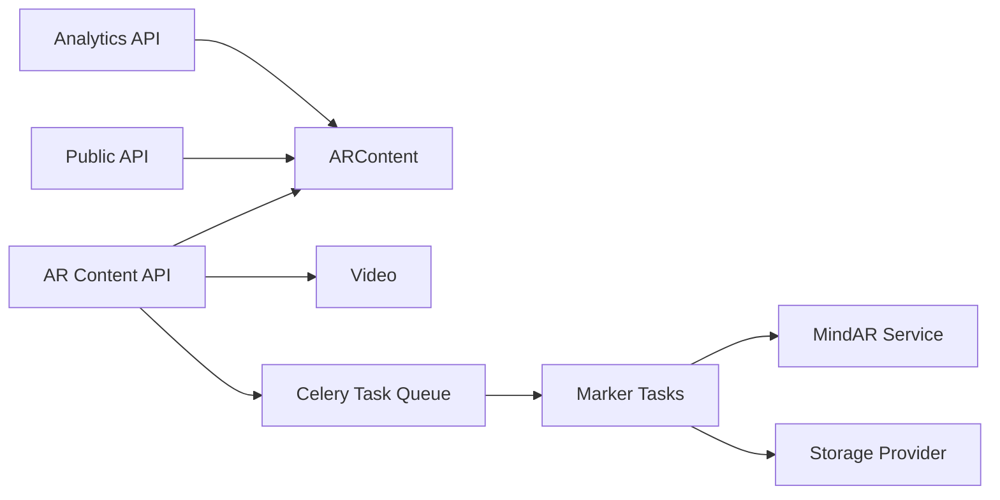

# AR Content Model

<cite>
**Referenced Files in This Document**
- [ar_content.py](file://app/models/ar_content.py)
- [video.py](file://app/models/video.py)
- [portrait.py](file://app/models/portrait.py)
- [project.py](file://app/models/project.py)
- [company.py](file://app/models/company.py)
- [ar_content_api.py](file://app/api/routes/ar_content.py)
- [analytics_api.py](file://app/api/routes/analytics.py)
- [public_api.py](file://app/api/routes/public.py)
- [marker_service.py](file://app/services/marker_service.py)
- [marker_tasks.py](file://app/tasks/marker_tasks.py)
- [celery_app.py](file://app/tasks/celery_app.py)
- [database.py](file://app/core/database.py)
- [storage.py](file://app/core/storage.py)
</cite>

## Table of Contents
1. [Introduction](#introduction)
2. [Project Structure](#project-structure)
3. [Core Components](#core-components)
4. [Architecture Overview](#architecture-overview)
5. [Detailed Component Analysis](#detailed-component-analysis)
6. [Dependency Analysis](#dependency-analysis)
7. [Performance Considerations](#performance-considerations)
8. [Troubleshooting Guide](#troubleshooting-guide)
9. [Conclusion](#conclusion)
10. [Appendices](#appendices)

## Introduction
This document provides comprehensive data model documentation for the ARContent model in the ARV platform. It explains the fields, relationships, constraints, and lifecycle of AR content, including marker generation, activation rules, and integration with storage backends. It also covers query patterns used in API endpoints and services, performance considerations, and illustrates how the model supports NFT-based image recognition workflows and integration with MindAR marker generation. Finally, it includes a schema diagram and sample data to demonstrate real-world usage and describes integration with Celery tasks for asynchronous marker processing.

## Project Structure
The AR content model is part of the SQLAlchemy ORM layer and integrates with FastAPI routes, Celery tasks, and storage services. The relevant components are organized as follows:
- Models: ARContent, Video, Portrait, Project, Company
- API routes: AR content creation, listing, video upload, and marker generation triggers
- Services: MindAR marker generation service
- Tasks: Celery tasks for asynchronous marker generation
- Storage: Local and MinIO-backed storage integration
- Database: Async SQLAlchemy configuration and Base class

**Diagram sources**
- [ar_content.py](file://app/models/ar_content.py#L1-L46)
- [video.py](file://app/models/video.py#L1-L31)
- [portrait.py](file://app/models/portrait.py#L1-L28)
- [project.py](file://app/models/project.py#L1-L35)
- [company.py](file://app/models/company.py#L1-L41)
- [ar_content_api.py](file://app/api/routes/ar_content.py#L1-L184)
- [analytics_api.py](file://app/api/routes/analytics.py#L1-L92)
- [public_api.py](file://app/api/routes/public.py#L1-L32)
- [marker_service.py](file://app/services/marker_service.py#L1-L134)
- [marker_tasks.py](file://app/tasks/marker_tasks.py#L1-L173)
- [celery_app.py](file://app/tasks/celery_app.py#L1-L29)
- [storage.py](file://app/core/storage.py#L1-L71)

**Section sources**
- [ar_content.py](file://app/models/ar_content.py#L1-L46)
- [database.py](file://app/core/database.py#L1-L103)

## Core Components
This section details the ARContent model fields, their types, and business semantics. It also outlines relationships to Video, Portrait, Project, and Company, and highlights constraints and indexes.

- Primary table: ar_content
- Primary key: id
- Unique identifier: unique_id (UUID)
- Activation and lifecycle:
  - is_active: controls visibility and availability
  - published_at, expires_at: content validity window
  - marker_status: lifecycle state of the marker ("pending", "processing", "ready", "failed")
  - marker_generated_at: timestamp when marker became ready
- Media assets:
  - image_path, image_url, thumbnail_url: source image and thumbnails
  - marker_path, marker_url: MindAR marker file location and URL
  - qr_code_path, qr_code_url: optional QR code assets
- Association fields:
  - project_id: links to Project
  - company_id: links to Company
  - active_video_id: links to Video (optional)
- Rotation:
  - video_rotation_enabled: enables rotation scheduling
  - video_rotation_type: rotation policy (e.g., daily, weekly)
- Analytics:
  - views_count, last_viewed_at: usage metrics
- Metadata:
  - metadata: JSONB for arbitrary attributes
- Timestamps:
  - created_at, updated_at

Constraints and indexes:
- unique_id is a UUID field; while not explicitly declared as unique in the model, it is used as a unique identifier in API routes and analytics. In practice, it behaves as unique because it is generated per AR content and used for lookups. Consider adding a database-level unique constraint for robustness.
- There are no explicit indexes on project_id or company_id in the model. However, the analytics route queries ARContent by company_id and project_id, and the public route queries by unique_id. Adding indexes on unique_id, project_id, and company_id would improve query performance.

Relationships:
- ARContent belongs to Project via project_id
- ARContent belongs to Company via company_id
- ARContent has many Videos via Video.ar_content_id
- ARContent is associated with Portrait via marker generation (MindAR marker is produced from a portrait image)
- ARContent supports NFT-based image recognition workflows by linking a portrait image to a MindAR marker file stored in the configured storage backend

Referential integrity and cascade behaviors:
- The model does not define foreign key constraints or cascade behaviors in SQLAlchemy. In production, define foreign keys and appropriate ON DELETE actions (e.g., SET NULL or CASCADE) to maintain referential integrity. For example:
  - Video.ar_content_id should reference ARContent.id with ON DELETE CASCADE if deleting AR content should remove associated videos
  - ARContent.project_id should reference Project.id with ON DELETE RESTRICT or SET NULL depending on business rules
  - ARContent.company_id should reference Company.id with ON DELETE RESTRICT or SET NULL depending on business rules
- Without explicit constraints, referential integrity relies on application-level checks. Add constraints in migrations to enforce integrity.

**Section sources**
- [ar_content.py](file://app/models/ar_content.py#L1-L46)
- [video.py](file://app/models/video.py#L1-L31)
- [portrait.py](file://app/models/portrait.py#L1-L28)
- [project.py](file://app/models/project.py#L1-L35)
- [company.py](file://app/models/company.py#L1-L41)
- [analytics_api.py](file://app/api/routes/analytics.py#L1-L92)
- [public_api.py](file://app/api/routes/public.py#L1-L32)

## Architecture Overview
The AR content lifecycle spans API ingestion, asynchronous marker generation, and runtime retrieval. The following diagram maps the end-to-end flow:

**Diagram sources**
- [ar_content_api.py](file://app/api/routes/ar_content.py#L1-L184)
- [marker_tasks.py](file://app/tasks/marker_tasks.py#L1-L173)
- [marker_service.py](file://app/services/marker_service.py#L1-L134)
- [storage.py](file://app/core/storage.py#L1-L71)

## Detailed Component Analysis

### ARContent Model Fields and Semantics
- Identity and association:
  - id: primary key
  - unique_id: UUID used for public URLs and analytics lookups
  - project_id, company_id: tenant and project linkage
- Media and marker:
  - image_path, image_url, thumbnail_url: source image and thumbnails
  - marker_path, marker_url, marker_status, marker_generated_at: MindAR marker lifecycle
- Activation and scheduling:
  - is_active: toggles visibility
  - published_at, expires_at: validity window
  - video_rotation_enabled, video_rotation_type: rotation policy
  - active_video_id: currently active video for this content
- Analytics:
  - views_count, last_viewed_at: usage metrics
- Metadata:
  - metadata: JSONB for extensibility

**Section sources**
- [ar_content.py](file://app/models/ar_content.py#L1-L46)

### Relationship Mapping

**Diagram sources**
- [ar_content.py](file://app/models/ar_content.py#L1-L46)
- [video.py](file://app/models/video.py#L1-L31)
- [project.py](file://app/models/project.py#L1-L35)
- [company.py](file://app/models/company.py#L1-L41)

### Business Rules Around Content Activation and Marker Lifecycle
- Activation:
  - is_active controls whether content is considered active for viewers
  - published_at and expires_at define the content’s validity window
- Marker lifecycle:
  - Initial status: pending
  - Transition to processing when generation is triggered
  - On success: status becomes ready, marker_path and marker_url are set, marker_generated_at is populated
  - On failure: status becomes failed; tasks retry with exponential backoff
- Association with storage:
  - Marker files are uploaded to the configured storage backend (MinIO or local) and exposed via URLs
  - The storage path is derived from company storage settings and content unique_id

**Section sources**
- [ar_content.py](file://app/models/ar_content.py#L1-L46)
- [marker_tasks.py](file://app/tasks/marker_tasks.py#L1-L173)
- [marker_service.py](file://app/services/marker_service.py#L1-L134)
- [storage.py](file://app/core/storage.py#L1-L71)

### Query Patterns Used in API Endpoints and Services
Common query patterns include:
- Retrieve AR content by unique_id for public access and analytics:
  - Select ARContent by unique_id
  - Optionally join with Video to fetch active_video_url
- List AR content for a project:
  - Filter ARContent by project_id
- Track AR sessions using either unique_id or ar_content_id:
  - Resolve ar_content_id from unique_id or direct lookup
  - Populate company_id and project_id for analytics aggregation

Example patterns (paths only):
- Get public AR content by unique_id: [public_api.py](file://app/api/routes/public.py#L12-L32)
- List AR content for a project: [ar_content_api.py](file://app/api/routes/ar_content.py#L72-L86)
- Trigger marker generation: [ar_content_api.py](file://app/api/routes/ar_content.py#L135-L146)
- Get active video URL by unique_id: [ar_content_api.py](file://app/api/routes/ar_content.py#L159-L171)
- Analytics session tracking: [analytics_api.py](file://app/api/routes/analytics.py#L55-L92)

**Section sources**
- [public_api.py](file://app/api/routes/public.py#L1-L32)
- [ar_content_api.py](file://app/api/routes/ar_content.py#L72-L184)
- [analytics_api.py](file://app/api/routes/analytics.py#L1-L92)

### NFT-Based Image Recognition and MindAR Integration
- Workflow:
  - An image is uploaded and stored locally or in the configured storage
  - A MindAR marker (.mind) is generated from the image using the MindAR compiler
  - The marker is uploaded to the storage backend and referenced by ARContent
- Integration points:
  - MindAR marker service generates and validates marker files
  - Celery tasks orchestrate asynchronous generation and storage updates
  - Storage provider abstracts MinIO/local disk operations

**Diagram sources**
- [marker_service.py](file://app/services/marker_service.py#L1-L134)
- [marker_tasks.py](file://app/tasks/marker_tasks.py#L1-L173)
- [storage.py](file://app/core/storage.py#L1-L71)

**Section sources**
- [marker_service.py](file://app/services/marker_service.py#L1-L134)
- [marker_tasks.py](file://app/tasks/marker_tasks.py#L1-L173)
- [storage.py](file://app/core/storage.py#L1-L71)

### Sample Data and Schema Diagram
Sample AR content row:
- id: 1
- project_id: 10
- company_id: 5
- unique_id: <UUID>
- title: "Summer Campaign"
- description: "NFT campaign content"
- image_path: "/storage/content/ar_content/<uuid>/image.jpg"
- image_url: "/storage/ar_content/<uuid>/image.jpg"
- marker_status: "ready"
- marker_url: "https://storage.example.com/markers/<uuid>.mind"
- active_video_id: 101
- is_active: True
- published_at: 2025-01-01T00:00:00Z
- expires_at: 2025-12-31T23:59:59Z
- views_count: 120
- metadata: {"campaign": "summer2025"}

Schema diagram (fields only):

**Diagram sources**
- [ar_content.py](file://app/models/ar_content.py#L1-L46)
- [video.py](file://app/models/video.py#L1-L31)
- [project.py](file://app/models/project.py#L1-L35)
- [company.py](file://app/models/company.py#L1-L41)

## Dependency Analysis
- API routes depend on ARContent and Video models for CRUD operations and on Celery tasks for asynchronous processing
- Marker tasks depend on the MindAR service and storage provider to generate and upload marker files
- Analytics routes depend on ARContent to compute usage metrics and resolve company_id and project_id
- Storage provider abstracts MinIO/local disk operations and ensures bucket policies and public URLs

**Diagram sources**
- [ar_content_api.py](file://app/api/routes/ar_content.py#L1-L184)
- [analytics_api.py](file://app/api/routes/analytics.py#L1-L92)
- [public_api.py](file://app/api/routes/public.py#L1-L32)
- [marker_tasks.py](file://app/tasks/marker_tasks.py#L1-L173)
- [marker_service.py](file://app/services/marker_service.py#L1-L134)
- [storage.py](file://app/core/storage.py#L1-L71)

**Section sources**
- [ar_content_api.py](file://app/api/routes/ar_content.py#L1-L184)
- [analytics_api.py](file://app/api/routes/analytics.py#L1-L92)
- [public_api.py](file://app/api/routes/public.py#L1-L32)
- [marker_tasks.py](file://app/tasks/marker_tasks.py#L1-L173)
- [marker_service.py](file://app/services/marker_service.py#L1-L134)
- [storage.py](file://app/core/storage.py#L1-L71)

## Performance Considerations
- Indexing:
  - Consider adding indexes on ARContent.unique_id, ARContent.project_id, and ARContent.company_id to optimize frequent lookups and filtering
  - Existing indexes in the codebase target analytics and other tables; similar indexes on ARContent would improve performance for public and admin endpoints
- Lazy vs. joined loading:
  - For public endpoints returning AR content summaries, prefer lazy loading to minimize payload size
  - For analytics and admin endpoints requiring company/project context, use joined eager loading to reduce N+1 queries
- Asynchronous processing:
  - Use Celery tasks to offload heavy operations (e.g., MindAR compilation) and avoid blocking API requests
- Storage I/O:
  - Batch uploads and retries with exponential backoff to handle transient failures
  - Use pre-signed URLs for controlled access when necessary

[No sources needed since this section provides general guidance]

## Troubleshooting Guide
- Marker generation failures:
  - Monitor task logs and status transitions; tasks automatically retry with exponential backoff
  - Validate marker file sizes and formats using the MindAR service validator
- Storage connectivity:
  - Ensure buckets exist and public read policies are configured for MinIO
  - Verify storage provider credentials and paths
- API errors:
  - 404 Not Found when unique_id or content_id is invalid
  - 404 when active_video_id is unset or video is missing
  - Use analytics routes to confirm ARContent existence and status

**Section sources**
- [marker_tasks.py](file://app/tasks/marker_tasks.py#L1-L173)
- [marker_service.py](file://app/services/marker_service.py#L1-L134)
- [storage.py](file://app/core/storage.py#L1-L71)
- [ar_content_api.py](file://app/api/routes/ar_content.py#L135-L171)
- [analytics_api.py](file://app/api/routes/analytics.py#L55-L92)

## Conclusion
The ARContent model encapsulates the core data for AR campaigns, including media assets, marker lifecycle, activation controls, and analytics. Its relationships to Project, Company, and Video enable multi-tenant and multi-project management. The integration with MindAR and storage providers supports scalable NFT-based image recognition workflows. By adding foreign key constraints and indexes, and leveraging Celery for asynchronous processing, the system achieves robustness, performance, and scalability.

[No sources needed since this section summarizes without analyzing specific files]

## Appendices

### API Endpoints and Query Patterns
- Create AR content and trigger marker generation:
  - Endpoint: POST /ar-content
  - Behavior: Creates ARContent, sets initial status, enqueues marker task
  - Reference: [ar_content_api.py](file://app/api/routes/ar_content.py#L24-L71)
- List AR content for a project:
  - Endpoint: GET /projects/{project_id}/ar-content
  - Reference: [ar_content_api.py](file://app/api/routes/ar_content.py#L72-L86)
- Upload video and set as active:
  - Endpoint: POST /ar-content/{content_id}/videos
  - Reference: [ar_content_api.py](file://app/api/routes/ar_content.py#L91-L133)
- Trigger marker generation:
  - Endpoint: POST /ar-content/{content_id}/generate-marker
  - Reference: [ar_content_api.py](file://app/api/routes/ar_content.py#L135-L146)
- Get active video URL by unique_id:
  - Endpoint: GET /ar/{unique_id}/active-video
  - Reference: [ar_content_api.py](file://app/api/routes/ar_content.py#L159-L171)
- Public content endpoint:
  - Endpoint: GET /ar/{unique_id}/content
  - Reference: [public_api.py](file://app/api/routes/public.py#L12-L32)
- Analytics session tracking:
  - Endpoint: POST /analytics/ar-session
  - Reference: [analytics_api.py](file://app/api/routes/analytics.py#L55-L92)

**Section sources**
- [ar_content_api.py](file://app/api/routes/ar_content.py#L24-L171)
- [public_api.py](file://app/api/routes/public.py#L12-L32)
- [analytics_api.py](file://app/api/routes/analytics.py#L55-L92)

### Celery Configuration and Queues
- Broker and backend configured via settings
- Queues: markers, notifications, default
- Task serialization: JSON
- Time limits and result expiration configured

**Section sources**
- [celery_app.py](file://app/tasks/celery_app.py#L1-L29)