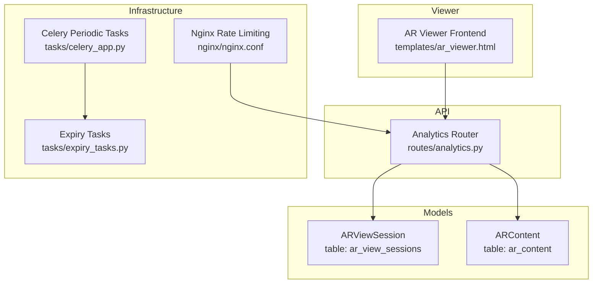
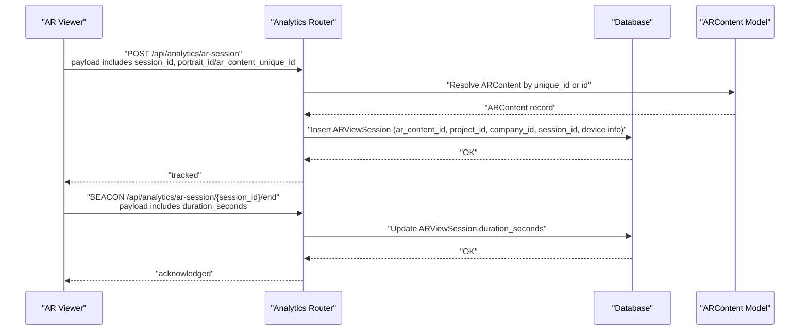
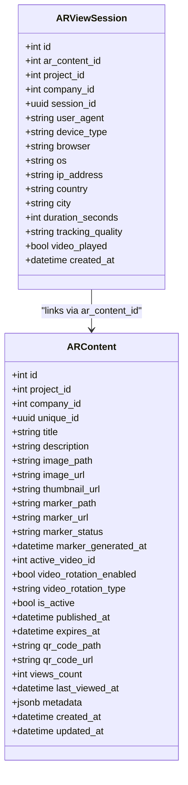
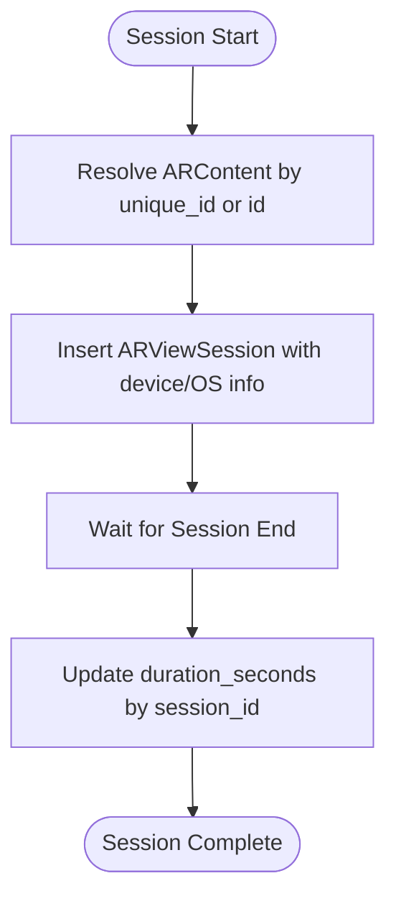
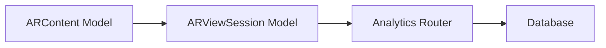
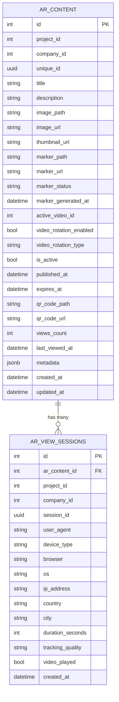

# AR View Session Model

<cite>
**Referenced Files in This Document**
- [ar_view_session.py](file://app/models/ar_view_session.py)
- [ar_content.py](file://app/models/ar_content.py)
- [analytics.py](file://app/api/routes/analytics.py)
- [ar_viewer.html](file://templates/ar_viewer.html)
- [20251205_perf_idx.py](file://alembic/versions/20251205_perf_idx.py)
- [celery_app.py](file://app/tasks/celery_app.py)
- [expiry_tasks.py](file://app/tasks/expiry_tasks.py)
- [nginx.conf](file://nginx/nginx.conf)
</cite>

## Table of Contents
1. [Introduction](#introduction)
2. [Project Structure](#project-structure)
3. [Core Components](#core-components)
4. [Architecture Overview](#architecture-overview)
5. [Detailed Component Analysis](#detailed-component-analysis)
6. [Dependency Analysis](#dependency-analysis)
7. [Performance Considerations](#performance-considerations)
8. [Troubleshooting Guide](#troubleshooting-guide)
9. [Conclusion](#conclusion)
10. [Appendices](#appendices)

## Introduction
This document provides comprehensive data model documentation for the ARViewSession model in the ARV platform. It explains the schema, relationships to ARContent, business rules for session tracking, indexing strategies for analytics, and operational considerations such as high-write throughput, partitioning, and retention. It also illustrates how the model supports real-time analytics and reporting, and outlines integration with analytics APIs and periodic aggregation tasks.

## Project Structure
The ARV platform organizes analytics-related logic around a lightweight FastAPI router and SQLAlchemy models. The ARViewSession model persists AR experience sessions, while ARContent stores AR experiences. Analytics endpoints aggregate counts and support session lifecycle events.

**Diagram sources**
- [ar_view_session.py](file://app/models/ar_view_session.py#L1-L31)
- [ar_content.py](file://app/models/ar_content.py#L1-L46)
- [analytics.py](file://app/api/routes/analytics.py#L1-L93)
- [ar_viewer.html](file://templates/ar_viewer.html#L170-L226)
- [nginx.conf](file://nginx/nginx.conf#L54-L93)
- [celery_app.py](file://app/tasks/celery_app.py#L31-L58)
- [expiry_tasks.py](file://app/tasks/expiry_tasks.py#L1-L183)

**Section sources**
- [ar_view_session.py](file://app/models/ar_view_session.py#L1-L31)
- [ar_content.py](file://app/models/ar_content.py#L1-L46)
- [analytics.py](file://app/api/routes/analytics.py#L1-L93)
- [ar_viewer.html](file://templates/ar_viewer.html#L170-L226)
- [nginx.conf](file://nginx/nginx.conf#L54-L93)
- [celery_app.py](file://app/tasks/celery_app.py#L31-L58)
- [expiry_tasks.py](file://app/tasks/expiry_tasks.py#L1-L183)

## Core Components
- ARViewSession: Stores AR experience sessions with device and geolocation metadata, session identifiers, and timestamps. It links to ARContent via ar_content_id and inherits project/company context from ARContent.
- ARContent: Defines AR experiences with metadata, activity flags, and timestamps. It is the authoritative source for linking sessions to specific AR experiences.
- Analytics API: Provides endpoints to track sessions and compute counts grouped by company, project, and content.
- AR Viewer Frontend: Initiates session tracking and sends session end durations via Beacon.

Key fields in ARViewSession:
- session_id: UUID identifying a user’s session
- ar_content_id: Links to ARContent.id
- project_id, company_id: Inherited from ARContent
- device_type, browser, os: Device and OS metadata
- user_agent: Full user agent string
- ip_address, country, city: Geolocation fields
- duration_seconds: Session duration populated on end event
- tracking_quality, video_played: Flags for quality and playback
- created_at: Automatic timestamp

Relationships:
- ARViewSession.ar_content_id → ARContent.id
- ARViewSession.project_id → ARContent.project_id
- ARViewSession.company_id → ARContent.company_id

**Section sources**
- [ar_view_session.py](file://app/models/ar_view_session.py#L1-L31)
- [ar_content.py](file://app/models/ar_content.py#L1-L46)
- [analytics.py](file://app/api/routes/analytics.py#L55-L92)
- [ar_viewer.html](file://templates/ar_viewer.html#L177-L200)

## Architecture Overview
The ARV analytics pipeline captures session start and end events, aggregates counts, and surfaces insights via analytics endpoints. The viewer triggers session start; the backend resolves ARContent and persists ARViewSession. On session end, the viewer posts duration, and the backend updates the record.

**Diagram sources**
- [analytics.py](file://app/api/routes/analytics.py#L55-L92)
- [ar_viewer.html](file://templates/ar_viewer.html#L177-L200)
- [ar_content.py](file://app/models/ar_content.py#L1-L46)

## Detailed Component Analysis

### ARViewSession Model
ARViewSession defines the session persistence schema with fields for identity, device, geolocation, quality, and timing. It is designed for high-throughput writes and analytics-friendly reads.

**Diagram sources**
- [ar_view_session.py](file://app/models/ar_view_session.py#L1-L31)
- [ar_content.py](file://app/models/ar_content.py#L1-L46)

**Section sources**
- [ar_view_session.py](file://app/models/ar_view_session.py#L1-L31)
- [ar_content.py](file://app/models/ar_content.py#L1-L46)

### Analytics Endpoints and Aggregations
Analytics endpoints compute counts over time windows and group by dimensions. They rely on ARViewSession and ARContent.

Representative aggregations:
- Total views in the last 30 days
- Unique sessions in the last 30 days
- Views for a given company/project/content over the last 30 days

These queries use count and distinct(session_id) to derive unique sessions.

**Section sources**
- [analytics.py](file://app/api/routes/analytics.py#L16-L53)

### Session Lifecycle and Business Rules
- Automatic start recording: On POST to the analytics session endpoint, a new ARViewSession row is inserted with created_at set automatically.
- Automatic end recording: On BEACON to the session end endpoint, the backend updates duration_seconds for the matching session_id.
- Linking to AR experiences: The session creation payload can include either a portrait_id (ARContent.unique_id) or ar_content_id. If portrait_id is provided, the backend resolves ARContent and populates ar_content_id, project_id, and company_id accordingly.
- Data fields: Device and OS metadata are captured during session start; duration is recorded on session end.

**Diagram sources**
- [analytics.py](file://app/api/routes/analytics.py#L55-L92)
- [ar_viewer.html](file://templates/ar_viewer.html#L177-L200)

**Section sources**
- [analytics.py](file://app/api/routes/analytics.py#L55-L92)
- [ar_viewer.html](file://templates/ar_viewer.html#L177-L200)

### Indexing Strategies for Analytics
Performance indexes are defined to optimize analytics queries:
- idx_ar_sessions_company_created(company_id, created_at): Supports company-scoped analytics filtered by created_at.
- idx_ar_sessions_content(ar_content_id): Supports content-scoped analytics.

Downgrade operations remove these indexes.

**Section sources**
- [20251205_perf_idx.py](file://alembic/versions/20251205_perf_idx.py#L17-L31)
- [20251205_perf_idx.py](file://alembic/versions/20251205_perf_idx.py#L58-L64)

### Real-Time Analytics and Reporting
- Endpoint-driven metrics: The analytics endpoints expose counts grouped by company, project, and content for recent periods.
- Viewer-driven telemetry: The AR viewer initiates session tracking and posts duration on unload, enabling near real-time session metrics.

**Section sources**
- [analytics.py](file://app/api/routes/analytics.py#L16-L53)
- [ar_viewer.html](file://templates/ar_viewer.html#L177-L200)

### Data Anonymization Policies
- IP address is captured as ip_address; the model includes country and city fields. There is no explicit anonymization logic in the repository for these fields.
- Recommendation: Apply IP anonymization (e.g., partial masking) and consider removing or hashing sensitive fields before long-term retention.

[No sources needed since this section provides general guidance]

## Dependency Analysis
ARViewSession depends on ARContent for linkage and context. Analytics endpoints depend on both models and use SQLAlchemy select statements to compute counts.

**Diagram sources**
- [ar_view_session.py](file://app/models/ar_view_session.py#L1-L31)
- [ar_content.py](file://app/models/ar_content.py#L1-L46)
- [analytics.py](file://app/api/routes/analytics.py#L1-L93)

**Section sources**
- [ar_view_session.py](file://app/models/ar_view_session.py#L1-L31)
- [ar_content.py](file://app/models/ar_content.py#L1-L46)
- [analytics.py](file://app/api/routes/analytics.py#L1-L93)

## Performance Considerations
- High-write throughput handling:
  - ARViewSession is designed for frequent inserts; ensure adequate PostgreSQL write capacity and consider batching if needed.
  - Nginx rate limiting is configured for API endpoints, which can help protect the backend under load.
- Indexing:
  - Maintain idx_ar_sessions_company_created and idx_ar_sessions_content to accelerate analytics queries.
- Partitioning:
  - No explicit partitioning is present in the repository. For very large datasets, consider time-based partitioning on created_at to improve maintenance and query performance.
- Data retention:
  - No TTL-based cleanup is implemented for ARViewSession in the repository. Consider implementing retention policies (e.g., purge records older than N days) via scheduled tasks or database-level retention.

**Section sources**
- [nginx.conf](file://nginx/nginx.conf#L54-L93)
- [20251205_perf_idx.py](file://alembic/versions/20251205_perf_idx.py#L17-L31)
- [celery_app.py](file://app/tasks/celery_app.py#L31-L58)
- [expiry_tasks.py](file://app/tasks/expiry_tasks.py#L1-L183)

## Troubleshooting Guide
- Session not linked to ARContent:
  - Ensure portrait_id or ar_content_id is provided in the session start payload. If portrait_id is used, verify ARContent.unique_id exists.
- Missing duration:
  - Confirm the session end Beacon is sent with session_id and duration_seconds.
- Slow analytics queries:
  - Verify that idx_ar_sessions_company_created and idx_ar_sessions_content exist and are effective.
- Rate limiting:
  - If clients receive rate-limited responses, review Nginx limits and adjust client-side retry/backoff.

**Section sources**
- [analytics.py](file://app/api/routes/analytics.py#L55-L92)
- [ar_viewer.html](file://templates/ar_viewer.html#L177-L200)
- [20251205_perf_idx.py](file://alembic/versions/20251205_perf_idx.py#L17-L31)
- [nginx.conf](file://nginx/nginx.conf#L54-L93)

## Conclusion
The ARViewSession model provides a compact yet powerful foundation for AR experience analytics. It integrates cleanly with ARContent, supports session lifecycle events, and benefits from targeted indexes for analytics. While the current implementation focuses on straightforward counting and device metadata, future enhancements could include partitioning, TTL-based retention, and stronger anonymization policies to meet scalability and privacy goals.

## Appendices

### Schema Diagram

**Diagram sources**
- [ar_content.py](file://app/models/ar_content.py#L1-L46)
- [ar_view_session.py](file://app/models/ar_view_session.py#L1-L31)

### Sample Session Data
- session_id: a UUID representing a single user session
- ar_content_id: integer identifier of the AR experience
- project_id: integer identifier of the project owning the AR experience
- company_id: integer identifier of the company owning the project
- device_type: "mobile", "tablet", or "desktop"
- browser: browser name/version
- os: operating system
- ip_address: client IP
- country, city: geolocation
- duration_seconds: session duration in seconds (filled on end)
- tracking_quality: quality label
- video_played: whether video playback occurred
- created_at: UTC timestamp

**Section sources**
- [ar_view_session.py](file://app/models/ar_view_session.py#L1-L31)
- [analytics.py](file://app/api/routes/analytics.py#L55-L92)
- [ar_viewer.html](file://templates/ar_viewer.html#L177-L200)

### Analytics Endpoint Examples
- GET /analytics/overview: Returns total views and unique sessions for the last 30 days, plus active content count.
- GET /analytics/companies/{company_id}: Returns views for the last 30 days for a given company.
- GET /analytics/projects/{project_id}: Returns views for the last 30 days for a given project.
- GET /analytics/ar-content/{content_id}: Returns views for the last 30 days for a given AR content.

These endpoints compute counts using ARViewSession and optionally join with ARContent.

**Section sources**
- [analytics.py](file://app/api/routes/analytics.py#L16-L53)