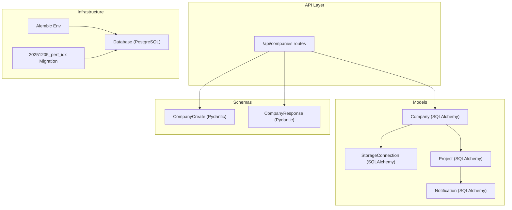
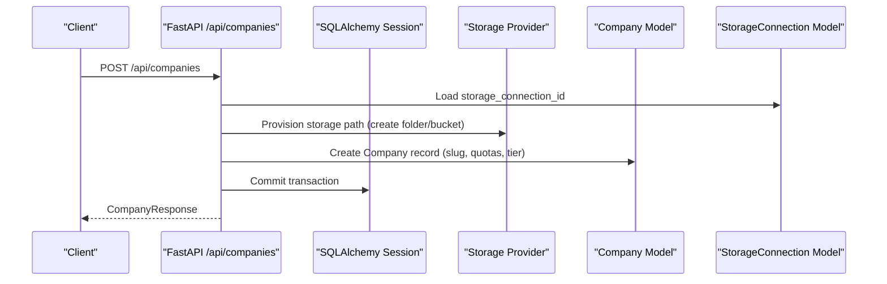
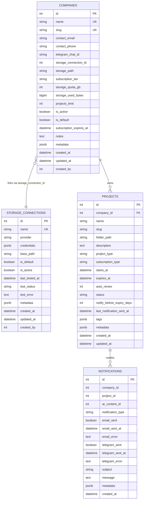
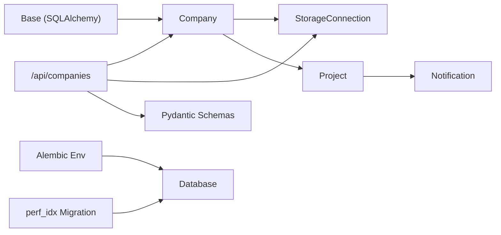

# Company Model

<cite>
**Referenced Files in This Document**
- [company.py](file://app/models/company.py)
- [company.py](file://app/schemas/company.py)
- [companies.py](file://app/api/routes/companies.py)
- [database.py](file://app/core/database.py)
- [env.py](file://alembic/env.py)
- [20251205_perf_idx.py](file://alembic/versions/20251205_perf_idx.py)
- [storage.py](file://app/models/storage.py)
- [notification.py](file://app/models/notification.py)
- [project.py](file://app/models/project.py)
- [config.py](file://app/core/config.py)
</cite>

## Table of Contents
1. [Introduction](#introduction)
2. [Project Structure](#project-structure)
3. [Core Components](#core-components)
4. [Architecture Overview](#architecture-overview)
5. [Detailed Component Analysis](#detailed-component-analysis)
6. [Dependency Analysis](#dependency-analysis)
7. [Performance Considerations](#performance-considerations)
8. [Troubleshooting Guide](#troubleshooting-guide)
9. [Conclusion](#conclusion)
10. [Appendices](#appendices)

## Introduction
This document provides comprehensive data model documentation for the Company model in the ARV platform. It covers field definitions, data types, constraints, business logic around storage settings, subscription status, and expiration policies. It also documents relationships with related models (Project, StorageConnection, Notification), common query patterns, validation rules, multi-tenancy and role-based access control considerations, performance characteristics, and integration with Alembic for schema migrations and versioning.

## Project Structure
The Company model is part of the persistence layer and is integrated with FastAPI routes, Pydantic schemas, and Alembic migrations. The following diagram shows the high-level structure and key interactions.

**Diagram sources**
- [company.py](file://app/models/company.py#L1-L41)
- [storage.py](file://app/models/storage.py#L1-L81)
- [project.py](file://app/models/project.py#L1-L35)
- [notification.py](file://app/models/notification.py#L1-L32)
- [companies.py](file://app/api/routes/companies.py#L1-L137)
- [company.py](file://app/schemas/company.py#L1-L68)
- [env.py](file://alembic/env.py#L1-L89)
- [20251205_perf_idx.py](file://alembic/versions/20251205_perf_idx.py#L1-L64)

**Section sources**
- [company.py](file://app/models/company.py#L1-L41)
- [companies.py](file://app/api/routes/companies.py#L1-L137)
- [env.py](file://alembic/env.py#L1-L89)

## Core Components
- Company (SQLAlchemy model): Defines the companies table and its fields, including identity, contacts, storage linkage, quotas, billing, status, and metadata.
- CompanyCreate and CompanyResponse (Pydantic models): Define validation rules and serialization for company creation and responses.
- Routes: Provide CRUD operations and analytics endpoints for companies, including slug generation and storage provisioning.
- StorageConnection: Represents external storage providers and is linked to Company via storage_connection_id.
- Notifications: Used by expiration tasks to notify companies about expiring projects.
- Database and Alembic: Initialize the database and manage schema migrations.

**Section sources**
- [company.py](file://app/models/company.py#L1-L41)
- [company.py](file://app/schemas/company.py#L1-L68)
- [companies.py](file://app/api/routes/companies.py#L1-L137)
- [storage.py](file://app/models/storage.py#L1-L81)
- [notification.py](file://app/models/notification.py#L1-L32)
- [database.py](file://app/core/database.py#L1-L103)
- [env.py](file://alembic/env.py#L1-L89)

## Architecture Overview
The Company model participates in a multi-tenant architecture where each tenant corresponds to a Company. The platform integrates storage providers (MinIO, Yandex Disk) and enforces quotas and subscription tiers. Expiration policies are enforced by scheduled tasks that update project statuses and send notifications.

**Diagram sources**
- [companies.py](file://app/api/routes/companies.py#L1-L137)
- [company.py](file://app/models/company.py#L1-L41)
- [storage.py](file://app/models/storage.py#L1-L81)

## Detailed Component Analysis

### Company Model Fields and Constraints
- Identity and identification
  - id: integer, primary key
  - name: string, unique, not null
  - slug: string, unique, not null
- Contact information
  - contact_email: string
  - contact_phone: string
  - telegram_chat_id: string
- Storage linkage
  - storage_connection_id: integer (links to storage_connections.id)
  - storage_path: string
- Billing and quotas
  - subscription_tier: string, default "basic"
  - storage_quota_gb: integer, default 10
  - storage_used_bytes: bigint, default 0
  - projects_limit: integer, default 50
- Status and lifecycle
  - is_active: boolean, default true
  - is_default: boolean, default false
  - subscription_expires_at: datetime
- Metadata
  - notes: text
  - metadata: JSONB, default empty object
- Audit fields
  - created_at: datetime, default current UTC
  - updated_at: datetime, default current UTC (on update)
  - created_by: integer (foreign key placeholder)

Constraints and indexes
- Unique constraints: name, slug
- Indexes: slug (partial index on is_active=true) for performance

Validation rules
- Pydantic schema enforces:
  - name length bounds
  - contact_email format (when present)
  - storage_connection_id presence for new companies
  - storage_quota_gb and projects_limit ranges
  - subscription_tier default and optional expiration

Business logic highlights
- Slug generation: derived from name, normalized to lowercase ASCII and hyphens
- Storage provisioning: on creation, the route provisions provider-specific storage (Yandex Disk or MinIO) and creates subfolders
- Default company seeding: a default Vertex AR company and default storage connection are created during initialization

Relationships
- One-to-many with Project via company_id
- Many-to-one with StorageConnection via storage_connection_id
- Notifications are associated with company_id for expiration warnings

**Section sources**
- [company.py](file://app/models/company.py#L1-L41)
- [company.py](file://app/schemas/company.py#L1-L68)
- [companies.py](file://app/api/routes/companies.py#L1-L137)
- [storage.py](file://app/models/storage.py#L1-L81)
- [project.py](file://app/models/project.py#L1-L35)
- [notification.py](file://app/models/notification.py#L1-L32)
- [20251205_perf_idx.py](file://alembic/versions/20251205_perf_idx.py#L1-L64)

### Data Validation Rules
- Pydantic CompanyCreate
  - name: required, length bounds
  - contact_email: optional, validated as email
  - storage_connection_id: required for new client companies
  - storage_path: optional; auto-generated for providers
  - subscription_tier: default "basic"
  - subscription_expires_at: optional
  - storage_quota_gb: default 10, range 1–1000
  - projects_limit: default 50, range 1–500
  - notes: optional
- Pydantic CompanyResponse
  - Full set of fields exposed in responses, including computed or defaulted values

SQLAlchemy validators
- Unique constraints on name and slug
- Partial index on slug filtered by is_active=true

**Section sources**
- [company.py](file://app/schemas/company.py#L1-L68)
- [company.py](file://app/models/company.py#L1-L41)
- [20251205_perf_idx.py](file://alembic/versions/20251205_perf_idx.py#L1-L64)

### Business Logic: Storage Settings, Subscription, and Expiration
- Storage settings
  - New companies must link to a non-default storage connection (client companies cannot use the default Vertex AR storage)
  - Provider-specific provisioning: Yandex Disk and MinIO are supported; subfolders are created automatically
- Subscription status
  - subscription_tier and subscription_expires_at define billing and access control boundaries
- Expiration policies
  - Expiration tasks scan projects and update statuses, sending notifications to the associated company

**Section sources**
- [companies.py](file://app/api/routes/companies.py#L1-L137)
- [storage.py](file://app/models/storage.py#L1-L81)
- [expiry_tasks.py](file://app/tasks/expiry_tasks.py#L1-L178)

### Multi-tenancy and Role-Based Access Control
- Multi-tenancy
  - Each Company represents a tenant boundary; Projects and other resources are scoped to a company via foreign keys
- Role-based access control
  - Not defined in the Company model itself; RBAC is typically handled at the API layer and user management level

**Section sources**
- [project.py](file://app/models/project.py#L1-L35)
- [companies.py](file://app/api/routes/companies.py#L1-L137)

### Common Queries and Examples
- Retrieve active companies (excluding default)
  - Route: GET /api/companies?include_default=false
  - Behavior: Filters out is_default=true and orders by created_at desc
- Filter by subscription tier
  - Example: Query companies where subscription_tier equals "pro" (requires adding a filter in the route or extending the route)
- Retrieve a company by slug
  - Requires a slug-based route or a slug column lookup in the route handler

Note: The current route implementation focuses on listing and CRUD operations. Additional filters can be added to the route handlers.

**Section sources**
- [companies.py](file://app/api/routes/companies.py#L1-L137)

### Schema Diagram

**Diagram sources**
- [company.py](file://app/models/company.py#L1-L41)
- [storage.py](file://app/models/storage.py#L1-L81)
- [project.py](file://app/models/project.py#L1-L35)
- [notification.py](file://app/models/notification.py#L1-L32)

### Sample Data
- Default Vertex AR company
  - name: "Vertex AR"
  - slug: "vertex-ar"
  - storage_connection_id: references default storage connection
  - storage_path: "/"
  - is_default: true
  - is_active: true
  - notes: "Основная компания Vertex AR. Локальное хранилище."
- Client company
  - name: "Acme Inc"
  - slug: "acme-inc"
  - storage_connection_id: links to a non-default provider connection
  - storage_path: provider-specific path (e.g., Yandex Disk folder or MinIO bucket)
  - subscription_tier: "basic"
  - storage_quota_gb: 10
  - projects_limit: 50
  - is_active: true

**Section sources**
- [database.py](file://app/core/database.py#L54-L100)
- [companies.py](file://app/api/routes/companies.py#L1-L137)

## Dependency Analysis
- Internal dependencies
  - Company depends on Base for table definition
  - Routes depend on Company, StorageConnection, and schemas
  - StorageConnection defines relationships back to Company
  - Notifications reference company_id for expiration alerts
- External dependencies
  - PostgreSQL dialect JSONB for metadata
  - Alembic for migrations and schema versioning

**Diagram sources**
- [company.py](file://app/models/company.py#L1-L41)
- [storage.py](file://app/models/storage.py#L1-L81)
- [project.py](file://app/models/project.py#L1-L35)
- [notification.py](file://app/models/notification.py#L1-L32)
- [companies.py](file://app/api/routes/companies.py#L1-L137)
- [company.py](file://app/schemas/company.py#L1-L68)
- [env.py](file://alembic/env.py#L1-L89)
- [20251205_perf_idx.py](file://alembic/versions/20251205_perf_idx.py#L1-L64)

**Section sources**
- [company.py](file://app/models/company.py#L1-L41)
- [storage.py](file://app/models/storage.py#L1-L81)
- [project.py](file://app/models/project.py#L1-L35)
- [notification.py](file://app/models/notification.py#L1-L32)
- [companies.py](file://app/api/routes/companies.py#L1-L137)
- [env.py](file://alembic/env.py#L1-L89)

## Performance Considerations
- Indexing strategy
  - Partial index on companies.slug filtered by is_active=true to optimize slug lookups for active tenants
  - Additional indexes exist for analytics and project queries
- Query patterns
  - Listing companies excludes default companies by default and sorts by creation date
  - Filtering by subscription tier is not currently implemented in routes; can be added to improve performance for tier-based reporting
- Storage and quotas
  - storage_used_bytes is tracked; consider periodic updates and batched calculations for large datasets
- Concurrency
  - Async database sessions and Alembic online/offline migrations ensure safe schema evolution

**Section sources**
- [20251205_perf_idx.py](file://alembic/versions/20251205_perf_idx.py#L1-L64)
- [companies.py](file://app/api/routes/companies.py#L1-L137)
- [company.py](file://app/models/company.py#L1-L41)

## Troubleshooting Guide
- Slug uniqueness conflicts
  - Symptom: Error when creating a company with an existing slug
  - Resolution: Ensure slug derivation is unique; the route checks slug existence before creation
- Invalid storage connection
  - Symptom: Error when storage_connection_id is missing or refers to a default connection for client companies
  - Resolution: Use a non-default storage connection; the route validates provider and prevents default usage for clients
- Storage provisioning failures
  - Symptom: Failure to create provider folders or buckets
  - Resolution: Verify provider credentials and permissions; the route attempts to create subfolders and raises errors on failure
- Default company seeding
  - Symptom: Missing default company or storage connection
  - Resolution: Run initialization to seed defaults; the database initializer creates default entries if missing

**Section sources**
- [companies.py](file://app/api/routes/companies.py#L1-L137)
- [database.py](file://app/core/database.py#L54-L100)

## Conclusion
The Company model encapsulates tenant-level configuration, storage linkage, quotas, and subscription metadata. It integrates tightly with routes for provisioning and validation, and with Alembic for schema evolution. The partial index on slug for active companies improves lookup performance. Expiration policies are enforced by tasks that update project statuses and notify companies. While RBAC is not defined at the model level, the multi-tenant design ensures clear separation of data and resources.

## Appendices

### Appendix A: Alembic Integration and Versioning
- Alembic configuration loads the shared Base metadata and applies migrations offline or online
- The perf_idx migration adds performance-related indexes, including a partial index on companies.slug for active records

**Section sources**
- [env.py](file://alembic/env.py#L1-L89)
- [20251205_perf_idx.py](file://alembic/versions/20251205_perf_idx.py#L1-L64)

### Appendix B: Configuration References
- Database and storage settings influence default company seeding and storage provider behavior

**Section sources**
- [config.py](file://app/core/config.py#L1-L134)
- [database.py](file://app/core/database.py#L1-L103)