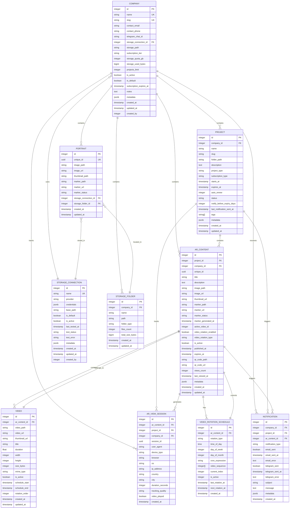
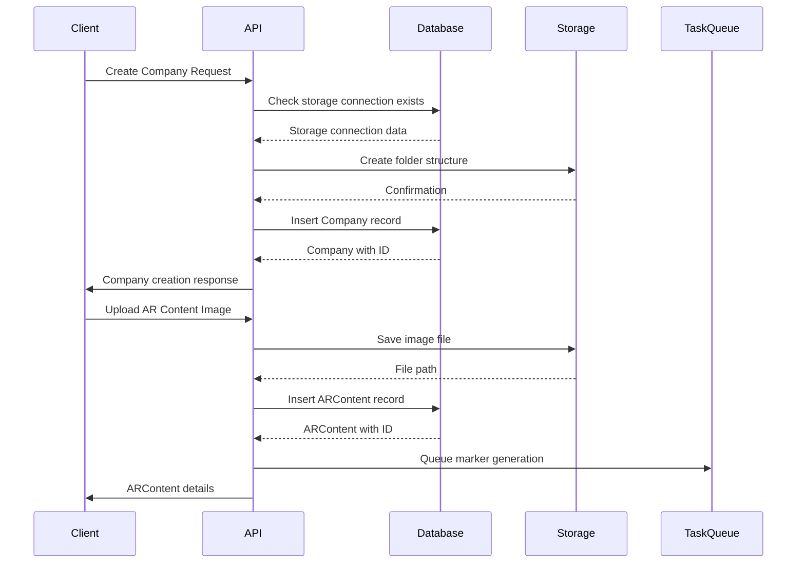
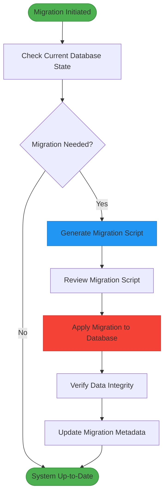
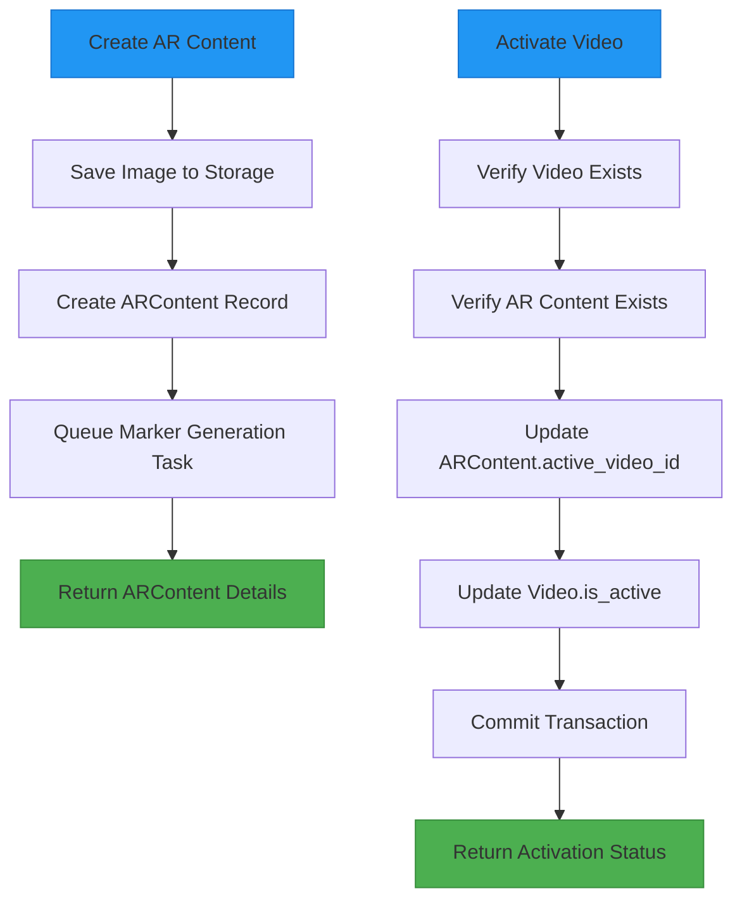

# Data Models & ORM

<cite>
**Referenced Files in This Document**   
- [company.py](file://app/models/company.py)
- [project.py](file://app/models/project.py)
- [ar_content.py](file://app/models/ar_content.py)
- [storage.py](file://app/models/storage.py)
- [video.py](file://app/models/video.py)
- [ar_view_session.py](file://app/models/ar_view_session.py)
- [video_rotation_schedule.py](file://app/models/video_rotation_schedule.py)
- [notification.py](file://app/models/notification.py)
- [portrait.py](file://app/models/portrait.py)
- [database.py](file://app/core/database.py)
- [20251205_perf_idx.py](file://alembic/versions/20251205_perf_idx.py)
- [companies.py](file://app/api/routes/companies.py)
- [projects.py](file://app/api/routes/projects.py)
- [ar_content.py](file://app/api/routes/ar_content.py)
- [videos.py](file://app/api/routes/videos.py)
- [portraits.py](file://app/api/routes/portraits.py)
</cite>

## Table of Contents
1. [Introduction](#introduction)
2. [Core Data Models](#core-data-models)
3. [Entity Relationship Model](#entity-relationship-model)
4. [Detailed Model Analysis](#detailed-model-analysis)
5. [Data Access Patterns](#data-access-patterns)
6. [Performance Considerations](#performance-considerations)
7. [Data Lifecycle and Retention](#data-lifecycle-and-retention)
8. [Database Migrations](#database-migrations)
9. [Security and Access Control](#security-and-access-control)
10. [Model Usage Examples](#model-usage-examples)

## Introduction
This document provides comprehensive documentation for the ARV platform's database schema, detailing the data models implemented using SQLAlchemy ORM. The ARV platform is designed to manage augmented reality content with a focus on company management, project organization, AR content delivery, and viewer analytics. The data model supports a multi-tenant architecture where companies can create projects containing AR content that displays videos with optional rotation scheduling. The documentation covers entity relationships, field definitions, constraints, data validation rules, business logic, and performance optimization strategies.

The platform uses PostgreSQL as its primary database with JSONB fields for flexible metadata storage and ARRAY types for tag management. The ORM layer is built on SQLAlchemy with async support, enabling efficient database operations in the FastAPI application. Alembic handles database migrations, ensuring schema evolution is tracked and reproducible across environments.

## Core Data Models

The ARV platform's data model consists of several interconnected entities that support the core functionality of managing companies, their projects, AR content, and associated media. The primary models include Company, Project, ARContent, StorageConnection, Video, ARViewSession, VideoRotationSchedule, Notification, and Portrait. These models are designed with a hierarchical relationship structure where companies contain projects, projects contain AR content, and AR content can have multiple videos with rotation scheduling.

The data model implements soft references rather than strict foreign key constraints in many cases, providing flexibility for data management while maintaining referential integrity through application logic. Timestamps are consistently implemented across all models with created_at and updated_at fields, and most models include metadata fields using PostgreSQL's JSONB type for extensible data storage without schema changes.

**Section sources**
- [company.py](file://app/models/company.py#L7-L41)
- [project.py](file://app/models/project.py#L7-L35)
- [ar_content.py](file://app/models/ar_content.py#L7-L46)
- [storage.py](file://app/models/storage.py#L8-L81)
- [video.py](file://app/models/video.py#L5-L31)

## Entity Relationship Model

**Diagram sources**
- [company.py](file://app/models/company.py#L7-L41)
- [project.py](file://app/models/project.py#L7-L35)
- [ar_content.py](file://app/models/ar_content.py#L7-L46)
- [storage.py](file://app/models/storage.py#L8-L81)
- [video.py](file://app/models/video.py#L5-L31)
- [ar_view_session.py](file://app/models/ar_view_session.py#L7-L31)
- [video_rotation_schedule.py](file://app/models/video_rotation_schedule.py#L5-L26)
- [notification.py](file://app/models/notification.py#L7-L32)
- [portrait.py](file://app/models/portrait.py#L7-L28)

## Detailed Model Analysis

### Company Model
The Company model represents organizations using the ARV platform. Each company is uniquely identified by a slug derived from its name, ensuring URL-friendly identifiers. The model includes contact information, storage configuration, subscription details, and quota management. Companies are linked to a storage connection that defines where their content is stored, supporting multiple storage providers including local disk, MinIO, and Yandex Disk.

The model implements business rules for subscription management, including expiration dates and notification settings. The is_default flag identifies the platform's default company (Vertex AR), which uses local storage. Storage quotas are enforced at the application level, with storage_used_bytes tracking actual usage against the storage_quota_gb limit.

**Section sources**
- [company.py](file://app/models/company.py#L7-L41)
- [companies.py](file://app/api/routes/companies.py#L15-L137)

### Project Model
The Project model represents initiatives within a company that contain AR content. Each project belongs to a company and has its own lifecycle with start and expiration dates. Projects support auto-renewal and subscription types (monthly by default). The model includes status tracking and notification settings for expiration alerts.

Projects can be extended programmatically through the API, which updates the expires_at timestamp. The tags field uses PostgreSQL's ARRAY type to store multiple string tags, enabling content categorization. The folder_path field specifies the storage location for project assets.

**Section sources**
- [project.py](file://app/models/project.py#L7-L35)
- [projects.py](file://app/api/routes/projects.py#L14-L145)

### ARContent Model
The ARContent model represents augmented reality experiences that combine an image marker with video content. Each AR content item has a UUID-based unique_id for public sharing and tracking. The model supports multiple videos with one active video at a time, controlled by the active_video_id field.

The marker generation process is managed asynchronously, with marker_status tracking the state (pending, processing, completed). Video rotation scheduling can be enabled, allowing different videos to be displayed at different times. The model includes analytics fields like views_count and last_viewed_at to track engagement.

**Section sources**
- [ar_content.py](file://app/models/ar_content.py#L7-L46)
- [ar_content.py](file://app/api/routes/ar_content.py#L24-L184)

### StorageConnection Model
The StorageConnection model defines configurations for different storage providers. Each connection has a provider type (local_disk, minio, yandex_disk) and provider-specific credentials stored as JSONB. The model supports testing connectivity with last_tested_at, test_status, and test_error fields.

The is_default flag identifies the platform's default storage connection, which uses local disk storage. Companies are linked to storage connections, enabling multi-tenant isolation of content. The relationship is bidirectional, allowing navigation from storage connections to their associated companies.

**Section sources**
- [storage.py](file://app/models/storage.py#L8-L38)
- [companies.py](file://app/api/routes/companies.py#L22-L32)

### Video Model
The Video model represents video assets associated with AR content. Each video belongs to an AR content item and has file path and URL information for access. The model includes technical metadata like duration, dimensions, size, and MIME type.

Videos can be scheduled with start and end times, and assigned a rotation_order for sequential playback. The is_active flag indicates whether a video is currently the active video for its AR content. The model supports multiple videos per AR content, enabling content rotation without creating new AR experiences.

**Section sources**
- [video.py](file://app/models/video.py#L5-L31)
- [videos.py](file://app/api/routes/videos.py#L13-L64)

### ARViewSession Model
The ARViewSession model tracks user interactions with AR content. Each session records device information (user agent, device type, browser, OS), geolocation (IP address, country, city), and viewing metrics (duration, tracking quality, whether video played).

The model serves as an analytics foundation, enabling insights into user engagement patterns, geographic distribution, and technical performance. Sessions are linked to specific AR content, projects, and companies, allowing aggregation at multiple levels. The data supports business intelligence and optimization of AR experiences.

**Section sources**
- [ar_view_session.py](file://app/models/ar_view_session.py#L7-L31)

### VideoRotationSchedule Model
The VideoRotationSchedule model manages the rotation of videos within AR content. It supports multiple scheduling strategies through the rotation_type field, including time-of-day, day-of-week, day-of-month, and cron expressions. The video_sequence array defines the order of videos to rotate through.

The model includes current_index to track the active video in the sequence and timestamps for last and next rotation. This enables automated content rotation without manual intervention, useful for promotional campaigns or time-based content delivery. The schedule can be enabled or disabled with the is_active flag.

**Section sources**
- [video_rotation_schedule.py](file://app/models/video_rotation_schedule.py#L5-L26)

### Notification Model
The Notification model tracks communication sent to users about system events. Notifications can be associated with companies, projects, or specific AR content. The model supports multiple delivery channels (email, Telegram) with separate tracking for each.

Delivery status is recorded with sent flags, timestamps, and error messages if delivery failed. The notification_type field categorizes the purpose of the notification, while subject and message contain the content. This model enables reliable communication and delivery confirmation for critical events like subscription expirations.

**Section sources**
- [notification.py](file://app/models/notification.py#L7-L32)

### Portrait Model
The Portrait model represents a specialized type of AR content focused on portrait images that trigger AR experiences. Each portrait has a unique_id (UUID) for public sharing and tracking. The model includes file paths and URLs for the image and generated AR marker.

The marker generation process is asynchronous, with marker_status tracking the state. Portraits are stored in a specific storage connection and folder, enabling organized content management. The model supports future expansion with metadata storage and potential video associations.

**Section sources**
- [portrait.py](file://app/models/portrait.py#L7-L28)
- [portraits.py](file://app/api/routes/portraits.py#L22-L116)

## Data Access Patterns

The ARV platform implements several data access patterns optimized for performance and usability. The application uses SQLAlchemy's async session pattern with dependency injection to provide database sessions to API endpoints. The get_db dependency ensures proper session lifecycle management with automatic commit, rollback, and cleanup.

Relationship loading is primarily done through explicit queries rather than eager loading, preventing N+1 query problems. For example, when retrieving a company's projects, the application executes a separate query for projects filtered by company_id rather than loading all relationships automatically. This approach provides better control over query performance and result size.

The platform uses indexing strategically to optimize common query patterns. Performance-critical fields like company_id, ar_content_id, and created_at have indexes to accelerate analytics queries. Composite indexes are used for common filter combinations, such as company_id and status for project queries.

**Diagram sources**
- [database.py](file://app/core/database.py#L30-L45)
- [companies.py](file://app/api/routes/companies.py#L15-L88)
- [ar_content.py](file://app/api/routes/ar_content.py#L24-L60)

**Section sources**
- [database.py](file://app/core/database.py#L30-L45)
- [companies.py](file://app/api/routes/companies.py#L15-L137)
- [ar_content.py](file://app/api/routes/ar_content.py#L24-L184)

## Performance Considerations

The ARV platform's data model includes several performance optimizations to handle expected workloads. Indexes are strategically applied to fields commonly used in WHERE clauses, JOIN conditions, and ORDER BY operations. The alembic migration 20251205_perf_idx.py creates composite indexes for high-frequency query patterns:

- idx_ar_sessions_company_created on ar_view_sessions(company_id, created_at) for analytics by company and time
- idx_ar_sessions_content on ar_view_sessions(ar_content_id) for content performance tracking
- idx_companies_slug_active on companies(slug) with partial index for active companies only
- idx_projects_company_status on projects(company_id, status) for filtering projects by company and status
- idx_rotation_schedules_next on video_rotation_schedules(next_rotation_at) for efficient rotation scheduling

The database configuration in database.py implements connection pooling with a pool_size of 20 and max_overflow of 10, allowing efficient handling of concurrent requests. The pool_recycle setting of 3600 seconds prevents connection staleness in long-running applications.

Query optimization is achieved through selective field loading, where API endpoints retrieve only the fields needed for the response rather than entire model instances. This reduces network overhead and memory usage, particularly for models with large text or JSON fields.

**Section sources**
- [20251205_perf_idx.py](file://alembic/versions/20251205_perf_idx.py#L1-L63)
- [database.py](file://app/core/database.py#L8-L15)

## Data Lifecycle and Retention

The ARV platform implements a structured data lifecycle management approach. Data retention is primarily driven by business requirements and storage quotas rather than automatic expiration. The Company model includes storage_quota_gb and storage_used_bytes fields that enable quota enforcement at the application level.

AR content and videos may have expiration dates (expires_at fields), after which they are no longer served to users. However, the data is retained in the database for historical and analytical purposes. The platform does not currently implement automated data archival or deletion, relying instead on manual administrative actions.

The ARViewSession model collects analytics data that may be subject to periodic aggregation and purging to manage storage growth. While the current schema doesn't specify retention periods, the design allows for future implementation of data lifecycle policies through batch processing jobs.

File storage follows a hierarchical organization with company-specific folders, enabling efficient backup and archival at the company level. The storage_path field in Company and folder_path in Project define the directory structure within the storage provider.

**Section sources**
- [company.py](file://app/models/company.py#L24-L28)
- [ar_content.py](file://app/models/ar_content.py#L34-L35)
- [project.py](file://app/models/project.py#L21-L22)

## Database Migrations

The ARV platform uses Alembic for database schema migrations, providing version control and reproducible schema changes. The alembic.ini configuration file defines the migration environment, with versions stored in the alembic/versions directory. Each migration script includes upgrade and downgrade functions to support forward and backward compatibility.

Migration scripts are Python files with timestamps in their names, ensuring chronological ordering. The 20251205_perf_idx.py migration demonstrates the creation of performance indexes, with proper downgrade functions to remove the indexes if needed. The revision identifiers and dependencies are automatically managed by Alembic.

The database.py module includes initialization functions that can create tables if they don't exist (init_db) and seed default data (seed_defaults). The seed_defaults function creates a default storage connection and company if they don't already exist, ensuring the platform has a working configuration after deployment.

**Diagram sources**
- [20251205_perf_idx.py](file://alembic/versions/20251205_perf_idx.py#L1-L63)
- [database.py](file://app/core/database.py#L48-L99)

**Section sources**
- [20251205_perf_idx.py](file://alembic/versions/20251205_perf_idx.py#L1-L63)
- [database.py](file://app/core/database.py#L48-L99)

## Security and Access Control

The ARV platform implements data security and access control at the model level through several mechanisms. While the current schema doesn't include explicit user or role models, access control is enforced through tenant isolation via the company_id field present in most models.

The StorageConnection model securely stores provider credentials in the JSONB credentials field, which should be encrypted at rest. The platform uses environment variables for sensitive configuration, with settings managed in the config module. The database connection itself uses SSL/TLS for encrypted communication.

Data privacy is addressed through selective exposure of model fields in API responses. The platform distinguishes between internal identifiers (integer IDs) and public identifiers (UUIDs), exposing only the latter in public-facing URLs. The unique_id fields in ARContent and Portrait models serve as unguessable public identifiers, preventing enumeration attacks.

The notification system includes error tracking for delivery failures, but error messages are stored without sensitive information. The platform should implement additional security measures such as audit logging, field-level encryption for sensitive data, and more granular access controls as it evolves.

**Section sources**
- [storage.py](file://app/models/storage.py#L16-L17)
- [ar_content.py](file://app/models/ar_content.py#L14-L15)
- [portrait.py](file://app/models/portrait.py#L11-L12)

## Model Usage Examples

The ARV platform's models are used throughout the API routes to implement business functionality. When creating a company, the API validates the storage connection, creates the necessary folder structure in the storage provider, and inserts the company record with appropriate defaults. The companies.py route demonstrates transactional integrity by committing the database transaction only after successful storage setup.

AR content creation involves multiple steps: saving the image file to storage, creating the ARContent database record, and queuing an asynchronous task to generate the AR marker. This separation of concerns ensures that file operations don't block database transactions and that computationally intensive tasks (marker generation) don't impact API response times.

Video management is tightly coupled with AR content through the active_video_id field. When activating a video, the system updates both the video's is_active status and the AR content's active_video_id in a single transaction, ensuring consistency. The videos.py route handles this coordination, demonstrating how related models are updated together.

**Diagram sources**
- [ar_content.py](file://app/api/routes/ar_content.py#L24-L60)
- [videos.py](file://app/api/routes/videos.py#L52-L63)

**Section sources**
- [ar_content.py](file://app/api/routes/ar_content.py#L24-L184)
- [videos.py](file://app/api/routes/videos.py#L13-L64)