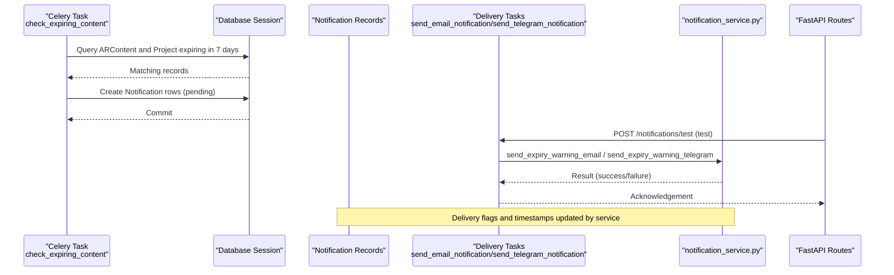
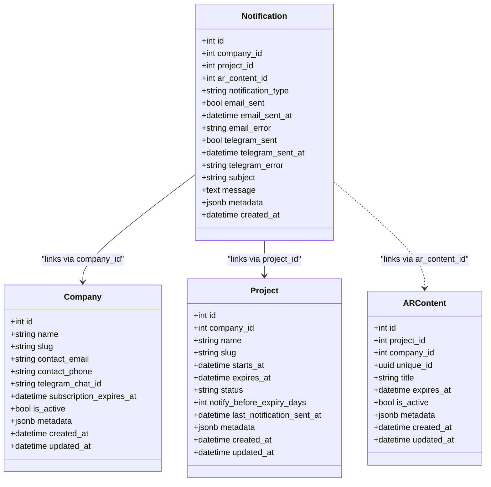
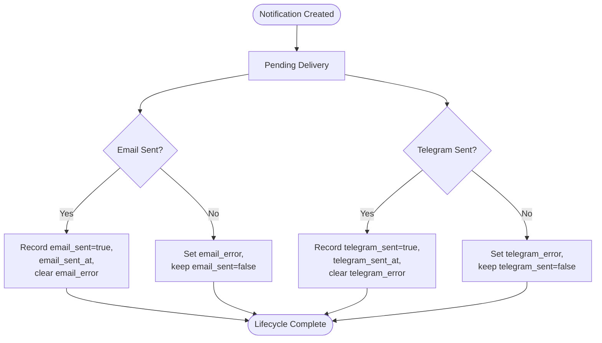
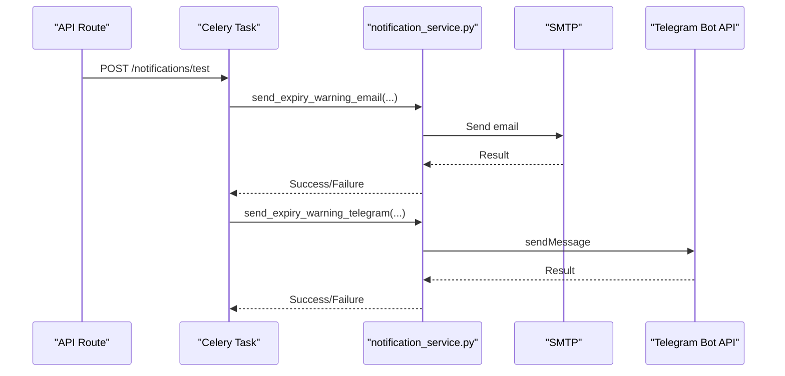
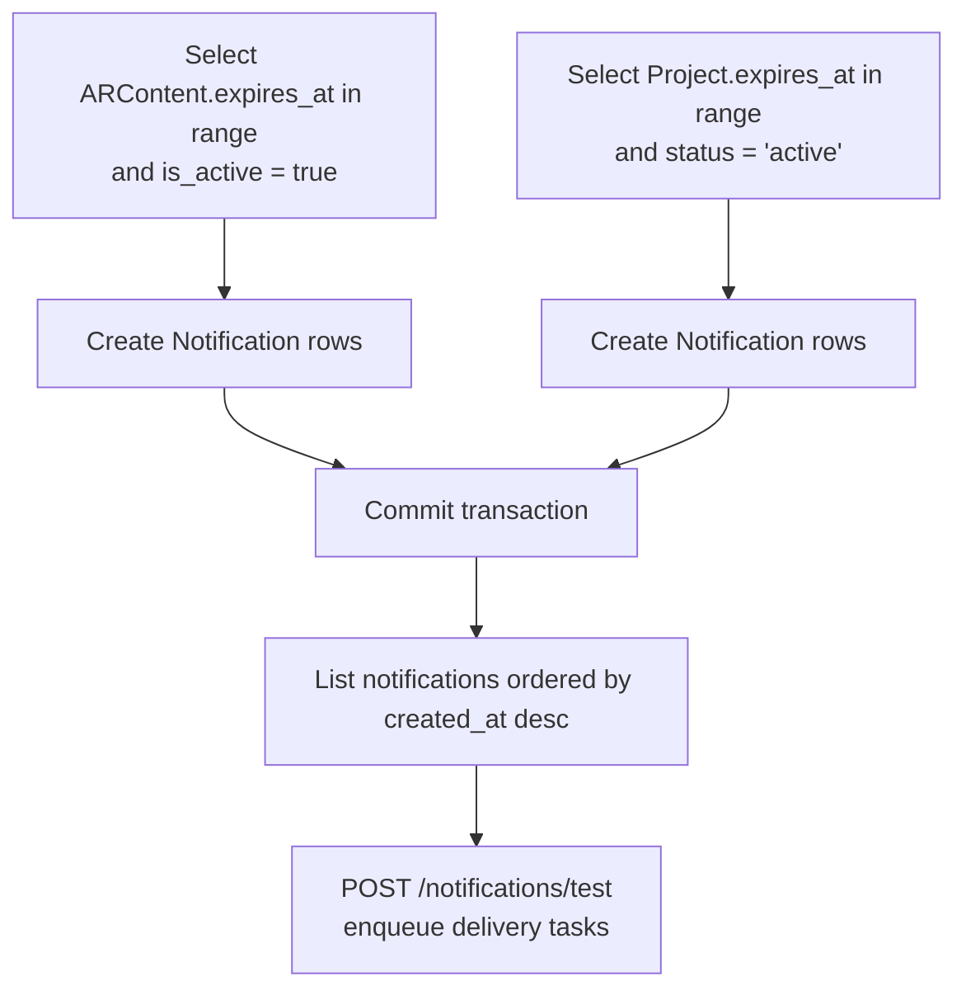
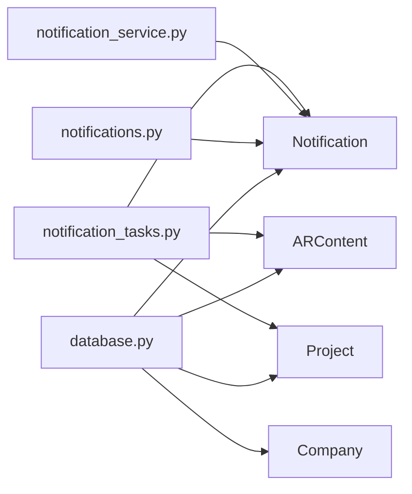
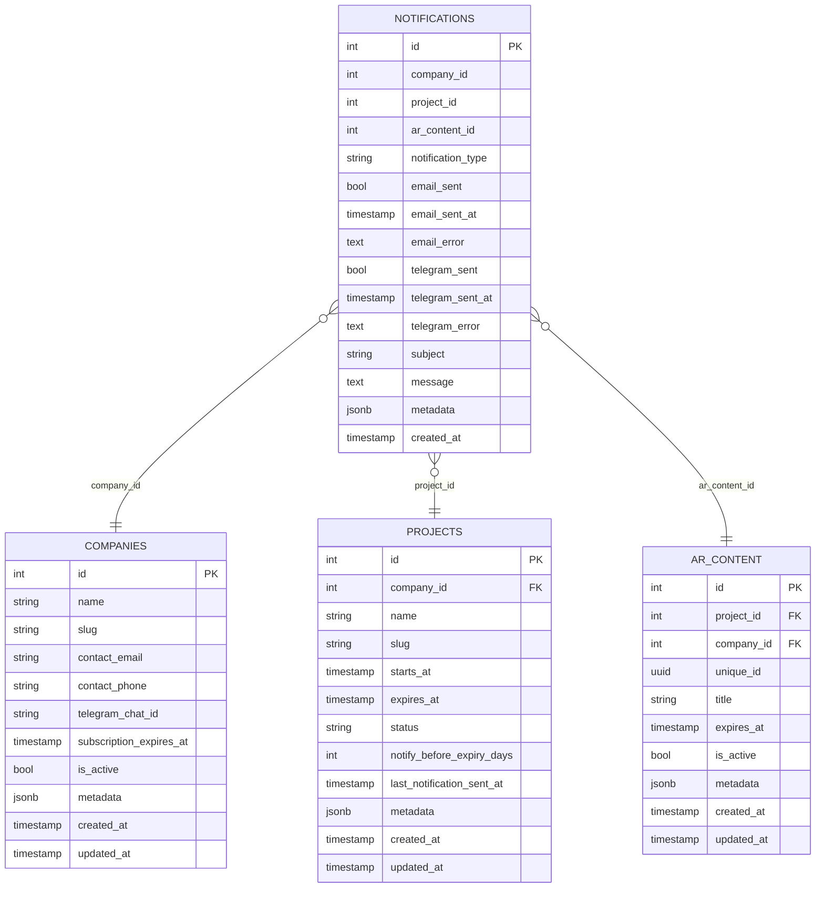

# Notification Model

<cite>
**Referenced Files in This Document**
- [notification.py](file://app/models/notification.py)
- [company.py](file://app/models/company.py)
- [project.py](file://app/models/project.py)
- [ar_content.py](file://app/models/ar_content.py)
- [notification_tasks.py](file://app/tasks/notification_tasks.py)
- [notification_service.py](file://app/services/notification_service.py)
- [notifications.py](file://app/api/routes/notifications.py)
- [database.py](file://app/core/database.py)
- [20251205_perf_idx.py](file://alembic/versions/20251205_perf_idx.py)
</cite>

## Table of Contents
1. [Introduction](#introduction)
2. [Project Structure](#project-structure)
3. [Core Components](#core-components)
4. [Architecture Overview](#architecture-overview)
5. [Detailed Component Analysis](#detailed-component-analysis)
6. [Dependency Analysis](#dependency-analysis)
7. [Performance Considerations](#performance-considerations)
8. [Troubleshooting Guide](#troubleshooting-guide)
9. [Conclusion](#conclusion)
10. [Appendices](#appendices)

## Introduction
This document provides comprehensive data model documentation for the Notification model in the ARV platform. It explains the fields, relationships to Company and Project models, lifecycle management, delivery tracking across multiple channels (email and Telegram), and operational patterns used by Celery tasks and the notification service. It also outlines indexing strategies for efficient task processing and describes how the model supports context-aware delivery by linking notifications to company, project, and AR content.

## Project Structure
The Notification model is part of the data layer and integrates with Celery tasks and FastAPI routes for scheduling and delivery. The relevant components are organized as follows:
- Data models: Notification, Company, Project, ARContent
- Task orchestration: notification_tasks.py (Celery tasks)
- Delivery service: notification_service.py (email and Telegram integrations)
- API surface: notifications.py (list and test endpoints)
- Database configuration: database.py (async engine/session)
- Indexing: alembic migration for performance indexes

```mermaid
graph TB
subgraph "Models"
N["Notification<br/>notifications"]
C["Company<br/>companies"]
P["Project<br/>projects"]
AC["ARContent<br/>ar_content"]
end
subgraph "Tasks"
NT["notification_tasks.py<br/>check_expiring_content,<br/>send_email_notification,<br/>send_telegram_notification"]
end
subgraph "Services"
NS["notification_service.py<br/>send_expiry_warning_email,<br/>send_expiry_warning_telegram"]
end
subgraph "API"
NR["notifications.py<br/>GET /notifications,<br/>POST /notifications/test"]
end
subgraph "DB"
DB["database.py<br/>AsyncSessionLocal, Base"]
IDX["20251205_perf_idx.py<br/>indexes"]
end
N --> C
N --> P
N -.-> AC
NT --> N
NT --> AC
NT --> P
NS --> N
NR --> N
DB --> N
DB --> C
DB --> P
DB --> AC
IDX --> N
```

**Diagram sources**
- [notification.py](file://app/models/notification.py#L1-L32)
- [company.py](file://app/models/company.py#L1-L41)
- [project.py](file://app/models/project.py#L1-L35)
- [ar_content.py](file://app/models/ar_content.py#L1-L46)
- [notification_tasks.py](file://app/tasks/notification_tasks.py#L1-L118)
- [notification_service.py](file://app/services/notification_service.py#L1-L81)
- [notifications.py](file://app/api/routes/notifications.py#L1-L40)
- [database.py](file://app/core/database.py#L1-L103)
- [20251205_perf_idx.py](file://alembic/versions/20251205_perf_idx.py#L1-L64)

**Section sources**
- [notification.py](file://app/models/notification.py#L1-L32)
- [notification_tasks.py](file://app/tasks/notification_tasks.py#L1-L118)
- [notification_service.py](file://app/services/notification_service.py#L1-L81)
- [notifications.py](file://app/api/routes/notifications.py#L1-L40)
- [database.py](file://app/core/database.py#L1-L103)
- [20251205_perf_idx.py](file://alembic/versions/20251205_perf_idx.py#L1-L64)

## Core Components
- Notification model: Stores notification metadata, delivery flags, and channel-specific status/error fields.
- Company model: Provides organization-level contact information and context for notifications.
- Project model: Contains project-level expiration and status used to trigger notifications.
- ARContent model: Links AR content expiration to notifications for granular alerts.
- Celery tasks: Generate notifications and dispatch delivery tasks.
- Notification service: Implements email and Telegram delivery integrations.
- API routes: Expose listing and testing endpoints for notifications.

Key fields in the Notification model:
- Identifiers: id, company_id, project_id, ar_content_id
- Type: notification_type (e.g., expiry_warning)
- Delivery flags: email_sent, telegram_sent
- Timestamps: email_sent_at, telegram_sent_at, created_at
- Errors: email_error, telegram_error
- Content: subject, message, metadata (JSONB)
- Context: links to Company and Project for context-aware delivery

**Section sources**
- [notification.py](file://app/models/notification.py#L1-L32)
- [company.py](file://app/models/company.py#L1-L41)
- [project.py](file://app/models/project.py#L1-L35)
- [ar_content.py](file://app/models/ar_content.py#L1-L46)

## Architecture Overview
The notification lifecycle spans creation, scheduling, and delivery:
- Creation: Celery task scans expiring AR content and projects, creates Notification records.
- Dispatch: Delivery tasks enqueue email and Telegram messages using the notification_service.
- Tracking: Delivery flags and timestamps reflect delivery outcomes; errors capture failures.
- Context: Notifications link to Company and Project to enable context-aware delivery and routing.



**Diagram sources**
- [notification_tasks.py](file://app/tasks/notification_tasks.py#L1-L118)
- [notification_service.py](file://app/services/notification_service.py#L1-L81)
- [notifications.py](file://app/api/routes/notifications.py#L1-L40)

## Detailed Component Analysis

### Notification Model Schema
The Notification model defines the core schema for storing notifications and delivery status. It includes:
- Foreign keys: company_id, project_id, ar_content_id
- Type: notification_type (string)
- Delivery flags and timestamps: email_sent, email_sent_at, email_error; telegram_sent, telegram_sent_at, telegram_error
- Content: subject, message
- Metadata: JSONB for extensibility
- Created timestamp: created_at



**Diagram sources**
- [notification.py](file://app/models/notification.py#L1-L32)
- [company.py](file://app/models/company.py#L1-L41)
- [project.py](file://app/models/project.py#L1-L35)
- [ar_content.py](file://app/models/ar_content.py#L1-L46)

**Section sources**
- [notification.py](file://app/models/notification.py#L1-L32)

### Relationship to Company and Project
- company_id: Establishes organizational context for notifications. Used by the scheduler to create notifications for expiring content and projects.
- project_id: Associates notifications with a specific project, enabling targeted delivery and status tracking.
- ar_content_id: Optional association to AR content for granular expiration warnings.

These relationships enable context-aware delivery and reporting. While the model does not define explicit SQLAlchemy foreign key constraints, the logical relationships are enforced by the application code during creation and querying.

**Section sources**
- [notification_tasks.py](file://app/tasks/notification_tasks.py#L27-L68)
- [notification.py](file://app/models/notification.py#L10-L15)

### Notification Lifecycle Management
- Creation: The scheduler identifies expiring AR content and projects and inserts Notification records with notification_type set to expiry_warning.
- Pending state: Delivery flags are initialized to false; timestamps and errors remain unset.
- Delivery: Delivery tasks invoke the notification_service to send email and Telegram messages. Results update delivery flags and timestamps.
- Failure handling: Errors are captured in email_error and telegram_error; delivery flags indicate failure when errors are present.
- Retry logic: The current implementation does not implement automatic retries. Delivery tasks return acknowledgments without built-in retry mechanisms. External monitoring and alerting can be used to detect backlog and failures.



**Diagram sources**
- [notification.py](file://app/models/notification.py#L16-L31)
- [notification_service.py](file://app/services/notification_service.py#L1-L81)

**Section sources**
- [notification_tasks.py](file://app/tasks/notification_tasks.py#L27-L68)
- [notification_service.py](file://app/services/notification_service.py#L1-L81)
- [notification.py](file://app/models/notification.py#L16-L31)

### Delivery Channels: Email and Telegram
- Unified schema: Both channels share the same Notification record. Channel-specific flags and timestamps track delivery outcomes.
- Email: Implemented via SMTP in the notification_service; delivery flags and errors recorded upon completion.
- Telegram: Implemented via Telegram Bot API in the notification_service; delivery flags and errors recorded upon completion.
- Test endpoint: The API exposes a test endpoint that enqueues delivery tasks for quick verification.



**Diagram sources**
- [notifications.py](file://app/api/routes/notifications.py#L35-L40)
- [notification_service.py](file://app/services/notification_service.py#L1-L81)

**Section sources**
- [notification_service.py](file://app/services/notification_service.py#L1-L81)
- [notifications.py](file://app/api/routes/notifications.py#L35-L40)

### Query Patterns and Task Processing
Common query patterns used by the notification system:
- Fetch expiring AR content and projects within a date range to create notifications.
- List recent notifications for administrative inspection.
- Enqueue delivery tasks for testing.

Representative patterns:
- Expired content and project scanning: The scheduler queries ARContent and Project by expiration date ranges and status to create Notification entries.
- Listing notifications: The API route retrieves notifications ordered by creation time for display.
- Testing delivery: The API route enqueues email and Telegram delivery tasks.



**Diagram sources**
- [notification_tasks.py](file://app/tasks/notification_tasks.py#L27-L68)
- [notifications.py](file://app/api/routes/notifications.py#L13-L33)

**Section sources**
- [notification_tasks.py](file://app/tasks/notification_tasks.py#L27-L68)
- [notifications.py](file://app/api/routes/notifications.py#L13-L33)

### Sample Notification Record
A typical Notification record includes:
- Identifiers: company_id, project_id, ar_content_id
- Type: notification_type (e.g., expiry_warning)
- Delivery flags and timestamps: email_sent, email_sent_at, telegram_sent, telegram_sent_at
- Content: subject, message
- Metadata: JSONB payload (e.g., expiration timestamps)
- Created timestamp: created_at

This structure enables unified handling of multiple delivery channels while preserving context for reporting and auditing.

**Section sources**
- [notification.py](file://app/models/notification.py#L10-L31)

## Dependency Analysis
- Notification depends on Company and Project for context-aware delivery.
- Celery tasks depend on the Notification model and ARContent/Project models to create notifications.
- The notification_service depends on configuration settings to connect to external APIs.
- The API routes depend on the Notification model for listing and testing.



**Diagram sources**
- [notification_tasks.py](file://app/tasks/notification_tasks.py#L1-L118)
- [notification_service.py](file://app/services/notification_service.py#L1-L81)
- [notifications.py](file://app/api/routes/notifications.py#L1-L40)
- [notification.py](file://app/models/notification.py#L1-L32)
- [company.py](file://app/models/company.py#L1-L41)
- [project.py](file://app/models/project.py#L1-L35)
- [ar_content.py](file://app/models/ar_content.py#L1-L46)
- [database.py](file://app/core/database.py#L1-L103)

**Section sources**
- [notification_tasks.py](file://app/tasks/notification_tasks.py#L1-L118)
- [notification_service.py](file://app/services/notification_service.py#L1-L81)
- [notifications.py](file://app/api/routes/notifications.py#L1-L40)
- [notification.py](file://app/models/notification.py#L1-L32)
- [company.py](file://app/models/company.py#L1-L41)
- [project.py](file://app/models/project.py#L1-L35)
- [ar_content.py](file://app/models/ar_content.py#L1-L46)
- [database.py](file://app/core/database.py#L1-L103)

## Performance Considerations
- Indexing strategy: The current migration adds performance indexes for analytics, companies, projects, and rotation schedules. There is no dedicated index for notifications on status or scheduled_time in the provided migration. For efficient task processing, consider adding:
  - An index on Notification.company_id for filtering by organization.
  - An index on Notification.project_id for project-scoped queries.
  - An index on Notification.notification_type for filtering by type.
  - An index on Notification.created_at for chronological ordering and pagination.
  - An index on Notification.email_sent and Notification.telegram_sent for pending delivery queries.
- Bulk operations: The scheduler creates multiple Notification records in a single transaction to minimize overhead.
- Queue prioritization: Celery task routing and concurrency controls should be configured to prioritize notification tasks based on urgency and SLAs.

[No sources needed since this section provides general guidance]

## Troubleshooting Guide
- Delivery failures:
  - Check email_error and telegram_error fields for details.
  - Verify external API credentials and endpoints in the notification_service.
- Pending notifications:
  - Use query patterns to identify pending notifications by delivery flags and timestamps.
- Monitoring:
  - Integrate with Celery queue metrics and alerting to detect backlog and failures.
- API inspection:
  - Use GET /notifications to review recent notifications and their delivery status.

**Section sources**
- [notification.py](file://app/models/notification.py#L16-L31)
- [notification_service.py](file://app/services/notification_service.py#L1-L81)
- [notifications.py](file://app/api/routes/notifications.py#L13-L33)

## Conclusion
The Notification model provides a unified schema for managing expiration warnings across email and Telegram channels. It leverages contextual associations with Company and Project to enable targeted delivery and reporting. While the current implementation focuses on creation and basic delivery tracking, future enhancements can include explicit foreign key constraints, retry logic, and dedicated indexes for improved performance and reliability.

## Appendices

### Data Model Diagram


**Diagram sources**
- [notification.py](file://app/models/notification.py#L1-L32)
- [company.py](file://app/models/company.py#L1-L41)
- [project.py](file://app/models/project.py#L1-L35)
- [ar_content.py](file://app/models/ar_content.py#L1-L46)