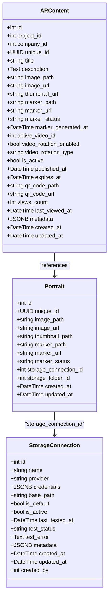
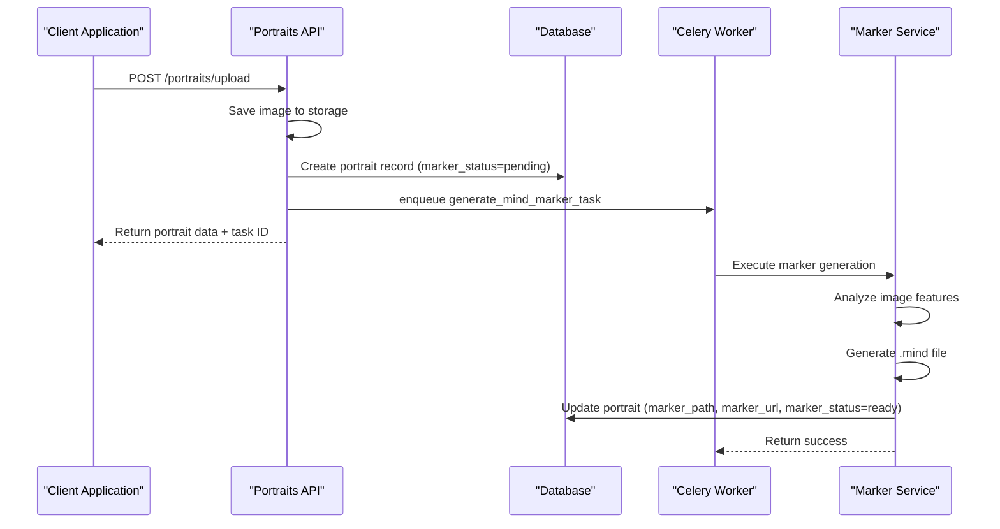
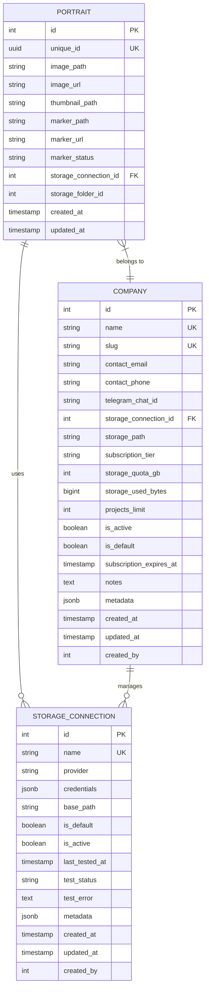

# Portrait Model

<cite>
**Referenced Files in This Document**   
- [portrait.py](file://app/models/portrait.py)
- [storage.py](file://app/models/storage.py)
- [ar_content.py](file://app/models/ar_content.py)
- [portraits.py](file://app/api/routes/portraits.py)
- [marker_tasks.py](file://app/tasks/marker_tasks.py)
- [marker_service.py](file://app/services/marker_service.py)
- [config.py](file://app/core/config.py)
- [database.py](file://app/core/database.py)
- [company.py](file://app/models/company.py)
</cite>

## Table of Contents
1. [Introduction](#introduction)
2. [Data Model Structure](#data-model-structure)
3. [Core Fields and Attributes](#core-fields-and-attributes)
4. [Relationships and Foreign Keys](#relationships-and-foreign-keys)
5. [Business Rules and Lifecycle Management](#business-rules-and-lifecycle-management)
6. [Constraints and Indexes](#constraints-and-indexes)
7. [Query Patterns and API Integration](#query-patterns-and-api-integration)
8. [AR-Specific Image Requirements](#ar-specific-image-requirements)
9. [Performance and Optimization](#performance-and-optimization)
10. [Background Processing Integration](#background-processing-integration)
11. [Schema Diagram](#schema-diagram)
12. [Sample Record](#sample-record)

## Introduction
The Portrait model in the ARV platform serves as the foundational entity for storing and managing portrait images used in augmented reality (AR) experiences. This model is specifically designed to support AR marker generation, image storage management, and integration with AR content rendering. The portrait entity acts as a bridge between raw image assets and their processed AR representations, enabling the platform to deliver interactive AR experiences through image recognition technology.

The model is tightly integrated with storage backends, AR content management, and background processing systems to ensure efficient image handling and marker generation. It supports multiple storage providers including local disk, MinIO, and Yandex Disk, making it flexible for different deployment scenarios. The portrait lifecycle is managed through a combination of API endpoints and background tasks, ensuring that images are properly processed and optimized for AR use.

**Section sources**
- [portrait.py](file://app/models/portrait.py#L7-L28)
- [portraits.py](file://app/api/routes/portraits.py#L22-L68)

## Data Model Structure
The Portrait model is implemented as a SQLAlchemy ORM class that defines the structure and behavior of portrait entities in the database. Each portrait record contains essential information about an image file, its storage location, metadata, and processing status for AR marker generation. The model is designed to be lightweight yet comprehensive, capturing all necessary information for both immediate use and future processing.

The data model follows a normalized structure with clear separation of concerns between file paths, metadata, and processing status. It uses a combination of integer primary keys for database efficiency and UUIDs for external references, providing both performance benefits and security through non-sequential identifiers. The model includes timestamps for creation and updates, enabling audit trails and time-based queries.

The structure is optimized for the specific needs of AR applications, with dedicated fields for both original images and generated markers. This separation allows for independent management of source assets and their processed derivatives, supporting efficient caching and content delivery strategies.



**Diagram sources**
- [portrait.py](file://app/models/portrait.py#L7-L28)
- [storage.py](file://app/models/storage.py#L8-L35)
- [ar_content.py](file://app/models/ar_content.py#L7-L46)

**Section sources**
- [portrait.py](file://app/models/portrait.py#L7-L28)
- [storage.py](file://app/models/storage.py#L8-L81)
- [ar_content.py](file://app/models/ar_content.py#L7-L46)

## Core Fields and Attributes
The Portrait model contains several key fields that define its functionality and behavior within the ARV platform. The `image_url` field stores the public URL path for accessing the portrait image, which is served through Nginx with a `/storage` prefix that maps to the physical storage location. This URL is automatically generated when a portrait is uploaded, creating a consistent access pattern across different storage backends.

The `storage_connection_id` field is a crucial attribute that links each portrait to a specific storage configuration, allowing the system to understand where the physical files are located and how to access them. This field enables multi-tenant storage configurations where different companies or projects can use different storage providers or configurations. The field is nullable to support scenarios where storage configuration is not immediately available or when using default storage.

The `dimensions` attribute, while not explicitly defined as a separate field, is implicitly managed through the image processing pipeline. When images are uploaded, their dimensions are extracted and stored in the metadata field as part of the image processing workflow. This information is critical for AR applications that need to understand the aspect ratio and resolution of the source image for proper marker generation and rendering.

Additional metadata is stored in the JSON field, which captures information about the image processing status, optimization parameters, and any other relevant data that may be needed for AR rendering or analytics. This flexible structure allows for the addition of new metadata attributes without requiring database schema changes.

**Section sources**
- [portrait.py](file://app/models/portrait.py#L14-L27)
- [portraits.py](file://app/api/routes/portraits.py#L46-L52)
- [marker_service.py](file://app/services/marker_service.py#L91-L96)

## Relationships and Foreign Keys
The Portrait model establishes critical relationships with other entities in the ARV platform, primarily through foreign key associations. The most important relationship is with the StorageConnection model, referenced by the `storage_connection_id` field. This relationship enables the system to determine the storage backend configuration for each portrait, including provider type, credentials, and base path. The relationship is implemented as a simple integer foreign key without explicit SQLAlchemy relationship definitions, providing flexibility in how storage connections are managed and queried.

While the current implementation shows a direct foreign key to StorageConnection, the model is designed to work in conjunction with the Company model, which also references StorageConnection. This creates an indirect relationship where portraits are associated with companies through their shared storage configuration. This design allows for efficient storage management at the company level while maintaining direct access to storage settings at the portrait level when needed.

The model also has a conceptual relationship with ARContent, as portraits serve as the source images for AR experiences. While there is no direct foreign key between Portrait and ARContent, the systems are tightly integrated through business logic and API workflows. When an ARContent item is created, it references a portrait's image and generates a corresponding marker, creating a functional dependency between the two entities.

Referential integrity is maintained through application-level constraints rather than database-level cascades. When a storage connection is deleted, associated portraits are not automatically removed but are instead flagged as having an invalid storage configuration. This approach preserves data integrity while allowing for recovery and reconfiguration scenarios.

**Section sources**
- [portrait.py](file://app/models/portrait.py#L24-L25)
- [storage.py](file://app/models/storage.py#L47-L48)
- [company.py](file://app/models/company.py#L20-L21)

## Business Rules and Lifecycle Management
The Portrait model follows a well-defined lifecycle that begins with image upload and progresses through processing stages to final AR readiness. When a new portrait is uploaded through the API, it enters the system with a `marker_status` of "pending", indicating that no AR marker has been generated yet. This status triggers background processing to create the necessary AR artifacts.

Aspect ratio validation is enforced during the upload process to ensure that images meet the requirements for effective AR marker generation. While the exact validation rules are not explicitly defined in the model, the system expects images to have standard aspect ratios that work well with AR recognition algorithms. Images that are too narrow or too wide may produce unreliable markers and are therefore discouraged.

The association with AR overlays is managed through a combination of the portrait image and the generated marker file. The marker file (with .mind extension) contains the feature points and patterns that the AR system uses to recognize the image in the real world. This two-part system allows for independent updates to the visual representation (the image) and the recognition data (the marker), providing flexibility in how AR experiences are maintained and updated.

Portrait lifecycle management includes automatic cleanup of unused or failed processing attempts. If a marker generation task fails repeatedly, the portrait is marked with a "failed" status, and the system may automatically retry the process after a cooling-off period. This ensures that transient issues do not permanently prevent AR content creation while preventing infinite retry loops.

**Section sources**
- [portraits.py](file://app/api/routes/portraits.py#L46-L52)
- [marker_tasks.py](file://app/tasks/marker_tasks.py#L40-L89)
- [marker_service.py](file://app/services/marker_service.py#L16-L97)

## Constraints and Indexes
The Portrait model implements several constraints and indexes to ensure data integrity and optimize query performance. The `id` field serves as the primary key with a database index for efficient lookups, while the `unique_id` field has both a unique constraint and an index to ensure global uniqueness and fast retrieval by UUID. This dual indexing strategy supports both internal database operations and external API access patterns.

The `image_path` field has a NOT NULL constraint, ensuring that every portrait record has a defined storage location for the source image. This constraint is critical for maintaining data integrity, as the image path is required for both direct access and processing operations. The field is also limited to 500 characters, which is sufficient for most storage path scenarios while preventing excessively long paths that could cause system issues.

The `marker_status` field is indexed to support efficient querying of portraits by their processing state. This allows the system to quickly identify portraits that need marker generation (status "pending"), are currently being processed (status "processing"), or have encountered issues (status "failed"). This indexing is essential for the background task system, which needs to efficiently find work items based on their status.

Additional constraints are enforced at the application level rather than the database level, providing flexibility in how business rules are implemented and modified. For example, the requirement for valid image dimensions or aspect ratios is checked during the upload process rather than through database constraints, allowing for more sophisticated validation logic and error handling.

**Section sources**
- [portrait.py](file://app/models/portrait.py#L10-L27)
- [storage.py](file://app/models/storage.py#L11-L13)
- [ar_content.py](file://app/models/ar_content.py#L10-L11)

## Query Patterns and API Integration
The Portrait model supports several key query patterns through its API endpoints, enabling efficient retrieval and management of portrait data. The primary access pattern is retrieving portraits by their unique identifier, implemented through the `/portraits/by-unique/{unique_id}` endpoint. This pattern is optimized for external systems that need to reference portraits without knowing their internal database IDs, providing a stable and secure access method.

Another common query pattern is retrieving portraits by their database ID, used internally by the system for management operations. The `/portraits/{portrait_id}` endpoint returns essential information about a portrait, including its image URL and marker status, enabling client applications to determine the readiness of AR content. This pattern is used extensively in the AR content management workflow.

The model also supports batch operations and list queries, though these are not explicitly shown in the current API implementation. The indexing strategy suggests that queries filtering by `storage_connection_id` or `created_at` would be efficient, enabling use cases such as retrieving all portraits for a specific storage backend or finding recently uploaded images.

Integration with frontend rendering components is achieved through the consistent URL structure and status information. The frontend can determine whether a portrait is ready for AR use by checking the `marker_status` field, and can directly use the `image_url` for display purposes. This separation of concerns allows the frontend to provide appropriate user feedback based on the processing state of each portrait.

**Section sources**
- [portraits.py](file://app/api/routes/portraits.py#L71-L103)
- [marker_tasks.py](file://app/tasks/marker_tasks.py#L60-L61)
- [config.py](file://app/core/config.py#L59-L60)

## AR-Specific Image Requirements
The Portrait model is specifically designed to support the unique requirements of AR applications, particularly in relation to image-based marker generation. The system expects images to be of sufficient quality and resolution to allow for reliable feature detection and tracking. While specific resolution requirements are not enforced at the model level, the background processing system is configured to work best with images that are at least 512x512 pixels.

The model supports various image formats commonly used in web and mobile applications, with the actual format validation occurring during the upload process rather than at the database level. The system is optimized for JPEG and PNG formats, which provide the best balance of quality and file size for AR applications. Images are automatically processed to ensure they meet the technical requirements for marker generation, including color space normalization and noise reduction.

AR-specific requirements also include considerations for image content and composition. The system works best with images that have high-contrast features, distinct patterns, and minimal repetitive elements. While these characteristics cannot be enforced through database constraints, the marker generation service evaluates image quality and may produce warnings or recommendations for improvement.

The integration with the Mind AR marker generation system requires that images be accessible to the processing service, either through local file paths or via authenticated access to remote storage. The model's design with both `image_path` and `image_url` fields supports this requirement, providing the processing system with direct file access while exposing a public URL for client applications.

**Section sources**
- [marker_service.py](file://app/services/marker_service.py#L45-L54)
- [marker_tasks.py](file://app/tasks/marker_tasks.py#L138-L145)
- [config.py](file://app/core/config.py#L28-L29)

## Performance and Optimization
The Portrait model incorporates several performance considerations to ensure efficient image retrieval and system responsiveness. Image retrieval is optimized through the use of CDN integration and caching strategies, with the Nginx server acting as a reverse proxy and cache for frequently accessed images. The `/storage` URL prefix is configured to serve static files directly, bypassing the application server for improved performance.

Caching strategies are implemented at multiple levels, including database query caching, application-level object caching, and HTTP-level caching through ETags and cache headers. The combination of UUID-based access and immutable image files enables aggressive caching, as the content associated with a specific UUID will not change over time. This allows CDNs and browser caches to store images for extended periods without risk of stale content.

Database performance is optimized through strategic indexing on fields that are commonly used in queries, such as `unique_id`, `marker_status`, and `storage_connection_id`. These indexes ensure that lookups and filtering operations are performed efficiently, even as the number of portraits grows. The use of integer primary keys also contributes to database performance, as they are more efficient to index and join than UUIDs.

The model supports efficient bulk operations through its simple structure and minimal constraints, allowing for high-throughput processing of large numbers of portraits. This is particularly important for background tasks that may need to process hundreds or thousands of images in batch operations.

**Section sources**
- [portraits.py](file://app/api/routes/portraits.py#L15-L19)
- [config.py](file://app/core/config.py#L62-L71)
- [database.py](file://app/core/database.py#L8-L15)

## Background Processing Integration
The Portrait model is tightly integrated with the background task system for image optimization and format conversion. When a new portrait is uploaded, the system automatically enqueues a marker generation task through Celery, using the `generate_mind_marker_task` function. This asynchronous processing model ensures that the API response is not delayed by potentially time-consuming image analysis operations.

The background task system implements retry logic with exponential backoff, allowing for recovery from transient failures in the marker generation process. If a task fails due to resource constraints or temporary issues, it will be automatically retried after a delay that increases with each attempt. This prevents overwhelming the system during periods of high load or temporary outages.

Image optimization occurs as part of the marker generation process, where the original image is analyzed and potentially converted to more efficient formats or resolutions. The Mind AR compiler may create optimized versions of the image for different use cases, such as thumbnails or low-resolution previews for mobile devices. These optimized versions are stored alongside the original image, with their paths recorded in the portrait's metadata.

The integration with Celery and Redis provides visibility into task status and progress, allowing the system to update the portrait's `marker_status` field as processing progresses. This enables client applications to poll for status updates and provide feedback to users about the progress of image processing.



**Diagram sources**
- [portraits.py](file://app/api/routes/portraits.py#L22-L68)
- [marker_tasks.py](file://app/tasks/marker_tasks.py#L40-L89)
- [marker_service.py](file://app/services/marker_service.py#L16-L97)

**Section sources**
- [marker_tasks.py](file://app/tasks/marker_tasks.py#L40-L89)
- [marker_service.py](file://app/services/marker_service.py#L16-L97)
- [portraits.py](file://app/api/routes/portraits.py#L60-L61)

## Schema Diagram
The following entity relationship diagram illustrates the Portrait model and its connections to related entities in the ARV platform. The diagram shows the core attributes of the Portrait entity, including its primary and unique identifiers, file path information, marker details, storage relationships, and timestamps.



**Diagram sources**
- [portrait.py](file://app/models/portrait.py#L7-L28)
- [storage.py](file://app/models/storage.py#L8-L35)
- [company.py](file://app/models/company.py#L7-L41)

**Section sources**
- [portrait.py](file://app/models/portrait.py#L7-L28)
- [storage.py](file://app/models/storage.py#L8-L81)
- [company.py](file://app/models/company.py#L7-L41)

## Sample Record
The following example illustrates a typical portrait record in the ARV platform, showing the structure and data types used in the system:

```json
{
  "id": 12345,
  "unique_id": "a1b2c3d4-e5f6-7890-g1h2-i3j4k5l6m7n8",
  "image_path": "/app/storage/content/portraits/a1b2c3d4-e5f6-7890-g1h2-i3j4k5l6m7n8/original.jpg",
  "image_url": "/storage/portraits/a1b2c3d4-e5f6-7890-g1h2-i3j4k5l6m7n8/original.jpg",
  "thumbnail_path": "/app/storage/content/portraits/a1b2c3d4-e5f6-7890-g1h2-i3j4k5l6m7n8/thumb.jpg",
  "marker_path": "ar-markers/12345/targets.mind",
  "marker_url": "http://minio:9000/ar-markers/12345/targets.mind",
  "marker_status": "ready",
  "storage_connection_id": 1,
  "storage_folder_id": 456,
  "created_at": "2024-01-15T10:30:00Z",
  "updated_at": "2024-01-15T10:35:22Z",
  "metadata": {
    "image_width": 1920,
    "image_height": 1080,
    "file_size_bytes": 845233,
    "format": "jpeg",
    "exif_orientation": 1,
    "processing_duration_ms": 4231
  }
}
```

This sample record demonstrates how the Portrait model captures both the essential information for accessing the image and metadata about its processing. The record shows a portrait that has successfully completed marker generation, with both the original image and marker file available through their respective URLs. The metadata field contains additional information about the image characteristics and processing history, which can be used for analytics, debugging, or quality control purposes.

**Section sources**
- [portrait.py](file://app/models/portrait.py#L10-L27)
- [marker_service.py](file://app/services/marker_service.py#L91-L96)
- [portraits.py](file://app/api/routes/portraits.py#L63-L68)