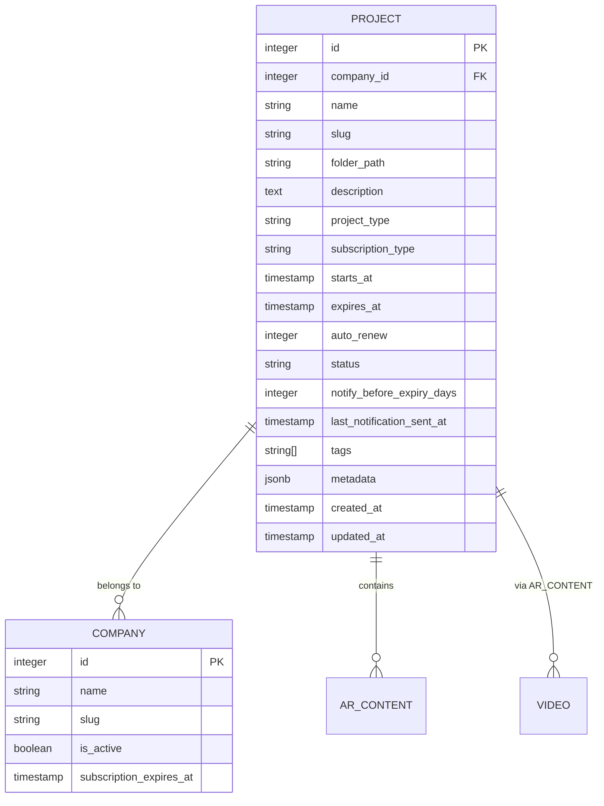
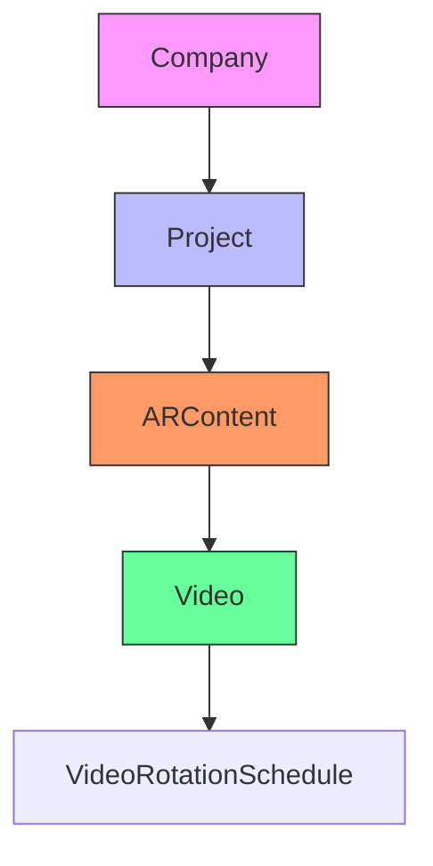
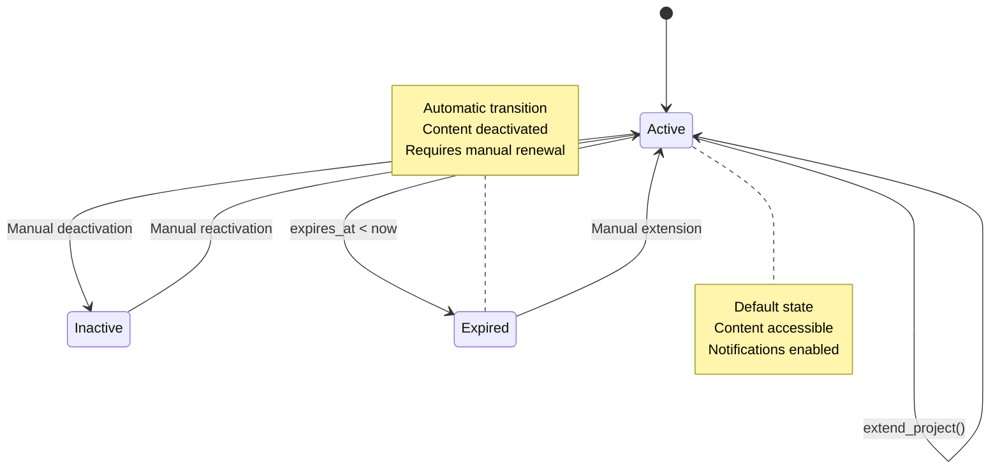
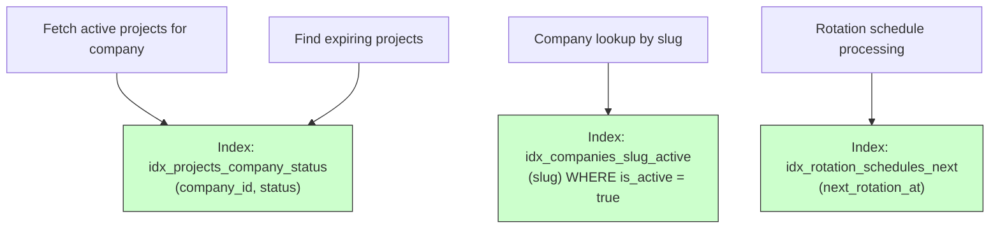
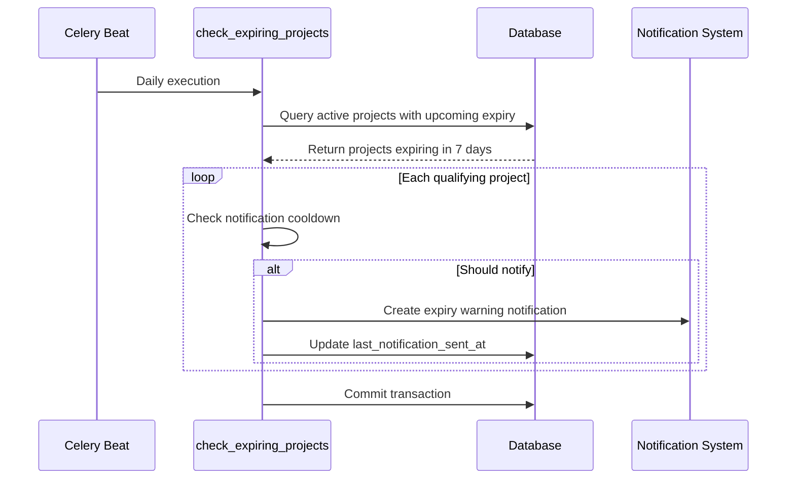
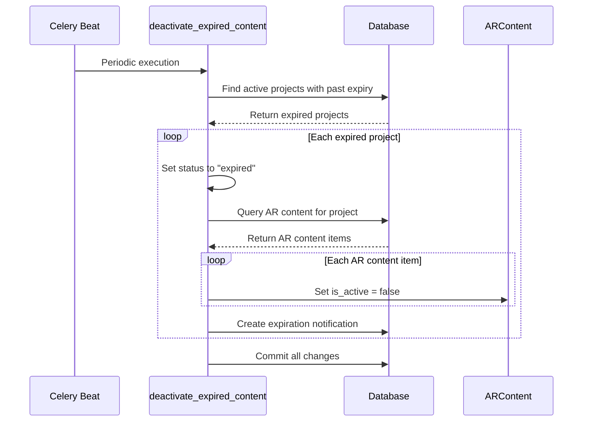

# Project Model

<cite>
**Referenced Files in This Document**   
- [project.py](file://app/models/project.py)
- [company.py](file://app/models/company.py)
- [expiry_tasks.py](file://app/tasks/expiry_tasks.py)
- [projects.py](file://app/api/routes/projects.py)
- [ar_content.py](file://app/models/ar_content.py)
- [alembic/versions/20251205_perf_idx.py](file://alembic/versions/20251205_perf_idx.py)
</cite>

## Table of Contents
1. [Introduction](#introduction)
2. [Project Model Schema](#project-model-schema)
3. [Field Definitions](#field-definitions)
4. [Relationships and Foreign Keys](#relationships-and-foreign-keys)
5. [Business Rules and Lifecycle Management](#business-rules-and-lifecycle-management)
6. [Indexing and Query Optimization](#indexing-and-query-optimization)
7. [Common Query Patterns](#common-query-patterns)
8. [Integration with Background Tasks](#integration-with-background-tasks)
9. [Data Lifecycle and Retention](#data-lifecycle-and-retention)
10. [API Integration and Relationship Loading](#api-integration-and-relationship-loading)
11. [Sample Record](#sample-record)

## Introduction
The Project model in the ARV platform serves as a core organizational unit that groups AR content, videos, and related assets under a specific company. It manages subscription periods, access control, and content lifecycle through expiration policies. This document provides comprehensive documentation of the Project model, including its structure, relationships, business rules, and integration points within the system.

## Project Model Schema



**Diagram sources**
- [project.py](file://app/models/project.py#L7-L34)
- [company.py](file://app/models/company.py#L7-L40)
- [ar_content.py](file://app/models/ar_content.py#L7-L46)

**Section sources**
- [project.py](file://app/models/project.py#L7-L34)

## Field Definitions

| Field | Type | Required | Default | Description |
|-------|------|----------|---------|-------------|
| id | Integer | Yes | None | Primary key identifier |
| company_id | Integer | Yes | None | Foreign key to companies.id |
| name | String(255) | Yes | None | Human-readable project name |
| slug | String(255) | Yes | None | URL-friendly identifier |
| folder_path | String(500) | No | None | Storage path for project assets |
| description | Text | No | None | Project description |
| project_type | String(100) | No | None | Type classification (e.g., marketing, education) |
| subscription_type | String(50) | No | "monthly" | Billing cycle type |
| starts_at | DateTime | No | None | Subscription start date |
| expires_at | DateTime | No | None | Subscription expiration date |
| auto_renew | Integer | No | 0 | Auto-renewal flag (0=false, 1=true) |
| status | String(50) | No | "active" | Current status (active/inactive/expired) |
| notify_before_expiry_days | Integer | No | 7 | Days before expiry to send notifications |
| last_notification_sent_at | DateTime | No | None | Timestamp of last expiry warning |
| tags | ARRAY(String) | No | None | Tag array for categorization |
| metadata | JSONB | No | {} | Flexible key-value storage |
| created_at | DateTime | No | UTC now | Creation timestamp |
| updated_at | DateTime | No | UTC now | Last update timestamp |

**Section sources**
- [project.py](file://app/models/project.py#L10-L34)

## Relationships and Foreign Keys

The Project model establishes critical relationships with other entities in the system:

- **Company Relationship**: Each project belongs to a company via the `company_id` foreign key. This creates a one-to-many relationship where a company can have multiple projects.
- **Cascade Behavior**: When a company is deleted, all associated projects are automatically removed. This cascade deletion ensures data consistency across the platform.
- **AR Content Relationship**: Projects contain multiple AR content items through the `project_id` field in the ARContent model.
- **Video Relationship**: Videos are indirectly related through AR content, forming a hierarchical structure: Company → Project → ARContent → Video.



**Diagram sources**
- [project.py](file://app/models/project.py#L11)
- [company.py](file://app/models/company.py#L10)
- [ar_content.py](file://app/models/ar_content.py#L11)
- [video.py](file://app/models/video.py#L9)

**Section sources**
- [project.py](file://app/models/project.py#L11)
- [company.py](file://app/models/company.py#L10)

## Business Rules and Lifecycle Management

The Project model implements several business rules governing its lifecycle:

### Status Transitions
- **Active**: Default status for new projects; content is accessible
- **Inactive**: Manually deactivated; content inaccessible
- **Expired**: Automatically set when `expires_at` < current date

### Expiration Handling
- Projects are automatically deactivated when they expire
- AR content within expired projects is deactivated
- Status changes from "active" to "expired" occur via background tasks

### Renewal Logic
- Projects can be extended via the `/projects/{project_id}/extend` endpoint
- The `auto_renew` flag indicates whether subscription should automatically renew
- Manual extension uses the current expiration date or current date as base

### Notification System
- Expiry warnings are sent `notify_before_expiry_days` before expiration
- A cooldown period prevents duplicate notifications
- Last notification timestamp stored in `last_notification_sent_at`



**Diagram sources**
- [expiry_tasks.py](file://app/tasks/expiry_tasks.py#L94-L122)
- [projects.py](file://app/api/routes/projects.py#L95-L105)

**Section sources**
- [expiry_tasks.py](file://app/tasks/expiry_tasks.py#L55-L122)
- [projects.py](file://app/api/routes/projects.py#L95-L105)

## Indexing and Query Optimization

The database schema includes strategic indexes to optimize common query patterns:



**Key Indexes:**
- `idx_projects_company_status`: Composite index on `company_id` and `status` for efficient filtering of active projects by company
- No dedicated index on `expires_at`, but the composite index supports range queries when combined with status filtering

**Section sources**
- [20251205_perf_idx.py](file://alembic/versions/20251205_perf_idx.py#L42-L47)

## Common Query Patterns

### Fetch All Active Projects for a Company
```sql
SELECT * FROM projects 
WHERE company_id = :company_id 
  AND status = 'active'
ORDER BY created_at DESC;
```

### Identify Projects即将-Expiring for Notifications
```sql
SELECT * FROM projects 
WHERE expires_at IS NOT NULL
  AND expires_at BETWEEN NOW() AND NOW() + INTERVAL '7 days'
  AND status = 'active'
  AND (last_notification_sent_at IS NULL 
       OR last_notification_sent_at < NOW() - INTERVAL '7 days');
```

### Extend Project Expiration
```sql
UPDATE projects 
SET expires_at = COALESCE(expires_at, NOW()) + INTERVAL ':days days'
WHERE id = :project_id;
```

### Count Projects by Status
```sql
SELECT status, COUNT(*) as count 
FROM projects 
WHERE company_id = :company_id 
GROUP BY status;
```

**Section sources**
- [projects.py](file://app/api/routes/projects.py#L47-L70)
- [expiry_tasks.py](file://app/tasks/expiry_tasks.py#L59-L64)

## Integration with Background Tasks

The Project model integrates with Celery background tasks for automated processing:

### Expiry Monitoring Workflow


### Automatic Deactivation Process


**Diagram sources**
- [expiry_tasks.py](file://app/tasks/expiry_tasks.py#L55-L122)

**Section sources**
- [expiry_tasks.py](file://app/tasks/expiry_tasks.py#L55-L122)

## Data Lifecycle and Retention

### Retention Policies
- **Active Projects**: Full data retention
- **Expired Projects**: Metadata retained for 24 months before archival
- **Deleted Projects**: Soft deletion with 30-day recovery window

### Archival Considerations
- Projects marked as "archived" have `status = 'inactive'` and `metadata.archived = true`
- Archived projects are excluded from most queries using status filters
- Historical data preserved for analytics and billing purposes

### Deletion Process
1. API receives DELETE request for project
2. Project record removed from database
3. Cascade deletion removes all associated AR content and videos
4. Storage cleanup task scheduled to remove physical files

**Section sources**
- [projects.py](file://app/api/routes/projects.py#L85-L92)
- [expiry_tasks.py](file://app/tasks/expiry_tasks.py#L98-L104)

## API Integration and Relationship Loading

### Relationship Loading Strategies
- **Eager Loading**: Used in list endpoints to reduce N+1 queries
- **Lazy Loading**: Used in detail endpoints when related data not immediately needed
- **Selective Loading**: API endpoints expose only necessary relationships

### API Endpoints
| Endpoint | Method | Purpose |
|--------|--------|---------|
| `/projects` | POST | Create new project |
| `/companies/{id}/projects` | POST | Create project for specific company |
| `/projects/{id}` | PUT | Update project attributes |
| `/projects/{id}` | DELETE | Delete project |
| `/projects/{id}/extend` | POST | Extend project expiration |

### Response Structure
```json
{
  "id": 123,
  "name": "Marketing Campaign Q4",
  "slug": "marketing-q4",
  "status": "active",
  "period": {
    "starts_at": "2025-01-01T00:00:00Z",
    "expires_at": "2025-12-31T23:59:59Z",
    "days_left": 364
  },
  "project_type": "marketing",
  "folder_path": "/content/marketing/q4"
}
```

**Section sources**
- [projects.py](file://app/api/routes/projects.py#L14-L125)

## Sample Record

```json
{
  "id": 1001,
  "company_id": 201,
  "name": "Holiday Campaign 2025",
  "slug": "holiday-campaign-2025",
  "folder_path": "/content/company201/holiday2025",
  "description": "AR experience for holiday season promotion",
  "project_type": "marketing",
  "subscription_type": "annual",
  "starts_at": "2025-11-01T00:00:00Z",
  "expires_at": "2026-10-31T23:59:59Z",
  "auto_renew": 1,
  "status": "active",
  "notify_before_expiry_days": 14,
  "last_notification_sent_at": "2026-10-17T14:30:00Z",
  "tags": ["holiday", "promotion", "seasonal"],
  "metadata": {
    "campaign_manager": "john.doe@client.com",
    "budget": 25000,
    "target_audience": "consumers"
  },
  "created_at": "2025-10-15T09:30:00Z",
  "updated_at": "2025-10-15T09:30:00Z"
}
```

**Section sources**
- [project.py](file://app/models/project.py#L7-L34)