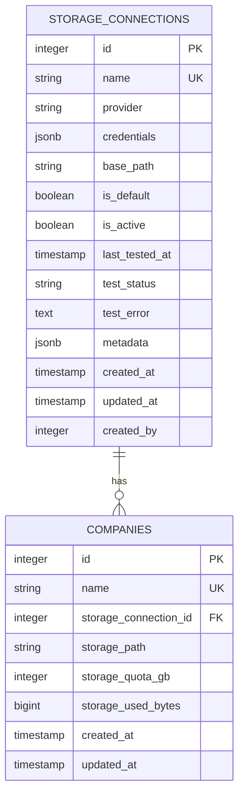
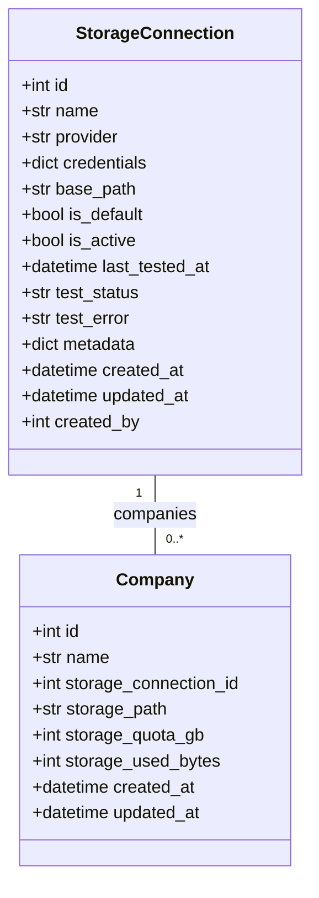
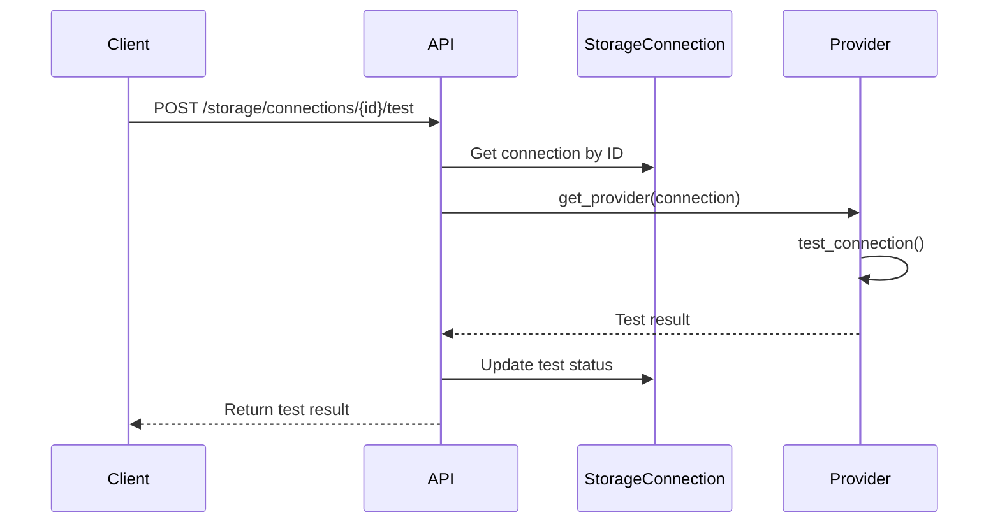
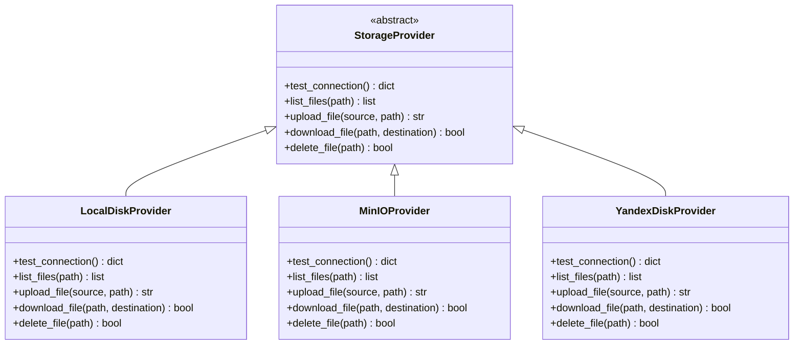
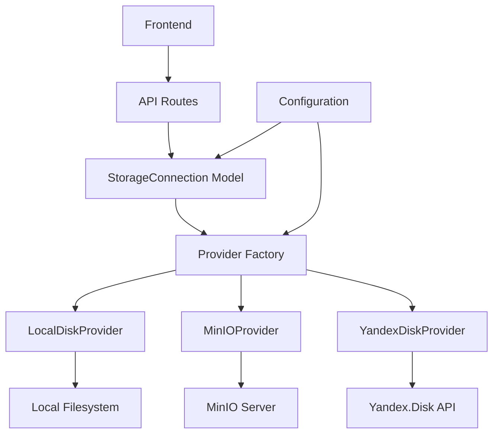
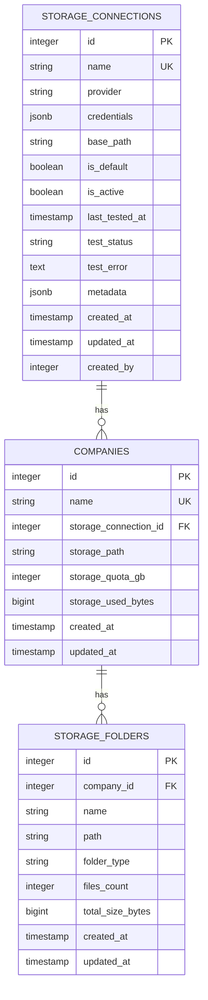

# Storage Model

<cite>
**Referenced Files in This Document**   
- [storage.py](file://app/models/storage.py)
- [company.py](file://app/models/company.py)
- [storage.py](file://app/schemas/storage.py)
- [storage.py](file://app/api/routes/storage.py)
- [factory.py](file://app/services/storage/factory.py)
- [config.py](file://app/core/config.py)
- [oauth.py](file://app/api/routes/oauth.py)
- [base.py](file://app/services/storage/providers/base.py)
- [local_disk_provider.py](file://app/services/storage/providers/local_disk_provider.py)
- [minio_provider.py](file://app/services/storage/providers/minio_provider.py)
- [yandex_disk_provider.py](file://app/services/storage/providers/yandex_disk_provider.py)
</cite>

## Table of Contents
1. [Introduction](#introduction)
2. [Data Model Structure](#data-model-structure)
3. [Storage Provider Types](#storage-provider-types)
4. [Configuration Parameters](#configuration-parameters)
5. [Validation and Constraints](#validation-and-constraints)
6. [Relationships and Referential Integrity](#relationships-and-referential-integrity)
7. [Connection Testing and Status Management](#connection-testing-and-status-management)
8. [Polymorphic Storage Handling](#polymorphic-storage-handling)
9. [Security Considerations](#security-considerations)
10. [Integration with Storage Abstraction Layer](#integration-with-storage-abstraction-layer)
11. [Query Examples](#query-examples)
12. [Schema Diagram](#schema-diagram)

## Introduction
The StorageConnection model in the ARV platform provides a unified interface for managing multiple storage backends, enabling organizations to configure and utilize different storage solutions within a single application framework. This model supports local disk, MinIO, and Yandex Disk storage providers through a polymorphic design that abstracts provider-specific details while maintaining a consistent API for storage operations. The model is designed to support multi-tenancy, with each company associated with a specific storage connection and path, allowing for isolated storage environments.

**Section sources**
- [storage.py](file://app/models/storage.py#L8-L38)
- [company.py](file://app/models/company.py#L7-L41)

## Data Model Structure
The StorageConnection model defines the core structure for storage configurations in the ARV platform. Each storage connection represents a configured storage backend with provider-specific settings and metadata. The model includes fields for identification, provider type, configuration credentials, status monitoring, and relationship tracking.



**Diagram sources**
- [storage.py](file://app/models/storage.py#L8-L38)
- [company.py](file://app/models/company.py#L7-L41)

**Section sources**
- [storage.py](file://app/models/storage.py#L8-L38)
- [company.py](file://app/models/company.py#L7-L41)

## Storage Provider Types
The StorageConnection model supports three distinct storage provider types, each with specific configuration requirements and operational characteristics:

- **local_disk**: Utilizes the local filesystem for storage, requiring a base path configuration
- **minio**: Connects to a MinIO object storage server using S3-compatible API
- **yandex_disk**: Integrates with Yandex.Disk cloud storage via OAuth2 authentication

The provider type is stored in the `provider` field and determines which configuration parameters are required and how the storage backend is accessed through the polymorphic provider factory.

**Section sources**
- [storage.py](file://app/models/storage.py#L13)
- [storage.py](file://app/schemas/storage.py#L9)
- [factory.py](file://app/services/storage/factory.py#L9-L30)

## Configuration Parameters
Each storage provider type requires specific configuration parameters that are stored in the JSONB `credentials` field, with additional provider-specific fields as needed:

### Local Disk Configuration
- **base_path**: Filesystem path where content is stored (can be specified in credentials or as separate field)
- No authentication credentials required

### MinIO Configuration
- **endpoint**: MinIO server address and port (e.g., "minio:9000")
- **access_key**: API access key for authentication
- **secret_key**: API secret key for authentication
- **secure**: Boolean indicating whether to use HTTPS/TLS
- **region**: AWS region designation (defaults to "us-east-1")

### Yandex Disk Configuration
- **oauth_token**: OAuth2 access token for API authentication
- **refresh_token**: OAuth2 refresh token for token renewal
- **expires_at**: Timestamp when current token expires
- Additional metadata stored in the `metadata` field including user display name and disk space statistics

**Section sources**
- [storage.py](file://app/models/storage.py#L16-L19)
- [storage.py](file://app/schemas/storage.py#L12-L23)
- [oauth.py](file://app/api/routes/oauth.py#L82-L99)

## Validation and Constraints
The StorageConnection model enforces several validation rules and database constraints to ensure data integrity and proper configuration:

- **Unique name constraint**: Storage connection names must be unique across the platform
- **Provider validation**: Only supported provider types are allowed ("local_disk", "minio", "yandex_disk")
- **Base path requirement**: For local_disk provider, base_path must be specified either in credentials or as a separate field
- **Yandex token validation**: Yandex Disk connections require a valid oauth_token in credentials
- **Active status**: New connections are created with is_active=True by default
- **Required fields**: Name and provider fields are mandatory and cannot be null

The validation is implemented at both the schema level (Pydantic models) and database level (SQLAlchemy constraints).

**Section sources**
- [storage.py](file://app/models/storage.py#L12-L13)
- [storage.py](file://app/schemas/storage.py#L29-L41)
- [factory.py](file://app/services/storage/factory.py#L26-L27)

## Relationships and Referential Integrity
The StorageConnection model maintains critical relationships with other entities in the system, particularly the Company model:

- **One-to-Many Relationship**: A single StorageConnection can be associated with multiple companies
- **Company Storage Configuration**: Each company references a storage_connection_id and has a specific storage_path within that connection
- **Referential integrity**: The system validates that referenced storage connections exist before assigning them to companies
- **Default connection restriction**: Companies cannot be assigned to the default Vertex AR storage connection

These relationships enable multi-tenant storage isolation while allowing shared storage backends across multiple organizations.



**Diagram sources**
- [storage.py](file://app/models/storage.py#L8-L38)
- [company.py](file://app/models/company.py#L7-L41)

**Section sources**
- [storage.py](file://app/models/storage.py#L37)
- [company.py](file://app/models/company.py#L58)
- [companies.py](file://app/api/routes/companies.py#L22-L24)

## Connection Testing and Status Management
The StorageConnection model includes built-in functionality for testing and monitoring storage connection health:

- **Test endpoint**: API endpoint to test connectivity for a specific storage connection
- **Status tracking**: Fields to record the last test timestamp, status, and any error messages
- **Automated updates**: Connection status is automatically updated after each test
- **Provider-specific testing**: Each storage provider implements its own connection test logic

The test_connection endpoint retrieves the storage connection, instantiates the appropriate provider, executes the test, and updates the connection status in the database.



**Diagram sources**
- [storage.py](file://app/api/routes/storage.py#L35-L49)
- [storage.py](file://app/models/storage.py#L26-L28)
- [factory.py](file://app/services/storage/factory.py#L8-L30)

**Section sources**
- [storage.py](file://app/api/routes/storage.py#L35-L49)
- [storage.py](file://app/models/storage.py#L26-L28)

## Polymorphic Storage Handling
The ARV platform implements a polymorphic storage provider pattern that allows different storage backends to be handled through a unified interface:

- **Provider factory**: The get_provider function returns the appropriate provider instance based on the connection's provider type
- **Base provider interface**: All storage providers inherit from a common base class defining standard methods
- **Runtime instantiation**: Provider instances are created dynamically based on stored configuration
- **Unified operations**: Higher-level code interacts with storage through a consistent API regardless of backend

This design enables the platform to support multiple storage backends while keeping the integration points simple and consistent.



**Diagram sources**
- [base.py](file://app/services/storage/providers/base.py)
- [local_disk_provider.py](file://app/services/storage/providers/local_disk_provider.py)
- [minio_provider.py](file://app/services/storage/providers/minio_provider.py)
- [yandex_disk_provider.py](file://app/services/storage/providers/yandex_disk_provider.py)
- [factory.py](file://app/services/storage/factory.py#L8-L30)

**Section sources**
- [factory.py](file://app/services/storage/factory.py#L8-L30)
- [base.py](file://app/services/storage/providers/base.py)
- [local_disk_provider.py](file://app/services/storage/providers/local_disk_provider.py)
- [minio_provider.py](file://app/services/storage/providers/minio_provider.py)
- [yandex_disk_provider.py](file://app/services/storage/providers/yandex_disk_provider.py)

## Security Considerations
The StorageConnection model incorporates several security measures to protect sensitive configuration data:

- **Credential encryption**: While not explicitly shown in the model, credentials should be encrypted at rest
- **OAuth token management**: Yandex Disk connections store OAuth tokens that require secure handling
- **Access control**: Storage connections are managed through authenticated API endpoints
- **Sensitive field protection**: The credentials field contains authentication secrets that must be protected
- **Configuration hardening**: Default MinIO credentials in configuration should be changed in production

The system currently stores credentials in JSONB format without explicit encryption, suggesting a need for integration with a secrets management system or encryption layer.

**Section sources**
- [storage.py](file://app/models/storage.py#L16)
- [oauth.py](file://app/api/routes/oauth.py#L82-L87)
- [config.py](file://app/core/config.py#L64-L66)

## Integration with Storage Abstraction Layer
The StorageConnection model integrates with the platform's storage abstraction layer through several key components:

- **Provider factory**: Creates appropriate provider instances based on connection configuration
- **API routes**: Expose storage connection management functionality to the frontend
- **Configuration service**: Loads storage settings from environment variables for system-wide defaults
- **Company storage assignment**: Allows companies to be associated with specific storage connections

The integration enables dynamic switching between storage backends and provides a consistent interface for storage operations across the application.



**Diagram sources**
- [storage.py](file://app/api/routes/storage.py)
- [factory.py](file://app/services/storage/factory.py)
- [config.py](file://app/core/config.py)
- [storage.py](file://app/models/storage.py)

**Section sources**
- [storage.py](file://app/api/routes/storage.py)
- [factory.py](file://app/services/storage/factory.py)
- [config.py](file://app/core/config.py)

## Query Examples
Common database queries for working with the StorageConnection model:

### Retrieve Active Storage Connections
```sql
SELECT * FROM storage_connections 
WHERE is_active = true 
ORDER BY name;
```

### Find Storage Connection by Name
```sql
SELECT * FROM storage_connections 
WHERE name = 'production-minio';
```

### Get Company Storage Configuration
```sql
SELECT c.name, sc.name as storage_name, sc.provider, co.storage_path 
FROM companies co
JOIN storage_connections sc ON co.storage_connection_id = sc.id
JOIN companies c ON co.id = c.id
WHERE c.id = 123;
```

### List Test Results for All Connections
```sql
SELECT name, provider, test_status, last_tested_at 
FROM storage_connections 
ORDER BY last_tested_at DESC NULLS LAST;
```

### Find Unused Storage Connections
```sql
SELECT sc.* FROM storage_connections sc
LEFT JOIN companies co ON sc.id = co.storage_connection_id
WHERE co.storage_connection_id IS NULL 
AND sc.is_default = false;
```

**Section sources**
- [storage.py](file://app/models/storage.py)
- [storage.py](file://app/api/routes/storage.py)

## Schema Diagram
The following entity relationship diagram illustrates the complete storage model structure with all fields and relationships:



**Diagram sources**
- [storage.py](file://app/models/storage.py)
- [company.py](file://app/models/company.py)

**Section sources**
- [storage.py](file://app/models/storage.py)
- [company.py](file://app/models/company.py)