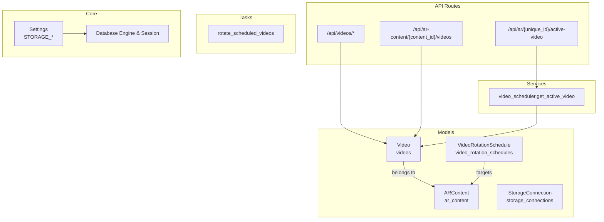
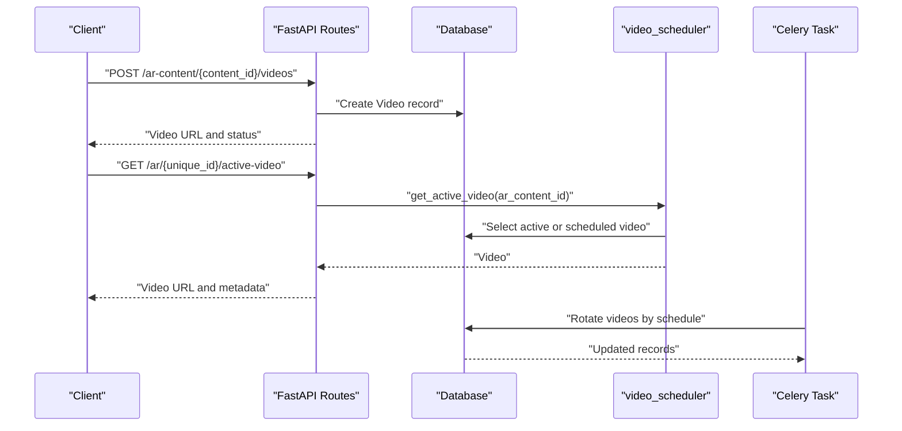
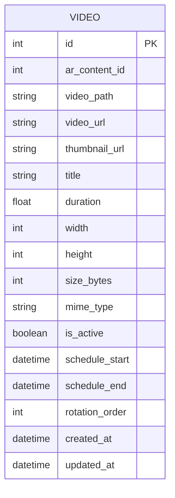
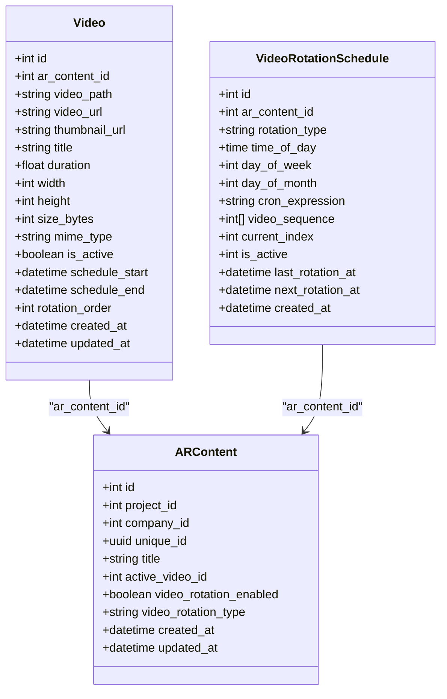
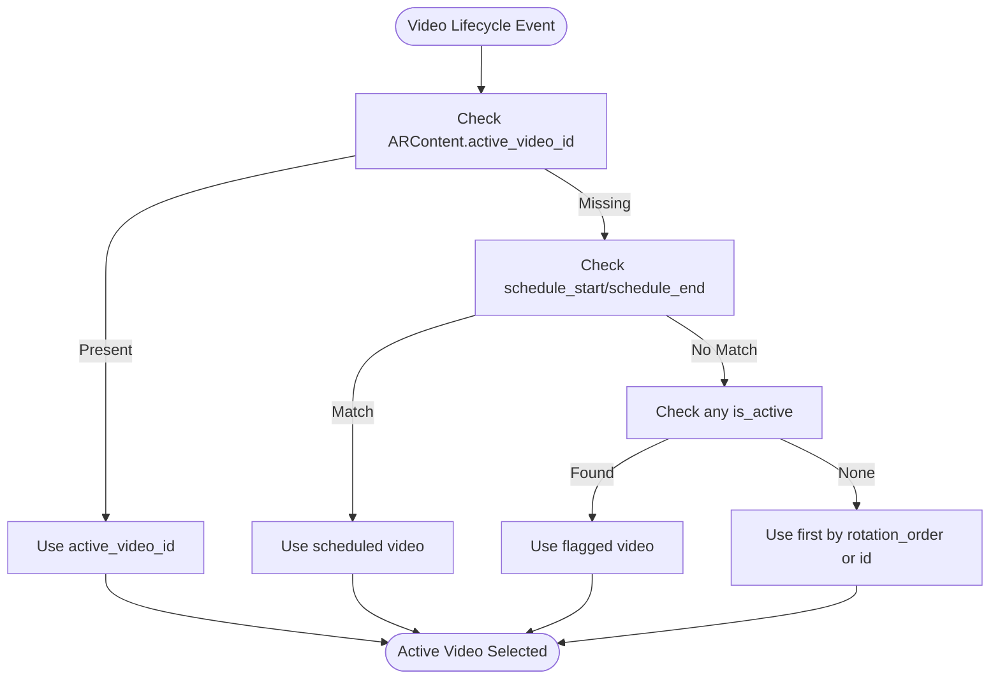
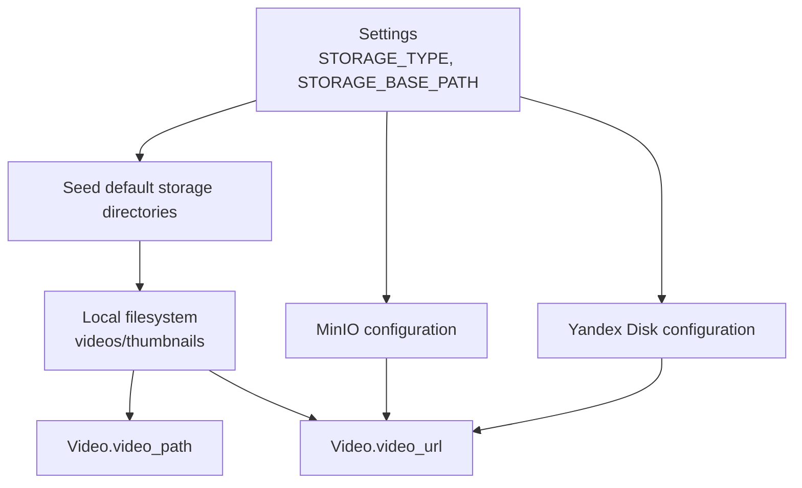
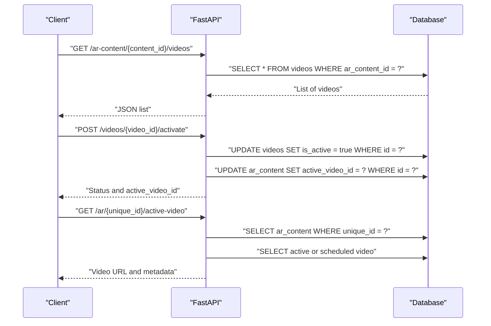
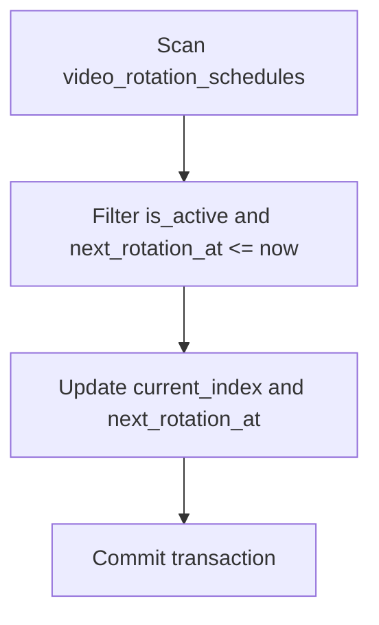
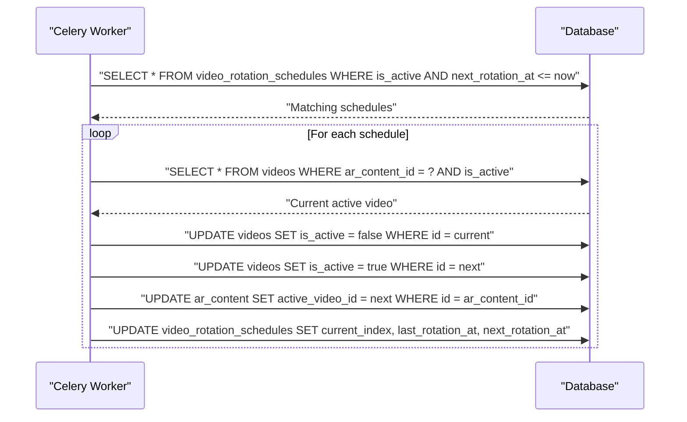
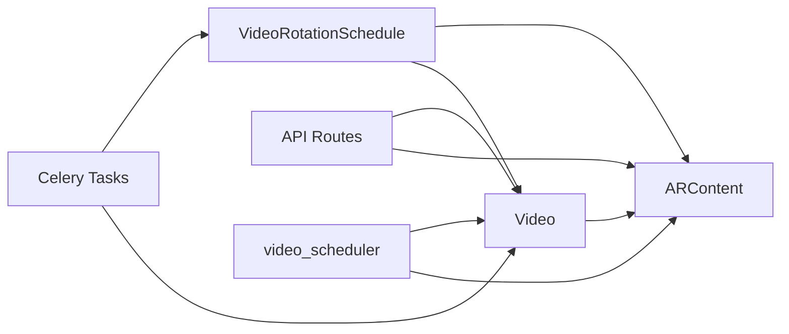

# Video Model

<cite>
**Referenced Files in This Document**
- [video.py](file://app/models/video.py)
- [ar_content.py](file://app/models/ar_content.py)
- [storage.py](file://app/models/storage.py)
- [video_rotation_schedule.py](file://app/models/video_rotation_schedule.py)
- [videos.py](file://app/api/routes/videos.py)
- [ar_content.py](file://app/api/routes/ar_content.py)
- [public.py](file://app/api/routes/public.py)
- [video_scheduler.py](file://app/services/video_scheduler.py)
- [expiry_tasks.py](file://app/tasks/expiry_tasks.py)
- [database.py](file://app/core/database.py)
- [config.py](file://app/core/config.py)
- [20251205_perf_idx.py](file://alembic/versions/20251205_perf_idx.py)
</cite>

## Table of Contents
1. [Introduction](#introduction)
2. [Project Structure](#project-structure)
3. [Core Components](#core-components)
4. [Architecture Overview](#architecture-overview)
5. [Detailed Component Analysis](#detailed-component-analysis)
6. [Dependency Analysis](#dependency-analysis)
7. [Performance Considerations](#performance-considerations)
8. [Troubleshooting Guide](#troubleshooting-guide)
9. [Conclusion](#conclusion)
10. [Appendices](#appendices)

## Introduction
This document provides comprehensive data model documentation for the Video model in the ARV platform. It explains the schema, relationships to ARContent and StorageConnection, lifecycle management, scheduling and rotation, storage abstraction, query patterns, and integration with background tasks. It also covers indexing strategies, performance considerations, and practical examples derived from the codebase.

## Project Structure
The Video model is part of the SQLAlchemy ORM layer and integrates with FastAPI routes, Celery tasks, and storage configuration. The following diagram shows how the Video model fits into the broader system.

**Diagram sources**
- [video.py](file://app/models/video.py#L1-L31)
- [ar_content.py](file://app/models/ar_content.py#L1-L46)
- [storage.py](file://app/models/storage.py#L1-L81)
- [video_rotation_schedule.py](file://app/models/video_rotation_schedule.py#L1-L26)
- [videos.py](file://app/api/routes/videos.py#L1-L64)
- [ar_content.py](file://app/api/routes/ar_content.py#L90-L133)
- [public.py](file://app/api/routes/public.py#L1-L52)
- [video_scheduler.py](file://app/services/video_scheduler.py#L1-L42)
- [expiry_tasks.py](file://app/tasks/expiry_tasks.py#L132-L183)
- [config.py](file://app/core/config.py#L58-L71)
- [database.py](file://app/core/database.py#L1-L46)

**Section sources**
- [video.py](file://app/models/video.py#L1-L31)
- [ar_content.py](file://app/models/ar_content.py#L1-L46)
- [storage.py](file://app/models/storage.py#L1-L81)
- [video_rotation_schedule.py](file://app/models/video_rotation_schedule.py#L1-L26)
- [videos.py](file://app/api/routes/videos.py#L1-L64)
- [ar_content.py](file://app/api/routes/ar_content.py#L90-L133)
- [public.py](file://app/api/routes/public.py#L1-L52)
- [video_scheduler.py](file://app/services/video_scheduler.py#L1-L42)
- [expiry_tasks.py](file://app/tasks/expiry_tasks.py#L132-L183)
- [config.py](file://app/core/config.py#L58-L71)
- [database.py](file://app/core/database.py#L1-L46)

## Core Components
- Video model: Stores metadata and references for video assets associated with AR experiences.
- ARContent model: Represents AR experiences and maintains the active video reference.
- StorageConnection model: Defines storage backends and credentials; used to configure storage providers.
- VideoRotationSchedule model: Manages scheduled rotation of videos for AR content.
- API routes: Provide CRUD and activation endpoints for videos and integrate with AR content.
- Services: Implement active video selection logic.
- Tasks: Rotate videos according to schedules and manage expiration-related deactivation.

Key responsibilities:
- Video stores logical references (paths and URLs) and metadata.
- ARContent links videos to AR experiences and tracks the active video.
- StorageConnection abstracts storage backends and credentials.
- Background tasks handle rotation and expiration checks.

**Section sources**
- [video.py](file://app/models/video.py#L1-L31)
- [ar_content.py](file://app/models/ar_content.py#L1-L46)
- [storage.py](file://app/models/storage.py#L1-L81)
- [video_rotation_schedule.py](file://app/models/video_rotation_schedule.py#L1-L26)
- [videos.py](file://app/api/routes/videos.py#L1-L64)
- [ar_content.py](file://app/api/routes/ar_content.py#L90-L133)
- [public.py](file://app/api/routes/public.py#L1-L52)
- [video_scheduler.py](file://app/services/video_scheduler.py#L1-L42)
- [expiry_tasks.py](file://app/tasks/expiry_tasks.py#L132-L183)

## Architecture Overview
The Video model participates in several workflows:
- Uploading a video creates a Video record and optionally activates it in ARContent.
- Retrieving the active video for an AR experience uses prioritized selection logic.
- Scheduled rotation updates active video and ARContent’s active_video_id.
- Expiration checks can deactivate AR content and videos.

**Diagram sources**
- [ar_content.py](file://app/api/routes/ar_content.py#L90-L133)
- [public.py](file://app/api/routes/public.py#L1-L52)
- [video_scheduler.py](file://app/services/video_scheduler.py#L1-L42)
- [expiry_tasks.py](file://app/tasks/expiry_tasks.py#L132-L183)

## Detailed Component Analysis

### Video Model Schema
The Video model defines the logical representation of a video asset. It includes:
- Identity: id
- Association: ar_content_id
- Logical references: video_path, video_url, thumbnail_url
- Metadata: title, duration, width, height, size_bytes, mime_type
- Lifecycle flags: is_active
- Scheduling: schedule_start, schedule_end
- Rotation ordering: rotation_order
- Timestamps: created_at, updated_at

**Diagram sources**
- [video.py](file://app/models/video.py#L1-L31)

**Section sources**
- [video.py](file://app/models/video.py#L1-L31)

### Relationships and Referential Integrity
- Video belongs to ARContent via ar_content_id. The ARContent model stores active_video_id, which references a Video id.
- There is no explicit foreign key constraint defined in the Video model for ar_content_id in the provided code. This implies either deferred constraint enforcement or absence of DDL-level FK in the current schema snapshot.
- VideoRotationSchedule targets ARContent via ar_content_id and manages rotation sequences of Video ids.

**Diagram sources**
- [video.py](file://app/models/video.py#L1-L31)
- [ar_content.py](file://app/models/ar_content.py#L1-L46)
- [video_rotation_schedule.py](file://app/models/video_rotation_schedule.py#L1-L26)

**Section sources**
- [video.py](file://app/models/video.py#L1-L31)
- [ar_content.py](file://app/models/ar_content.py#L1-L46)
- [video_rotation_schedule.py](file://app/models/video_rotation_schedule.py#L1-L26)

### Business Rules and Lifecycle Management
- Activation: Setting a Video as active updates ARContent.active_video_id and marks the Video as active.
- Scheduling: Videos can be active within a time window defined by schedule_start and schedule_end.
- Rotation: Scheduled rotation cycles through a sequence of Video ids for an ARContent, updating active_video_id and ARContent’s active_video_id.
- Expiration: Expiration checks can deactivate AR content and videos; rotation tasks also manage active state transitions.

**Diagram sources**
- [video_scheduler.py](file://app/services/video_scheduler.py#L1-L42)

**Section sources**
- [videos.py](file://app/api/routes/videos.py#L52-L64)
- [ar_content.py](file://app/api/routes/ar_content.py#L90-L133)
- [video_scheduler.py](file://app/services/video_scheduler.py#L1-L42)
- [expiry_tasks.py](file://app/tasks/expiry_tasks.py#L132-L183)

### Storage Abstraction and Backends
- Storage configuration is centralized in Settings with STORAGE_TYPE and STORAGE_BASE_PATH.
- Local disk storage is seeded with default base directories for videos and thumbnails.
- The Video model stores logical references (video_path and video_url) rather than raw binary data, enabling abstraction from physical storage location.
- Public route retrieves the active video URL for client-side playback.

**Diagram sources**
- [config.py](file://app/core/config.py#L58-L71)
- [database.py](file://app/core/database.py#L54-L99)
- [video.py](file://app/models/video.py#L1-L31)
- [public.py](file://app/api/routes/public.py#L1-L52)

**Section sources**
- [config.py](file://app/core/config.py#L58-L71)
- [database.py](file://app/core/database.py#L54-L99)
- [video.py](file://app/models/video.py#L1-L31)
- [public.py](file://app/api/routes/public.py#L1-L52)

### Query Patterns and API Usage
Common query patterns observed in the codebase:
- List videos by AR content id
- Activate a specific video and update ARContent.active_video_id
- Retrieve active video for a public AR experience

**Diagram sources**
- [videos.py](file://app/api/routes/videos.py#L13-L64)
- [public.py](file://app/api/routes/public.py#L1-L52)
- [ar_content.py](file://app/api/routes/ar_content.py#L90-L133)

**Section sources**
- [videos.py](file://app/api/routes/videos.py#L13-L64)
- [public.py](file://app/api/routes/public.py#L1-L52)
- [ar_content.py](file://app/api/routes/ar_content.py#L90-L133)

### Indexing Strategies
Observed indexes in the migration:
- Video rotation schedules next_rotation_at index for efficient rotation task scanning.

**Diagram sources**
- [20251205_perf_idx.py](file://alembic/versions/20251205_perf_idx.py#L17-L55)

**Section sources**
- [20251205_perf_idx.py](file://alembic/versions/20251205_perf_idx.py#L17-L55)

### Integration with Background Tasks
- Rotation task rotates videos based on schedule, updating active_video_id and ARContent’s active_video_id.
- Expiration tasks can deactivate AR content and videos.

**Diagram sources**
- [expiry_tasks.py](file://app/tasks/expiry_tasks.py#L132-L183)

**Section sources**
- [expiry_tasks.py](file://app/tasks/expiry_tasks.py#L132-L183)

## Dependency Analysis
- Video depends on ARContent for association and active selection.
- ARContent depends on Video for active_video_id.
- VideoRotationSchedule orchestrates rotation among Video instances for an ARContent.
- API routes depend on Video and ARContent for CRUD and activation.
- Services depend on Video and ARContent for active selection logic.
- Tasks depend on VideoRotationSchedule and Video for rotation.

**Diagram sources**
- [video.py](file://app/models/video.py#L1-L31)
- [ar_content.py](file://app/models/ar_content.py#L1-L46)
- [video_rotation_schedule.py](file://app/models/video_rotation_schedule.py#L1-L26)
- [videos.py](file://app/api/routes/videos.py#L1-L64)
- [ar_content.py](file://app/api/routes/ar_content.py#L90-L133)
- [public.py](file://app/api/routes/public.py#L1-L52)
- [video_scheduler.py](file://app/services/video_scheduler.py#L1-L42)
- [expiry_tasks.py](file://app/tasks/expiry_tasks.py#L132-L183)

**Section sources**
- [video.py](file://app/models/video.py#L1-L31)
- [ar_content.py](file://app/models/ar_content.py#L1-L46)
- [video_rotation_schedule.py](file://app/models/video_rotation_schedule.py#L1-L26)
- [videos.py](file://app/api/routes/videos.py#L1-L64)
- [ar_content.py](file://app/api/routes/ar_content.py#L90-L133)
- [public.py](file://app/api/routes/public.py#L1-L52)
- [video_scheduler.py](file://app/services/video_scheduler.py#L1-L42)
- [expiry_tasks.py](file://app/tasks/expiry_tasks.py#L132-L183)

## Performance Considerations
- Large object handling: Video stores logical references (paths and URLs) rather than large binary blobs in the database, reducing row size and improving query performance.
- Streaming access patterns: Clients consume video_url for playback; ensure storage backends support streaming and appropriate caching headers.
- Caching strategies: Cache active video metadata and URLs at CDN edge or application cache to reduce database load for frequent reads.
- Indexing: Add indexes on frequently filtered fields such as ar_content_id and created_at timestamps to optimize listing and scheduling queries.
- Concurrency: Use async database sessions and batch operations in tasks to minimize contention.

[No sources needed since this section provides general guidance]

## Troubleshooting Guide
- Missing active video: If ARContent.active_video_id is null and no scheduled video matches, the service falls back to any active video or the first available video. Verify rotation schedules and active flags.
- Orphaned videos: If videos remain after content deletion, implement cleanup jobs to remove unused videos based on absence in ARContent.active_video_id and lack of rotation schedule references.
- Expiration issues: Ensure expiration tasks are running and that ARContent and Video states are consistent post-deactivation.

**Section sources**
- [video_scheduler.py](file://app/services/video_scheduler.py#L1-L42)
- [expiry_tasks.py](file://app/tasks/expiry_tasks.py#L132-L183)

## Conclusion
The Video model in ARV encapsulates logical references and metadata for video assets, decoupled from physical storage. It integrates tightly with ARContent for active selection and with VideoRotationSchedule for automated rotation. The system leverages asynchronous APIs, background tasks, and storage abstraction to support scalable AR experiences. Proper indexing and caching strategies are essential for performance, and lifecycle management ensures videos are activated, rotated, and deactivated according to business rules.

## Appendices

### Sample Record Structure
- id: integer
- ar_content_id: integer
- video_path: string
- video_url: string
- thumbnail_url: string
- title: string
- duration: float
- width: integer
- height: integer
- size_bytes: integer
- mime_type: string
- is_active: boolean
- schedule_start: datetime
- schedule_end: datetime
- rotation_order: integer
- created_at: datetime
- updated_at: datetime

**Section sources**
- [video.py](file://app/models/video.py#L1-L31)