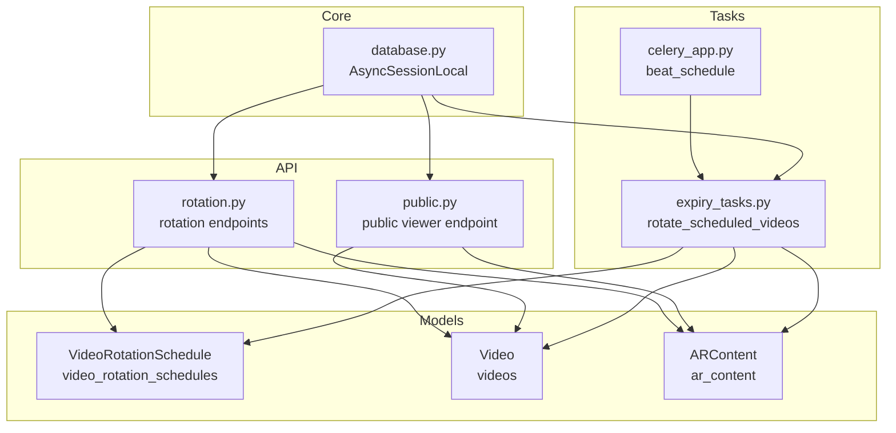
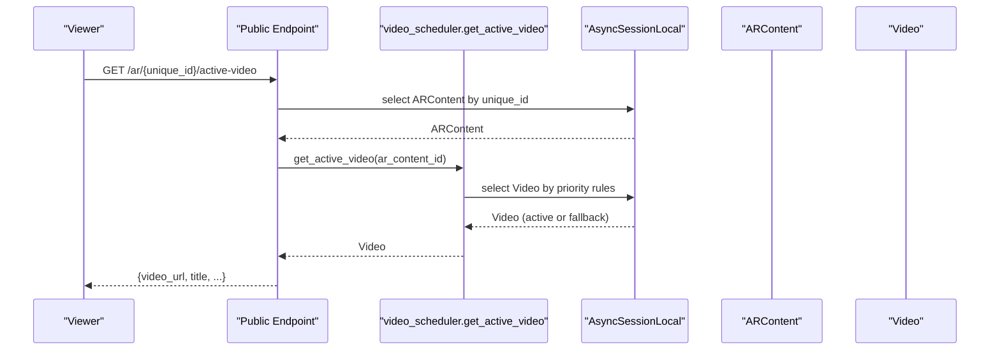
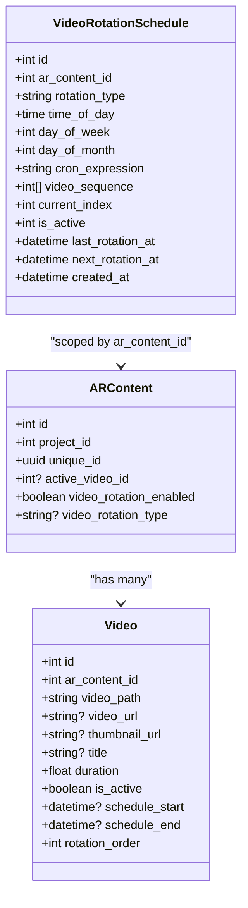
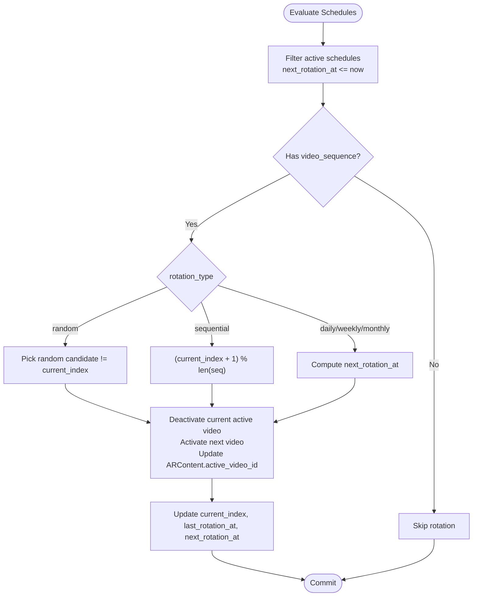
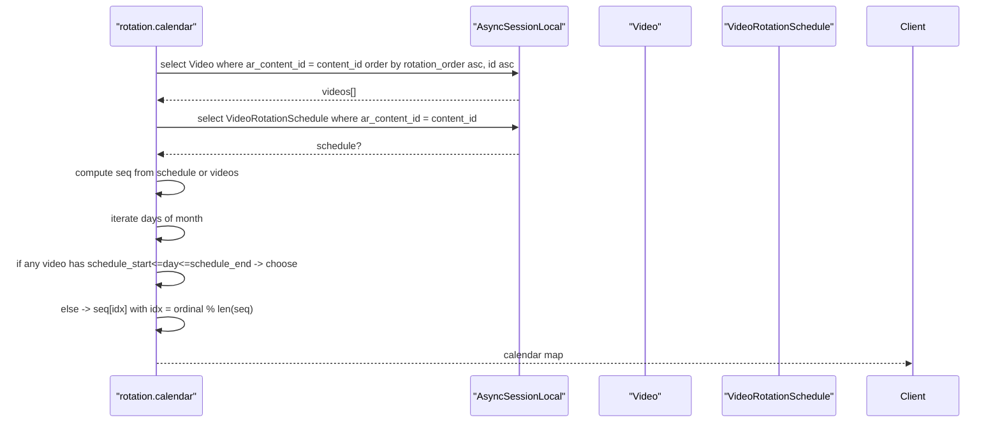
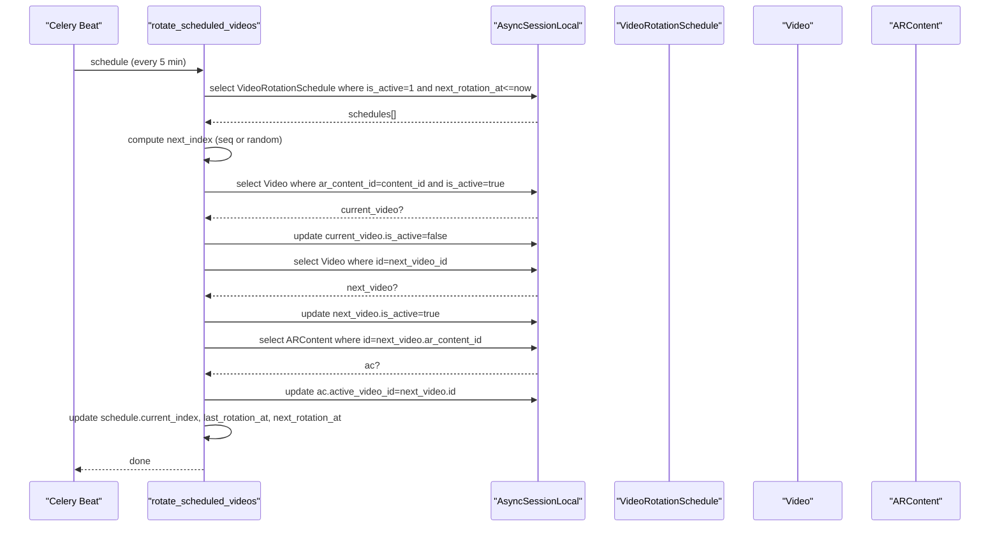
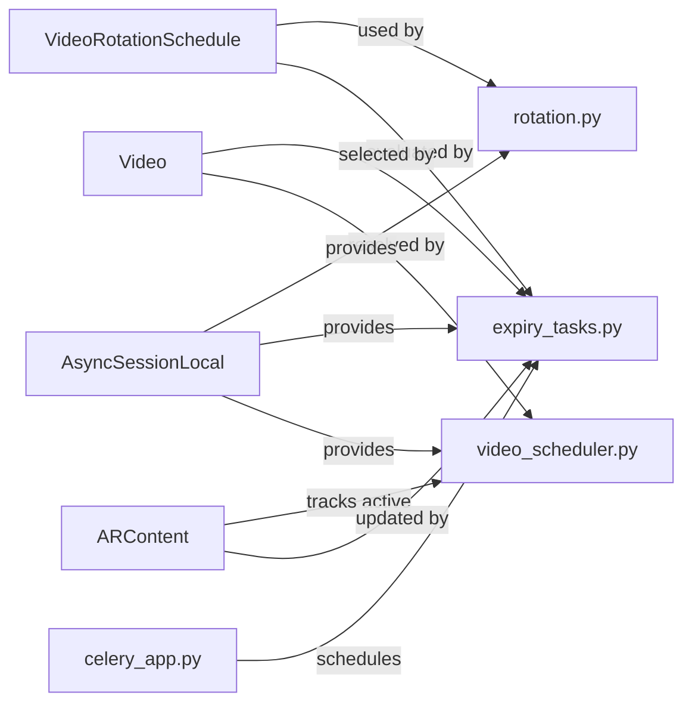

# Video Rotation Schedule Model

<cite>
**Referenced Files in This Document**
- [video_rotation_schedule.py](file://app/models/video_rotation_schedule.py)
- [video.py](file://app/models/video.py)
- [ar_content.py](file://app/models/ar_content.py)
- [rotation.py](file://app/api/routes/rotation.py)
- [expiry_tasks.py](file://app/tasks/expiry_tasks.py)
- [celery_app.py](file://app/tasks/celery_app.py)
- [video_scheduler.py](file://app/services/video_scheduler.py)
- [public.py](file://app/api/routes/public.py)
- [database.py](file://app/core/database.py)
</cite>

## Table of Contents
1. [Introduction](#introduction)
2. [Project Structure](#project-structure)
3. [Core Components](#core-components)
4. [Architecture Overview](#architecture-overview)
5. [Detailed Component Analysis](#detailed-component-analysis)
6. [Dependency Analysis](#dependency-analysis)
7. [Performance Considerations](#performance-considerations)
8. [Troubleshooting Guide](#troubleshooting-guide)
9. [Conclusion](#conclusion)
10. [Appendices](#appendices)

## Introduction
This document provides comprehensive data model documentation for the VideoRotationSchedule model in the ARV platform. It explains the schema, relationships to Projects and ARContent, business rules for time-based rotation, fallback behaviors, and constraints. It also covers how rotation is enforced by Celery periodic tasks, how the model enables dynamic content rotation without manual intervention, and practical query patterns used by APIs and background jobs.

## Project Structure
The VideoRotationSchedule model is part of the persistence layer and integrates with:
- ARContent and Video models for content scoping and active selection
- FastAPI routes for configuration and calendar views
- Celery periodic tasks for automatic rotation enforcement
- A shared async database session factory

**Diagram sources**
- [video_rotation_schedule.py](file://app/models/video_rotation_schedule.py#L1-L26)
- [video.py](file://app/models/video.py#L1-L31)
- [ar_content.py](file://app/models/ar_content.py#L1-L46)
- [rotation.py](file://app/api/routes/rotation.py#L1-L114)
- [public.py](file://app/api/routes/public.py#L1-L52)
- [expiry_tasks.py](file://app/tasks/expiry_tasks.py#L132-L183)
- [celery_app.py](file://app/tasks/celery_app.py#L31-L59)
- [database.py](file://app/core/database.py#L1-L103)

**Section sources**
- [video_rotation_schedule.py](file://app/models/video_rotation_schedule.py#L1-L26)
- [database.py](file://app/core/database.py#L1-L103)

## Core Components
- VideoRotationSchedule: Defines rotation configuration and state for a content’s video sequence.
- Video: Stores individual video assets and scheduling windows.
- ARContent: Links videos to a specific AR content and tracks the active video.
- Rotation API: Manages creation, updates, deletion, and sequence setting for rotation schedules.
- Celery Tasks: Periodically evaluates schedules and rotates active videos.
- Public Viewer Endpoint: Resolves the currently active video using a deterministic priority order.

**Section sources**
- [video_rotation_schedule.py](file://app/models/video_rotation_schedule.py#L1-L26)
- [video.py](file://app/models/video.py#L1-L31)
- [ar_content.py](file://app/models/ar_content.py#L1-L46)
- [rotation.py](file://app/api/routes/rotation.py#L1-L114)
- [expiry_tasks.py](file://app/tasks/expiry_tasks.py#L132-L183)
- [public.py](file://app/api/routes/public.py#L1-L52)

## Architecture Overview
The rotation system is event-driven:
- Configuration is stored in VideoRotationSchedule.
- Active video selection follows a strict priority order.
- Celery periodically evaluates schedules and rotates active videos.
- Public endpoints resolve the active video deterministically.

**Diagram sources**
- [public.py](file://app/api/routes/public.py#L1-L52)
- [video_scheduler.py](file://app/services/video_scheduler.py#L1-L59)
- [database.py](file://app/core/database.py#L1-L103)

## Detailed Component Analysis

### VideoRotationSchedule Schema
Fields and their roles:
- id: Primary key for the schedule.
- ar_content_id: Foreign key to ARContent.id; scopes schedules to specific AR content.
- rotation_type: Enumerated type controlling rotation cadence ("daily", "weekly", "monthly", or custom).
- time_of_day: Optional time-of-day trigger for daily/weekly/monthly rotations.
- day_of_week: Day-of-week (1..7) for weekly rotation.
- day_of_month: Day-of-month for monthly rotation.
- cron_expression: Optional cron-like expression for custom triggers.
- video_sequence: Array of video IDs forming the rotation order.
- current_index: Current position in the sequence for sequential rotation.
- is_active: Enables/disables the schedule.
- last_rotation_at: Timestamp of the last rotation action.
- next_rotation_at: Next scheduled rotation time.
- created_at: Record creation timestamp.

Constraints and validations inferred from usage:
- rotation_type must be one of the supported types; invalid values fall back to a short interval.
- time_of_day, day_of_week, day_of_month are only meaningful for their respective rotation types.
- video_sequence must be a non-empty array of integers when updating sequences.
- is_active toggles whether a schedule participates in periodic rotation checks.
- next_rotation_at must be set by the scheduler to drive periodic rotation.

**Diagram sources**
- [video_rotation_schedule.py](file://app/models/video_rotation_schedule.py#L1-L26)
- [ar_content.py](file://app/models/ar_content.py#L1-L46)
- [video.py](file://app/models/video.py#L1-L31)

**Section sources**
- [video_rotation_schedule.py](file://app/models/video_rotation_schedule.py#L1-L26)
- [rotation.py](file://app/api/routes/rotation.py#L12-L29)
- [rotation.py](file://app/api/routes/rotation.py#L54-L69)

### Business Rules and Rotation Logic
- Time-based activation:
  - Daily: next_rotation_at is computed from today’s time_of_day; if missed, it advances to tomorrow.
  - Weekly: next_rotation_at is computed from day_of_week and time_of_day; if in the past, it advances to the next matching weekday.
  - Monthly: next_rotation_at is computed from day_of_month; leap day fallback handled by last day of month.
  - Custom: next_rotation_at is set to now plus a short interval.
- Sequential vs Random:
  - Sequential: current_index increments modulo sequence length.
  - Random: selects a random candidate different from current_index.
- Fallback behaviors:
  - If video_sequence is empty, no rotation occurs.
  - If no active video is found via priority rules, the system falls back to the first available video ordered by rotation_order and id.
- Conflict resolution:
  - If a video has a schedule_start/schedule_end window overlapping now, it takes precedence over rotation.
  - If ARContent.active_video_id is set, it overrides rotation until manually changed.

**Diagram sources**
- [expiry_tasks.py](file://app/tasks/expiry_tasks.py#L132-L183)
- [video_scheduler.py](file://app/services/video_scheduler.py#L1-L59)

**Section sources**
- [expiry_tasks.py](file://app/tasks/expiry_tasks.py#L22-L53)
- [expiry_tasks.py](file://app/tasks/expiry_tasks.py#L132-L183)
- [video_scheduler.py](file://app/services/video_scheduler.py#L1-L59)

### Query Patterns Used by Rotation API and Background Tasks
- Retrieve active schedules for rotation:
  - Filter by is_active, next_rotation_at not null, and next_rotation_at less than or equal to now.
- Determine current video by time:
  - Priority order: ARContent.active_video_id, date-specific window match, any active video, first available by rotation_order/id.
- Calendar view for a month:
  - Build a naive calendar mapping dates to videos, preferring per-video schedule windows, then daily modulo over the sequence.

**Diagram sources**
- [rotation.py](file://app/api/routes/rotation.py#L72-L114)
- [video.py](file://app/models/video.py#L1-L31)
- [video_rotation_schedule.py](file://app/models/video_rotation_schedule.py#L1-L26)

**Section sources**
- [rotation.py](file://app/api/routes/rotation.py#L72-L114)
- [video_scheduler.py](file://app/services/video_scheduler.py#L1-L59)

### Integration with Celery Periodic Tasks
- Beat schedule runs every 5 minutes to check for schedules ready to rotate.
- The task fetches eligible schedules, computes the next index (sequential or random), deactivates the current active video, activates the next video, updates ARContent.active_video_id, and recalculates next_rotation_at.

**Diagram sources**
- [celery_app.py](file://app/tasks/celery_app.py#L31-L59)
- [expiry_tasks.py](file://app/tasks/expiry_tasks.py#L132-L183)

**Section sources**
- [celery_app.py](file://app/tasks/celery_app.py#L31-L59)
- [expiry_tasks.py](file://app/tasks/expiry_tasks.py#L132-L183)

### Relationship to Projects and Scoping
- VideoRotationSchedule is scoped to ARContent via ar_content_id.
- ARContent belongs to a Project via project_id.
- While the schedule model does not directly reference Project, rotation logic is effectively scoped to the AR content’s project through ARContent.project_id and the AR content’s lifecycle.

Practical implication:
- To ensure rotation applies only to intended content, configure schedules against ARContent instances that belong to the desired project.

**Section sources**
- [ar_content.py](file://app/models/ar_content.py#L1-L46)
- [video_rotation_schedule.py](file://app/models/video_rotation_schedule.py#L1-L26)

## Dependency Analysis
- Internal dependencies:
  - Rotation API depends on VideoRotationSchedule and Video models.
  - Public viewer endpoint depends on ARContent and Video models via video_scheduler.get_active_video.
  - Celery task depends on VideoRotationSchedule, Video, and ARContent.
- External dependencies:
  - Async database sessions via AsyncSessionLocal.
  - Celery configuration and beat schedule.

**Diagram sources**
- [rotation.py](file://app/api/routes/rotation.py#L1-L114)
- [video_scheduler.py](file://app/services/video_scheduler.py#L1-L59)
- [expiry_tasks.py](file://app/tasks/expiry_tasks.py#L132-L183)
- [celery_app.py](file://app/tasks/celery_app.py#L31-L59)
- [database.py](file://app/core/database.py#L1-L103)

**Section sources**
- [rotation.py](file://app/api/routes/rotation.py#L1-L114)
- [video_scheduler.py](file://app/services/video_scheduler.py#L1-L59)
- [expiry_tasks.py](file://app/tasks/expiry_tasks.py#L132-L183)
- [celery_app.py](file://app/tasks/celery_app.py#L31-L59)
- [database.py](file://app/core/database.py#L1-L103)

## Performance Considerations
- Efficient time-range queries:
  - Use narrow filters on is_active and next_rotation_at to minimize scanned rows.
  - Ensure indexes exist on frequently queried columns (e.g., ar_content_id, is_active, next_rotation_at).
- Cache-friendly access patterns:
  - Cache ARContent.active_video_id to avoid repeated joins to Video.
  - Cache the current rotation index and next_rotation_at for short intervals to reduce DB load.
- Batch updates:
  - Group updates to Video and ARContent within a single transaction to reduce overhead.
- Calendar computation:
  - Precompute and cache monthly calendars for recent months to avoid repeated modulo calculations.
- Concurrency:
  - Use async sessions and avoid long-running transactions.
  - Consider advisory locks or idempotent updates to prevent race conditions during rotation.

[No sources needed since this section provides general guidance]

## Troubleshooting Guide
Common issues and resolutions:
- No active video returned:
  - Verify ARContent.active_video_id is set or that at least one Video is_active for the content.
  - Confirm that no video has a schedule_start/schedule_end window overlapping now.
- Rotation not happening:
  - Check that is_active is true and next_rotation_at is set and in the past.
  - Ensure video_sequence is non-empty.
  - Confirm Celery beat is running and the task executes.
- Incorrect rotation cadence:
  - Validate rotation_type and associated fields (time_of_day, day_of_week, day_of_month).
  - For monthly rotation, confirm day_of_month is valid for the current month; the system falls back to the last day of the month if needed.
- Random rotation not changing:
  - Ensure rotation_type is "random" and that current_index differs from candidate indices.

**Section sources**
- [video_scheduler.py](file://app/services/video_scheduler.py#L1-L59)
- [expiry_tasks.py](file://app/tasks/expiry_tasks.py#L132-L183)
- [rotation.py](file://app/api/routes/rotation.py#L54-L69)

## Conclusion
The VideoRotationSchedule model provides a flexible, time-driven mechanism for rotating videos within AR content. By combining explicit scheduling with robust fallback logic and deterministic selection rules, the system ensures reliable, dynamic content rotation without manual intervention. Celery periodic tasks enforce rotation cadences, while public endpoints resolve the active video deterministically. Proper indexing and caching strategies further improve performance and scalability.

[No sources needed since this section summarizes without analyzing specific files]

## Appendices

### Sample Schedule Configuration
- rotation_type: "daily"
- time_of_day: "09:00:00"
- video_sequence: [101, 102, 103]
- is_active: 1
- current_index: 0
- next_rotation_at: Set to the next occurrence of time_of_day today or tomorrow

[No sources needed since this section provides general guidance]