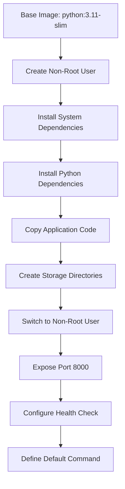
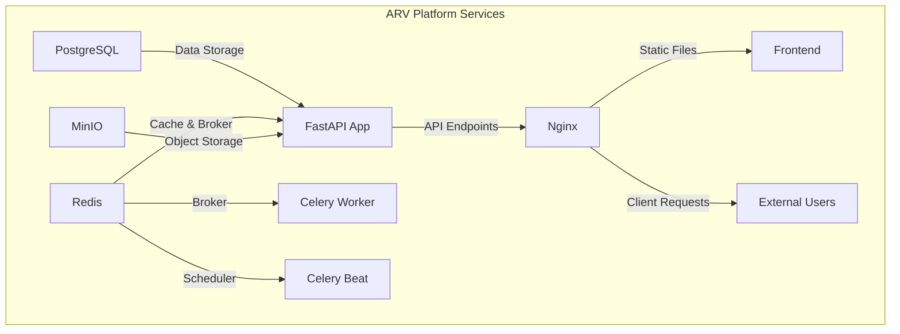
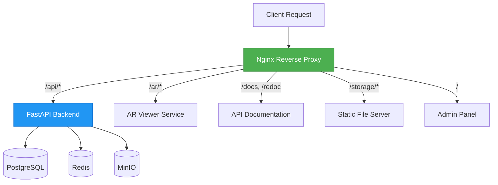
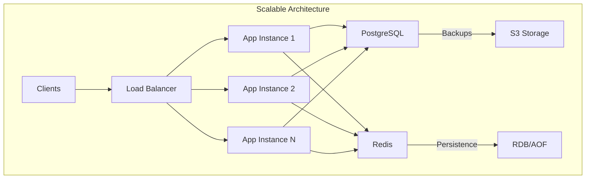

# Deployment & Operations

<cite>
**Referenced Files in This Document**   
- [Dockerfile](file://Dockerfile)
- [docker-compose.yml](file://docker-compose.yml)
- [docker-compose.override.yml](file://docker-compose.override.yml)
- [nginx/nginx.conf](file://nginx/nginx.conf)
- [app/main.py](file://app/main.py)
- [app/core/config.py](file://app/core/config.py)
- [app/core/database.py](file://app/core/database.py)
- [app/tasks/celery_app.py](file://app/tasks/celery_app.py)
- [alembic.ini](file://alembic.ini)
- [alembic/env.py](file://alembic/env.py)
</cite>

## Table of Contents
1. [Introduction](#introduction)
2. [Docker-Based Deployment Strategy](#docker-based-deployment-strategy)
3. [Docker Compose Orchestration](#docker-compose-orchestration)
4. [Nginx Reverse Proxy Configuration](#nginx-reverse-proxy-configuration)
5. [Database Management and Migrations](#database-management-and-migrations)
6. [Backup and Recovery Procedures](#backup-and-recovery-procedures)
7. [Scaling Considerations](#scaling-considerations)
8. [Operational Runbooks](#operational-runbooks)
9. [Infrastructure Requirements and Performance Tuning](#infrastructure-requirements-and-performance-tuning)
10. [Conclusion](#conclusion)

## Introduction
The ARV platform is a B2B SaaS solution for creating augmented reality (AR) content based on image recognition. This document provides comprehensive deployment and operations guidance for the platform, focusing on containerized infrastructure using Docker and Docker Compose. The architecture includes FastAPI for the backend API, PostgreSQL for persistent data storage, Redis for caching and message brokering, Celery for asynchronous task processing, and Nginx as a reverse proxy and static file server. The deployment strategy emphasizes security, scalability, and operational reliability through non-root container execution, health checks, and structured logging.

**Section sources**
- [app/main.py](file://app/main.py#L84-L92)
- [PHASE1_SUMMARY.md](file://PHASE1_SUMMARY.md#L1-L179)

## Docker-Based Deployment Strategy

### Multi-Stage Builds and Container Security
The ARV platform employs a secure Docker deployment strategy with multi-stage build principles and non-root user execution. The Dockerfile begins with a Python 3.11-slim base image to minimize attack surface and improve build efficiency. A dedicated non-root user (appuser) with UID 1000 is created and used throughout the container lifecycle to adhere to the principle of least privilege.

The build process follows a streamlined approach:
1. System dependencies are installed (gcc, g++, libpq-dev, postgresql-client, curl, nodejs, npm)
2. Python dependencies are installed from requirements.txt
3. Application code is copied into the container
4. Storage directories are created with appropriate ownership
5. The container switches to the non-root user before execution

Security is further enhanced through environment variable configuration that disables Python bytecode caching (PYTHONDONTWRITEBYTECODE) and pip version checks, while ensuring output is not buffered (PYTHONUNBUFFERED). The container exposes port 8000 for the FastAPI application and implements a health check that verifies service availability by calling the /api/health/status endpoint.



**Diagram sources**
- [Dockerfile](file://Dockerfile#L1-L53)

**Section sources**
- [Dockerfile](file://Dockerfile#L1-L53)

## Docker Compose Orchestration

### Production and Development Environment Configuration
The ARV platform utilizes Docker Compose for service orchestration across both production and development environments. The primary docker-compose.yml file defines a complete production-ready stack with six core services: PostgreSQL, Redis, MinIO, FastAPI application, Celery worker, Celery beat scheduler, and Nginx reverse proxy.

Each service is configured with appropriate environment variables, volume mounts, and network settings. The services are connected through a dedicated bridge network (vertex-ar-network) to ensure secure internal communication. Critical services include:

- **PostgreSQL 15**: Persistent data storage with volume mounting for data persistence and health checks to ensure database readiness
- **Redis 7**: Caching and message brokering with memory limits (256MB) and LRU eviction policy
- **MinIO**: Object storage for AR content, videos, and markers with web console access
- **FastAPI Application**: The core backend service running with Uvicorn workers and proper dependency ordering
- **Celery Components**: Distributed task processing with worker and beat scheduler services
- **Nginx**: Reverse proxy handling request routing, static file serving, and security



**Diagram sources**
- [docker-compose.yml](file://docker-compose.yml#L1-L163)

### Environment-Specific Overrides
The platform implements environment-specific configuration through docker-compose.override.yml, which extends the base configuration for development purposes. This override file enables hot reloading by mounting the source code directory into the containers, allowing developers to see changes immediately without rebuilding images.

Development-specific configurations include:
- Source code volume mounting for hot reload capability
- Debug mode activation with enhanced logging
- Development environment designation
- Retained port mappings for local development access

The override mechanism allows developers to use the same docker-compose commands for both environments while automatically applying development-specific settings. This approach ensures consistency between development and production environments while providing the flexibility needed for rapid development.

**Section sources**
- [docker-compose.yml](file://docker-compose.yml#L1-L163)
- [docker-compose.override.yml](file://docker-compose.override.yml#L1-L32)

## Nginx Reverse Proxy Configuration

### Routing, Static File Serving, and Security
The Nginx configuration serves as the entry point for all client requests, providing reverse proxy functionality, static file serving, and security hardening. The configuration is mounted as a read-only volume from nginx/nginx.conf into the Nginx container, ensuring configuration consistency across deployments.

Key routing configurations include:
- **API Endpoints**: Requests to /api/ are proxied to the FastAPI backend with rate limiting (100 requests/minute) to prevent abuse
- **Public AR Viewer**: AR content at /ar/ is served through the application for dynamic content rendering
- **API Documentation**: Swagger UI (/docs) and ReDoc (/redoc) endpoints are proxied to enable API exploration
- **Static Files**: User-uploaded content at /storage/ is served directly by Nginx with caching headers for performance
- **Admin Interface**: The React SPA frontend is served with appropriate caching policies



**Diagram sources**
- [nginx/nginx.conf](file://nginx/nginx.conf#L1-L118)

The configuration implements comprehensive security measures:
- Security headers including X-Frame-Options, X-Content-Type-Options, X-XSS-Protection, and Referrer-Policy
- Rate limiting zones for API endpoints and uploads to prevent denial-of-service attacks
- Proper header forwarding (X-Real-IP, X-Forwarded-For, X-Forwarded-Proto) for accurate client information
- Gzip compression for response size reduction and bandwidth optimization
- Appropriate timeout settings for proxy connections

Performance is optimized through sendfile, tcp_nopush, and tcp_nodelay directives, along with a generous client_max_body_size of 500M to accommodate large AR content uploads.

**Section sources**
- [nginx/nginx.conf](file://nginx/nginx.conf#L1-L118)

## Database Management and Migrations

### Alembic Migration System
The ARV platform uses Alembic for database schema migrations, providing a robust system for evolving the database schema over time. The configuration in alembic.ini sets up the migration environment with timestamp-based migration filenames for chronological organization.

The migration system is configured for asynchronous operation through env.py, which integrates with the application's async database engine. This allows migrations to be applied without blocking the main application thread. The configuration overrides the SQLAlchemy URL from environment variables, ensuring migrations target the correct database instance.

Key migration configuration features:
- Script location set to the alembic directory
- Custom file template with timestamp precision to microsecond level
- Version path separator using the operating system's path separator
- Logging configuration with appropriate levels for SQLAlchemy and Alembic components
- Integration with the application's settings system for database connection

The env.py file imports the application's Base metadata and settings, enabling autogeneration of migration scripts based on model changes. The configuration supports both offline and online migration modes, with online mode using async connections for non-blocking operations.

**Section sources**
- [alembic.ini](file://alembic.ini#L1-L113)
- [alembic/env.py](file://alembic/env.py#L1-L89)

### Database Initialization and Seeding
The application implements a comprehensive database initialization process through app/core/database.py. During startup, the application automatically creates database tables if they don't exist by running Base.metadata.create_all() against the async engine.

The seeding process ensures critical default data is present:
- Creation of a default storage connection for local disk storage
- Establishment of a default company (Vertex AR) with associated storage path
- Creation of base folder structure for content organization (portraits, videos, markers, etc.)

This initialization occurs during the application lifespan startup event, ensuring the database is ready before the application begins serving requests. The process is idempotent, checking for existing records before creating new ones to prevent duplication.

**Section sources**
- [app/core/database.py](file://app/core/database.py#L48-L103)
- [app/main.py](file://app/main.py#L58-L68)

## Backup and Recovery Procedures

### Database Backup Strategy
While specific backup scripts are not present in the current codebase, the configuration indicates a planned S3-compatible backup strategy. The settings in app/core/config.py include parameters for S3 endpoint, access keys, bucket name, and retention period (30 days), suggesting an external backup solution will be implemented.

Recommended backup procedures:
1. Regular PostgreSQL dumps using pg_dump with compression
2. Automated backup scheduling through Celery beat or external cron jobs
3. Secure transmission to S3-compatible storage with proper encryption
4. Verification of backup integrity and test restoration procedures

Database recovery should follow these steps:
1. Stop the application and database services
2. Restore the PostgreSQL data directory from backup
3. Start the database service and verify data integrity
4. Start the application service and validate functionality

### Storage Content Backup
The platform stores user content in the storage/content directory, which is mounted as a volume in both the application and Nginx containers. This shared volume approach simplifies backup operations, as all user content is centralized.

Backup recommendations for storage content:
- Implement regular snapshots of the storage volume
- Use incremental backup strategies to minimize storage requirements
- Consider replication to secondary storage locations for disaster recovery
- Implement content verification to ensure file integrity

The MinIO object storage service also provides built-in bucket versioning and replication capabilities that can be leveraged for additional data protection.

**Section sources**
- [app/core/config.py](file://app/core/config.py#L105-L110)
- [docker-compose.yml](file://docker-compose.yml#L76-L77)
- [nginx/nginx.conf](file://nginx/nginx.conf#L142)

## Scaling Considerations

### Horizontal and Vertical Scaling Strategies
The ARV platform architecture supports both horizontal and vertical scaling to handle increased loads. The containerized design allows for easy replication of services to distribute workload across multiple instances.

For the FastAPI application, scaling can be achieved by:
- Increasing the number of Uvicorn workers within containers
- Deploying multiple application container instances behind a load balancer
- Implementing auto-scaling based on CPU/memory usage or request volume

The database tier can be scaled through:
- Vertical scaling by increasing PostgreSQL memory and CPU allocation
- Connection pooling optimization using the configured DB_POOL_SIZE and DB_MAX_OVERFLOW settings
- Read replica implementation for read-heavy workloads



**Diagram sources**
- [docker-compose.yml](file://docker-compose.yml#L62-L88)
- [app/core/config.py](file://app/core/config.py#L41-L42)

### Task Processing Scalability
The Celery task processing system is designed for horizontal scaling. Additional worker instances can be deployed to handle increased task loads, with work distributed through Redis message queues.

The configuration defines three dedicated queues:
- **markers**: For AR marker generation tasks
- **notifications**: For email and messaging notifications
- **default**: For general background tasks

This queue separation allows for targeted scaling of specific task types based on workload patterns. The celery-beat scheduler ensures periodic tasks are executed reliably, with configurable schedules for different maintenance operations.

Performance monitoring should track:
- Task queue lengths and processing times
- Worker utilization and concurrency levels
- Database connection pool usage
- Redis memory consumption

**Section sources**
- [app/tasks/celery_app.py](file://app/tasks/celery_app.py#L1-L50)
- [docker-compose.yml](file://docker-compose.yml#L89-L134)

## Operational Runbooks

### Applying Database Migrations
To apply database migrations in the ARV platform:

1. Ensure all services are running:
```bash
docker compose up -d
```

2. Execute the Alembic upgrade command:
```bash
docker compose exec app alembic upgrade head
```

3. Verify the migration was successful by checking service logs:
```bash
docker compose logs app
```

For production deployments, perform migrations during maintenance windows and ensure backups are current before proceeding.

### Restarting Services
To restart individual services:
```bash
# Restart application service
docker compose restart app

# Restart all services
docker compose restart

# Restart with configuration reload
docker compose up -d --force-recreate app
```

### Monitoring System Health
The platform provides multiple health monitoring endpoints:

1. Application health check:
```bash
curl http://localhost/api/health/status
```

2. Readiness check:
```bash
curl http://localhost/api/health/readiness
```

3. Service-specific health checks via Docker:
```bash
# View container health status
docker compose ps

# Monitor logs in real-time
docker compose logs -f app
```

Key metrics to monitor:
- HTTP request rates and error rates
- Database connection pool utilization
- Redis memory usage
- Task queue lengths
- Container resource consumption (CPU, memory)

**Section sources**
- [app/main.py](file://app/main.py#L209-L238)
- [docker-compose.yml](file://docker-compose.yml#L17-L21)
- [PHASE1_SUMMARY.md](file://PHASE1_SUMMARY.md#L160-L163)

## Infrastructure Requirements and Performance Tuning

### Resource Allocation Recommendations
Based on the current configuration, recommended infrastructure specifications:

**Development Environment:**
- 2 CPU cores
- 4GB RAM
- 20GB storage
- Docker Desktop or Docker Engine

**Production Environment:**
- 4-8 CPU cores (depending on expected load)
- 8-16GB RAM
- 100GB+ storage (scalable based on content volume)
- SSD storage for database performance

Service-specific resource considerations:
- **PostgreSQL**: Allocate sufficient memory for shared_buffers and effective_cache_size
- **Redis**: Monitor memory usage and adjust maxmemory settings as needed
- **Application**: Scale Uvicorn workers based on CPU core count (typically 2-4 per core)
- **Nginx**: Generally lightweight, but ensure sufficient file descriptor limits

### Performance Tuning Parameters
Key configuration parameters for performance optimization:

**Database:**
- DB_POOL_SIZE: Adjust based on concurrent connection requirements
- DB_MAX_OVERFLOW: Control maximum connection spikes
- PostgreSQL shared_buffers: Set to 25% of available RAM
- PostgreSQL effective_cache_size: Set to 50-75% of available RAM

**Redis:**
- Memory limit: Configure based on cache size requirements
- Maxmemory policy: Currently set to allkeys-lru for efficient eviction

**Application:**
- Uvicorn workers: Scale based on CPU cores and workload
- Async database sessions: Leverage for non-blocking I/O operations
- Structured logging: Disable debug logging in production for performance

**Nginx:**
- worker_connections: Adjust based on expected concurrent connections
- keepalive_timeout: Optimize for client connection patterns
- gzip compression: Enabled for bandwidth optimization

Regular performance testing and monitoring are recommended to identify bottlenecks and optimize configuration settings for specific deployment scenarios.

**Section sources**
- [app/core/config.py](file://app/core/config.py#L41-L42)
- [docker-compose.yml](file://docker-compose.yml#L30)
- [nginx/nginx.conf](file://nginx/nginx.conf#L2)

## Conclusion
The ARV platform's deployment and operations framework provides a robust, scalable foundation for delivering augmented reality content services. The containerized architecture with Docker and Docker Compose enables consistent deployments across environments, while the non-root execution model enhances security. The integration of Nginx as a reverse proxy provides efficient request routing, static file serving, and security hardening.

The platform's design supports growth through horizontal scaling of application instances and Celery workers, vertical scaling of database resources, and distributed task processing. Comprehensive health checks, structured logging, and monitoring endpoints facilitate operational visibility and troubleshooting.

Future enhancements should focus on implementing the planned backup strategy, refining performance tuning parameters based on production usage patterns, and expanding monitoring capabilities with metrics collection and alerting. The current architecture provides a solid foundation for these improvements while maintaining operational reliability and security.