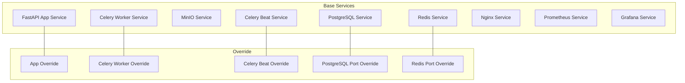
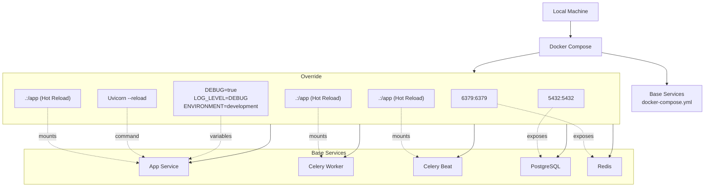
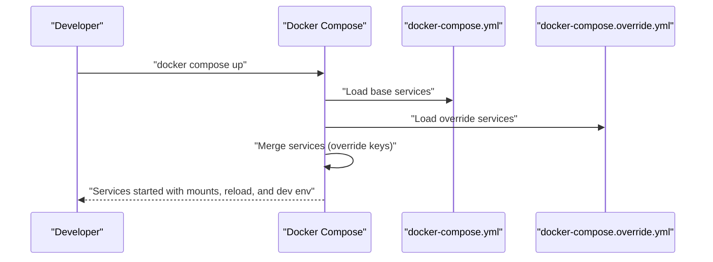
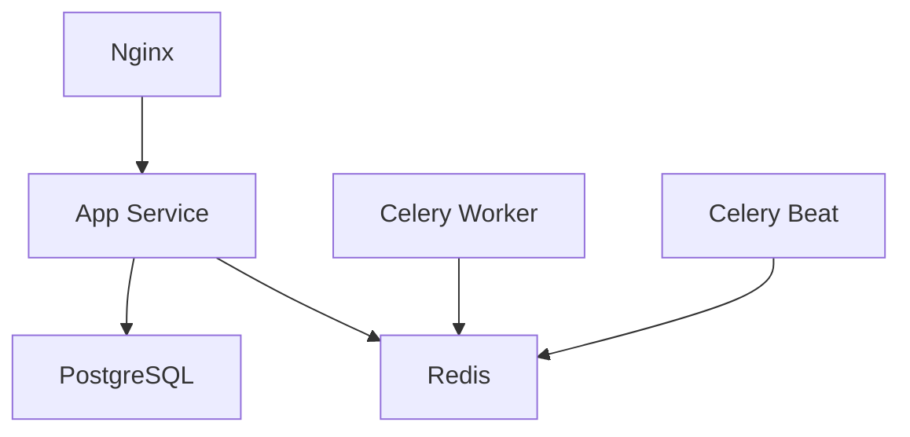

# Development Environment Setup

<cite>
**Referenced Files in This Document**
- [docker-compose.yml](file://docker-compose.yml)
- [docker-compose.override.yml](file://docker-compose.override.yml)
- [Dockerfile](file://Dockerfile)
- [app/main.py](file://app/main.py)
- [app/core/config.py](file://app/core/config.py)
- [.env.example](file://.env.example)
- [README.md](file://README.md)
</cite>

## Table of Contents
1. [Introduction](#introduction)
2. [Project Structure](#project-structure)
3. [Core Components](#core-components)
4. [Architecture Overview](#architecture-overview)
5. [Detailed Component Analysis](#detailed-component-analysis)
6. [Dependency Analysis](#dependency-analysis)
7. [Performance Considerations](#performance-considerations)
8. [Troubleshooting Guide](#troubleshooting-guide)
9. [Conclusion](#conclusion)

## Introduction
This document explains how the ARV platform’s development environment is configured using Docker Compose overrides to enable hot reloading and streamlined local development. It details how docker-compose.override.yml extends the base docker-compose.yml to mount the local source code into the container, how volume mappings enable real-time code changes for the app, celery-worker, and celery-beat services, and how the app service command is overridden to use Uvicorn’s auto-reload. It also covers environment variable overrides for development (DEBUG, LOG_LEVEL, ENVIRONMENT), port exposure for local access to PostgreSQL and Redis, and practical guidance for starting the environment and resolving common issues.

## Project Structure
The development environment relies on a base Docker Compose configuration and a development override file. The base configuration defines production-grade services (PostgreSQL, Redis, MinIO, FastAPI app, Celery worker and beat, Nginx, Prometheus, Grafana). The override adds development-specific mounts, commands, and environment variables.

**Diagram sources**
- [docker-compose.yml](file://docker-compose.yml#L1-L254)
- [docker-compose.override.yml](file://docker-compose.override.yml#L1-L32)

**Section sources**
- [docker-compose.yml](file://docker-compose.yml#L1-L254)
- [docker-compose.override.yml](file://docker-compose.override.yml#L1-L32)

## Core Components
- Base configuration defines:
  - PostgreSQL, Redis, MinIO, FastAPI app, Celery worker and beat, Nginx, Prometheus, and Grafana.
  - Persistent volumes for databases and MinIO.
  - Health checks and restart policies.
  - Environment variables for URLs and monitoring.
- Override configuration adds:
  - Hot reload mounts for app, celery-worker, and celery-beat.
  - Overridden command for the app service enabling Uvicorn auto-reload.
  - Development environment variables (DEBUG, LOG_LEVEL, ENVIRONMENT).
  - Local port exposure for PostgreSQL and Redis.

**Section sources**
- [docker-compose.yml](file://docker-compose.yml#L1-L254)
- [docker-compose.override.yml](file://docker-compose.override.yml#L1-L32)

## Architecture Overview
The development architecture merges the base and override configurations. The app service runs Uvicorn with auto-reload enabled and mounts the local source tree. Celery worker and beat also mount the source tree for live updates. PostgreSQL and Redis are exposed locally for easy inspection and debugging.

**Diagram sources**
- [docker-compose.yml](file://docker-compose.yml#L1-L254)
- [docker-compose.override.yml](file://docker-compose.override.yml#L1-L32)

## Detailed Component Analysis

### Hot Reloading via Volume Mounts
- App service:
  - Mounts the host directory to /app inside the container to reflect local code changes immediately.
  - Also mounts the content storage directory to preserve local artifacts.
- Celery worker and beat:
  - Mount the host directory to /app so task code changes are reflected without rebuilding images.
  - Both services mount the content storage directory for consistent access to generated assets.
- Why this matters:
  - Enables rapid iteration during development without manual rebuilds.
  - Ensures that changes to Python modules, routes, tasks, and configuration propagate instantly.

**Section sources**
- [docker-compose.override.yml](file://docker-compose.override.yml#L1-L32)

### Overridden Command for the App Service
- The app service command is replaced with a Uvicorn invocation that enables auto-reload.
- This allows the FastAPI application to restart automatically when source files change.
- The base Dockerfile also sets a default command that starts Uvicorn without reload; the override takes precedence in development.

**Section sources**
- [docker-compose.override.yml](file://docker-compose.override.yml#L1-L32)
- [Dockerfile](file://Dockerfile#L51-L53)

### Environment Variable Overrides for Development
- DEBUG is set to true, enabling verbose logging and development-friendly behaviors.
- LOG_LEVEL is set to DEBUG, increasing verbosity for easier troubleshooting.
- ENVIRONMENT is set to development, influencing runtime behavior and logging configuration.
- These variables are loaded from the .env file and can be overridden by the override file.

**Section sources**
- [docker-compose.override.yml](file://docker-compose.override.yml#L1-L32)
- [.env.example](file://.env.example#L1-L71)
- [app/core/config.py](file://app/core/config.py#L1-L134)
- [app/main.py](file://app/main.py#L1-L268)

### Port Exposure for Local Development Access
- PostgreSQL:
  - Exposed locally on port 5432 for direct connections from external tools (e.g., psql, DBeaver).
- Redis:
  - Exposed locally on port 6379 for direct connections from external tools (e.g., redis-cli, GUI clients).
- These ports are defined in the override file and are available only in development mode.

**Section sources**
- [docker-compose.override.yml](file://docker-compose.override.yml#L1-L32)

### Starting the Development Environment
- Use docker compose up to start all services.
- The override file automatically merges with the base configuration, applying mounts, commands, and environment variables for development.
- The base README provides general guidance for running the stack and applying migrations.

**Section sources**
- [README.md](file://README.md#L1-L149)
- [docker-compose.yml](file://docker-compose.yml#L1-L254)
- [docker-compose.override.yml](file://docker-compose.override.yml#L1-L32)

### How the Override Merges with the Base Configuration
- Docker Compose merges the base and override files by combining services and overriding keys (e.g., command, volumes, environment, ports).
- The merged configuration applies development-specific behavior while retaining production-grade services.

**Diagram sources**
- [docker-compose.yml](file://docker-compose.yml#L1-L254)
- [docker-compose.override.yml](file://docker-compose.override.yml#L1-L32)

## Dependency Analysis
- App service depends on:
  - PostgreSQL and Redis health checks before starting.
  - Mounted storage directories for content persistence.
  - Development environment variables for logging and behavior.
- Celery worker and beat depend on:
  - Redis availability.
  - Mounted source code for live task updates.
- Nginx depends on the app service for proxying traffic.

**Diagram sources**
- [docker-compose.yml](file://docker-compose.yml#L1-L254)

**Section sources**
- [docker-compose.yml](file://docker-compose.yml#L1-L254)

## Performance Considerations
- Auto-reload is convenient but can increase CPU usage during frequent file changes. Disable reload in production.
- Mounting large directories can slow down file system operations on some hosts. Limit mounted directories to only necessary paths.
- Running multiple workers and concurrency in development is fine, but keep an eye on resource usage.

## Troubleshooting Guide
- File permission conflicts:
  - Symptom: Permission denied errors when writing to mounted directories.
  - Cause: Container user mismatch with host ownership.
  - Resolution: Ensure the container user aligns with the host user ID and group ID. The base configuration sets a non-root user and creates storage directories with appropriate ownership. Verify that the host user ID matches the container user ID used in the base configuration.
  - Related references:
    - [Dockerfile](file://Dockerfile#L1-L53)
    - [docker-compose.yml](file://docker-compose.yml#L1-L254)

- Container restart loops:
  - Symptom: Containers restart continuously.
  - Causes:
    - Missing or invalid environment variables (e.g., DATABASE_URL, REDIS_URL).
    - Unhealthy dependencies (PostgreSQL or Redis not ready).
    - Conflicting port bindings (e.g., port 8000, 5432, or 6379 already in use).
  - Resolutions:
    - Confirm .env values match the override and base configuration.
    - Check service health checks and logs for dependency readiness.
    - Free up conflicting host ports.
  - Related references:
    - [.env.example](file://.env.example#L1-L71)
    - [docker-compose.yml](file://docker-compose.yml#L1-L254)
    - [docker-compose.override.yml](file://docker-compose.override.yml#L1-L32)

- Uvicorn reload not triggering:
  - Symptom: Changes not reflected until manual restart.
  - Causes:
    - Missing mount for the app service.
    - Wrong working directory or module path in the overridden command.
  - Resolutions:
    - Verify the app service mounts the host directory to /app.
    - Ensure the overridden command uses the correct module path.
  - Related references:
    - [docker-compose.override.yml](file://docker-compose.override.yml#L1-L32)
    - [Dockerfile](file://Dockerfile#L51-L53)

- PostgreSQL or Redis not reachable locally:
  - Symptom: Cannot connect to 5432 or 6379 from the host.
  - Causes:
    - Ports not exposed in the override.
    - Conflicting local ports.
  - Resolutions:
    - Confirm the override exposes ports 5432 and 6379.
    - Change host ports if needed.
  - Related references:
    - [docker-compose.override.yml](file://docker-compose.override.yml#L1-L32)

## Conclusion
The development environment leverages Docker Compose overrides to enable hot reloading, streamline debugging, and simplify local connectivity to core services. By mounting the source code, overriding the app command to use Uvicorn’s auto-reload, setting development environment variables, and exposing PostgreSQL and Redis ports, developers can iterate quickly and efficiently. Use the troubleshooting guidance to resolve common issues and maintain a smooth development workflow.