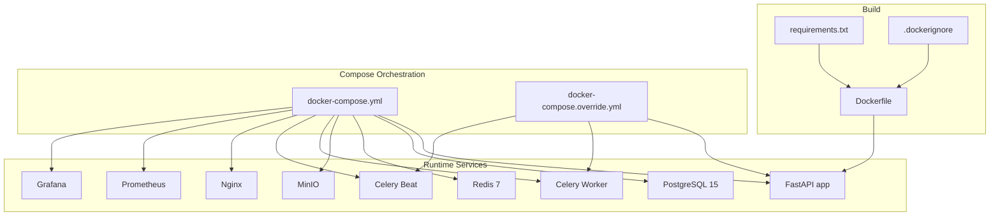
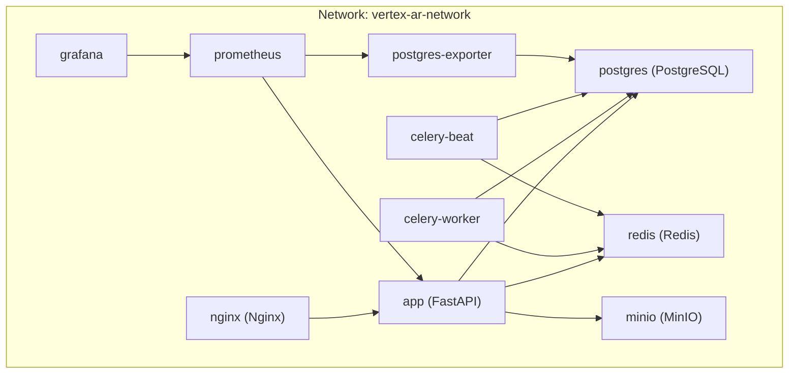
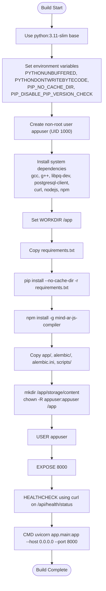
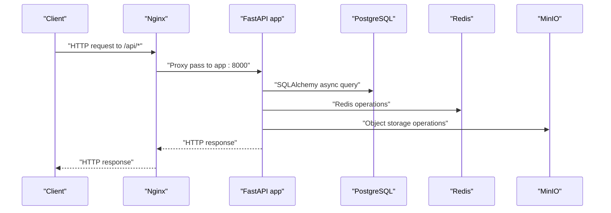
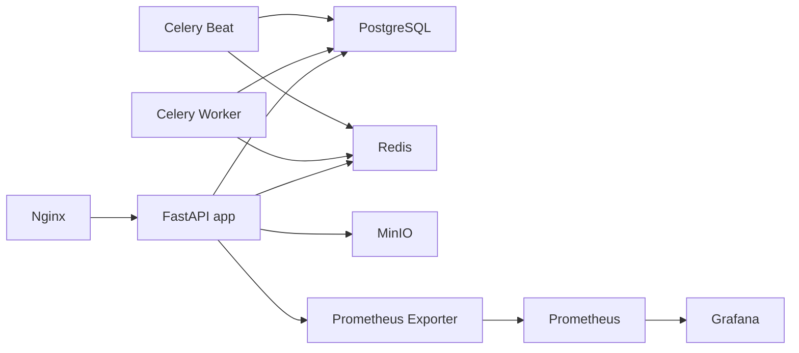

# Docker Deployment

<cite>
**Referenced Files in This Document**
- [Dockerfile](file://Dockerfile)
- [docker-compose.yml](file://docker-compose.yml)
- [docker-compose.override.yml](file://docker-compose.override.yml)
- [.dockerignore](file://.dockerignore)
- [requirements.txt](file://requirements.txt)
- [app/main.py](file://app/main.py)
- [app/core/config.py](file://app/core/config.py)
- [app/tasks/celery_app.py](file://app/tasks/celery_app.py)
- [nginx/nginx.conf](file://nginx/nginx.conf)
- [.env.example](file://.env.example)
</cite>

## Table of Contents
1. [Introduction](#introduction)
2. [Project Structure](#project-structure)
3. [Core Components](#core-components)
4. [Architecture Overview](#architecture-overview)
5. [Detailed Component Analysis](#detailed-component-analysis)
6. [Dependency Analysis](#dependency-analysis)
7. [Performance Considerations](#performance-considerations)
8. [Troubleshooting Guide](#troubleshooting-guide)
9. [Conclusion](#conclusion)

## Introduction
This document describes the ARV platform’s Docker deployment strategy. It covers the multi-stage Docker build process using a slim Python base image, system dependency installation, non-root user creation, and proper file ownership configuration. It also explains the Docker Compose production setup orchestrating FastAPI, PostgreSQL, Redis, Celery workers and scheduler, MinIO, Nginx, Prometheus, and Grafana. Network configuration, volume mounts, health checks, restart policies, and user permissions are documented. Finally, it provides performance tuning recommendations for each service.

## Project Structure
The deployment relies on:
- A single Dockerfile for building the FastAPI application image
- A primary docker-compose.yml for production orchestration
- A docker-compose.override.yml for development overrides
- An .env.example file defining environment variables
- An .dockerignore file controlling build artifacts
- Nginx configuration for reverse proxy and static file serving
- Application configuration and Celery setup for runtime behavior

**Diagram sources**
- [Dockerfile](file://Dockerfile#L1-L53)
- [requirements.txt](file://requirements.txt#L1-L33)
- [.dockerignore](file://.dockerignore#L1-L78)
- [docker-compose.yml](file://docker-compose.yml#L1-L226)
- [docker-compose.override.yml](file://docker-compose.override.yml#L1-L32)

**Section sources**
- [Dockerfile](file://Dockerfile#L1-L53)
- [docker-compose.yml](file://docker-compose.yml#L1-L226)
- [docker-compose.override.yml](file://docker-compose.override.yml#L1-L32)
- [.dockerignore](file://.dockerignore#L1-L78)
- [requirements.txt](file://requirements.txt#L1-L33)

## Core Components
- Multi-stage Docker build using python:3.11-slim as the base image
- Non-root user creation and ownership management for security
- System dependencies for compilation and runtime
- Health checks for service readiness
- Reverse proxy and static file serving via Nginx
- Orchestration of PostgreSQL, Redis, Celery, MinIO, Prometheus, and Grafana

Key build-time behaviors:
- Environment variables set to optimize Python behavior and caching
- System packages installed for compilation and connectivity
- Node.js and npm installed for asset compilation
- Application code copied and storage directory created with proper ownership
- Uvicorn started with explicit host/port and worker count

Runtime behaviors:
- Health checks for PostgreSQL, Redis, and FastAPI
- Reverse proxy routing API, docs, AR viewer, and static storage
- Celery worker and beat scheduling configured with queues and schedules
- Prometheus exporter and Grafana dashboards for observability

**Section sources**
- [Dockerfile](file://Dockerfile#L1-L53)
- [app/main.py](file://app/main.py#L212-L268)
- [nginx/nginx.conf](file://nginx/nginx.conf#L1-L118)
- [app/tasks/celery_app.py](file://app/tasks/celery_app.py#L1-L59)
- [docker-compose.yml](file://docker-compose.yml#L1-L226)

## Architecture Overview
The production stack runs on a custom bridge network. Services communicate by DNS names defined in the compose file. Volumes persist PostgreSQL, Redis, and MinIO data. Nginx fronts the API and serves static assets and the admin SPA.

**Diagram sources**
- [docker-compose.yml](file://docker-compose.yml#L1-L226)
- [nginx/nginx.conf](file://nginx/nginx.conf#L38-L40)

**Section sources**
- [docker-compose.yml](file://docker-compose.yml#L1-L226)

## Detailed Component Analysis

### Dockerfile Build Process
The Dockerfile defines a secure, minimal build pipeline:
- Sets environment variables to disable bytecode writing, unbuffered logs, and pip caching
- Creates a non-root user with UID 1000 and switches to it for security
- Installs system dependencies including compilers, PostgreSQL client, curl, Node.js, and npm
- Copies Python requirements and installs them without cache
- Installs a global Node package for asset compilation
- Copies application code and Alembic migration files
- Creates and chowns the storage directory for content
- Exposes port 8000 and defines a health check using curl against the health endpoint
- Starts Uvicorn with host 0.0.0.0 and port 8000

**Diagram sources**
- [Dockerfile](file://Dockerfile#L1-L53)

**Section sources**
- [Dockerfile](file://Dockerfile#L1-L53)

### Docker Compose Production Setup
Production orchestration includes:
- Custom bridge network named vertex-ar-network
- Persistent volumes for PostgreSQL, Redis, and MinIO data
- Service health checks for readiness gates
- Container naming conventions (vertex-ar-*)
- Restart policy unless-stopped
- User permissions set to UID:GID 1000:1000 for security
- Environment variables loaded from .env and injected into services
- Ports exposed for external access (5432, 6379, 8000, 9000, 9001, 9187, 3001, 9090)

Service roles:
- FastAPI app: Uvicorn with 4 workers, health check, depends on healthy postgres and redis
- Celery worker: concurrency 2, specific queues, depends on healthy postgres and redis
- Celery beat: scheduler, depends on redis
- PostgreSQL: initializes database and user, health check via pg_isready
- Redis: memory limits and LRU eviction policy, health check via redis-cli ping
- MinIO: object storage console and server
- Nginx: reverse proxy to app, static storage, rate limiting, and security headers
- Prometheus and Grafana: metrics and dashboards

**Diagram sources**
- [docker-compose.yml](file://docker-compose.yml#L1-L226)
- [nginx/nginx.conf](file://nginx/nginx.conf#L38-L40)

**Section sources**
- [docker-compose.yml](file://docker-compose.yml#L1-L226)

### Development Overrides
The override file enables hot reload during development:
- Mounts the source tree into containers for live updates
- Enables debug logging and development environment variables
- Adds port mappings for local access

**Section sources**
- [docker-compose.override.yml](file://docker-compose.override.yml#L1-L32)

### Environment Variables and Secrets
Environment variables are defined in .env.example and consumed by services:
- Database URL, pool size, overflow
- Redis URL and max connections
- Security keys and tokens
- Storage configuration (local, MinIO, Yandex Disk)
- Celery broker and result backend settings
- CORS origins and credentials
- Monitoring and backup settings

These values are injected into services via env_file and environment blocks in docker-compose.yml.

**Section sources**
- [.env.example](file://.env.example#L1-L70)
- [docker-compose.yml](file://docker-compose.yml#L60-L110)
- [app/core/config.py](file://app/core.config.py#L1-L133)

### Health Checks and Readiness
- PostgreSQL health check uses pg_isready with retry intervals
- Redis health check pings the server
- FastAPI health check probes the /api/health/status endpoint
- Nginx exposes a simple /health endpoint for load balancer checks

These checks gate service dependencies and ensure restarts occur only when services are ready.

**Section sources**
- [docker-compose.yml](file://docker-compose.yml#L17-L21)
- [docker-compose.yml](file://docker-compose.yml#L35-L39)
- [docker-compose.yml](file://docker-compose.yml#L79-L83)
- [nginx/nginx.conf](file://nginx/nginx.conf#L47-L52)

### Reverse Proxy and Static Assets
Nginx acts as a reverse proxy:
- Proxies API, docs, and AR viewer to the FastAPI app
- Serves static storage content from a mounted volume
- Applies rate limiting zones for API and uploads
- Adds security headers and gzip compression
- Configures timeouts and keepalive

**Section sources**
- [nginx/nginx.conf](file://nginx/nginx.conf#L1-L118)
- [docker-compose.yml](file://docker-compose.yml#L153-L167)

### Celery Workers and Scheduler
Celery is configured with:
- Broker and result backend pointing to Redis
- Task queues: markers, notifications, default
- Periodic tasks scheduled via Celery Beat
- Concurrency and logging levels set per service

**Section sources**
- [app/tasks/celery_app.py](file://app/tasks/celery_app.py#L1-L59)
- [docker-compose.yml](file://docker-compose.yml#L94-L139)

## Dependency Analysis
The application depends on:
- PostgreSQL for relational persistence
- Redis for caching and message queuing
- MinIO for object storage
- Celery for asynchronous task processing
- Prometheus exporter for database metrics
- Nginx for reverse proxy and static serving
- Grafana for dashboarding

**Diagram sources**
- [docker-compose.yml](file://docker-compose.yml#L1-L226)

**Section sources**
- [docker-compose.yml](file://docker-compose.yml#L1-L226)

## Performance Considerations
- PostgreSQL
  - Tune connection pool settings via DB_POOL_SIZE and DB_MAX_OVERFLOW
  - Ensure adequate CPU/memory allocation for concurrent connections
  - Use the exported metrics for capacity planning

- Redis
  - Adjust maxmemory and policy according to workload (already configured with LRU)
  - Monitor memory fragmentation and evictions
  - Scale horizontally if needed (not shown in current compose)

- FastAPI/Uvicorn
  - Increase workers proportionally to CPU cores for CPU-bound endpoints
  - Enable keepalive and tune timeouts for long-running requests
  - Use structured logging and Prometheus metrics for latency insights

- Celery
  - Adjust concurrency based on CPU and I/O characteristics
  - Distribute tasks across queues to prevent hotspots
  - Monitor queue lengths and task durations

- Nginx
  - Tune client_max_body_size for uploads
  - Adjust gzip levels and types for optimal compression
  - Review rate limiting zones for traffic patterns

- MinIO
  - Size drives appropriately for expected object counts and sizes
  - Enable retention and versioning policies as needed

[No sources needed since this section provides general guidance]

## Troubleshooting Guide
Common issues and remedies:
- Health check failures
  - Verify service_healthy conditions in depends_on for app, celery-worker, and celery-beat
  - Inspect healthcheck logs for curl or pg_isready/redis-cli failures

- Permission denied errors
  - Confirm non-root user UID/GID 1000:1000 is used consistently across services
  - Ensure storage directory ownership matches the non-root user

- Port conflicts
  - Check host port mappings for 5432, 6379, 8000, 9000, 9001, 9187, 3001, 9090
  - Stop conflicting services or change mappings

- Missing static assets
  - Validate volume mounts for storage content and frontend dist
  - Confirm Nginx alias and permissions for served directories

- Celery task failures
  - Check broker connectivity to Redis
  - Review task queues and concurrency settings
  - Inspect Celery logs for serialization or timeout errors

**Section sources**
- [docker-compose.yml](file://docker-compose.yml#L84-L89)
- [docker-compose.yml](file://docker-compose.yml#L110-L115)
- [docker-compose.yml](file://docker-compose.yml#L133-L137)
- [Dockerfile](file://Dockerfile#L37-L42)
- [nginx/nginx.conf](file://nginx/nginx.conf#L95-L101)

## Conclusion
The ARV platform employs a robust, production-grade Docker deployment strategy centered on a secure, non-root-first build and orchestrated services on a custom bridge network. Health checks, persistent volumes, and reverse proxy configuration ensure reliability and scalability. With the provided performance tuning recommendations and troubleshooting guidance, operators can maintain a resilient and observable system.