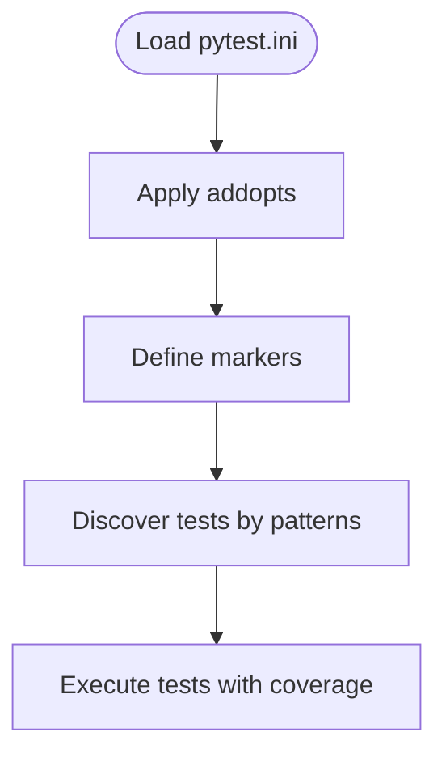

# Docker Test Configuration

<cite>
**Referenced Files in This Document**
- [Dockerfile.test](file://Dockerfile.test)
- [docker-compose.test.yml](file://docker-compose.test.yml)
- [pytest.ini](file://pytest.ini)
- [tests/docker/test_compose.py](file://tests/docker/test_compose.py)
- [scripts/smoke-test.sh](file://scripts/smoke-test.sh)
- [docker-compose.yml](file://docker-compose.yml)
- [docker-compose.override.yml](file://docker-compose.override.yml)
- [app/main.py](file://app/main.py)
- [app/core/config.py](file://app/core/config.py)
- [tests/integration/test_api_endpoints.py](file://tests/integration/test_api_endpoints.py)
- [tests/unit/test_models.py](file://tests/unit/test_models.py)
- [tests/e2e/admin.spec.ts](file://tests/e2e/admin.spec.ts)
</cite>

## Table of Contents
1. [Introduction](#introduction)
2. [Project Structure](#project-structure)
3. [Core Components](#core-components)
4. [Architecture Overview](#architecture-overview)
5. [Detailed Component Analysis](#detailed-component-analysis)
6. [Dependency Analysis](#dependency-analysis)
7. [Performance Considerations](#performance-considerations)
8. [Troubleshooting Guide](#troubleshooting-guide)
9. [Conclusion](#conclusion)

## Introduction
This document explains the Docker-based testing configuration for the project. It covers how the test environment is built and orchestrated, how tests are executed inside containers, and how to run smoke tests against the running stack. It also outlines the test categories and markers used to organize the test suite.

## Project Structure
The testing setup is centered around a dedicated test Docker Compose file and a minimal test Dockerfile that runs the Python test suite with coverage reporting. Additional orchestration files define the production-like stack used by smoke tests.

**Diagram sources**
- [Dockerfile.test](file://Dockerfile.test#L1-L8)
- [docker-compose.test.yml](file://docker-compose.test.yml#L1-L30)
- [pytest.ini](file://pytest.ini#L1-L19)
- [tests/docker/test_compose.py](file://tests/docker/test_compose.py#L1-L9)
- [scripts/smoke-test.sh](file://scripts/smoke-test.sh#L1-L28)
- [docker-compose.yml](file://docker-compose.yml#L1-L254)
- [docker-compose.override.yml](file://docker-compose.override.yml#L1-L32)

**Section sources**
- [Dockerfile.test](file://Dockerfile.test#L1-L8)
- [docker-compose.test.yml](file://docker-compose.test.yml#L1-L30)
- [pytest.ini](file://pytest.ini#L1-L19)
- [tests/docker/test_compose.py](file://tests/docker/test_compose.py#L1-L9)
- [scripts/smoke-test.sh](file://scripts/smoke-test.sh#L1-L28)
- [docker-compose.yml](file://docker-compose.yml#L1-L254)
- [docker-compose.override.yml](file://docker-compose.override.yml#L1-L32)

## Core Components
- Test Dockerfile: Builds a minimal Python image, installs dependencies, copies source, sets a testing flag, and runs pytest with coverage.
- Test Compose: Spins up a Postgres database, Redis, and a test app service configured for testing.
- Pytest configuration: Defines coverage reports, strict markers, and test discovery patterns.
- Docker test marker: A small test that verifies the presence of the test Compose file and can be skipped unless a specific environment variable is set.
- Smoke tests: A shell script that performs health checks against the production stack.

Key behaviors:
- The test app container runs pytest with coverage collection for the app module.
- The test Compose exposes ports for inspection and allows overriding host ports.
- The smoke test script validates health endpoints, database connectivity, Redis, and a public AR viewer route.

**Section sources**
- [Dockerfile.test](file://Dockerfile.test#L1-L8)
- [docker-compose.test.yml](file://docker-compose.test.yml#L1-L30)
- [pytest.ini](file://pytest.ini#L1-L19)
- [tests/docker/test_compose.py](file://tests/docker/test_compose.py#L1-L9)
- [scripts/smoke-test.sh](file://scripts/smoke-test.sh#L1-L28)

## Architecture Overview
The test architecture consists of a lightweight test container that executes the test suite against a transient Postgres and Redis backend. The smoke tests operate against the production Compose stack to validate end-to-end health.

**Diagram sources**
- [Dockerfile.test](file://Dockerfile.test#L1-L8)
- [docker-compose.test.yml](file://docker-compose.test.yml#L1-L30)
- [scripts/smoke-test.sh](file://scripts/smoke-test.sh#L1-L28)
- [docker-compose.yml](file://docker-compose.yml#L1-L254)
- [docker-compose.override.yml](file://docker-compose.override.yml#L1-L32)

## Detailed Component Analysis

### Test Dockerfile
- Purpose: Provides a minimal Python environment for running tests with coverage.
- Behavior:
  - Uses a slim Python base image.
  - Installs dependencies from requirements.txt.
  - Copies the repository into the image.
  - Sets an environment flag to indicate a testing context.
  - Runs pytest against the tests directory and generates coverage reports for the app module.

**Diagram sources**
- [Dockerfile.test](file://Dockerfile.test#L1-L8)

**Section sources**
- [Dockerfile.test](file://Dockerfile.test#L1-L8)

### Test Compose
- Purpose: Orchestrates a minimal test environment with Postgres and Redis, plus a test app service that runs the test suite.
- Behavior:
  - Starts a Postgres service with a dedicated test database and credentials.
  - Starts a Redis service.
  - Builds the test app service from the test Dockerfile.
  - Exposes ports for inspection and sets environment variables for database and Redis URLs.
  - Defines dependencies so the test app waits for backends to be ready.

**Diagram sources**
- [docker-compose.test.yml](file://docker-compose.test.yml#L1-L30)
- [Dockerfile.test](file://Dockerfile.test#L1-L8)

**Section sources**
- [docker-compose.test.yml](file://docker-compose.test.yml#L1-L30)

### Pytest Configuration
- Purpose: Centralizes pytest options, coverage reporting, and markers.
- Behavior:
  - Enables coverage for the app module with HTML, XML, and missing-line reports.
  - Adds verbosity and strict marker enforcement.
  - Configures asyncio mode for async tests.
  - Declares markers for unit, integration, e2e, slow, and docker tests.

**Diagram sources**
- [pytest.ini](file://pytest.ini#L1-L19)

**Section sources**
- [pytest.ini](file://pytest.ini#L1-L19)

### Docker Test Marker
- Purpose: Validates that the test Compose file exists and can be conditionally skipped unless a specific environment variable is set.
- Behavior:
  - Applies a docker marker to the test.
  - Skips the test unless DOCKER_TESTS is set to 1.

**Diagram sources**
- [tests/docker/test_compose.py](file://tests/docker/test_compose.py#L1-L9)

**Section sources**
- [tests/docker/test_compose.py](file://tests/docker/test_compose.py#L1-L9)

### Smoke Test Script
- Purpose: Validates the production stack health by hitting key endpoints and services.
- Behavior:
  - Checks the health status endpoint.
  - Verifies database connectivity via psql.
  - Verifies Redis connectivity via redis-cli.
  - Validates the AR viewer route.
  - Optionally tests admin API if an admin token is present.

**Diagram sources**
- [scripts/smoke-test.sh](file://scripts/smoke-test.sh#L1-L28)
- [docker-compose.yml](file://docker-compose.yml#L1-L254)
- [docker-compose.override.yml](file://docker-compose.override.yml#L1-L32)

**Section sources**
- [scripts/smoke-test.sh](file://scripts/smoke-test.sh#L1-L28)
- [docker-compose.yml](file://docker-compose.yml#L1-L254)
- [docker-compose.override.yml](file://docker-compose.override.yml#L1-L32)

### Test Categories and Coverage
- Unit tests: Validate model persistence and basic logic without external dependencies.
- Integration tests: Exercise API endpoints against the app under test.
- End-to-end tests: Validate user flows in the admin panel using Playwright.
- Docker tests: Verify the test Compose file and environment.

Coverage is configured to target the app module and produce XML and HTML reports.

**Section sources**
- [tests/unit/test_models.py](file://tests/unit/test_models.py#L1-L21)
- [tests/integration/test_api_endpoints.py](file://tests/integration/test_api_endpoints.py#L1-L25)
- [tests/e2e/admin.spec.ts](file://tests/e2e/admin.spec.ts#L1-L24)
- [pytest.ini](file://pytest.ini#L1-L19)

## Dependency Analysis
- Test app depends on:
  - Postgres for database operations.
  - Redis for caching and messaging.
  - Pytest and coverage for test execution and reporting.
- Smoke tests depend on:
  - The production Compose stack for real-world validation.
  - Override configuration for local port exposure.

**Diagram sources**
- [pytest.ini](file://pytest.ini#L1-L19)
- [Dockerfile.test](file://Dockerfile.test#L1-L8)
- [docker-compose.test.yml](file://docker-compose.test.yml#L1-L30)
- [scripts/smoke-test.sh](file://scripts/smoke-test.sh#L1-L28)
- [docker-compose.yml](file://docker-compose.yml#L1-L254)
- [docker-compose.override.yml](file://docker-compose.override.yml#L1-L32)

**Section sources**
- [pytest.ini](file://pytest.ini#L1-L19)
- [Dockerfile.test](file://Dockerfile.test#L1-L8)
- [docker-compose.test.yml](file://docker-compose.test.yml#L1-L30)
- [scripts/smoke-test.sh](file://scripts/smoke-test.sh#L1-L28)
- [docker-compose.yml](file://docker-compose.yml#L1-L254)
- [docker-compose.override.yml](file://docker-compose.override.yml#L1-L32)

## Performance Considerations
- Test runtime:
  - The test Dockerfile runs pytest with coverage; ensure dependencies are installed once to minimize rebuild time.
  - Use selective test markers to reduce runtime during development.
- Coverage:
  - Coverage reports are generated for the app module; keep the coverage scope aligned with the module under test.
- Compose startup:
  - The test app waits for Postgres and Redis readiness; ensure backends are healthy to avoid long timeouts.

[No sources needed since this section provides general guidance]

## Troubleshooting Guide
Common issues and resolutions:
- Test app fails to connect to Postgres or Redis:
  - Verify DATABASE_URL and REDIS_URL match the test Compose service names and ports.
  - Confirm the test app depends_on directives are satisfied.
- Pytest coverage not generated:
  - Ensure the test Dockerfile invokes pytest with coverage targets for the app module.
  - Confirm pytest.ini is loaded and coverage options are enabled.
- Docker test marker skipped:
  - Set DOCKER_TESTS=1 to enable the docker marker test.
- Smoke tests fail:
  - Check that the production stack is running and ports are exposed via override configuration.
  - Validate that the AR viewer route and admin API are reachable.

**Section sources**
- [docker-compose.test.yml](file://docker-compose.test.yml#L1-L30)
- [Dockerfile.test](file://Dockerfile.test#L1-L8)
- [pytest.ini](file://pytest.ini#L1-L19)
- [tests/docker/test_compose.py](file://tests/docker/test_compose.py#L1-L9)
- [scripts/smoke-test.sh](file://scripts/smoke-test.sh#L1-L28)
- [docker-compose.yml](file://docker-compose.yml#L1-L254)
- [docker-compose.override.yml](file://docker-compose.override.yml#L1-L32)

## Conclusion
The Docker-based testing configuration provides a reproducible environment for running unit, integration, and end-to-end tests, with coverage reporting and smoke tests validating the production stack. By leveraging the test Compose file and the test Dockerfile, developers can quickly execute the test suite and verify system health.