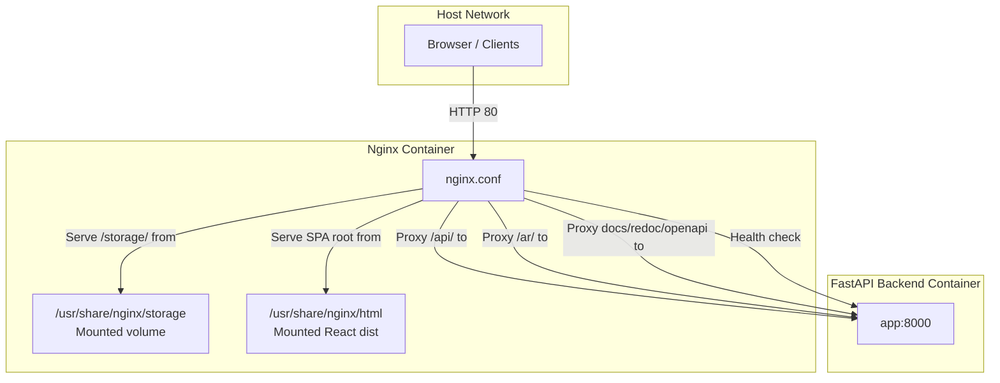
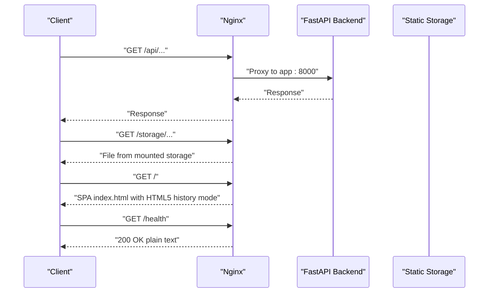
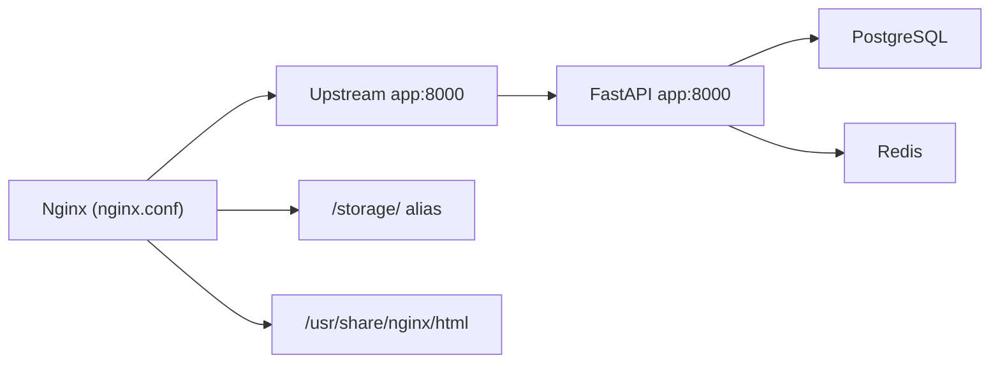

# Nginx Reverse Proxy Configuration

<cite>
**Referenced Files in This Document**
- [nginx.conf](file://nginx/nginx.conf)
- [docker-compose.yml](file://docker-compose.yml)
- [Dockerfile](file://Dockerfile)
- [main.py](file://app/main.py)
- [health.py](file://app/api/routes/health.py)
- [index.html](file://frontend/index.html)
</cite>

## Table of Contents
1. [Introduction](#introduction)
2. [Project Structure](#project-structure)
3. [Core Components](#core-components)
4. [Architecture Overview](#architecture-overview)
5. [Detailed Component Analysis](#detailed-component-analysis)
6. [Dependency Analysis](#dependency-analysis)
7. [Performance Considerations](#performance-considerations)
8. [Security Headers](#security-headers)
9. [HTTPS Configuration](#https-configuration)
10. [Troubleshooting Guide](#troubleshooting-guide)
11. [Conclusion](#conclusion)

## Introduction
This document explains the ARV platform’s Nginx reverse proxy configuration and how it integrates with the FastAPI backend and supporting services. It covers the events and http blocks, performance optimizations, gzip compression, rate limiting, upstream configuration, and routing for health checks, API endpoints, AR viewer, API documentation, static assets, and the React SPA admin panel. It also documents the security headers and provides practical guidance for enabling HTTPS in production.

## Project Structure
The Nginx reverse proxy is orchestrated as part of a Docker Compose stack that includes:
- Nginx container serving as the front door
- FastAPI backend container listening on port 8000
- Static storage volume mounted for QR codes, markers, and videos
- React SPA admin panel served from the Nginx HTML root

**Diagram sources**
- [nginx.conf](file://nginx/nginx.conf#L42-L117)
- [docker-compose.yml](file://docker-compose.yml#L155-L169)

**Section sources**
- [docker-compose.yml](file://docker-compose.yml#L155-L169)
- [nginx.conf](file://nginx/nginx.conf#L42-L117)

## Core Components
- Events block: Configures worker connections for concurrent client connections.
- HTTP block: Centralized performance, logging, compression, rate limiting, upstream, and server configuration.
- Upstream: Defines the FastAPI backend endpoint.
- Server block: Single HTTP server listening on port 80 with multiple location directives.

Key configuration highlights:
- Performance: sendfile, tcp_nopush, tcp_nodelay, keepalive_timeout, client_max_body_size.
- Compression: gzip enabled with selected content types.
- Rate limiting: Zones for API and uploads with burst behavior.
- Upstream: app:8000.
- Routing: /health, /api/, /ar/, /docs, /redoc, /openapi.json, /storage/, root SPA.

**Section sources**
- [nginx.conf](file://nginx/nginx.conf#L1-L117)

## Architecture Overview
Nginx acts as a reverse proxy and static asset server. Requests are routed based on URL prefixes to the FastAPI backend or static storage. Health checks and SPA routing are handled locally within the server block.

**Diagram sources**
- [nginx.conf](file://nginx/nginx.conf#L42-L117)
- [docker-compose.yml](file://docker-compose.yml#L155-L169)

## Detailed Component Analysis

### Events Block
- Purpose: Tune concurrency and connection handling.
- worker_connections: Controls the maximum number of simultaneous connections per worker process.

Implications:
- Higher values increase memory usage; adjust based on expected load and available resources.

**Section sources**
- [nginx.conf](file://nginx/nginx.conf#L1-L3)

### HTTP Block
- MIME types and default type: Ensures correct content-type handling.
- Logging: Custom main log format with remote address, request, status, body bytes, referer, user agent, and forwarded-for.
- Access and error logs: Separate files with appropriate levels.
- Performance settings:
  - sendfile on: Enables kernel-space file transfer optimization.
  - tcp_nopush on: Coalesces TCP packets for better throughput.
  - tcp_nodelay on: Disables Nagle’s algorithm for lower latency.
  - keepalive_timeout 65: Maintains persistent connections.
  - types_hash_max_size 2048: Hash table size for MIME types.
  - client_max_body_size 500M: Allows large file uploads.
- Gzip compression:
  - gzip on: Enables compression.
  - gzip_vary on: Adds Vary header for caches.
  - gzip_proxied any: Applies to proxied responses.
  - gzip_comp_level 6: Balanced compression level.
  - gzip_types: Selected text and JSON content types.
- Rate limiting zones:
  - api_limit: Per-IP zone with rate limit suitable for API traffic.
  - upload_limit: Per-IP zone with lower rate for uploads.

**Section sources**
- [nginx.conf](file://nginx/nginx.conf#L5-L36)

### Upstream Configuration
- Name: fastapi_backend
- Server: app:8000

Notes:
- The upstream name is referenced by proxy_pass in multiple locations.
- The backend container exposes port 8000 and is reachable via the Docker network.

**Section sources**
- [nginx.conf](file://nginx/nginx.conf#L37-L41)
- [Dockerfile](file://Dockerfile#L44-L53)

### Server Block (HTTP 80)
- listen 80: Listens on port 80.
- server_name _: Matches any host.
- Security headers: Applied to all responses in this server block.

**Section sources**
- [nginx.conf](file://nginx/nginx.conf#L42-L117)

### Location: /health
- Purpose: Health probe endpoint for monitoring and load balancers.
- Behavior: Returns 200 OK with plain text and disables access logging.
- Implication: Does not redirect to HTTPS; intended for lightweight probes.

**Section sources**
- [nginx.conf](file://nginx/nginx.conf#L47-L52)

### Location: /api/
- Purpose: API gateway to the FastAPI backend.
- Rate limiting: Uses api_limit zone with burst and nodelay.
- Proxy headers: Sets Host, X-Real-IP, X-Forwarded-For, X-Forwarded-Proto.
- Timeouts: Connect, send, and read timeouts configured for robustness.
- Implication: Protects backend from abuse while preserving user experience.

**Section sources**
- [nginx.conf](file://nginx/nginx.conf#L54-L68)

### Location: /ar/
- Purpose: Public AR viewer endpoint.
- Behavior: Proxies to FastAPI backend; sets standard proxy headers.

**Section sources**
- [nginx.conf](file://nginx/nginx.conf#L70-L77)

### Locations: /docs, /redoc, /openapi.json
- Purpose: API documentation and OpenAPI specification.
- Behavior: Proxies to FastAPI backend; sets Host header.

**Section sources**
- [nginx.conf](file://nginx/nginx.conf#L79-L93)

### Location: /storage/
- Purpose: Serve static files (QR codes, markers, videos).
- Behavior: Uses alias to mounted storage directory.
- Caching: 7-day expiration and immutable cache-control.
- Cross-origin: Allows any origin for static assets.

**Section sources**
- [nginx.conf](file://nginx/nginx.conf#L95-L101)
- [docker-compose.yml](file://docker-compose.yml#L158-L161)

### Root Location: /
- Purpose: React SPA admin panel.
- Behavior: Serves files from /usr/share/nginx/html with HTML5 history mode fallback.
- Caching: No-store, no-cache, must-revalidate headers to prevent stale content.

**Section sources**
- [nginx.conf](file://nginx/nginx.conf#L103-L109)
- [index.html](file://frontend/index.html#L1-L89)

### Security Headers
- X-Frame-Options: SAMEORIGIN
- X-Content-Type-Options: nosniff
- X-XSS-Protection: 1; mode=block
- Referrer-Policy: strict-origin-when-cross-origin

Implications:
- Prevent clickjacking, enforce safe content types, mitigate XSS, and control referrer leakage.

**Section sources**
- [nginx.conf](file://nginx/nginx.conf#L111-L116)

## Dependency Analysis
- Nginx depends on:
  - Mounted volumes for static content and SPA distribution.
  - FastAPI backend container reachable via app:8000.
- FastAPI backend depends on:
  - PostgreSQL and Redis services.
  - Health endpoints exposed for monitoring.

**Diagram sources**
- [nginx.conf](file://nginx/nginx.conf#L37-L41)
- [docker-compose.yml](file://docker-compose.yml#L155-L169)

**Section sources**
- [docker-compose.yml](file://docker-compose.yml#L61-L93)
- [nginx.conf](file://nginx/nginx.conf#L37-L41)

## Performance Considerations
- worker_connections: Adjust based on expected peak concurrent clients.
- sendfile, tcp_nopush, tcp_nodelay: Improve throughput and reduce latency for static and dynamic responses.
- keepalive_timeout: Balance resource usage vs. connection reuse benefits.
- gzip: Reduces bandwidth for text-based content; tune comp level and types as needed.
- client_max_body_size: Supports large uploads; ensure backend and storage can handle the payload.
- Upstream timeouts: Ensure they match backend processing characteristics.

[No sources needed since this section provides general guidance]

## Security Headers
- X-Frame-Options: Mitigates clickjacking by restricting embedding.
- X-Content-Type-Options: Prevents MIME sniffing.
- X-XSS-Protection: Enables XSS protection in legacy browsers.
- Referrer-Policy: Limits sensitive referrer data exposure.

These headers are applied globally within the server block.

**Section sources**
- [nginx.conf](file://nginx/nginx.conf#L111-L116)

## HTTPS Configuration
The current configuration listens on HTTP 80 only. To enable HTTPS in production:
- Add a new server block listening on port 443 with TLS enabled.
- Provide certificate and private key paths.
- Optionally redirect HTTP to HTTPS by adding a separate HTTP server block that returns 301/308 to https://$host$request_uri.
- Update volumes to mount SSL certificates into the Nginx container if using host-mounted files.
- Ensure the FastAPI backend remains at app:8000 and continues to be reachable from the Nginx container.

Example steps (descriptive, not code):
- Create or mount TLS certificate and key files into the Nginx container.
- Add a server block on port 443 with ssl_certificate and ssl_certificate_key.
- Enable ssl_protocols, ssl_ciphers, and ssl_prefer_server_ciphers as needed.
- Redirect HTTP to HTTPS using a separate HTTP server block returning a permanent redirect.

[No sources needed since this section provides general guidance]

## Troubleshooting Guide
Common issues and resolutions:
- 502/504 Gateway errors:
  - Verify the FastAPI container is healthy and reachable on app:8000.
  - Check proxy timeouts and backend processing time.
- Static files not loading:
  - Confirm the storage volume is mounted at /usr/share/nginx/storage and files exist.
  - Validate permissions and path correctness.
- SPA routing issues:
  - Ensure try_files $uri $uri/ /index.html is present and root points to /usr/share/nginx/html.
- Health check failures:
  - Confirm the backend health endpoint responds at /api/health/status.
  - Check Docker Compose healthcheck configuration for the app service.

**Section sources**
- [nginx.conf](file://nginx/nginx.conf#L47-L52)
- [docker-compose.yml](file://docker-compose.yml#L81-L85)
- [main.py](file://app/main.py#L219-L228)
- [health.py](file://app/api/routes/health.py#L36-L119)

## Conclusion
The Nginx configuration provides a robust reverse proxy for the ARV platform, balancing performance, security, and operational simplicity. It proxies API and AR viewer traffic to the FastAPI backend, serves static assets with caching, and hosts the React SPA admin panel. The configuration includes essential security headers and rate limiting to protect the backend. For production, enable HTTPS and consider additional hardening and monitoring.