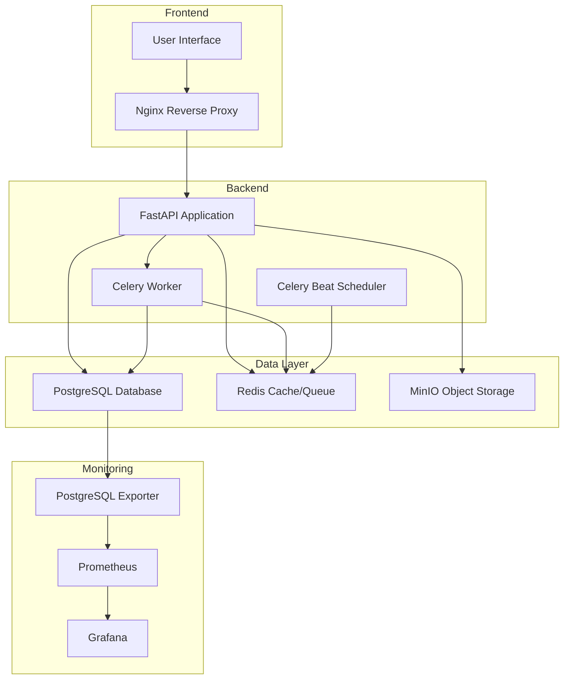
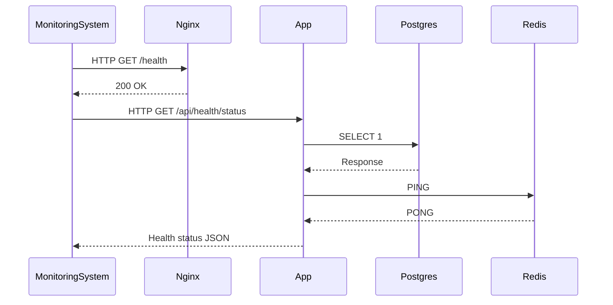
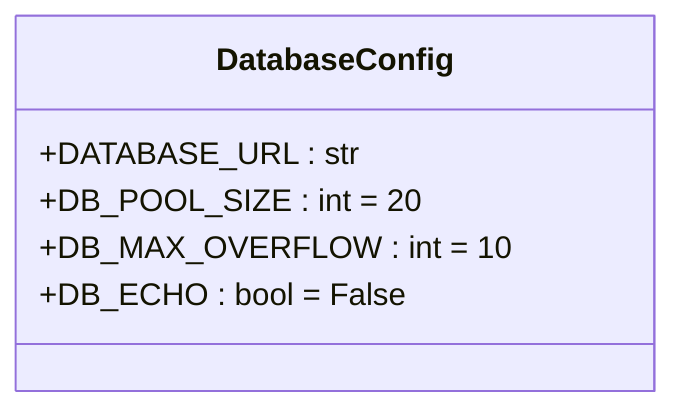
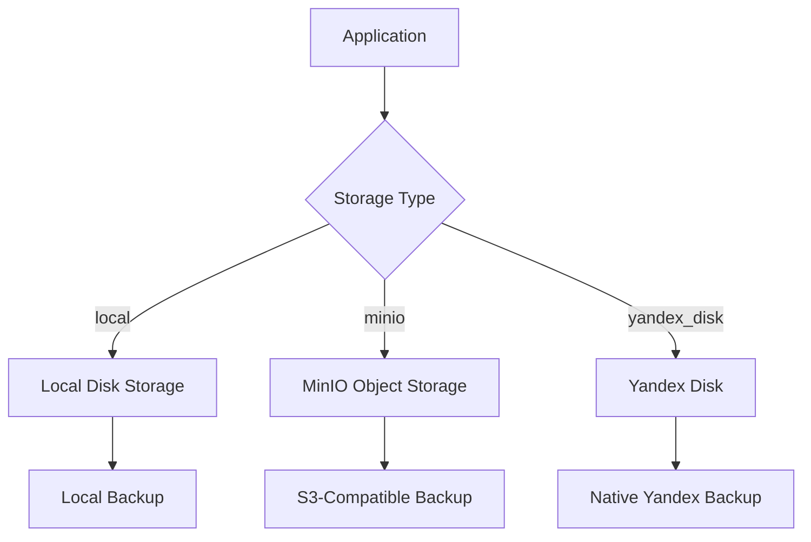
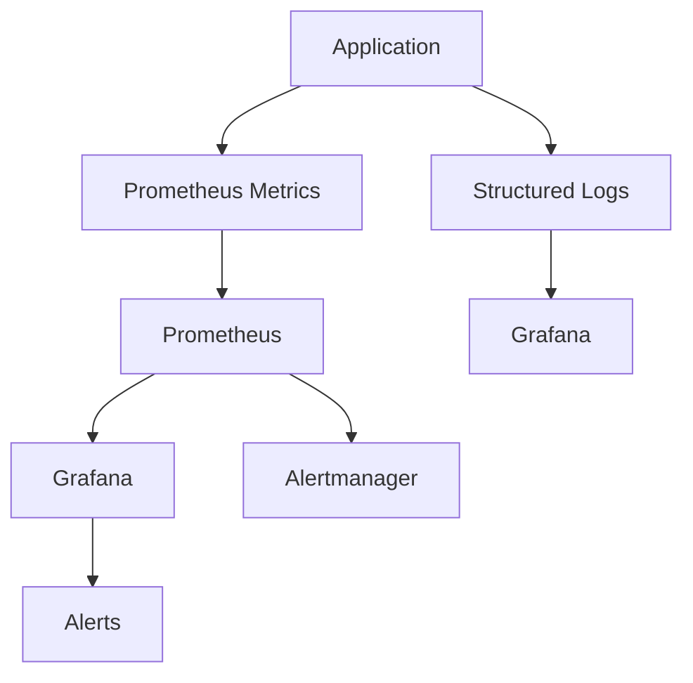
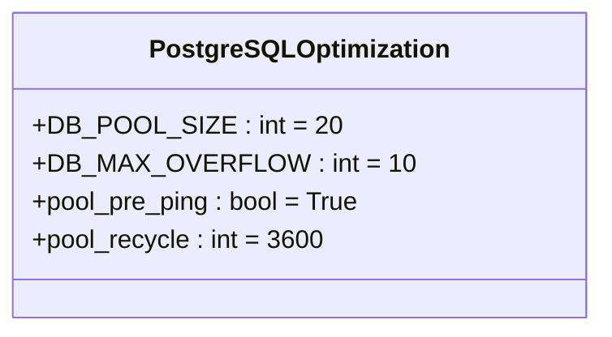
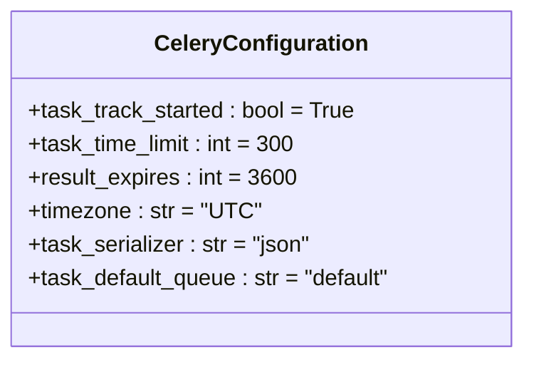
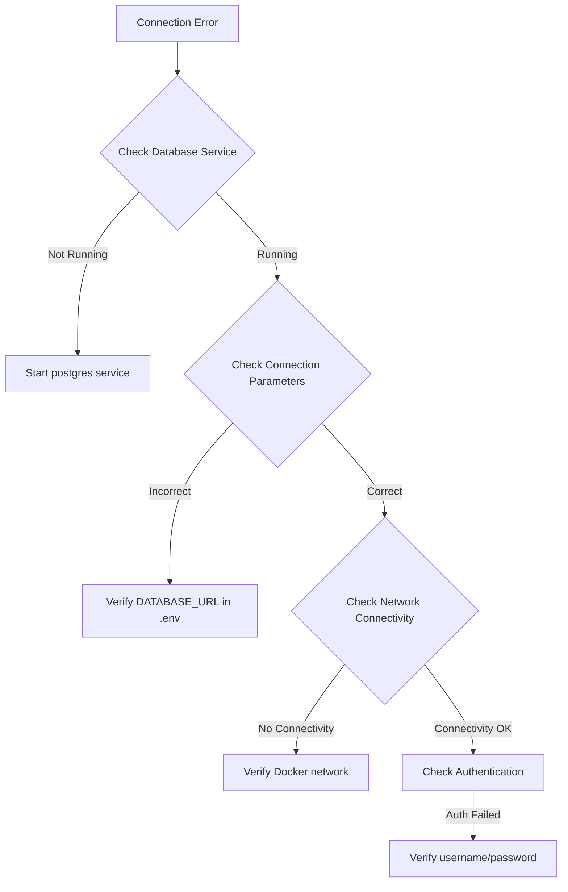

# Operations Runbook

<cite>
**Referenced Files in This Document**   
- [docker-compose.yml](file://docker-compose.yml)
- [docker-compose.override.yml](file://docker-compose.override.yml)
- [Dockerfile](file://Dockerfile)
- [nginx/nginx.conf](file://nginx/nginx.conf)
- [alembic.ini](file://alembic.ini)
- [app/core/config.py](file://app/core/config.py)
- [app/main.py](file://app/main.py)
- [app/tasks/celery_app.py](file://app/tasks/celery_app.py)
- [app/core/database.py](file://app/core/database.py)
- [app/api/routes/health.py](file://app/api/routes/health.py)
- [app/core/storage.py](file://app/core/storage.py)
- [requirements.txt](file://requirements.txt)
</cite>

## Table of Contents
1. [Introduction](#introduction)
2. [System Architecture](#system-architecture)
3. [Service Management](#service-management)
4. [Database Operations](#database-operations)
5. [Backup and Recovery](#backup-and-recovery)
6. [Monitoring and Logging](#monitoring-and-logging)
7. [Performance Tuning](#performance-tuning)
8. [Disaster Recovery](#disaster-recovery)
9. [Troubleshooting Guide](#troubleshooting-guide)
10. [Appendices](#appendices)

## Introduction
This operations runbook provides comprehensive procedures for managing the ARV platform. It covers routine maintenance, service management, backup and recovery, monitoring, performance tuning, and troubleshooting. The ARV platform is a B2B SaaS solution for creating augmented reality content based on image recognition, with a microservices architecture deployed via Docker Compose.

**Section sources**
- [docker-compose.yml](file://docker-compose.yml)

## System Architecture



**Diagram sources**
- [docker-compose.yml](file://docker-compose.yml)
- [nginx/nginx.conf](file://nginx/nginx.conf)

**Section sources**
- [docker-compose.yml](file://docker-compose.yml)
- [nginx/nginx.conf](file://nginx/nginx.conf)

## Service Management

### Service Overview
The ARV platform consists of multiple Docker containers managed through Docker Compose. The primary services include:
- **app**: FastAPI application server
- **celery-worker**: Background task processor
- **celery-beat**: Periodic task scheduler
- **postgres**: PostgreSQL database
- **redis**: Redis cache and message broker
- **minio**: Object storage service
- **nginx**: Web server and reverse proxy

### Starting and Stopping Services
To start all services:
```bash
docker-compose up -d
```

To stop all services:
```bash
docker-compose down
```

To restart all services:
```bash
docker-compose restart
```

### Managing Individual Services
To restart a specific service:
```bash
docker-compose restart [service_name]
```

Available service names: app, celery-worker, celery-beat, postgres, redis, minio, nginx.

### Service Health Checks
The system implements comprehensive health checks for all critical services:



**Diagram sources**
- [docker-compose.yml](file://docker-compose.yml)
- [app/api/routes/health.py](file://app/api/routes/health.py)

**Section sources**
- [docker-compose.yml](file://docker-compose.yml)
- [app/api/routes/health.py](file://app/api/routes/health.py)

## Database Operations

### Applying Database Migrations with Alembic
The ARV platform uses Alembic for database schema migrations. Follow these steps to apply migrations:

1. Ensure the database service is running:
```bash
docker-compose up -d postgres
```

2. Run Alembic migrations from the application container:
```bash
docker-compose exec app alembic upgrade head
```

3. To create a new migration:
```bash
docker-compose exec app alembic revision --autogenerate -m "description"
```

4. Check migration status:
```bash
docker-compose exec app alembic current
```

### Database Configuration
Key database configuration parameters are defined in the application settings:



**Diagram sources**
- [alembic.ini](file://alembic.ini)
- [app/core/config.py](file://app/core/config.py)
- [app/core/database.py](file://app/core/database.py)

**Section sources**
- [alembic.ini](file://alembic.ini)
- [app/core/config.py](file://app/core/config.py)
- [app/core/database.py](file://app/core/database.py)

## Backup and Recovery

### PostgreSQL Database Backup and Recovery
The platform includes automated PostgreSQL backup procedures.

#### Backup Procedure
The backup container automatically creates daily backups:
```bash
pg_dump -h postgres -U vertex_ar vertex_ar | gzip > /backups/postgresql/vertex_ar_$(date +%Y%m%d_%H%M).sql.gz
```

Manual backup:
```bash
docker-compose exec postgres pg_dump -U vertex_ar vertex_ar > backup.sql
```

#### Recovery Procedure
To restore from backup:
```bash
docker-compose exec -T postgres psql -U vertex_ar vertex_ar < backup.sql
```

### Storage Content Backup
The platform supports multiple storage backends with corresponding backup strategies.

#### Local File Storage
Local content is stored in `/app/storage/content` and mounted to the host. Back up this directory regularly:
```bash
tar -czf arv-storage-backup-$(date +%Y%m%d).tar.gz ./storage/content/
```

#### MinIO Backup
MinIO data is automatically synced to S3-compatible storage:
```bash
mc mirror minio/$MINIO_BUCKET_NAME s3/$BACKUP_S3_BUCKET/ --remove
```

#### Yandex Disk Integration
The platform supports Yandex Disk as a storage option through OAuth authentication.



**Diagram sources**
- [docker-compose.yml](file://docker-compose.yml)
- [app/core/storage.py](file://app/core/storage.py)
- [app/core/config.py](file://app/core/config.py)

**Section sources**
- [docker-compose.yml](file://docker-compose.yml)
- [app/core/storage.py](file://app/core/storage.py)
- [app/core/config.py](file://app/core/config.py)

## Monitoring and Logging

### Log File Locations and Analysis
Critical log files are located at:

- Nginx access log: `/var/log/nginx/access.log`
- Nginx error log: `/var/log/nginx/error.log`
- Application logs: Structured logging via structlog

#### Nginx Log Format
The custom log format includes:
```
$remote_addr - $remote_user [$time_local] "$request" $status $body_bytes_sent "$http_referer" "$http_user_agent" "$http_x_forwarded_for"
```

#### Log Analysis Commands
Monitor real-time Nginx access:
```bash
docker-compose exec nginx tail -f /var/log/nginx/access.log
```

Monitor application logs:
```bash
docker-compose logs -f app
```

### Monitoring Stack
The platform includes a comprehensive monitoring stack:



Key metrics to monitor:
- API request duration
- HTTP status codes
- Database connection pool usage
- Redis memory usage
- Celery queue length
- System CPU, memory, and disk usage

**Diagram sources**
- [docker-compose.yml](file://docker-compose.yml)
- [app/api/routes/health.py](file://app/api/routes/health.py)
- [app/main.py](file://app/main.py)

**Section sources**
- [docker-compose.yml](file://docker-compose.yml)
- [nginx/nginx.conf](file://nginx/nginx.conf)
- [app/api/routes/health.py](file://app/api/routes/health.py)

## Performance Tuning

### PostgreSQL Optimization
Key PostgreSQL configuration parameters:



Recommendations:
- Maintain adequate connection pool size based on application load
- Use connection recycling to prevent stale connections
- Enable query logging in development for performance analysis

### Redis Memory Management
Redis is configured with memory limits:
```
redis-server --maxmemory 256mb --maxmemory-policy allkeys-lru
```

Monitoring Redis memory usage:
```bash
docker-compose exec redis redis-cli info memory
```

### Celery Worker Configuration
Celery worker settings:



### Nginx Performance Settings
Key Nginx optimizations:
- `worker_connections 1024`
- `sendfile on`
- `tcp_nopush on`
- `tcp_nodelay on`
- `keepalive_timeout 65`
- Gzip compression enabled
- Rate limiting for API endpoints

### Horizontal Scaling
To scale services horizontally:

#### Scaling FastAPI App
Modify the command in docker-compose.yml to increase workers:
```yaml
command: uvicorn app.main:app --host 0.0.0.0 --port 8000 --workers 8
```

Or run multiple app containers:
```bash
docker-compose up -d --scale app=3
```

#### Scaling Celery Workers
Run multiple worker instances:
```bash
docker-compose up -d --scale celery-worker=3
```

Adjust concurrency per worker:
```bash
celery -A app.tasks.celery_app worker --loglevel=info --concurrency=4
```

**Diagram sources**
- [docker-compose.yml](file://docker-compose.yml)
- [app/core/config.py](file://app/core/config.py)
- [nginx/nginx.conf](file://nginx/nginx.conf)

**Section sources**
- [docker-compose.yml](file://docker-compose.yml)
- [app/core/config.py](file://app/core/config.py)
- [nginx/nginx.conf](file://nginx/nginx.conf)

## Disaster Recovery

### System Health Check Protocol
Regular health checks should be performed using the built-in health endpoint:

```bash
curl http://localhost/api/health/status
```

The response includes status for:
- Database connectivity
- Redis availability
- Celery worker status
- System resources (CPU, memory, disk)
- Recent marker generation failures

### Recovery Procedures
In case of system failure:

1. Verify service status:
```bash
docker-compose ps
```

2. Check logs for errors:
```bash
docker-compose logs --tail=100
```

3. Restart individual services as needed:
```bash
docker-compose restart [service_name]
```

4. Restore from backups if necessary (see Backup and Recovery section)

**Section sources**
- [app/api/routes/health.py](file://app/api/routes/health.py)
- [docker-compose.yml](file://docker-compose.yml)

## Troubleshooting Guide

### Database Connection Failures
Common symptoms and solutions:



### Redis Memory Exhaustion
Symptoms: Slow performance, connection timeouts.

Solutions:
- Monitor memory usage: `redis-cli info memory`
- Adjust maxmemory settings in docker-compose.yml
- Optimize application to reduce cache size
- Consider increasing container memory limit

### Celery Worker Crashes
Common causes and solutions:
- Check worker logs: `docker-compose logs celery-worker`
- Verify Redis connectivity
- Check task time limits in configuration
- Monitor system resources (CPU, memory)
- Review task code for exceptions

### Nginx Configuration Errors
Symptoms: 502 Bad Gateway, 504 Gateway Timeout.

Troubleshooting steps:
1. Test configuration:
```bash
docker-compose exec nginx nginx -t
```

2. Check upstream server availability
3. Verify proxy settings in nginx.conf
4. Review error logs: `/var/log/nginx/error.log`

**Section sources**
- [docker-compose.yml](file://docker-compose.yml)
- [nginx/nginx.conf](file://nginx/nginx.conf)
- [app/api/routes/health.py](file://app/api/routes/health.py)
- [app/tasks/celery_app.py](file://app/tasks/celery_app.py)

## Conclusion
This operations runbook provides comprehensive guidance for managing the ARV platform. By following these procedures, operations teams can ensure high availability, performance, and reliability of the system. Regular monitoring, proactive maintenance, and adherence to backup procedures are essential for maintaining a stable production environment.