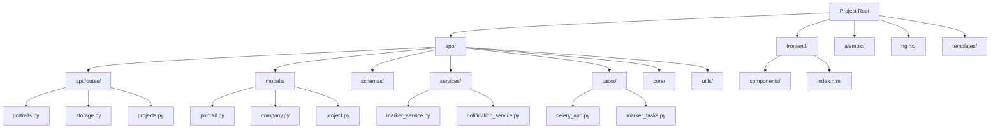
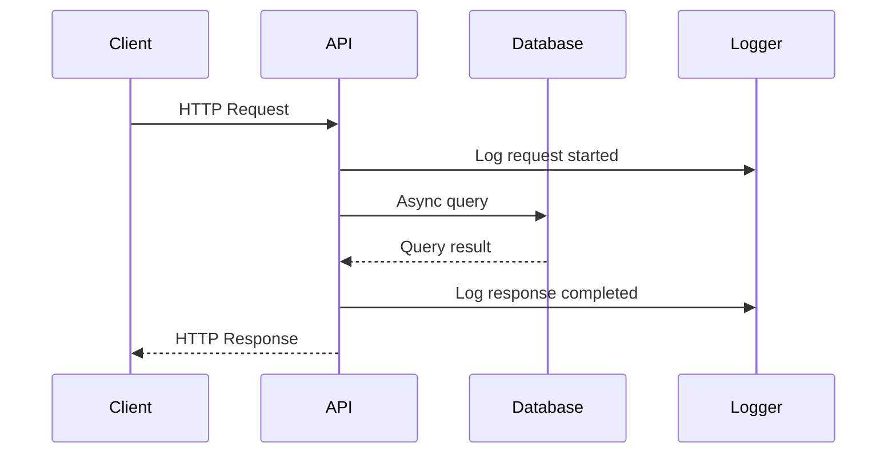
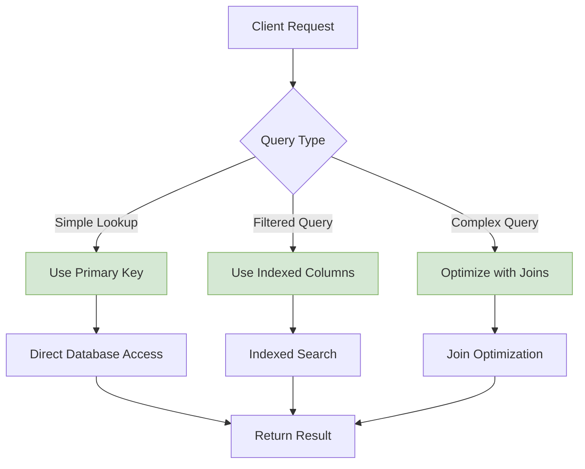
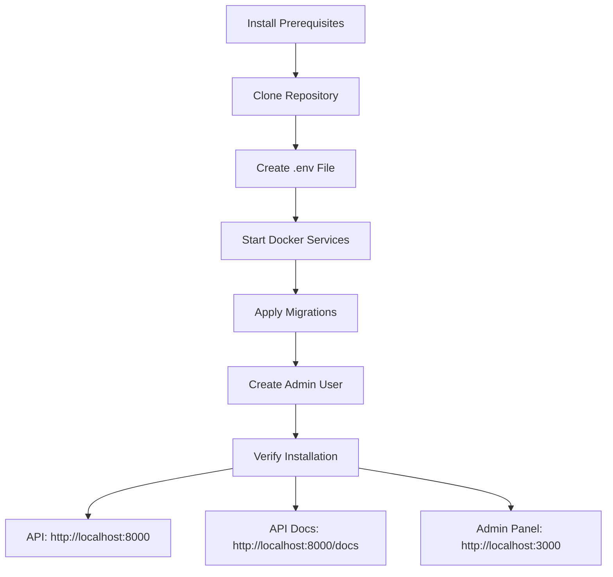
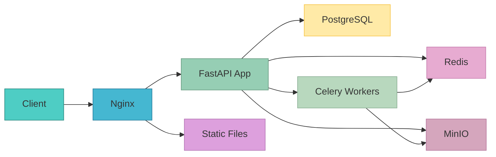

# Developer Guide

<cite>
**Referenced Files in This Document**   
- [README.md](file://README.md)
- [main.py](file://app/main.py)
- [config.py](file://app/core/config.py)
- [database.py](file://app/core/database.py)
- [celery_app.py](file://app/tasks/celery_app.py)
- [marker_service.py](file://app/services/marker_service.py)
- [portraits.py](file://app/api/routes/portraits.py)
- [portrait.py](file://app/models/portrait.py)
- [Dockerfile](file://Dockerfile)
- [docker-compose.yml](file://docker-compose.yml)
- [requirements.txt](file://requirements.txt)
- [PHASE1_SUMMARY.md](file://PHASE1_SUMMARY.md)
- [frontend/index.html](file://frontend/index.html)
</cite>

## Table of Contents
1. [Introduction](#introduction)
2. [Code Style Guidelines](#code-style-guidelines)
3. [Contribution Workflow](#contribution-workflow)
4. [Debugging Tips](#debugging-tips)
5. [Performance Optimization](#performance-optimization)
6. [Onboarding Guide](#onboarding-guide)
7. [Common Development Tasks](#common-development-tasks)
8. [Troubleshooting Scenarios](#troubleshooting-scenarios)

## Introduction
This developer guide provides comprehensive documentation for the ARV platform development workflow. The ARV platform is a B2B SaaS solution for creating AR content based on image recognition (NFT markers) using FastAPI, React, and Mind AR technologies. This guide covers code style guidelines, contribution workflows, debugging strategies, performance optimization techniques, onboarding procedures, and practical examples for common development tasks and troubleshooting scenarios.

**Section sources**
- [README.md](file://README.md)
- [PHASE1_SUMMARY.md](file://PHASE1_SUMMARY.md)

## Code Style Guidelines

### Python Formatting (PEP 8)
The ARV platform follows PEP 8 guidelines for Python code with specific project conventions. Code should maintain consistent indentation (4 spaces), proper spacing around operators, and meaningful variable names. The project uses Black for code formatting and Flake8 for linting, ensuring consistent code style across the codebase. Type hints are mandatory for all function parameters and return values to enhance code readability and maintainability.

The backend utilizes Pydantic for data validation and settings management, with configuration centralized in the `config.py` file. Structured logging with structlog is implemented throughout the application, providing contextual information for debugging and monitoring. Async/await patterns are used extensively for database operations and I/O-bound tasks, leveraging SQLAlchemy 2.0's async capabilities.

**Section sources**
- [main.py](file://app/main.py#L1-L266)
- [config.py](file://app/core/config.py#L1-L134)
- [requirements.txt](file://requirements.txt#L23-L25)

### TypeScript Conventions
The frontend codebase follows TypeScript best practices with strict type checking enabled. Components are organized in the `frontend/components` directory with descriptive filenames ending in `.tsx`. The project uses React 18 with functional components and hooks, Material-UI 5 for UI components, and TailwindCSS for utility-first styling.

TypeScript interfaces are defined for all data structures, and API responses are validated using type guards. The codebase follows React best practices including proper state management, memoization of expensive computations, and avoidance of unnecessary re-renders through component memoization.

**Section sources**
- [frontend/index.html](file://frontend/index.html#L1-L89)
- [frontend/components/CompanyForm.tsx](file://frontend/components/CompanyForm.tsx)
- [frontend/components/YandexDiskAuth.tsx](file://frontend/components/YandexDiskAuth.tsx)

### File Organization
The project follows a feature-based organization structure with clear separation of concerns. The backend is organized into core modules including `api`, `models`, `schemas`, `services`, `tasks`, and `utils`. Each module has a specific responsibility:

- `api/routes`: FastAPI route handlers grouped by resource
- `models`: SQLAlchemy database models
- `schemas`: Pydantic data transfer objects
- `services`: Business logic implementations
- `tasks`: Celery background tasks
- `core`: Application configuration and infrastructure

The frontend components are organized by feature in the `components` directory, with each component having its own file. The `index.html` serves as the entry point for the React application, currently displaying a placeholder page until the admin panel is fully developed.



**Diagram sources**
- [app/api/routes/portraits.py](file://app/api/routes/portraits.py#L1-L116)
- [app/models/portrait.py](file://app/models/portrait.py#L1-L28)
- [app/services/marker_service.py](file://app/services/marker_service.py#L1-L134)

**Section sources**
- [README.md](file://README.md#L38-L57)
- [PHASE1_SUMMARY.md](file://PHASE1_SUMMARY.md#L72-L129)

## Contribution Workflow

### Branching Strategy
The ARV platform follows a Git branching model with three main branches: `main`, `develop`, and feature branches. The `main` branch contains production-ready code with protected status requiring pull request reviews and passing CI checks. The `develop` branch serves as the integration branch for features being prepared for release.

Feature development occurs in feature branches created from `develop` with descriptive names following the pattern `feature/descriptive-name` or `bugfix/descriptive-name`. When a feature is complete, a pull request is created from the feature branch to `develop`. After testing and review, features are merged into `develop` and eventually into `main` during release cycles.

Hotfixes for production issues are created from `main` using the `hotfix/` prefix and follow an expedited review process before being merged back into both `main` and `develop` to ensure consistency.

**Section sources**
- [README.md](file://README.md#L78-L109)

### Pull Request Process
Pull requests must include a clear description of the changes, references to related issues, and any necessary testing instructions. Each PR requires at least one approval from a team member with relevant domain knowledge. The CI pipeline automatically runs tests, linting, and type checking on all PRs.

PR descriptions should follow a template including:
- Summary of changes
- Related issue numbers
- Testing steps
- Screenshots (for frontend changes)
- Any special deployment considerations

Large changes should be broken into smaller, focused PRs when possible to facilitate thorough review. PRs should be kept open for at least 24 hours to allow for team review unless marked as urgent for critical fixes.

**Section sources**
- [README.md](file://README.md#L100-L108)

### Code Review Standards
Code reviews focus on code quality, adherence to style guidelines, proper error handling, security considerations, and test coverage. Reviewers should check for:
- Proper use of async/await patterns
- Appropriate error handling and logging
- Security vulnerabilities (SQL injection, XSS, etc.)
- Performance implications
- Test coverage for new functionality
- Documentation updates

Reviewers are expected to provide constructive feedback and suggest improvements while recognizing different approaches to problem-solving. The goal is to maintain high code quality while fostering a collaborative development environment.

**Section sources**
- [main.py](file://app/main.py#L144-L209)
- [marker_service.py](file://app/services/marker_service.py#L1-L134)

## Debugging Tips

### FastAPI Backend Issues
Common issues in the FastAPI backend often relate to database connections, async operation handling, or configuration problems. When debugging API endpoints, check the structured logs in JSON format which include request/response information, duration metrics, and contextual data.

For database-related issues, verify the connection settings in `.env` and ensure the PostgreSQL service is running. Use the health check endpoint `/api/health/status` to verify service connectivity. When dealing with async database operations, ensure proper session management and exception handling in the `get_db()` dependency.



**Diagram sources**
- [main.py](file://app/main.py#L108-L141)
- [database.py](file://app/core/database.py#L30-L45)

**Section sources**
- [main.py](file://app/main.py#L108-L141)
- [database.py](file://app/core/database.py#L30-L45)

### Celery Task Problems
Celery task issues typically involve broker connectivity, task serialization, or worker configuration. Check that Redis is running and accessible from the Celery worker container. Verify the broker URL configuration in `.env` matches the Redis service in `docker-compose.yml`.

When tasks fail to execute, check the worker logs for import errors or dependency issues. Ensure that all task modules are properly registered in the Celery app configuration. For periodic tasks managed by Celery Beat, verify the schedule configuration in `celery_app.py` and ensure the beat service is running.

Common debugging steps:
1. Check Redis connectivity: `redis-cli ping`
2. Verify task registration: `celery -A app.tasks.celery_app inspect registered`
3. Monitor task execution: `celery -A app.tasks.celery_app events -l INFO`
4. Check worker logs: `docker compose logs celery-worker`

**Section sources**
- [celery_app.py](file://app/tasks/celery_app.py#L1-L50)
- [docker-compose.yml](file://docker-compose.yml#L89-L134)

### Frontend Integration Challenges
Frontend integration issues often stem from API endpoint changes, CORS configuration, or authentication token handling. The current frontend is a placeholder with limited functionality, but when developing the React admin panel, ensure proper API URL configuration and handle authentication tokens appropriately.

Debugging tools include browser developer tools to inspect network requests, console logs, and React component state. Use the API documentation at `/docs` to verify endpoint signatures and response formats. When integrating with the AR viewer, ensure proper handling of the unique ID parameter and verify that the template files are correctly served by Nginx.

**Section sources**
- [frontend/index.html](file://frontend/index.html#L1-L89)
- [main.py](file://app/main.py#L98-L105)

## Performance Optimization

### Database Query Efficiency
Database performance is critical for the ARV platform, especially with large media files and marker data. The application uses SQLAlchemy 2.0's async capabilities to prevent blocking operations. Connection pooling is configured with a pool size of 20 and max overflow of 10 to handle concurrent requests efficiently.

To optimize queries:
- Use `selectinload` or `joinedload` for eager loading when related data is needed
- Implement proper indexing on frequently queried columns
- Use `async_session.scalars()` and `async_session.execute()` appropriately
- Consider using `yield_per()` for large result sets
- Avoid N+1 query problems by loading related data in the initial query

The `portrait` model includes indexes on `unique_id` and `marker_status` to optimize lookups by these common query parameters.



**Diagram sources**
- [portrait.py](file://app/models/portrait.py#L1-L28)
- [database.py](file://app/core/database.py#L8-L15)

**Section sources**
- [database.py](file://app/core/database.py#L8-L15)
- [portrait.py](file://app/models/portrait.py#L1-L28)

### API Response Optimization
API performance is enhanced through several strategies. The application uses Uvicorn with 4 worker processes to handle concurrent requests efficiently. Request/response logging includes duration metrics to identify slow endpoints.

Response optimization techniques include:
- Using Pydantic models for efficient serialization
- Implementing proper caching strategies through Redis
- Compressing responses when appropriate
- Using streaming responses for large file downloads
- Minimizing payload size by including only necessary fields

The structured logging middleware captures request duration for monitoring and optimization purposes, with metrics exposed for Prometheus monitoring.

**Section sources**
- [main.py](file://app/main.py#L108-L141)
- [config.py](file://app/core/config.py#L101-L103)

### Background Processing Efficiency
Background task performance is managed through Celery's queue system with multiple worker processes. The configuration includes three dedicated queues: `markers`, `notifications`, and `default`, allowing for prioritization of resource-intensive tasks like marker generation.

Performance optimizations include:
- Configuring appropriate concurrency levels (2 workers)
- Setting task time limits (300 seconds) to prevent hanging tasks
- Using Redis as both broker and result backend for fast message passing
- Implementing proper error handling and retry logic
- Monitoring task execution through structured logs

The marker generation process runs in the background to avoid blocking API responses, with status updates available through the API.

**Section sources**
- [celery_app.py](file://app/tasks/celery_app.py#L1-L50)
- [marker_service.py](file://app/services/marker_service.py#L1-L134)

## Onboarding Guide

### Environment Setup
New developers should follow these steps to set up their development environment:

1. Install Docker Desktop (Windows) or Docker + Docker Compose (Linux)
2. For Windows, install WSL2 for better performance
3. Clone the repository: `git clone <repository-url>`
4. Create `.env` file: `cp .env.example .env`
5. Start all services: `docker compose up -d`
6. Apply database migrations: `docker compose exec app alembic upgrade head`
7. Create first administrator: `docker compose exec app python scripts/create_first_admin.py`

The Docker-based setup ensures consistency across development environments and eliminates dependency conflicts. The `docker-compose.override.yml` file provides development-specific overrides including hot reloading for faster development cycles.



**Diagram sources**
- [README.md](file://README.md#L15-L35)
- [docker-compose.yml](file://docker-compose.yml#L1-L163)

**Section sources**
- [README.md](file://README.md#L7-L35)
- [Dockerfile](file://Dockerfile#L1-L53)

### Codebase Navigation
The ARV platform codebase is organized into logical modules that correspond to architectural layers. Key entry points include:

- `app/main.py`: FastAPI application initialization and configuration
- `app/core/config.py`: Centralized application settings
- `app/api/routes/`: API endpoint implementations
- `app/models/`: Database schema definitions
- `app/services/`: Business logic components
- `app/tasks/`: Background task definitions

When navigating the codebase, start with the API routes to understand the available endpoints, then examine the corresponding service implementations for business logic, and finally review the models for data structure definitions. The `requirements.txt` file lists all Python dependencies with pinned versions for reproducible builds.

**Section sources**
- [README.md](file://README.md#L40-L57)
- [main.py](file://app/main.py#L85-L266)

### Key Architectural Concepts
The ARV platform follows a modern microservices-inspired architecture with several key components:

- **FastAPI Backend**: Async Python framework for API endpoints
- **PostgreSQL Database**: Relational storage for application data
- **Redis**: Cache and message broker for Celery tasks
- **MinIO**: Object storage for media files and AR markers
- **Celery**: Distributed task queue for background processing
- **Nginx**: Reverse proxy and static file server

The architecture emphasizes separation of concerns, with clear boundaries between components. The application uses async/await patterns throughout to maximize I/O efficiency, particularly for database operations and external service calls.

Security is implemented through JWT authentication (to be implemented in Phase 2), CORS configuration, and environment variable management. Monitoring is supported through Prometheus metrics, structured logging, and health check endpoints.



**Diagram sources**
- [docker-compose.yml](file://docker-compose.yml#L1-L163)
- [main.py](file://app/main.py#L85-L266)

**Section sources**
- [README.md](file://README.md#L60-L67)
- [docker-compose.yml](file://docker-compose.yml#L1-L163)

## Common Development Tasks

### Adding a New API Endpoint
To add a new API endpoint, follow these steps:

1. Create a new Python file in `app/api/routes/` for the resource
2. Define the route handler functions using FastAPI's `APIRouter`
3. Implement business logic in the corresponding service module
4. Define Pydantic schemas in `app/schemas/` for request/response types
5. Create SQLAlchemy models in `app/models/` if new database entities are needed
6. Register the router in `app/main.py`
7. Write tests in the `tests/` directory

Example structure for a new endpoint:
```python
# app/api/routes/new_resource.py
from fastapi import APIRouter, Depends
from sqlalchemy.ext.asyncio import AsyncSession
from app.core.database import get_db

router = APIRouter()

@router.get("/new-resource")
async def get_new_resource(db: AsyncSession = Depends(get_db)):
    # Implementation here
    pass
```

**Section sources**
- [portraits.py](file://app/api/routes/portraits.py#L1-L116)
- [main.py](file://app/main.py#L231-L259)

### Implementing a Background Task
To implement a new background task:

1. Define the task function in the appropriate module in `app/tasks/`
2. Decorate with `@celery_app.task` decorator
3. Ensure the task module is included in the Celery app configuration
4. Call the task from the relevant service or API endpoint using `.delay()`
5. Handle task results and error conditions appropriately

Example task implementation:
```python
# app/tasks/new_tasks.py
from app.tasks.celery_app import celery_app

@celery_app.task
def process_background_job(job_id):
    # Implementation here
    pass
```

**Section sources**
- [celery_app.py](file://app/tasks/celery_app.py#L1-L50)
- [marker_service.py](file://app/services/marker_service.py#L13-L134)

### Creating Database Migrations
Database migrations are managed using Alembic. To create a new migration:

1. Make changes to SQLAlchemy models in `app/models/`
2. Generate migration: `docker compose exec app alembic revision --autogenerate -m "description"`
3. Review the generated migration file in `alembic/versions/`
4. Apply migration: `docker compose exec app alembic upgrade head`
5. Test the changes in the application

The migration system supports async operations and is configured in `alembic/env.py` to work with the application's async database engine.

**Section sources**
- [database.py](file://app/core/database.py#L48-L52)
- [PHASE1_SUMMARY.md](file://PHASE1_SUMMARY.md#L37-L41)

## Troubleshooting Scenarios

### Service Startup Failures
When services fail to start, check the following:

1. Verify Docker is running and has sufficient resources
2. Check logs for specific error messages: `docker compose logs <service>`
3. Ensure port conflicts are not occurring (8000, 5432, 6379, etc.)
4. Verify `.env` file exists and has correct values
5. Check file permissions, especially for volume-mounted directories

Common solutions:
- Restart Docker service
- Clear Docker volumes if database corruption is suspected
- Verify network connectivity between containers
- Check disk space availability

**Section sources**
- [docker-compose.yml](file://docker-compose.yml#L1-L163)
- [Dockerfile](file://Dockerfile#L1-L53)

### Database Connection Issues
For database connection problems:

1. Verify PostgreSQL service is healthy: `docker compose exec postgres pg_isready`
2. Check connection string in `.env` matches service configuration
3. Ensure database credentials are correct
4. Verify network connectivity between app and postgres containers
5. Check if migrations need to be applied

Use the application's health check endpoint to verify database connectivity. If issues persist, examine the structured logs for detailed error information.

**Section sources**
- [database.py](file://app/core/database.py#L8-L15)
- [config.py](file://app/core/config.py#L38-L44)

### Celery Task Execution Problems
When Celery tasks fail to execute:

1. Check if Redis is running and accessible
2. Verify Celery worker and beat services are running
3. Examine task logs for import errors or exceptions
4. Ensure task modules are properly registered
5. Check for serialization issues with task arguments

Use Celery's inspection commands to debug task issues:
```bash
# List active workers
celery -A app.tasks.celery_app inspect active

# List registered tasks
celery -A app.tasks.celery_app inspect registered

# Show statistics
celery -A app.tasks.celery_app inspect stats
```

**Section sources**
- [celery_app.py](file://app/tasks/celery_app.py#L1-L50)
- [docker-compose.yml](file://docker-compose.yml#L89-L134)