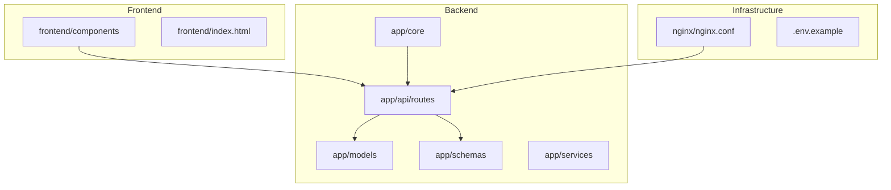
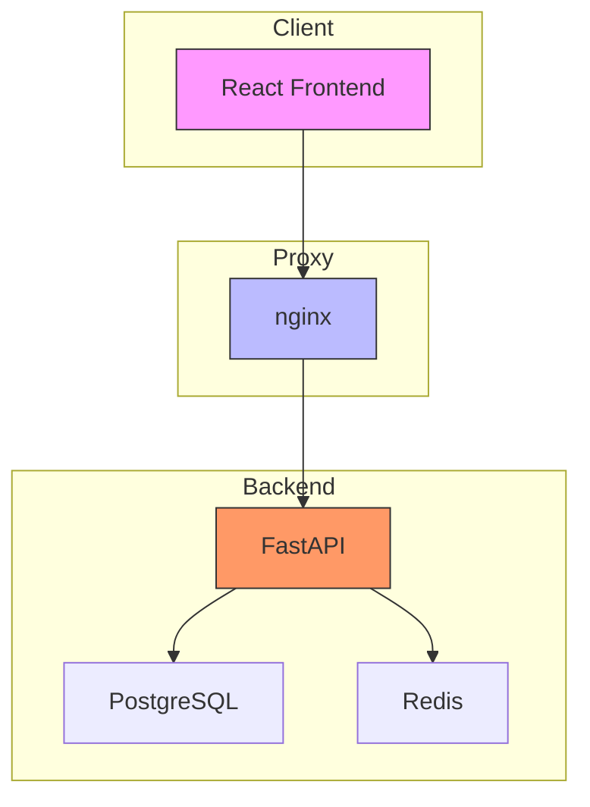
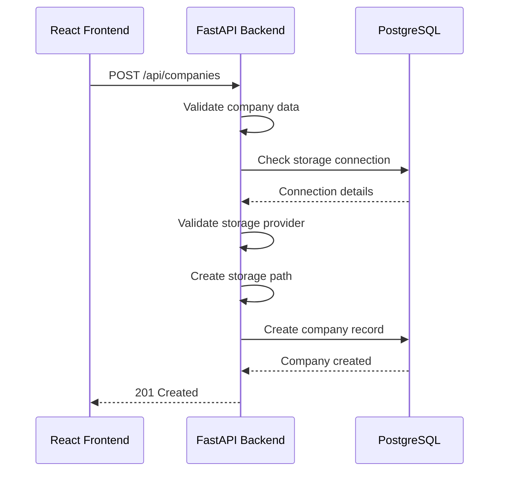
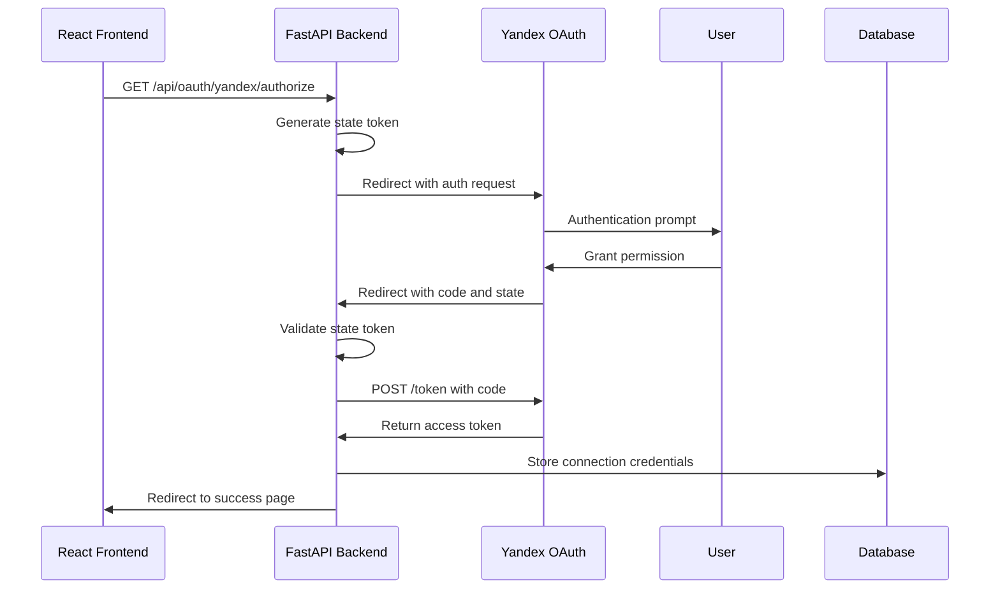
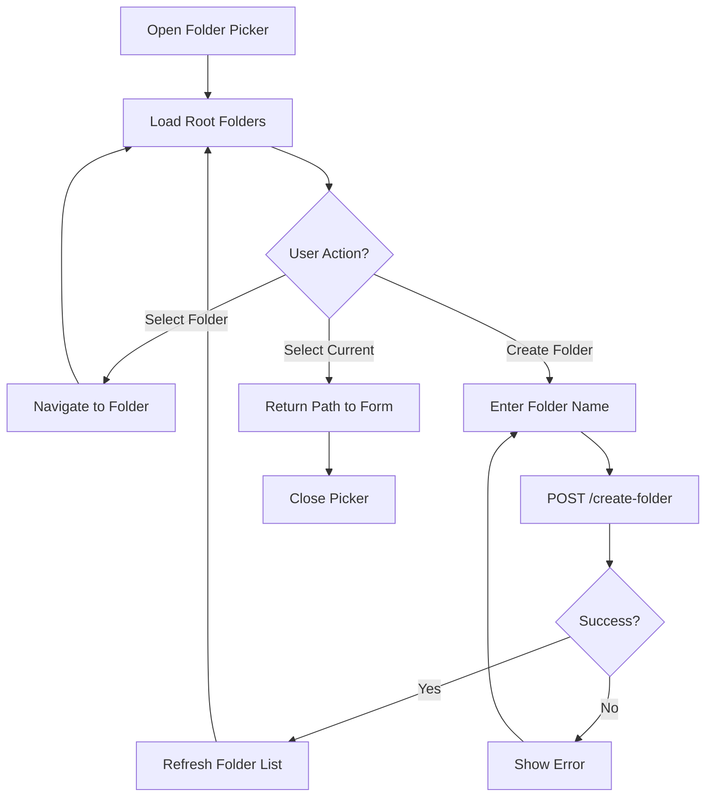
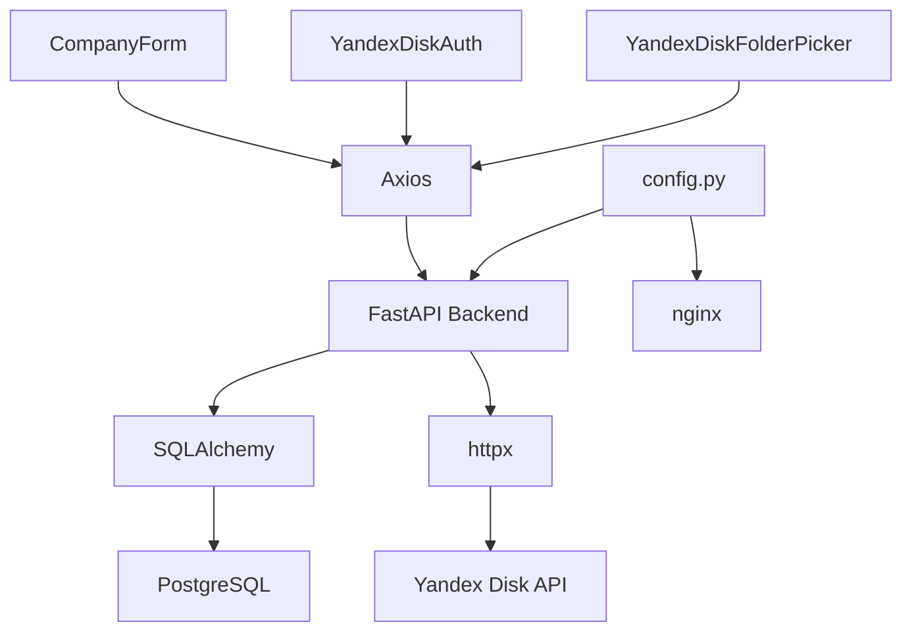

# API Integration

<cite>
**Referenced Files in This Document**   
- [companies.py](file://app/api/routes/companies.py)
- [storage.py](file://app/api/routes/storage.py)
- [oauth.py](file://app/api/routes/oauth.py)
- [CompanyForm.tsx](file://frontend/components/CompanyForm.tsx)
- [YandexDiskAuth.tsx](file://frontend/components/YandexDiskAuth.tsx)
- [YandexDiskFolderPicker.tsx](file://frontend/components/YandexDiskFolderPicker.tsx)
- [main.py](file://app/main.py)
- [config.py](file://app/core/config.py)
- [nginx.conf](file://nginx/nginx.conf)
</cite>

## Table of Contents
1. [Introduction](#introduction)
2. [Project Structure](#project-structure)
3. [Core Components](#core-components)
4. [Architecture Overview](#architecture-overview)
5. [Detailed Component Analysis](#detailed-component-analysis)
6. [Dependency Analysis](#dependency-analysis)
7. [Performance Considerations](#performance-considerations)
8. [Troubleshooting Guide](#troubleshooting-guide)
9. [Conclusion](#conclusion)

## Introduction
This document provides comprehensive documentation for frontend-backend API integration in the ARV system. It details how the React frontend communicates with the FastAPI backend through RESTful endpoints for company creation, storage configuration, and authentication. The integration with OAuth 2.0 for Yandex Disk authentication is thoroughly explained, covering redirect flows, token exchange, and secure storage of credentials. The document also addresses CORS configuration, authentication headers, and CSRF protection mechanisms.

## Project Structure
The ARV system follows a modular structure with clear separation between frontend and backend components. The backend is built with FastAPI and organized into routes, models, schemas, services, and core utilities. The frontend is a React application with components for company management and Yandex Disk integration. Configuration is centralized in environment files and settings modules.

**Diagram sources**
- [main.py](file://app/main.py#L230-L267)
- [app](file://app#L1-L1)

**Section sources**
- [app](file://app#L1-L1)
- [frontend](file://frontend#L1-L1)
- [nginx](file://nginx#L1-L1)

## Core Components
The core components of the API integration include company creation, storage configuration, and OAuth 2.0 authentication with Yandex Disk. The React frontend components (CompanyForm, YandexDiskAuth, YandexDiskFolderPicker) interact with FastAPI endpoints to manage company data and storage connections. The backend implements RESTful APIs with proper validation, error handling, and security measures.

**Section sources**
- [companies.py](file://app/api/routes/companies.py#L1-L137)
- [storage.py](file://app/api/routes/storage.py#L1-L63)
- [oauth.py](file://app/api/routes/oauth.py#L1-L184)
- [CompanyForm.tsx](file://frontend/components/CompanyForm.tsx#L1-L125)

## Architecture Overview
The ARV system architecture follows a clean separation between frontend and backend with well-defined API contracts. The React frontend communicates with the FastAPI backend through RESTful endpoints, with nginx serving as a reverse proxy and handling static files. Authentication is managed through OAuth 2.0 for external services like Yandex Disk, while internal authentication mechanisms handle user sessions.

**Diagram sources**
- [main.py](file://app/main.py#L98-L105)
- [nginx.conf](file://nginx/nginx.conf#L54-L68)
- [config.py](file://app/core/config.py#L45-L48)

## Detailed Component Analysis

### Company Creation Flow
The company creation process involves form submission from the React frontend to the FastAPI backend, with validation and storage configuration. The CompanyForm component collects company details and storage preferences, then submits them to the /api/companies endpoint.

**Diagram sources**
- [companies.py](file://app/api/routes/companies.py#L15-L88)
- [CompanyForm.tsx](file://frontend/components/CompanyForm.tsx#L35-L53)

**Section sources**
- [companies.py](file://app/api/routes/companies.py#L1-L137)
- [CompanyForm.tsx](file://frontend/components/CompanyForm.tsx#L1-L125)

### Yandex Disk OAuth Integration
The OAuth 2.0 integration with Yandex Disk follows the authorization code flow with CSRF protection. The YandexDiskAuth component initiates the OAuth flow, which redirects to Yandex for user authentication, then returns to the callback endpoint to exchange the authorization code for an access token.

**Diagram sources**
- [oauth.py](file://app/api/routes/oauth.py#L19-L106)
- [YandexDiskAuth.tsx](file://frontend/components/YandexDiskAuth.tsx#L27-L53)

**Section sources**
- [oauth.py](file://app/api/routes/oauth.py#L1-L184)
- [YandexDiskAuth.tsx](file://frontend/components/YandexDiskAuth.tsx#L1-L77)

### Storage Configuration Workflow
The storage configuration workflow allows users to select or create folders in their Yandex Disk account for company data storage. The YandexDiskFolderPicker component provides a file picker interface that interacts with the backend to list and create folders.

**Diagram sources**
- [oauth.py](file://app/api/routes/oauth.py#L108-L184)
- [YandexDiskFolderPicker.tsx](file://frontend/components/YandexDiskFolderPicker.tsx#L72-L107)

**Section sources**
- [oauth.py](file://app/api/routes/oauth.py#L108-L184)
- [YandexDiskFolderPicker.tsx](file://frontend/components/YandexDiskFolderPicker.tsx#L1-L242)

## Dependency Analysis
The API integration components have well-defined dependencies between frontend and backend services. The React components depend on Axios for HTTP requests, while the FastAPI backend depends on SQLAlchemy for database operations and httpx for external API calls. Configuration is shared through environment variables and settings.

**Diagram sources**
- [main.py](file://app/main.py#L7-L15)
- [config.py](file://app/core/config.py#L7-L134)
- [package.json](file://frontend/package.json)

**Section sources**
- [main.py](file://app/main.py#L1-L268)
- [config.py](file://app/core/config.py#L1-L134)

## Performance Considerations
The API integration is designed with performance in mind, using asynchronous operations throughout. The FastAPI backend leverages async/await patterns for database and external API calls, preventing blocking operations. The frontend implements loading states and error handling to provide feedback during API operations. Caching strategies are employed for static assets through nginx configuration.

**Section sources**
- [main.py](file://app/main.py#L109-L141)
- [nginx.conf](file://nginx/nginx.conf#L96-L100)
- [CompanyForm.tsx](file://frontend/components/CompanyForm.tsx#L22-L23)

## Troubleshooting Guide
Common integration issues and their solutions:

1. **Token expiration**: Implement token refresh mechanisms and handle 401 responses by redirecting to authentication
2. **Network errors**: Implement retry logic with exponential backoff for transient failures
3. **Payload validation failures**: Ensure frontend form validation matches backend schema requirements
4. **CORS issues**: Verify CORS configuration in both FastAPI and nginx
5. **OAuth state mismatch**: Ensure state tokens are properly stored and validated

**Section sources**
- [oauth.py](file://app/api/routes/oauth.py#L50-L53)
- [main.py](file://app/main.py#L145-L209)
- [CompanyForm.tsx](file://frontend/components/CompanyForm.tsx#L48-L49)

## Conclusion
The ARV system's API integration between React frontend and FastAPI backend is robust and well-structured. The implementation follows RESTful principles with proper error handling, validation, and security measures. The OAuth 2.0 integration with Yandex Disk provides a seamless authentication experience while maintaining security through state tokens and proper credential storage. The system is designed for scalability and maintainability with clear separation of concerns and comprehensive error handling.