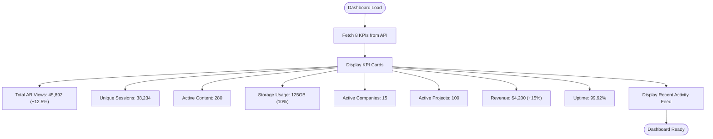
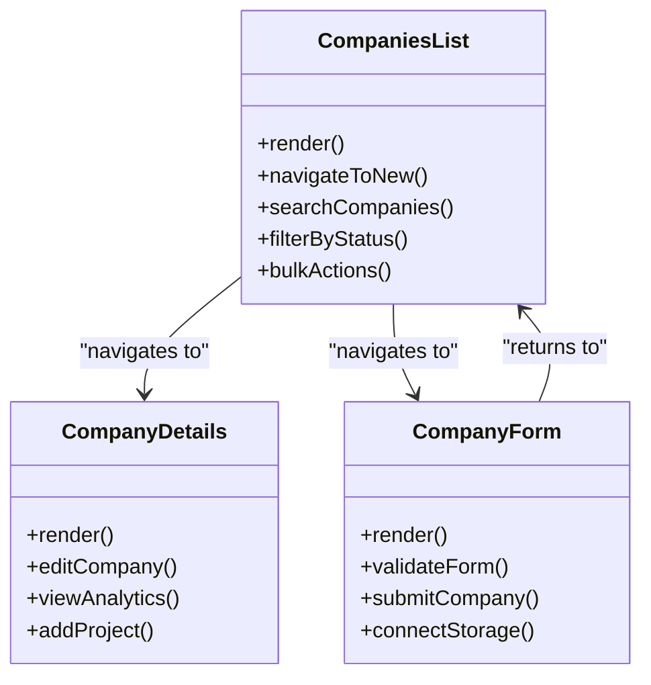
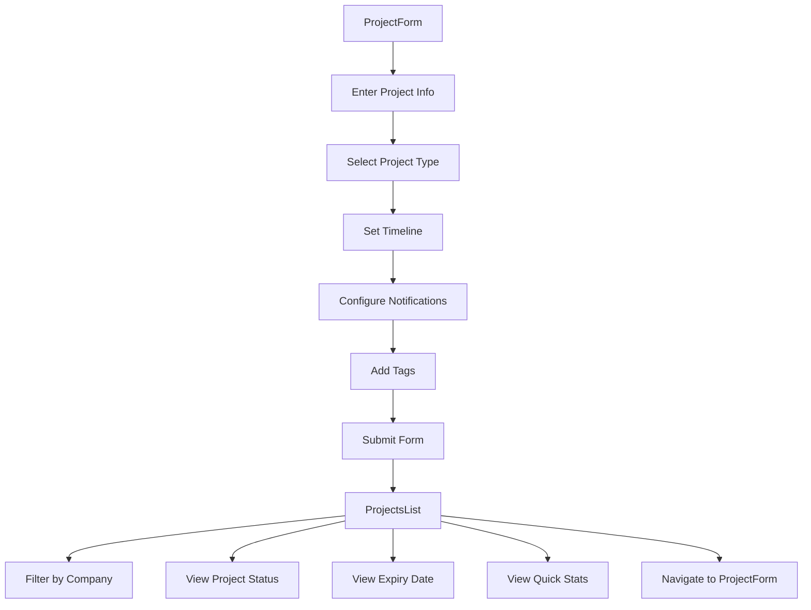
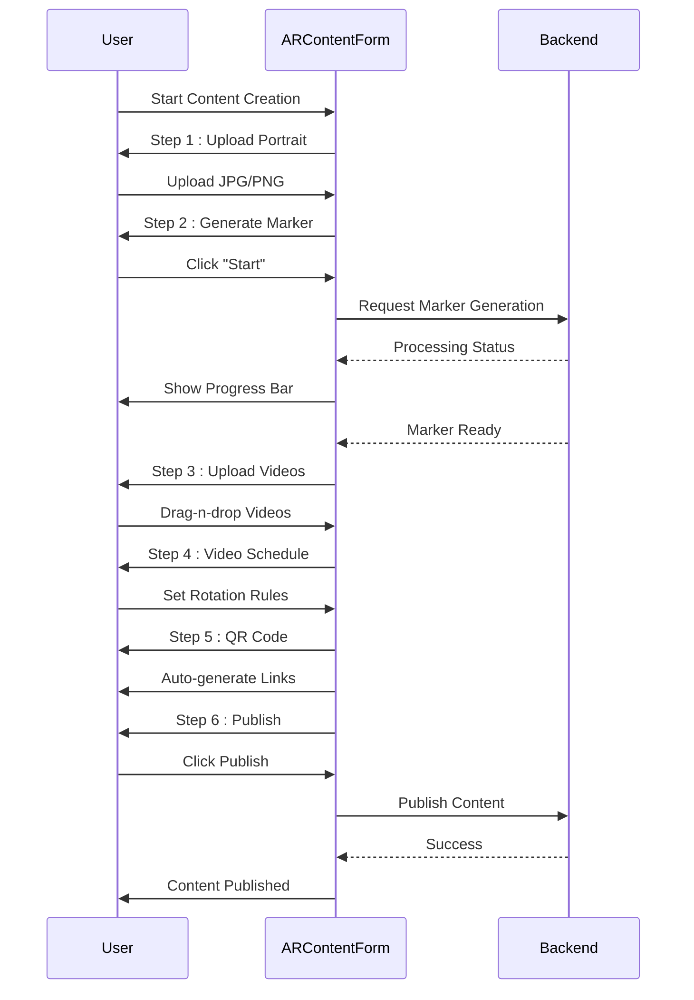
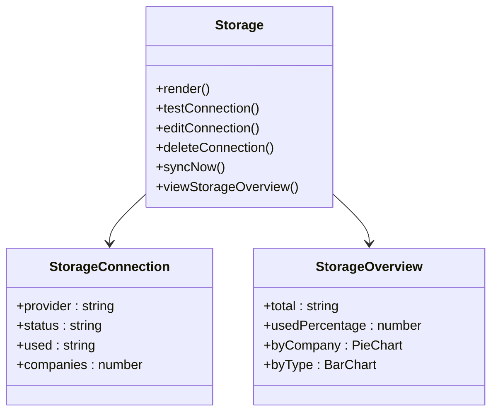
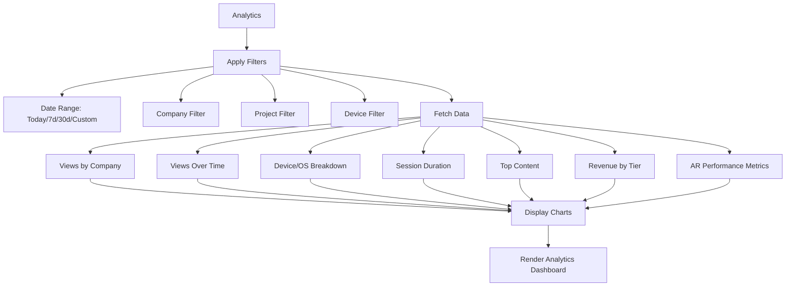
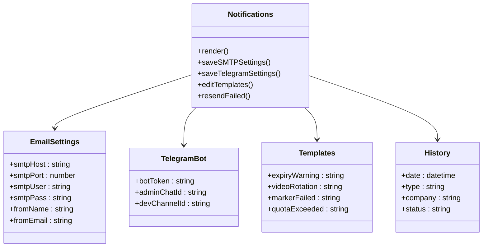
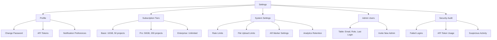
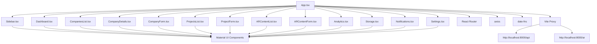

# Admin Panel Structure

<cite>
**Referenced Files in This Document**   
- [ADMIN_PANEL_STRUCTURE.md](file://ADMIN_PANEL_STRUCTURE.md)
- [app/main.py](file://app/main.py)
- [frontend/src/App.tsx](file://frontend/src/App.tsx)
- [frontend/src/components/layout/Sidebar.tsx](file://frontend/src/components/layout/Sidebar.tsx)
- [frontend/src/pages/Dashboard.tsx](file://frontend/src/pages/Dashboard.tsx)
- [frontend/src/pages/Analytics.tsx](file://frontend/src/pages/Analytics.tsx)
- [frontend/src/pages/Settings.tsx](file://frontend/src/pages/Settings.tsx)
- [frontend/src/pages/Storage.tsx](file://frontend/src/pages/Storage.tsx)
- [frontend/src/pages/companies/CompaniesList.tsx](file://frontend/src/pages/companies/CompaniesList.tsx)
- [frontend/src/pages/companies/CompanyDetails.tsx](file://frontend/src/pages/companies/CompanyDetails.tsx)
- [frontend/src/pages/companies/CompanyForm.tsx](file://frontend/src/pages/companies/CompanyForm.tsx)
- [frontend/src/pages/projects/ProjectsList.tsx](file://frontend/src/pages/projects/ProjectsList.tsx)
- [frontend/src/pages/projects/ProjectForm.tsx](file://frontend/src/pages/projects/ProjectForm.tsx)
- [frontend/src/pages/ar-content/ARContentList.tsx](file://frontend/src/pages/ar-content/ARContentList.tsx)
- [frontend/src/pages/ar-content/ARContentForm.tsx](file://frontend/src/pages/ar-content/ARContentForm.tsx)
- [frontend/vite.config.ts](file://frontend/vite.config.ts)
</cite>

## Table of Contents
1. [Introduction](#introduction)
2. [Project Structure](#project-structure)
3. [Core Components](#core-components)
4. [Architecture Overview](#architecture-overview)
5. [Detailed Component Analysis](#detailed-component-analysis)
6. [Dependency Analysis](#dependency-analysis)
7. [Performance Considerations](#performance-considerations)
8. [Troubleshooting Guide](#troubleshooting-guide)
9. [Conclusion](#conclusion)

## Introduction
The Vertex AR Admin Panel is a comprehensive B2B platform for managing AR content based on image recognition (NFT markers). The admin panel provides a complete interface for system administration, client management, content creation, and analytics. This document outlines the complete structure of the admin panel, including its frontend components, routing system, navigation, and integration with backend services.

## Project Structure
The admin panel is implemented as a React-based frontend application within the larger Vertex AR B2B Platform. The structure follows a component-based architecture with clear separation of concerns between different functional areas.

```mermaid
graph TD
subgraph "Frontend"
A[App.tsx] --> B[Sidebar.tsx]
A --> C[Dashboard.tsx]
A --> D[Companies]
A --> E[Projects]
A --> F[AR Content]
A --> G[Analytics.tsx]
A --> H[Storage.tsx]
A --> I[Notifications.tsx]
A --> J[Settings.tsx]
end
subgraph "Backend"
K[main.py] --> L[API Routes]
L --> M[/api/]
L --> N[/ar/]
end
Frontend < --> Backend
```

**Diagram sources**
- [frontend/src/App.tsx](file://frontend/src/App.tsx)
- [app/main.py](file://app/main.py)

**Section sources**
- [ADMIN_PANEL_STRUCTURE.md](file://ADMIN_PANEL_STRUCTURE.md)
- [frontend/src/App.tsx](file://frontend/src/App.tsx)

## Core Components
The admin panel consists of eight main sections that provide comprehensive management capabilities for the AR platform. Each section addresses a specific aspect of platform administration, from client management to system configuration.

**Section sources**
- [ADMIN_PANEL_STRUCTURE.md](file://ADMIN_PANEL_STRUCTURE.md)
- [frontend/src/App.tsx](file://frontend/src/App.tsx)
- [frontend/src/components/layout/Sidebar.tsx](file://frontend/src/components/layout/Sidebar.tsx)

## Architecture Overview
The admin panel follows a modern React architecture with TypeScript, utilizing Vite as the build tool and Material UI (MUI) for the component library. The application is structured around a main App component that manages routing and layout, with a sidebar navigation component providing access to all major sections.

```mermaid
graph TB
subgraph "UI Layer"
A[App.tsx] --> B[Sidebar Navigation]
A --> C[Main Content Area]
B --> D[Dashboard]
B --> E[Companies]
B --> F[Projects]
B --> G[AR Content]
B --> H[Analytics]
B --> I[Storage]
B --> J[Notifications]
B --> K[Settings]
end
subgraph "Routing"
L[React Router] --> M[/]
L --> N[/companies]
L --> O[/projects]
L --> P[/ar-content]
L --> Q[/analytics]
L --> R[/storage]
L --> S[/notifications]
L --> T[/settings]
end
subgraph "API Integration"
U[Vite Proxy] --> V[http://localhost:8000/api]
U --> W[http://localhost:8000/ar]
end
UI Layer --> Routing
Routing --> API Integration
```

**Diagram sources**
- [frontend/src/App.tsx](file://frontend/src/App.tsx)
- [frontend/vite.config.ts](file://frontend/vite.config.ts)
- [app/main.py](file://app/main.py)

## Detailed Component Analysis

### Dashboard Analysis
The Dashboard component serves as the central hub of the admin panel, providing an overview of key performance indicators and system metrics. It displays eight KPI cards with real-time data on AR views, unique sessions, active content, storage usage, active companies, active projects, revenue, and system uptime.



**Diagram sources**
- [frontend/src/pages/Dashboard.tsx](file://frontend/src/pages/Dashboard.tsx)

**Section sources**
- [frontend/src/pages/Dashboard.tsx](file://frontend/src/pages/Dashboard.tsx)
- [ADMIN_PANEL_STRUCTURE.md](file://ADMIN_PANEL_STRUCTURE.md)

### Companies Management Analysis
The Companies section provides comprehensive tools for managing client organizations within the AR platform. It includes functionality for creating, viewing, and editing company profiles, as well as managing their subscriptions and storage allocations.



**Diagram sources**
- [frontend/src/pages/companies/CompaniesList.tsx](file://frontend/src/pages/companies/CompaniesList.tsx)
- [frontend/src/pages/companies/CompanyDetails.tsx](file://frontend/src/pages/companies/CompanyDetails.tsx)
- [frontend/src/pages/companies/CompanyForm.tsx](file://frontend/src/pages/companies/CompanyForm.tsx)

**Section sources**
- [frontend/src/pages/companies/CompaniesList.tsx](file://frontend/src/pages/companies/CompaniesList.tsx)
- [frontend/src/pages/companies/CompanyDetails.tsx](file://frontend/src/pages/companies/CompanyDetails.tsx)
- [frontend/src/pages/companies/CompanyForm.tsx](file://frontend/src/pages/companies/CompanyForm.tsx)
- [ADMIN_PANEL_STRUCTURE.md](file://ADMIN_PANEL_STRUCTURE.md)

### Projects Management Analysis
The Projects section enables administrators to manage project folders for client organizations. Projects serve as containers for AR content and can be associated with specific timelines and notification settings.



**Diagram sources**
- [frontend/src/pages/projects/ProjectsList.tsx](file://frontend/src/pages/projects/ProjectsList.tsx)
- [frontend/src/pages/projects/ProjectForm.tsx](file://frontend/src/pages/projects/ProjectForm.tsx)

**Section sources**
- [frontend/src/pages/projects/ProjectsList.tsx](file://frontend/src/pages/projects/ProjectsList.tsx)
- [frontend/src/pages/projects/ProjectForm.tsx](file://frontend/src/pages/projects/ProjectForm.tsx)
- [ADMIN_PANEL_STRUCTURE.md](file://ADMIN_PANEL_STRUCTURE.md)

### AR Content Management Analysis
The AR Content section provides a comprehensive workflow for creating and managing AR experiences. It features a six-step wizard for content creation, including portrait upload, marker generation, video upload, schedule configuration, QR code generation, and publishing.



**Diagram sources**
- [frontend/src/pages/ar-content/ARContentList.tsx](file://frontend/src/pages/ar-content/ARContentList.tsx)
- [frontend/src/pages/ar-content/ARContentForm.tsx](file://frontend/src/pages/ar-content/ARContentForm.tsx)

**Section sources**
- [frontend/src/pages/ar-content/ARContentList.tsx](file://frontend/src/pages/ar-content/ARContentList.tsx)
- [frontend/src/pages/ar-content/ARContentForm.tsx](file://frontend/src/pages/ar-content/ARContentForm.tsx)
- [ADMIN_PANEL_STRUCTURE.md](file://ADMIN_PANEL_STRUCTURE.md)

### Storage Management Analysis
The Storage section provides tools for managing storage connections and monitoring usage across the platform. It supports multiple storage providers including Local, MinIO, and Yandex Disk.



**Diagram sources**
- [frontend/src/pages/Storage.tsx](file://frontend/src/pages/Storage.tsx)

**Section sources**
- [frontend/src/pages/Storage.tsx](file://frontend/src/pages/Storage.tsx)
- [ADMIN_PANEL_STRUCTURE.md](file://ADMIN_PANEL_STRUCTURE.md)

### Analytics Analysis
The Analytics section provides comprehensive reporting and visualization tools for tracking platform performance and user engagement. It includes filters for date range, company, project, and device type, with multiple chart types for data visualization.



**Diagram sources**
- [frontend/src/pages/Analytics.tsx](file://frontend/src/pages/Analytics.tsx)

**Section sources**
- [frontend/src/pages/Analytics.tsx](file://frontend/src/pages/Analytics.tsx)
- [ADMIN_PANEL_STRUCTURE.md](file://ADMIN_PANEL_STRUCTURE.md)

### Notifications Analysis
The Notifications section manages communication settings for the platform, including email and Telegram configurations, message templates, and notification history.



**Diagram sources**
- [ADMIN_PANEL_STRUCTURE.md](file://ADMIN_PANEL_STRUCTURE.md)

**Section sources**
- [ADMIN_PANEL_STRUCTURE.md](file://ADMIN_PANEL_STRUCTURE.md)

### Settings Analysis
The Settings section provides system-wide configuration options, including subscription tiers, rate limits, file upload limits, and administrative user management.



**Diagram sources**
- [frontend/src/pages/Settings.tsx](file://frontend/src/pages/Settings.tsx)

**Section sources**
- [frontend/src/pages/Settings.tsx](file://frontend/src/pages/Settings.tsx)
- [ADMIN_PANEL_STRUCTURE.md](file://ADMIN_PANEL_STRUCTURE.md)

## Dependency Analysis
The admin panel has well-defined dependencies both internally within the frontend application and externally with the backend API services. The dependency structure ensures modularity and maintainability.



**Diagram sources**
- [frontend/src/App.tsx](file://frontend/src/App.tsx)
- [frontend/vite.config.ts](file://frontend/vite.config.ts)
- [app/main.py](file://app/main.py)

**Section sources**
- [frontend/src/App.tsx](file://frontend/src/App.tsx)
- [frontend/vite.config.ts](file://frontend/vite.config.ts)
- [app/main.py](file://app/main.py)

## Performance Considerations
The admin panel is designed with performance in mind, utilizing modern React patterns and optimization techniques. The Vite build tool ensures fast development server startup and hot module replacement. The application structure minimizes unnecessary re-renders through proper component design and state management.

The proxy configuration in vite.config.ts enables efficient API communication by routing requests directly to the backend server without CORS issues. The modular component structure allows for code splitting and lazy loading of routes, which will improve initial load times in production.

The dashboard's KPI cards are designed to display real-time data efficiently, with the potential for data caching and incremental updates to minimize API calls. The analytics section will benefit from data visualization optimization, particularly when rendering large datasets in charts.

**Section sources**
- [frontend/vite.config.ts](file://frontend/vite.config.ts)
- [frontend/src/App.tsx](file://frontend/src/App.tsx)
- [ADMIN_PANEL_STRUCTURE.md](file://ADMIN_PANEL_STRUCTURE.md)

## Troubleshooting Guide
When encountering issues with the admin panel, consider the following common problems and solutions:

1. **API Connection Issues**: Verify that the backend server is running on port 8000 and that the proxy configuration in vite.config.ts is correct.

2. **Routing Problems**: Ensure that React Router is properly configured in App.tsx with the correct route paths and component mappings.

3. **Authentication Errors**: Check that the authentication flow is properly implemented and that API requests include necessary authorization headers.

4. **Component Rendering Issues**: Verify that all required dependencies are installed and that component imports are correct.

5. **State Management Problems**: Ensure that component state is properly managed and that state updates trigger the expected re-renders.

**Section sources**
- [frontend/src/App.tsx](file://frontend/src/App.tsx)
- [frontend/vite.config.ts](file://frontend/vite.config.ts)
- [app/main.py](file://app/main.py)

## Conclusion
The Vertex AR Admin Panel is a comprehensive management interface for the B2B AR platform, providing eight main sections for system administration, client management, content creation, and analytics. The frontend application is well-structured with a clear component hierarchy and routing system, making it maintainable and extensible. The integration with the backend API through Vite proxy ensures smooth communication between the frontend and backend services. With its modern technology stack including React, TypeScript, Vite, and Material UI, the admin panel is positioned for efficient development and a high-quality user experience.