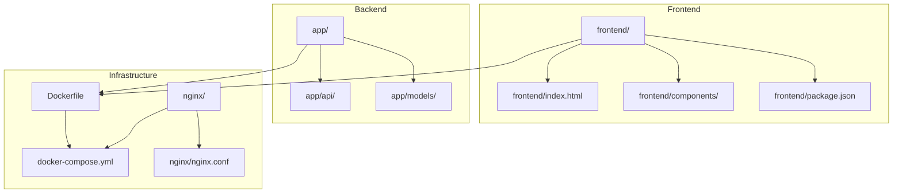
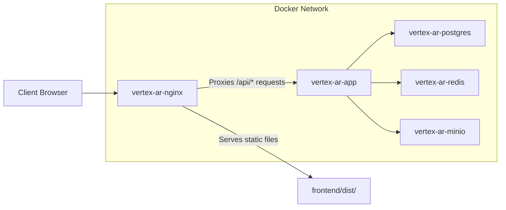
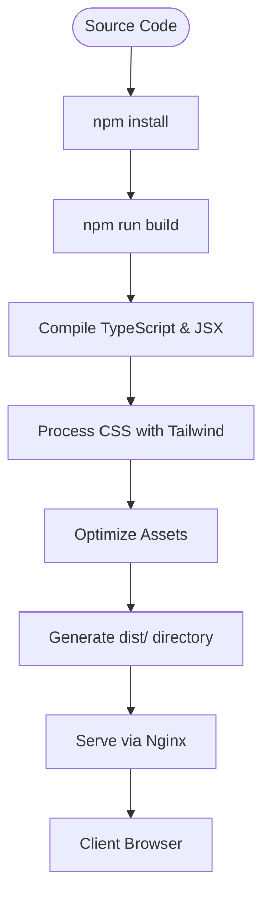
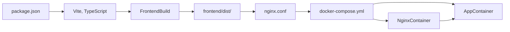
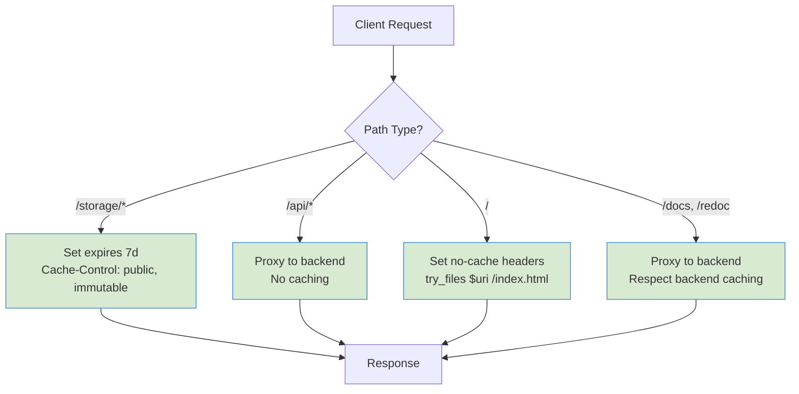

# Build and Deployment

<cite>
**Referenced Files in This Document**   
- [frontend/index.html](file://frontend/index.html)
- [Dockerfile](file://Dockerfile)
- [docker-compose.yml](file://docker-compose.yml)
- [nginx/nginx.conf](file://nginx/nginx.conf)
- [frontend/package.json](file://frontend/package.json)
- [.dockerignore](file://.dockerignore)
</cite>

## Table of Contents
1. [Introduction](#introduction)
2. [Project Structure](#project-structure)
3. [Core Components](#core-components)
4. [Architecture Overview](#architecture-overview)
5. [Detailed Component Analysis](#detailed-component-analysis)
6. [Dependency Analysis](#dependency-analysis)
7. [Performance Considerations](#performance-considerations)
8. [Troubleshooting Guide](#troubleshooting-guide)
9. [Conclusion](#conclusion)

## Introduction
This document provides comprehensive architectural documentation for the frontend build process and deployment pipeline of the Vertex AR B2B platform. It details how the React-based admin panel is built, optimized, and served through Nginx as a static asset server within a Dockerized environment. The documentation covers the role of index.html as the single-page application (SPA) entry point, build configuration, asset optimization techniques, cache strategies, and Nginx routing configuration for both frontend assets and backend API requests.

## Project Structure
The project follows a modular structure with clear separation between frontend and backend components. The frontend React application resides in the `frontend/` directory and is designed to be built as static assets served by Nginx. The backend FastAPI application is located in the `app/` directory, while Nginx configuration is maintained in the `nginx/` directory. The Dockerized deployment architecture integrates these components through docker-compose, with Nginx acting as the reverse proxy and static file server.



**Diagram sources**
- [frontend/index.html](file://frontend/index.html)
- [Dockerfile](file://Dockerfile)
- [docker-compose.yml](file://docker-compose.yml)
- [nginx/nginx.conf](file://nginx/nginx.conf)

**Section sources**
- [frontend/index.html](file://frontend/index.html)
- [Dockerfile](file://Dockerfile)
- [docker-compose.yml](file://docker-compose.yml)
- [nginx/nginx.conf](file://nginx/nginx.conf)

## Core Components
The core components of the build and deployment pipeline include the React frontend application, the Vite build system (inferred from package.json), the Nginx web server, and the Docker containerization infrastructure. The frontend is configured as a SPA with index.html serving as the entry point, while Nginx handles both static asset serving and API request routing to the backend FastAPI application.

**Section sources**
- [frontend/index.html](file://frontend/index.html)
- [frontend/package.json](file://frontend/package.json)
- [nginx/nginx.conf](file://nginx/nginx.conf)
- [Dockerfile](file://Dockerfile)

## Architecture Overview
The deployment architecture follows a microservices pattern with Nginx as the edge server that serves static frontend assets and proxies API requests to the backend service. The React application is built into static files and mounted into the Nginx container, while the FastAPI backend runs in a separate container. This separation allows for independent scaling and deployment of frontend and backend components.



**Diagram sources**
- [docker-compose.yml](file://docker-compose.yml)
- [nginx/nginx.conf](file://nginx/nginx.conf)

## Detailed Component Analysis

### Frontend Build Process
The frontend build process is managed through npm scripts (inferred from package.json) using Vite as the build tool. The React application is compiled into optimized static assets and placed in a distribution directory that is served by Nginx. The build process includes TypeScript compilation, JSX transformation, CSS processing with TailwindCSS, and asset optimization.



**Diagram sources**
- [frontend/package.json](file://frontend/package.json)
- [frontend/index.html](file://frontend/index.html)

### index.html as SPA Entry Point
The index.html file serves as the single entry point for the React SPA, containing the root div element where the React application is mounted. It includes inline CSS for initial loading states and provides navigation to API documentation and health endpoints during development. The file is designed to support client-side routing through the use of a catch-all route configuration in Nginx.

**Section sources**
- [frontend/index.html](file://frontend/index.html)

### Dockerized Deployment Architecture
The Dockerized deployment architecture integrates the frontend and backend services through docker-compose, with Nginx acting as a reverse proxy. The frontend static assets are mounted into the Nginx container from the host's frontend/dist directory, while API requests are proxied to the FastAPI backend running in a separate container.

```mermaid
graph TD
subgraph "Docker Containers"
Nginx[nginx:alpine]
App[FastAPI App]
DB[PostgreSQL]
Cache[Redis]
Storage[MinIO]
end
User[User] --> Nginx
Nginx --> |Static Assets| FrontendDist["./frontend/dist"]
Nginx --> |API Requests| App
App --> DB
App --> Cache
App --> Storage
style FrontendDist fill:#f9f,stroke:#333
linkStyle 0 stroke:#000;
linkStyle 1 stroke:#000;
linkStyle 2 stroke:#000;
linkStyle 3 stroke:#000;
linkStyle 4 stroke:#000;
linkStyle 5 stroke:#000;
```

**Diagram sources**
- [docker-compose.yml](file://docker-compose.yml)
- [Dockerfile](file://Dockerfile)

## Dependency Analysis
The build and deployment pipeline has several key dependencies between components. The Nginx container depends on the successful build of frontend assets, while the docker-compose configuration establishes service dependencies between Nginx and the backend application. The .dockerignore file ensures that build artifacts and node_modules are excluded from the Docker context, optimizing build performance.



**Diagram sources**
- [frontend/package.json](file://frontend/package.json)
- [.dockerignore](file://.dockerignore)
- [docker-compose.yml](file://docker-compose.yml)
- [nginx/nginx.conf](file://nginx/nginx.conf)

**Section sources**
- [frontend/package.json](file://frontend/package.json)
- [.dockerignore](file://.dockerignore)
- [docker-compose.yml](file://docker-compose.yml)
- [nginx/nginx.conf](file://nginx/nginx.conf)

## Performance Considerations
The deployment pipeline implements several performance optimizations. Nginx is configured with gzip compression for text-based assets and appropriate cache headers for static files. The React application benefits from Vite's optimized build process, which includes code splitting, tree shaking, and minification. The Nginx configuration also includes performance settings such as sendfile, tcp_nopush, and tcp_nodelay to optimize network transmission.

### Asset Optimization and Caching Strategy
The caching strategy differentiates between immutable static assets and dynamic content. Static assets in the /storage/ path are served with a 7-day expiration and immutable cache headers, while the SPA index.html is served with no-cache directives to ensure users receive the latest version after deployments.



**Diagram sources**
- [nginx/nginx.conf](file://nginx/nginx.conf)

## Troubleshooting Guide
Common issues in the build and deployment pipeline typically relate to asset paths, cache invalidation, or proxy configuration. The Nginx error logs and access logs provide valuable information for diagnosing routing issues. During development, the docker-compose.override.yml file enables hot reloading of backend code, while frontend development typically occurs outside the containerized environment.

**Section sources**
- [nginx/nginx.conf](file://nginx/nginx.conf)
- [docker-compose.yml](file://docker-compose.yml)
- [docker-compose.override.yml](file://docker-compose.override.yml)

## Conclusion
The Vertex AR platform employs a robust build and deployment architecture that effectively separates frontend and backend concerns while maintaining seamless integration through Nginx proxying. The React SPA is built using modern tooling and served as static assets with appropriate caching strategies, while API requests are efficiently routed to the backend service. This architecture provides excellent performance, scalability, and maintainability for the B2B platform.